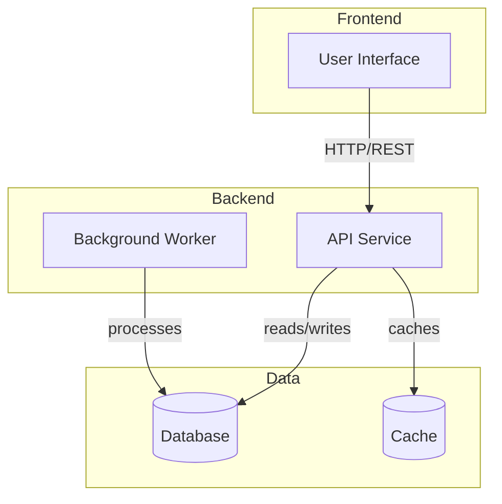

# {{PROJECT_NAME}} - Container View (C4 Level 2)

The container view shows the major deployable units that make up {{PROJECT_NAME}}.

## Containers

### Frontend

| Container | Technology | Description |
|-----------|------------|-------------|
| User Interface | React/Vue/etc | Primary user interface |

### Backend

| Container | Technology | Description |
|-----------|------------|-------------|
| API Service | Python/Node/etc | REST API endpoints |
| Background Worker | Python/Node/etc | Async task processing |

### Data

| Container | Technology | Description |
|-----------|------------|-------------|
| Database | PostgreSQL/DynamoDB/etc | Primary data store |
| Cache | Redis/Memcached/etc | Performance optimization |

## Communication

| From | To | Protocol | Auth | Notes |
|------|----|----------|------|-------|
| UI | API | HTTPS | JWT/Cookie | All requests authenticated |
| API | DB | TCP | IAM/Password | Encrypted in transit |
| Worker | DB | TCP | IAM/Password | Batch operations |

---

[← Context View](0001a-context-view.md) | [Runtime View →](0001c-runtime-view.md)
