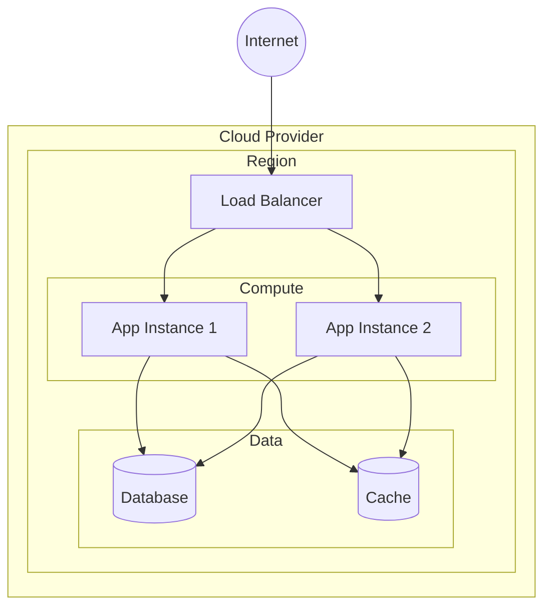
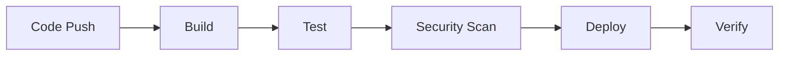

# {{PROJECT_NAME}} - Deployment View

Infrastructure, deployment topology, and CI/CD for {{PROJECT_NAME}}.

## Infrastructure Overview

## Environments

| Environment | Purpose | URL |
|-------------|---------|-----|
| Development | Local development | localhost |
| Staging | Pre-production testing | staging.example.com |
| Production | Live system | example.com |

## CI/CD Pipeline

### Pipeline Stages

| Stage | Tools | Duration |
|-------|-------|----------|
| Build | Docker/npm/poetry | ~2min |
| Test | pytest/jest | ~5min |
| Security | Dependabot/SAST | ~3min |
| Deploy | GitHub Actions/AWS | ~5min |
| Verify | Smoke tests | ~2min |

## Deployment Checklist

- [ ] All tests passing
- [ ] Security scan clean
- [ ] Database migrations applied
- [ ] Feature flags configured
- [ ] Monitoring alerts set up
- [ ] Rollback plan documented

## Rollback Procedure

1. Identify the issue
2. Trigger rollback via CI/CD or manual
3. Verify rollback success
4. Investigate root cause
5. Create fix and redeploy

---

[← Quality Attributes](0001e-quality-attributes.md) | [Glossary →](0001g-glossary.md)
