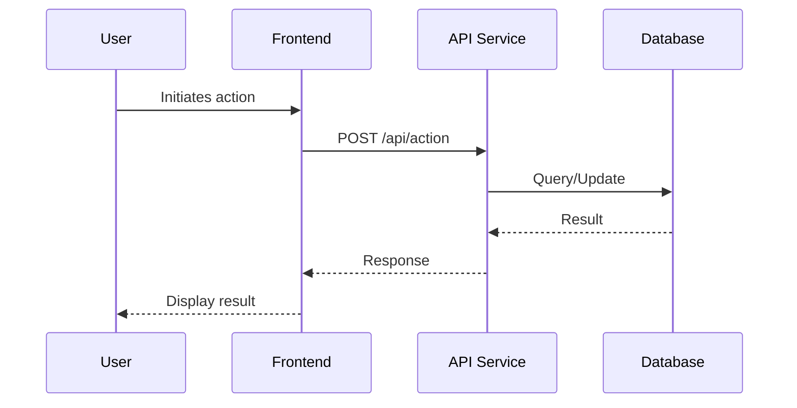
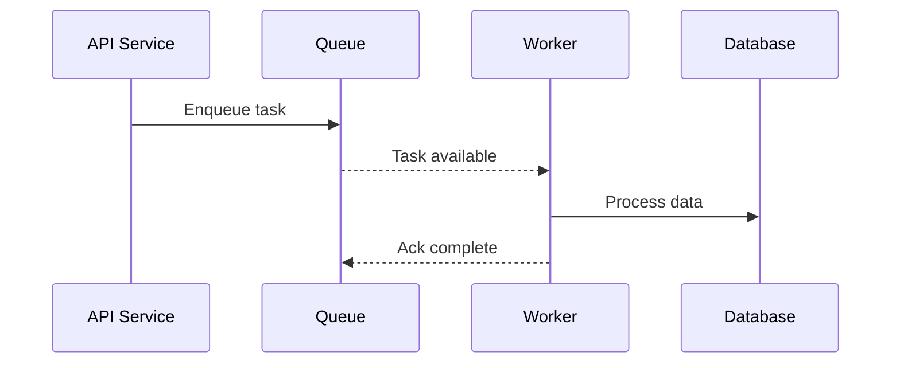
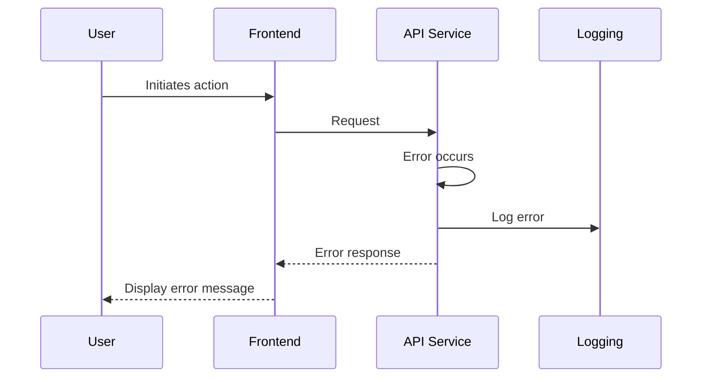

# {{PROJECT_NAME}} - Runtime View

Key flows and sequence diagrams showing how {{PROJECT_NAME}} components interact at runtime.

## Primary User Flow

## Background Processing Flow

## Error Handling Flow

## Key Scenarios

| Scenario | Description | Latency Target |
|----------|-------------|----------------|
| Primary Flow | Standard user operation | <500ms |
| Background Processing | Async task completion | <30s |
| Error Recovery | Graceful degradation | <1s |

---

[← Container View](0001b-container-view.md) | [ADR Digest →](0001d-adr-digest.md)
