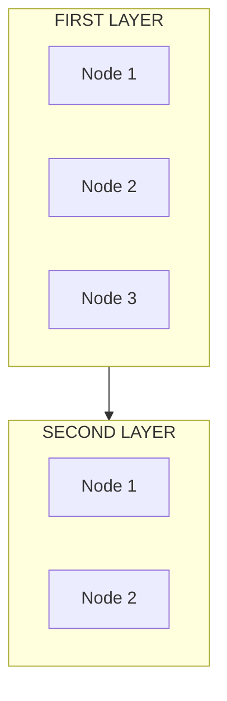

# 0839 - Wiki Alignment Audit

## Purpose

Verify that GitHub Wiki content matches repository documentation and that the local wiki setup is healthy. Catches:
- Wiki pages that are out of sync with repo docs
- Broken links between wiki and repo
- Missing wiki pages for key docs
- **Duplicate local wiki clones** (common when cloned at different times)
- **Wiki branch divergence** (main vs master, local vs remote)
- **Dead internal links** (wiki pages linking to non-existent pages)
- **Diagram balance issues** (Mermaid diagrams that are too vertical/horizontal)

## Trigger

- Monthly (part of full audit suite)
- After major documentation updates
- When wiki structure changes
- During `/cleanup --full`

## Philosophy

> "One source of truth, locally and remotely."

Multiple local wiki clones create confusion and merge conflicts. Branch divergence between local and remote creates phantom differences.

---

## Procedure

### Step 1: Check Wiki Status

Verify the repository has a wiki enabled on GitHub:

```bash
# Check if wiki exists on GitHub
gh api repos/{{GITHUB_REPO}} --jq '.has_wiki'
```

If `false`, wiki is disabled. Mark as N/A and skip remaining steps.

### Step 2: Check for Duplicate Local Wiki Clones (CRITICAL)

**Find ALL local wiki directories:**

```bash
# Search for wiki directories in the projects folder
# Pattern 1: Repo.wiki (dotted)
# Pattern 2: Repo-wiki (hyphenated)
# Pattern 3: Any directory with .wiki.git in config

ls -la /c/Users/*/Projects/ | grep -i "{{REPO_NAME}}"
ls -la /c/Users/*/Projects/ | grep -i wiki

# For each suspected wiki directory, check if it's a wiki clone:
git -C /path/to/suspected-wiki remote -v 2>/dev/null | grep -q ".wiki.git" && echo "Wiki clone found"
```

**Check for multiple clones:**

```bash
# Find all wiki clones for this repo
find /c/Users/*/Projects -maxdepth 1 -type d -name "*{{REPO_NAME}}*wiki*" -o -name "*{{REPO_NAME}}.wiki" 2>/dev/null | while read dir; do
  if git -C "$dir" remote -v 2>/dev/null | grep -q "{{GITHUB_REPO}}.wiki.git"; then
    echo "Wiki clone: $dir"
    git -C "$dir" branch -a
  fi
done
```

**Finding:** Multiple wiki clones = **FAIL**. Action: Consolidate to single clone.

### Step 3: Check Wiki Branch Divergence (CRITICAL)

For each local wiki clone, verify branch alignment:

```bash
# Check what branch local tracks
git -C /path/to/wiki branch -vv

# Check remote default branch
git -C /path/to/wiki remote show origin | grep "HEAD branch"

# Check if local is on correct default branch
git -C /path/to/wiki fetch origin
git -C /path/to/wiki log --oneline HEAD..origin/HEAD | wc -l  # Should be 0
git -C /path/to/wiki log --oneline origin/HEAD..HEAD | wc -l  # Should be 0
```

**Check for orphaned branches:**

```bash
# List all local and remote branches
git -C /path/to/wiki branch -a

# If both 'main' and 'master' exist locally, one may be stale
```

**Finding:** Branch divergence = **FAIL**. Action: Align to remote default branch.

### Step 4: List Wiki Pages

```bash
# Clone wiki repo to temp location (if not already local)
WIKI_DIR="/tmp/wiki-audit-{{REPO_NAME}}"
git clone https://github.com/{{GITHUB_REPO}}.wiki.git "$WIKI_DIR" 2>/dev/null || git -C "$WIKI_DIR" pull

# List wiki pages
ls "$WIKI_DIR"/*.md
```

### Step 5: Compare with Repo Docs

For each wiki page, check if corresponding repo doc exists:

```bash
# For each wiki page, find matching repo doc
for wiki_page in "$WIKI_DIR"/*.md; do
  basename=$(basename "$wiki_page" .md)

  # Check if matching doc exists
  find docs -name "*$basename*" -type f
done
```

### Step 6: Check for Staleness

Compare modification dates:

```bash
# Wiki last modified
git -C "$WIKI_DIR" log -1 --format="%ci" -- "Page.md"

# Repo doc last modified
git log -1 --format="%ci" -- "docs/page.md"
```

### Step 7: Check External Links

Verify links in wiki point to valid repo locations:

```bash
# Extract links from wiki page
grep -oP '\[.*?\]\(.*?\)' "$WIKI_DIR"/Page.md

# Check if targets exist (manual verification)
```

### Step 8: Check Internal Wiki Links (DEAD LINK DETECTION)

**Extract all internal wiki links and verify targets exist:**

```bash
# Find all internal wiki links (format: [Text](Page-Name) without http/https)
for wiki_page in "$WIKI_DIR"/*.md; do
  echo "Checking: $(basename $wiki_page)"

  # Extract internal links (no protocol prefix)
  grep -oP '\]\([A-Za-z0-9-]+\)' "$wiki_page" | tr -d '[]()' | sort -u | while read link; do
    # Check if target page exists
    if [ ! -f "$WIKI_DIR/$link.md" ]; then
      echo "  DEAD LINK: $link (in $(basename $wiki_page))"
    fi
  done
done
```

**Expected internal links should resolve to:**
- `Home.md` for `[link](Home)`
- `Page-Name.md` for `[link](Page-Name)`

**Finding:** Dead internal links = **FAIL**. Action: Create missing page or fix link.

### Step 9: Check Diagram Balance (MERMAID READABILITY)

**Identify Mermaid diagrams and assess layout balance:**

```bash
# Find all Mermaid diagrams
for wiki_page in "$WIKI_DIR"/*.md; do
  echo "Checking diagrams in: $(basename $wiki_page)"

  # Extract diagram type (graph TD, graph LR, etc.)
  grep -A1 '```mermaid' "$wiki_page" | grep -E 'graph (TD|LR|TB|BT|RL)' | while read line; do
    echo "  Found: $line"
  done
done
```

**Balance Assessment Criteria:**

| Issue | Symptoms | Solution |
|-------|----------|----------|
| **Too vertical** | `graph TD` with 6+ sequential nodes in single chain | Add horizontal subgraphs with `direction LR` |
| **Too horizontal** | `graph LR` with 6+ sequential nodes in single chain | Change to `graph TD` with `direction LR` inside subgraphs |
| **Balanced** | Mixed layout using subgraphs to group related nodes | No action needed |

**Manual Review Required:**
1. Open each wiki page with Mermaid diagrams
2. Check if diagram fits reasonably on screen (desktop width ~1200px)
3. User should not need to scroll horizontally OR vertically excessively

**Finding:** Diagram requires excessive scrolling = **NEEDS ATTENTION**. Action: Rebalance using subgraph technique.

**Recommended Pattern for Balanced Diagrams:**


This creates vertical flow between layers, horizontal arrangement within layers.

### Step 10: Cleanup

```bash
rm -rf "$WIKI_DIR"
```

---

## Remediation Actions

| Finding | Severity | Action |
|---------|----------|--------|
| Multiple wiki clones | HIGH | Delete redundant clones, keep one canonical location |
| Branch divergence (local behind remote) | MEDIUM | `git pull --rebase` to sync |
| Branch divergence (local ahead) | MEDIUM | Review unpushed changes, push or discard |
| Local on wrong branch (e.g., master when remote default is main) | MEDIUM | `git checkout main && git branch -D master` |
| **Dead internal links** | **MEDIUM** | Create missing page or correct link target |
| **Diagram too vertical** | **LOW** | Add `direction LR` inside subgraphs |
| **Diagram too horizontal** | **LOW** | Use `graph TD` with subgraphs |
| Wiki page older than repo doc | LOW | Update wiki from repo |
| Wiki page newer than repo doc | LOW | Review - wiki may have updates to merge |
| Broken external links | LOW | Fix links in wiki |
| Missing wiki page | INFO | Create page if needed for discoverability |

---

## Auto-Fix Capability

This audit does NOT auto-fix. Duplicate clones and branch issues require human judgment:
- Which clone has the latest changes?
- Are there uncommitted changes in any clone?
- What is the canonical location?

**Recommendation:** Flag issues, require human confirmation before destructive operations.

---

## Output Format

```markdown
## Wiki Alignment Audit - {DATE}

### Local Clone Health
| Check | Status | Details |
|-------|--------|---------|
| Single local clone | PASS/FAIL | Found N clones at: path1, path2 |
| Branch alignment | PASS/FAIL | Local on {branch}, remote default is {branch} |
| Sync status | PASS/FAIL | N commits ahead, N commits behind |

### Content Alignment
| Wiki Page | Repo Doc | Status | Last Wiki | Last Repo |
|-----------|----------|--------|-----------|-----------|
| Home | README.md | SYNC | Jan 10 | Jan 10 |
| Setup | docs/setup.md | STALE | Dec 15 | Jan 5 |

### Internal Link Health
| Source Page | Dead Links | Status |
|-------------|------------|--------|
| Home.md | None | PASS |
| Quick-Start.md | Tools-Reference | FAIL |
| _Sidebar.md | None | PASS |

### Diagram Balance
| Page | Diagram Type | Balance | Notes |
|------|--------------|---------|-------|
| Home.md | graph TD w/ subgraphs | BALANCED | Uses direction LR in subgraphs |
| LangGraph-Evolution.md | graph TD w/ subgraphs | BALANCED | Good vertical-horizontal mix |
| Multi-Agent-Orchestration.md | graph LR | BALANCED | Simple horizontal flows |

### Issues Found
- [ ] Multiple wiki clones detected
- [ ] Branch divergence detected
- [ ] Dead internal links found
- [ ] Diagrams need rebalancing

### Recommendations
1. Delete redundant clone at /path/to/clone
2. Checkout main branch in canonical wiki
3. Create missing wiki pages: Page-Name
4. Rebalance diagrams in: Page.md
```

---

## Audit Record

| Date | Auditor | Findings | Issues |
|------|---------|----------|--------|
| | | | |

---

## History

| Date | Change |
|------|--------|
| 2026-01-21 | Added dead internal link detection (Step 8) and diagram balance checking (Step 9). |
| 2026-01-18 | Created with duplicate clone and branch divergence checks (from Aletheia audit finding). |

