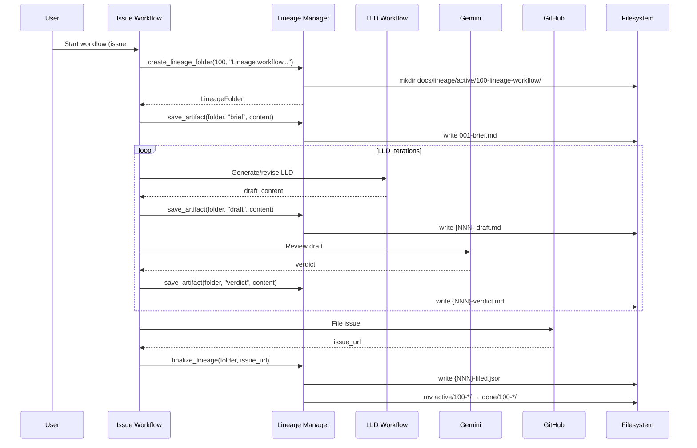

# 1100 - Feature: Lineage Workflow Integration

<!-- Template Metadata
Last Updated: 2025-01-XX
Updated By: Initial draft
Update Reason: New LLD for lineage workflow standardization
Previous: N/A
-->

## 1. Context & Goal
* **Issue:** #100
* **Objective:** Standardize design review artifacts in `docs/lineage/` for both issue and LLD workflows
* **Status:** Draft
* **Related Issues:** Standard 0009 (updated), RCA-PDF lineage rename (done)

### Open Questions
*Questions that need clarification before or during implementation. Remove when resolved.*

- [ ] Should the issue workflow auto-detect if it's being run from an existing lineage folder?
- [ ] What happens if numbering gets out of sync (e.g., manual file additions)?

## 2. Proposed Changes

*This section is the **source of truth** for implementation. Describe exactly what will be built.*

### 2.1 Files Changed

| File | Change Type | Description |
|------|-------------|-------------|
| `tools/issue-workflow.py` | Modify | Add lineage folder creation and artifact management |
| `tools/lld-workflow.py` | Modify | Integrate with lineage folder when called from issue workflow |
| `tools/new-repo-setup.py` | Modify | Create `docs/lineage/active/` and `docs/lineage/done/` directories |
| `tools/lineage_manager.py` | Add | Shared module for lineage artifact management |

### 2.1.1 Path Validation (Mechanical - Auto-Checked)

*Issue #277: Before human or Gemini review, paths are verified programmatically.*

Mechanical validation automatically checks:
- All "Modify" files must exist in repository
- All "Delete" files must exist in repository
- All "Add" files must have existing parent directories
- No placeholder prefixes (`src/`, `lib/`, `app/`) unless directory exists

**If validation fails, the LLD is BLOCKED before reaching review.**

### 2.2 Dependencies

*New packages, APIs, or services required.*

```toml
# pyproject.toml additions (if any)
# None required - using standard library only
```

### 2.3 Data Structures

```python
# Pseudocode - NOT implementation
class LineageArtifact(TypedDict):
    sequence_number: int      # 001, 002, etc.
    artifact_type: str        # "brief", "draft", "verdict", "filed"
    filename: str             # "001-brief.md"
    created_at: str           # ISO timestamp

class LineageFolder(TypedDict):
    issue_id: int             # GitHub issue number
    short_description: str    # Slug from issue title
    folder_name: str          # "100-lineage-workflow-integration"
    path: Path                # Full path to lineage folder
    status: str               # "active" or "done"
    artifacts: list[LineageArtifact]

class FiledMetadata(TypedDict):
    issue_url: str            # GitHub issue URL
    issue_number: int         # GitHub issue number
    filed_at: str             # ISO timestamp
    final_artifact_number: int # Sequence number of filed.json
    artifacts_count: int      # Total artifacts in lineage
```

### 2.4 Function Signatures

```python
# lineage_manager.py - Signatures only

def create_lineage_folder(issue_id: int, title: str) -> LineageFolder:
    """Create new lineage folder in docs/lineage/active/."""
    ...

def get_lineage_folder(issue_id: int) -> LineageFolder | None:
    """Find existing lineage folder for issue (active or done)."""
    ...

def get_next_sequence_number(folder: LineageFolder) -> int:
    """Return next available sequence number for artifacts."""
    ...

def save_artifact(
    folder: LineageFolder,
    artifact_type: str,
    content: str
) -> LineageArtifact:
    """Save artifact with auto-incrementing sequence number."""
    ...

def finalize_lineage(
    folder: LineageFolder,
    issue_url: str
) -> Path:
    """Save filed.json and move folder to docs/lineage/done/."""
    ...

def slugify_title(title: str) -> str:
    """Convert issue title to folder-safe slug."""
    ...

# issue-workflow.py additions

def init_lineage_for_issue(issue_id: int, title: str) -> LineageFolder:
    """Initialize lineage tracking at workflow start."""
    ...

def save_brief_to_lineage(folder: LineageFolder, brief_content: str) -> None:
    """Save initial brief as 001-brief.md."""
    ...

def save_draft_to_lineage(folder: LineageFolder, draft_content: str) -> None:
    """Save LLD draft with next sequence number."""
    ...

def save_verdict_to_lineage(folder: LineageFolder, verdict_content: str) -> None:
    """Save Gemini verdict with next sequence number."""
    ...

# lld-workflow.py additions

def get_or_create_lineage(issue_id: int | None, title: str) -> LineageFolder | None:
    """Get existing lineage folder or create if standalone."""
    ...
```

### 2.5 Logic Flow (Pseudocode)

```
ISSUE WORKFLOW:
1. Receive issue ID and title
2. Create lineage folder: docs/lineage/active/{id}-{slug}/
3. IF brief provided:
   - Save as 001-brief.md
4. LOOP (LLD iterations):
   - Generate/revise LLD draft
   - Save as {NNN}-draft.md
   - Submit to Gemini review
   - Save verdict as {NNN}-verdict.md
   - IF APPROVED: break
5. File issue to GitHub
6. Create {NNN}-filed.json with metadata
7. Move folder to docs/lineage/done/

LLD WORKFLOW (standalone):
1. IF issue_id provided:
   - Look for existing lineage folder
   - IF found: use it
   - ELSE: create new lineage folder
2. ELSE (no issue):
   - Skip lineage tracking (edge case)
3. Continue with normal LLD flow, saving artifacts

LINEAGE MANAGER:
1. get_next_sequence_number:
   - List all files in folder
   - Parse {NNN}-*.{md,json} pattern
   - Return max + 1, or 1 if empty
2. slugify_title:
   - Lowercase
   - Replace spaces/special chars with hyphens
   - Truncate to 50 chars
   - Remove trailing hyphens
```

### 2.6 Technical Approach

* **Module:** `tools/lineage_manager.py`
* **Pattern:** Shared utility module imported by both workflow scripts
* **Key Decisions:** 
  - Sequence numbers are always 3-digit zero-padded (001, 002...)
  - File naming is consistent: `{NNN}-{type}.{ext}`
  - Folder naming uses issue number prefix for sortability

### 2.7 Architecture Decisions

*Document key architectural decisions that affect the design. This section addresses the most common category of governance feedback (23 patterns).*

| Decision | Options Considered | Choice | Rationale |
|----------|-------------------|--------|-----------|
| Artifact storage | JSON manifest vs. file naming convention | File naming convention | Self-describing, no manifest to keep in sync, human-readable in file explorer |
| Sequence gaps | Strict sequential vs. allow gaps | Allow gaps | Enables manual additions without renumbering, matches gap pattern in test IDs |
| Folder structure | Flat vs. nested by date | Flat with active/done split | Simpler, matches existing pattern, date in filed.json if needed |
| Module location | Inline in workflows vs. shared module | Shared module | DRY, single source of truth for lineage logic |

**Architectural Constraints:**
- Must integrate with existing issue-workflow.py without breaking current functionality
- Cannot introduce new external dependencies (stdlib only)
- Must be idempotent (re-running shouldn't corrupt existing lineage)

## 3. Requirements

*What must be true when this is done. These become acceptance criteria.*

1. Issue workflow creates `docs/lineage/active/{id}-{slug}/` folder at workflow start
2. All briefs are saved as `001-brief.md` in the lineage folder
3. All LLD drafts are saved as `{NNN}-draft.md` with incrementing sequence numbers
4. All Gemini verdicts are saved as `{NNN}-verdict.md` with incrementing sequence numbers
5. Filing metadata is saved as final `{NNN}-filed.json` with issue URL and timestamps
6. Folder moves to `docs/lineage/done/` on successful issue filing
7. LLD workflow uses existing lineage folder when called from issue workflow
8. `new-repo-setup.py` creates `docs/lineage/active/` and `docs/lineage/done/` directories
9. Existing artifacts are not modified when workflow resumes

## 4. Alternatives Considered

| Option | Pros | Cons | Decision |
|--------|------|------|----------|
| File naming convention for sequencing | Simple, self-documenting, no manifest | Need to parse filenames for next number | **Selected** |
| JSON manifest tracking all artifacts | Single source of truth, easy to query | Another file to maintain, sync issues | Rejected |
| Database-backed tracking | Rich querying, relationships | Overkill, adds dependency, breaks file portability | Rejected |
| Store in issue comments | GitHub-native | Hard to query locally, clutters issues | Rejected |

**Rationale:** File naming convention is the simplest approach that maintains human readability while enabling programmatic discovery. The artifact sequence is self-evident from the filesystem.

## 5. Data & Fixtures

*Per [0108-lld-pre-implementation-review.md](0108-lld-pre-implementation-review.md) - complete this section BEFORE implementation.*

### 5.1 Data Sources

| Attribute | Value |
|-----------|-------|
| Source | Issue workflow (briefs, drafts), Gemini API (verdicts), GitHub API (filing metadata) |
| Format | Markdown (briefs, drafts, verdicts), JSON (filed metadata) |
| Size | ~5-50KB per artifact, ~10 artifacts per issue |
| Refresh | Event-driven (created during workflow execution) |
| Copyright/License | N/A - internal workflow artifacts |

### 5.2 Data Pipeline

```
Issue/Idea ──create──► docs/lineage/active/{id}-{slug}/001-brief.md
LLD Draft ──save──► docs/lineage/active/{id}-{slug}/{NNN}-draft.md
Gemini ──review──► docs/lineage/active/{id}-{slug}/{NNN}-verdict.md
GitHub Filing ──finalize──► docs/lineage/active/{id}-{slug}/{NNN}-filed.json
Folder ──move──► docs/lineage/done/{id}-{slug}/
```

### 5.3 Test Fixtures

| Fixture | Source | Notes |
|---------|--------|-------|
| Sample brief content | Hardcoded | Generic brief markdown |
| Sample draft content | Hardcoded | Minimal valid LLD structure |
| Sample verdict content | Hardcoded | APPROVED and REJECTED variants |
| Mock lineage folder | Generated | Temp directory with artifacts |

### 5.4 Deployment Pipeline

Lineage artifacts are local to each repository. No deployment pipeline required - files are committed with normal git workflow.

**If data source is external:** N/A - all data is generated locally.

## 6. Diagram

### 6.1 Mermaid Quality Gate

Before finalizing any diagram, verify in [Mermaid Live Editor](https://mermaid.live) or GitHub preview:

- [x] **Simplicity:** Similar components collapsed (per 0006 §8.1)
- [x] **No touching:** All elements have visual separation (per 0006 §8.2)
- [x] **No hidden lines:** All arrows fully visible (per 0006 §8.3)
- [x] **Readable:** Labels not truncated, flow direction clear
- [ ] **Auto-inspected:** Agent rendered via mermaid.ink and viewed (per 0006 §8.5)

**Agent Auto-Inspection (MANDATORY):**

AI agents MUST render and view the diagram before committing:
1. Base64 encode diagram → fetch PNG from `https://mermaid.ink/img/{base64}`
2. Read the PNG file (multimodal inspection)
3. Document results below

**Auto-Inspection Results:**
```
- Touching elements: [ ] None / [ ] Found: ___
- Hidden lines: [ ] None / [ ] Found: ___
- Label readability: [ ] Pass / [ ] Issue: ___
- Flow clarity: [ ] Clear / [ ] Issue: ___
```

*Reference: [0006-mermaid-diagrams.md](0006-mermaid-diagrams.md)*

### 6.2 Diagram



## 7. Security & Safety Considerations

*This section addresses security (10 patterns) and safety (9 patterns) concerns from governance feedback.*

### 7.1 Security

| Concern | Mitigation | Status |
|---------|------------|--------|
| Path traversal in slugify | Sanitize title, remove path separators | Addressed |
| Arbitrary file write | Only write to docs/lineage/ subdirectories | Addressed |

### 7.2 Safety

*Safety concerns focus on preventing data loss, ensuring fail-safe behavior, and protecting system integrity.*

| Concern | Mitigation | Status |
|---------|------------|--------|
| Overwriting existing artifacts | Check existence before write, never overwrite | Addressed |
| Partial move to done/ | Atomic move operation, rollback on failure | Addressed |
| Corrupt sequence numbering | Parse all files to find max, don't rely on state | Addressed |

**Fail Mode:** Fail Closed - If lineage operations fail, workflow stops and reports error rather than continuing without audit trail.

**Recovery Strategy:** Lineage folder remains in `active/` until successful filing. Manual intervention can resume from last artifact.

## 8. Performance & Cost Considerations

*This section addresses performance and cost concerns (6 patterns) from governance feedback.*

### 8.1 Performance

| Metric | Budget | Approach |
|--------|--------|----------|
| Folder creation | < 10ms | Single mkdir call |
| Artifact save | < 50ms | Single file write |
| Sequence calculation | < 100ms | Single directory listing |

**Bottlenecks:** None expected - all operations are local filesystem.

### 8.2 Cost Analysis

| Resource | Unit Cost | Estimated Usage | Monthly Cost |
|----------|-----------|-----------------|--------------|
| Disk storage | ~$0 | ~500KB per issue | Negligible |

**Cost Controls:**
- N/A - no external services, no significant resource usage

**Worst-Case Scenario:** Even with 1000 issues/month at 500KB each, total is ~500MB/month - negligible.

## 9. Legal & Compliance

*This section addresses legal concerns (8 patterns) from governance feedback.*

| Concern | Applies? | Mitigation |
|---------|----------|------------|
| PII/Personal Data | No | Artifacts contain design docs only |
| Third-Party Licenses | No | No external code or data |
| Terms of Service | No | No external APIs beyond existing |
| Data Retention | N/A | Artifacts retained indefinitely as audit trail |
| Export Controls | No | No restricted algorithms |

**Data Classification:** Internal - workflow artifacts for audit trail

**Compliance Checklist:**
- [x] No PII stored without consent
- [x] All third-party licenses compatible with project license
- [x] External API usage compliant with provider ToS
- [x] Data retention policy documented

## 10. Verification & Testing

*Ref: [0005-testing-strategy-and-protocols.md](0005-testing-strategy-and-protocols.md)*

**Testing Philosophy:** Strive for 100% automated test coverage. Manual tests are a last resort for scenarios that genuinely cannot be automated (e.g., visual inspection, hardware interaction). Every scenario marked "Manual" requires justification.

### 10.0 Test Plan (TDD - Complete Before Implementation)

**TDD Requirement:** Tests MUST be written and failing BEFORE implementation begins.

| Test ID | Test Description | Expected Behavior | Status |
|---------|------------------|-------------------|--------|
| T010 | test_create_lineage_folder | Creates folder with correct naming | RED |
| T020 | test_slugify_title_basic | Converts title to valid slug | RED |
| T030 | test_slugify_title_special_chars | Handles special characters | RED |
| T040 | test_get_next_sequence_empty | Returns 1 for empty folder | RED |
| T050 | test_get_next_sequence_existing | Returns max+1 | RED |
| T060 | test_save_artifact_brief | Saves 001-brief.md | RED |
| T070 | test_save_artifact_draft | Saves with correct sequence | RED |
| T080 | test_save_artifact_verdict | Saves with correct sequence | RED |
| T090 | test_finalize_lineage | Creates filed.json and moves folder | RED |
| T100 | test_get_lineage_folder_active | Finds folder in active/ | RED |
| T110 | test_get_lineage_folder_done | Finds folder in done/ | RED |
| T120 | test_idempotent_create | Doesn't overwrite existing folder | RED |

**Coverage Target:** ≥95% for all new code

**TDD Checklist:**
- [ ] All tests written before implementation
- [ ] Tests currently RED (failing)
- [ ] Test IDs match scenario IDs in 10.1
- [ ] Test file created at: `tests/unit/test_lineage_manager.py`

### 10.1 Test Scenarios

| ID | Scenario | Type | Input | Expected Output | Pass Criteria |
|----|----------|------|-------|-----------------|---------------|
| 010 | Create lineage folder | Auto | issue_id=100, title="Lineage workflow" | Folder at docs/lineage/active/100-lineage-workflow/ | Folder exists |
| 020 | Slugify basic title | Auto | "Feature: Add logging" | "feature-add-logging" | Exact match |
| 030 | Slugify special chars | Auto | "Fix #100: SQL/injection!" | "fix-100-sql-injection" | No unsafe chars |
| 040 | Next sequence (empty) | Auto | Empty folder | 1 | Returns 1 |
| 050 | Next sequence (existing) | Auto | Folder with 001, 002, 003 | 4 | Returns 4 |
| 060 | Save brief artifact | Auto | folder, "brief", "# Brief" | 001-brief.md created | File exists with content |
| 070 | Save draft artifact | Auto | folder with 001-brief, "draft", "# LLD" | 002-draft.md created | Correct sequence |
| 080 | Save verdict artifact | Auto | folder with 001,002, "verdict", "APPROVED" | 003-verdict.md created | Correct sequence |
| 090 | Finalize lineage | Auto | folder, "https://github.com/..." | filed.json + folder in done/ | Both conditions met |
| 100 | Get folder (active) | Auto | issue_id=100, folder in active/ | Returns LineageFolder | Found correctly |
| 110 | Get folder (done) | Auto | issue_id=100, folder in done/ | Returns LineageFolder | Found correctly |
| 120 | Idempotent create | Auto | Create twice with same ID | Returns existing folder | No overwrites |

### 10.2 Test Commands

```bash
# Run all automated tests
poetry run pytest tests/unit/test_lineage_manager.py -v

# Run only fast/mocked tests (exclude live)
poetry run pytest tests/unit/test_lineage_manager.py -v -m "not live"

# Run with coverage
poetry run pytest tests/unit/test_lineage_manager.py -v --cov=tools.lineage_manager
```

### 10.3 Manual Tests (Only If Unavoidable)

**N/A - All scenarios automated.**

## 11. Risks & Mitigations

| Risk | Impact | Likelihood | Mitigation |
|------|--------|------------|------------|
| Workflow interruption leaves artifacts in active/ | Low | Medium | Documented recovery: manual resume or cleanup |
| Sequence number parsing fails on malformed filenames | Medium | Low | Strict regex, skip non-matching files |
| Existing issue-workflow.py changes break integration | High | Low | Integration tests, careful PR review |
| User manually modifies lineage folder | Low | Low | Graceful handling, warn don't fail |

## 12. Definition of Done

### Code
- [ ] lineage_manager.py implemented with all functions
- [ ] issue-workflow.py updated to use lineage manager
- [ ] lld-workflow.py updated to integrate with lineage
- [ ] new-repo-setup.py creates lineage directories
- [ ] Code comments reference this LLD

### Tests
- [ ] All 12 test scenarios pass
- [ ] Test coverage ≥95%

### Documentation
- [ ] LLD updated with any deviations
- [ ] Implementation Report (0103) completed
- [ ] README updated if needed

### Review
- [ ] Code review completed
- [ ] User approval before closing issue

### 12.1 Traceability (Mechanical - Auto-Checked)

*Issue #277: Cross-references are verified programmatically.*

Mechanical validation automatically checks:
- Every file mentioned in this section must appear in Section 2.1
- Every risk mitigation in Section 11 should have a corresponding function in Section 2.4 (warning if not)

**Files in DoD vs Section 2.1:**
- lineage_manager.py ✓ (tools/lineage_manager.py - Add)
- issue-workflow.py ✓ (tools/issue-workflow.py - Modify)
- lld-workflow.py ✓ (tools/lld-workflow.py - Modify)
- new-repo-setup.py ✓ (tools/new-repo-setup.py - Modify)

**If files are missing from Section 2.1, the LLD is BLOCKED.**

---

## Appendix: Review Log

*Track all review feedback with timestamps and implementation status.*

### Review Summary

| Review | Date | Verdict | Key Issue |
|--------|------|---------|-----------|
| - | - | - | Pending initial review |

**Final Status:** PENDING