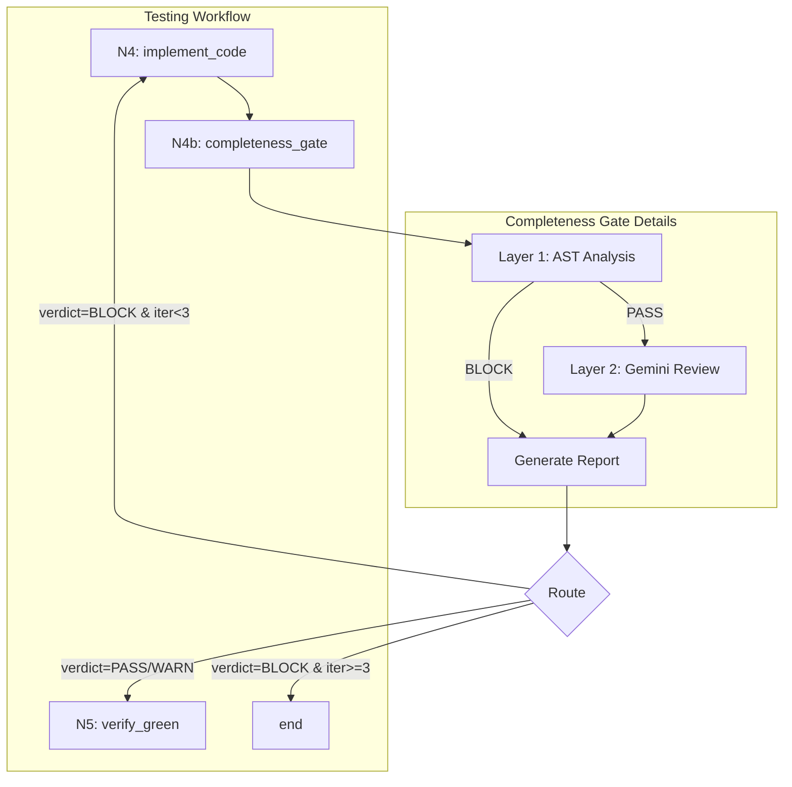

# Implementation Request: assemblyzero/workflows/testing/graph.py

## Task

Write the complete contents of `assemblyzero/workflows/testing/graph.py`.

Change type: Modify
Description: Insert N4b node between N4 and N5, add routing

## LLD Specification

# 147 - Feature: Implementation Completeness Gate (Anti-Stub Detection)

## 1. Context & Goal
* **Issue:** #147
* **Objective:** Add a completeness gate (N4b) between implementation and verification nodes to detect semantically incomplete implementations that pass mechanical tests but fail to fulfill LLD requirements.
* **Status:** Approved (gemini-3-pro-preview, 2026-02-16)
* **Related Issues:** #181 (subsumed - Implementation Report), #335 (N2.5 precedent), #225 (skipped test enforcement), #354 (mutation testing - future), #149-#156 (codebase scan findings - closed)

### Open Questions
*All questions resolved per Gemini review.*

- [x] ~~Should the Gemini semantic review have a configurable timeout for budget control?~~ **RESOLVED: Yes. Implement a default timeout (30s) in the Gemini client configuration to prevent hanging processes and budget drain.**
- [x] ~~What is the maximum number of N4→N4b→N4 iterations before escalating to human review vs hard stop?~~ **RESOLVED: Set a hard limit of 3 iterations. If the loop persists, route to `end` (Fail) to force manual intervention rather than spiraling costs.**

## 2. Proposed Changes

*This section is the **source of truth** for implementation. Describe exactly what will be built.*

### 2.1 Files Changed

| File | Change Type | Description |
|------|-------------|-------------|
| `assemblyzero/workflows/testing/completeness/` | Add (Directory) | Package directory for completeness analysis |
| `assemblyzero/workflows/testing/completeness/__init__.py` | Add | Package init with exports |
| `assemblyzero/workflows/testing/completeness/ast_analyzer.py` | Add | Layer 1 AST-based analysis functions |
| `assemblyzero/workflows/testing/completeness/report_generator.py` | Add | Generate implementation verification reports |
| `assemblyzero/workflows/testing/nodes/completeness_gate.py` | Add | N4b workflow node implementation |
| `tests/unit/test_completeness_gate.py` | Add | Unit and integration tests for completeness gate |
| `assemblyzero/workflows/testing/graph.py` | Modify | Insert N4b node between N4 and N5, add routing |
| `assemblyzero/workflows/testing/state.py` | Modify | Add completeness_verdict and completeness_issues fields |
| `assemblyzero/workflows/testing/nodes/__init__.py` | Modify | Export completeness_gate node |

### 2.1.1 Path Validation (Mechanical - Auto-Checked)

*Issue #277: Before human or Gemini review, paths are verified programmatically.*

Mechanical validation automatically checks:
- All "Modify" files must exist in repository
- All "Delete" files must exist in repository
- All "Add" files must have existing parent directories
- No placeholder prefixes (`src/`, `lib/`, `app/`) unless directory exists

**If validation fails, the LLD is BLOCKED before reaching review.**

### 2.2 Dependencies

*No new packages required. Uses standard library `ast` module.*

```toml
# pyproject.toml additions (if any)
# None - uses stdlib ast module
```

### 2.3 Data Structures

```python
# Pseudocode - NOT implementation
from enum import Enum

class CompletenessCategory(Enum):
    """Categories of completeness issues for type safety."""
    DEAD_CLI_FLAG = "dead_cli_flag"
    EMPTY_BRANCH = "empty_branch"
    DOCSTRING_ONLY = "docstring_only"
    TRIVIAL_ASSERTION = "trivial_assertion"
    UNUSED_IMPORT = "unused_import"

class CompletenessIssue(TypedDict):
    """Single completeness issue detected by analysis."""
    category: CompletenessCategory
    file_path: str
    line_number: int
    description: str
    severity: Literal["ERROR", "WARNING"]

class CompletenessResult(TypedDict):
    """Result of completeness analysis."""
    verdict: Literal["PASS", "WARN", "BLOCK"]
    issues: list[CompletenessIssue]
    ast_analysis_ms: int
    gemini_review_ms: int | None

class RequirementVerification(TypedDict):
    """Single LLD requirement verification status."""
    requirement_id: int
    requirement_text: str
    status: Literal["IMPLEMENTED", "PARTIAL", "MISSING"]
    evidence: str  # File:line or explanation

class ImplementationReport(TypedDict):
    """Full implementation verification report."""
    issue_number: int
    requirements: list[RequirementVerification]
    completeness_result: CompletenessResult
    generated_at: str  # ISO timestamp

class ReviewMaterials(TypedDict):
    """Materials prepared for Gemini semantic review."""
    lld_requirements: list[tuple[int, str]]  # (id, text) pairs
    code_snippets: dict[str, str]  # file_path -> relevant code
    issue_number: int

# State additions
class TestingState(TypedDict):
    # ... existing fields ...
    completeness_verdict: Literal["PASS", "WARN", "BLOCK", ""]
    completeness_issues: list[CompletenessIssue]
    implementation_report_path: str  # From #181
    review_materials: ReviewMaterials | None  # For Gemini Layer 2
```

### 2.4 Function Signatures

```python
# assemblyzero/workflows/testing/completeness/ast_analyzer.py

def analyze_dead_cli_flags(source_code: str, file_path: str) -> list[CompletenessIssue]:
    """Detect argparse add_argument calls with no corresponding usage."""
    ...

def analyze_empty_branches(source_code: str, file_path: str) -> list[CompletenessIssue]:
    """Detect if/elif/else branches with only pass, return None, or trivial bodies."""
    ...

def analyze_docstring_only_functions(source_code: str, file_path: str) -> list[CompletenessIssue]:
    """Detect functions with docstring + pass/return None only."""
    ...

def analyze_trivial_assertions(source_code: str, file_path: str) -> list[CompletenessIssue]:
    """Detect test functions where sole assertion is 'is not None' or similar."""
    ...

def analyze_unused_imports(source_code: str, file_path: str) -> list[CompletenessIssue]:
    """Detect imports with no usage in function bodies."""
    ...

def run_ast_analysis(files: list[Path], max_file_size_bytes: int = 1_000_000) -> CompletenessResult:
    """Run all AST checks on provided files. Skip files exceeding max_file_size_bytes."""
    ...


# assemblyzero/workflows/testing/completeness/report_generator.py

def generate_implementation_report(
    issue_number: int,
    lld_path: Path,
    implementation_files: list[Path],
    completeness_result: CompletenessResult,
) -> Path:
    """Generate implementation report to docs/reports/active/{issue}-implementation-report.md."""
    ...

def extract_lld_requirements(lld_path: Path) -> list[tuple[int, str]]:
    """Parse Section 3 requirements from LLD markdown."""
    ...

def prepare_review_materials(
    issue_number: int,
    lld_path: Path,
    implementation_files: list[Path],
) -> ReviewMaterials:
    """Prepare materials for Gemini semantic review submission by orchestrator."""
    ...


# assemblyzero/workflows/testing/nodes/completeness_gate.py

def completeness_gate(state: TestingState) -> TestingState:
    """N4b: Verify implementation completeness before proceeding to test verification."""
    ...

def route_after_completeness_gate(state: TestingState) -> Literal["N5_verify_green", "N4_implement_code", "end"]:
    """Route based on completeness verdict and iteration count."""
    ...
```

### 2.5 Logic Flow (Pseudocode)

```
N4b_completeness_gate:
1. Receive state from N4_implement_code
2. Collect modified/created files from state.files_changed

3. LAYER 1: AST Analysis
   FOR each file in implementation files:
     - Skip if file exceeds max_file_size_bytes (1MB default)
     - Run analyze_dead_cli_flags()
     - Run analyze_empty_branches()
     - Run analyze_docstring_only_functions()
     - Run analyze_unused_imports()
   FOR each test file:
     - Run analyze_trivial_assertions()
   
   Aggregate issues with severity

4. IF Layer 1 has BLOCK-level issues:
   - Set verdict = "BLOCK"
   - Skip Layer 2
   ELSE:
   
5. LAYER 2: Gemini Semantic Review (orchestrator-controlled)
   - Extract requirements from LLD Section 3
   - Prepare review materials via prepare_review_materials()
   - Set state.review_materials with prepared materials
   - Return state with review_materials for orchestrator
   - Orchestrator submits to Gemini (with 30s timeout)
   - Receive Gemini verdict

6. Generate implementation report
   - Write to docs/reports/active/{issue}-implementation-report.md
   - Set state.implementation_report_path

7. Update state:
   - state.completeness_verdict = verdict
   - state.completeness_issues = all_issues

8. Return state

route_after_completeness_gate:
1. IF verdict == "BLOCK":
   - IF iteration_count >= 3: return "end"  # Hard limit
   - ELSE: return "N4_implement_code"
2. ELSE:
   - return "N5_verify_green"
```

### 2.6 Technical Approach

* **Module:** `assemblyzero/workflows/testing/completeness/`
* **Pattern:** Two-layer validation (fast deterministic → slow semantic)
* **Key Decisions:**
  - AST analysis runs first as a fast, deterministic gate
  - Gemini review only triggers if AST passes (cost control)
  - Orchestrator controls Gemini submission per WORKFLOW.md
  - Report generation is a side effect, not blocking
  - File size limit (1MB) prevents memory spikes on large generated files

### 2.7 Architecture Decisions

| Decision | Options Considered | Choice | Rationale |
|----------|-------------------|--------|-----------|
| Analysis ordering | Parallel layers, Sequential layers | Sequential (AST then Gemini) | AST is fast/free; skip expensive Gemini if AST fails |
| AST implementation | Tree-sitter, Python ast, LibCST | Python ast | Zero dependencies, sufficient for our patterns |
| Report storage | Database, S3, Local markdown | Local markdown | Consistent with existing report patterns |
| Loop limit | Hardcoded, Configurable, Unlimited | Hardcoded at 3 | Prevents cost spiral; simple to understand |
| Issue categories | String literals, Enum | Enum (CompletenessCategory) | Type safety, IDE support, refactoring ease |
| File size limit | None, Configurable, Hardcoded | Configurable with 1MB default | Prevents memory spikes while allowing override |

**Architectural Constraints:**
- Must integrate with existing LangGraph workflow structure
- Gemini calls must go through orchestrator (not direct from node)
- Cannot modify N4 or N5 node logic (only add N4b between them)

## 3. Requirements

*What must be true when this is done. These become acceptance criteria.*

1. N4b node inserted into workflow graph between N4 and N5
2. AST analyzer detects dead CLI flags (add_argument without usage)
3. AST analyzer detects empty conditional branches (if x: pass)
4. AST analyzer detects docstring-only functions
5. AST analyzer detects trivial assertions in test files
6. AST analyzer detects unused imports from implementation
7. BLOCK verdict routes back to N4 for re-implementation
8. PASS/WARN verdict routes forward to N5
9. Implementation report generated at docs/reports/active/{issue}-implementation-report.md
10. Report includes LLD requirement verification table
11. Report includes completeness analysis summary
12. Max iteration limit (3) prevents infinite loops
13. Layer 2 Gemini review materials prepared correctly for orchestrator submission (not direct call)

## 4. Alternatives Considered

| Option | Pros | Cons | Decision |
|--------|------|------|----------|
| AST-only gate (no Gemini) | Fast, deterministic, zero cost | Misses semantic incompleteness | **Rejected** |
| Gemini-only gate (no AST) | Catches semantic issues | Expensive, slow, non-deterministic | **Rejected** |
| Two-layer approach | Best of both, cost-controlled | More complex implementation | **Selected** |
| Integrate into N4 node | Simpler graph | Violates single-responsibility | **Rejected** |
| Post-N5 check | Catches test-passing stubs | Late in pipeline, wastes test runs | **Rejected** |

**Rationale:** Two-layer approach provides deterministic fast-fail for obvious issues while preserving expensive semantic review for subtle completeness problems. Inserting as N4b maintains node separation.

## 5. Data & Fixtures

*Per [0108-lld-pre-implementation-review.md](0108-lld-pre-implementation-review.md) - complete this section BEFORE implementation.*

### 5.1 Data Sources

| Attribute | Value |
|-----------|-------|
| Source | Local filesystem (implementation files, LLD) |
| Format | Python source code, Markdown |
| Size | ~10-50 files per workflow run |
| Refresh | Per-workflow-run |
| Copyright/License | N/A - internal project files |

### 5.2 Data Pipeline

```
Implementation Files ──ast.parse──► AST Trees ──analyze──► CompletenessIssues
LLD Markdown ──parse──► Requirements ──compare──► RequirementVerification
CompletenessIssues + RequirementVerification ──format──► Implementation Report (Markdown)
LLD + Code ──prepare_review_materials──► ReviewMaterials (for Orchestrator)
```

### 5.3 Test Fixtures

| Fixture | Source | Notes |
|---------|--------|-------|
| Dead CLI flag example | Generated | Synthetic argparse code with unused flags |
| Empty branch example | Generated | if/else with pass bodies |
| Docstring-only function | Generated | Functions with docstring + return None |
| Trivial assertion test | Generated | Test with only `assert x is not None` |
| Valid implementation | Generated | Code with no issues (negative test) |
| Patterns from #149-#156 | Extracted | Real issues from codebase scan |
| Sample LLD with requirements | Generated | Markdown with Section 3 requirements |

### 5.4 Deployment Pipeline

Report files are written to local `docs/reports/active/` directory. No external deployment required.

**If data source is external:** N/A - all sources are internal.

## 6. Diagram

### 6.1 Mermaid Quality Gate

Before finalizing any diagram, verify in [Mermaid Live Editor](https://mermaid.live) or GitHub preview:

- [x] **Simplicity:** Similar components collapsed (per 0006 §8.1)
- [x] **No touching:** All elements have visual separation (per 0006 §8.2)
- [x] **No hidden lines:** All arrows fully visible (per 0006 §8.3)
- [x] **Readable:** Labels not truncated, flow direction clear
- [ ] **Auto-inspected:** Agent rendered via mermaid.ink and viewed (per 0006 §8.5)

**Agent Auto-Inspection (MANDATORY):**

AI agents MUST render and view the diagram before committing:
1. Base64 encode diagram → fetch PNG from `https://mermaid.ink/img/{base64}`
2. Read the PNG file (multimodal inspection)
3. Document results below

**Auto-Inspection Results:**
```
- Touching elements: [ ] None / [ ] Found: ___
- Hidden lines: [ ] None / [ ] Found: ___
- Label readability: [ ] Pass / [ ] Issue: ___
- Flow clarity: [ ] Clear / [ ] Issue: ___
```

*Reference: [0006-mermaid-diagrams.md](0006-mermaid-diagrams.md)*

### 6.2 Diagram



## 7. Security & Safety Considerations

### 7.1 Security

| Concern | Mitigation | Status |
|---------|------------|--------|
| Code injection via AST parsing | ast.parse is read-only, no exec | Addressed |
| Path traversal in file collection | Validate files within project root | Addressed |
| Gemini prompt injection | Review materials are code excerpts, not user input | Addressed |

### 7.2 Safety

| Concern | Mitigation | Status |
|---------|------------|--------|
| Infinite loop in N4↔N4b cycle | Hard limit of 3 iterations | Addressed |
| False positive blocks valid code | WARN severity for uncertain detections, only ERROR blocks | Addressed |
| Report overwrite data loss | Reports use unique issue number in filename | Addressed |
| AST parse failure on syntax errors | Catch SyntaxError, report as separate issue | Addressed |
| Memory spike on large files | Skip files exceeding 1MB size limit | Addressed |
| Gemini timeout causing budget drain | 30s timeout configured in Gemini client | Addressed |

**Fail Mode:** Fail Open - If AST analysis fails unexpectedly, proceed to N5 with warning rather than blocking indefinitely.

**Recovery Strategy:** If N4b crashes, state contains completeness_issues=[], verdict="" allowing manual inspection and re-run.

## 8. Performance & Cost Considerations

### 8.1 Performance

| Metric | Budget | Approach |
|--------|--------|----------|
| AST analysis latency | < 500ms for 50 files | Python ast is fast, no I/O; skip files >1MB |
| Gemini review latency | < 30s | Only runs if AST passes; timeout enforced |
| Memory | < 50MB | AST trees are small, process sequentially; skip large files |

**Bottlenecks:** Gemini API call is the slowest component; mitigated by Layer 1 filtering.

### 8.2 Cost Analysis

| Resource | Unit Cost | Estimated Usage | Monthly Cost |
|----------|-----------|-----------------|--------------|
| Gemini API calls | ~$0.01 per review | ~100 reviews/month | ~$1 |
| Local compute | $0 | N/A | $0 |

**Cost Controls:**
- [x] Layer 1 AST analysis gates expensive Gemini calls
- [x] Gemini only called when AST analysis passes
- [x] Hard iteration limit (3) prevents cost spiral
- [x] 30s timeout prevents hanging/runaway Gemini calls

**Worst-Case Scenario:** If Layer 1 has bugs allowing all implementations through, Gemini costs increase proportionally. At $0.01/call, even 10x usage is $10/month. Hard iteration limit caps max calls per issue to 3.

## 9. Legal & Compliance

| Concern | Applies? | Mitigation |
|---------|----------|------------|
| PII/Personal Data | No | Only analyzes code, no user data |
| Third-Party Licenses | No | Uses stdlib ast only |
| Terms of Service | Yes | Gemini usage within existing API agreement |
| Data Retention | No | Reports are project artifacts, not sensitive |
| Export Controls | No | No restricted algorithms |

**Data Classification:** Internal

**Compliance Checklist:**
- [x] No PII stored without consent
- [x] All third-party licenses compatible with project license
- [x] External API usage compliant with provider ToS
- [x] Data retention policy documented (reports persist with project)

## 10. Verification & Testing

*Ref: [0005-testing-strategy-and-protocols.md](0005-testing-strategy-and-protocols.md)*

**Testing Philosophy:** Strive for 100% automated test coverage. Manual tests are a last resort for scenarios that genuinely cannot be automated.

### 10.0 Test Plan (TDD - Complete Before Implementation)

**TDD Requirement:** Tests MUST be written and failing BEFORE implementation begins.

| Test ID | Test Description | Expected Behavior | Status |
|---------|------------------|-------------------|--------|
| T010 | test_detect_dead_cli_flags | Returns issue for unused argparse arg | RED |
| T020 | test_detect_empty_branch_pass | Returns issue for `if x: pass` | RED |
| T030 | test_detect_empty_branch_return_none | Returns issue for `if x: return None` | RED |
| T040 | test_detect_docstring_only_function | Returns issue for func with docstring+pass | RED |
| T050 | test_detect_trivial_assertion | Returns issue for `assert x is not None` only | RED |
| T060 | test_detect_unused_import | Returns issue for import not used in functions | RED |
| T070 | test_valid_code_no_issues | Returns empty issues list for clean code | RED |
| T080 | test_completeness_gate_block_routing | BLOCK verdict routes to N4 | RED |
| T090 | test_completeness_gate_pass_routing | PASS verdict routes to N5 | RED |
| T100 | test_max_iterations_ends | BLOCK at max iterations (3) routes to end | RED |
| T110 | test_report_generation | Report file created with correct structure | RED |
| T120 | test_lld_requirement_extraction | Requirements parsed from Section 3 | RED |
| T130 | test_prepare_review_materials | ReviewMaterials correctly populated with LLD requirements and code snippets | RED |

**Coverage Target:** ≥95% for all new code

**TDD Checklist:**
- [ ] All tests written before implementation
- [ ] Tests currently RED (failing)
- [ ] Test IDs match scenario IDs in 10.1
- [ ] Test file created at: `tests/unit/test_completeness_gate.py`

### 10.1 Test Scenarios

| ID | Scenario | Type | Input | Expected Output | Pass Criteria |
|----|----------|------|-------|-----------------|---------------|
| 010 | Dead CLI flag detection | Auto | Code with `add_argument('--foo')` unused | CompletenessIssue with category=DEAD_CLI_FLAG | Issue returned with correct file/line |
| 020 | Empty branch (pass) detection | Auto | Code with `if x: pass` | CompletenessIssue with category=EMPTY_BRANCH | Issue identifies branch location |
| 030 | Empty branch (return None) detection | Auto | Code with `if mock: return None` | CompletenessIssue with category=EMPTY_BRANCH | Issue identifies branch location |
| 040 | Docstring-only function detection | Auto | `def foo(): """Doc.""" pass` | CompletenessIssue with category=DOCSTRING_ONLY | Issue identifies function |
| 050 | Trivial assertion detection | Auto | Test with only `assert result is not None` | CompletenessIssue with category=TRIVIAL_ASSERTION | Issue warns about assertion quality |
| 060 | Unused import detection | Auto | `import os` with no usage | CompletenessIssue with category=UNUSED_IMPORT | Issue identifies import |
| 070 | Valid implementation (negative) | Auto | Complete implementation code | Empty issues list | No false positives |
| 080 | BLOCK routes to N4 | Auto | State with verdict='BLOCK', iter<3 | Route returns 'N4_implement_code' | Correct routing |
| 090 | PASS routes to N5 | Auto | State with verdict='PASS' | Route returns 'N5_verify_green' | Correct routing |
| 100 | Max iterations ends workflow | Auto | State with verdict='BLOCK', iter>=3 | Route returns 'end' | Prevents infinite loop |
| 110 | Report file generation | Auto | Issue #999, results | File at docs/reports/active/999-implementation-report.md | File exists with correct structure |
| 120 | LLD requirement parsing | Auto | LLD with Section 3 requirements | List of (id, text) tuples | All requirements extracted |
| 130 | Review materials preparation | Auto | LLD path + implementation files | ReviewMaterials with requirements and code snippets | Materials correctly formatted for orchestrator |

### 10.2 Test Commands

```bash
# Run all automated tests
poetry run pytest tests/unit/test_completeness_gate.py -v

# Run only fast/mocked tests (exclude live)
poetry run pytest tests/unit/test_completeness_gate.py -v -m "not live"

# Run with coverage
poetry run pytest tests/unit/test_completeness_gate.py -v --cov=assemblyzero/workflows/testing/completeness --cov-report=term-missing
```

### 10.3 Manual Tests (Only If Unavoidable)

N/A - All scenarios automated.

## 11. Risks & Mitigations

| Risk | Impact | Likelihood | Mitigation |
|------|--------|------------|------------|
| False positives block valid implementations | Med | Med | WARN severity for uncertain patterns; review false positive rate in first sprint |
| AST analysis misses edge cases | Low | Med | Start with high-confidence patterns; add patterns iteratively |
| Gemini semantic review gives inconsistent results | Med | Low | Layer 1 catches most issues; Layer 2 is enhancement |
| Integration breaks existing workflow | High | Low | Comprehensive integration tests; feature flag for rollout |
| Report generation fails silently | Low | Low | Log errors; proceed with verdict regardless of report |
| Memory spike on large files | Med | Low | File size limit (1MB) in run_ast_analysis |

## 12. Definition of Done

### Code
- [ ] Implementation complete and linted
- [ ] Code comments reference this LLD

### Tests
- [ ] All test scenarios pass
- [ ] Test coverage meets threshold (≥95%)

### Documentation
- [ ] LLD updated with any deviations
- [ ] Implementation Report (0103) completed
- [ ] Test Report (0113) completed if applicable

### Review
- [ ] Code review completed
- [ ] User approval before closing issue

### 12.1 Traceability (Mechanical - Auto-Checked)

*Issue #277: Cross-references are verified programmatically.*

Mechanical validation automatically checks:
- Every file mentioned in this section must appear in Section 2.1
- Every risk mitigation in Section 11 should have a corresponding function in Section 2.4 (warning if not)

**If files are missing from Section 2.1, the LLD is BLOCKED.**

---

## Reviewer Suggestions

*Non-blocking recommendations from the reviewer.*

- Ensure the `max_file_size_bytes` check logs a warning when a file is skipped, so the user knows why analysis might be missing for that file.

## Appendix: Review Log

*Track all review feedback with timestamps and implementation status.*

<!-- Note: Timestamps are auto-generated by the workflow. Do not fill in manually. -->

### Gemini Review #1 (REVISE)

**Reviewer:** Gemini 3 Pro
**Verdict:** REVISE

#### Comments

| ID | Comment | Implemented? |
|----|---------|--------------|
| G1.1 | "Coverage is 92.3%. You must add a test case for Requirement 13 (Gemini material preparation) to reach >95%." | YES - Added T130 test scenario for prepare_review_materials |
| G1.2 | "Requirement 13 involves parsing LLDs and formatting code for a prompt. This is error-prone string manipulation that requires a dedicated unit test." | YES - Added prepare_review_materials function signature and T130 test |
| G1.3 | "Consider implementing a size limit on the files sent to ast.parse to prevent memory spikes" | YES - Added max_file_size_bytes parameter to run_ast_analysis (1MB default) |
| G1.4 | "Ensure CompletenessIssue categories are defined as an Enum for better type safety" | YES - Added CompletenessCategory Enum in Section 2.3 |
| G1.5 | "Open question: Gemini timeout" | YES - Resolved: 30s default timeout documented |
| G1.6 | "Open question: Max iterations" | YES - Resolved: Hard limit of 3, routes to end |

### Review Summary

| Review | Date | Verdict | Key Issue |
|--------|------|---------|-----------|
| 2 | 2026-02-16 | APPROVED | `gemini-3-pro-preview` |
| Gemini #1 | 2026-02-16 | REVISE | Test coverage 92.3% - missing REQ-13 test |

**Final Status:** APPROVED

## Existing File Contents

The file currently contains:

```python
"""StateGraph definition for TDD Testing Workflow.

Issue #101: Test Plan Reviewer
Issue #102: TDD Initialization
Issue #93: N8 Documentation Node
Issue #335: Add mechanical test validation node (N2.5)

Defines the compiled graph with:
- N0-N8 nodes (plus N2.5 for test validation)
- Conditional edges for routing
- Checkpoint support via SqliteSaver

Graph structure:
    N0_load_lld -> N1_review_test_plan -> N2_scaffold_tests -> N2_5_validate_tests
           |              |                     |                      |
           v              v                     v                      v
         error         BLOCKED              scaffold_only         validation
           |              |                     |                   result
           v              v                     v                      |
          END     loop back to LLD             END                    / \\
                  (outside workflow)                                 /   \\
                                                                pass   fail
                                                                 |       |
                                                                 v       v
    N2_5 (pass) -> N3_verify_red -> N4_implement_code ------> N2 (retry)
           |                |                   |               or escalate
           v                v                   v               to N4
        red OK          iteration            green
           |            loop back              |
           v                |                  v
          N4               N4                  N6

    N6_e2e_validation -> N7_finalize -> N8_document -> END
           |                  |               |
           v                  v               v
       skip_e2e           complete       skip_docs
           |                                  |
           v                                  v
          N7                                 END
"""

from typing import Literal

from langgraph.graph import END, StateGraph

from assemblyzero.workflows.testing.nodes import (
    document,
    e2e_validation,
    finalize,
    implement_code,
    load_lld,
    review_test_plan,
    scaffold_tests,
    verify_green_phase,
    verify_red_phase,
)
from assemblyzero.workflows.testing.nodes.validate_tests_mechanical import (
    validate_tests_mechanical_node,
    should_regenerate,
)
from assemblyzero.workflows.testing.state import TestingWorkflowState


def route_after_load(
    state: TestingWorkflowState,
) -> Literal["N1_review_test_plan", "end"]:
    """Route after N0 (load_lld).

    Args:
        state: Current workflow state.

    Returns:
        Next node name or END.
    """
    error = state.get("error_message", "")
    if error:
        return "end"
    return "N1_review_test_plan"


def route_after_review(
    state: TestingWorkflowState,
) -> Literal["N2_scaffold_tests", "end"]:
    """Route after N1 (review_test_plan).

    Args:
        state: Current workflow state.

    Returns:
        Next node name or END.
    """
    error = state.get("error_message", "")
    test_plan_status = state.get("test_plan_status", "")
    auto_mode = state.get("auto_mode", False)

    if error and not auto_mode:
        return "end"

    # BLOCKED means test plan needs revision - this requires returning
    # to the LLD workflow (outside scope of this workflow)
    # In auto_mode, continue anyway (skip human gate)
    if test_plan_status == "BLOCKED":
        if auto_mode:
            print("    [AUTO] Continuing despite BLOCKED verdict - auto mode enabled")
            return "N2_scaffold_tests"
        return "end"

    return "N2_scaffold_tests"


def route_after_scaffold(
    state: TestingWorkflowState,
) -> Literal["N2_5_validate_tests", "end"]:
    """Route after N2 (scaffold_tests).

    Issue #335: Updated to route to validation node instead of verify_red.

    Args:
        state: Current workflow state.

    Returns:
        Next node name or END.
    """
    error = state.get("error_message", "")
    if error:
        return "end"

    # scaffold_only mode - stop after scaffolding
    if state.get("scaffold_only"):
        return "end"

    return "N2_5_validate_tests"


def route_after_validate(
    state: TestingWorkflowState,
) -> Literal["N3_verify_red", "N2_scaffold_tests", "N4_implement_code", "end"]:
    """Route after N2.5 (validate_tests_mechanical).

    Issue #335: Routes based on test validation results.

    Routes to:
    - N3_verify_red: Validation passed, continue normal flow
    - N2_scaffold_tests: Validation failed, attempts < 3, retry
    - N4_implement_code: Validation failed, attempts >= 3, escalate to Claude
    - END: Error

    Args:
        state: Current workflow state.

    Returns:
        Next node name or END.
    """
    error = state.get("error_message", "")
    if error:
        return "end"

    # Use the should_regenerate function from validate_tests_mechanical
    decision = should_regenerate(state)

    if decision == "continue":
        return "N3_verify_red"
    elif decision == "regenerate":
        return "N2_scaffold_tests"
    elif decision == "escalate":
        # Escalate to Claude - skip verify_red and go to implement
        print("    [ESCALATE] Skipping verify_red, escalating to Claude implementation")
        return "N4_implement_code"

    return "end"


def route_after_red(
    state: TestingWorkflowState,
) -> Literal["N4_implement_code", "end"]:
    """Route after N3 (verify_red_phase).

    Args:
        state: Current workflow state.

    Returns:
        Next node name or END.
    """
    error = state.get("error_message", "")
    next_node = state.get("next_node", "")

    if error:
        return "end"

    if next_node == "N4_implement_code":
        return "N4_implement_code"

    return "end"


def route_after_implement(
    state: TestingWorkflowState,
) -> Literal["N5_verify_green", "end"]:
    """Route after N4 (implement_code).

    Args:
        state: Current workflow state.

    Returns:
        Next node name or END.
    """
    error = state.get("error_message", "")
    if error:
        return "end"
    return "N5_verify_green"


def route_after_green(
    state: TestingWorkflowState,
) -> Literal["N6_e2e_validation", "N7_finalize", "N4_implement_code", "end"]:
    """Route after N5 (verify_green_phase).

    Args:
        state: Current workflow state.

    Returns:
        Next node name or END.
    """
    error = state.get("error_message", "")
    next_node = state.get("next_node", "")

    if error:
        return "end"

    # Check for iteration loop back to implement
    if next_node == "N4_implement_code":
        # Check max iterations
        iteration = state.get("iteration_count", 0)
        max_iterations = state.get("max_iterations", 10)
        if iteration >= max_iterations:
            return "end"
        return "N4_implement_code"

    if next_node == "N6_e2e_validation":
        return "N6_e2e_validation"

    # Skip E2E - go directly to finalize
    if next_node == "N7_finalize":
        return "N7_finalize"

    return "end"


def route_after_e2e(
    state: TestingWorkflowState,
) -> Literal["N7_finalize", "N4_implement_code", "end"]:
    """Route after N6 (e2e_validation).

    Args:
        state: Current workflow state.

    Returns:
        Next node name or END.
    """
    error = state.get("error_message", "")
    next_node = state.get("next_node", "")

    if error:
        return "end"

    # E2E failure may loop back to implement
    if next_node == "N4_implement_code":
        iteration = state.get("iteration_count", 0)
        max_iterations = state.get("max_iterations", 10)
        if iteration >= max_iterations:
            return "end"
        return "N4_implement_code"

    return "N7_finalize"


def route_after_finalize(
    state: TestingWorkflowState,
) -> Literal["N8_document", "end"]:
    """Route after N7 (finalize).

    Args:
        state: Current workflow state.

    Returns:
        Next node name or END.
    """
    error = state.get("error_message", "")
    if error:
        return "end"

    # Skip documentation if flag is set
    if state.get("skip_docs"):
        return "end"

    return "N8_document"


def build_testing_workflow() -> StateGraph:
    """Build the TDD testing workflow StateGraph.

    Returns:
        StateGraph ready for compilation.
    """
    # Create graph with state type
    workflow = StateGraph(TestingWorkflowState)

    # Add nodes
    workflow.add_node("N0_load_lld", load_lld)
    workflow.add_node("N1_review_test_plan", review_test_plan)
    workflow.add_node("N2_scaffold_tests", scaffold_tests)
    workflow.add_node("N2_5_validate_tests", validate_tests_mechanical_node)  # Issue #335
    workflow.add_node("N3_verify_red", verify_red_phase)
    workflow.add_node("N4_implement_code", implement_code)
    workflow.add_node("N5_verify_green", verify_green_phase)
    workflow.add_node("N6_e2e_validation", e2e_validation)
    workflow.add_node("N7_finalize", finalize)
    workflow.add_node("N8_document", document)

    # Set entry point
    workflow.set_entry_point("N0_load_lld")

    # Add edges: N0 -> N1 (with error check)
    workflow.add_conditional_edges(
        "N0_load_lld",
        route_after_load,
        {
            "N1_review_test_plan": "N1_review_test_plan",
            "end": END,
        },
    )

    # N1 -> N2 (with error/blocked check)
    workflow.add_conditional_edges(
        "N1_review_test_plan",
        route_after_review,
        {
            "N2_scaffold_tests": "N2_scaffold_tests",
            "end": END,
        },
    )

    # N2 -> N2.5 (with scaffold_only check) - Issue #335
    workflow.add_conditional_edges(
        "N2_scaffold_tests",
        route_after_scaffold,
        {
            "N2_5_validate_tests": "N2_5_validate_tests",
            "end": END,
        },
    )

    # N2.5 -> N3 or N2 (retry) or N4 (escalate) - Issue #335
    workflow.add_conditional_edges(
        "N2_5_validate_tests",
        route_after_validate,
        {
            "N3_verify_red": "N3_verify_red",
            "N2_scaffold_tests": "N2_scaffold_tests",
            "N4_implement_code": "N4_implement_code",
            "end": END,
        },
    )

    # N3 -> N4 (with error check)
    workflow.add_conditional_edges(
        "N3_verify_red",
        route_after_red,
        {
            "N4_implement_code": "N4_implement_code",
            "end": END,
        },
    )

    # N4 -> N5 (with error check)
    workflow.add_conditional_edges(
        "N4_implement_code",
        route_after_implement,
        {
            "N5_verify_green": "N5_verify_green",
            "end": END,
        },
    )

    # N5 -> N6 or N7 (skip E2E) or N4 (iteration loop)
    workflow.add_conditional_edges(
        "N5_verify_green",
        route_after_green,
        {
            "N6_e2e_validation": "N6_e2e_validation",
            "N7_finalize": "N7_finalize",
            "N4_implement_code": "N4_implement_code",
            "end": END,
        },
    )

    # N6 -> N7 or N4 (iteration loop)
    workflow.add_conditional_edges(
        "N6_e2e_validation",
        route_after_e2e,
        {
            "N7_finalize": "N7_finalize",
            "N4_implement_code": "N4_implement_code",
            "end": END,
        },
    )

    # N7 -> N8 (with skip_docs check)
    workflow.add_conditional_edges(
        "N7_finalize",
        route_after_finalize,
        {
            "N8_document": "N8_document",
            "end": END,
        },
    )

    # N8 -> END
    workflow.add_edge("N8_document", END)

    return workflow

```

Modify this file according to the LLD specification.

## Tests That Must Pass

```python
# From C:\Users\mcwiz\Projects\AssemblyZero-147\tests\test_issue_147.py
"""Test file for Issue #147.

Generated by AssemblyZero TDD Testing Workflow.
Tests will fail with ImportError until implementation exists (TDD RED phase).
"""

import pytest


# Fixtures for mocking
@pytest.fixture
def mock_external_service():
    """Mock external service for isolation."""
    # TODO: Implement mock
    yield None


# Unit Tests
# -----------

def test_id():
    """
    Test Description | Expected Behavior | Status
    """
    # TDD: Arrange
    # Set up test data

    # TDD: Act
    # Call the function under test

    # TDD: Assert
    # Verify test_id works correctly
    assert False, 'TDD RED: test_id not implemented'


def test_t010():
    """
    test_detect_dead_cli_flags | Returns issue for unused argparse arg |
    RED
    """
    # TDD: Arrange
    # Set up test data

    # TDD: Act
    # Call the function under test

    # TDD: Assert
    # Verify test_t010 works correctly
    assert False, 'TDD RED: test_t010 not implemented'


def test_t020():
    """
    test_detect_empty_branch_pass | Returns issue for `if x: pass` | RED
    """
    # TDD: Arrange
    # Set up test data

    # TDD: Act
    # Call the function under test

    # TDD: Assert
    # Verify test_t020 works correctly
    assert False, 'TDD RED: test_t020 not implemented'


def test_t030():
    """
    test_detect_empty_branch_return_none | Returns issue for `if x:
    return None` | RED
    """
    # TDD: Arrange
    # Set up test data

    # TDD: Act
    # Call the function under test

    # TDD: Assert
    # Verify test_t030 works correctly
    assert False, 'TDD RED: test_t030 not implemented'


def test_t040():
    """
    test_detect_docstring_only_function | Returns issue for func with
    docstring+pass | RED
    """
    # TDD: Arrange
    # Set up test data

    # TDD: Act
    # Call the function under test

    # TDD: Assert
    # Verify test_t040 works correctly
    assert False, 'TDD RED: test_t040 not implemented'


def test_t050():
    """
    test_detect_trivial_assertion | Returns issue for `assert x is not
    None` only | RED
    """
    # TDD: Arrange
    # Set up test data

    # TDD: Act
    # Call the function under test

    # TDD: Assert
    # Verify test_t050 works correctly
    assert False, 'TDD RED: test_t050 not implemented'


def test_t060():
    """
    test_detect_unused_import | Returns issue for import not used in
    functions | RED
    """
    # TDD: Arrange
    # Set up test data

    # TDD: Act
    # Call the function under test

    # TDD: Assert
    # Verify test_t060 works correctly
    assert False, 'TDD RED: test_t060 not implemented'


def test_t070():
    """
    test_valid_code_no_issues | Returns empty issues list for clean code
    | RED
    """
    # TDD: Arrange
    # Set up test data

    # TDD: Act
    # Call the function under test

    # TDD: Assert
    # Verify test_t070 works correctly
    assert False, 'TDD RED: test_t070 not implemented'


def test_t080():
    """
    test_completeness_gate_block_routing | BLOCK verdict routes to N4 |
    RED
    """
    # TDD: Arrange
    # Set up test data

    # TDD: Act
    # Call the function under test

    # TDD: Assert
    # Verify test_t080 works correctly
    assert False, 'TDD RED: test_t080 not implemented'


def test_t090():
    """
    test_completeness_gate_pass_routing | PASS verdict routes to N5 | RED
    """
    # TDD: Arrange
    # Set up test data

    # TDD: Act
    # Call the function under test

    # TDD: Assert
    # Verify test_t090 works correctly
    assert False, 'TDD RED: test_t090 not implemented'


def test_t100():
    """
    test_max_iterations_ends | BLOCK at max iterations (3) routes to end
    | RED
    """
    # TDD: Arrange
    # Set up test data

    # TDD: Act
    # Call the function under test

    # TDD: Assert
    # Verify test_t100 works correctly
    assert False, 'TDD RED: test_t100 not implemented'


def test_t110():
    """
    test_report_generation | Report file created with correct structure |
    RED
    """
    # TDD: Arrange
    # Set up test data

    # TDD: Act
    # Call the function under test

    # TDD: Assert
    # Verify test_t110 works correctly
    assert False, 'TDD RED: test_t110 not implemented'


def test_t120():
    """
    test_lld_requirement_extraction | Requirements parsed from Section 3
    | RED
    """
    # TDD: Arrange
    # Set up test data

    # TDD: Act
    # Call the function under test

    # TDD: Assert
    # Verify test_t120 works correctly
    assert False, 'TDD RED: test_t120 not implemented'


def test_t130():
    """
    test_prepare_review_materials | ReviewMaterials correctly populated
    with LLD requirements and code snippets | RED
    """
    # TDD: Arrange
    # Set up test data

    # TDD: Act
    # Call the function under test

    # TDD: Assert
    # Verify test_t130 works correctly
    assert False, 'TDD RED: test_t130 not implemented'


def test_010():
    """
    Dead CLI flag detection | Auto | Code with `add_argument('--foo')`
    unused | CompletenessIssue with category=DEAD_CLI_FLAG | Issue
    returned with correct file/line
    """
    # TDD: Arrange
    # Set up test data

    # TDD: Act
    # Call the function under test

    # TDD: Assert
    # Verify test_010 works correctly
    assert False, 'TDD RED: test_010 not implemented'


def test_020():
    """
    Empty branch (pass) detection | Auto | Code with `if x: pass` |
    CompletenessIssue with category=EMPTY_BRANCH | Issue identifies branch
    location
    """
    # TDD: Arrange
    # Set up test data

    # TDD: Act
    # Call the function under test

    # TDD: Assert
    # Verify test_020 works correctly
    assert False, 'TDD RED: test_020 not implemented'


def test_030(mock_external_service):
    """
    Empty branch (return None) detection | Auto | Code with `if mock:
    return None` | CompletenessIssue with category=EMPTY_BRANCH | Issue
    identifies branch location
    """
    # TDD: Arrange
    # Set up test data

    # TDD: Act
    # Call the function under test

    # TDD: Assert
    # Verify test_030 works correctly
    assert False, 'TDD RED: test_030 not implemented'


def test_040():
    """
    Docstring-only function detection | Auto | `def foo(): """Doc."""
    pass` | CompletenessIssue with category=DOCSTRING_ONLY | Issue
    identifies function
    """
    # TDD: Arrange
    # Set up test data

    # TDD: Act
    # Call the function under test

    # TDD: Assert
    # Verify test_040 works correctly
    assert False, 'TDD RED: test_040 not implemented'


def test_050():
    """
    Trivial assertion detection | Auto | Test with only `assert result is
    not None` | CompletenessIssue with category=TRIVIAL_ASSERTION | Issue
    warns about assertion quality
    """
    # TDD: Arrange
    # Set up test data

    # TDD: Act
    # Call the function under test

    # TDD: Assert
    # Verify test_050 works correctly
    assert False, 'TDD RED: test_050 not implemented'


def test_060():
    """
    Unused import detection | Auto | `import os` with no usage |
    CompletenessIssue with category=UNUSED_IMPORT | Issue identifies
    import
    """
    # TDD: Arrange
    # Set up test data

    # TDD: Act
    # Call the function under test

    # TDD: Assert
    # Verify test_060 works correctly
    assert False, 'TDD RED: test_060 not implemented'


def test_070():
    """
    Valid implementation (negative) | Auto | Complete implementation code
    | Empty issues list | No false positives
    """
    # TDD: Arrange
    # Set up test data

    # TDD: Act
    # Call the function under test

    # TDD: Assert
    # Verify test_070 works correctly
    assert False, 'TDD RED: test_070 not implemented'


def test_080():
    """
    BLOCK routes to N4 | Auto | State with verdict='BLOCK', iter<3 |
    Route returns 'N4_implement_code' | Correct routing
    """
    # TDD: Arrange
    # Set up test data

    # TDD: Act
    # Call the function under test

    # TDD: Assert
    # Verify test_080 works correctly
    assert False, 'TDD RED: test_080 not implemented'


def test_090():
    """
    PASS routes to N5 | Auto | State with verdict='PASS' | Route returns
    'N5_verify_green' | Correct routing
    """
    # TDD: Arrange
    # Set up test data

    # TDD: Act
    # Call the function under test

    # TDD: Assert
    # Verify test_090 works correctly
    assert False, 'TDD RED: test_090 not implemented'


def test_100():
    """
    Max iterations ends workflow | Auto | State with verdict='BLOCK',
    iter>=3 | Route returns 'end' | Prevents infinite loop
    """
    # TDD: Arrange
    # Set up test data

    # TDD: Act
    # Call the function under test

    # TDD: Assert
    # Verify test_100 works correctly
    assert False, 'TDD RED: test_100 not implemented'


def test_110():
    """
    Report file generation | Auto | Issue #999, results | File at
    docs/reports/active/999-implementation-report.md | File exists with
    correct structure
    """
    # TDD: Arrange
    # Set up test data

    # TDD: Act
    # Call the function under test

    # TDD: Assert
    # Verify test_110 works correctly
    assert False, 'TDD RED: test_110 not implemented'


def test_120():
    """
    LLD requirement parsing | Auto | LLD with Section 3 requirements |
    List of (id, text) tuples | All requirements extracted
    """
    # TDD: Arrange
    # Set up test data

    # TDD: Act
    # Call the function under test

    # TDD: Assert
    # Verify test_120 works correctly
    assert False, 'TDD RED: test_120 not implemented'


def test_130():
    """
    Review materials preparation | Auto | LLD path + implementation files
    | ReviewMaterials with requirements and code snippets | Materials
    correctly formatted for orchestrator
    """
    # TDD: Arrange
    # Set up test data

    # TDD: Act
    # Call the function under test

    # TDD: Assert
    # Verify test_130 works correctly
    assert False, 'TDD RED: test_130 not implemented'


```

## Previously Implemented Files

These files have already been implemented. Use them for imports and references:

### assemblyzero/workflows/testing/completeness/__init__.py (signatures)

```python
"""Completeness analysis for implementation verification.

Issue #147: Implementation Completeness Gate (Anti-Stub Detection)
Related: #181 (Implementation Report), #335 (N2.5 precedent)

This package provides two-layer completeness analysis:
- Layer 1: AST-based deterministic analysis (fast, free)
- Layer 2: Gemini semantic review materials preparation (orchestrator-controlled)

Modules:
- ast_analyzer: Layer 1 AST-based analysis functions
- report_generator: Implementation verification report generation
"""

from assemblyzero.workflows.testing.completeness.ast_analyzer import (
    analyze_dead_cli_flags,
    analyze_docstring_only_functions,
    analyze_empty_branches,
    analyze_trivial_assertions,
    analyze_unused_imports,
    run_ast_analysis,
)

from assemblyzero.workflows.testing.completeness.report_generator import (
    extract_lld_requirements,
    generate_implementation_report,
    prepare_review_materials,
)
```

### assemblyzero/workflows/testing/completeness/ast_analyzer.py (signatures)

```python
"""Layer 1 AST-based analysis functions for implementation completeness.

Issue #147: Implementation Completeness Gate (Anti-Stub Detection)

Provides deterministic, fast AST-based checks that detect semantically
incomplete implementations:
- Dead CLI flags (argparse add_argument with no usage)
- Empty conditional branches (if/elif/else with only pass/return None)
- Docstring-only functions (functions with docstring + pass/return None)
- Trivial assertions in tests (sole assertion is 'is not None' or similar)
- Unused imports (imports not referenced in function bodies)

These checks form Layer 1 of the two-layer completeness gate. Layer 2
(Gemini semantic review) only runs if Layer 1 passes, for cost control.
"""

from __future__ import annotations

import ast

import logging

import time

from enum import Enum

from pathlib import Path

from typing import Literal, TypedDict

class CompletenessCategory(Enum):

    """Categories of completeness issues for type safety."""

class CompletenessIssue(TypedDict):

    """Single completeness issue detected by analysis."""

class CompletenessResult(TypedDict):

    """Result of completeness analysis."""

def _is_trivial_body(body: list[ast.stmt]) -> bool:
    """Check if a function/branch body is trivial (pass, return None, or ellipsis).

A body is trivial if it contains only:"""
    ...

def _has_docstring(body: list[ast.stmt]) -> bool:
    """Check if a function body starts with a docstring.

Args:"""
    ...

def _collect_name_references(node: ast.AST) -> set[str]:
    """Collect all Name references within an AST subtree.

Args:"""
    ...

def _extract_argparse_flag_names(call_node: ast.Call) -> list[str]:
    """Extract flag names from an argparse add_argument call.

Handles patterns like:"""
    ...

def analyze_dead_cli_flags(
    source_code: str, file_path: str
) -> list[CompletenessIssue]:
    """Detect argparse add_argument calls with no corresponding usage.

Issue #147, Requirement 2: Detects dead CLI flags where argparse"""
    ...

def analyze_empty_branches(
    source_code: str, file_path: str
) -> list[CompletenessIssue]:
    """Detect if/elif/else branches with only pass, return None, or trivial bodies.

Issue #147, Requirement 3: Detects conditional branches that contain"""
    ...

def analyze_docstring_only_functions(
    source_code: str, file_path: str
) -> list[CompletenessIssue]:
    """Detect functions with docstring + pass/return None only.

Issue #147, Requirement 4: Detects functions that have a docstring"""
    ...

def analyze_trivial_assertions(
    source_code: str, file_path: str
) -> list[CompletenessIssue]:
    """Detect test functions where sole assertion is 'is not None' or similar.

Issue #147, Requirement 5: Detects test functions that technically"""
    ...

def _is_trivial_assertion(assertion: ast.Assert) -> bool:
    """Check if an assertion is trivial.

Trivial patterns:"""
    ...

def analyze_unused_imports(
    source_code: str, file_path: str
) -> list[CompletenessIssue]:
    """Detect imports with no usage in function bodies.

Issue #147, Requirement 6: Detects import statements where the"""
    ...

def run_ast_analysis(
    files: list[Path],
    max_file_size_bytes: int = 1_000_000,
) -> CompletenessResult:
    """Run all AST checks on provided files.

Issue #147: Orchestrates all Layer 1 AST-based checks across a set"""
    ...

def _determine_verdict(
    issues: list[CompletenessIssue],
) -> Literal["PASS", "WARN", "BLOCK"]:
    """Determine the overall verdict from a list of issues.

- BLOCK: Any ERROR-severity issue exists"""
    ...

logger = logging.getLogger(__name__)
```

### assemblyzero/workflows/testing/completeness/report_generator.py (signatures)

```python
"""Generate implementation verification reports.

Issue #147: Implementation Completeness Gate (Anti-Stub Detection)
Related: #181 (Implementation Report)

Provides functions to:
- Generate implementation reports to docs/reports/active/{issue}-implementation-report.md
- Extract LLD requirements from Section 3
- Prepare review materials for Gemini semantic review (Layer 2)

Report generation is a side effect of the completeness gate — it does not
block the workflow. If report generation fails, the gate proceeds with
a warning logged.
"""

from __future__ import annotations

import logging

import re

from datetime import datetime, timezone

from pathlib import Path

from typing import TypedDict

from assemblyzero.workflows.testing.completeness.ast_analyzer import (
    CompletenessCategory,
    CompletenessResult,
)

class RequirementVerification(TypedDict):

    """Single LLD requirement verification status."""

class ImplementationReport(TypedDict):

    """Full implementation verification report."""

class ReviewMaterials(TypedDict):

    """Materials prepared for Gemini semantic review."""

def extract_lld_requirements(lld_path: Path) -> list[tuple[int, str]]:
    """Parse Section 3 requirements from LLD markdown.

Issue #147, Requirement 10: Extracts numbered requirements from the"""
    ...

def _verify_requirements(
    requirements: list[tuple[int, str]],
    implementation_files: list[Path],
    completeness_result: CompletenessResult,
) -> list[RequirementVerification]:
    """Verify each LLD requirement against implementation files.

Uses a simple heuristic: searches implementation file contents for"""
    ...

def generate_implementation_report(
    issue_number: int,
    lld_path: Path,
    implementation_files: list[Path],
    completeness_result: CompletenessResult,
    repo_root: Path | None = None,
) -> Path:
    """Generate implementation report to docs/reports/active/{issue}-implementation-report.md.

Issue #147, Requirement 9: Creates a markdown report containing:"""
    ...

def _find_repo_root(start_path: Path) -> Path:
    """Walk up from start_path to find the repository root.

Looks for a directory containing pyproject.toml or .git as indicators."""
    ...

def _format_report(
    *,
    issue_number: int,
    lld_path: Path,
    implementation_files: list[Path],
    completeness_result: CompletenessResult,
    verifications: list[RequirementVerification],
    generated_at: str,
) -> str:
    """Format the implementation report as markdown.

Args:"""
    ...

def _status_icon(status: str) -> str:
    """Return a text icon for requirement verification status.

Args:"""
    ...

def prepare_review_materials(
    issue_number: int,
    lld_path: Path,
    implementation_files: list[Path],
) -> ReviewMaterials:
    """Prepare materials for Gemini semantic review submission by orchestrator.

Issue #147, Requirement 13: Collects LLD requirements and relevant"""
    ...

logger = logging.getLogger(__name__)

REPORTS_ACTIVE_DIR = Path("docs/reports/active")

MAX_SNIPPET_SIZE = 50_000
```

### assemblyzero/workflows/testing/nodes/completeness_gate.py (signatures)

```python
"""N4b: Implementation Completeness Gate node for TDD Testing Workflow.

Issue #147: Implementation Completeness Gate (Anti-Stub Detection)
Related: #181 (Implementation Report), #335 (N2.5 precedent)

Two-layer validation between N4 (implement_code) and N5 (verify_green):
- Layer 1: AST-based deterministic analysis (fast, free)
- Layer 2: Gemini semantic review materials preparation (orchestrator-controlled)

Fail Mode: Fail Open — if AST analysis fails unexpectedly, proceed to N5
with a warning rather than blocking indefinitely.

Architectural Constraints:
- Cannot modify N4 or N5 node logic (only add N4b between them)
- Gemini calls go through orchestrator (not direct from node)
- Hard iteration limit of 3 prevents infinite N4↔N4b loops
"""

from __future__ import annotations

import logging

from pathlib import Path

from typing import Any, Literal

from assemblyzero.workflows.testing.audit import (
    get_repo_root,
    log_workflow_execution,
    next_file_number,
    save_audit_file,
)

from assemblyzero.workflows.testing.completeness.ast_analyzer import (
    CompletenessResult,
    run_ast_analysis,
)

from assemblyzero.workflows.testing.completeness.report_generator import (
    generate_implementation_report,
    prepare_review_materials,
)

from assemblyzero.workflows.testing.state import TestingWorkflowState

def completeness_gate(state: TestingWorkflowState) -> dict[str, Any]:
    """N4b: Verify implementation completeness before proceeding to test verification.

Issue #147: Two-layer completeness gate that detects semantically"""
    ...

def route_after_completeness_gate(
    state: TestingWorkflowState,
) -> Literal["N5_verify_green", "N4_implement_code", "end"]:
    """Route based on completeness verdict and iteration count.

Issue #147, Requirements 7, 8, 12:"""
    ...

def _format_ast_audit(result: CompletenessResult) -> str:
    """Format AST analysis result as a markdown audit entry.

Args:"""
    ...

logger = logging.getLogger(__name__)

MAX_COMPLETENESS_ITERATIONS = 3
```

### tests/unit/test_completeness_gate.py (full)

```python
"""Unit and integration tests for completeness gate.

Issue #147: Implementation Completeness Gate (Anti-Stub Detection)

Tests cover:
- Layer 1 AST analysis functions (dead CLI flags, empty branches,
  docstring-only functions, trivial assertions, unused imports)
- Completeness gate routing (BLOCK→N4, PASS→N5, max iterations→end)
- Report generation and LLD requirement extraction
- Review materials preparation for Gemini Layer 2

Test IDs follow LLD Section 10.0 Test Plan.
"""

from __future__ import annotations

import textwrap
from pathlib import Path
from unittest.mock import MagicMock, patch

import pytest

from assemblyzero.workflows.testing.completeness.ast_analyzer import (
    CompletenessCategory,
    CompletenessIssue,
    CompletenessResult,
    analyze_dead_cli_flags,
    analyze_docstring_only_functions,
    analyze_empty_branches,
    analyze_trivial_assertions,
    analyze_unused_imports,
    run_ast_analysis,
)
from assemblyzero.workflows.testing.completeness.report_generator import (
    ReviewMaterials,
    extract_lld_requirements,
    generate_implementation_report,
    prepare_review_materials,
)
from assemblyzero.workflows.testing.nodes.completeness_gate import (
    MAX_COMPLETENESS_ITERATIONS,
    route_after_completeness_gate,
)


# =============================================================================
# Fixtures
# =============================================================================


@pytest.fixture
def tmp_py_file(tmp_path: Path):
    """Factory fixture to create temporary Python files with given content."""

    def _create(content: str, name: str = "module.py") -> Path:
        file_path = tmp_path / name
        file_path.write_text(textwrap.dedent(content), encoding="utf-8")
        return file_path

    return _create


@pytest.fixture
def sample_lld(tmp_path: Path) -> Path:
    """Create a sample LLD markdown file with Section 3 requirements."""
    lld_content = textwrap.dedent("""\
        # 999 - Feature: Sample Feature

        ## 1. Context & Goal

        Some context here.

        ## 2. Proposed Changes

        Some changes.

        ## 3. Requirements

        1. The system shall validate user input
        2. Error messages shall be displayed to the user
        3. The API endpoint shall return JSON responses
        4. Authentication tokens shall expire after 24 hours

        ## 4. Alternatives Considered

        None.
    """)
    lld_path = tmp_path / "999-sample-lld.md"
    lld_path.write_text(lld_content, encoding="utf-8")
    return lld_path


@pytest.fixture
def sample_implementation_file(tmp_path: Path) -> Path:
    """Create a sample implementation Python file."""
    content = textwrap.dedent("""\
        \"\"\"Sample implementation module.\"\"\"

        import json
        from pathlib import Path


        def validate_user_input(data: dict) -> bool:
            \"\"\"Validate user input data.\"\"\"
            if not isinstance(data, dict):
                raise TypeError("Input must be a dictionary")
            required_fields = ["name", "email"]
            for field in required_fields:
                if field not in data:
                    return False
            return True


        def format_error_message(error: str) -> dict:
            \"\"\"Format error messages for API responses.\"\"\"
            return {"error": error, "status": "failed"}


        def generate_json_response(data: dict, status: int = 200) -> str:
            \"\"\"Generate JSON API response.\"\"\"
            response = {"data": data, "status": status}
            return json.dumps(response)


        def create_auth_token(user_id: str, expiry_hours: int = 24) -> str:
            \"\"\"Create authentication token with expiry.\"\"\"
            return f"token_{user_id}_{expiry_hours}h"
    """)
    file_path = tmp_path / "implementation.py"
    file_path.write_text(content, encoding="utf-8")
    return file_path


@pytest.fixture
def mock_state():
    """Factory fixture to create mock TestingWorkflowState dicts."""

    def _create(**overrides) -> dict:
        base = {
            "issue_number": 999,
            "lld_path": "",
            "repo_root": "",
            "iteration_count": 0,
            "implementation_files": [],
            "test_files": [],
            "audit_dir": "",
            "completeness_verdict": "",
            "completeness_issues": [],
            "error_message": "",
        }
        base.update(overrides)
        return base

    return _create


# =============================================================================
# T010: Dead CLI Flag Detection
# =============================================================================


class TestDeadCLIFlags:
    """T010 / Scenario 010: Detect argparse add_argument with no usage."""

    def test_detect_dead_cli_flags(self) -> None:
        """T010: Returns issue for unused argparse arg."""
        source = textwrap.dedent("""\
            import argparse

            def main():
                parser = argparse.ArgumentParser()
                parser.add_argument('--foo', help='unused flag')
                parser.add_argument('--bar', help='used flag')
                args = parser.parse_args()
                print(args.bar)
        """)
        issues = analyze_dead_cli_flags(source, "cli.py")
        assert len(issues) >= 1
        foo_issues = [
            i for i in issues if "foo" in i["description"]
        ]
        assert len(foo_issues) == 1
        assert foo_issues[0]["category"] == CompletenessCategory.DEAD_CLI_FLAG
        assert foo_issues[0]["file_path"] == "cli.py"
        assert foo_issues[0]["severity"] == "ERROR"

    def test_no_dead_flags_when_all_used(self) -> None:
        """Negative: No issues when all argparse args are referenced."""
        source = textwrap.dedent("""\
            import argparse

            def main():
                parser = argparse.ArgumentParser()
                parser.add_argument('--foo', help='used flag')
                args = parser.parse_args()
                print(args.foo)
        """)
        issues = analyze_dead_cli_flags(source, "cli.py")
        assert len(issues) == 0

    def test_no_argparse_returns_empty(self) -> None:
        """No argparse code returns empty issues."""
        source = textwrap.dedent("""\
            def hello():
                return "world"
        """)
        issues = analyze_dead_cli_flags(source, "simple.py")
        assert issues == []

    def test_syntax_error_returns_empty(self) -> None:
        """Syntax errors in source return empty issues."""
        source = "def broken(:\n    pass"
        issues = analyze_dead_cli_flags(source, "broken.py")
        assert issues == []


# =============================================================================
# T020: Empty Branch (pass) Detection
# =============================================================================


class TestEmptyBranches:
    """T020 / Scenario 020: Detect empty conditional branches."""

    def test_detect_empty_branch_pass(self) -> None:
        """T020: Returns issue for `if x: pass`."""
        source = textwrap.dedent("""\
            def process(x):
                if x > 0:
                    pass
                else:
                    return x * 2
        """)
        issues = analyze_empty_branches(source, "module.py")
        assert len(issues) >= 1
        assert issues[0]["category"] == CompletenessCategory.EMPTY_BRANCH
        assert issues[0]["file_path"] == "module.py"
        assert issues[0]["severity"] == "WARNING"

    def test_detect_empty_branch_return_none(self) -> None:
        """T030: Returns issue for `if x: return None`."""
        source = textwrap.dedent("""\
            def process(value):
                if value:
                    return None
                else:
                    return value + 1
        """)
        issues = analyze_empty_branches(source, "module.py")
        assert len(issues) >= 1
        branch_issues = [
            i
            for i in issues
            if i["category"] == CompletenessCategory.EMPTY_BRANCH
        ]
        assert len(branch_issues) >= 1

    def test_no_empty_branches_in_complete_code(self) -> None:
        """No issues for branches with real logic."""
        source = textwrap.dedent("""\
            def process(x):
                if x > 0:
                    return x * 2
                else:
                    return x * -1
        """)
        issues = analyze_empty_branches(source, "module.py")
        assert issues == []

    def test_empty_else_detected(self) -> None:
        """Empty else branch also detected."""
        source = textwrap.dedent("""\
            def process(x):
                if x > 0:
                    return x * 2
                else:
                    pass
        """)
        issues = analyze_empty_branches(source, "module.py")
        assert len(issues) >= 1


# =============================================================================
# T040: Docstring-Only Function Detection
# =============================================================================


class TestDocstringOnlyFunctions:
    """T040 / Scenario 040: Detect functions with docstring + pass only."""

    def test_detect_docstring_only_function(self) -> None:
        """T040: Returns issue for func with docstring+pass."""
        source = textwrap.dedent("""\
            def placeholder():
                \"\"\"This function should do something.\"\"\"
                pass
        """)
        issues = analyze_docstring_only_functions(source, "stubs.py")
        assert len(issues) == 1
        assert issues[0]["category"] == CompletenessCategory.DOCSTRING_ONLY
        assert issues[0]["severity"] == "ERROR"
        assert "placeholder" in issues[0]["description"]
        assert issues[0]["file_path"] == "stubs.py"

    def test_docstring_return_none_detected(self) -> None:
        """Docstring + return None also detected."""
        source = textwrap.dedent("""\
            def stub_func():
                \"\"\"A stub function.\"\"\"
                return None
        """)
        issues = analyze_docstring_only_functions(source, "stubs.py")
        assert len(issues) == 1
        assert issues[0]["category"] == CompletenessCategory.DOCSTRING_ONLY

    def test_docstring_ellipsis_detected(self) -> None:
        """Docstring + ellipsis (...) also detected."""
        source = textwrap.dedent("""\
            def protocol_method():
                \"\"\"Protocol method stub.\"\"\"
                ...
        """)
        issues = analyze_docstring_only_functions(source, "proto.py")
        assert len(issues) == 1

    def test_real_function_not_flagged(self) -> None:
        """Function with real logic not flagged."""
        source = textwrap.dedent("""\
            def real_work():
                \"\"\"Does real work.\"\"\"
                result = compute()
                return result
        """)
        issues = analyze_docstring_only_functions(source, "real.py")
        assert issues == []

    def test_test_functions_skipped(self) -> None:
        """Functions starting with test_ are skipped."""
        source = textwrap.dedent("""\
            def test_something():
                \"\"\"Test placeholder.\"\"\"
                pass
        """)
        issues = analyze_docstring_only_functions(source, "tests.py")
        assert issues == []

    def test_dunder_methods_skipped(self) -> None:
        """Dunder methods are skipped."""
        source = textwrap.dedent("""\
            class MyClass:
                def __init__(self):
                    \"\"\"Init.\"\"\"
                    pass
        """)
        issues = analyze_docstring_only_functions(source, "cls.py")
        assert issues == []


# =============================================================================
# T050: Trivial Assertion Detection
# =============================================================================


class TestTrivialAssertions:
    """T050 / Scenario 050: Detect trivial assertions in test functions."""

    def test_detect_trivial_assertion_is_not_none(self) -> None:
        """T050: Returns issue for `assert x is not None` only."""
        source = textwrap.dedent("""\
            def test_something():
                result = get_result()
                assert result is not None
        """)
        issues = analyze_trivial_assertions(source, "test_module.py")
        assert len(issues) == 1
        assert issues[0]["category"] == CompletenessCategory.TRIVIAL_ASSERTION
        assert issues[0]["severity"] == "WARNING"
        assert "test_something" in issues[0]["description"]

    def test_detect_trivial_assert_true(self) -> None:
        """assert True detected as trivial."""
        source = textwrap.dedent("""\
            def test_always_passes():
                assert True
        """)
        issues = analyze_trivial_assertions(source, "test_module.py")
        assert len(issues) == 1
        assert issues[0]["category"] == CompletenessCategory.TRIVIAL_ASSERTION

    def test_real_assertions_not_flagged(self) -> None:
        """Tests with meaningful assertions not flagged."""
        source = textwrap.dedent("""\
            def test_addition():
                result = 2 + 2
                assert result == 4
        """)
        issues = analyze_trivial_assertions(source, "test_module.py")
        assert issues == []

    def test_non_test_functions_skipped(self) -> None:
        """Non-test functions are not checked for trivial assertions."""
        source = textwrap.dedent("""\
            def helper():
                assert True
        """)
        issues = analyze_trivial_assertions(source, "test_module.py")
        assert issues == []

    def test_pytest_raises_not_trivial(self) -> None:
        """pytest.raises is not considered trivial."""
        source = textwrap.dedent("""\
            import pytest

            def test_raises():
                with pytest.raises(ValueError):
                    raise ValueError("boom")
        """)
        issues = analyze_trivial_assertions(source, "test_module.py")
        assert issues == []


# =============================================================================
# T060: Unused Import Detection
# =============================================================================


class TestUnusedImports:
    """T060 / Scenario 060: Detect unused imports."""

    def test_detect_unused_import(self) -> None:
        """T060: Returns issue for import not used in functions."""
        source = textwrap.dedent("""\
            import os
            import sys

            def main():
                print(sys.argv)
        """)
        issues = analyze_unused_imports(source, "module.py")
        os_issues = [i for i in issues if "os" in i["description"]]
        assert len(os_issues) == 1
        assert os_issues[0]["category"] == CompletenessCategory.UNUSED_IMPORT
        assert os_issues[0]["severity"] == "WARNING"

    def test_all_imports_used_no_issues(self) -> None:
        """No issues when all imports are used."""
        source = textwrap.dedent("""\
            import os
            import sys

            def main():
                print(os.getcwd())
                print(sys.argv)
        """)
        issues = analyze_unused_imports(source, "module.py")
        assert issues == []

    def test_from_import_unused(self) -> None:
        """Unused from-import detected."""
        source = textwrap.dedent("""\
            from pathlib import Path
            from os import getcwd

            def main():
                return Path(".")
        """)
        issues = analyze_unused_imports(source, "module.py")
        getcwd_issues = [i for i in issues if "getcwd" in i["description"]]
        assert len(getcwd_issues) == 1

    def test_future_imports_skipped(self) -> None:
        """__future__ imports are not flagged."""
        source = textwrap.dedent("""\
            from __future__ import annotations

            def main():
                pass
        """)
        issues = analyze_unused_imports(source, "module.py")
        future_issues = [i for i in issues if "annotations" in i["description"]]
        assert len(future_issues) == 0


# =============================================================================
# T070: Valid Code No Issues (Negative Test)
# =============================================================================


class TestValidCodeNoIssues:
    """T070 / Scenario 070: Valid implementation returns empty issues."""

    def test_valid_code_no_issues(self, tmp_py_file) -> None:
        """T070: Returns empty issues list for clean code."""
        source = """\
            import json

            def process_data(data: dict) -> str:
                \"\"\"Process and serialize data.\"\"\"
                if not data:
                    return json.dumps({"error": "empty"})
                result = {k: v.strip() for k, v in data.items()}
                return json.dumps(result)

            def validate(value: str) -> bool:
                \"\"\"Validate a string value.\"\"\"
                return bool(value and len(value) > 0)
        """
        file_path = tmp_py_file(source, "clean_module.py")
        result = run_ast_analysis([file_path])
        assert result["verdict"] == "PASS"
        assert result["issues"] == []
        assert result["ast_analysis_ms"] >= 0

    def test_valid_test_file_no_issues(self, tmp_py_file) -> None:
        """Valid test file with real assertions returns no issues."""
        source = """\
            def test_addition():
                assert 2 + 2 == 4

            def test_string_concat():
                result = "hello" + " " + "world"
                assert result == "hello world"
                assert len(result) == 11
        """
        file_path = tmp_py_file(source, "test_valid.py")
        result = run_ast_analysis([file_path])
        assert result["verdict"] == "PASS"
        assert result["issues"] == []


# =============================================================================
# T080: BLOCK Routes to N4
# =============================================================================


class TestCompletenessGateRouting:
    """T080-T100 / Scenarios 080-100: Completeness gate routing logic."""

    def test_completeness_gate_block_routing(self, mock_state) -> None:
        """T080: BLOCK verdict routes to N4_implement_code."""
        state = mock_state(
            completeness_verdict="BLOCK",
            iteration_count=1,
        )
        result = route_after_completeness_gate(state)
        assert result == "N4_implement_code"

    def test_completeness_gate_block_routing_iter_zero(self, mock_state) -> None:
        """BLOCK at iteration 0 routes to N4."""
        state = mock_state(
            completeness_verdict="BLOCK",
            iteration_count=0,
        )
        result = route_after_completeness_gate(state)
        assert result == "N4_implement_code"

    def test_completeness_gate_block_routing_iter_two(self, mock_state) -> None:
        """BLOCK at iteration 2 (below max) routes to N4."""
        state = mock_state(
            completeness_verdict="BLOCK",
            iteration_count=2,
        )
        result = route_after_completeness_gate(state)
        assert result == "N4_implement_code"

    def test_completeness_gate_pass_routing(self, mock_state) -> None:
        """T090: PASS verdict routes to N5_verify_green."""
        state = mock_state(
            completeness_verdict="PASS",
            iteration_count=0,
        )
        result = route_after_completeness_gate(state)
        assert result == "N5_verify_green"

    def test_completeness_gate_warn_routing(self, mock_state) -> None:
        """WARN verdict routes to N5_verify_green."""
        state = mock_state(
            completeness_verdict="WARN",
            iteration_count=0,
        )
        result = route_after_completeness_gate(state)
        assert result == "N5_verify_green"

    def test_max_iterations_ends(self, mock_state) -> None:
        """T100: BLOCK at max iterations (3) routes to end."""
        state = mock_state(
            completeness_verdict="BLOCK",
            iteration_count=MAX_COMPLETENESS_ITERATIONS,
        )
        result = route_after_completeness_gate(state)
        assert result == "end"

    def test_max_iterations_above_limit_ends(self, mock_state) -> None:
        """BLOCK above max iterations also routes to end."""
        state = mock_state(
            completeness_verdict="BLOCK",
            iteration_count=MAX_COMPLETENESS_ITERATIONS + 1,
        )
        result = route_after_completeness_gate(state)
        assert result == "end"

    def test_error_message_routes_to_end(self, mock_state) -> None:
        """Error message in state routes to end regardless of verdict."""
        state = mock_state(
            completeness_verdict="PASS",
            iteration_count=0,
            error_message="Something went wrong",
        )
        result = route_after_completeness_gate(state)
        assert result == "end"

    def test_max_iterations_constant_is_three(self) -> None:
        """Verify MAX_COMPLETENESS_ITERATIONS is 3 per LLD spec."""
        assert MAX_COMPLETENESS_ITERATIONS == 3


# =============================================================================
# T110: Report Generation
# =============================================================================


class TestReportGeneration:
    """T110 / Scenario 110: Implementation report file generation."""

    def test_report_generation(
        self, tmp_path: Path, sample_lld: Path, sample_implementation_file: Path
    ) -> None:
        """T110: Report file created with correct structure."""
        # Set up a fake repo root with pyproject.toml
        repo_root = tmp_path
        (repo_root / "pyproject.toml").write_text("[tool.poetry]\nname = 'test'\n")

        completeness_result = CompletenessResult(
            verdict="PASS",
            issues=[],
            ast_analysis_ms=42,
            gemini_review_ms=None,
        )
        report_path = generate_implementation_report(
            issue_number=999,
            lld_path=sample_lld,
            implementation_files=[sample_implementation_file],
            completeness_result=completeness_result,
            repo_root=repo_root,
        )

        assert report_path.exists()
        assert report_path.name == "999-implementation-report.md"
        assert "docs/reports/active" in str(report_path).replace("\\", "/")

        content = report_path.read_text(encoding="utf-8")
        assert "# Implementation Report: Issue #999" in content
        assert "Requirement Verification" in content
        assert "Completeness Analysis" in content
        assert "PASS" in content

    def test_report_contains_requirement_table(
        self, tmp_path: Path, sample_lld: Path, sample_implementation_file: Path
    ) -> None:
        """Report includes LLD requirement verification table."""
        repo_root = tmp_path
        (repo_root / "pyproject.toml").write_text("[tool.poetry]\nname = 'test'\n")

        completeness_result = CompletenessResult(
            verdict="PASS",
            issues=[],
            ast_analysis_ms=10,
            gemini_review_ms=None,
        )
        report_path = generate_implementation_report(
            issue_number=999,
            lld_path=sample_lld,
            implementation_files=[sample_implementation_file],
            completeness_result=completeness_result,
            repo_root=repo_root,
        )
        content = report_path.read_text(encoding="utf-8")
        # Should have requirement verification rows
        assert "validate" in content.lower() or "Requirement" in content

    def test_report_contains_completeness_summary(
        self, tmp_path: Path, sample_lld: Path, sample_implementation_file: Path
    ) -> None:
        """Report includes completeness analysis summary."""
        repo_root = tmp_path
        (repo_root / "pyproject.toml").write_text("[tool.poetry]\nname = 'test'\n")

        issues = [
            CompletenessIssue(
                category=CompletenessCategory.EMPTY_BRANCH,
                file_path="module.py",
                line_number=10,
                description="Empty if branch",
                severity="WARNING",
            )
        ]
        completeness_result = CompletenessResult(
            verdict="WARN",
            issues=issues,
            ast_analysis_ms=15,
            gemini_review_ms=None,
        )
        report_path = generate_implementation_report(
            issue_number=999,
            lld_path=sample_lld,
            implementation_files=[sample_implementation_file],
            completeness_result=completeness_result,
            repo_root=repo_root,
        )
        content = report_path.read_text(encoding="utf-8")
        assert "WARN" in content
        assert "Issues Detected" in content or "empty_branch" in content

    def test_report_with_block_issues(
        self, tmp_path: Path, sample_lld: Path, sample_implementation_file: Path
    ) -> None:
        """Report generated correctly with BLOCK-level issues."""
        repo_root = tmp_path
        (repo_root / "pyproject.toml").write_text("[tool.poetry]\nname = 'test'\n")

        issues = [
            CompletenessIssue(
                category=CompletenessCategory.DOCSTRING_ONLY,
                file_path="stubs.py",
                line_number=5,
                description="Function 'stub' has docstring but no implementation",
                severity="ERROR",
            )
        ]
        completeness_result = CompletenessResult(
            verdict="BLOCK",
            issues=issues,
            ast_analysis_ms=8,
            gemini_review_ms=None,
        )
        report_path = generate_implementation_report(
            issue_number=999,
            lld_path=sample_lld,
            implementation_files=[sample_implementation_file],
            completeness_result=completeness_result,
            repo_root=repo_root,
        )
        content = report_path.read_text(encoding="utf-8")
        assert "BLOCK" in content
        assert "ERROR" in content


# =============================================================================
# T120: LLD Requirement Extraction
# =============================================================================


class TestLLDRequirementExtraction:
    """T120 / Scenario 120: Requirements parsed from LLD Section 3."""

    def test_lld_requirement_extraction(self, sample_lld: Path) -> None:
        """T120: Requirements parsed from Section 3."""
        requirements = extract_lld_requirements(sample_lld)
        assert len(requirements) == 4
        assert requirements[0] == (1, "The system shall validate user input")
        assert requirements[1] == (
            2,
            "Error messages shall be displayed to the user",
        )
        assert requirements[2] == (
            3,
            "The API endpoint shall return JSON responses",
        )
        assert requirements[3] == (
            4,
            "Authentication tokens shall expire after 24 hours",
        )

    def test_extraction_returns_tuples(self, sample_lld: Path) -> None:
        """Each requirement is a (int, str) tuple."""
        requirements = extract_lld_requirements(sample_lld)
        for req_id, req_text in requirements:
            assert isinstance(req_id, int)
            assert isinstance(req_text, str)
            assert len(req_text) > 0

    def test_extraction_no_section_3_returns_empty(self, tmp_path: Path) -> None:
        """LLD without Section 3 returns empty list."""
        lld_path = tmp_path / "no-reqs.md"
        lld_path.write_text(
            "# Feature\n\n## 1. Context\n\nSome text.\n\n## 2. Changes\n\nStuff.\n"
        )
        requirements = extract_lld_requirements(lld_path)
        assert requirements == []

    def test_extraction_missing_file_returns_empty(self, tmp_path: Path) -> None:
        """Non-existent LLD file returns empty list."""
        lld_path = tmp_path / "nonexistent.md"
        requirements = extract_lld_requirements(lld_path)
        assert requirements == []

    def test_extraction_empty_section_3(self, tmp_path: Path) -> None:
        """Section 3 with no numbered items returns empty list."""
        lld_path = tmp_path / "empty-reqs.md"
        lld_path.write_text(
            "# Feature\n\n## 3. Requirements\n\nNo requirements listed.\n\n## 4. Alternatives\n"
        )
        requirements = extract_lld_requirements(lld_path)
        assert requirements == []


# =============================================================================
# T130: Review Materials Preparation
# =============================================================================


class TestPrepareReviewMaterials:
    """T130 / Scenario 130: ReviewMaterials correctly populated."""

    def test_prepare_review_materials(
        self, sample_lld: Path, sample_implementation_file: Path
    ) -> None:
        """T130: ReviewMaterials correctly populated with LLD requirements and code snippets."""
        materials = prepare_review_materials(
            issue_number=999,
            lld_path=sample_lld,
            implementation_files=[sample_implementation_file],
        )

        assert materials["issue_number"] == 999
        assert len(materials["lld_requirements"]) == 4
        assert len(materials["code_snippets"]) == 1

        # Check requirements are (int, str) tuples
        for req_id, req_text in materials["lld_requirements"]:
            assert isinstance(req_id, int)
            assert isinstance(req_text, str)

        # Check code snippets contain actual code
        for file_path, code in materials["code_snippets"].items():
            assert len(code) > 0
            assert "def " in code  # Should contain function definitions

    def test_review_materials_with_multiple_files(
        self, tmp_path: Path, sample_lld: Path
    ) -> None:
        """ReviewMaterials handles multiple implementation files."""
        file1 = tmp_path / "module_a.py"
        file1.write_text('def func_a():\n    return "a"\n')
        file2 = tmp_path / "module_b.py"
        file2.write_text('def func_b():\n    return "b"\n')

        materials = prepare_review_materials(
            issue_number=999,
            lld_path=sample_lld,
            implementation_files=[file1, file2],
        )
        assert len(materials["code_snippets"]) == 2

    def test_review_materials_skips_missing_files(
        self, tmp_path: Path, sample_lld: Path
    ) -> None:
        """Non-existent files are skipped in review materials."""
        existing = tmp_path / "exists.py"
        existing.write_text('def hello():\n    return "hi"\n')
        missing = tmp_path / "missing.py"

        materials = prepare_review_materials(
            issue_number=999,
            lld_path=sample_lld,
            implementation_files=[existing, missing],
        )
        assert len(materials["code_snippets"]) == 1

    def test_review_materials_skips_non_python_files(
        self, tmp_path: Path, sample_lld: Path
    ) -> None:
        """Non-Python files are skipped in review materials."""
        py_file = tmp_path / "module.py"
        py_file.write_text('def func():\n    pass\n')
        txt_file = tmp_path / "readme.txt"
        txt_file.write_text("Not a Python file.")

        materials = prepare_review_materials(
            issue_number=999,
            lld_path=sample_lld,
            implementation_files=[py_file, txt_file],
        )
        assert len(materials["code_snippets"]) == 1

    def test_review_materials_type_structure(
        self, sample_lld: Path, sample_implementation_file: Path
    ) -> None:
        """ReviewMaterials has correct TypedDict structure."""
        materials = prepare_review_materials(
            issue_number=999,
            lld_path=sample_lld,
            implementation_files=[sample_implementation_file],
        )
        assert "lld_requirements" in materials
        assert "code_snippets" in materials
        assert "issue_number" in materials
        assert isinstance(materials["lld_requirements"], list)
        assert isinstance(materials["code_snippets"], dict)
        assert isinstance(materials["issue_number"], int)


# =============================================================================
# run_ast_analysis Integration Tests
# =============================================================================


class TestRunASTAnalysis:
    """Integration tests for run_ast_analysis orchestrator."""

    def test_run_ast_analysis_with_issues(self, tmp_py_file) -> None:
        """run_ast_analysis detects issues across files."""
        stub_source = """\
            def stub_function():
                \"\"\"This is a stub.\"\"\"
                pass
        """
        file_path = tmp_py_file(stub_source, "stubby.py")
        result = run_ast_analysis([file_path])
        assert result["verdict"] == "BLOCK"
        assert len(result["issues"]) >= 1
        assert result["ast_analysis_ms"] >= 0

    def test_run_ast_analysis_empty_file_list(self) -> None:
        """Empty file list returns PASS with no issues."""
        result = run_ast_analysis([])
        assert result["verdict"] == "PASS"
        assert result["issues"] == []

    def test_run_ast_analysis_skips_large_files(self, tmp_py_file) -> None:
        """Files exceeding max_file_size_bytes are skipped."""
        # Create a file that would have issues if analyzed
        source = """\
            def stub():
                \"\"\"Stub.\"\"\"
                pass
        """
        file_path = tmp_py_file(source, "big_module.py")
        # Set max_file_size_bytes to 1 byte so the file is skipped
        result = run_ast_analysis([file_path], max_file_size_bytes=1)
        assert result["verdict"] == "PASS"
        assert result["issues"] == []

    def test_run_ast_analysis_skips_non_python(self, tmp_path: Path) -> None:
        """Non-Python files are skipped."""
        txt_file = tmp_path / "notes.txt"
        txt_file.write_text("Not python code.")
        result = run_ast_analysis([txt_file])
        assert result["verdict"] == "PASS"
        assert result["issues"] == []

    def test_run_ast_analysis_test_file_checks_assertions(
        self, tmp_py_file
    ) -> None:
        """Test files are checked for trivial assertions, not other patterns."""
        source = """\
            def test_trivial():
                result = get_thing()
                assert result is not None
        """
        file_path = tmp_py_file(source, "test_something.py")
        result = run_ast_analysis([file_path])
        assert result["verdict"] == "WARN"
        assert any(
            i["category"] == CompletenessCategory.TRIVIAL_ASSERTION
            for i in result["issues"]
        )

    def test_run_ast_analysis_mixed_files(self, tmp_py_file, tmp_path: Path) -> None:
        """Mix of clean and problematic files produces correct verdict."""
        clean_source = """\
            import json

            def process(data):
                return json.dumps(data)
        """
        stub_source = """\
            def broken():
                \"\"\"Broken.\"\"\"
                pass
        """
        clean_file = tmp_py_file(clean_source, "clean.py")
        stub_file = tmp_path / "stub.py"
        stub_file.write_text(textwrap.dedent(stub_source), encoding="utf-8")

        result = run_ast_analysis([clean_file, stub_file])
        assert result["verdict"] == "BLOCK"
        assert len(result["issues"]) >= 1

    def test_run_ast_analysis_warns_only_produces_warn_verdict(
        self, tmp_py_file
    ) -> None:
        """Only WARNING-level issues produce WARN verdict."""
        source = """\
            def process(x):
                if x > 0:
                    pass
                else:
                    return x
        """
        file_path = tmp_py_file(source, "warnings_only.py")
        result = run_ast_analysis([file_path])
        # Empty branches are WARNING severity
        assert result["verdict"] == "WARN"
        assert all(i["severity"] == "WARNING" for i in result["issues"])


# =============================================================================
# Data Structure Tests
# =============================================================================


class TestDataStructures:
    """Verify data structure enums and types."""

    def test_completeness_category_values(self) -> None:
        """All expected category values exist."""
        assert CompletenessCategory.DEAD_CLI_FLAG.value == "dead_cli_flag"
        assert CompletenessCategory.EMPTY_BRANCH.value == "empty_branch"
        assert CompletenessCategory.DOCSTRING_ONLY.value == "docstring_only"
        assert CompletenessCategory.TRIVIAL_ASSERTION.value == "trivial_assertion"
        assert CompletenessCategory.UNUSED_IMPORT.value == "unused_import"

    def test_completeness_category_count(self) -> None:
        """Exactly 5 categories defined."""
        assert len(CompletenessCategory) == 5
```

## Output Format

Output ONLY the file contents. No explanations, no markdown headers, just the code.

```python
# Your implementation here
```

IMPORTANT:
- Output the COMPLETE file contents
- Do NOT output a summary or description
- Do NOT say "I've implemented..."
- Just output the code in a single code block
