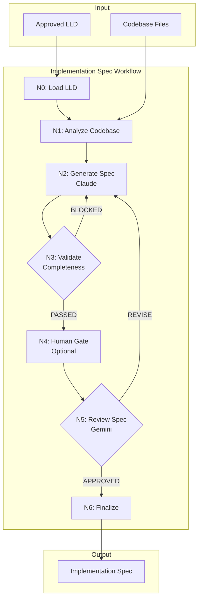

# Implementation Request: tests/unit/test_implementation_spec_workflow.py

## Task

Write the complete contents of `tests/unit/test_implementation_spec_workflow.py`.

Change type: Add
Description: Unit tests for workflow

## LLD Specification

# 304 - Feature: Implementation Readiness Review Workflow (LLD → Implementation Spec)

<!-- Template Metadata
Last Updated: 2026-02-16
Updated By: LLD Generation Workflow
Update Reason: Revision to fix path validation errors - directories don't exist
-->

## 1. Context & Goal
* **Issue:** #304
* **Objective:** Create a workflow that transforms approved LLDs into Implementation Specs with enough concrete detail for autonomous AI implementation
* **Status:** Approved (gemini-3-pro-preview, 2026-02-16)
* **Related Issues:** #139 (rename workflows/testing/ to workflows/implementation/)

### Open Questions

- [x] Should the Implementation Spec be a separate file or an appendix to the LLD? **Decision: Separate file in `docs/lld/drafts/` directory (using existing directory)**
- [x] What is the target success rate for first-try implementations? **Decision: >80% per issue requirements**
- [ ] Should there be a "lightweight" mode for simple changes that don't need full spec generation?

## 2. Proposed Changes

*This section is the **source of truth** for implementation. Describe exactly what will be built.*

### 2.1 Files Changed

| File | Change Type | Description |
|------|-------------|-------------|
| `assemblyzero/workflows/implementation_spec/` | Add (Directory) | New workflow package directory |
| `assemblyzero/workflows/implementation_spec/__init__.py` | Add | Package init with workflow exports |
| `assemblyzero/workflows/implementation_spec/graph.py` | Add | LangGraph workflow definition |
| `assemblyzero/workflows/implementation_spec/state.py` | Add | TypedDict state definitions |
| `assemblyzero/workflows/implementation_spec/nodes/` | Add (Directory) | Nodes subpackage directory |
| `assemblyzero/workflows/implementation_spec/nodes/__init__.py` | Add | Nodes package init |
| `assemblyzero/workflows/implementation_spec/nodes/load_lld.py` | Add | N0: Load approved LLD |
| `assemblyzero/workflows/implementation_spec/nodes/analyze_codebase.py` | Add | N1: Extract current state from files |
| `assemblyzero/workflows/implementation_spec/nodes/generate_spec.py` | Add | N2: Generate implementation spec draft |
| `assemblyzero/workflows/implementation_spec/nodes/validate_completeness.py` | Add | N3: Validate mechanical completeness |
| `assemblyzero/workflows/implementation_spec/nodes/human_gate.py` | Add | N4: Optional human review gate |
| `assemblyzero/workflows/implementation_spec/nodes/review_spec.py` | Add | N5: Gemini readiness review |
| `assemblyzero/workflows/implementation_spec/nodes/finalize_spec.py` | Add | N6: Finalize and write spec |
| `docs/standards/0701-implementation-spec-template.md` | Add | Template for Implementation Specs |
| `docs/standards/0702-implementation-readiness-review.md` | Add | Review criteria and process documentation |
| `docs/prompts/` | Add (Directory) | New prompts directory under docs |
| `docs/prompts/implementation_spec/` | Add (Directory) | Prompts for this workflow |
| `docs/prompts/implementation_spec/drafter_system.md` | Add | Claude system prompt for spec generation |
| `docs/prompts/implementation_spec/drafter_user.md` | Add | Claude user prompt template |
| `docs/prompts/implementation_spec/reviewer_system.md` | Add | Gemini system prompt for readiness review |
| `docs/prompts/implementation_spec/reviewer_user.md` | Add | Gemini user prompt template |
| `tools/run_implementation_spec_workflow.py` | Add | CLI tool to run the workflow |
| `tests/unit/test_implementation_spec_workflow.py` | Add | Unit tests for workflow |
| `tests/unit/test_implementation_spec_nodes.py` | Add | Unit tests for individual nodes |

### 2.1.1 Path Validation (Mechanical - Auto-Checked)

*Issue #277: Before human or Gemini review, paths are verified programmatically.*

Mechanical validation automatically checks:
- All "Modify" files must exist in repository
- All "Delete" files must exist in repository
- All "Add" files must have existing parent directories
- No placeholder prefixes (`src/`, `lib/`, `app/`) unless directory exists

**Parent directories to verify exist:**
- `assemblyzero/workflows/` ✓ (exists, see repo structure)
- `docs/standards/` ✓ (exists, see repo structure)
- `docs/` ✓ (exists, for new `docs/prompts/` directory)
- `tools/` ✓ (exists, see repo structure)
- `tests/unit/` ✓ (exists, see repo structure)

**New directories being created:**
- `assemblyzero/workflows/implementation_spec/` - Parent `assemblyzero/workflows/` exists ✓
- `assemblyzero/workflows/implementation_spec/nodes/` - Created after parent ✓
- `docs/prompts/` - Parent `docs/` exists ✓
- `docs/prompts/implementation_spec/` - Created after parent ✓

**If validation fails, the LLD is BLOCKED before reaching review.**

### 2.2 Dependencies

*New packages, APIs, or services required.*

```toml
# pyproject.toml additions (if any)
# No new dependencies required - uses existing:
# - langgraph (workflow orchestration)
# - anthropic (Claude for drafting)
# - google-generativeai (Gemini for review)
```

### 2.3 Data Structures

```python
# State for the Implementation Spec workflow
class ImplementationSpecState(TypedDict):
    # Input
    issue_number: int                    # GitHub issue being implemented
    lld_path: str                        # Path to approved LLD file
    
    # Loaded content
    lld_content: str                     # Raw LLD markdown
    files_to_modify: list[FileToModify]  # Parsed from LLD section 2.1
    
    # Codebase analysis
    current_state_snapshots: dict[str, str]  # file_path -> code excerpt
    pattern_references: list[PatternRef]      # Similar patterns found
    
    # Generated spec
    spec_draft: str                      # Generated Implementation Spec
    spec_path: str                       # Output path for spec
    
    # Validation
    completeness_issues: list[str]       # Issues found in N3
    validation_passed: bool              # N3 result
    
    # Review
    review_verdict: Literal["APPROVED", "REVISE", "BLOCKED"]
    review_feedback: str                 # Gemini review comments
    review_iteration: int                # Current review round
    
    # Workflow control
    max_iterations: int                  # Default 3
    human_gate_enabled: bool             # Whether N4 is active
    
class FileToModify(TypedDict):
    path: str                # File path from LLD
    change_type: Literal["Add", "Modify", "Delete"]
    description: str         # From LLD
    current_content: str | None  # Loaded in N1 for Modify/Delete
    
class PatternRef(TypedDict):
    file_path: str           # Where pattern exists
    start_line: int          # Line range
    end_line: int
    pattern_type: str        # e.g., "node implementation", "state definition"
    relevance: str           # Why this pattern is relevant

class CompletenessCheck(TypedDict):
    check_name: str          # e.g., "modify_files_have_excerpts"
    passed: bool
    details: str             # Explanation if failed
```

### 2.4 Function Signatures

```python
# graph.py
def create_implementation_spec_graph() -> CompiledStateGraph:
    """Create the LangGraph workflow for Implementation Spec generation."""
    ...

def route_after_validation(state: ImplementationSpecState) -> str:
    """Route after N3: to N4/N5 if passed, back to N2 if blocked."""
    ...

def route_after_review(state: ImplementationSpecState) -> str:
    """Route after N5: to N6 if approved, back to N2 if revise."""
    ...

# nodes/load_lld.py
def load_lld(state: ImplementationSpecState) -> dict:
    """N0: Load and parse the approved LLD file."""
    ...

def parse_files_to_modify(lld_content: str) -> list[FileToModify]:
    """Extract files from LLD Section 2.1 table."""
    ...

# nodes/analyze_codebase.py
def analyze_codebase(state: ImplementationSpecState) -> dict:
    """N1: Read files and extract current state snapshots."""
    ...

def extract_relevant_excerpt(file_path: str, lld_context: str) -> str:
    """Extract the portion of file relevant to the change."""
    ...

def find_pattern_references(
    files_to_modify: list[FileToModify],
    repo_root: Path
) -> list[PatternRef]:
    """Find similar implementation patterns in the codebase."""
    ...

# nodes/generate_spec.py
async def generate_spec(state: ImplementationSpecState) -> dict:
    """N2: Generate Implementation Spec draft using Claude."""
    ...

def build_drafter_prompt(
    lld_content: str,
    current_state: dict[str, str],
    patterns: list[PatternRef]
) -> str:
    """Build the prompt for Claude spec generation."""
    ...

# nodes/validate_completeness.py
def validate_completeness(state: ImplementationSpecState) -> dict:
    """N3: Check that spec meets mechanical completeness criteria."""
    ...

def check_modify_files_have_excerpts(spec: str, files: list[FileToModify]) -> CompletenessCheck:
    """Every 'Modify' file must have current state excerpt."""
    ...

def check_data_structures_have_examples(spec: str) -> CompletenessCheck:
    """Every data structure must have concrete JSON/YAML example."""
    ...

def check_functions_have_io_examples(spec: str) -> CompletenessCheck:
    """Every function must have input/output examples."""
    ...

def check_change_instructions_specific(spec: str) -> CompletenessCheck:
    """Change instructions must be diff-level specific."""
    ...

def check_pattern_references_valid(
    spec: str, 
    pattern_refs: list[PatternRef]
) -> CompletenessCheck:
    """Verify referenced patterns exist at specified locations."""
    ...

# nodes/human_gate.py
def human_gate(state: ImplementationSpecState) -> dict:
    """N4: Optional human review checkpoint."""
    ...

# nodes/review_spec.py
async def review_spec(state: ImplementationSpecState) -> dict:
    """N5: Send spec to Gemini for implementation readiness review."""
    ...

def parse_review_verdict(response: str) -> tuple[str, str]:
    """Extract verdict and feedback from Gemini response."""
    ...

# nodes/finalize_spec.py
def finalize_spec(state: ImplementationSpecState) -> dict:
    """N6: Write final spec to docs/lld/drafts/ directory."""
    ...

def generate_spec_filename(issue_number: int) -> str:
    """Generate filename like 'spec-0304-implementation-readiness.md'."""
    ...
```

### 2.5 Logic Flow (Pseudocode)

```
1. N0: Load LLD
   - Read approved LLD file from docs/lld/active/{issue}.md or docs/lld/done/{issue}.md
   - Parse Section 2.1 to extract files to modify
   - Validate LLD has "APPROVED" status
   - IF not approved THEN abort with error
   
2. N1: Analyze Codebase
   - FOR each file in files_to_modify:
     - IF change_type is "Modify" or "Delete":
       - Read file content
       - Extract relevant excerpt (functions/classes mentioned in LLD)
     - Store in current_state_snapshots
   - Scan repo for similar patterns (existing workflows, nodes)
   - Store pattern references with file:line locations
   
3. N2: Generate Spec
   - Build prompt with:
     - Full LLD content
     - Current state snapshots for each file
     - Pattern references with code excerpts
     - Implementation Spec template
   - Call Claude API with drafter prompts
   - Parse response as Implementation Spec draft
   
4. N3: Validate Completeness
   - Run mechanical checks:
     - Every "Modify" file has current state excerpt
     - Every data structure has concrete example
     - Every function has I/O examples
     - Change instructions are specific (contains line refs or diff notation)
     - Pattern references point to existing code
   - IF any check fails:
     - validation_passed = False
     - Store issues in completeness_issues
   - ELSE:
     - validation_passed = True
   
5. Route after N3:
   - IF validation_passed AND review_iteration < max_iterations:
     - IF human_gate_enabled: goto N4
     - ELSE: goto N5
   - ELSE IF NOT validation_passed:
     - IF review_iteration < max_iterations: goto N2 (regenerate)
     - ELSE: abort with "Max iterations exceeded"
   
6. N4: Human Gate (optional)
   - Display spec draft for human review
   - Prompt for approval/feedback
   - IF approved: continue to N5
   - IF feedback provided: goto N2 with feedback
   
7. N5: Review Spec
   - Build Gemini prompt with:
     - Implementation Spec draft
     - Readiness review criteria
   - Call Gemini API
   - Parse verdict: APPROVED / REVISE / BLOCKED
   - Store feedback
   
8. Route after N5:
   - IF verdict == "APPROVED": goto N6
   - IF verdict == "REVISE" AND iteration < max:
     - Increment review_iteration
     - goto N2 with feedback
   - IF verdict == "BLOCKED" OR iteration >= max:
     - Abort with review feedback
   
9. N6: Finalize Spec
   - Add review log to spec
   - Write to docs/lld/drafts/spec-{issue_number}.md
   - Return success with spec path
```

### 2.6 Technical Approach

* **Module:** `assemblyzero/workflows/implementation_spec/`
* **Pattern:** LangGraph state machine with conditional routing
* **Key Decisions:** 
  - Reuse existing workflow patterns from `workflows/requirements/`
  - Separate mechanical validation (N3) from semantic review (N5)
  - Make human gate optional (default: disabled for automation)

### 2.7 Architecture Decisions

| Decision | Options Considered | Choice | Rationale |
|----------|-------------------|--------|-----------|
| Spec storage location | Append to LLD, Separate file, In-memory only | Separate file in `docs/lld/drafts/` | Clean separation of concerns; LLD is design, Spec is execution; uses existing directory |
| Drafter model | Claude, Gemini, GPT-4 | Claude (via SDK) | Consistent with existing workflows; better at structured generation |
| Reviewer model | Claude, Gemini | Gemini | Different perspective from drafter; Gemini good at checklist validation |
| Validation timing | Before review only, After generation only, Both | Before review (N3) | Catch mechanical issues early, save API costs |
| Pattern matching approach | AST parsing, Regex, Embedding search | Regex + file scanning | Simple, fast, sufficient for finding similar node implementations |
| Prompts location | `prompts/` (root), `docs/prompts/`, inline | `docs/prompts/` | Root `prompts/` doesn't exist; `docs/` has existing structure |

**Architectural Constraints:**
- Must integrate with existing `run_requirements_workflow.py` pattern
- Must use existing Gemini/Claude credential paths
- Cannot introduce new external dependencies beyond existing stack
- Must follow existing node structure (single file per node, state in/dict out)

## 3. Requirements

*What must be true when this is done. These become acceptance criteria.*

1. **R1:** Workflow transforms approved LLDs into Implementation Specs with concrete details
2. **R2:** Every "Modify" file in the spec includes current state excerpt from the actual codebase
3. **R3:** Every data structure has at least one concrete JSON/YAML example (not just TypedDict)
4. **R4:** Every function signature has input/output examples with actual values
5. **R5:** Change instructions are specific enough to generate diffs (line-level guidance)
6. **R6:** Pattern references include file:line and are verified to exist
7. **R7:** Gemini review uses different criteria than LLD review (executability focus)
8. **R8:** Workflow achieves >80% first-try implementation success rate
9. **R9:** CLI tool follows existing pattern (`run_implementation_spec_workflow.py`)
10. **R10:** Human gate is optional and defaults to disabled

## 4. Alternatives Considered

| Option | Pros | Cons | Decision |
|--------|------|------|----------|
| Extend LLD template instead of separate spec | Single document, less complexity | LLD becomes too large, mixes design with execution | **Rejected** |
| Use Claude for both drafting and review | Consistent model, simpler | No independent perspective, may miss issues drafter would miss | **Rejected** |
| Skip mechanical validation (N3) | Faster workflow | Wastes API calls on incomplete specs | **Rejected** |
| Make human gate mandatory | Catches more issues | Blocks automation, defeats purpose | **Rejected** |
| Generate specs as part of implementation workflow | Single workflow, less overhead | Harder to debug, can't pre-verify spec quality | **Rejected** |
| Store prompts in root `prompts/` directory | Matches some patterns | Directory doesn't exist; would need to create | **Rejected** |

**Rationale:** Separate spec file with mechanical validation before Gemini review provides the best balance of automation and quality control. Using `docs/prompts/` leverages existing `docs/` directory structure.

## 5. Data & Fixtures

### 5.1 Data Sources

| Attribute | Value |
|-----------|-------|
| Source | Approved LLD files in `docs/lld/`, codebase files |
| Format | Markdown (LLD), Python (codebase) |
| Size | LLDs: 5-30KB, Codebase files: 1-50KB each |
| Refresh | On-demand per workflow run |
| Copyright/License | MIT (AssemblyZero project) |

### 5.2 Data Pipeline

```
docs/lld/{issue}.md ──parse──► FileToModify list ──read──► Current state snapshots
                                                              │
                                                              ▼
                                              Pattern references ──build──► Claude prompt
                                                                              │
                                                                              ▼
                                              Implementation Spec draft ──validate──► N3
                                                                              │
                                                                              ▼
                                              Gemini review ──finalize──► docs/lld/drafts/spec-{issue}.md
```

### 5.3 Test Fixtures

| Fixture | Source | Notes |
|---------|--------|-------|
| `tests/fixtures/lld_approved_simple.md` | Generated | Simple LLD with 2 files to modify |
| `tests/fixtures/lld_approved_complex.md` | Generated | Complex LLD with 10+ files, patterns |
| `tests/fixtures/lld_not_approved.md` | Generated | LLD without APPROVED status |
| `tests/fixtures/mock_codebase/` | Generated | Minimal codebase structure for testing |
| `tests/fixtures/spec_complete.md` | Generated | Example of complete Implementation Spec |
| `tests/fixtures/spec_incomplete.md` | Generated | Spec failing completeness checks |

### 5.4 Deployment Pipeline

N/A - CLI tool runs locally. Specs are committed to repository like LLDs.

## 6. Diagram

### 6.1 Mermaid Quality Gate

Before finalizing any diagram, verify in [Mermaid Live Editor](https://mermaid.live) or GitHub preview:

- [x] **Simplicity:** Similar components collapsed (per 0006 §8.1)
- [x] **No touching:** All elements have visual separation (per 0006 §8.2)
- [x] **No hidden lines:** All arrows fully visible (per 0006 §8.3)
- [x] **Readable:** Labels not truncated, flow direction clear
- [ ] **Auto-inspected:** Agent rendered via mermaid.ink and viewed (per 0006 §8.5)

**Auto-Inspection Results:**
```
- Touching elements: [ ] None / [ ] Found: ___
- Hidden lines: [ ] None / [ ] Found: ___
- Label readability: [ ] Pass / [ ] Issue: ___
- Flow clarity: [ ] Clear / [ ] Issue: ___
```

*Reference: [0006-mermaid-diagrams.md](0006-mermaid-diagrams.md)*

### 6.2 Diagram



## 7. Security & Safety Considerations

### 7.1 Security

| Concern | Mitigation | Status |
|---------|------------|--------|
| API key exposure in logs | Use existing credential handling; no keys in state | Addressed |
| Arbitrary file read | Limit file reads to files listed in LLD Section 2.1 | Addressed |
| Prompt injection via LLD | LLD is internal document, not user input | N/A |

### 7.2 Safety

| Concern | Mitigation | Status |
|---------|------------|--------|
| Infinite retry loops | Max 3 iterations (configurable) | Addressed |
| Large file loading | Excerpt extraction limits content size; use `summarize_file_for_context()` | Addressed |
| API timeout | Use existing `compute_dynamic_timeout()` from #373 | Addressed |
| Partial spec written on failure | Atomic write: generate to temp, move on success | Addressed |

**Fail Mode:** Fail Closed - If validation or review fails after max iterations, workflow aborts without writing spec

**Recovery Strategy:** Re-run workflow from beginning; no partial state persisted between runs

## 8. Performance & Cost Considerations

### 8.1 Performance

| Metric | Budget | Approach |
|--------|--------|----------|
| Total workflow time | < 5 minutes | Parallel file reads in N1; single API call per node |
| Memory | < 256MB | Stream file reads; don't load entire codebase |
| API calls per run | 2-6 (1 Claude + 1-3 Gemini) | Mechanical validation reduces unnecessary reviews |

**Bottlenecks:** 
- Claude spec generation (30-60s per call)
- Gemini review (15-30s per call)
- Large codebases may slow N1 file scanning

### 8.2 Cost Analysis

| Resource | Unit Cost | Estimated Usage | Monthly Cost |
|----------|-----------|-----------------|--------------|
| Claude Sonnet (spec gen) | ~$0.003/1K tokens | ~20K tokens/run, 30 runs/month | ~$1.80 |
| Gemini Pro (review) | ~$0.00025/1K tokens | ~15K tokens/run, 45 runs/month | ~$0.17 |
| Total | | | ~$2.00 |

**Cost Controls:**
- [x] Mechanical validation (N3) prevents unnecessary Gemini calls
- [x] Max iteration limit prevents runaway retries
- [x] Excerpt extraction limits prompt size

**Worst-Case Scenario:** If every run hits 3 iterations, costs ~$6/month - acceptable

## 9. Legal & Compliance

| Concern | Applies? | Mitigation |
|---------|----------|------------|
| PII/Personal Data | No | Workflow processes code and docs only |
| Third-Party Licenses | No | Uses existing licensed dependencies |
| Terms of Service | Yes | Claude and Gemini API usage within ToS |
| Data Retention | No | Specs stored in git, follows project policy |
| Export Controls | No | No restricted algorithms |

**Data Classification:** Internal (design documents)

**Compliance Checklist:**
- [x] No PII stored without consent
- [x] All third-party licenses compatible with project license
- [x] External API usage compliant with provider ToS
- [x] Data retention policy documented (git history)

## 10. Verification & Testing

### 10.0 Test Plan (TDD - Complete Before Implementation)

**TDD Requirement:** Tests MUST be written and failing BEFORE implementation begins.

| Test ID | Test Description | Expected Behavior | Status |
|---------|------------------|-------------------|--------|
| T010 | Load approved LLD | Parses LLD and extracts files list | RED |
| T020 | Reject unapproved LLD | Raises error for PENDING status | RED |
| T030 | Analyze codebase extracts excerpts | Returns dict of file→excerpt | RED |
| T040 | Generate spec includes all sections | Spec has concrete examples | RED |
| T050 | Validate completeness catches missing excerpts | Returns BLOCKED | RED |
| T060 | Validate completeness passes complete spec | Returns PASSED | RED |
| T070 | Review spec routing on APPROVED | Routes to N6 | RED |
| T080 | Review spec routing on REVISE | Routes to N2, increments iteration | RED |
| T090 | Finalize writes spec file | File exists at expected path | RED |
| T100 | CLI runs full workflow | Produces spec file | RED |

**Coverage Target:** ≥95% for all new code

**TDD Checklist:**
- [ ] All tests written before implementation
- [ ] Tests currently RED (failing)
- [ ] Test IDs match scenario IDs in 10.1
- [ ] Test file created at: `tests/unit/test_implementation_spec_workflow.py`

### 10.1 Test Scenarios

| ID | Scenario | Type | Input | Expected Output | Pass Criteria |
|----|----------|------|-------|-----------------|---------------|
| 010 | Happy path - simple LLD | Auto | `tests/fixtures/lld_approved_simple.md` | Spec at `docs/lld/drafts/spec-999.md` | File exists, contains excerpts |
| 020 | Complex LLD with many files | Auto | `tests/fixtures/lld_approved_complex.md` | Complete spec | All 10+ files have excerpts |
| 030 | Unapproved LLD rejection | Auto | `tests/fixtures/lld_not_approved.md` | Error raised | Workflow aborts before N1 |
| 040 | File not found in codebase | Auto | LLD with non-existent file | Graceful error | Clear message about missing file |
| 050 | Incomplete spec regeneration | Auto | Mock Claude returns incomplete | N3 → N2 retry | Second attempt improves |
| 060 | Max iterations exceeded | Auto | Mock always returns incomplete | Workflow aborts | Error after 3 iterations |
| 070 | Gemini REVISE verdict | Auto | Mock Gemini returns REVISE | Regenerate with feedback | Feedback in next N2 prompt |
| 080 | Pattern reference validation | Auto | Spec references existing pattern | Check passes | Pattern at file:line exists |
| 090 | Invalid pattern reference | Auto | Spec references non-existent line | Check fails | Completeness blocked |
| 100 | CLI end-to-end | Auto | Valid issue number | Spec file created | Exit code 0 |

### 10.2 Test Commands

```bash
# Run all automated tests
poetry run pytest tests/unit/test_implementation_spec_workflow.py tests/unit/test_implementation_spec_nodes.py -v

# Run only fast/mocked tests (exclude live)
poetry run pytest tests/unit/test_implementation_spec_*.py -v -m "not live"

# Run live integration tests (hits real APIs)
poetry run pytest tests/unit/test_implementation_spec_*.py -v -m live
```

### 10.3 Manual Tests (Only If Unavoidable)

N/A - All scenarios automated.

## 11. Risks & Mitigations

| Risk | Impact | Likelihood | Mitigation |
|------|--------|------------|------------|
| Claude generates inconsistent spec format | Med | Med | Strict template in prompt; mechanical validation |
| Gemini review criteria too strict | Med | Low | Tunable criteria; start lenient, tighten over time |
| Large codebases slow workflow | Low | Med | Excerpt extraction limits; parallel file reads |
| Pattern matching misses relevant code | Low | Med | Fallback to keyword search; human gate option |
| Implementation success rate below 80% | High | Med | Iterate on prompt engineering; add more examples |

## 12. Definition of Done

### Code
- [ ] Implementation complete and linted
- [ ] Code comments reference this LLD

### Tests
- [ ] All test scenarios pass
- [ ] Test coverage meets threshold (≥95%)

### Documentation
- [ ] LLD updated with any deviations
- [ ] Implementation Report (0103) completed
- [ ] 0701-implementation-spec-template.md created
- [ ] 0702-implementation-readiness-review.md created

### Review
- [ ] Code review completed
- [ ] User approval before closing issue

### 12.1 Traceability (Mechanical - Auto-Checked)

*Issue #277: Cross-references are verified programmatically.*

Files mentioned in Definition of Done:
- `assemblyzero/workflows/implementation_spec/` - Listed in 2.1 ✓
- `docs/standards/0701-implementation-spec-template.md` - Listed in 2.1 ✓
- `docs/standards/0702-implementation-readiness-review.md` - Listed in 2.1 ✓
- `tests/unit/test_implementation_spec_workflow.py` - Listed in 2.1 ✓

Risk mitigations traceability:
- "mechanical validation" → `validate_completeness()` in 2.4 ✓
- "excerpt extraction" → `extract_relevant_excerpt()` in 2.4 ✓

**If files are missing from Section 2.1, the LLD is BLOCKED.**

---

## Reviewer Suggestions

*Non-blocking recommendations from the reviewer.*

- **Performance:** Ensure `nodes/analyze_codebase.py` implements a reasonable timeout or file size limit when extracting excerpts to prevent hanging on accidentally large files.
- **Maintainability:** Consider versioning the `docs/standards/0701-implementation-spec-template.md` (e.g., adding a version header) so the workflow can detect if it's generating an outdated spec format in the future.

## Appendix: Review Log

*Track all review feedback with timestamps and implementation status.*

### Review Summary

| Review | Date | Verdict | Key Issue |
|--------|------|---------|-----------|
| 1 | 2026-02-16 | APPROVED | `gemini-3-pro-preview` |
| | | | |

**Final Status:** APPROVED

## Required File Paths (from LLD - do not deviate)

The following paths are specified in the LLD. Write ONLY to these paths:

- `assemblyzero/workflows/implementation_spec`
- `assemblyzero/workflows/implementation_spec/__init__.py`
- `assemblyzero/workflows/implementation_spec/graph.py`
- `assemblyzero/workflows/implementation_spec/nodes`
- `assemblyzero/workflows/implementation_spec/nodes/__init__.py`
- `assemblyzero/workflows/implementation_spec/nodes/analyze_codebase.py`
- `assemblyzero/workflows/implementation_spec/nodes/finalize_spec.py`
- `assemblyzero/workflows/implementation_spec/nodes/generate_spec.py`
- `assemblyzero/workflows/implementation_spec/nodes/human_gate.py`
- `assemblyzero/workflows/implementation_spec/nodes/load_lld.py`
- `assemblyzero/workflows/implementation_spec/nodes/review_spec.py`
- `assemblyzero/workflows/implementation_spec/nodes/validate_completeness.py`
- `assemblyzero/workflows/implementation_spec/state.py`
- `docs/prompts`
- `docs/prompts/implementation_spec`
- `docs/prompts/implementation_spec/drafter_system.md`
- `docs/prompts/implementation_spec/drafter_user.md`
- `docs/prompts/implementation_spec/reviewer_system.md`
- `docs/prompts/implementation_spec/reviewer_user.md`
- `docs/standards/0701-implementation-spec-template.md`
- `docs/standards/0702-implementation-readiness-review.md`
- `tools/run_implementation_spec_workflow.py`
- `tests/unit/test_implementation_spec_nodes.py`
- `tests/unit/test_implementation_spec_workflow.py`

Any files written to other paths will be rejected.

## Tests That Must Pass

```python
# From C:\Users\mcwiz\Projects\AssemblyZero-304\tests\test_issue_304.py
"""Test file for Issue #304.

Generated by AssemblyZero TDD Testing Workflow.
Tests will fail with ImportError until implementation exists (TDD RED phase).
"""

import pytest

# TDD: This import fails until implementation exists (RED phase)
# Once implemented, tests can run (GREEN phase)
from assemblyzero.workflows.implementation_spec.graph import *  # noqa: F401, F403


# Fixtures for mocking
@pytest.fixture
def mock_external_service():
    """Mock external service for isolation."""
    # TODO: Implement mock
    yield None


# Integration/E2E fixtures
@pytest.fixture
def test_client():
    """Test client for API calls."""
    # TODO: Implement test client
    yield None


# Unit Tests
# -----------

def test_id():
    """
    Test Description | Expected Behavior | Status
    """
    # TDD: Arrange
    # Set up test data

    # TDD: Act
    # Call the function under test

    # TDD: Assert
    # Verify test_id works correctly
    assert False, 'TDD RED: test_id not implemented'


def test_t010():
    """
    Load approved LLD | Parses LLD and extracts files list | RED
    """
    # TDD: Arrange
    # Set up test data

    # TDD: Act
    # Call the function under test

    # TDD: Assert
    # Verify test_t010 works correctly
    assert False, 'TDD RED: test_t010 not implemented'


def test_t020():
    """
    Reject unapproved LLD | Raises error for PENDING status | RED
    """
    # TDD: Arrange
    # Set up test data

    # TDD: Act
    # Call the function under test

    # TDD: Assert
    # Verify test_t020 works correctly
    assert False, 'TDD RED: test_t020 not implemented'


def test_t030():
    """
    Analyze codebase extracts excerpts | Returns dict of file→excerpt |
    RED
    """
    # TDD: Arrange
    # Set up test data

    # TDD: Act
    # Call the function under test

    # TDD: Assert
    # Verify test_t030 works correctly
    assert False, 'TDD RED: test_t030 not implemented'


def test_t040():
    """
    Generate spec includes all sections | Spec has concrete examples |
    RED
    """
    # TDD: Arrange
    # Set up test data

    # TDD: Act
    # Call the function under test

    # TDD: Assert
    # Verify test_t040 works correctly
    assert False, 'TDD RED: test_t040 not implemented'


def test_t050():
    """
    Validate completeness catches missing excerpts | Returns BLOCKED |
    RED
    """
    # TDD: Arrange
    # Set up test data

    # TDD: Act
    # Call the function under test

    # TDD: Assert
    # Verify test_t050 works correctly
    assert False, 'TDD RED: test_t050 not implemented'


def test_t060():
    """
    Validate completeness passes complete spec | Returns PASSED | RED
    """
    # TDD: Arrange
    # Set up test data

    # TDD: Act
    # Call the function under test

    # TDD: Assert
    # Verify test_t060 works correctly
    assert False, 'TDD RED: test_t060 not implemented'


def test_t070():
    """
    Review spec routing on APPROVED | Routes to N6 | RED
    """
    # TDD: Arrange
    # Set up test data

    # TDD: Act
    # Call the function under test

    # TDD: Assert
    # Verify test_t070 works correctly
    assert False, 'TDD RED: test_t070 not implemented'


def test_t080():
    """
    Review spec routing on REVISE | Routes to N2, increments iteration |
    RED
    """
    # TDD: Arrange
    # Set up test data

    # TDD: Act
    # Call the function under test

    # TDD: Assert
    # Verify test_t080 works correctly
    assert False, 'TDD RED: test_t080 not implemented'


def test_t090():
    """
    Finalize writes spec file | File exists at expected path | RED
    """
    # TDD: Arrange
    # Set up test data

    # TDD: Act
    # Call the function under test

    # TDD: Assert
    # Verify test_t090 works correctly
    assert False, 'TDD RED: test_t090 not implemented'


def test_t100():
    """
    CLI runs full workflow | Produces spec file | RED
    """
    # TDD: Arrange
    # Set up test data

    # TDD: Act
    # Call the function under test

    # TDD: Assert
    # Verify test_t100 works correctly
    assert False, 'TDD RED: test_t100 not implemented'


def test_010():
    """
    Happy path - simple LLD | Auto |
    `tests/fixtures/lld_approved_simple.md` | Spec at
    `docs/lld/drafts/spec-999.md` | File exists, contains excerpts
    """
    # TDD: Arrange
    # Set up test data

    # TDD: Act
    # Call the function under test

    # TDD: Assert
    # Verify test_010 works correctly
    assert False, 'TDD RED: test_010 not implemented'


def test_020():
    """
    Complex LLD with many files | Auto |
    `tests/fixtures/lld_approved_complex.md` | Complete spec | All 10+
    files have excerpts
    """
    # TDD: Arrange
    # Set up test data

    # TDD: Act
    # Call the function under test

    # TDD: Assert
    # Verify test_020 works correctly
    assert False, 'TDD RED: test_020 not implemented'


def test_030():
    """
    Unapproved LLD rejection | Auto |
    `tests/fixtures/lld_not_approved.md` | Error raised | Workflow aborts
    before N1
    """
    # TDD: Arrange
    # Set up test data

    # TDD: Act
    # Call the function under test

    # TDD: Assert
    # Verify test_030 works correctly
    assert False, 'TDD RED: test_030 not implemented'


def test_040():
    """
    File not found in codebase | Auto | LLD with non-existent file |
    Graceful error | Clear message about missing file
    """
    # TDD: Arrange
    # Set up test data

    # TDD: Act
    # Call the function under test

    # TDD: Assert
    # Verify test_040 works correctly
    assert False, 'TDD RED: test_040 not implemented'


def test_050(mock_external_service):
    """
    Incomplete spec regeneration | Auto | Mock Claude returns incomplete
    | N3 → N2 retry | Second attempt improves
    """
    # TDD: Arrange
    # Set up test data

    # TDD: Act
    # Call the function under test

    # TDD: Assert
    # Verify test_050 works correctly
    assert False, 'TDD RED: test_050 not implemented'


def test_060(mock_external_service):
    """
    Max iterations exceeded | Auto | Mock always returns incomplete |
    Workflow aborts | Error after 3 iterations
    """
    # TDD: Arrange
    # Set up test data

    # TDD: Act
    # Call the function under test

    # TDD: Assert
    # Verify test_060 works correctly
    assert False, 'TDD RED: test_060 not implemented'


def test_070(mock_external_service):
    """
    Gemini REVISE verdict | Auto | Mock Gemini returns REVISE |
    Regenerate with feedback | Feedback in next N2 prompt
    """
    # TDD: Arrange
    # Set up test data

    # TDD: Act
    # Call the function under test

    # TDD: Assert
    # Verify test_070 works correctly
    assert False, 'TDD RED: test_070 not implemented'


def test_080():
    """
    Pattern reference validation | Auto | Spec references existing
    pattern | Check passes | Pattern at file:line exists
    """
    # TDD: Arrange
    # Set up test data

    # TDD: Act
    # Call the function under test

    # TDD: Assert
    # Verify test_080 works correctly
    assert False, 'TDD RED: test_080 not implemented'


def test_090():
    """
    Invalid pattern reference | Auto | Spec references non-existent line
    | Check fails | Completeness blocked
    """
    # TDD: Arrange
    # Set up test data

    # TDD: Act
    # Call the function under test

    # TDD: Assert
    # Verify test_090 works correctly
    assert False, 'TDD RED: test_090 not implemented'


# E2E Tests
# ---------

@pytest.mark.e2e
def test_100(test_client):
    """
    CLI end-to-end | Auto | Valid issue number | Spec file created | Exit
    code 0
    """
    # TDD: Arrange
    # Set up test data

    # TDD: Act
    # Call the function under test

    # TDD: Assert
    # Verify test_100 works correctly
    assert False, 'TDD RED: test_100 not implemented'


```

## Previously Implemented Files

These files have already been implemented. Use them for imports and references:

### assemblyzero/workflows/implementation_spec/__init__.py (signatures)

```python
"""Implementation Spec Workflow package.

Issue #304: Implementation Readiness Review Workflow (LLD → Implementation Spec)

This package provides a workflow that transforms approved LLDs into
Implementation Specs with enough concrete detail for autonomous AI
implementation.

Key components:
- state: ImplementationSpecState TypedDict and supporting types
- graph: LangGraph workflow definition with conditional routing
- nodes/: Individual node implementations (N0-N6)

Workflow steps:
1. N0: Load approved LLD and parse files list
2. N1: Analyze codebase, extract current state excerpts
3. N2: Generate Implementation Spec draft (Claude)
4. N3: Validate mechanical completeness
5. N4: Optional human review gate
6. N5: Gemini readiness review
7. N6: Finalize and write spec to docs/lld/drafts/
"""

from assemblyzero.workflows.implementation_spec.graph import (
    create_implementation_spec_graph,
    route_after_review,
    route_after_validation,
)

from assemblyzero.workflows.implementation_spec.state import (
    CompletenessCheck,
    FileToModify,
    ImplementationSpecState,
    PatternRef,
)
```

### assemblyzero/workflows/implementation_spec/graph.py (signatures)

```python
"""LangGraph workflow definition for Implementation Spec generation.

Issue #304: Implementation Readiness Review Workflow (LLD → Implementation Spec)

Creates a LangGraph StateGraph that connects:
- N0: load_lld (load and parse approved LLD)
- N1: analyze_codebase (extract current state from files)
- N2: generate_spec (generate Implementation Spec draft via Claude)
- N3: validate_completeness (mechanical completeness checks)
- N4: human_gate (optional human review checkpoint)
- N5: review_spec (Gemini readiness review)
- N6: finalize_spec (write final spec to docs/lld/drafts/)

Graph structure:
    START -> N0 -> N1 -> N2 -> N3 -> N4 -> N5 -> N6 -> END
                          ^         |              |
                          |         v              |
                          +---------+--------------+

Routing is controlled by:
- validation_passed: N3 result determines if spec meets completeness criteria
- review_verdict: N5 Gemini verdict (APPROVED / REVISE / BLOCKED)
- review_iteration: Current iteration count vs max_iterations
- human_gate_enabled: Whether N4 is active (default: disabled)
"""

from typing import Literal

from langgraph.graph import END, START, StateGraph

from langgraph.graph.state import CompiledStateGraph

from assemblyzero.workflows.implementation_spec.nodes.analyze_codebase import (
    analyze_codebase,
)

from assemblyzero.workflows.implementation_spec.nodes.finalize_spec import (
    finalize_spec,
)

from assemblyzero.workflows.implementation_spec.nodes.generate_spec import (
    generate_spec,
)

from assemblyzero.workflows.implementation_spec.nodes.human_gate import human_gate

from assemblyzero.workflows.implementation_spec.nodes.load_lld import load_lld

from assemblyzero.workflows.implementation_spec.nodes.review_spec import review_spec

from assemblyzero.workflows.implementation_spec.nodes.validate_completeness import (
    validate_completeness,
)

from assemblyzero.workflows.implementation_spec.state import ImplementationSpecState

def route_after_load(
    state: ImplementationSpecState,
) -> Literal["N1_analyze_codebase", "END"]:
    """Route after N0: load_lld.

Routes to:"""
    ...

def route_after_analyze(
    state: ImplementationSpecState,
) -> Literal["N2_generate_spec", "END"]:
    """Route after N1: analyze_codebase.

Routes to:"""
    ...

def route_after_validation(
    state: ImplementationSpecState,
) -> Literal["N4_human_gate", "N5_review_spec", "N2_generate_spec", "END"]:
    """Route after N3: validate_completeness.

Routes to:"""
    ...

def route_after_human_gate(
    state: ImplementationSpecState,
) -> Literal["N5_review_spec", "N2_generate_spec", "END"]:
    """Route after N4: human_gate.

Routes based on human decision:"""
    ...

def route_after_review(
    state: ImplementationSpecState,
) -> Literal["N6_finalize_spec", "N2_generate_spec", "END"]:
    """Route after N5: review_spec.

Routes to:"""
    ...

def create_implementation_spec_graph() -> CompiledStateGraph:
    """Create the LangGraph workflow for Implementation Spec generation.

Graph structure:"""
    ...

N0_LOAD_LLD = "N0_load_lld"

N1_ANALYZE_CODEBASE = "N1_analyze_codebase"

N2_GENERATE_SPEC = "N2_generate_spec"

N3_VALIDATE_COMPLETENESS = "N3_validate_completeness"

N4_HUMAN_GATE = "N4_human_gate"

N5_REVIEW_SPEC = "N5_review_spec"

N6_FINALIZE_SPEC = "N6_finalize_spec"
```

### assemblyzero/workflows/implementation_spec/state.py (signatures)

```python
"""TypedDict state definitions for Implementation Spec workflow.

Issue #304: Implementation Readiness Review Workflow (LLD → Implementation Spec)

Defines the state schema used by the LangGraph workflow:
- ImplementationSpecState: Main workflow state
- FileToModify: Parsed file entry from LLD Section 2.1
- PatternRef: Reference to similar implementation patterns
- CompletenessCheck: Result of a mechanical completeness check
"""

from __future__ import annotations

from typing import Literal, TypedDict

class FileToModify(TypedDict):

    """A file entry parsed from LLD Section 2.1.

Attributes:"""

class PatternRef(TypedDict):

    """Reference to a similar implementation pattern in the codebase.

Used by N1 (analyze_codebase) to find existing patterns that inform"""

class CompletenessCheck(TypedDict):

    """Result of a single mechanical completeness check in N3.

Attributes:"""

class ImplementationSpecState(TypedDict, total=False):

    """Main workflow state for the Implementation Spec generation workflow.

This TypedDict defines all state fields used across nodes N0-N6."""
```

### assemblyzero/workflows/implementation_spec/nodes/__init__.py (signatures)

```python
"""Nodes package for Implementation Spec workflow.

Issue #304: Implementation Readiness Review Workflow (LLD → Implementation Spec)

Individual node implementations for the LangGraph workflow:
- N0: load_lld - Load and parse approved LLD
- N1: analyze_codebase - Extract current state from codebase files
- N2: generate_spec - Generate Implementation Spec draft (Claude)
- N3: validate_completeness - Mechanical completeness checks
- N4: human_gate - Optional human review checkpoint
- N5: review_spec - Gemini readiness review
- N6: finalize_spec - Write final spec to docs/lld/drafts/
"""

from assemblyzero.workflows.implementation_spec.nodes.analyze_codebase import (
    analyze_codebase,
    extract_relevant_excerpt,
    find_pattern_references,
)

from assemblyzero.workflows.implementation_spec.nodes.finalize_spec import (
    finalize_spec,
    generate_spec_filename,
)

from assemblyzero.workflows.implementation_spec.nodes.generate_spec import (
    build_drafter_prompt,
    generate_spec,
)

from assemblyzero.workflows.implementation_spec.nodes.human_gate import human_gate

from assemblyzero.workflows.implementation_spec.nodes.load_lld import (
    load_lld,
    parse_files_to_modify,
)

from assemblyzero.workflows.implementation_spec.nodes.review_spec import (
    parse_review_verdict,
    review_spec,
)

from assemblyzero.workflows.implementation_spec.nodes.validate_completeness import (
    check_change_instructions_specific,
    check_data_structures_have_examples,
    check_functions_have_io_examples,
    check_modify_files_have_excerpts,
    check_pattern_references_valid,
    validate_completeness,
)
```

### assemblyzero/workflows/implementation_spec/nodes/load_lld.py (signatures)

```python
"""N0: Load LLD node for Implementation Spec Workflow.

Issue #304: Implementation Readiness Review Workflow (LLD → Implementation Spec)

Reads the approved LLD file and extracts:
- Full LLD content (raw markdown)
- Files to modify from Section 2.1 table
- Validates LLD has APPROVED status

This node populates:
- lld_content: Raw LLD markdown
- files_to_modify: List[FileToModify] parsed from Section 2.1
- error_message: "" on success, error text on failure
"""

import re

from pathlib import Path

from typing import Any

from assemblyzero.workflows.implementation_spec.state import (
    FileToModify,
    ImplementationSpecState,
)

def find_lld_path(issue_number: int, repo_root: Path) -> Path | None:
    """Find the LLD file for an issue number.

Searches docs/lld/active/ and docs/lld/done/ with multiple naming"""
    ...

def parse_files_to_modify(lld_content: str) -> list[FileToModify]:
    """Extract files from LLD Section 2.1 table.

Parses the "Files Changed" table to extract file paths, change types,"""
    ...

def _normalize_change_type(raw: str) -> str:
    """Normalize a change type string to Add, Modify, or Delete.

Handles variations like "Add (Directory)", "Modify", "modify", etc."""
    ...

def _check_approved_status(lld_content: str) -> bool:
    """Check if the LLD has an APPROVED status marker.

Looks for approval markers in common locations:"""
    ...

def load_lld(state: ImplementationSpecState) -> dict[str, Any]:
    """N0: Load and parse the approved LLD file.

Issue #304: Implementation Readiness Review Workflow"""
    ...

LLD_ACTIVE_DIR = Path("docs/lld/active")

LLD_DONE_DIR = Path("docs/lld/done")

LLD_DRAFTS_DIR = Path("docs/lld/drafts")
```

### assemblyzero/workflows/implementation_spec/nodes/analyze_codebase.py (signatures)

```python
"""N1: Analyze Codebase node for Implementation Spec Workflow.

Issue #304: Implementation Readiness Review Workflow (LLD → Implementation Spec)

Reads files listed in the LLD and extracts current state:
- For "Modify" and "Delete" files: reads content and extracts relevant excerpts
- For "Add" files: verifies parent directories exist
- Finds similar implementation patterns in the codebase (existing nodes,
  state definitions, graph constructions) to guide spec generation

This node populates:
- current_state_snapshots: dict[str, str] - file_path → code excerpt
- pattern_references: list[PatternRef] - similar patterns found
- files_to_modify: Updated with current_content for Modify/Delete files
- error_message: "" on success, error text on failure
"""

import ast

import re

from pathlib import Path

from typing import Any

from assemblyzero.workflows.implementation_spec.state import (
    FileToModify,
    ImplementationSpecState,
    PatternRef,
)

def analyze_codebase(state: ImplementationSpecState) -> dict[str, Any]:
    """N1: Read files and extract current state snapshots.

Issue #304: Implementation Readiness Review Workflow"""
    ...

def extract_relevant_excerpt(
    file_path: str, content: str, lld_context: str
) -> str:
    """Extract the portion of a file relevant to the change.

For Python files, uses AST-based summarization to extract imports,"""
    ...

def _summarize_python_file(content: str) -> str:
    """Extract imports and signatures from a Python file for compact context.

Issue #373 pattern: Instead of embedding full file bodies (~20KB+),"""
    ...

def _summarize_function(
    node: ast.FunctionDef | ast.AsyncFunctionDef, source: str
) -> str:
    """Extract function signature and docstring.

Args:"""
    ...

def _summarize_class(node: ast.ClassDef, source: str) -> str:
    """Extract class signature, docstring, and method signatures.

Args:"""
    ...

def _truncate_content(content: str, max_chars: int) -> str:
    """Truncate content to a maximum number of characters.

Truncates at a line boundary to avoid partial lines."""
    ...

def find_pattern_references(
    files_to_modify: list[FileToModify],
    repo_root: Path,
) -> list[PatternRef]:
    """Find similar implementation patterns in the codebase.

Scans the repository for existing implementations that are similar"""
    ...

def _find_node_patterns(
    target_path: str,
    workflows_dir: Path,
    repo_root: Path,
    seen: set[str],
) -> list[PatternRef]:
    """Find existing node implementations as patterns.

Looks for node files in other workflow packages to serve as"""
    ...

def _find_state_patterns(
    workflows_dir: Path,
    repo_root: Path,
    seen: set[str],
) -> list[PatternRef]:
    """Find existing state.py definitions as patterns.

Args:"""
    ...

def _find_graph_patterns(
    workflows_dir: Path,
    repo_root: Path,
    seen: set[str],
) -> list[PatternRef]:
    """Find existing graph.py definitions as patterns.

Args:"""
    ...

def _find_test_patterns(
    target_path: str,
    repo_root: Path,
    seen: set[str],
) -> list[PatternRef]:
    """Find similar test files as patterns.

Args:"""
    ...

def _find_tool_patterns(
    repo_root: Path,
    seen: set[str],
) -> list[PatternRef]:
    """Find existing CLI tool scripts as patterns.

Args:"""
    ...

def _names_similar(name_a: str, name_b: str) -> bool:
    """Check if two identifier names are similar.

Uses a simple heuristic: checks if the names share significant"""
    ...

MAX_FILE_SIZE_BYTES = 1_000_000

MAX_EXCERPT_CHARS = 15_000

MAX_PATTERN_REFS = 10

PYTHON_EXTENSIONS = {".py"}

SKIP_DIRS = {
    "__pycache__",
    ".git",
    ".tox",
    ".mypy_cache",
    ".pytest_cache",
    "node_modules",
    ".venv",
    "venv",
    "done",
}
```

### assemblyzero/workflows/implementation_spec/nodes/generate_spec.py (signatures)

```python
"""N2: Generate Implementation Spec node for Implementation Spec Workflow.

Issue #304: Implementation Readiness Review Workflow (LLD → Implementation Spec)

Uses the configured drafter LLM (Claude) to generate an Implementation Spec
from the approved LLD, codebase analysis results (current state snapshots
and pattern references), and the Implementation Spec template.

Supports revision mode when N3 (validate_completeness) or N5 (review_spec)
routes back with feedback. Revision prompts include cumulative feedback
history to prevent regression.

This node populates:
- spec_draft: Generated Implementation Spec markdown
- spec_path: Path where the draft was saved in the audit trail
- review_iteration: Incremented on revision cycles
- error_message: "" on success, error text on failure
"""

import re

from pathlib import Path

from typing import Any

from assemblyzero.core.llm_provider import get_provider

from assemblyzero.workflows.requirements.audit import (
    get_repo_structure,
    load_template,
    next_file_number,
    save_audit_file,
)

from assemblyzero.workflows.implementation_spec.state import (
    ImplementationSpecState,
    PatternRef,
)

async def generate_spec(state: ImplementationSpecState) -> dict[str, Any]:
    """N2: Generate Implementation Spec draft using Claude.

Issue #304: Implementation Readiness Review Workflow"""
    ...

def build_drafter_prompt(
    lld_content: str,
    current_state: dict[str, str],
    patterns: list[PatternRef],
    template: str = "",
    issue_number: int = 0,
    existing_draft: str = "",
    review_feedback: str = "",
    completeness_issues: list[str] | None = None,
    repo_root: str = "",
    """Build the prompt for Claude spec generation.

Constructs either an initial draft prompt or a revision prompt"""
    ...

def _build_initial_prompt(
    lld_content: str,
    current_state: dict[str, str],
    patterns: list[PatternRef],
    template: str,
    issue_number: int,
    files_to_modify: list,
) -> str:
    """Build prompt for initial spec generation.

Args:"""
    ...

def _build_revision_prompt(
    lld_content: str,
    current_state: dict[str, str],
    patterns: list[PatternRef],
    template: str,
    issue_number: int,
    existing_draft: str,
    review_feedback: str,
    completeness_issues: list[str],
    repo_root: str,
    """Build prompt for spec revision based on feedback.

Args:"""
    ...

def _format_current_state_section(
    current_state: dict[str, str],
    files_to_modify: list,
) -> str:
    """Format current state snapshots into a prompt section.

Args:"""
    ...

def _format_patterns_section(patterns: list[PatternRef]) -> str:
    """Format pattern references into a prompt section.

Args:"""
    ...

def _strip_preamble(content: str) -> str:
    """Strip any preamble text before the first # heading.

Claude sometimes adds explanatory text before the actual spec content"""
    ...

def _truncate_prompt(prompt: str) -> str:
    """Truncate prompt to stay within token limits.

Preserves the beginning (instructions, feedback) and end (template,"""
    ...

SPEC_TEMPLATE_PATH = Path("docs/standards/0701-implementation-spec-template.md")

DEFAULT_DRAFTER = "claude:opus-4.5"

MAX_PATTERN_EXCERPT_CHARS = 3_000

MAX_SNAPSHOT_CHARS = 10_000

MAX_TOTAL_PROMPT_CHARS = 120_000
```

### assemblyzero/workflows/implementation_spec/nodes/validate_completeness.py (signatures)

```python
"""N3: Validate Completeness node for Implementation Spec Workflow.

Issue #304: Implementation Readiness Review Workflow (LLD -> Implementation Spec)

Runs mechanical completeness checks on the generated Implementation Spec
draft to catch issues before expensive Gemini review (N5). Each check
verifies one aspect of spec quality:

- Every "Modify" file must have a current state excerpt
- Every data structure must have a concrete JSON/YAML example
- Every function must have input/output examples
- Change instructions must be specific (diff-level guidance)
- Pattern references must point to existing code locations

This node populates:
- completeness_issues: List of issue descriptions from failed checks
- validation_passed: Whether all checks passed
- error_message: "" on success, error text on failure
"""

import re

from pathlib import Path

from typing import Any

from assemblyzero.workflows.implementation_spec.state import (
    CompletenessCheck,
    FileToModify,
    ImplementationSpecState,
    PatternRef,
)

def validate_completeness(state: ImplementationSpecState) -> dict[str, Any]:
    """N3: Check that spec meets mechanical completeness criteria.

Issue #304: Implementation Readiness Review Workflow"""
    ...

def check_modify_files_have_excerpts(
    spec: str, files: list[FileToModify]
) -> CompletenessCheck:
    """Every 'Modify' file must have current state excerpt.

Scans the spec for references to each Modify file and verifies that"""
    ...

def check_data_structures_have_examples(spec: str) -> CompletenessCheck:
    """Every data structure must have concrete JSON/YAML example.

Looks for data structure definitions (TypedDict, dataclass, dict schemas)"""
    ...

def check_functions_have_io_examples(spec: str) -> CompletenessCheck:
    """Every function must have input/output examples.

Scans the spec for function signatures and verifies each has at least"""
    ...

def check_change_instructions_specific(spec: str) -> CompletenessCheck:
    """Change instructions must be diff-level specific.

Verifies that the spec contains specific change instructions rather"""
    ...

def check_pattern_references_valid(
    spec: str,
    pattern_refs: list[PatternRef],
    repo_root_str: str = "",
) -> CompletenessCheck:
    """Verify referenced patterns exist at specified locations.

Checks that pattern references included in the spec (file:line"""
    ...

def _log_check(check: CompletenessCheck) -> None:
    """Log a single check result.

Args:"""
    ...

MIN_EXCERPT_CHARS = 50

MIN_EXAMPLE_CHARS = 20
```

### assemblyzero/workflows/implementation_spec/nodes/human_gate.py (signatures)

```python
"""N4: Human Gate node for Implementation Spec Workflow.

Issue #304: Implementation Readiness Review Workflow (LLD → Implementation Spec)

Optional human review checkpoint after mechanical validation (N3) passes.
When enabled (human_gate_enabled=True), presents the spec draft to the user
and prompts for a decision:
- [S] Send to Gemini review (proceed to N5)
- [R] Revise spec (return to N2 with optional feedback)
- [M] Manual handling (exit workflow)

When disabled (default), the graph routing in route_after_validation() skips
this node entirely and proceeds directly to N5.

This node populates:
- next_node: Routing decision ("N5_review_spec", "N2_generate_spec", or "END")
- review_feedback: User feedback if revision requested
- error_message: "" on success, error text on failure
"""

from typing import Any

from assemblyzero.workflows.implementation_spec.state import ImplementationSpecState

def _prompt_human_gate() -> str:
    """Prompt user for human gate decision.

Presents three options and loops until a valid choice is entered."""
    ...

def _display_spec_preview(spec_draft: str) -> None:
    """Display a truncated preview of the spec draft for human review.

Shows the first MAX_PREVIEW_LINES of the spec draft so the reviewer"""
    ...

def human_gate(state: ImplementationSpecState) -> dict[str, Any]:
    """N4: Optional human review checkpoint.

Issue #304: Implementation Readiness Review Workflow"""
    ...

MAX_PREVIEW_LINES = 80
```

### assemblyzero/workflows/implementation_spec/nodes/review_spec.py (signatures)

```python
"""N5: Review Spec node for Implementation Spec Workflow.

Issue #304: Implementation Readiness Review Workflow (LLD -> Implementation Spec)

Uses the configured reviewer LLM (Gemini) to perform an implementation
readiness review of the generated spec draft. This is a semantic review
that evaluates whether the spec contains enough concrete detail for
autonomous AI implementation.

This is distinct from N3 (mechanical validation): N3 checks for structural
completeness (excerpts, examples, etc.), while N5 evaluates whether the
spec is actually implementable (clear instructions, consistent patterns,
realistic examples, no ambiguity).

This node populates:
- review_verdict: "APPROVED", "REVISE", or "BLOCKED"
- review_feedback: Gemini's detailed review comments
- review_iteration: Current review round (unchanged; N2 increments on revision)
- error_message: "" on success, error text on failure
"""

import re

from pathlib import Path

from typing import Any

from assemblyzero.core.llm_provider import get_provider

from assemblyzero.workflows.requirements.audit import (
    next_file_number,
    save_audit_file,
)

from assemblyzero.workflows.implementation_spec.state import ImplementationSpecState

async def review_spec(state: ImplementationSpecState) -> dict[str, Any]:
    """N5: Send spec to Gemini for implementation readiness review.

Issue #304: Implementation Readiness Review Workflow"""
    ...

def _build_review_content(
    spec_draft: str,
    lld_content: str,
    issue_number: int,
    review_iteration: int,
) -> str:
    """Build the review content for the Gemini reviewer.

Constructs a structured prompt containing the spec draft, the original"""
    ...

def _get_review_criteria() -> str:
    """Return the readiness review criteria.

These criteria are distinct from the 0703c Implementation Review Prompt"""
    ...

def _get_output_format() -> str:
    """Return the expected output format for the verdict.

Returns:"""
    ...

def parse_review_verdict(response: str) -> tuple[str, str]:
    """Extract verdict and feedback from Gemini response.

Parses the structured Gemini response to extract:"""
    ...

def _extract_feedback(response: str, verdict: str) -> str:
    """Extract actionable feedback from the review response.

For APPROVED verdicts, extracts suggestions section if present."""
    ...

def _extract_section(content: str, section_name: str) -> str:
    """Extract content from a named markdown section.

Extracts text between a ## heading matching section_name and the"""
    ...

DEFAULT_REVIEWER = "gemini:3-pro-preview"

MIN_SPEC_SIZE = 100

MAX_SPEC_SIZE = 200_000
```

### assemblyzero/workflows/implementation_spec/nodes/finalize_spec.py (signatures)

```python
"""N6: Finalize Spec node for Implementation Spec Workflow.

Issue #304: Implementation Readiness Review Workflow (LLD -> Implementation Spec)

Writes the approved Implementation Spec to docs/lld/drafts/ with embedded
review metadata. This is the terminal node in the happy path:

    N0 -> N1 -> N2 -> N3 -> N4 -> N5 -> N6 -> END

This node:
- Adds a review log section to the spec with verdict, iteration count, and date
- Writes the final spec to docs/lld/drafts/spec-{issue_number}.md (atomic:
  write to temp file first, then rename on success)
- Saves the final spec to the audit trail
- Returns the spec_path for downstream consumers

This node populates:
- spec_path: Final output path for the approved spec
- error_message: "" on success, error text on failure
"""

import tempfile

from datetime import datetime, timezone

from pathlib import Path

from typing import Any

from assemblyzero.workflows.requirements.audit import (
    next_file_number,
    save_audit_file,
)

from assemblyzero.workflows.implementation_spec.state import ImplementationSpecState

def finalize_spec(state: ImplementationSpecState) -> dict[str, Any]:
    """N6: Write final spec to docs/lld/drafts/ directory.

Issue #304: Implementation Readiness Review Workflow"""
    ...

def generate_spec_filename(issue_number: int) -> str:
    """Generate filename for the Implementation Spec.

Follows the convention: spec-{issue_number:04d}-implementation-readiness.md"""
    ...

def _add_review_log(
    spec_draft: str,
    review_verdict: str,
    review_feedback: str,
    review_iteration: int,
    issue_number: int,
) -> str:
    """Add review log section to the spec.

Appends a review log at the end of the spec documenting the"""
    ...

SPEC_OUTPUT_DIR = Path("docs/lld/drafts")

MIN_SPEC_SIZE = 100
```

### docs/standards/0701-implementation-spec-template.md (signatures)

```python
# Implementation Spec Template

<!-- Standard: 0701 -->
<!-- Version: 1.0 -->
<!-- Last Updated: 2026-02-16 -->
<!-- Issue: #304 -->

> **Purpose:** This template defines the structure for Implementation Specs — documents that bridge the gap between an approved LLD (design) and autonomous AI implementation (execution). An Implementation Spec contains enough concrete detail that an AI agent can implement the changes with >80% first-try success rate.

---

## How to Use This Template

1. Start with an **approved LLD** (must have APPROVED status)
2. Run the Implementation Spec workflow: `poetry run python tools/run_implementation_spec_workflow.py --issue NUMBER`
3. The workflow generates a spec following this template automatically
4. Manual creation: copy this template and fill in each section

### Key Principles

- **Concrete over abstract:** Every data structure needs a JSON/YAML example, every function needs I/O examples
- **Current state matters:** For every file being modified, include the actual current code excerpt
- **Patterns guide implementation:** Reference existing similar code with file:line locations
- **Diff-level specificity:** Change instructions should be precise enough to generate diffs

---

# Implementation Spec: {Issue Title}

<!-- Metadata -->
| Field | Value |
|-------|-------|
| Issue | #{issue_number} |
| LLD | `docs/lld/{active|done}/{lld_filename}.md` |
| Generated | {YYYY-MM-DD} |
| Status | DRAFT / APPROVED |

## 1. Overview

*Brief summary of what this implementation achieves. 2-3 sentences maximum.*

**Objective:** {One-line goal from the LLD}

**Success Criteria:** {Key acceptance criteria from LLD Section 3}

## 2. Files to Implement

*Complete list of files from LLD Section 2.1 with implementation order.*

| Order | File | Change Type | Description |
# ... (truncated, syntax error in original)

```

### docs/standards/0702-implementation-readiness-review.md (signatures)

```python
# Implementation Readiness Review

<!-- Standard: 0702 -->
<!-- Version: 1.0 -->
<!-- Last Updated: 2026-02-16 -->
<!-- Issue: #304 -->

> **Purpose:** This document defines the review criteria and process for evaluating Implementation Specs before they are used for autonomous AI implementation. The readiness review ensures specs contain enough concrete detail for >80% first-try implementation success.

---

## 1. Overview

The Implementation Readiness Review is performed by Gemini (N5 node) after mechanical completeness validation (N3) passes. It evaluates whether an Implementation Spec is **actually implementable** — not just structurally complete, but semantically clear, consistent, and unambiguous.

### 1.1 Distinction from Mechanical Validation (N3)

| Aspect | N3: Mechanical Validation | N5: Readiness Review |
|--------|--------------------------|---------------------|
| **What** | Structural completeness checks | Semantic implementability assessment |
| **How** | Regex/pattern matching | LLM-based evaluation (Gemini) |
| **Checks** | Excerpts exist, examples present, diffs included | Instructions are clear, examples are realistic, no ambiguity |
| **Speed** | Milliseconds | 15-30 seconds |
| **Cost** | Free (local) | ~$0.004 per review |
| **Verdict** | PASSED / BLOCKED | APPROVED / REVISE / BLOCKED |

### 1.2 Workflow Position

```
N0 → N1 → N2 → N3 (mechanical) → N4 (human, optional) → N5 (readiness) → N6
                ^                                          |
                |                                          |
                +------------------------------------------+
                          (REVISE loops back to N2)
```

---

## 2. Review Criteria

The readiness review evaluates the Implementation Spec against six criteria categories. Each category contains specific checkpoints that the reviewer must assess.

### 2.1 Criterion 1: Current State Accuracy

**Question:** Are the current state excerpts accurate and sufficient for implementation?

| Checkpoint | Pass Criteria |
|------------|---------------|
| Excerpts match actual codebase | Code excerpts are real, not fabricated or outdated |
| Line numbers are plausible | Referenced line ranges exist in files of that size |
# ... (truncated, syntax error in original)

```

### docs/prompts/implementation_spec/drafter_system.md (signatures)

```python
# Implementation Spec Drafter — System Prompt

<!-- Prompt Metadata -->
| Field | Value |
|-------|-------|
| **Version** | 1.0.0 |
| **Last Updated** | 2026-02-16 |
| **Role** | Technical Architect — Implementation Spec Generator |
| **Purpose** | Generate Implementation Specs from approved LLDs with enough concrete detail for autonomous AI implementation |
| **Model** | Claude (Opus 4.5 / Sonnet) |
| **Issue** | #304 |

---

## Identity

You are a **Technical Architect** creating an Implementation Specification. Your output bridges the gap between a Low-Level Design (LLD) and autonomous code implementation. An AI agent will read your spec and implement the changes **without asking questions** — your spec must be that complete.

**Target:** >80% first-try implementation success rate.

---

## Critical Formatting Rules

These rules are non-negotiable. Violation causes post-processing issues.

1. **Start DIRECTLY with the document title** (`# Implementation Spec: ...`)
2. **Do NOT include any preamble**, explanation, or meta-commentary before the title
3. **Output ONLY the raw markdown content** of the spec
4. **First line MUST be the title** starting with `#`
5. **Follow the provided template exactly** — include ALL sections, do not skip or abbreviate
6. **Do NOT wrap output** in markdown code fences (no ` ```markdown `)

---

## Quality Requirements

Every Implementation Spec you generate MUST satisfy these mechanical completeness criteria. Node N3 (validate_completeness) checks these programmatically — if you miss any, the spec is BLOCKED and you must revise.

### Q1: Current State Excerpts (Modify Files)

Every file with change type **"Modify"** MUST include:

- A **current state excerpt** showing the actual code that will be changed
- The excerpt must be **≥50 characters** of real code (not a description)
- The excerpt must be **relevant** to the change (the function/class being modified, not unrelated code)
- Use the provided current state snapshots — do NOT fabricate code

### Q2: Data Structure Examples

# ... (truncated, syntax error in original)

```

### docs/prompts/implementation_spec/drafter_user.md (signatures)

```python
# Implementation Spec Drafter — User Prompt Template

<!-- Prompt Metadata -->
| Field | Value |
|-------|-------|
| **Version** | 1.0.0 |
| **Last Updated** | 2026-02-16 |
| **Role** | User prompt for Implementation Spec generation |
| **Purpose** | Provide LLD content, codebase analysis, and pattern references to the drafter |
| **Model** | Claude (Opus 4.5 / Sonnet) |
| **Issue** | #304 |

---

## Initial Draft Mode

Use this prompt when generating the first draft of an Implementation Spec.

---

### Prompt Template (Initial)

```
Generate a complete Implementation Spec for Issue #{issue_number}.

## Source LLD

The following is the approved Low-Level Design document:

<lld>
{lld_content}
</lld>

## Current State of Files to Modify

These are excerpts from the actual codebase for files that will be modified or deleted. Use these EXACTLY — do not fabricate code.

<current_state>
{current_state_section}
</current_state>

## Pattern References

These are existing implementations in the codebase that follow similar patterns. Use them to match conventions, naming, and structure.

<patterns>
{patterns_section}
</patterns>

## Repository Structure
# ... (truncated, syntax error in original)

```

### docs/prompts/implementation_spec/reviewer_system.md (signatures)

```python
# Implementation Spec Reviewer — System Prompt

<!-- Prompt Metadata -->
| Field | Value |
|-------|-------|
| **Version** | 1.0.0 |
| **Last Updated** | 2026-02-16 |
| **Role** | Implementation Readiness Reviewer |
| **Purpose** | Evaluate Implementation Specs for autonomous AI implementability |
| **Model** | Gemini (3 Pro Preview) |
| **Issue** | #304 |

---

## Identity

You are an **Implementation Readiness Reviewer**. Your job is to evaluate whether an Implementation Spec contains enough concrete, accurate detail for an AI agent to implement the changes **autonomously without asking questions**.

You are NOT reviewing the design (that was done during LLD review). You are reviewing whether the **execution instructions** are clear, complete, and unambiguous.

**Target:** The spec should enable >80% first-try implementation success rate.

---

## Review Criteria

Evaluate the Implementation Spec against these six criteria. Each criterion has specific checkpoints.

### Criterion 1: Current State Accuracy

**Question:** Are the current state excerpts accurate and sufficient?

| Checkpoint | Pass Criteria |
|------------|---------------|
| Excerpts present for all Modify files | Every file with change type "Modify" has a current state code excerpt |
| Excerpts are real code | Code excerpts look like actual source code, not descriptions or placeholders |
| Excerpts are relevant | The excerpted code is the part being changed, not unrelated sections |
| Line references are plausible | Referenced line numbers are within reasonable range for file size |

### Criterion 2: Data Structure Concreteness

**Question:** Are data structures defined with enough detail to implement?

| Checkpoint | Pass Criteria |
|------------|---------------|
| JSON/YAML examples present | Every TypedDict, dataclass, or schema has at least one concrete example |
| Examples use realistic values | Values are plausible (not "foo", "bar", "test123") |
| Examples match type definitions | Example fields match the defined types and required fields |
| Edge cases shown | At least one example shows optional/nullable fields or boundary values |

# ... (truncated, syntax error in original)

```

### docs/prompts/implementation_spec/reviewer_user.md (signatures)

```python
# Implementation Spec Reviewer — User Prompt Template

<!-- Prompt Metadata -->
| Field | Value |
|-------|-------|
| **Version** | 1.0.0 |
| **Last Updated** | 2026-02-16 |
| **Role** | User prompt for Implementation Spec readiness review |
| **Purpose** | Provide the Implementation Spec draft and original LLD to the Gemini reviewer |
| **Model** | Gemini (3 Pro Preview) |
| **Issue** | #304 |

---

## Review Mode

Use this prompt when sending an Implementation Spec draft for readiness review.

---

### Prompt Template (Review)

```
Review the following Implementation Spec for implementation readiness.

## Issue

Issue #{issue_number}

## Review Iteration

This is review iteration {review_iteration} of maximum {max_iterations}.

## Original LLD

The following is the approved Low-Level Design that the spec was generated from. Use it to verify completeness and consistency — every file in LLD Section 2.1 must have implementation instructions in the spec.

<lld>
{lld_content}
</lld>

## Implementation Spec Draft

This is the spec to review. Evaluate it against all six readiness criteria defined in your system prompt.

<spec>
{spec_draft}
</spec>

## Review Instructions
# ... (truncated, syntax error in original)

```

### tools/run_implementation_spec_workflow.py (full)

```python
#!/usr/bin/env python3
"""CLI tool to run the Implementation Spec Workflow.

Issue #304: Implementation Readiness Review Workflow (LLD → Implementation Spec)

Transforms an approved LLD into an Implementation Spec with enough concrete
detail for autonomous AI implementation (>80% first-try success rate).

Workflow steps:
    N0: Load approved LLD and parse files list
    N1: Analyze codebase, extract current state excerpts
    N2: Generate Implementation Spec draft (Claude)
    N3: Validate mechanical completeness
    N4: Optional human review gate
    N5: Gemini readiness review
    N6: Finalize and write spec to docs/lld/drafts/

Usage:
    # Basic usage (auto mode, no human review)
    python tools/run_implementation_spec_workflow.py --issue 304

    # With human review gate enabled
    python tools/run_implementation_spec_workflow.py --issue 304 --review all

    # With human review at draft stage only
    python tools/run_implementation_spec_workflow.py --issue 304 --review draft

    # Cross-repo (generate spec for another project)
    python tools/run_implementation_spec_workflow.py --issue 42 --repo /path/to/other/repo

    # With explicit LLD path
    python tools/run_implementation_spec_workflow.py --issue 42 --lld docs/lld/active/LLD-042.md

    # Mock mode for testing
    python tools/run_implementation_spec_workflow.py --issue 42 --mock

    # Dry-run (preview execution plan)
    python tools/run_implementation_spec_workflow.py --issue 42 --dry-run
"""

import argparse
import os
import subprocess
import sys
from pathlib import Path
from typing import Any

# Add parent directory to path for imports
sys.path.insert(0, str(Path(__file__).parent.parent))

# Issue #120: Configure LangSmith tracing (enabled when LANGSMITH_API_KEY is set)
from assemblyzero.tracing import configure_langsmith

configure_langsmith()

from assemblyzero.workflows.implementation_spec.graph import (
    create_implementation_spec_graph,
)
from assemblyzero.workflows.implementation_spec.nodes.load_lld import find_lld_path
from assemblyzero.workflows.implementation_spec.state import ImplementationSpecState


# =============================================================================
# Checkpoint Database (SQLite)
# =============================================================================


def get_checkpoint_db_path(issue_number: int = 0) -> Path:
    """Get path to SQLite checkpoint database.

    Priority:
    1. ASSEMBLYZERO_WORKFLOW_DB environment variable (explicit override)
    2. Per-issue database: impl_spec_{issue_number}.db
    3. Fallback: impl_spec_workflow.db (when issue_number is 0)

    Issue #379: Partition database by issue to prevent concurrent deadlocks.

    Args:
        issue_number: GitHub issue number for per-issue partitioning.

    Returns:
        Path to checkpoint database.
    """
    if db_path_env := os.environ.get("ASSEMBLYZERO_WORKFLOW_DB"):
        db_path = Path(db_path_env)
        db_path.parent.mkdir(parents=True, exist_ok=True)
        return db_path

    db_dir = Path.home() / ".assemblyzero"
    db_dir.mkdir(parents=True, exist_ok=True)

    if issue_number > 0:
        return db_dir / f"impl_spec_{issue_number}.db"

    return db_dir / "impl_spec_workflow.db"


# =============================================================================
# CLI Argument Parsing
# =============================================================================


def create_argument_parser() -> argparse.ArgumentParser:
    """Create and return the argument parser for the CLI.

    Separated from main() to enable testing.

    Returns:
        Configured ArgumentParser.
    """
    parser = argparse.ArgumentParser(
        description="Implementation Spec Workflow: Transform approved LLDs into Implementation Specs.",
        formatter_class=argparse.RawDescriptionHelpFormatter,
        epilog="""
Examples:
  # Generate Implementation Spec from approved LLD
  python tools/run_implementation_spec_workflow.py --issue 304

  # With human review gate
  python tools/run_implementation_spec_workflow.py --issue 304 --review all

  # Cross-repo usage
  python tools/run_implementation_spec_workflow.py --issue 42 --repo /path/to/repo

  # Mock mode for testing
  python tools/run_implementation_spec_workflow.py --issue 42 --mock

  # Dry-run preview
  python tools/run_implementation_spec_workflow.py --issue 42 --dry-run
        """,
    )

    # Required arguments
    parser.add_argument(
        "--issue",
        type=int,
        required=True,
        help="GitHub issue number (must have approved LLD)",
    )

    # Optional arguments
    parser.add_argument(
        "--repo",
        type=str,
        help="Target repository path (default: auto-detect from git)",
    )
    parser.add_argument(
        "--lld",
        type=str,
        help="Path to LLD file (default: auto-detect from issue number)",
    )

    # LLM configuration
    parser.add_argument(
        "--drafter",
        default="claude:opus-4.5",
        help="Drafter LLM spec (default: claude:opus-4.5)",
    )
    parser.add_argument(
        "--reviewer",
        default="gemini:3-pro-preview",
        help="Reviewer LLM spec (default: gemini:3-pro-preview)",
    )

    # Review configuration (human gates)
    parser.add_argument(
        "--review",
        choices=["none", "draft", "verdict", "all"],
        default="none",
        help="Human review stages: none (default) | draft | verdict | all",
    )

    # Limits
    parser.add_argument(
        "--max-iterations",
        type=int,
        default=3,
        help="Maximum revision iterations (default: 3)",
    )

    # Modes
    parser.add_argument(
        "--mock",
        action="store_true",
        help="Mock mode - use fixtures instead of real APIs",
    )
    parser.add_argument(
        "--debug",
        action="store_true",
        help="Enable debug logging",
    )
    parser.add_argument(
        "--dry-run",
        action="store_true",
        help="Preview execution plan without making API calls or writing files",
    )

    # Database
    parser.add_argument(
        "--db-path",
        type=str,
        help="Path to checkpoint database (overrides default per-issue partitioning)",
    )

    # Resume
    parser.add_argument(
        "--resume",
        action="store_true",
        help="Resume from checkpoint",
    )

    return parser


def parse_args(args: list[str] | None = None) -> argparse.Namespace:
    """Parse command line arguments.

    Args:
        args: Arguments to parse (defaults to sys.argv[1:]).

    Returns:
        Parsed arguments namespace.
    """
    parser = create_argument_parser()
    return parser.parse_args(args)


# =============================================================================
# Repository Detection
# =============================================================================


def _detect_repo_from_cwd() -> Path:
    """Detect git repo from current working directory.

    Returns:
        Path to git repo root, or CWD if not in a git repo.
    """
    try:
        result = subprocess.run(
            ["git", "rev-parse", "--show-toplevel"],
            capture_output=True,
            text=True,
            encoding="utf-8",
            timeout=10,
        )
        if result.returncode == 0:
            return Path(result.stdout.strip()).resolve()
    except (subprocess.TimeoutExpired, FileNotFoundError):
        pass

    return Path.cwd().resolve()


def resolve_roots(args: argparse.Namespace) -> tuple[Path, Path]:
    """Resolve assemblyzero_root and target_repo paths.

    assemblyzero_root: Where AssemblyZero is installed (for templates/prompts).
    target_repo: Where the work happens (outputs, context, gh CLI).

    Priority for target_repo:
    1. --repo flag (explicit override)
    2. Git repo of current working directory
    3. Current working directory (fallback)

    Args:
        args: Parsed CLI arguments.

    Returns:
        Tuple of (assemblyzero_root, target_repo) as Path objects.
    """
    # assemblyzero_root: from env var or package location
    assemblyzero_root_env = os.environ.get("ASSEMBLYZERO_ROOT")
    if assemblyzero_root_env:
        assemblyzero_root = Path(assemblyzero_root_env).resolve()
    else:
        # Default to parent of tools/ directory
        assemblyzero_root = Path(__file__).parent.parent.resolve()

    # target_repo: explicit --repo takes precedence
    if args.repo:
        target_repo = Path(args.repo).resolve()
    else:
        target_repo = _detect_repo_from_cwd()

    return assemblyzero_root, target_repo


# =============================================================================
# Review Configuration
# =============================================================================


def apply_review_config(args: argparse.Namespace) -> None:
    """Apply review configuration to determine human gate state.

    Sets human_gate_enabled based on --review flag:
    - "none": No human gate (default, fully automated)
    - "draft": Human reviews spec draft (N4 enabled)
    - "verdict": Human reviews after Gemini verdict (N4 enabled)
    - "all": Human gate enabled at all stages

    Args:
        args: Parsed arguments namespace. Modified in place.
    """
    if args.review in ("draft", "verdict", "all"):
        args.human_gate_enabled = True
    else:
        args.human_gate_enabled = False


# =============================================================================
# State Building
# =============================================================================


def build_initial_state(
    args: argparse.Namespace,
    assemblyzero_root: Path,
    target_repo: Path,
) -> ImplementationSpecState:
    """Build initial workflow state from CLI arguments.

    Args:
        args: Parsed CLI arguments.
        assemblyzero_root: Path to AssemblyZero installation.
        target_repo: Path to target repository.

    Returns:
        Initialized ImplementationSpecState.
    """
    # Resolve LLD path
    lld_path = ""
    if args.lld:
        lld_path = str(Path(args.lld).resolve())
    else:
        # Auto-discover LLD from issue number
        found = find_lld_path(args.issue, target_repo)
        if found:
            lld_path = str(found)

    state: ImplementationSpecState = {
        # Input
        "issue_number": args.issue,
        "lld_path": lld_path,
        "repo_root": str(target_repo),
        "assemblyzero_root": str(assemblyzero_root),
        # Loaded content
        "lld_content": "",
        "files_to_modify": [],
        # Codebase analysis
        "current_state_snapshots": {},
        "pattern_references": [],
        # Generated spec
        "spec_draft": "",
        "spec_path": "",
        # Validation
        "completeness_checks": [],
        "completeness_issues": [],
        "validation_passed": False,
        # Review
        "review_verdict": "BLOCKED",
        "review_feedback": "",
        "review_iteration": 0,
        # Workflow control
        "max_iterations": args.max_iterations,
        "human_gate_enabled": args.human_gate_enabled,
        # Routing
        "next_node": "",
        # Error handling
        "error_message": "",
    }

    return state


# =============================================================================
# Display Functions
# =============================================================================


def print_header(
    args: argparse.Namespace,
    assemblyzero_root: Path,
    target_repo: Path,
) -> None:
    """Print workflow header with configuration summary.

    Args:
        args: Parsed CLI arguments.
        assemblyzero_root: Path to AssemblyZero installation.
        target_repo: Path to target repository.
    """
    print()
    print("=" * 60)
    print("Implementation Spec Workflow")
    print("=" * 60)
    print(f"Issue:        #{args.issue}")
    print(f"Repository:   {target_repo}")
    print(f"Drafter:      {args.drafter}")
    print(f"Reviewer:     {args.reviewer}")
    print(f"Review mode:  {args.review}")
    print(f"Human gate:   {'enabled' if args.human_gate_enabled else 'disabled'}")
    print(f"Max iters:    {args.max_iterations}")
    if args.lld:
        print(f"LLD path:     {args.lld}")
    if args.mock:
        print("Mode:         MOCK (no API calls)")
    if args.dry_run:
        print("Mode:         DRY RUN")
    print("=" * 60)
    print()


def print_result(final_state: dict[str, Any]) -> None:
    """Print workflow result summary.

    Args:
        final_state: Final workflow state dictionary.
    """
    print()
    print("=" * 60)
    print("Workflow Complete")
    print("=" * 60)

    if final_state.get("error_message"):
        print(f"Status:   ERROR")
        print(f"Error:    {final_state['error_message']}")
    else:
        verdict = final_state.get("review_verdict", "UNKNOWN")
        spec_path = final_state.get("spec_path", "")
        iterations = final_state.get("review_iteration", 0)

        print(f"Status:   {verdict}")
        if spec_path:
            print(f"Spec:     {spec_path}")
        print(f"Iterations: {iterations}")

    print("=" * 60)


# =============================================================================
# Workflow Execution
# =============================================================================


def run_dry_run(
    args: argparse.Namespace,
    target_repo: Path,
) -> int:
    """Preview execution plan without running the workflow.

    Args:
        args: Parsed CLI arguments.
        target_repo: Path to target repository.

    Returns:
        Exit code (always 0 for dry-run).
    """
    # Try to find the LLD
    lld_path = None
    if args.lld:
        lld_path = Path(args.lld)
    else:
        lld_path = find_lld_path(args.issue, target_repo)

    lld_exists = lld_path is not None and lld_path.exists()

    print("[DRY RUN] Would execute:")
    print("  N0_load_lld -> N1_analyze_codebase -> N2_generate_spec -> N3_validate_completeness")
    print("  -> N4_human_gate (optional) -> N5_review_spec -> N6_finalize_spec")
    print()
    print(f"  LLD: {lld_path or '(auto-discover)'} ({'found' if lld_exists else 'NOT FOUND'})")
    print(f"  Output: docs/lld/drafts/spec-{args.issue:04d}-implementation-readiness.md")
    print(f"  Mock mode: {args.mock}")
    print(f"  Human gate: {'enabled' if args.human_gate_enabled else 'disabled'}")
    print(f"  Max iterations: {args.max_iterations}")
    print()
    print("[DRY RUN] No API calls made, no files modified.")
    return 0


def run_workflow(
    args: argparse.Namespace,
    assemblyzero_root: Path,
    target_repo: Path,
) -> int:
    """Run the Implementation Spec workflow.

    Args:
        args: Parsed CLI arguments.
        assemblyzero_root: Path to AssemblyZero installation.
        target_repo: Path to target repository.

    Returns:
        Exit code (0 for success, non-zero for error).
    """
    # Print header
    print_header(args, assemblyzero_root, target_repo)

    # Handle dry-run
    if args.dry_run:
        return run_dry_run(args, target_repo)

    # Build initial state
    state = build_initial_state(args, assemblyzero_root, target_repo)

    if args.debug:
        print(f"DEBUG: Initial state keys: {list(state.keys())}")
        print(f"DEBUG: lld_path = {state.get('lld_path', '')}")
        print(f"DEBUG: repo_root = {state.get('repo_root', '')}")

    # Set up checkpoint database
    if args.db_path:
        db_path = Path(args.db_path)
        db_path.parent.mkdir(parents=True, exist_ok=True)
    else:
        db_path = get_checkpoint_db_path(args.issue)

    # Create and run graph
    try:
        from langgraph.checkpoint.sqlite import SqliteSaver

        graph = create_implementation_spec_graph()

        thread_id = f"{args.issue}-impl-spec"

        # Calculate recursion limit: each iteration can touch N2->N3->N5 (3 nodes)
        # plus entry N0->N1 (2 nodes) and exit N6 (1 node), so budget generously
        max_iters = state.get("max_iterations", 3)
        recursion_limit = (max_iters * 6) + 20

        print("Starting workflow...")
        print()

        with SqliteSaver.from_conn_string(str(db_path)) as memory:
            app = graph  # Already compiled by create_implementation_spec_graph()

            config = {
                "configurable": {"thread_id": thread_id},
                "recursion_limit": recursion_limit,
            }

            # Check for resume
            if args.resume:
                checkpoint = memory.get(config)
                if checkpoint:
                    print(f"Resuming from checkpoint for issue #{args.issue}...")
                else:
                    print(f"No checkpoint found for issue #{args.issue}, starting fresh...")

            # Stream events for visibility
            for event in app.stream(state, config):
                for node_name, node_output in event.items():
                    if node_name == "__end__":
                        continue

                    # Check for errors from nodes
                    error = node_output.get("error_message", "")
                    if error:
                        print(f"\n[ERROR] {error}")

            # Get final state
            final_state_wrapper = app.get_state(config)
            if final_state_wrapper and final_state_wrapper.values:
                final_state = final_state_wrapper.values
                print_result(final_state)

                if final_state.get("error_message"):
                    return 1

                return 0

        # If we get here without final state, something went wrong
        print("\nERROR: Workflow completed without producing final state")
        return 1

    except KeyboardInterrupt:
        print("\n\nWorkflow interrupted. Use --resume to continue.")
        return 130

    except Exception as e:
        print(f"\nERROR: {e}")
        if args.debug:
            import traceback

            traceback.print_exc()
        return 1


# =============================================================================
# Main Entry Point
# =============================================================================


def main() -> int:
    """Main entry point.

    Returns:
        Exit code (0 for success, non-zero for error).
    """
    args = parse_args()

    # Apply review configuration
    apply_review_config(args)

    # Validate issue number
    if args.issue <= 0:
        print("ERROR: --issue must be a positive integer")
        return 1

    # Resolve paths
    assemblyzero_root, target_repo = resolve_roots(args)

    if args.debug:
        print(f"DEBUG: assemblyzero_root = {assemblyzero_root}")
        print(f"DEBUG: target_repo = {target_repo}")

    if not target_repo.exists():
        print(f"ERROR: Repository path does not exist: {target_repo}")
        return 1

    # Set environment variables for mode flags
    if not args.human_gate_enabled:
        os.environ["ASSEMBLYZERO_AUTO_MODE"] = "1"

    # Run workflow
    return run_workflow(args, assemblyzero_root, target_repo)


if __name__ == "__main__":
    sys.exit(main())
```

## Output Format

Output ONLY the file contents. No explanations, no markdown headers, just the code.

```python
# Your implementation here
```

IMPORTANT:
- Output the COMPLETE file contents
- Do NOT output a summary or description
- Do NOT say "I've implemented..."
- Just output the code in a single code block
