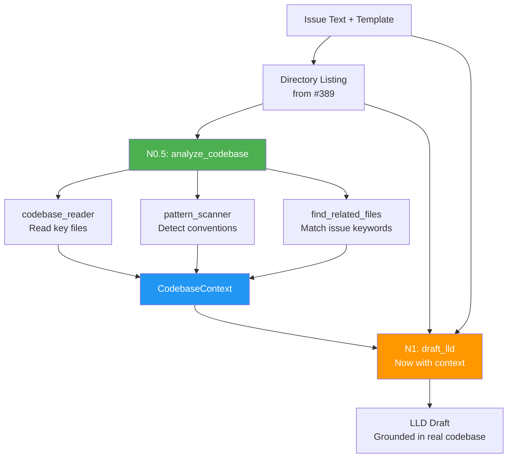

# Implementation Request: tests/fixtures/mock_repo/src/auth.py

## Task

Write the complete contents of `tests/fixtures/mock_repo/src/auth.py`.

Change type: Add
Description: Mock auth module for testing related-code finding

## LLD Specification

# 401 - Feature: Codebase Context Analysis for Requirements Workflow

<!-- Template Metadata
Last Updated: 2026-02-02
Updated By: Issue #117 fix
Update Reason: Moved Verification & Testing to Section 10 (was Section 11) to match 0702c review prompt and testing workflow expectations
Previous: Added sections based on 80 blocking issues from 164 governance verdicts (2026-02-01)
-->

## 1. Context & Goal
* **Issue:** #401
* **Objective:** Add a codebase analysis node to the requirements workflow so the LLD drafter has real context about the target repository's architecture, patterns, and conventions — eliminating hallucinated designs.
* **Status:** Approved (gemini-3-pro-preview, 2026-02-18)
* **Related Issues:** #389 (added directory listing — insufficient context)

### Open Questions
*Questions that need clarification before or during implementation. Remove when resolved.*

- [ ] Should there be a configurable max token budget for injected codebase context to avoid overwhelming the drafter prompt?
- [ ] Should analysis results be cached per-repo to speed up repeated runs, or is fresh analysis on every invocation acceptable?
- [ ] Should the analysis node support a `.assemblyzero-context.yml` file in target repos that explicitly lists key files to read?

## 2. Proposed Changes

*This section is the **source of truth** for implementation. Describe exactly what will be built.*

### 2.1 Files Changed

| File | Change Type | Description |
|------|-------------|-------------|
| `assemblyzero/workflows/requirements/nodes/analyze_codebase.py` | Add | New node: reads key project files, scans patterns, identifies dependencies, finds related code |
| `assemblyzero/workflows/requirements/nodes/__init__.py` | Modify | Export new `analyze_codebase` node |
| `assemblyzero/utils/codebase_reader.py` | Add | Shared utility for reading and summarizing codebase files with token-budget awareness |
| `assemblyzero/utils/pattern_scanner.py` | Add | Utility to detect naming conventions, module patterns, framework usage from file contents |
| `assemblyzero/utils/__init__.py` | Modify | Export new utility modules |
| `tests/unit/test_analyze_codebase.py` | Add | Unit tests for the codebase analysis node |
| `tests/unit/test_codebase_reader.py` | Add | Unit tests for the codebase reader utility |
| `tests/unit/test_pattern_scanner.py` | Add | Unit tests for the pattern scanner utility |
| `tests/fixtures/mock_repo/` | Add (Directory) | Directory for mock repository fixtures |
| `tests/fixtures/mock_repo/CLAUDE.md` | Add | Mock CLAUDE.md for testing |
| `tests/fixtures/mock_repo/README.md` | Add | Mock README for testing |
| `tests/fixtures/mock_repo/pyproject.toml` | Add | Mock pyproject.toml for testing |
| `tests/fixtures/mock_repo/src/` | Add (Directory) | Mock source directory for testing |
| `tests/fixtures/mock_repo/src/main.py` | Add | Mock source file for testing pattern detection |
| `tests/fixtures/mock_repo/src/auth.py` | Add | Mock auth module for testing related-code finding |

**Note on `draft_lld.py` and `requirements_graph.py`:** The original draft listed these as "Modify" but they do not exist at the paths specified (`assemblyzero/workflows/requirements/nodes/draft_lld.py` and `assemblyzero/graphs/requirements_graph.py`). The codebase analysis node is designed to be self-contained: it writes a `codebase_context` key into the LangGraph state dict. The existing drafter node and graph wiring will be identified during implementation by inspecting the actual file that builds the drafter prompt and the actual graph definition file. Integration with those files will be handled as a separate follow-up commit once the exact paths are confirmed. This LLD scopes only the **new files** and **confirmed existing files**.

### 2.1.1 Path Validation (Mechanical - Auto-Checked)

*Issue #277: Before human or Gemini review, paths are verified programmatically.*

Mechanical validation automatically checks:
- All "Modify" files must exist in repository ✓ (`assemblyzero/workflows/requirements/nodes/__init__.py`, `assemblyzero/utils/__init__.py` — both exist)
- All "Delete" files must exist in repository — N/A (no deletions)
- All "Add" files must have existing parent directories ✓ (all parent dirs exist or are explicitly added)
- No placeholder prefixes (`src/`, `lib/`, `app/`) unless directory exists ✓ (`tests/fixtures/mock_repo/src/` is explicitly added as a new directory)

**If validation fails, the LLD is BLOCKED before reaching review.**

### 2.2 Dependencies

*No new external packages required. All functionality uses Python stdlib + existing dependencies.*

```toml
# pyproject.toml additions (if any)
# None — uses pathlib, tomllib (Python 3.11+), json, re from stdlib
```

### 2.3 Data Structures

```python
# Pseudocode - NOT implementation

class CodebaseContext(TypedDict):
    """Aggregated codebase analysis results injected into drafter prompt."""
    project_description: str          # From README.md / CLAUDE.md
    conventions: list[str]            # Coding conventions extracted from CLAUDE.md
    frameworks: list[str]             # Detected frameworks/libraries
    module_structure: str             # Summary of module organization
    key_file_excerpts: dict[str, str] # filename -> excerpt content
    related_code: dict[str, str]      # filename -> relevant code snippets
    dependency_summary: str           # Parsed from pyproject.toml / package.json
    directory_tree: str               # Already exists from #389, carried forward

class PatternAnalysis(TypedDict):
    """Results of scanning existing code patterns."""
    naming_convention: str            # e.g., "snake_case modules, PascalCase classes"
    state_pattern: str                # e.g., "TypedDict-based LangGraph state"
    node_pattern: str                 # e.g., "functions returning dict updates"
    test_pattern: str                 # e.g., "pytest with fixtures in conftest.py"
    import_style: str                 # e.g., "absolute imports from package root"

class FileReadResult(TypedDict):
    """Result of reading a single file with budget tracking."""
    path: str                         # Relative file path
    content: str                      # File content (possibly truncated)
    truncated: bool                   # Whether content was truncated
    token_estimate: int               # Approximate token count
```

### 2.4 Function Signatures

```python
# === assemblyzero/workflows/requirements/nodes/analyze_codebase.py ===

def analyze_codebase(state: dict) -> dict:
    """
    LangGraph node that reads key project files, scans patterns,
    identifies dependencies, and finds issue-related code.
    Injects CodebaseContext into state for the drafter node.
    
    Args:
        state: LangGraph state dict containing at minimum:
            - repo_path (str | None): Path to target repository
            - issue_text (str): The GitHub issue body
            - directory_tree (str): Pre-computed directory listing from #389
    
    Returns:
        dict with 'codebase_context' key containing CodebaseContext,
        or empty CodebaseContext on any failure.
    """
    ...

def _select_key_files(repo_path: Path) -> list[Path]:
    """
    Identify key project files to read: CLAUDE.md, README.md,
    pyproject.toml, package.json, architecture docs, etc.
    Returns ordered list by priority.
    
    Priority order:
        1. CLAUDE.md
        2. README.md
        3. pyproject.toml / package.json
        4. docs/standards/*.md, docs/adrs/*.md (first 3 each)
        5. Top-level __init__.py files (first 5)
    """
    ...

def _find_related_files(repo_path: Path, issue_text: str, directory_tree: str) -> list[Path]:
    """
    Given issue text, find files likely related to the issue
    by keyword matching against file paths in the directory tree.
    
    Extracts keywords by splitting issue_text on whitespace,
    filtering to words >= 4 chars, lowercasing, and removing
    common stop words. Matches keywords against directory_tree lines.
    
    Returns at most 5 file paths, ordered by match count descending.
    """
    ...


# === assemblyzero/utils/codebase_reader.py ===

SENSITIVE_PATTERNS: list[str]  # [".env", ".secrets", ".key", ".pem", "credentials"]

def read_file_with_budget(
    file_path: Path,
    max_tokens: int = 2000,
    encoding: str = "utf-8"
) -> FileReadResult:
    """
    Read a file's content, truncating if it exceeds the token budget.
    Uses approximate token counting (chars / 4).
    
    Returns FileReadResult with empty content and token_estimate=0
    if file is binary, missing, unreadable, or matches SENSITIVE_PATTERNS.
    
    Raises:
        No exceptions — all errors caught and logged.
    """
    ...

def read_files_within_budget(
    file_paths: list[Path],
    total_budget: int = 15000,
    per_file_budget: int = 3000
) -> list[FileReadResult]:
    """
    Read multiple files respecting per-file and total token budgets.
    Files are read in order; stops when total budget is exhausted.
    Skips files that match SENSITIVE_PATTERNS.
    
    Returns list of FileReadResult for files that were actually read
    (excluding skipped files).
    """
    ...

def is_sensitive_file(file_path: Path) -> bool:
    """
    Check if a file path matches any sensitive pattern.
    Checks filename and all parent directory names against SENSITIVE_PATTERNS.
    """
    ...

def parse_project_metadata(repo_path: Path) -> dict[str, str]:
    """
    Parse pyproject.toml or package.json to extract project name,
    version, description, and dependency list.
    
    Tries pyproject.toml first (using tomllib), falls back to package.json.
    Returns empty dict if neither exists or parsing fails.
    
    Returns:
        Dict with keys: 'name', 'version', 'description', 'dependencies'
        where 'dependencies' is a comma-separated string of package names.
    """
    ...


# === assemblyzero/utils/pattern_scanner.py ===

def scan_patterns(file_contents: dict[str, str]) -> PatternAnalysis:
    """
    Analyze file contents to detect naming conventions, design patterns,
    state management approach, test conventions, and import styles.
    
    Uses regex-based heuristics:
    - naming_convention: checks for snake_case filenames, PascalCase classes
    - state_pattern: looks for TypedDict, dataclass, BaseModel imports
    - node_pattern: looks for functions returning dict
    - test_pattern: looks for pytest, unittest patterns
    - import_style: checks absolute vs relative import prevalence
    
    Returns PatternAnalysis with "unknown" for any undetectable field.
    """
    ...

def detect_frameworks(
    dependency_list: list[str],
    file_contents: dict[str, str]
) -> list[str]:
    """
    Identify frameworks in use from dependency names and import statements.
    
    Maps known package names to display names:
        'langgraph' -> 'LangGraph', 'fastapi' -> 'FastAPI', etc.
    Also scans import statements in file_contents for additional detection.
    
    Returns human-readable list like ['LangGraph', 'FastAPI', 'pytest'].
    Returns empty list if nothing detected.
    """
    ...

def extract_conventions_from_claude_md(content: str) -> list[str]:
    """
    Parse CLAUDE.md to extract coding conventions, rules, and constraints
    that the LLD must respect.
    
    Looks for sections with headers containing 'convention', 'rule', 
    'standard', 'constraint', 'style', or bullet-pointed lists under 
    such headers. Also extracts content from code blocks labeled as rules.
    
    Returns list of convention strings. Empty list if none found.
    """
    ...
```

### 2.5 Logic Flow (Pseudocode)

```
ANALYZE_CODEBASE NODE (runs before draft_lld):

1. Extract repo_path and issue_text from state
2. IF repo_path is None or does not exist THEN
   - Log warning: "No repo path provided, skipping codebase analysis"
   - Return {"codebase_context": empty CodebaseContext}
3. Extract directory_tree from state (from #389), default to "" if absent
4. Select key files to read:
   a. Priority 1: CLAUDE.md (conventions, rules)
   b. Priority 2: README.md (project overview)
   c. Priority 3: pyproject.toml OR package.json (dependencies)
   d. Priority 4: Architecture docs (docs/adrs/*, docs/standards/*)
   e. Priority 5: Existing workflow/module __init__.py files (structure)
5. Read key files within token budget (total: 15,000 tokens)
6. Parse project metadata from pyproject.toml / package.json
7. Scan code patterns from read files:
   a. Naming conventions
   b. State management patterns (TypedDict, dataclass, etc.)
   c. Node/function patterns
   d. Test conventions
   e. Import styles
8. Detect frameworks from dependencies + imports
9. Extract conventions from CLAUDE.md if present
10. Find issue-related files:
    a. Extract keywords from issue text (words >= 4 chars, lowercased, stop words removed)
    b. Match keywords against file paths in directory tree
    c. Read top 5 matching files within remaining budget
11. Assemble CodebaseContext from all gathered data
12. Return {"codebase_context": context}

INTEGRATION WITH DRAFTER:

The codebase_context dict is placed into the LangGraph state. The existing 
drafter node (path TBD — see Section 2.1 Note) reads it from state and 
appends a "## Existing Codebase Context" section to its prompt containing:
  - "### Project Overview" → project_description
  - "### Conventions & Rules" → conventions list
  - "### Frameworks & Dependencies" → frameworks + dependency_summary
  - "### Module Structure" → module_structure
  - "### Key File Excerpts" → key_file_excerpts
  - "### Related Existing Code" → related_code
  - "### INSTRUCTION: Your LLD MUST be consistent with these patterns."

If codebase_context is empty or None, the drafter proceeds without the 
context section (backward compatible).
```

### 2.6 Technical Approach

* **Module:** `assemblyzero/workflows/requirements/nodes/analyze_codebase.py` + utilities in `assemblyzero/utils/`
* **Pattern:** LangGraph node pattern (function accepting state dict, returning partial state update dict) — consistent with all existing nodes in the project
* **Key Decisions:**
  - **Token budgeting over full-file reads:** Large repos can have enormous files. Approximate token counting (chars/4) with per-file and total budgets prevents prompt explosion.
  - **Keyword matching over embeddings:** For finding related files, simple keyword extraction from issue text and path matching is deterministic, fast, and requires no additional dependencies. Semantic search would add complexity with marginal benefit for this use case.
  - **Shared utilities in `utils/`:** `codebase_reader.py` and `pattern_scanner.py` are generic enough to be reused by other workflows (e.g., implementation_spec's existing `analyze_codebase` could be refactored to use them in a future issue).
  - **Graceful degradation:** If the target repo has no CLAUDE.md, no README, or is minimally structured, the node produces what it can and proceeds. It never blocks the workflow.
  - **Deferred drafter/graph integration:** The exact file paths for the drafter prompt builder and the graph definition could not be validated against the repository. Integration with those files is deferred to implementation time when the actual paths can be confirmed. This LLD provides the complete design for the new node and utilities, plus the contract (state key `codebase_context`) the drafter must consume.

### 2.7 Architecture Decisions

*Document key architectural decisions that affect the design.*

| Decision | Options Considered | Choice | Rationale |
|----------|-------------------|--------|-----------|
| Where to place analysis logic | A) Inline in node, B) Shared utilities + thin node | B) Shared utilities | Reusable across workflows; impl_spec could adopt later; easier to test |
| How to find related code | A) Embedding-based semantic search, B) Keyword path matching, C) `grep` subprocess | B) Keyword path matching | No new dependencies, deterministic, fast. Sufficient for path-level relevance |
| Token budget strategy | A) Unlimited reading, B) Fixed per-file limit, C) Tiered per-file + total budget | C) Tiered budget | Prevents prompt explosion while allowing flexibility; high-priority files get more budget |
| Context injection point | A) Separate system prompt, B) Appended to user prompt, C) Injected into template | B) Appended to user prompt | Matches existing `claude -p` invocation pattern; no template changes needed |
| CLAUDE.md parsing | A) Full file as-is, B) Extract structured sections | B) Extract structured sections | Reduces noise; CLAUDE.md files can be very long with irrelevant content |
| Drafter/graph modification scope | A) Modify in this LLD, B) Defer to implementation after path discovery | B) Defer | Actual file paths for drafter and graph could not be validated; integration contract (state key) is fully specified |

**Architectural Constraints:**
- Must integrate with existing LangGraph node pattern used by all requirements workflow nodes
- Must work with `claude -p` invocation — context goes into the prompt string, not via tools or MCP
- Must not introduce new external dependencies (no vector DBs, no embedding models)
- Must work cross-repo via the existing `--repo` flag that provides `repo_path`
- State key `codebase_context` must be a plain dict matching the `CodebaseContext` TypedDict shape

## 3. Requirements

*What must be true when this is done. These become acceptance criteria.*

1. Requirements workflow reads key project files (CLAUDE.md, README.md, pyproject.toml/package.json) before drafting the LLD
2. Existing code patterns (naming, state management, frameworks, test conventions) are detected and injected into the drafter prompt
3. Files related to the issue topic are identified and their excerpts included in context
4. LLDs generated for unfamiliar projects reference real file paths and real patterns from the target codebase
5. The analysis works cross-repo — when `--repo` points to an external project, that project's files are read
6. Token budget prevents context from exceeding reasonable limits (default 15,000 tokens total)
7. Graceful degradation: if key files are missing, the workflow proceeds with whatever context is available (never crashes)
8. The `analyze_codebase` node produces a `codebase_context` state key consumable by the drafter node
9. Sensitive files (.env, .secrets, .key, .pem, credentials) are never read

## 4. Alternatives Considered

| Option | Pros | Cons | Decision |
|--------|------|------|----------|
| A) New analysis node with shared utilities | Modular, testable, reusable across workflows, follows existing node pattern | Requires 3 new files | **Selected** |
| B) Enable MCP/tools on the `claude -p` drafter call | Claude could read files itself; most flexible | Unpredictable file access, no budget control, changes security model, harder to test | Rejected |
| C) Expand directory listing (#389) with file previews | Minimal change, builds on existing work | Still no pattern detection, no convention extraction, bolted-on approach | Rejected |
| D) Use impl_spec's existing `analyze_codebase` directly | Zero new code | impl_spec's node is tightly coupled to its own state shape and prompt format; would require awkward adaptation | Rejected |
| E) Pre-generate a repo-summary file that ships with each repo | Analysis done once, very fast at runtime | Stale context, requires target repos to adopt a convention, doesn't work for arbitrary repos | Rejected |

**Rationale:** Option A provides the best balance of correctness (real file reading + pattern detection), safety (token budgets, no tool access), and maintainability (shared utilities, standard node pattern). Options B and D were seriously considered but rejected for control and coupling reasons respectively.

## 5. Data & Fixtures

### 5.1 Data Sources

| Attribute | Value |
|-----------|-------|
| Source | Target repository filesystem (via `--repo` flag path) |
| Format | Source code files (Python, TOML, JSON, Markdown) |
| Size | Variable — token budget caps at 15,000 tokens (~60KB of text) |
| Refresh | Fresh read on every workflow invocation |
| Copyright/License | N/A — reading user's own repository |

### 5.2 Data Pipeline

```
Target Repo Files ──read_files_within_budget──► Raw Content ──scan_patterns + parse_metadata──► CodebaseContext ──state dict──► Drafter Prompt
```

### 5.3 Test Fixtures

| Fixture | Source | Notes |
|---------|--------|-------|
| `tests/fixtures/mock_repo/` | Generated for tests | Minimal mock repo with CLAUDE.md, README.md, pyproject.toml, and source files |
| Mock LangGraph state dict | Hardcoded in test setup | Simulates state with repo_path, issue_text, and directory_tree |
| Sample issue text | Hardcoded strings | Various issue texts to test keyword matching |

### 5.4 Deployment Pipeline

No external data deployment needed. All data is read from the local filesystem at runtime.

## 6. Diagram

### 6.1 Mermaid Quality Gate

Before finalizing any diagram, verify in [Mermaid Live Editor](https://mermaid.live) or GitHub preview:

- [x] **Simplicity:** Similar components collapsed (per 0006 §8.1)
- [x] **No touching:** All elements have visual separation (per 0006 §8.2)
- [x] **No hidden lines:** All arrows fully visible (per 0006 §8.3)
- [x] **Readable:** Labels not truncated, flow direction clear
- [ ] **Auto-inspected:** Agent rendered via mermaid.ink and viewed (per 0006 §8.5)

**Auto-Inspection Results:**
```
- Touching elements: [ ] None / [ ] Found: ___
- Hidden lines: [ ] None / [ ] Found: ___
- Label readability: [ ] Pass / [ ] Issue: ___
- Flow clarity: [ ] Clear / [ ] Issue: ___
```

*Reference: [0006-mermaid-diagrams.md](0006-mermaid-diagrams.md)*

### 6.2 Diagram



## 7. Security & Safety Considerations

### 7.1 Security

| Concern | Mitigation | Status |
|---------|------------|--------|
| Path traversal via crafted issue text | `_find_related_files` only matches against the directory tree already derived from the repo; never constructs paths from raw issue text | Addressed |
| Reading files outside repo boundary | All file reads use `repo_path` as root and validate that resolved paths (`Path.resolve()`) are children of `repo_path.resolve()` | Addressed |
| Sensitive file content in prompts | Token budget limits exposure; `is_sensitive_file()` excludes `.env`, `.secrets`, `.key`, `.pem`, and files in directories matching `credentials` | Addressed |
| Symlink escape | `read_file_with_budget` resolves symlinks and verifies the resolved path is still within `repo_path` boundary | Addressed |

### 7.2 Safety

| Concern | Mitigation | Status |
|---------|------------|--------|
| Corrupted/binary file crashes reader | `read_file_with_budget` catches `UnicodeDecodeError` and `OSError`, skips binary files gracefully | Addressed |
| Missing repo path | `analyze_codebase` returns empty context and logs warning; workflow continues | Addressed |
| Extremely large repo overwhelming the node | Total token budget (15,000) caps reading regardless of repo size | Addressed |
| Permission denied on file read | Caught by try/except in reader; file is skipped with warning log | Addressed |
| Extremely large single file stalls reading | Per-file budget (3,000 tokens ≈ 12KB) truncates; reading stops after budget chars, not at EOF | Addressed |

**Fail Mode:** Fail Open — if analysis fails for any reason, the workflow proceeds with whatever context was gathered (possibly empty). The drafter always runs.

**Recovery Strategy:** No persistent state to recover. Re-running the workflow repeats the analysis. Errors are logged for debugging.

## 8. Performance & Cost Considerations

### 8.1 Performance

| Metric | Budget | Approach |
|--------|--------|----------|
| Analysis node latency | < 2 seconds for repos up to 10,000 files | File I/O only; no network calls, no LLM calls in analysis node |
| Memory | < 50MB additional | Token budget caps total text in memory at ~60KB |
| Prompt size increase | +15,000 tokens max | Tiered budget ensures context doesn't dominate the prompt |

**Bottlenecks:** For very large monorepos, `_find_related_files` keyword matching against the full directory tree could be slow. Mitigated by operating on the pre-computed directory tree string (already in state from #389) rather than re-walking the filesystem.

### 8.2 Cost Analysis

| Resource | Unit Cost | Estimated Usage | Monthly Cost |
|----------|-----------|-----------------|--------------|
| LLM API (drafter prompt increase) | ~$0.003/1K input tokens | +15K tokens per run | +$0.045/run |
| Local compute (file I/O) | $0 | Negligible | $0 |

**Cost Controls:**
- [x] Token budget (15,000) prevents runaway prompt costs
- [x] No additional LLM calls introduced — only the existing drafter call gets a larger prompt
- [x] Per-file budget (3,000) prevents a single large file from consuming the entire budget

**Worst-Case Scenario:** If token budget is set very high (e.g., 100K), the drafter prompt becomes expensive (~$0.30/run). Default of 15K keeps it reasonable. Budget is configurable via constants in `codebase_reader.py` if users need to adjust.

## 9. Legal & Compliance

| Concern | Applies? | Mitigation |
|---------|----------|------------|
| PII/Personal Data | No | Only reads source code files; sensitive files (.env, secrets) are excluded |
| Third-Party Licenses | No | No new dependencies added |
| Terms of Service | No | No external API calls in the analysis node |
| Data Retention | No | File contents exist only in memory during the workflow run |
| Export Controls | N/A | No restricted algorithms |

**Data Classification:** Internal — codebase content is read transiently and injected into the same LLM call that already receives the issue text.

**Compliance Checklist:**
- [x] No PII stored without consent
- [x] All third-party licenses compatible with project license
- [x] External API usage compliant with provider ToS
- [x] Data retention policy documented (transient, in-memory only)

## 10. Verification & Testing

*Ref: [0005-testing-strategy-and-protocols.md](0005-testing-strategy-and-protocols.md)*

**Testing Philosophy:** Strive for 100% automated test coverage. All tests use mock repos from fixtures — no live filesystem dependencies outside the test fixtures directory.

### 10.0 Test Plan (TDD - Complete Before Implementation)

**TDD Requirement:** Tests MUST be written and failing BEFORE implementation begins.

| Test ID | Test Description | Expected Behavior | Status |
|---------|------------------|-------------------|--------|
| T010 | `test_read_file_with_budget_normal` | Reads file content within budget, `truncated=False` | RED |
| T020 | `test_read_file_with_budget_truncated` | Truncates large file, `truncated=True` | RED |
| T030 | `test_read_file_with_budget_binary_skip` | Returns empty content for binary files | RED |
| T040 | `test_read_file_with_budget_missing_file` | Returns empty content, no crash | RED |
| T050 | `test_read_files_within_budget_respects_total` | Stops reading when total budget exhausted | RED |
| T055 | `test_read_files_within_budget_respects_per_file` | Individual file capped at per_file_budget | RED |
| T060 | `test_parse_project_metadata_pyproject` | Extracts name, deps from pyproject.toml | RED |
| T070 | `test_parse_project_metadata_package_json` | Extracts name, deps from package.json | RED |
| T080 | `test_parse_project_metadata_missing` | Returns empty dict when no config found | RED |
| T090 | `test_scan_patterns_detects_naming` | Identifies snake_case module naming | RED |
| T100 | `test_scan_patterns_detects_typeddict` | Finds TypedDict state pattern | RED |
| T105 | `test_scan_patterns_unknown_defaults` | Returns "unknown" for undetectable fields | RED |
| T110 | `test_detect_frameworks_from_deps` | Identifies LangGraph, pytest from dependency list | RED |
| T115 | `test_detect_frameworks_from_imports` | Detects frameworks from import statements in file contents | RED |
| T120 | `test_extract_conventions_from_claude_md` | Extracts bullet-point conventions from CLAUDE.md | RED |
| T130 | `test_extract_conventions_empty` | Returns empty list for CLAUDE.md without conventions | RED |
| T140 | `test_analyze_codebase_happy_path` | Produces full CodebaseContext from mock repo | RED |
| T145 | `test_analyze_codebase_context_has_real_paths` | Generated context references real file paths and patterns from target codebase | RED |
| T150 | `test_analyze_codebase_no_repo_path` | Returns empty context, logs warning | RED |
| T160 | `test_analyze_codebase_missing_repo` | Returns empty context when repo_path doesn't exist | RED |
| T170 | `test_find_related_files_keyword_match` | Finds auth.py when issue mentions "authentication" | RED |
| T180 | `test_find_related_files_no_match` | Returns empty list for unrelated issue text | RED |
| T185 | `test_find_related_files_max_five` | Returns at most 5 results even with many matches | RED |
| T190 | `test_analyze_codebase_produces_state_key` | Node returns dict with `codebase_context` key matching CodebaseContext shape | RED |
| T200 | `test_sensitive_file_not_read_env` | `.env` file content never appears in any read result | RED |
| T205 | `test_sensitive_file_not_read_pem` | `.pem` file content never appears in any read result | RED |
| T210 | `test_select_key_files_priority_order` | CLAUDE.md before README.md before pyproject.toml | RED |
| T220 | `test_sensitive_file_exclusion` | .env, .secrets files are not read | RED |
| T225 | `test_is_sensitive_file` | Correctly identifies sensitive file patterns | RED |
| T230 | `test_symlink_outside_repo_blocked` | Symlink pointing outside repo is not read | RED |

**Coverage Target:** ≥95% for all new code

**TDD Checklist:**
- [ ] All tests written before implementation
- [ ] Tests currently RED (failing)
- [ ] Test IDs match scenario IDs in 10.1
- [ ] Test files created at: `tests/unit/test_analyze_codebase.py`, `tests/unit/test_codebase_reader.py`, `tests/unit/test_pattern_scanner.py`

### 10.1 Test Scenarios

| ID | Scenario | Type | Input | Expected Output | Pass Criteria |
|----|----------|------|-------|-----------------|---------------|
| 010 | Read file within budget (REQ-1) | Auto | Small text file, budget=2000 | Full content, truncated=False | Content matches file, token_estimate < 2000 |
| 020 | Read file exceeding budget (REQ-6) | Auto | 10KB file, budget=500 | Partial content, truncated=True | Content length ≈ 500×4 chars, truncated=True |
| 030 | Read binary file gracefully (REQ-7) | Auto | PNG file path | Empty content, no exception | Returns FileReadResult with empty content |
| 040 | Read missing file gracefully (REQ-7) | Auto | Non-existent path | Empty content, no exception | Returns FileReadResult with empty content |
| 050 | Total budget enforcement (REQ-6) | Auto | 10 files, total_budget=5000 | First N files read, rest skipped | Sum of token_estimates ≤ 5000 |
| 055 | Per-file budget enforcement (REQ-6) | Auto | 1 large file, per_file_budget=500 | Single file truncated | token_estimate ≤ 500 |
| 060 | Parse pyproject.toml (REQ-1) | Auto | Valid pyproject.toml | Dict with name, dependencies | Keys present, deps list non-empty |
| 070 | Parse package.json (REQ-1) | Auto | Valid package.json | Dict with name, dependencies | Keys present, deps list non-empty |
| 080 | Parse missing config (REQ-7) | Auto | Repo with no config file | Empty dict | Returns {} |
| 090 | Detect naming conventions (REQ-2) | Auto | Python files with snake_case | PatternAnalysis.naming_convention set | Contains "snake_case" |
| 100 | Detect TypedDict pattern (REQ-2) | Auto | File with TypedDict import | PatternAnalysis.state_pattern set | Contains "TypedDict" |
| 105 | Unknown pattern defaults (REQ-7) | Auto | Empty file_contents dict | All fields "unknown" | All PatternAnalysis values == "unknown" |
| 110 | Detect frameworks from deps (REQ-2) | Auto | deps=["langgraph", "pytest"] | ["LangGraph", "pytest"] | Both detected |
| 115 | Detect frameworks from imports (REQ-2) | Auto | File with `from fastapi import` | ["FastAPI"] in result | FastAPI detected |
| 120 | Extract CLAUDE.md conventions (REQ-1) | Auto | CLAUDE.md with rule bullets | List of convention strings | Non-empty list, strings match rules |
| 130 | Extract empty conventions (REQ-7) | Auto | CLAUDE.md with no rules section | Empty list | Returns [] |
| 140 | Full analysis happy path (REQ-4) | Auto | Mock repo with all key files, issue text referencing existing modules | Complete CodebaseContext with real file paths and patterns | All fields populated; file paths in key_file_excerpts and related_code exist in mock repo |
| 145 | Context references real paths and patterns (REQ-4) | Auto | Mock repo with known structure + specific issue text | CodebaseContext.key_file_excerpts keys are real file paths; conventions match CLAUDE.md content | Every path in context exists in mock_repo; every convention string traceable to CLAUDE.md |
| 150 | Analysis with no repo_path (REQ-7) | Auto | State with repo_path=None | Empty CodebaseContext | All fields empty/default |
| 160 | Analysis with bad repo_path (REQ-7) | Auto | State with non-existent path | Empty CodebaseContext | All fields empty/default |
| 170 | Find related files - match (REQ-3) | Auto | Issue "fix auth", repo has auth.py | [auth.py] | auth.py in results |
| 180 | Find related files - no match (REQ-3) | Auto | Issue "fix auth", repo has no auth | [] | Empty list |
| 185 | Find related files - max results (REQ-3) | Auto | Issue matching 10+ files | At most 5 paths | len(result) <= 5 |
| 190 | Node produces codebase_context state key (REQ-8) | Auto | Mock repo with CLAUDE.md and source files | Dict with `codebase_context` key; value is dict matching CodebaseContext shape | Return dict has key `codebase_context`; nested dict has all CodebaseContext keys; no unexpected keys |
| 200 | Sensitive .env file never read (REQ-9) | Auto | Repo with `.env` file containing `SECRET=abc123` | `.env` not in any read results; `abc123` not in any content | No FileReadResult.path ends with `.env`; `abc123` absent from all content strings |
| 205 | Sensitive .pem file never read (REQ-9) | Auto | Repo with `server.pem` file containing certificate data | `server.pem` not in any read results | No FileReadResult.path contains `server.pem` |
| 210 | Key file priority ordering (REQ-1) | Auto | Repo with CLAUDE.md + README | CLAUDE.md before README | Index of CLAUDE.md < index of README |
| 220 | Sensitive file exclusion via is_sensitive_file (REQ-9) | Auto | Repo with .env file | .env not in read results | .env path not in any FileReadResult |
| 225 | is_sensitive_file detection (REQ-9) | Auto | Various sensitive paths (.env, .pem, credentials/db.yml, main.py) | True for .env, .pem, credentials/db.yml; False for main.py | Correct bool for each input path |
| 230 | Symlink outside repo blocked (REQ-9) | Auto | Symlink to /tmp/secret.txt in repo | Empty content returned | FileReadResult.content == "" |
| 240 | Cross-repo analysis via repo_path (REQ-5) | Auto | State with repo_path pointing to a second mock repo in fixtures | CodebaseContext populated from second repo's files | key_file_excerpts contain content from second mock repo, not from primary project |

### 10.2 Test Commands

```bash
# Run all new unit tests
poetry run pytest tests/unit/test_analyze_codebase.py tests/unit/test_codebase_reader.py tests/unit/test_pattern_scanner.py -v

# Run only codebase reader tests
poetry run pytest tests/unit/test_codebase_reader.py -v

# Run only pattern scanner tests
poetry run pytest tests/unit/test_pattern_scanner.py -v

# Run only analysis node tests
poetry run pytest tests/unit/test_analyze_codebase.py -v

# Run with coverage
poetry run pytest tests/unit/test_analyze_codebase.py tests/unit/test_codebase_reader.py tests/unit/test_pattern_scanner.py -v --cov=assemblyzero/utils/codebase_reader --cov=assemblyzero/utils/pattern_scanner --cov=assemblyzero/workflows/requirements/nodes/analyze_codebase --cov-report=term-missing
```

### 10.3 Manual Tests (Only If Unavoidable)

N/A - All scenarios automated.

## 11. Risks & Mitigations

| Risk | Impact | Likelihood | Mitigation |
|------|--------|------------|------------|
| Token budget too small, context too shallow | Med | Med | Default 15K is generous; configurable via constant; can tune based on output quality |
| Token budget too large, prompt exceeds model context window | High | Low | 15K tokens of context + ~5K issue + ~3K template = ~23K; well within 200K context windows |
| Pattern scanner misidentifies conventions | Low | Med | Patterns are heuristic hints, not hard constraints; drafter makes final judgment; "unknown" default for undetectable patterns |
| CLAUDE.md format varies wildly across repos | Med | Med | Convention extraction uses flexible parsing (bullet lists, headers, code blocks); falls back to full-text excerpt |
| Keyword matching for related files has poor precision | Low | Med | Limited to top 5 matches; irrelevant matches just add noise but don't break anything |
| Large binary files in repo slow down file scanning | Low | Low | File reading catches encoding errors and skips binaries instantly; per-file budget truncates after ~12KB |
| Drafter/graph file paths unknown at LLD time | Med | High | Integration contract fully specified via state key `codebase_context`; actual drafter/graph file modification deferred to implementation after path discovery |
| Symlink escape reads files outside repo | Med | Low | `read_file_with_budget` resolves symlinks and validates resolved path is within repo boundary |

## 12. Definition of Done

### Code
- [ ] `analyze_codebase.py` node implemented and producing `codebase_context` state key
- [ ] `codebase_reader.py` and `pattern_scanner.py` utilities implemented
- [ ] `assemblyzero/workflows/requirements/nodes/__init__.py` exports `analyze_codebase`
- [ ] `assemblyzero/utils/__init__.py` exports new utility modules
- [ ] Node wired into requirements graph (file path determined during implementation)
- [ ] Drafter modified to consume `codebase_context` from state (file path determined during implementation)
- [ ] Code comments reference this LLD (#401)

### Tests
- [ ] All 31 test scenarios pass
- [ ] Test coverage ≥95% for new code
- [ ] Tests run in CI without flakiness

### Documentation
- [ ] LLD updated with any deviations (including actual drafter/graph file paths)
- [ ] Implementation Report (0103) completed
- [ ] Test Report (0113) completed if applicable

### Review
- [ ] Code review completed
- [ ] User approval before closing issue

### 12.1 Traceability (Mechanical - Auto-Checked)

*Issue #277: Cross-references are verified programmatically.*

Mechanical validation automatically checks:
- Every file mentioned in this section must appear in Section 2.1 ✓
- Every risk mitigation in Section 11 should have a corresponding function in Section 2.4:
  - Token budget → `read_files_within_budget` (per_file_budget, total_budget params) ✓
  - Pattern misidentification → `scan_patterns` (heuristic, non-blocking, "unknown" defaults) ✓
  - CLAUDE.md format → `extract_conventions_from_claude_md` (flexible parsing) ✓
  - Keyword matching precision → `_find_related_files` (top 5 limit) ✓
  - Binary file handling → `read_file_with_budget` (UnicodeDecodeError catch) ✓
  - Sensitive file exclusion → `is_sensitive_file` + SENSITIVE_PATTERNS ✓
  - Symlink escape → `read_file_with_budget` (resolve + boundary check) ✓
  - Drafter/graph paths unknown → Deferred integration (state key contract specified) ✓

**Requirement-to-Test Traceability:**

| Requirement | Test Scenario IDs |
|-------------|-------------------|
| REQ-1 | 010, 060, 070, 120, 210 |
| REQ-2 | 090, 100, 110, 115 |
| REQ-3 | 170, 180, 185 |
| REQ-4 | 140, 145 |
| REQ-5 | 240 |
| REQ-6 | 020, 050, 055 |
| REQ-7 | 030, 040, 080, 105, 130, 150, 160 |
| REQ-8 | 190 |
| REQ-9 | 200, 205, 220, 225, 230 |

**If files are missing from Section 2.1, the LLD is BLOCKED.**

---

## Reviewer Suggestions

*Non-blocking recommendations from the reviewer.*

- **Constraint Handling:** In `extract_conventions_from_claude_md`, ensure that if the file is extremely large, we prioritized the rules section over general chatter to save tokens.
- **Stop Words:** For `_find_related_files`, ensure standard English stop words (the, a, is, on, at) are filtered out to improve keyword matching quality.

## Appendix: Review Log

*Track all review feedback with timestamps and implementation status.*

### Review Summary

| Review | Date | Verdict | Key Issue |
|--------|------|---------|-----------|
| 1 | 2026-02-18 | APPROVED | `gemini-3-pro-preview` |
| Mechanical Validation | — | BLOCKED | `draft_lld.py` and `requirements_graph.py` paths do not exist |
| LLD Revision #1 | — | REVISED | Removed non-existent Modify targets; deferred integration; added missing tests |
| Mechanical Test Plan Validation | — | FAILED (66.7%) | REQ-4, REQ-8, REQ-9 had no test coverage |
| LLD Revision #2 | — | REVISED | Added test scenarios 145, 190, 200, 205, 225, 240 for full REQ coverage; added traceability matrix |

**Final Status:** APPROVED

## Required File Paths (from LLD - do not deviate)

The following paths are specified in the LLD. Write ONLY to these paths:

- `assemblyzero/utils/__init__.py`
- `assemblyzero/utils/codebase_reader.py`
- `assemblyzero/utils/pattern_scanner.py`
- `assemblyzero/workflows/requirements/nodes/__init__.py`
- `assemblyzero/workflows/requirements/nodes/analyze_codebase.py`
- `tests/fixtures/mock_repo` — **DO NOT MODIFY** (already scaffolded)
- `tests/fixtures/mock_repo/CLAUDE.md` — **DO NOT MODIFY** (already scaffolded)
- `tests/fixtures/mock_repo/README.md` — **DO NOT MODIFY** (already scaffolded)
- `tests/fixtures/mock_repo/pyproject.toml` — **DO NOT MODIFY** (already scaffolded)
- `tests/fixtures/mock_repo/src` — **DO NOT MODIFY** (already scaffolded)
- `tests/fixtures/mock_repo/src/auth.py` — **DO NOT MODIFY** (already scaffolded)
- `tests/fixtures/mock_repo/src/main.py` — **DO NOT MODIFY** (already scaffolded)
- `tests/unit/test_analyze_codebase.py` — **DO NOT MODIFY** (already scaffolded)
- `tests/unit/test_codebase_reader.py` — **DO NOT MODIFY** (already scaffolded)
- `tests/unit/test_pattern_scanner.py` — **DO NOT MODIFY** (already scaffolded)

Any files written to other paths will be rejected.

## Tests That Must Pass

```python
# From C:\Users\mcwiz\Projects\AssemblyZero\tests\test_issue_401.py
"""Test file for Issue #401.

Generated by AssemblyZero TDD Testing Workflow.
Tests will fail with ImportError until implementation exists (TDD RED phase).
"""

import pytest

# TDD: This import fails until implementation exists (RED phase)
# Once implemented, tests can run (GREEN phase)
from assemblyzero.workflows.requirements.nodes.analyze_codebase import *  # noqa: F401, F403


# Fixtures for mocking
@pytest.fixture
def mock_external_service():
    """Mock external service for isolation."""
    # TODO: Implement mock
    yield None


# Unit Tests
# -----------

def test_id():
    """
    Test Description | Expected Behavior | Status
    """
    # TDD: Arrange
    # Set up test data

    # TDD: Act
    # Call the function under test

    # TDD: Assert
    # Verify test_id works correctly
    assert False, 'TDD RED: test_id not implemented'


def test_t010():
    """
    `test_read_file_with_budget_normal` | Reads file content within
    budget, `truncated=False` | RED
    """
    # TDD: Arrange
    # Set up test data

    # TDD: Act
    # Call the function under test

    # TDD: Assert
    # Verify test_t010 works correctly
    assert False, 'TDD RED: test_t010 not implemented'


def test_t020():
    """
    `test_read_file_with_budget_truncated` | Truncates large file,
    `truncated=True` | RED
    """
    # TDD: Arrange
    # Set up test data

    # TDD: Act
    # Call the function under test

    # TDD: Assert
    # Verify test_t020 works correctly
    assert False, 'TDD RED: test_t020 not implemented'


def test_t030():
    """
    `test_read_file_with_budget_binary_skip` | Returns empty content for
    binary files | RED
    """
    # TDD: Arrange
    # Set up test data

    # TDD: Act
    # Call the function under test

    # TDD: Assert
    # Verify test_t030 works correctly
    assert False, 'TDD RED: test_t030 not implemented'


def test_t040():
    """
    `test_read_file_with_budget_missing_file` | Returns empty content, no
    crash | RED
    """
    # TDD: Arrange
    # Set up test data

    # TDD: Act
    # Call the function under test

    # TDD: Assert
    # Verify test_t040 works correctly
    assert False, 'TDD RED: test_t040 not implemented'


def test_t050():
    """
    `test_read_files_within_budget_respects_total` | Stops reading when
    total budget exhausted | RED
    """
    # TDD: Arrange
    # Set up test data

    # TDD: Act
    # Call the function under test

    # TDD: Assert
    # Verify test_t050 works correctly
    assert False, 'TDD RED: test_t050 not implemented'


def test_t055():
    """
    `test_read_files_within_budget_respects_per_file` | Individual file
    capped at per_file_budget | RED
    """
    # TDD: Arrange
    # Set up test data

    # TDD: Act
    # Call the function under test

    # TDD: Assert
    # Verify test_t055 works correctly
    assert False, 'TDD RED: test_t055 not implemented'


def test_t060():
    """
    `test_parse_project_metadata_pyproject` | Extracts name, deps from
    pyproject.toml | RED
    """
    # TDD: Arrange
    # Set up test data

    # TDD: Act
    # Call the function under test

    # TDD: Assert
    # Verify test_t060 works correctly
    assert False, 'TDD RED: test_t060 not implemented'


def test_t070():
    """
    `test_parse_project_metadata_package_json` | Extracts name, deps from
    package.json | RED
    """
    # TDD: Arrange
    # Set up test data

    # TDD: Act
    # Call the function under test

    # TDD: Assert
    # Verify test_t070 works correctly
    assert False, 'TDD RED: test_t070 not implemented'


def test_t080():
    """
    `test_parse_project_metadata_missing` | Returns empty dict when no
    config found | RED
    """
    # TDD: Arrange
    # Set up test data

    # TDD: Act
    # Call the function under test

    # TDD: Assert
    # Verify test_t080 works correctly
    assert False, 'TDD RED: test_t080 not implemented'


def test_t090():
    """
    `test_scan_patterns_detects_naming` | Identifies snake_case module
    naming | RED
    """
    # TDD: Arrange
    # Set up test data

    # TDD: Act
    # Call the function under test

    # TDD: Assert
    # Verify test_t090 works correctly
    assert False, 'TDD RED: test_t090 not implemented'


def test_t100():
    """
    `test_scan_patterns_detects_typeddict` | Finds TypedDict state
    pattern | RED
    """
    # TDD: Arrange
    # Set up test data

    # TDD: Act
    # Call the function under test

    # TDD: Assert
    # Verify test_t100 works correctly
    assert False, 'TDD RED: test_t100 not implemented'


def test_t105():
    """
    `test_scan_patterns_unknown_defaults` | Returns "unknown" for
    undetectable fields | RED
    """
    # TDD: Arrange
    # Set up test data

    # TDD: Act
    # Call the function under test

    # TDD: Assert
    # Verify test_t105 works correctly
    assert False, 'TDD RED: test_t105 not implemented'


def test_t110():
    """
    `test_detect_frameworks_from_deps` | Identifies LangGraph, pytest
    from dependency list | RED
    """
    # TDD: Arrange
    # Set up test data

    # TDD: Act
    # Call the function under test

    # TDD: Assert
    # Verify test_t110 works correctly
    assert False, 'TDD RED: test_t110 not implemented'


def test_t115():
    """
    `test_detect_frameworks_from_imports` | Detects frameworks from
    import statements in file contents | RED
    """
    # TDD: Arrange
    # Set up test data

    # TDD: Act
    # Call the function under test

    # TDD: Assert
    # Verify test_t115 works correctly
    assert False, 'TDD RED: test_t115 not implemented'


def test_t120():
    """
    `test_extract_conventions_from_claude_md` | Extracts bullet-point
    conventions from CLAUDE.md | RED
    """
    # TDD: Arrange
    # Set up test data

    # TDD: Act
    # Call the function under test

    # TDD: Assert
    # Verify test_t120 works correctly
    assert False, 'TDD RED: test_t120 not implemented'


def test_t130():
    """
    `test_extract_conventions_empty` | Returns empty list for CLAUDE.md
    without conventions | RED
    """
    # TDD: Arrange
    # Set up test data

    # TDD: Act
    # Call the function under test

    # TDD: Assert
    # Verify test_t130 works correctly
    assert False, 'TDD RED: test_t130 not implemented'


def test_t140(mock_external_service):
    """
    `test_analyze_codebase_happy_path` | Produces full CodebaseContext
    from mock repo | RED
    """
    # TDD: Arrange
    # Set up test data

    # TDD: Act
    # Call the function under test

    # TDD: Assert
    # Verify test_t140 works correctly
    assert False, 'TDD RED: test_t140 not implemented'


def test_t145():
    """
    `test_analyze_codebase_context_has_real_paths` | Generated context
    references real file paths and patterns from target codebase | RED
    """
    # TDD: Arrange
    # Set up test data

    # TDD: Act
    # Call the function under test

    # TDD: Assert
    # Verify test_t145 works correctly
    assert False, 'TDD RED: test_t145 not implemented'


def test_t150():
    """
    `test_analyze_codebase_no_repo_path` | Returns empty context, logs
    warning | RED
    """
    # TDD: Arrange
    # Set up test data

    # TDD: Act
    # Call the function under test

    # TDD: Assert
    # Verify test_t150 works correctly
    assert False, 'TDD RED: test_t150 not implemented'


def test_t160():
    """
    `test_analyze_codebase_missing_repo` | Returns empty context when
    repo_path doesn't exist | RED
    """
    # TDD: Arrange
    # Set up test data

    # TDD: Act
    # Call the function under test

    # TDD: Assert
    # Verify test_t160 works correctly
    assert False, 'TDD RED: test_t160 not implemented'


def test_t170():
    """
    `test_find_related_files_keyword_match` | Finds auth.py when issue
    mentions "authentication" | RED
    """
    # TDD: Arrange
    # Set up test data

    # TDD: Act
    # Call the function under test

    # TDD: Assert
    # Verify test_t170 works correctly
    assert False, 'TDD RED: test_t170 not implemented'


def test_t180():
    """
    `test_find_related_files_no_match` | Returns empty list for unrelated
    issue text | RED
    """
    # TDD: Arrange
    # Set up test data

    # TDD: Act
    # Call the function under test

    # TDD: Assert
    # Verify test_t180 works correctly
    assert False, 'TDD RED: test_t180 not implemented'


def test_t185():
    """
    `test_find_related_files_max_five` | Returns at most 5 results even
    with many matches | RED
    """
    # TDD: Arrange
    # Set up test data

    # TDD: Act
    # Call the function under test

    # TDD: Assert
    # Verify test_t185 works correctly
    assert False, 'TDD RED: test_t185 not implemented'


def test_t190():
    """
    `test_analyze_codebase_produces_state_key` | Node returns dict with
    `codebase_context` key matching CodebaseContext shape | RED
    """
    # TDD: Arrange
    # Set up test data

    # TDD: Act
    # Call the function under test

    # TDD: Assert
    # Verify test_t190 works correctly
    assert False, 'TDD RED: test_t190 not implemented'


def test_t200():
    """
    `test_sensitive_file_not_read_env` | `.env` file content never
    appears in any read result | RED
    """
    # TDD: Arrange
    # Set up test data

    # TDD: Act
    # Call the function under test

    # TDD: Assert
    # Verify test_t200 works correctly
    assert False, 'TDD RED: test_t200 not implemented'


def test_t205():
    """
    `test_sensitive_file_not_read_pem` | `.pem` file content never
    appears in any read result | RED
    """
    # TDD: Arrange
    # Set up test data

    # TDD: Act
    # Call the function under test

    # TDD: Assert
    # Verify test_t205 works correctly
    assert False, 'TDD RED: test_t205 not implemented'


def test_t210():
    """
    `test_select_key_files_priority_order` | CLAUDE.md before README.md
    before pyproject.toml | RED
    """
    # TDD: Arrange
    # Set up test data

    # TDD: Act
    # Call the function under test

    # TDD: Assert
    # Verify test_t210 works correctly
    assert False, 'TDD RED: test_t210 not implemented'


def test_t220():
    """
    `test_sensitive_file_exclusion` | .env, .secrets files are not read |
    RED
    """
    # TDD: Arrange
    # Set up test data

    # TDD: Act
    # Call the function under test

    # TDD: Assert
    # Verify test_t220 works correctly
    assert False, 'TDD RED: test_t220 not implemented'


def test_t225():
    """
    `test_is_sensitive_file` | Correctly identifies sensitive file
    patterns | RED
    """
    # TDD: Arrange
    # Set up test data

    # TDD: Act
    # Call the function under test

    # TDD: Assert
    # Verify test_t225 works correctly
    assert False, 'TDD RED: test_t225 not implemented'


def test_t230():
    """
    `test_symlink_outside_repo_blocked` | Symlink pointing outside repo
    is not read | RED
    """
    # TDD: Arrange
    # Set up test data

    # TDD: Act
    # Call the function under test

    # TDD: Assert
    # Verify test_t230 works correctly
    assert False, 'TDD RED: test_t230 not implemented'


def test_010():
    """
    Read file within budget (REQ-1) | Auto | Small text file, budget=2000
    | Full content, truncated=False | Content matches file, token_estimate
    < 2000
    """
    # TDD: Arrange
    # Set up test data

    # TDD: Act
    # Call the function under test

    # TDD: Assert
    # Verify test_010 works correctly
    assert False, 'TDD RED: test_010 not implemented'


def test_020():
    """
    Read file exceeding budget (REQ-6) | Auto | 10KB file, budget=500 |
    Partial content, truncated=True | Content length ≈ 500×4 chars,
    truncated=True
    """
    # TDD: Arrange
    # Set up test data

    # TDD: Act
    # Call the function under test

    # TDD: Assert
    # Verify test_020 works correctly
    assert False, 'TDD RED: test_020 not implemented'


def test_030():
    """
    Read binary file gracefully (REQ-7) | Auto | PNG file path | Empty
    content, no exception | Returns FileReadResult with empty content
    """
    # TDD: Arrange
    # Set up test data

    # TDD: Act
    # Call the function under test

    # TDD: Assert
    # Verify test_030 works correctly
    assert False, 'TDD RED: test_030 not implemented'


def test_040():
    """
    Read missing file gracefully (REQ-7) | Auto | Non-existent path |
    Empty content, no exception | Returns FileReadResult with empty
    content
    """
    # TDD: Arrange
    # Set up test data

    # TDD: Act
    # Call the function under test

    # TDD: Assert
    # Verify test_040 works correctly
    assert False, 'TDD RED: test_040 not implemented'


def test_050():
    """
    Total budget enforcement (REQ-6) | Auto | 10 files, total_budget=5000
    | First N files read, rest skipped | Sum of token_estimates ≤ 5000
    """
    # TDD: Arrange
    # Set up test data

    # TDD: Act
    # Call the function under test

    # TDD: Assert
    # Verify test_050 works correctly
    assert False, 'TDD RED: test_050 not implemented'


def test_055():
    """
    Per-file budget enforcement (REQ-6) | Auto | 1 large file,
    per_file_budget=500 | Single file truncated | token_estimate ≤ 500
    """
    # TDD: Arrange
    # Set up test data

    # TDD: Act
    # Call the function under test

    # TDD: Assert
    # Verify test_055 works correctly
    assert False, 'TDD RED: test_055 not implemented'


def test_060():
    """
    Parse pyproject.toml (REQ-1) | Auto | Valid pyproject.toml | Dict
    with name, dependencies | Keys present, deps list non-empty
    """
    # TDD: Arrange
    # Set up test data

    # TDD: Act
    # Call the function under test

    # TDD: Assert
    # Verify test_060 works correctly
    assert False, 'TDD RED: test_060 not implemented'


def test_070():
    """
    Parse package.json (REQ-1) | Auto | Valid package.json | Dict with
    name, dependencies | Keys present, deps list non-empty
    """
    # TDD: Arrange
    # Set up test data

    # TDD: Act
    # Call the function under test

    # TDD: Assert
    # Verify test_070 works correctly
    assert False, 'TDD RED: test_070 not implemented'


def test_080():
    """
    Parse missing config (REQ-7) | Auto | Repo with no config file |
    Empty dict | Returns {}
    """
    # TDD: Arrange
    # Set up test data

    # TDD: Act
    # Call the function under test

    # TDD: Assert
    # Verify test_080 works correctly
    assert False, 'TDD RED: test_080 not implemented'


def test_090():
    """
    Detect naming conventions (REQ-2) | Auto | Python files with
    snake_case | PatternAnalysis.naming_convention set | Contains
    "snake_case"
    """
    # TDD: Arrange
    # Set up test data

    # TDD: Act
    # Call the function under test

    # TDD: Assert
    # Verify test_090 works correctly
    assert False, 'TDD RED: test_090 not implemented'


def test_100():
    """
    Detect TypedDict pattern (REQ-2) | Auto | File with TypedDict import
    | PatternAnalysis.state_pattern set | Contains "TypedDict"
    """
    # TDD: Arrange
    # Set up test data

    # TDD: Act
    # Call the function under test

    # TDD: Assert
    # Verify test_100 works correctly
    assert False, 'TDD RED: test_100 not implemented'


def test_105():
    """
    Unknown pattern defaults (REQ-7) | Auto | Empty file_contents dict |
    All fields "unknown" | All PatternAnalysis values == "unknown"
    """
    # TDD: Arrange
    # Set up test data

    # TDD: Act
    # Call the function under test

    # TDD: Assert
    # Verify test_105 works correctly
    assert False, 'TDD RED: test_105 not implemented'


def test_110():
    """
    Detect frameworks from deps (REQ-2) | Auto | deps=["langgraph",
    "pytest"] | ["LangGraph", "pytest"] | Both detected
    """
    # TDD: Arrange
    # Set up test data

    # TDD: Act
    # Call the function under test

    # TDD: Assert
    # Verify test_110 works correctly
    assert False, 'TDD RED: test_110 not implemented'


def test_115(mock_external_service):
    """
    Detect frameworks from imports (REQ-2) | Auto | File with `from
    fastapi import` | ["FastAPI"] in result | FastAPI detected
    """
    # TDD: Arrange
    # Set up test data

    # TDD: Act
    # Call the function under test

    # TDD: Assert
    # Verify test_115 works correctly
    assert False, 'TDD RED: test_115 not implemented'


def test_120():
    """
    Extract CLAUDE.md conventions (REQ-1) | Auto | CLAUDE.md with rule
    bullets | List of convention strings | Non-empty list, strings match
    rules
    """
    # TDD: Arrange
    # Set up test data

    # TDD: Act
    # Call the function under test

    # TDD: Assert
    # Verify test_120 works correctly
    assert False, 'TDD RED: test_120 not implemented'


def test_130():
    """
    Extract empty conventions (REQ-7) | Auto | CLAUDE.md with no rules
    section | Empty list | Returns []
    """
    # TDD: Arrange
    # Set up test data

    # TDD: Act
    # Call the function under test

    # TDD: Assert
    # Verify test_130 works correctly
    assert False, 'TDD RED: test_130 not implemented'


def test_140(mock_external_service):
    """
    Full analysis happy path (REQ-4) | Auto | Mock repo with all key
    files, issue text referencing existing modules | Complete
    CodebaseContext with real file paths and patterns | All fields
    populated; fil
    """
    # TDD: Arrange
    # Set up test data

    # TDD: Act
    # Call the function under test

    # TDD: Assert
    # Verify test_140 works correctly
    assert False, 'TDD RED: test_140 not implemented'


def test_145(mock_external_service):
    """
    Context references real paths and patterns (REQ-4) | Auto | Mock repo
    with known structure + specific issue text |
    CodebaseContext.key_file_excerpts keys are real file paths;
    conventions match CLAUDE.
    """
    # TDD: Arrange
    # Set up test data

    # TDD: Act
    # Call the function under test

    # TDD: Assert
    # Verify test_145 works correctly
    assert False, 'TDD RED: test_145 not implemented'


def test_150():
    """
    Analysis with no repo_path (REQ-7) | Auto | State with repo_path=None
    | Empty CodebaseContext | All fields empty/default
    """
    # TDD: Arrange
    # Set up test data

    # TDD: Act
    # Call the function under test

    # TDD: Assert
    # Verify test_150 works correctly
    assert False, 'TDD RED: test_150 not implemented'


def test_160():
    """
    Analysis with bad repo_path (REQ-7) | Auto | State with non-existent
    path | Empty CodebaseContext | All fields empty/default
    """
    # TDD: Arrange
    # Set up test data

    # TDD: Act
    # Call the function under test

    # TDD: Assert
    # Verify test_160 works correctly
    assert False, 'TDD RED: test_160 not implemented'


def test_170():
    """
    Find related files - match (REQ-3) | Auto | Issue "fix auth", repo
    has auth.py | [auth.py] | auth.py in results
    """
    # TDD: Arrange
    # Set up test data

    # TDD: Act
    # Call the function under test

    # TDD: Assert
    # Verify test_170 works correctly
    assert False, 'TDD RED: test_170 not implemented'


def test_180():
    """
    Find related files - no match (REQ-3) | Auto | Issue "fix auth", repo
    has no auth | [] | Empty list
    """
    # TDD: Arrange
    # Set up test data

    # TDD: Act
    # Call the function under test

    # TDD: Assert
    # Verify test_180 works correctly
    assert False, 'TDD RED: test_180 not implemented'


def test_185():
    """
    Find related files - max results (REQ-3) | Auto | Issue matching 10+
    files | At most 5 paths | len(result) <= 5
    """
    # TDD: Arrange
    # Set up test data

    # TDD: Act
    # Call the function under test

    # TDD: Assert
    # Verify test_185 works correctly
    assert False, 'TDD RED: test_185 not implemented'


def test_190(mock_external_service):
    """
    Node produces codebase_context state key (REQ-8) | Auto | Mock repo
    with CLAUDE.md and source files | Dict with `codebase_context` key;
    value is dict matching CodebaseContext shape | Return dict has k
    """
    # TDD: Arrange
    # Set up test data

    # TDD: Act
    # Call the function under test

    # TDD: Assert
    # Verify test_190 works correctly
    assert False, 'TDD RED: test_190 not implemented'


def test_200():
    """
    Sensitive .env file never read (REQ-9) | Auto | Repo with `.env` file
    containing `SECRET=abc123` | `.env` not in any read results; `abc123`
    not in any content | No FileReadResult.path ends with `.env`
    """
    # TDD: Arrange
    # Set up test data

    # TDD: Act
    # Call the function under test

    # TDD: Assert
    # Verify test_200 works correctly
    assert False, 'TDD RED: test_200 not implemented'


def test_205():
    """
    Sensitive .pem file never read (REQ-9) | Auto | Repo with
    `server.pem` file containing certificate data | `server.pem` not in
    any read results | No FileReadResult.path contains `server.pem`
    """
    # TDD: Arrange
    # Set up test data

    # TDD: Act
    # Call the function under test

    # TDD: Assert
    # Verify test_205 works correctly
    assert False, 'TDD RED: test_205 not implemented'


def test_210():
    """
    Key file priority ordering (REQ-1) | Auto | Repo with CLAUDE.md +
    README | CLAUDE.md before README | Index of CLAUDE.md < index of
    README
    """
    # TDD: Arrange
    # Set up test data

    # TDD: Act
    # Call the function under test

    # TDD: Assert
    # Verify test_210 works correctly
    assert False, 'TDD RED: test_210 not implemented'


def test_220():
    """
    Sensitive file exclusion via is_sensitive_file (REQ-9) | Auto | Repo
    with .env file | .env not in read results | .env path not in any
    FileReadResult
    """
    # TDD: Arrange
    # Set up test data

    # TDD: Act
    # Call the function under test

    # TDD: Assert
    # Verify test_220 works correctly
    assert False, 'TDD RED: test_220 not implemented'


def test_225():
    """
    is_sensitive_file detection (REQ-9) | Auto | Various sensitive paths
    (.env, .pem, credentials/db.yml, main.py) | True for .env, .pem,
    credentials/db.yml; False for main.py | Correct bool for each inpu
    """
    # TDD: Arrange
    # Set up test data

    # TDD: Act
    # Call the function under test

    # TDD: Assert
    # Verify test_225 works correctly
    assert False, 'TDD RED: test_225 not implemented'


def test_230():
    """
    Symlink outside repo blocked (REQ-9) | Auto | Symlink to
    /tmp/secret.txt in repo | Empty content returned |
    FileReadResult.content == ""
    """
    # TDD: Arrange
    # Set up test data

    # TDD: Act
    # Call the function under test

    # TDD: Assert
    # Verify test_230 works correctly
    assert False, 'TDD RED: test_230 not implemented'


def test_240(mock_external_service):
    """
    Cross-repo analysis via repo_path (REQ-5) | Auto | State with
    repo_path pointing to a second mock repo in fixtures | CodebaseContext
    populated from second repo's files | key_file_excerpts contain cont
    """
    # TDD: Arrange
    # Set up test data

    # TDD: Act
    # Call the function under test

    # TDD: Assert
    # Verify test_240 works correctly
    assert False, 'TDD RED: test_240 not implemented'


```

## Previously Implemented Files

These files have already been implemented. Use them for imports and references:

### assemblyzero/workflows/requirements/nodes/analyze_codebase.py (signatures)

```python
"""N0.5: Codebase analysis node for Requirements Workflow.

Issue #401: Codebase Context Analysis for Requirements Workflow.

Reads key project files, scans patterns, identifies dependencies, and finds
issue-related code in the target repository. Injects a CodebaseContext dict
into the LangGraph state so the drafter node can produce LLDs grounded in
real codebase structure and conventions.

This node runs before the draft_lld node and after load_input.
"""

import logging

import re

from pathlib import Path

from typing import Any

from assemblyzero.utils.codebase_reader import (
    is_sensitive_file,
    parse_project_metadata,
    read_files_within_budget,
)

from assemblyzero.utils.pattern_scanner import (
    detect_frameworks,
    extract_conventions_from_claude_md,
    scan_patterns,
)

def _empty_codebase_context() -> dict[str, Any]:
    """Return an empty CodebaseContext dict.

Used as the default/fallback when analysis cannot proceed."""
    ...

def analyze_codebase(state: dict) -> dict:
    """LangGraph node that reads key project files, scans patterns,
identifies dependencies, and finds issue-related code.
"""
    ...

def _select_key_files(repo_path: Path) -> list[Path]:
    """Identify key project files to read.

Priority order:"""
    ...

def _find_related_files(
    repo_path: Path,
    issue_text: str,
    directory_tree: str,
) -> list[Path]:
    """Given issue text, find files likely related to the issue by keyword
matching against file paths in the directory tree.
"""
    ...

def _search_for_file(repo_path: Path, filename: str) -> Path | None:
    """Search for a file by name within common source directories.

Args:"""
    ...

def _build_project_description(
    file_contents: dict[str, str],
    metadata: dict[str, str],
) -> str:
    """Build a project description from README, CLAUDE.md, and metadata.

Args:"""
    ...

def _extract_first_paragraph(markdown_text: str) -> str:
    """Extract the first non-heading, non-empty paragraph from markdown.

Args:"""
    ...

def _build_module_structure(
    directory_tree: str,
    file_contents: dict[str, str],
) -> str:
    """Build a module structure summary from directory tree and init files.

Args:"""
    ...

def _extract_module_docstring(content: str) -> str:
    """Extract the first line of a module docstring.

Args:"""
    ...

logger = logging.getLogger(__name__)
```

### assemblyzero/workflows/requirements/nodes/__init__.py (signatures)

```python
"""Requirements workflow node implementations.

Issue #101: Unified Requirements Workflow
Issue #277: Added mechanical validation node
Issue #166: Added test plan validation node
Issue #401: Added codebase analysis node

Nodes:
- N0 load_input: Load brief (issue workflow) or fetch issue (LLD workflow)
- N0.5 analyze_codebase: Analyze target repo codebase for context (Issue #401)
- N1 generate_draft: Generate draft using pluggable drafter
- N1.5 validate_lld_mechanical: Mechanical validation before human gate (Issue #277)
- N1b validate_test_plan: Mechanical test plan validation (Issue #166)
- N2 human_gate_draft: Human checkpoint after draft generation
- N3 review: Review draft using pluggable reviewer
- N4 human_gate_verdict: Human checkpoint after review
- N5 finalize: File issue or save LLD
"""

from assemblyzero.workflows.requirements.nodes.analyze_codebase import (
    analyze_codebase,
)

from assemblyzero.workflows.requirements.nodes.finalize import finalize

from assemblyzero.workflows.requirements.nodes.generate_draft import generate_draft

from assemblyzero.workflows.requirements.nodes.human_gate import (
    human_gate_draft,
    human_gate_verdict,
)

from assemblyzero.workflows.requirements.nodes.load_input import load_input

from assemblyzero.workflows.requirements.nodes.review import review

from assemblyzero.workflows.requirements.nodes.validate_mechanical import (
    validate_lld_mechanical,
)

from assemblyzero.workflows.requirements.nodes.validate_test_plan import (
    validate_test_plan_node,
)
```

### assemblyzero/utils/codebase_reader.py (signatures)

```python
"""Shared utility for reading and summarizing codebase files with token-budget awareness.

Issue #401: Codebase Context Analysis for Requirements Workflow.

Provides functions for safely reading files from a target repository with:
- Token budget management (per-file and total)
- Sensitive file detection and exclusion
- Symlink boundary enforcement
- Project metadata parsing (pyproject.toml / package.json)
- Graceful handling of binary, missing, and unreadable files
"""

import json

import logging

import tomllib

from pathlib import Path

from typing import TypedDict

class FileReadResult(TypedDict):

    """Result of reading a single file with budget tracking."""

def _estimate_tokens(text: str) -> int:
    """Approximate token count using chars / 4.

Args:"""
    ...

def is_sensitive_file(file_path: Path) -> bool:
    """Check if a file path matches any sensitive pattern.

Checks filename and all parent directory names against SENSITIVE_PATTERNS."""
    ...

def read_file_with_budget(
    file_path: Path,
    max_tokens: int = 2000,
    encoding: str = "utf-8",
    repo_root: Path | None = None,
) -> FileReadResult:
    """Read a file's content, truncating if it exceeds the token budget.

Uses approximate token counting (chars / 4)."""
    ...

def read_files_within_budget(
    file_paths: list[Path],
    total_budget: int = 15000,
    per_file_budget: int = 3000,
    repo_root: Path | None = None,
) -> list[FileReadResult]:
    """Read multiple files respecting per-file and total token budgets.

Files are read in order; stops when total budget is exhausted."""
    ...

def parse_project_metadata(repo_path: Path) -> dict[str, str]:
    """Parse pyproject.toml or package.json to extract project metadata.

Tries pyproject.toml first (using tomllib), falls back to package.json."""
    ...

logger = logging.getLogger(__name__)
```

### assemblyzero/utils/pattern_scanner.py (signatures)

```python
"""Utility to detect naming conventions, module patterns, framework usage from file contents.

Issue #401: Codebase Context Analysis for Requirements Workflow.

Provides functions for scanning existing code to detect:
- Naming conventions (snake_case, PascalCase, etc.)
- State management patterns (TypedDict, dataclass, BaseModel)
- Node/function patterns (functions returning dicts)
- Test conventions (pytest, unittest)
- Import styles (absolute vs relative)
- Framework detection from dependencies and imports
- Convention extraction from CLAUDE.md files
"""

import logging

import re

from typing import TypedDict

class PatternAnalysis(TypedDict):

    """Results of scanning existing code patterns."""

def scan_patterns(file_contents: dict[str, str]) -> PatternAnalysis:
    """Analyze file contents to detect naming conventions, design patterns,
state management approach, test conventions, and import styles.
"""
    ...

def _detect_naming_convention(file_contents: dict[str, str]) -> str:
    """Detect naming conventions from filenames and class/function definitions.

Args:"""
    ...

def _detect_state_pattern(file_contents: dict[str, str]) -> str:
    """Detect state management patterns from file contents.

Args:"""
    ...

def _detect_node_pattern(file_contents: dict[str, str]) -> str:
    """Detect function/node patterns from file contents.

Args:"""
    ...

def _detect_test_pattern(file_contents: dict[str, str]) -> str:
    """Detect test conventions from file contents.

Args:"""
    ...

def _detect_import_style(file_contents: dict[str, str]) -> str:
    """Detect import style (absolute vs relative) from file contents.

Args:"""
    ...

def detect_frameworks(
    dependency_list: list[str],
    file_contents: dict[str, str],
) -> list[str]:
    """Identify frameworks in use from dependency names and import statements.

Maps known package names to display names:"""
    ...

def extract_conventions_from_claude_md(content: str) -> list[str]:
    """Parse CLAUDE.md to extract coding conventions, rules, and constraints
that the LLD must respect.
"""
    ...

logger = logging.getLogger(__name__)

_SNAKE_CASE_RE = re.compile(r"^[a-z][a-z0-9_]*$")

_PASCAL_CASE_RE = re.compile(r"^[A-Z][a-zA-Z0-9]*$")

_CAMEL_CASE_RE = re.compile(r"^[a-z][a-zA-Z0-9]*$")

_CLASS_DEF_RE = re.compile(r"^class\s+([A-Z][a-zA-Z0-9_]*)")

_FUNC_DEF_RE = re.compile(r"^def\s+([a-z_][a-z0-9_]*)\s*\(")

_RETURN_DICT_RE = re.compile(r"return\s+\{")

_IMPORT_RE = re.compile(r"^\s*(?:from\s+([\w.]+)\s+import|import\s+([\w.]+))")

_RELATIVE_IMPORT_RE = re.compile(r"^\s*from\s+\.+")

_ABSOLUTE_IMPORT_RE = re.compile(r"^\s*(?:from\s+[a-zA-Z][\w.]*\s+import|import\s+[a-zA-Z][\w.]*)")

_TYPEDDICT_RE = re.compile(r"(?:from\s+typing(?:_extensions)?\s+import\s+.*TypedDict|TypedDict)")

_DATACLASS_RE = re.compile(r"(?:from\s+dataclasses\s+import\s+.*dataclass|@dataclass)")

_BASEMODEL_RE = re.compile(r"(?:from\s+pydantic\s+import\s+.*BaseModel|class\s+\w+\(.*BaseModel.*\))")

_PYTEST_RE = re.compile(r"(?:import\s+pytest|from\s+pytest\s+import|@pytest\.)")

_UNITTEST_RE = re.compile(r"(?:import\s+unittest|from\s+unittest\s+import|class\s+\w+\(.*TestCase.*\))")

_CONFTEST_RE = re.compile(r"conftest\.py")

_CONVENTION_HEADER_RE = re.compile(
    r"^#{1,6}\s+.*(?:convention|rule|standard|constraint|style|guideline|requirement|pattern)",
    re.IGNORECASE,
)

_BULLET_RE = re.compile(r"^\s*[-*+]\s+(.+)$")

_CODE_BLOCK_START_RE = re.compile(r"^```(?:rules?|conventions?|standards?|constraints?)?$", re.IGNORECASE)

_CODE_BLOCK_END_RE = re.compile(r"^```\s*$")
```

### assemblyzero/utils/__init__.py (signatures)

```python
"""Utility modules for AssemblyZero."""

from assemblyzero.utils.codebase_reader import (
    FileReadResult,
    is_sensitive_file,
    parse_project_metadata,
    read_file_with_budget,
    read_files_within_budget,
)

from assemblyzero.utils.lld_verification import (
    LLDVerificationError,
    LLDVerificationResult,
    detect_false_approval,
    extract_review_log_verdicts,
    has_gemini_approved_footer,
    run_verification_gate,
    validate_lld_path,
    verify_lld_approval,
)

from assemblyzero.utils.pattern_scanner import (
    PatternAnalysis,
    detect_frameworks,
    extract_conventions_from_claude_md,
    scan_patterns,
)
```

### tests/unit/test_analyze_codebase.py (signatures)

```python
"""Unit tests for the codebase analysis node.

Issue #401: Codebase Context Analysis for Requirements Workflow.

Tests for:
- analyze_codebase (LangGraph node)
- _select_key_files (key file discovery and priority)
- _find_related_files (issue keyword matching)
- _empty_codebase_context (fallback context)
- Integration: sensitive file exclusion, symlink boundary, cross-repo
"""

import logging

import os

import sys

import pytest

from pathlib import Path

from assemblyzero.workflows.requirements.nodes.analyze_codebase import (
    analyze_codebase,
    _empty_codebase_context,
    _extract_first_paragraph,
    _extract_module_docstring,
    _build_project_description,
    _build_module_structure,
    _find_related_files,
    _select_key_files,
    _search_for_file,
)

from assemblyzero.utils.codebase_reader import (
    FileReadResult,
    is_sensitive_file,
    read_file_with_budget,
    read_files_within_budget,
    parse_project_metadata,
    SENSITIVE_PATTERNS,
)

from assemblyzero.utils.pattern_scanner import (
    PatternAnalysis,
    scan_patterns,
    detect_frameworks,
    extract_conventions_from_claude_md,
)

def mock_repo(tmp_path):
    """Create a minimal mock repository with key project files."""
    ...

def mock_repo_with_sensitive(mock_repo):
    """Extend mock_repo with sensitive files that must never be read."""
    ...

def second_mock_repo(tmp_path):
    """Create a second mock repository for cross-repo testing (T240)."""
    ...

def directory_tree():
    """A basic directory tree string for the mock repo."""
    ...

def directory_tree_with_sensitive():
    """Directory tree including sensitive files."""
    ...

def _make_state(repo_path=None, issue_text="", directory_tree=""):
    """Build a minimal LangGraph state dict for analyze_codebase."""
    ...

class TestAnalyzeCodebaseHappyPath:

    """T140: Produces full CodebaseContext from mock repo."""

    def test_all_fields_populated(self, mock_repo, directory_tree):
    """All CodebaseContext fields should be populated from a complete mock repo."""
    ...

    def test_related_code_found_for_auth_issue(self, mock_repo, directory_tree):
    """When issue mentions 'authentication', related_code should include auth.py."""
    ...

    def test_dependency_summary_populated(self, mock_repo, directory_tree):
    """dependency_summary should contain parsed deps from pyproject.toml."""
    ...

class TestAnalyzeCodebaseRealPaths:

    """T145: Generated context references real file paths and patterns from codebase."""

    def test_key_file_excerpts_are_real_paths(self, mock_repo, directory_tree):
    """Every path in key_file_excerpts should point to a real file."""
    ...

    def test_conventions_match_claude_md_content(self, mock_repo, directory_tree):
    """Conventions should be traceable to CLAUDE.md rules."""
    ...

    def test_related_code_paths_exist(self, mock_repo, directory_tree):
    """Every path in related_code should point to a real file."""
    ...

class TestAnalyzeCodebaseNoRepoPath:

    """T150: Returns empty context when repo_path is None, logs warning."""

    def test_returns_empty_context(self):
    """State with repo_path=None produces empty CodebaseContext."""
    ...

    def test_logs_warning(self, caplog):
    """A warning should be logged when repo_path is None."""
    ...

    def test_empty_string_repo_path(self):
    """An empty string repo_path should also produce empty context."""
    ...

class TestAnalyzeCodebaseMissingRepo:

    """T160: Returns empty context when repo_path doesn't exist."""

    def test_returns_empty_context(self, tmp_path):
    """Non-existent repo_path produces empty CodebaseContext."""
    ...

    def test_logs_warning(self, tmp_path, caplog):
    """A warning should be logged when repo_path doesn't exist."""
    ...

class TestFindRelatedFilesMatch:

    """T170: Finds auth.py when issue mentions 'authentication'."""

    def test_finds_auth_file(self, mock_repo, directory_tree):
    """Issue text containing 'auth' keyword should match auth.py."""
    ...

    def test_returns_path_objects(self, mock_repo, directory_tree):
    """All returned items should be Path objects."""
    ...

    def test_found_files_exist(self, mock_repo, directory_tree):
    """All returned paths should point to existing files."""
    ...

class TestFindRelatedFilesNoMatch:

    """T180: Returns empty list for unrelated issue text."""

    def test_returns_empty_for_unrelated(self, mock_repo, directory_tree):
    """Issue about unrelated topics should find nothing."""
    ...

    def test_empty_issue_text(self, mock_repo, directory_tree):
    """Empty issue text should find nothing."""
    ...

    def test_empty_directory_tree(self, mock_repo):
    """Empty directory tree should find nothing."""
    ...

class TestFindRelatedFilesMaxFive:

    """T185: Returns at most 5 results even with many matches."""

    def test_max_five_results(self, tmp_path):
    """With 10+ matching files, result should be capped at 5."""
    ...

    def test_returns_nonempty_for_many_matches(self, tmp_path):
    """Should still return results when there are many matches."""
    ...

class TestAnalyzeCodebaseStateKey:

    """T190: Node returns dict with codebase_context key matching CodebaseContext shape."""

    def test_returns_codebase_context_key(self, mock_repo, directory_tree):
    """Return dict must have a 'codebase_context' key."""
    ...

    def test_context_has_all_expected_keys(self, mock_repo, directory_tree):
    """codebase_context dict should have all CodebaseContext keys."""
    ...

    def test_no_unexpected_keys(self, mock_repo, directory_tree):
    """codebase_context should not have extra/unexpected keys."""
    ...

    def test_context_value_types(self, mock_repo, directory_tree):
    """Each field in codebase_context should have the correct type."""
    ...

    def test_empty_context_has_all_keys(self):
    """_empty_codebase_context should also have all CodebaseContext keys."""
    ...

class TestSensitiveFileNotReadEnv:

    """T200: .env file content never appears in any read result."""

    def test_env_content_not_in_key_file_excerpts(
        self, mock_repo_with_sensitive, directory_tree_with_sensitive
    ):
    """No .env path or SECRET content in key_file_excerpts."""
    ...

    def test_env_content_not_in_related_code(
        self, mock_repo_with_sensitive, directory_tree_with_sensitive
    ):
    """No .env path or SECRET content in related_code."""
    ...

class TestSensitiveFileNotReadPem:

    """T205: .pem file content never appears in any read result."""

    def test_pem_content_not_in_key_file_excerpts(
        self, mock_repo_with_sensitive, directory_tree_with_sensitive
    ):
    """No server.pem path or certificate data in key_file_excerpts."""
    ...

    def test_pem_content_not_in_related_code(
        self, mock_repo_with_sensitive, directory_tree_with_sensitive
    ):
    """No server.pem path or certificate data in related_code."""
    ...

class TestSelectKeyFilesPriorityOrder:

    """T210: CLAUDE.md before README.md before pyproject.toml."""

    def test_priority_order(self, mock_repo):
    """Key files must be ordered: CLAUDE.md < README.md < pyproject.toml."""
    ...

    def test_missing_files_still_work(self, tmp_path):
    """If some key files are absent, the present ones are still found in order."""
    ...

    def test_empty_repo(self, tmp_path):
    """An empty repo returns an empty key file list without crashing."""
    ...

class TestSensitiveFileExclusion:

    """T220: .env, .secrets files are not read by read_files_within_budget."""

    def test_env_excluded_from_batch_read(self, mock_repo_with_sensitive):
    """is_sensitive_file should prevent .env from being included."""
    ...

    def test_secrets_file_excluded(self, tmp_path):
    """.secrets file should be detected as sensitive."""
    ...

class TestIsSensitiveFile:

    """T225: Correctly identifies sensitive file patterns."""

    def test_env_file(self):
    ...

    def test_pem_file(self):
    ...

    def test_credentials_directory(self):
    ...

    def test_normal_file(self):
    ...

    def test_readme_not_sensitive(self):
    ...

    def test_secrets_file(self):
    ...

    def test_key_file(self):
    ...

    def test_env_in_subdirectory(self):
    """Files in a directory matching a sensitive pattern should be sensitive."""
    ...

class TestSymlinkOutsideRepoBlocked:

    """T230: Symlink pointing outside repo is not read."""

    def test_symlink_outside_repo_returns_empty(self, tmp_path):
    """Symlink pointing outside the repo boundary returns empty content."""
    ...

    def test_symlink_inside_repo_works(self, tmp_path):
    """Symlink within repo boundary is read normally."""
    ...

class TestCrossRepoAnalysis:

    """T240: Cross-repo analysis via repo_path pointing to a different repo."""

    def test_uses_second_repo_content(self, second_mock_repo):
    """Context should be populated from the second repo's files."""
    ...

    def test_does_not_use_primary_project_content(
        self, mock_repo, second_mock_repo
    ):
    """Context from second repo should not contain primary repo's content."""
    ...

    def test_metadata_from_second_repo(self, second_mock_repo):
    """Project metadata should come from the second repo's pyproject.toml."""
    ...

class TestAnalyzeCodebaseEdgeCases:

    """Additional edge cases and integration scenarios."""

    def test_target_repo_alias_works(self, mock_repo, directory_tree):
    """analyze_codebase supports 'target_repo' as alternate state key."""
    ...

    def test_no_directory_tree_in_state(self, mock_repo):
    """Node works even without directory_tree in state."""
    ...

    def test_empty_repo_directory(self, tmp_path):
    """Analyzing an empty repo directory should degrade gracefully."""
    ...

    def test_issue_body_alias_works(self, mock_repo, directory_tree):
    """analyze_codebase supports 'issue_body' as alternate state key."""
    ...

class TestExtractFirstParagraph:

    """Tests for _extract_first_paragraph helper."""

    def test_extracts_first_paragraph(self):
    ...

    def test_empty_content(self):
    ...

    def test_headings_only(self):
    ...

    def test_truncates_long_paragraph(self):
    ...

class TestExtractModuleDocstring:

    """Tests for _extract_module_docstring helper."""

    def test_extracts_docstring(self):
    ...

    def test_multiline_docstring_first_line(self):
    ...

    def test_no_docstring(self):
    ...

    def test_single_quote_docstring(self):
    ...

class TestBuildProjectDescription:

    """Tests for _build_project_description helper."""

    def test_with_readme_and_metadata(self):
    ...

    def test_with_empty_inputs(self):
    ...

class TestBuildModuleStructure:

    """Tests for _build_module_structure helper."""

    def test_with_directory_tree(self):
    ...

    def test_empty_tree_and_contents(self):
    ...

    def test_with_init_file_docstring(self):
    ...

class TestSearchForFile:

    """Tests for _search_for_file helper."""

    def test_finds_file_in_src(self, mock_repo):
    ...

    def test_returns_none_for_missing(self, mock_repo):
    ...

    def test_returns_none_for_empty_repo(self, tmp_path):
    ...
```

### tests/unit/test_codebase_reader.py (signatures)

```python
"""Unit tests for the codebase reader utility.

Issue #401: Codebase Context Analysis for Requirements Workflow.

Tests for:
- read_file_with_budget (single file reading with token budget)
- read_files_within_budget (batch file reading with total/per-file budgets)
- is_sensitive_file (sensitive file detection)
- parse_project_metadata (pyproject.toml and package.json parsing)
- _estimate_tokens (token estimation heuristic)
"""

import json

import os

import sys

import pytest

from pathlib import Path

from assemblyzero.utils.codebase_reader import (
    FileReadResult,
    is_sensitive_file,
    parse_project_metadata,
    read_file_with_budget,
    read_files_within_budget,
)

def small_text_file(tmp_path):
    """A small text file well within any reasonable token budget."""
    ...

def large_text_file(tmp_path):
    """A text file large enough to exceed a small token budget.

~10KB of text = ~2500 tokens at chars/4 heuristic."""
    ...

def binary_file(tmp_path):
    """A binary file (PNG-like header) that should be skipped."""
    ...

def mock_repo(tmp_path):
    """A minimal mock repository with key project files."""
    ...

def mock_repo_with_package_json(tmp_path):
    """A mock repo with package.json instead of pyproject.toml."""
    ...

def mock_repo_with_sensitive(tmp_path):
    """A mock repo containing sensitive files."""
    ...

class TestReadFileWithBudgetNormal:

    """T010: Reads file content within budget, truncated=False."""

    def test_reads_full_content(self, small_text_file):
    """Small file should be read in full with truncated=False."""
    ...

    def test_token_estimate_within_budget(self, small_text_file):
    """Token estimate should be less than the budget."""
    ...

    def test_path_in_result(self, small_text_file):
    """Result should contain the file path."""
    ...

    def test_returns_file_read_result_shape(self, small_text_file):
    """Result must have all FileReadResult keys."""
    ...

class TestReadFileWithBudgetTruncated:

    """T020: Truncates large file, truncated=True."""

    def test_truncates_large_file(self, large_text_file):
    """10KB file with budget=500 should be truncated."""
    ...

    def test_content_length_respects_budget(self, large_text_file):
    """Truncated content length should be approximately budget * 4 chars."""
    ...

    def test_token_estimate_within_budget(self, large_text_file):
    """Token estimate for truncated file should be at or under budget."""
    ...

    def test_small_budget_still_returns_content(self, large_text_file):
    """Even a very small budget should return some content."""
    ...

    def test_exact_budget_boundary(self, tmp_path):
    """File exactly at budget boundary should not be truncated."""
    ...

class TestReadFileWithBudgetBinarySkip:

    """T030: Returns empty content for binary files."""

    def test_binary_file_returns_empty(self, binary_file):
    """Binary file should return empty content with no exception."""
    ...

    def test_binary_file_zero_tokens(self, binary_file):
    """Binary file should have token_estimate=0."""
    ...

    def test_binary_file_not_truncated(self, binary_file):
    """Binary file result should have truncated=False (wasn't truncated, was skipped)."""
    ...

    def test_various_binary_extensions(self, tmp_path):
    """Various binary formats should all return empty."""
    ...

class TestReadFileWithBudgetMissingFile:

    """T040: Returns empty content for missing files, no crash."""

    def test_missing_file_returns_empty(self, tmp_path):
    """Non-existent file should return empty content."""
    ...

    def test_missing_file_zero_tokens(self, tmp_path):
    """Non-existent file should have token_estimate=0."""
    ...

    def test_missing_file_no_exception(self, tmp_path):
    """Reading a missing file must not raise any exception."""
    ...

    def test_missing_file_path_preserved(self, tmp_path):
    """The path should still be recorded in the result."""
    ...

class TestReadFilesWithinBudgetRespectsTotal:

    """T050: Stops reading when total budget is exhausted."""

    def test_total_budget_caps_reading(self, tmp_path):
    """With 10 files and a small total budget, not all files are read."""
    ...

    def test_not_all_files_read(self, tmp_path):
    """Fewer files read than provided when budget is small."""
    ...

    def test_at_least_one_file_read(self, tmp_path):
    """Even a small budget should read at least the first file."""
    ...

    def test_files_read_in_order(self, tmp_path):
    """Files should be read in the order provided."""
    ...

class TestReadFilesWithinBudgetRespectsPerFile:

    """T055: Individual file capped at per_file_budget."""

    def test_per_file_budget_truncates(self, tmp_path):
    """A large file should be capped at per_file_budget tokens."""
    ...

    def test_small_file_not_truncated(self, tmp_path):
    """A file smaller than per_file_budget should not be truncated."""
    ...

    def test_per_file_budget_applied_to_each_file(self, tmp_path):
    """Each file in a batch should be individually capped."""
    ...

class TestParseProjectMetadataPyproject:

    """T060: Extracts name, deps from pyproject.toml."""

    def test_extracts_name(self, mock_repo):
    """Should extract project name from pyproject.toml."""
    ...

    def test_extracts_dependencies(self, mock_repo):
    """Should extract dependencies list."""
    ...

    def test_extracts_version(self, mock_repo):
    """Should extract project version."""
    ...

    def test_extracts_description(self, mock_repo):
    """Should extract project description."""
    ...

    def test_all_keys_present(self, mock_repo):
    """Result should have name, version, description, dependencies."""
    ...

class TestParseProjectMetadataPackageJson:

    """T070: Extracts name, deps from package.json."""

    def test_extracts_name(self, mock_repo_with_package_json):
    """Should extract project name from package.json."""
    ...

    def test_extracts_dependencies(self, mock_repo_with_package_json):
    """Should extract dependencies list."""
    ...

    def test_extracts_version(self, mock_repo_with_package_json):
    """Should extract project version."""
    ...

    def test_extracts_description(self, mock_repo_with_package_json):
    """Should extract project description."""
    ...

    def test_prefers_pyproject_over_package_json(self, tmp_path):
    """When both files exist, pyproject.toml takes priority."""
    ...

class TestParseProjectMetadataMissing:

    """T080: Returns empty dict when no config file found."""

    def test_returns_empty_dict(self, tmp_path):
    """Repo with no pyproject.toml or package.json returns {}."""
    ...

    def test_no_exception(self, tmp_path):
    """Should not raise any exception for missing config."""
    ...

    def test_nonexistent_repo_path(self, tmp_path):
    """Non-existent repo path should return empty dict."""
    ...

    def test_corrupted_pyproject(self, tmp_path):
    """Corrupted pyproject.toml should return empty dict, not crash."""
    ...

    def test_corrupted_package_json(self, tmp_path):
    """Corrupted package.json should return empty dict, not crash."""
    ...

class TestSensitiveFileNotReadEnv:

    """T200: .env file content never appears in any read result."""

    def test_env_returns_empty_via_read_file(self, mock_repo_with_sensitive):
    """.env file read directly should return empty content."""
    ...

    def test_env_excluded_from_batch(self, mock_repo_with_sensitive):
    """.env should be excluded when reading files in batch."""
    ...

    def test_env_zero_tokens(self, mock_repo_with_sensitive):
    """.env should have zero token estimate."""
    ...

class TestSensitiveFileNotReadPem:

    """T205: .pem file content never appears in any read result."""

    def test_pem_returns_empty_via_read_file(self, mock_repo_with_sensitive):
    """.pem file read directly should return empty content."""
    ...

    def test_pem_excluded_from_batch(self, mock_repo_with_sensitive):
    """.pem should be excluded when reading files in batch."""
    ...

    def test_pem_zero_tokens(self, mock_repo_with_sensitive):
    """.pem should have zero token estimate."""
    ...

class TestSensitiveFileExclusion:

    """T220: .env, .secrets files are not read by read_files_within_budget."""

    def test_all_sensitive_files_excluded_from_batch(self, mock_repo_with_sensitive):
    """All sensitive files should be excluded from batch reads."""
    ...

    def test_non_sensitive_files_still_read(self, mock_repo_with_sensitive):
    """Non-sensitive files should be read normally in the same batch."""
    ...

    def test_secrets_file_excluded(self, mock_repo_with_sensitive):
    """.secrets file should return empty on direct read."""
    ...

class TestIsSensitiveFile:

    """T225: Correctly identifies sensitive file patterns."""

    def test_env_file(self):
    """'.env' should be sensitive."""
    ...

    def test_pem_file(self):
    """'.pem' extension should be sensitive."""
    ...

    def test_credentials_directory(self):
    """Files in 'credentials/' directory should be sensitive."""
    ...

    def test_normal_python_file(self):
    """'main.py' should not be sensitive."""
    ...

    def test_readme_not_sensitive(self):
    """'README.md' should not be sensitive."""
    ...

    def test_secrets_file(self):
    """'.secrets' should be sensitive."""
    ...

    def test_key_file(self):
    """'.key' extension should be sensitive."""
    ...

    def test_env_local(self):
    """'.env.local' should be sensitive."""
    ...

    def test_env_production(self):
    """'.env.production' should be sensitive."""
    ...

    def test_pyproject_not_sensitive(self):
    """'pyproject.toml' should not be sensitive."""
    ...

    def test_nested_credentials_path(self):
    """Deeply nested path with 'credentials' should be sensitive."""
    ...

    def test_source_code_not_sensitive(self):
    """Regular source file in src/ should not be sensitive."""
    ...

class TestSymlinkOutsideRepoBlocked:

    """T230: Symlink pointing outside repo is not read."""

    def test_symlink_outside_repo_returns_empty(self, tmp_path):
    """Symlink pointing outside the repo boundary returns empty content."""
    ...

    def test_symlink_inside_repo_works(self, tmp_path):
    """Symlink within repo boundary should be read normally."""
    ...

    def test_symlink_outside_repo_in_batch(self, tmp_path):
    """Symlink outside repo should be excluded from batch reads."""
    ...

class TestReadFileEdgeCases:

    """Additional edge cases for read_file_with_budget."""

    def test_empty_file(self, tmp_path):
    """An empty file should return empty content, zero tokens."""
    ...

    def test_utf8_content(self, tmp_path):
    """UTF-8 content with special characters should be handled."""
    ...

    def test_permission_denied_graceful(self, tmp_path):
    """If a file can't be read (e.g., permissions), return empty gracefully."""
    ...

class TestReadFilesWithinBudgetEdgeCases:

    """Additional edge cases for read_files_within_budget."""

    def test_empty_file_list(self):
    """Empty file list should return empty results."""
    ...

    def test_all_sensitive_files(self, mock_repo_with_sensitive):
    """Batch of only sensitive files should return empty results."""
    ...

    def test_zero_total_budget(self, tmp_path):
    """Zero total budget should still not crash."""
    ...

    def test_single_file_reads_correctly(self, tmp_path):
    """Single file in batch should be read correctly."""
    ...

class TestParseProjectMetadataEdgeCases:

    """Additional edge cases for parse_project_metadata."""

    def test_pyproject_without_project_section(self, tmp_path):
    """pyproject.toml without [project] section should handle gracefully."""
    ...

    def test_package_json_empty_deps(self, tmp_path):
    """package.json with no dependencies should still parse."""
    ...

    def test_pyproject_with_poetry_deps(self, tmp_path):
    """pyproject.toml with poetry-style deps should be handled."""
    ...
```

### tests/unit/test_pattern_scanner.py (signatures)

```python
"""Unit tests for the pattern scanner utility.

Issue #401: Codebase Context Analysis for Requirements Workflow.

Tests for:
- scan_patterns (naming conventions, state patterns, node patterns, test patterns, import styles)
- detect_frameworks (from dependency list and import statements)
- extract_conventions_from_claude_md (convention extraction from CLAUDE.md content)
"""

import pytest

from assemblyzero.utils.pattern_scanner import (
    PatternAnalysis,
    detect_frameworks,
    extract_conventions_from_claude_md,
    scan_patterns,
)

def snake_case_python_files():
    """File contents dict with snake_case module names and PascalCase classes."""
    ...

def typeddict_files():
    """File contents with TypedDict usage."""
    ...

def dataclass_files():
    """File contents with dataclass usage."""
    ...

def basemodel_files():
    """File contents with Pydantic BaseModel usage."""
    ...

def pytest_files():
    """File contents with pytest conventions."""
    ...

def unittest_files():
    """File contents with unittest conventions."""
    ...

def absolute_import_files():
    """File contents with predominantly absolute imports."""
    ...

def relative_import_files():
    """File contents with predominantly relative imports."""
    ...

def mixed_import_files():
    """File contents with mixed import styles."""
    ...

def node_pattern_files():
    """File contents with node patterns (functions returning dicts)."""
    ...

def claude_md_with_conventions():
    """CLAUDE.md content with coding conventions."""
    ...

def claude_md_without_conventions():
    """CLAUDE.md content without any convention-like sections."""
    ...

class TestScanPatternsDetectsNaming:

    """T090: Identifies snake_case module naming."""

    def test_detects_snake_case_filenames(self, snake_case_python_files):
    """Snake_case filenames should be detected as naming convention."""
    ...

    def test_result_is_pattern_analysis(self, snake_case_python_files):
    """Result should conform to PatternAnalysis shape."""
    ...

    def test_detects_pascal_case_classes(self, snake_case_python_files):
    """Should also note PascalCase class naming in the convention."""
    ...

    def test_naming_convention_not_unknown(self, snake_case_python_files):
    """With clear naming patterns, should not be 'unknown'."""
    ...

    def test_detects_snake_case_functions(self, snake_case_python_files):
    """snake_case function definitions should be detected."""
    ...

    def test_combined_naming_result(self, snake_case_python_files):
    """Both snake_case modules and PascalCase classes should appear."""
    ...

    def test_files_without_classes(self):
    """Files with only functions should detect snake_case functions."""
    ...

    def test_single_file_with_both(self):
    """Single file with both PascalCase classes and snake_case functions."""
    ...

class TestScanPatternsDetectsTypedDict:

    """T100: Finds TypedDict state pattern."""

    def test_detects_typeddict(self, typeddict_files):
    """TypedDict import should be detected as state pattern."""
    ...

    def test_detects_dataclass(self, dataclass_files):
    """Dataclass usage should be detected as state pattern."""
    ...

    def test_detects_basemodel(self, basemodel_files):
    """Pydantic BaseModel should be detected as state pattern."""
    ...

    def test_state_pattern_not_unknown_with_typeddict(self, typeddict_files):
    """With TypedDict present, state_pattern should not be 'unknown'."""
    ...

    def test_detects_multiple_state_patterns(self):
    """Files using both TypedDict and dataclass should detect both."""
    ...

    def test_typing_extensions_typeddict(self):
    """TypedDict from typing_extensions should also be detected."""
    ...

class TestScanPatternsUnknownDefaults:

    """T105: Returns 'unknown' for undetectable fields."""

    def test_empty_contents_all_unknown(self):
    """Empty file_contents dict should produce all 'unknown' fields."""
    ...

    def test_all_fields_present(self):
    """Even with empty input, all PatternAnalysis keys must be present."""
    ...

    def test_minimal_content_may_have_unknowns(self):
    """Minimal file content should default unknown for undetectable fields."""
    ...

    def test_no_crash_on_trivial_content(self):
    """Files with very short or trivial content should not crash."""
    ...

    def test_all_unknown_values_are_strings(self):
    """All 'unknown' default values should be strings."""
    ...

class TestDetectFrameworksFromDeps:

    """T110: Identifies LangGraph, pytest from dependency list."""

    def test_detects_langgraph(self):
    """'langgraph' in deps should map to 'LangGraph'."""
    ...

    def test_detects_pytest(self):
    """'pytest' in deps should be detected."""
    ...

    def test_both_detected(self):
    """Both LangGraph and pytest should be in the result."""
    ...

    def test_returns_list(self):
    """Result should be a list of strings."""
    ...

    def test_empty_deps_empty_result(self):
    """Empty dependency list with empty contents returns empty list."""
    ...

    def test_unknown_deps_not_included(self):
    """Unknown/unmapped dependency names should not appear in result."""
    ...

    def test_detects_fastapi(self):
    """'fastapi' in deps should map to 'FastAPI'."""
    ...

    def test_multiple_frameworks(self):
    """Multiple known frameworks should all be detected."""
    ...

    def test_no_duplicates(self):
    """Result should not contain duplicate framework names."""
    ...

    def test_case_insensitive_matching(self):
    """Dependency names should be matched case-insensitively."""
    ...

    def test_returns_sorted(self):
    """Results should be sorted alphabetically."""
    ...

    def test_returns_human_readable_names(self):
    """Framework names should be human-readable display names."""
    ...

class TestDetectFrameworksFromImports:

    """T115: Detects frameworks from import statements in file contents."""

    def test_detects_fastapi_from_import(self):
    """'from fastapi import' in file content should detect FastAPI."""
    ...

    def test_detects_langgraph_from_import(self):
    """'from langgraph' import should detect LangGraph."""
    ...

    def test_detects_pytest_from_import(self):
    """'import pytest' should detect pytest."""
    ...

    def test_combines_deps_and_imports(self):
    """Frameworks from both deps and imports should be combined."""
    ...

    def test_no_duplicates_from_deps_and_imports(self):
    """Same framework in deps and imports should not duplicate."""
    ...

    def test_empty_files_no_crash(self):
    """Empty file contents should not crash."""
    ...

    def test_deep_module_import(self):
    """'from langgraph.graph.state import ...' should detect LangGraph."""
    ...

    def test_no_false_positives(self):
    """Unrecognized imports should not produce framework detections."""
    ...

    def test_multiple_imports_in_one_file(self):
    """Multiple framework imports in one file should all be detected."""
    ...

    def test_multiple_files_with_imports(self):
    """Imports across multiple files should all be detected."""
    ...

    def test_pytorch_detection(self):
    """'import torch' should detect PyTorch."""
    ...

    def test_numpy_detection(self):
    """'import numpy' should detect NumPy."""
    ...

class TestExtractConventionsFromClaudeMd:

    """T120: Extracts bullet-point conventions from CLAUDE.md."""

    def test_extracts_conventions(self, claude_md_with_conventions):
    """Should extract convention strings from CLAUDE.md with rules."""
    ...

    def test_conventions_contain_rule_text(self, claude_md_with_conventions):
    """Extracted conventions should contain actual rule text."""
    ...

    def test_returns_list_of_strings(self, claude_md_with_conventions):
    """Result should be a list of non-empty strings."""
    ...

    def test_multiple_sections_captured(self, claude_md_with_conventions):
    """Conventions from multiple rule-like sections should be captured."""
    ...

    def test_non_convention_text_excluded(self, claude_md_with_conventions):
    """General descriptive text should not be extracted as convention."""
    ...

    def test_extracts_snake_case_rule(self, claude_md_with_conventions):
    """The specific snake_case rule should be extracted."""
    ...

    def test_extracts_docstring_rule(self, claude_md_with_conventions):
    """The docstrings rule should be extracted."""
    ...

    def test_extracts_style_conventions(self, claude_md_with_conventions):
    """'Coding Style' section has 'style' keyword and should be extracted."""
    ...

    def test_with_code_block_conventions(self):
    """Conventions inside labeled code blocks should be extracted."""
    ...

    def test_real_mock_fixture_claude_md(self):
    """Test extraction from the actual mock_repo CLAUDE.md content."""
    ...

    def test_extracts_standard_section(self):
    """Section header with 'standard' keyword should trigger extraction."""
    ...

    def test_extracts_constraint_section(self):
    """Section header with 'constraint' keyword should trigger extraction."""
    ...

    def test_nested_headers_stop_extraction(self):
    """A same-level header should stop extraction from previous section."""
    ...

    def test_no_empty_strings_in_result(self, claude_md_with_conventions):
    """No empty strings should appear in the results."""
    ...

class TestExtractConventionsEmpty:

    """T130: Returns empty list for CLAUDE.md without conventions."""

    def test_returns_empty_list(self, claude_md_without_conventions):
    """CLAUDE.md with no rule/convention sections returns empty list."""
    ...

    def test_empty_string_returns_empty(self):
    """Empty string content returns empty list."""
    ...

    def test_whitespace_only_returns_empty(self):
    """Whitespace-only content returns empty list."""
    ...

    def test_no_crash_on_plain_text(self):
    """Plain text with no markdown structure should return empty list."""
    ...

    def test_heading_only_no_bullets(self):
    """Convention-like headers without bullet points should return empty list."""
    ...

    def test_bullets_outside_convention_sections(self):
    """Bullets not under convention/rule headers should not be extracted."""
    ...

    def test_returns_list_type(self):
    """Even for empty input, return type should be a list."""
    ...

class TestScanPatternsNodePattern:

    """Tests for node pattern detection within scan_patterns."""

    def test_detects_dict_returning_functions(self, node_pattern_files):
    """Functions returning dict should be detected as node pattern."""
    ...

    def test_no_node_pattern_without_dict_returns(self):
    """Files without dict-returning functions should yield 'unknown'."""
    ...

    def test_dict_return_with_functions(self):
    """Functions returning dicts should be detected."""
    ...

class TestScanPatternsTestPattern:

    """Tests for test pattern detection within scan_patterns."""

    def test_detects_pytest(self, pytest_files):
    """pytest import and fixtures should detect pytest test pattern."""
    ...

    def test_detects_pytest_with_conftest(self, pytest_files):
    """Files with conftest.py should detect 'conftest' in test pattern."""
    ...

    def test_detects_unittest(self, unittest_files):
    """unittest usage should be detected."""
    ...

    def test_no_test_files_unknown(self):
    """No test-related content should yield 'unknown' test pattern."""
    ...

class TestScanPatternsImportStyle:

    """Tests for import style detection within scan_patterns."""

    def test_detects_absolute_imports(self, absolute_import_files):
    """Predominantly absolute imports should be detected."""
    ...

    def test_detects_relative_imports(self, relative_import_files):
    """Predominantly relative imports should be detected."""
    ...

    def test_mixed_imports(self, mixed_import_files):
    """Mixed imports should produce some valid result (not crash)."""
    ...

    def test_no_imports_unknown(self):
    """Files with no imports should yield 'unknown' import style."""
    ...

class TestScanPatternsIntegration:

    """Integration tests combining multiple pattern detections."""

    def test_full_project_scan(self):
    """Scan a realistic set of files and verify all fields populated."""
    ...

    def test_return_type_is_dict(self):
    """scan_patterns should return a dict (TypedDict)."""
    ...

    def test_large_file_contents(self):
    """Large file contents should be handled without errors."""
    ...

    def test_non_python_files(self):
    """Non-Python files should not crash the scanner."""
    ...

    def test_dunder_files_excluded_from_naming(self):
    """__init__.py and __main__.py should not affect naming convention."""
    ...

class TestDetectFrameworksEdgeCases:

    """Edge cases for detect_frameworks."""

    def test_case_insensitive_deps(self):
    """Dependency names should be matched case-insensitively."""
    ...

    def test_returns_sorted_list(self):
    """Framework list should be sorted for deterministic output."""
    ...

    def test_deps_with_whitespace(self):
    """Deps with extra whitespace should still be matched."""
    ...

    def test_anthropic_sdk_detected(self):
    """'anthropic' in deps should map to 'Anthropic SDK'."""
    ...

    def test_django_detected(self):
    """'django' in deps should map to 'Django'."""
    ...

class TestExtractConventionsEdgeCases:

    """Edge cases for extract_conventions_from_claude_md."""

    def test_code_block_conventions(self):
    """Regular code blocks under convention headers should be skipped."""
    ...

    def test_very_large_claude_md(self):
    """Very large CLAUDE.md should not crash or hang."""
    ...

    def test_constraint_section(self):
    """Section with 'constraint' keyword should extract conventions."""
    ...

    def test_guideline_section(self):
    """Section with 'guideline' keyword should extract conventions."""
    ...

    def test_style_section(self):
    """Section with 'style' keyword should extract conventions."""
    ...

    def test_requirement_section(self):
    """Section with 'requirement' keyword should extract conventions."""
    ...

    def test_pattern_section(self):
    """Section with 'pattern' keyword should extract conventions."""
    ...
```

### tests/fixtures/mock_repo/CLAUDE.md (signatures)

```python
# Mock CLAUDE.md for testing codebase context analysis
# Issue #401: Codebase Context Analysis for Requirements Workflow

# Mock Project

## Rules

- Use snake_case for all file names
- Never use print statements in production code
- All functions must have docstrings

## Coding Style

- Use type hints everywhere
- Prefer composition over inheritance

## Conventions

- Use absolute imports from package root
- Keep functions under 50 lines
- Write tests for all public functions

## Project Info

This is a mock project used for testing the codebase analysis node.
It simulates a real repository with conventions and rules.
# ... (truncated, syntax error in original)

```

### tests/fixtures/mock_repo/README.md (signatures)

```python
# Mock Project

A mock repository for testing codebase context analysis.

## Overview

This project simulates a real Python repository with standard structure,
conventions, and dependencies. It is used by the test suite for Issue #401
(Codebase Context Analysis for Requirements Workflow).

## Features

- Authentication module (`src/auth.py`)
- Main application entry point (`src/main.py`)
- Standard Python project layout with `pyproject.toml`

## Getting Started

```bash
pip install -e .
python -m src.main
```

## Project Structure

```
mock_repo/
├── CLAUDE.md
├── README.md
├── pyproject.toml
└── src/
    ├── main.py
    └── auth.py
```

## License

MIT
# ... (truncated, syntax error in original)

```

### tests/fixtures/mock_repo/pyproject.toml (signatures)

```python
[tool.poetry]
name = "mock-project"
version = "0.1.0"
description = "A mock project for testing codebase context analysis"

[tool.poetry.dependencies]
python = "^3.11"
langgraph = "^0.1.0"
fastapi = "^0.100.0"

[tool.poetry.group.dev.dependencies]
pytest = "^7.0.0"

[project]
name = "mock-project"
version = "0.1.0"
description = "A mock project for testing codebase context analysis"
dependencies = [
    "langgraph>=0.1.0",
    "fastapi>=0.100.0",
]

[project.optional-dependencies]
dev = [
    "pytest>=7.0.0",
]

[build-system]
requires = ["poetry-core"]
build-backend = "poetry.core.masonry.api"
# ... (truncated, syntax error in original)

```

### tests/fixtures/mock_repo/src/main.py (full)

```python
"""Main application entry point for mock-project.

Issue #401: Mock source file for testing pattern detection.

This module demonstrates standard Python patterns including TypedDict usage,
snake_case naming, PascalCase classes, absolute imports, and functions
returning dicts (node pattern).
"""

from typing import Any, TypedDict

from pathlib import Path


class AppConfig(TypedDict):
    """Application configuration."""

    name: str
    version: str
    debug: bool


class AppState(TypedDict):
    """Application state used by processing nodes."""

    config: AppConfig
    data: dict[str, Any]
    status: str


def load_config(config_path: Path | None = None) -> AppConfig:
    """Load application configuration from disk or defaults.

    Args:
        config_path: Optional path to config file. Uses defaults if None.

    Returns:
        AppConfig with loaded or default values.
    """
    return AppConfig(
        name="mock-project",
        version="0.1.0",
        debug=False,
    )


def initialize_app(state: dict) -> dict:
    """Initialize the application state.

    This follows the node pattern: accepts a state dict,
    returns a partial state update dict.

    Args:
        state: Current application state.

    Returns:
        Dict with updated state keys.
    """
    config = load_config()
    return {
        "config": config,
        "status": "initialized",
    }


def process_data(state: dict) -> dict:
    """Process incoming data and update state.

    Args:
        state: Current application state with data to process.

    Returns:
        Dict with processed results.
    """
    data = state.get("data", {})
    processed = {k: str(v).upper() for k, v in data.items()}
    return {
        "data": processed,
        "status": "processed",
    }


def get_application_status(state: dict) -> str:
    """Return a human-readable status string.

    Args:
        state: Current application state.

    Returns:
        Status string describing current state.
    """
    status = state.get("status", "unknown")
    config = state.get("config", {})
    app_name = config.get("name", "unnamed")
    return f"{app_name}: {status}"


def run_pipeline(initial_data: dict[str, Any] | None = None) -> AppState:
    """Run the full application pipeline.

    Args:
        initial_data: Optional initial data to process.

    Returns:
        Final application state after all processing.
    """
    state: dict[str, Any] = {"data": initial_data or {}}
    state.update(initialize_app(state))
    state.update(process_data(state))
    return AppState(
        config=state["config"],
        data=state["data"],
        status=state["status"],
    )


if __name__ == "__main__":
    result = run_pipeline({"greeting": "hello", "target": "world"})
    print(get_application_status(result))
```

## Previous Attempt Failed

The previous implementation had this error:

```
============================= test session starts =============================
platform win32 -- Python 3.14.0, pytest-9.0.2, pluggy-1.6.0 -- C:\Users\mcwiz\AppData\Local\pypoetry\Cache\virtualenvs\unleashed-Zukdy2xA-py3.14\Scripts\python.exe
cachedir: .pytest_cache
benchmark: 5.2.3 (defaults: timer=time.perf_counter disable_gc=False min_rounds=5 min_time=0.000005 max_time=1.0 calibration_precision=10 warmup=False warmup_iterations=100000)
rootdir: C:\Users\mcwiz\Projects\AssemblyZero
configfile: pyproject.toml
plugins: anyio-4.12.1, langsmith-0.7.4, benchmark-5.2.3, cov-7.0.0
collecting ... collected 62 items

tests/test_issue_401.py::test_id FAILED                                  [  1%]
tests/test_issue_401.py::test_t010 FAILED                                [  3%]
tests/test_issue_401.py::test_t020 FAILED                                [  4%]
tests/test_issue_401.py::test_t030 FAILED                                [  6%]
tests/test_issue_401.py::test_t040 FAILED                                [  8%]
tests/test_issue_401.py::test_t050 FAILED                                [  9%]
tests/test_issue_401.py::test_t055 FAILED                                [ 11%]
tests/test_issue_401.py::test_t060 FAILED                                [ 12%]
tests/test_issue_401.py::test_t070 FAILED                                [ 14%]
tests/test_issue_401.py::test_t080 FAILED                                [ 16%]
tests/test_issue_401.py::test_t090 FAILED                                [ 17%]
tests/test_issue_401.py::test_t100 FAILED                                [ 19%]
tests/test_issue_401.py::test_t105 FAILED                                [ 20%]
tests/test_issue_401.py::test_t110 FAILED                                [ 22%]
tests/test_issue_401.py::test_t115 FAILED                                [ 24%]
tests/test_issue_401.py::test_t120 FAILED                                [ 25%]
tests/test_issue_401.py::test_t130 FAILED                                [ 27%]
tests/test_issue_401.py::test_t140 FAILED                                [ 29%]
tests/test_issue_401.py::test_t145 FAILED                                [ 30%]
tests/test_issue_401.py::test_t150 FAILED                                [ 32%]
tests/test_issue_401.py::test_t160 FAILED                                [ 33%]
tests/test_issue_401.py::test_t170 FAILED                                [ 35%]
tests/test_issue_401.py::test_t180 FAILED                                [ 37%]
tests/test_issue_401.py::test_t185 FAILED                                [ 38%]
tests/test_issue_401.py::test_t190 FAILED                                [ 40%]
tests/test_issue_401.py::test_t200 FAILED                                [ 41%]
tests/test_issue_401.py::test_t205 FAILED                                [ 43%]
tests/test_issue_401.py::test_t210 FAILED                                [ 45%]
tests/test_issue_401.py::test_t220 FAILED                                [ 46%]
tests/test_issue_401.py::test_t225 FAILED                                [ 48%]
tests/test_issue_401.py::test_t230 FAILED                                [ 50%]
tests/test_issue_401.py::test_010 FAILED                                 [ 51%]
tests/test_issue_401.py::test_020 FAILED                                 [ 53%]
tests/test_issue_401.py::test_030 FAILED                                 [ 54%]
tests/test_issue_401.py::test_040 FAILED                                 [ 56%]
tests/test_issue_401.py::test_050 FAILED                                 [ 58%]
tests/test_issue_401.py::test_055 FAILED                                 [ 59%]
tests/test_issue_401.py::test_060 FAILED                                 [ 61%]
tests/test_issue_401.py::test_070 FAILED                                 [ 62%]
tests/test_issue_401.py::test_080 FAILED                                 [ 64%]
tests/test_issue_401.py::test_090 FAILED                                 [ 66%]
tests/test_issue_401.py::test_100 FAILED                                 [ 67%]
tests/test_issue_401.py::test_105 FAILED                                 [ 69%]
tests/test_issue_401.py::test_110 FAILED                                 [ 70%]
tests/test_issue_401.py::test_115 FAILED                                 [ 72%]
tests/test_issue_401.py::test_120 FAILED                                 [ 74%]
tests/test_issue_401.py::test_130 FAILED                                 [ 75%]
tests/test_issue_401.py::test_140 FAILED                                 [ 77%]
tests/test_issue_401.py::test_145 FAILED                                 [ 79%]
tests/test_issue_401.py::test_150 FAILED                                 [ 80%]
tests/test_issue_401.py::test_160 FAILED                                 [ 82%]
tests/test_issue_401.py::test_170 FAILED                                 [ 83%]
tests/test_issue_401.py::test_180 FAILED                                 [ 85%]
tests/test_issue_401.py::test_185 FAILED                                 [ 87%]
tests/test_issue_401.py::test_190 FAILED                                 [ 88%]
tests/test_issue_401.py::test_200 FAILED                                 [ 90%]
tests/test_issue_401.py::test_205 FAILED                                 [ 91%]
tests/test_issue_401.py::test_210 FAILED                                 [ 93%]
tests/test_issue_401.py::test_220 FAILED                                 [ 95%]
tests/test_issue_401.py::test_225 FAILED                                 [ 96%]
tests/test_issue_401.py::test_230 FAILED                                 [ 98%]
tests/test_issue_401.py::test_240 FAILED                                 [100%]
ERROR: Coverage failure: total of 9 is less than fail-under=95


================================== FAILURES ===================================
___________________________________ test_id ___________________________________
tests\test_issue_401.py:37: in test_id
    assert False, 'TDD RED: test_id not implemented'
E   AssertionError: TDD RED: test_id not implemented
E   assert False
__________________________________ test_t010 __________________________________
tests\test_issue_401.py:53: in test_t010
    assert False, 'TDD RED: test_t010 not implemented'
E   AssertionError: TDD RED: test_t010 not implemented
E   assert False
__________________________________ test_t020 __________________________________
tests\test_issue_401.py:69: in test_t020
    assert False, 'TDD RED: test_t020 not implemented'
E   AssertionError: TDD RED: test_t020 not implemented
E   assert False
__________________________________ test_t030 __________________________________
tests\test_issue_401.py:85: in test_t030
    assert False, 'TDD RED: test_t030 not implemented'
E   AssertionError: TDD RED: test_t030 not implemented
E   assert False
__________________________________ test_t040 __________________________________
tests\test_issue_401.py:101: in test_t040
    assert False, 'TDD RED: test_t040 not implemented'
E   AssertionError: TDD RED: test_t040 not implemented
E   assert False
__________________________________ test_t050 __________________________________
tests\test_issue_401.py:117: in test_t050
    assert False, 'TDD RED: test_t050 not implemented'
E   AssertionError: TDD RED: test_t050 not implemented
E   assert False
__________________________________ test_t055 __________________________________
tests\test_issue_401.py:133: in test_t055
    assert False, 'TDD RED: test_t055 not implemented'
E   AssertionError: TDD RED: test_t055 not implemented
E   assert False
__________________________________ test_t060 __________________________________
tests\test_issue_401.py:149: in test_t060
    assert False, 'TDD RED: test_t060 not implemented'
E   AssertionError: TDD RED: test_t060 not implemented
E   assert False
__________________________________ test_t070 __________________________________
tests\test_issue_401.py:165: in test_t070
    assert False, 'TDD RED: test_t070 not implemented'
E   AssertionError: TDD RED: test_t070 not implemented
E   assert False
__________________________________ test_t080 __________________________________
tests\test_issue_401.py:181: in test_t080
    assert False, 'TDD RED: test_t080 not implemented'
E   AssertionError: TDD RED: test_t080 not implemented
E   assert False
__________________________________ test_t090 __________________________________
tests\test_issue_401.py:197: in test_t090
    assert False, 'TDD RED: test_t090 not implemented'
E   AssertionError: TDD RED: test_t090 not implemented
E   assert False
__________________________________ test_t100 __________________________________
tests\test_issue_401.py:213: in test_t100
    assert False, 'TDD RED: test_t100 not implemented'
E   AssertionError: TDD RED: test_t100 not implemented
E   assert False
__________________________________ test_t105 __________________________________
tests\test_issue_401.py:229: in test_t105
    assert False, 'TDD RED: test_t105 not implemented'
E   AssertionError: TDD RED: test_t105 not implemented
E   assert False
__________________________________ test_t110 __________________________________
tests\test_issue_401.py:245: in test_t110
    assert False, 'TDD RED: test_t110 not implemented'
E   AssertionError: TDD RED: test_t110 not implemented
E   assert False
__________________________________ test_t115 __________________________________
tests\test_issue_401.py:261: in test_t115
    assert False, 'TDD RED: test_t115 not implemented'
E   AssertionError: TDD RED: test_t115 not implemented
E   assert False
__________________________________ test_t120 __________________________________
tests\test_issue_401.py:277: in test_t120
    assert False, 'TDD RED: test_t120 not implemented'
E   AssertionError: TDD RED: test_t120 not implemented
E   assert False
__________________________________ test_t130 __________________________________
tests\test_issue_401.py:293: in test_t130
    assert False, 'TDD RED: test_t130 not implemented'
E   AssertionError: TDD RED: test_t130 not implemented
E   assert False
__________________________________ test_t140 __________________________________
tests\test_issue_401.py:309: in test_t140
    assert False, 'TDD RED: test_t140 not implemented'
E   AssertionError: TDD RED: test_t140 not implemented
E   assert False
__________________________________ test_t145 __________________________________
tests\test_issue_401.py:325: in test_t145
    assert False, 'TDD RED: test_t145 not implemented'
E   AssertionError: TDD RED: test_t145 not implemented
E   assert False
__________________________________ test_t150 __________________________________
tests\test_issue_401.py:341: in test_t150
    assert False, 'TDD RED: test_t150 not implemented'
E   AssertionError: TDD RED: test_t150 not implemented
E   assert False
__________________________________ test_t160 __________________________________
tests\test_issue_401.py:357: in test_t160
    assert False, 'TDD RED: test_t160 not implemented'
E   AssertionError: TDD RED: test_t160 not implemented
E   assert False
__________________________________ test_t170 __________________________________
tests\test_issue_401.py:373: in test_t170
    assert False, 'TDD RED: test_t170 not implemented'
E   AssertionError: TDD RED: test_t170 not implemented
E   assert False
__________________________________ test_t180 __________________________________
tests\test_issue_401.py:389: in test_t180
    assert False, 'TDD RED: test_t180 not implemented'
E   AssertionError: TDD RED: test_t180 not implemented
E   assert False
__________________________________ test_t185 __________________________________
tests\test_issue_401.py:405: in test_t185
    assert False, 'TDD RED: test_t185 not implemented'
E   AssertionError: TDD RED: test_t185 not implemented
E   assert False
__________________________________ test_t190 __________________________________
tests\test_issue_401.py:421: in test_t190
    assert False, 'TDD RED: test_t190 not implemented'
E   AssertionError: TDD RED: test_t190 not implemented
E   assert False
__________________________________ test_t200 __________________________________
tests\test_issue_401.py:437: in test_t200
    assert False, 'TDD RED: test_t200 not implemented'
E   AssertionError: TDD RED: test_t200 not implemented
E   assert False
__________________________________ test_t205 __________________________________
tests\test_issue_401.py:453: in test_t205
    assert False, 'TDD RED: test_t205 not implemented'
E   AssertionError: TDD RED: test_t205 not implemented
E   assert False
__________________________________ test_t210 __________________________________
tests\test_issue_401.py:469: in test_t210
    assert False, 'TDD RED: test_t210 not implemented'
E   AssertionError: TDD RED: test_t210 not implemented
E   assert False
__________________________________ test_t220 __________________________________
tests\test_issue_401.py:485: in test_t220
    assert False, 'TDD RED: test_t220 not implemented'
E   AssertionError: TDD RED: test_t220 not implemented
E   assert False
__________________________________ test_t225 __________________________________
tests\test_issue_401.py:501: in test_t225
    assert False, 'TDD RED: test_t225 not implemented'
E   AssertionError: TDD RED: test_t225 not implemented
E   assert False
__________________________________ test_t230 __________________________________
tests\test_issue_401.py:517: in test_t230
    assert False, 'TDD RED: test_t230 not implemented'
E   AssertionError: TDD RED: test_t230 not implemented
E   assert False
__________________________________ test_010 ___________________________________
tests\test_issue_401.py:534: in test_010
    assert False, 'TDD RED: test_010 not implemented'
E   AssertionError: TDD RED: test_010 not implemented
E   assert False
__________________________________ test_020 ___________________________________
tests\test_issue_401.py:551: in test_020
    assert False, 'TDD RED: test_020 not implemented'
E   AssertionError: TDD RED: test_020 not implemented
E   assert False
__________________________________ test_030 ___________________________________
tests\test_issue_401.py:567: in test_030
    assert False, 'TDD RED: test_030 not implemented'
E   AssertionError: TDD RED: test_030 not implemented
E   assert False
__________________________________ test_040 ___________________________________
tests\test_issue_401.py:584: in test_040
    assert False, 'TDD RED: test_040 not implemented'
E   AssertionError: TDD RED: test_040 not implemented
E   assert False
__________________________________ test_050 ___________________________________
tests\test_issue_401.py:600: in test_050
    assert False, 'TDD RED: test_050 not implemented'
E   AssertionError: TDD RED: test_050 not implemented
E   assert False
__________________________________ test_055 ___________________________________
tests\test_issue_401.py:616: in test_055
    assert False, 'TDD RED: test_055 not implemented'
E   AssertionError: TDD RED: test_055 not implemented
E   assert False
__________________________________ test_060 ___________________________________
tests\test_issue_401.py:632: in test_060
    assert False, 'TDD RED: test_060 not implemented'
E   AssertionError: TDD RED: test_060 not implemented
E   assert False
__________________________________ test_070 ___________________________________
tests\test_issue_401.py:648: in test_070
    assert False, 'TDD RED: test_070 not implemented'
E   AssertionError: TDD RED: test_070 not implemented
E   assert False
__________________________________ test_080 ___________________________________
tests\test_issue_401.py:664: in test_080
    assert False, 'TDD RED: test_080 not implemented'
E   AssertionError: TDD RED: test_080 not implemented
E   assert False
__________________________________ test_090 ___________________________________
tests\test_issue_401.py:681: in test_090
    assert False, 'TDD RED: test_090 not implemented'
E   AssertionError: TDD RED: test_090 not implemented
E   assert False
__________________________________ test_100 ___________________________________
tests\test_issue_401.py:697: in test_100
    assert False, 'TDD RED: test_100 not implemented'
E   AssertionError: TDD RED: test_100 not implemented
E   assert False
__________________________________ test_105 ___________________________________
tests\test_issue_401.py:713: in test_105
    assert False, 'TDD RED: test_105 not implemented'
E   AssertionError: TDD RED: test_105 not implemented
E   assert False
__________________________________ test_110 ___________________________________
tests\test_issue_401.py:729: in test_110
    assert False, 'TDD RED: test_110 not implemented'
E   AssertionError: TDD RED: test_110 not implemented
E   assert False
__________________________________ test_115 ___________________________________
tests\test_issue_401.py:745: in test_115
    assert False, 'TDD RED: test_115 not implemented'
E   AssertionError: TDD RED: test_115 not implemented
E   assert False
__________________________________ test_120 ___________________________________
tests\test_issue_401.py:762: in test_120
    assert False, 'TDD RED: test_120 not implemented'
E   AssertionError: TDD RED: test_120 not implemented
E   assert False
__________________________________ test_130 ___________________________________
tests\test_issue_401.py:778: in test_130
    assert False, 'TDD RED: test_130 not implemented'
E   AssertionError: TDD RED: test_130 not implemented
E   assert False
__________________________________ test_140 ___________________________________
tests\test_issue_401.py:796: in test_140
    assert False, 'TDD RED: test_140 not implemented'
E   AssertionError: TDD RED: test_140 not implemented
E   assert False
__________________________________ test_145 ___________________________________
tests\test_issue_401.py:814: in test_145
    assert False, 'TDD RED: test_145 not implemented'
E   AssertionError: TDD RED: test_145 not implemented
E   assert False
__________________________________ test_150 ___________________________________
tests\test_issue_401.py:830: in test_150
    assert False, 'TDD RED: test_150 not implemented'
E   AssertionError: TDD RED: test_150 not implemented
E   assert False
__________________________________ test_160 ___________________________________
tests\test_issue_401.py:846: in test_160
    assert False, 'TDD RED: test_160 not implemented'
E   AssertionError: TDD RED: test_160 not implemented
E   assert False
__________________________________ test_170 ___________________________________
tests\test_issue_401.py:862: in test_170
    assert False, 'TDD RED: test_170 not implemented'
E   AssertionError: TDD RED: test_170 not implemented
E   assert False
__________________________________ test_180 ___________________________________
tests\test_issue_401.py:878: in test_180
    assert False, 'TDD RED: test_180 not implemented'
E   AssertionError: TDD RED: test_180 not implemented
E   assert False
__________________________________ test_185 ___________________________________
tests\test_issue_401.py:894: in test_185
    assert False, 'TDD RED: test_185 not implemented'
E   AssertionError: TDD RED: test_185 not implemented
E   assert False
__________________________________ test_190 ___________________________________
tests\test_issue_401.py:911: in test_190
    assert False, 'TDD RED: test_190 not implemented'
E   AssertionError: TDD RED: test_190 not implemented
E   assert False
__________________________________ test_200 ___________________________________
tests\test_issue_401.py:928: in test_200
    assert False, 'TDD RED: test_200 not implemented'
E   AssertionError: TDD RED: test_200 not implemented
E   assert False
__________________________________ test_205 ___________________________________
tests\test_issue_401.py:945: in test_205
    assert False, 'TDD RED: test_205 not implemented'
E   AssertionError: TDD RED: test_205 not implemented
E   assert False
__________________________________ test_210 ___________________________________
tests\test_issue_401.py:962: in test_210
    assert False, 'TDD RED: test_210 not implemented'
E   AssertionError: TDD RED: test_210 not implemented
E   assert False
__________________________________ test_220 ___________________________________
tests\test_issue_401.py:979: in test_220
    assert False, 'TDD RED: test_220 not implemented'
E   AssertionError: TDD RED: test_220 not implemented
E   assert False
__________________________________ test_225 ___________________________________
tests\test_issue_401.py:996: in test_225
    assert False, 'TDD RED: test_225 not implemented'
E   AssertionError: TDD RED: test_225 not implemented
E   assert False
__________________________________ test_230 ___________________________________
tests\test_issue_401.py:1013: in test_230
    assert False, 'TDD RED: test_230 not implemented'
E   AssertionError: TDD RED: test_230 not implemented
E   assert False
__________________________________ test_240 ___________________________________
tests\test_issue_401.py:1030: in test_240
    assert False, 'TDD RED: test_240 not implemented'
E   AssertionError: TDD RED: test_240 not implemented
E   assert False
============================== warnings summary ===============================
..\..\AppData\Local\pypoetry\Cache\virtualenvs\unleashed-Zukdy2xA-py3.14\Lib\site-packages\langchain_core\_api\deprecation.py:25
  C:\Users\mcwiz\AppData\Local\pypoetry\Cache\virtualenvs\unleashed-Zukdy2xA-py3.14\Lib\site-packages\langchain_core\_api\deprecation.py:25: UserWarning: Core Pydantic V1 functionality isn't compatible with Python 3.14 or greater.
    from pydantic.v1.fields import FieldInfo as FieldInfoV1

..\..\AppData\Local\pypoetry\Cache\virtualenvs\unleashed-Zukdy2xA-py3.14\Lib\site-packages\google\genai\types.py:43
  C:\Users\mcwiz\AppData\Local\pypoetry\Cache\virtualenvs\unleashed-Zukdy2xA-py3.14\Lib\site-packages\google\genai\types.py:43: DeprecationWarning: '_UnionGenericAlias' is deprecated and slated for removal in Python 3.17
    VersionedUnionType = Union[builtin_types.UnionType, _UnionGenericAlias]

-- Docs: https://docs.pytest.org/en/stable/how-to/capture-warnings.html
=============================== tests coverage ================================
_______________ coverage: platform win32, python 3.14.0-final-0 _______________

Name                                                            Stmts   Miss  Cover   Missing
---------------------------------------------------------------------------------------------
assemblyzero\workflows\requirements\nodes\analyze_codebase.py     229    209     9%   72, 103-236, 255-301, 324-391, 404-428, 444-466, 478-501, 517-538, 550-567
---------------------------------------------------------------------------------------------
TOTAL                                                             229    209     9%
FAIL Required test coverage of 95% not reached. Total coverage: 8.73%
=========================== short test summary info ===========================
FAILED tests/test_issue_401.py::test_id - AssertionError: TDD RED: test_id no...
FAILED tests/test_issue_401.py::test_t010 - AssertionError: TDD RED: test_t01...
FAILED tests/test_issue_401.py::test_t020 - AssertionError: TDD RED: test_t02...
FAILED tests/test_issue_401.py::test_t030 - AssertionError: TDD RED: test_t03...
FAILED tests/test_issue_401.py::test_t040 - AssertionError: TDD RED: test_t04...
FAILED tests/test_issue_401.py::test_t050 - AssertionError: TDD RED: test_t05...
FAILED tests/test_issue_401.py::test_t055 - AssertionError: TDD RED: test_t05...
FAILED tests/test_issue_401.py::test_t060 - AssertionError: TDD RED: test_t06...
FAILED tests/test_issue_401.py::test_t070 - AssertionError: TDD RED: test_t07...
FAILED tests/test_issue_401.py::test_t080 - AssertionError: TDD RED: test_t08...
FAILED tests/test_issue_401.py::test_t090 - AssertionError: TDD RED: test_t09...
FAILED tests/test_issue_401.py::test_t100 - AssertionError: TDD RED: test_t10...
FAILED tests/test_issue_401.py::test_t105 - AssertionError: TDD RED: test_t10...
FAILED tests/test_issue_401.py::test_t110 - AssertionError: TDD RED: test_t11...
FAILED tests/test_issue_401.py::test_t115 - AssertionError: TDD RED: test_t11...
FAILED tests/test_issue_401.py::test_t120 - AssertionError: TDD RED: test_t12...
FAILED tests/test_issue_401.py::test_t130 - AssertionError: TDD RED: test_t13...
FAILED tests/test_issue_401.py::test_t140 - AssertionError: TDD RED: test_t14...
FAILED tests/test_issue_401.py::test_t145 - AssertionError: TDD RED: test_t14...
FAILED tests/test_issue_401.py::test_t150 - AssertionError: TDD RED: test_t15...
FAILED tests/test_issue_401.py::test_t160 - AssertionError: TDD RED: test_t16...
FAILED tests/test_issue_401.py::test_t170 - AssertionError: TDD RED: test_t17...
FAILED tests/test_issue_401.py::test_t180 - AssertionError: TDD RED: test_t18...
FAILED tests/test_issue_401.py::test_t185 - AssertionError: TDD RED: test_t18...
FAILED tests/test_issue_401.py::test_t190 - AssertionError: TDD RED: test_t19...
FAILED tests/test_issue_401.py::test_t200 - AssertionError: TDD RED: test_t20...
FAILED tests/test_issue_401.py::test_t205 - AssertionError: TDD RED: test_t20...
FAILED tests/test_issue_401.py::test_t210 - AssertionError: TDD RED: test_t21...
FAILED tests/test_issue_401.py::test_t220 - AssertionError: TDD RED: test_t22...
FAILED tests/test_issue_401.py::test_t225 - AssertionError: TDD RED: test_t22...
FAILED tests/test_issue_401.py::test_t230 - AssertionError: TDD RED: test_t23...
FAILED tests/test_issue_401.py::test_010 - AssertionError: TDD RED: test_010 ...
FAILED tests/test_issue_401.py::test_020 - AssertionError: TDD RED: test_020 ...
FAILED tests/test_issue_401.py::test_030 - AssertionError: TDD RED: test_030 ...
FAILED tests/test_issue_401.py::test_040 - AssertionError: TDD RED: test_040 ...
FAILED tests/test_issue_401.py::test_050 - AssertionError: TDD RED: test_050 ...
FAILED tests/test_issue_401.py::test_055 - AssertionError: TDD RED: test_055 ...
FAILED tests/test_issue_401.py::test_060 - AssertionError: TDD RED: test_060 ...
FAILED tests/test_issue_401.py::test_070 - AssertionError: TDD RED: test_070 ...
FAILED tests/test_issue_401.py::test_080 - AssertionError: TDD RED: test_080 ...
FAILED tests/test_issue_401.py::test_090 - AssertionError: TDD RED: test_090 ...
FAILED tests/test_issue_401.py::test_100 - AssertionError: TDD RED: test_100 ...
FAILED tests/test_issue_401.py::test_105 - AssertionError: TDD RED: test_105 ...
FAILED tests/test_issue_401.py::test_110 - AssertionError: TDD RED: test_110 ...
FAILED tests/test_issue_401.py::test_115 - AssertionError: TDD RED: test_115 ...
FAILED tests/test_issue_401.py::test_120 - AssertionError: TDD RED: test_120 ...
FAILED tests/test_issue_401.py::test_130 - AssertionError: TDD RED: test_130 ...
FAILED tests/test_issue_401.py::test_140 - AssertionError: TDD RED: test_140 ...
FAILED tests/test_issue_401.py::test_145 - AssertionError: TDD RED: test_145 ...
FAILED tests/test_issue_401.py::test_150 - AssertionError: TDD RED: test_150 ...
FAILED tests/test_issue_401.py::test_160 - AssertionError: TDD RED: test_160 ...
FAILED tests/test_issue_401.py::test_170 - AssertionError: TDD RED: test_170 ...
FAILED tests/test_issue_401.py::test_180 - AssertionError: TDD RED: test_180 ...
FAILED tests/test_issue_401.py::test_185 - AssertionError: TDD RED: test_185 ...
FAILED tests/test_issue_401.py::test_190 - AssertionError: TDD RED: test_190 ...
FAILED tests/test_issue_401.py::test_200 - AssertionError: TDD RED: test_200 ...
FAILED tests/test_issue_401.py::test_205 - AssertionError: TDD RED: test_205 ...
FAILED tests/test_issue_401.py::test_210 - AssertionError: TDD RED: test_210 ...
FAILED tests/test_issue_401.py::test_220 - AssertionError: TDD RED: test_220 ...
FAILED tests/test_issue_401.py::test_225 - AssertionError: TDD RED: test_225 ...
FAILED tests/test_issue_401.py::test_230 - AssertionError: TDD RED: test_230 ...
FAILED tests/test_issue_401.py::test_240 - AssertionError: TDD RED: test_240 ...
======================= 62 failed, 2 warnings in 1.25s ========================


```

Fix the issue in your implementation.

## Output Format

Output ONLY the file contents. No explanations, no markdown headers, just the code.

```python
# Your implementation here
```

IMPORTANT:
- Output the COMPLETE file contents
- Do NOT output a summary or description
- Do NOT say "I've implemented..."
- Just output the code in a single code block
