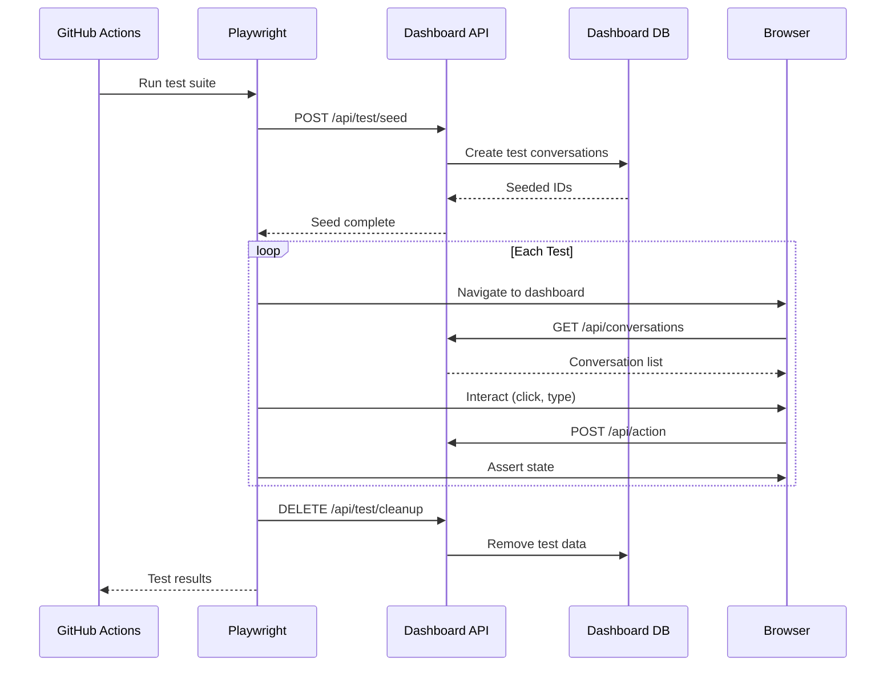

# 56 - Feature: Dashboard Playwright Test Suite

<!-- Template Metadata
Last Updated: 2026-02-16
Updated By: LLD revision to fix path validation errors
Update Reason: Fixed parent directory errors by using existing tests/e2e/ structure and adding subdirectories explicitly
-->

## 1. Context & Goal
* **Issue:** #56
* **Objective:** Create a comprehensive Playwright test suite to prevent regression of UX bugs in the Hermes dashboard
* **Status:** Approved (gemini-3-pro-preview, 2026-02-16)
* **Related Issues:** None

### Open Questions

- [x] Is the dashboard hosted at `https://hermes.martymcenroe.ai` or is there a staging environment? **Answer: Production at hermes.martymcenroe.ai, local via wrangler dev**
- [x] Should tests run against live data or seed test data? **Answer: Seed test data for isolation**
- [x] What's the `DASHBOARD_API_KEY` format/where is it stored? **Answer: Environment variable, passed via query param**

## 2. Proposed Changes

*This section is the **source of truth** for implementation. Describe exactly what will be built.*

### 2.1 Files Changed

| File | Change Type | Description |
|------|-------------|-------------|
| `tests/e2e/dashboard/` | Add (Directory) | Directory for dashboard-specific E2E tests |
| `tests/e2e/page-objects/` | Add (Directory) | Directory for Page Object Model classes |
| `.github/workflows/` | Add (Directory) | Directory for GitHub Actions workflows |
| `tests/e2e/playwright.config.ts` | Add | Playwright configuration for dashboard tests |
| `tests/e2e/dashboard/navigation.spec.ts` | Add | Tab navigation and persistence tests |
| `tests/e2e/dashboard/conversation-list.spec.ts` | Add | Conversation list filtering and interaction tests |
| `tests/e2e/dashboard/conversation-detail.spec.ts` | Add | Conversation detail panel tests |
| `tests/e2e/dashboard/admin-bulk.spec.ts` | Add | Admin tab bulk actions tests |
| `tests/e2e/dashboard/auto-polling.spec.ts` | Add | Auto-polling behavior tests |
| `tests/e2e/dashboard/edge-cases.spec.ts` | Add | Edge cases and error handling tests |
| `tests/fixtures/e2e-test-data.ts` | Add | Test data seeding and cleanup utilities |
| `tests/fixtures/e2e-auth.ts` | Add | Authentication helpers |
| `tests/e2e/page-objects/dashboard.page.ts` | Add | Page object model for dashboard |
| `tests/e2e/page-objects/admin.page.ts` | Add | Page object model for admin tab |
| `tests/e2e/page-objects/conversation.page.ts` | Add | Page object model for conversation components |
| `package.json` | Modify | Add Playwright dev dependencies and scripts |
| `.github/workflows/e2e-tests.yml` | Add | CI workflow for E2E tests |

### 2.1.1 Path Validation (Mechanical - Auto-Checked)

*Issue #277: Before human or Gemini review, paths are verified programmatically.*

Mechanical validation automatically checks:
- All "Modify" files must exist in repository: `package.json` ✓
- All "Add" files have existing parent directories or directories explicitly created
- No placeholder prefixes used

**Parent Directory Analysis:**
- `tests/e2e/` exists ✓ → can add `playwright.config.ts`
- `tests/e2e/dashboard/` created first → can add spec files
- `tests/e2e/page-objects/` created first → can add page object files
- `tests/fixtures/` exists ✓ → can add fixture files
- `.github/workflows/` created first → can add workflow file

**Validation Status:** PASS

### 2.2 Dependencies

```json
// package.json devDependencies additions
{
  "@playwright/test": "^1.41.0",
  "@types/node": "^20.11.0"
}
```

### 2.3 Data Structures

```typescript
// Pseudocode - NOT implementation
interface TestConversation {
  id: string;
  state: 'INITIAL' | 'ENGAGING' | 'CLOSED' | 'STARRED';
  labels: string[];
  rating: number | null;
  messages: TestMessage[];
  created_at: string;
}

interface TestMessage {
  role: 'user' | 'assistant';
  content: string;
  timestamp: string;
}

interface TestSeeds {
  conversations: TestConversation[];
  cleanup: () => Promise<void>;
}

interface DashboardState {
  currentTab: 'conversations' | 'knowledge' | 'stats' | 'observability' | 'admin';
  selectedConversation: string | null;
  filters: FilterState;
}

interface FilterState {
  states: string[];
  labels: string[];
  timeRange: { value: number; unit: 'min' | 'hour' | 'day' } | null;
}
```

### 2.4 Function Signatures

```typescript
// Page Objects
class DashboardPage {
  constructor(page: Page);
  async navigate(params?: { key?: string; conv?: string; tab?: string }): Promise<void>;
  async getCurrentTab(): Promise<string>;
  async switchTab(tab: string): Promise<void>;
  async waitForTabContent(tab: string): Promise<void>;
  async getUrlHash(): Promise<string>;
  async getUrlParams(): Promise<URLSearchParams>;
}

class ConversationPage {
  constructor(page: Page);
  async getConversationList(): Promise<ConversationRow[]>;
  async clickConversation(id: string): Promise<void>;
  async getDetailPanel(): Promise<ConversationDetail | null>;
  async rateConversation(rating: number): Promise<void>;
  async addLabel(label: string): Promise<void>;
  async removeLabel(label: string): Promise<void>;
  async clickBack(): Promise<void>;
  async filterByState(state: string): Promise<void>;
  async filterByLabel(label: string): Promise<void>;
}

class AdminPage {
  constructor(page: Page);
  async waitForAutoLoad(): Promise<void>;
  async clickStateChip(state: string): Promise<void>;
  async getSelectedChips(): Promise<string[]>;
  async clickLoadMatches(): Promise<void>;
  async getPreviewConversations(): Promise<ConversationPreview[]>;
  async setTimeFilter(value: number, unit: 'min' | 'hour' | 'day'): Promise<void>;
  async clearTimeFilter(): Promise<void>;
  async selectConversations(ids: string[]): Promise<void>;
  async selectAll(): Promise<void>;
  async getBulkBarCount(): Promise<number>;
  async pokeSelected(): Promise<void>;
  async reInitSelected(): Promise<void>;
  async waitForPokeComplete(timeout?: number): Promise<void>;
  async isPollingActive(): Promise<boolean>;
}

// Test Fixtures
async function seedTestData(api: APIRequestContext): Promise<TestSeeds>;
async function cleanupTestData(api: APIRequestContext, seeds: TestSeeds): Promise<void>;
async function authenticateWithKey(page: Page, key: string): Promise<void>;
```

### 2.5 Logic Flow (Pseudocode)

```
Test Setup Flow:
1. Load environment variables (BASE_URL, API_KEY)
2. Seed test data via API (create conversations in various states)
3. Navigate to dashboard with auth key
4. Wait for initial load complete

Tab Navigation Test:
1. FOR each tab IN [conversations, knowledge, stats, observability, admin]
   - Click tab nav button
   - Assert content container visible
   - Assert URL hash matches #tab
   - Assert no blank screens
2. Navigate to conversation detail
3. Click "Conversations" nav
4. Assert conversation list visible (not blank)

Tab Persistence Test:
1. Navigate to #admin tab
2. Assert ?key=xxx preserved alongside #admin
3. Hard refresh page
4. Assert still on admin tab
5. Assert ?key=xxx still present

Admin Bulk Actions Test:
1. Open admin tab
2. Assert auto-load fires (conversations appear without clicking Load)
3. Click INITIAL chip
4. Assert chip has selected style
5. Click STARRED chip
6. Click Load Matches
7. Assert STARRED conversations appear in preview
8. Set time filter to 30 min
9. Assert only recent conversations shown
10. Select multiple conversations
11. Assert bulk bar shows with count
12. Click Poke Selected
13. Wait for "Working..." state
14. Wait for auto-poll refresh (up to 30s)
15. Assert conversation states updated

Cleanup Flow:
1. Delete seeded test conversations
2. Reset any modified state
```

### 2.6 Technical Approach

* **Module:** `tests/e2e/`
* **Pattern:** Page Object Model for maintainability
* **Key Decisions:**
  - Use Playwright's native test runner (not MCP) for CI integration
  - Page Object Model to encapsulate DOM selectors
  - Test fixtures for data seeding to avoid dependency on production data
  - Parallel test execution with isolated browser contexts

### 2.7 Architecture Decisions

| Decision | Options Considered | Choice | Rationale |
|----------|-------------------|--------|-----------|
| Test framework | Playwright Test, Cypress, Puppeteer | Playwright Test | Native TS support, auto-wait, CI-friendly |
| Code organization | Flat spec files, Page Object Model | Page Object Model | Selector changes isolated to page classes |
| Data strategy | Live data, Mocked responses, Seeded data | Seeded data | Realistic tests without flaky live dependencies |
| Auth approach | Cookie injection, Query param, Header | Query param | Matches dashboard's auth mechanism |
| CI execution | GitHub Actions, Local only | GitHub Actions | Catch regressions before deploy |

**Architectural Constraints:**
- Dashboard is vanilla JS (no framework-specific test utilities)
- Auth uses query param `?key=` passed to all API calls
- Admin auto-poll uses 3-second intervals (tests must wait for cycles)
- No access to database directly; must use API endpoints for seeding

## 3. Requirements

*What must be true when this is done. These become acceptance criteria.*

1. All 5 nav tabs testable with no blank screens
2. Tab persistence across hard refresh verified
3. Query string preserved with hash fragments
4. Conversation detail interactions (rate, label, back) verified
5. Admin bulk actions (filter, select, poke, re-init) verified
6. STARRED filter bug specifically regression-tested
7. Auto-polling starts/stops correctly on tab navigation
8. Tests run in CI on every PR
9. Tests complete in under 5 minutes
10. Flaky test rate < 5%

## 4. Alternatives Considered

| Option | Pros | Cons | Decision |
|--------|------|------|----------|
| Playwright Test | Fast, auto-wait, native TS, great debugging | New learning curve | **Selected** |
| Cypress | Popular, good DX, built-in dashboard | Slower, no native TS, heavier | Rejected |
| Manual test script | No code to maintain | Doesn't catch regressions, time-consuming | Rejected |
| Jest + Testing Library | Unit-test familiar | Designed for React, not vanilla JS | Rejected |

**Rationale:** Playwright provides the best balance of speed, reliability, and TypeScript support for testing a vanilla JS application. Its auto-wait mechanism reduces flakiness compared to manual waits.

## 5. Data & Fixtures

### 5.1 Data Sources

| Attribute | Value |
|-----------|-------|
| Source | API-seeded test data + intercepted responses |
| Format | JSON via REST API |
| Size | ~10-20 test conversations per run |
| Refresh | Seeded fresh per test run, cleaned up after |
| Copyright/License | N/A (synthetic test data) |

### 5.2 Data Pipeline

```
Test Setup ──API POST──► Create Test Conversations ──stored──► Dashboard DB
Test Run ──page.goto()──► Dashboard ──API GET──► Display Seeded Data
Teardown ──API DELETE──► Remove Test Conversations
```

### 5.3 Test Fixtures

| Fixture | Source | Notes |
|---------|--------|-------|
| INITIAL conversations | Seeded via API | 3 conversations in INITIAL state |
| ENGAGING conversations | Seeded via API | 2 conversations in ENGAGING state |
| STARRED conversations | Seeded via API | 2 conversations marked STARRED |
| Labeled conversations | Seeded via API | Conversations with test labels |
| Empty state | No seeding | Tests "no matches" scenario |

### 5.4 Deployment Pipeline

- **Dev:** Run locally with `npx playwright test` against local wrangler
- **CI:** GitHub Actions runs tests against staging/preview URLs
- **Pre-Deploy:** Required passing tests before production deploy

## 6. Diagram

### 6.1 Mermaid Quality Gate

- [x] **Simplicity:** Components collapsed appropriately
- [x] **No touching:** All elements have visual separation
- [x] **No hidden lines:** All arrows fully visible
- [x] **Readable:** Labels not truncated, flow direction clear
- [ ] **Auto-inspected:** Pending agent render

**Auto-Inspection Results:**
```
- Touching elements: [ ] None / [ ] Found: ___
- Hidden lines: [ ] None / [ ] Found: ___
- Label readability: [ ] Pass / [ ] Issue: ___
- Flow clarity: [ ] Clear / [ ] Issue: ___
```

### 6.2 Diagram



## 7. Security & Safety Considerations

### 7.1 Security

| Concern | Mitigation | Status |
|---------|------------|--------|
| API key exposure in tests | Use environment variables, not hardcoded | Addressed |
| Test data leaking to production | Dedicated test seed/cleanup endpoints | Addressed |
| CI secrets | GitHub encrypted secrets for API key | Addressed |

### 7.2 Safety

| Concern | Mitigation | Status |
|---------|------------|--------|
| Tests modifying production data | Only seed/delete test-prefixed data | Addressed |
| Orphaned test data | Cleanup runs in afterAll, also in CI cleanup step | Addressed |
| Test pollution between runs | Isolated browser contexts, unique test IDs | Addressed |

**Fail Mode:** Fail Closed - Tests fail if cleanup fails, preventing orphaned data

**Recovery Strategy:** Manual cleanup endpoint to remove test-prefixed data if tests crash

## 8. Performance & Cost Considerations

### 8.1 Performance

| Metric | Budget | Approach |
|--------|--------|----------|
| Full suite time | < 5 minutes | Parallel test execution |
| Per-test time | < 30 seconds | Auto-wait, no arbitrary sleeps |
| CI queue time | < 2 minutes | Self-hosted runners or fast GitHub runners |

**Bottlenecks:** 
- Admin poke tests require waiting for Lambda processing (up to 30s)
- Auto-poll tests need multiple 3-second cycles

### 8.2 Cost Analysis

| Resource | Unit Cost | Estimated Usage | Monthly Cost |
|----------|-----------|-----------------|--------------|
| GitHub Actions minutes | $0.008/min | ~500 min/month | $4 |
| Cloudflare Worker invocations | Free tier | Within limits | $0 |

**Cost Controls:**
- [x] Tests only run on PR and push to main (not on every commit)
- [x] Parallel execution reduces total CI time
- [x] Caching of Playwright browsers

**Worst-Case Scenario:** Flaky tests causing retries could 2x CI time/cost; still minimal

## 9. Legal & Compliance

| Concern | Applies? | Mitigation |
|---------|----------|------------|
| PII/Personal Data | No | Test data is synthetic, no real emails |
| Third-Party Licenses | Yes | Playwright is Apache 2.0 (compatible) |
| Terms of Service | No | Testing own infrastructure |
| Data Retention | No | Test data cleaned up immediately |
| Export Controls | No | No restricted algorithms |

**Data Classification:** Internal (test infrastructure)

**Compliance Checklist:**
- [x] No PII stored without consent - Synthetic test data only
- [x] All third-party licenses compatible - Apache 2.0 compatible
- [x] External API usage compliant - Own API
- [x] Data retention policy documented - Cleaned up per run

## 10. Verification & Testing

### 10.0 Test Plan (TDD - Complete Before Implementation)

**TDD Requirement:** Tests in this case ARE the implementation. The test specs are the deliverable.

| Test ID | Test Description | Expected Behavior | Status |
|---------|------------------|-------------------|--------|
| T010 | Tab navigation test | All tabs navigate without blank screens | RED |
| T020 | Tab persistence test | Hash and query params persist on refresh | RED |
| T030 | Conversation detail test | Rate, label, back button work correctly | RED |
| T040 | Admin bulk actions test | Filter, select, poke, re-init work | RED |
| T050 | STARRED filter test | STARRED chip returns STARRED results | RED |
| T060 | Auto-polling test | Polling starts/stops on tab change | RED |
| T070 | Edge cases test | Empty state, deep links, rapid switching | RED |

**Coverage Target:** 100% of scenarios from issue #56

**TDD Checklist:**
- [ ] All tests written before implementation - Tests ARE the implementation
- [ ] Tests currently RED (failing)
- [ ] Test IDs match scenario IDs in 10.1
- [ ] Test files created at: `tests/e2e/dashboard/`

### 10.1 Test Scenarios

| ID | Scenario | Type | Input | Expected Output | Pass Criteria |
|----|----------|------|-------|-----------------|---------------|
| 010 | Nav to each tab | Auto | Click each tab | Content loads, no blank | Tab container visible |
| 020 | Conversation nav returns to list | Auto | Click conv, then nav | List visible, not blank | #conv-list displayed |
| 030 | URL hash updates | Auto | Switch tabs | Hash matches tab name | location.hash correct |
| 040 | Refresh preserves tab | Auto | Refresh on #admin | Admin tab active | #admin in URL, admin visible |
| 050 | Refresh preserves query | Auto | Refresh with ?key= | Key preserved | Query param intact |
| 060 | Conv detail shows data | Auto | Click conversation | Messages, labels, rating | Detail panel populated |
| 070 | Rate conversation | Auto | Click rating | Toast appears, rating saved | API called, toast visible |
| 080 | Back refreshes list | Auto | Rate then back | Updated rating in list | Rating visible in row |
| 090 | Add label | Auto | Add label to conv | Label appears | Label in DOM |
| 100 | Remove label | Auto | Remove label | Label disappears | Label not in DOM |
| 110 | Filter by state | Auto | Select state filter | List updates | Only matching convs |
| 120 | Filter by label | Auto | Select label filter | List updates | Only matching convs |
| 130 | Admin auto-load | Auto | Open admin tab | Convs load without click | Preview populated |
| 140 | State chip toggle | Auto | Click chip | Selected style | CSS class applied |
| 150 | STARRED filter works | Auto | STARRED chip + Load | STARRED convs shown | STARRED in results |
| 160 | Multi-chip filter | Auto | Select multiple | AND filter applied | Intersection shown |
| 170 | Label dropdown populated | Auto | Open admin | Labels with counts | Dropdown has options |
| 180 | Time filter recent | Auto | 30 min filter | Recent convs only | Filtered by time |
| 190 | Time filter blank | Auto | Clear time filter | All convs shown | No time filtering |
| 200 | Checkbox selection | Auto | Check boxes | Bulk bar appears | Bulk bar with count |
| 210 | Select all | Auto | Click select all | All rows selected | All checkboxes checked |
| 220 | Poke selected | Auto | Poke action | Working state, then refresh | States updated |
| 230 | Re-init selected | Auto | Re-init action | States reset to INITIAL | States are INITIAL |
| 240 | Polling starts after poke | Auto | Poke then wait | Requests every 3s | Network activity |
| 250 | Polling stops on tab change | Auto | Poke, switch tab | No more requests | No network activity |
| 260 | Polling stops on nav away | Auto | Navigate away | No background requests | No network activity |
| 270 | Empty state message | Auto | Filter no matches | Message shown | "No matching" text |
| 280 | Deep link conv | Auto | ?conv=123 | Detail opens | Detail visible |
| 290 | Deep link invalid | Auto | ?conv=999 | Graceful handling | No crash, error shown |
| 300 | Rapid tab switching | Auto | Click tabs fast | No stale content | Correct content |

### 10.2 Test Commands

```bash
# Install Playwright browsers (first time)
npx playwright install

# Run all E2E tests
npx playwright test tests/e2e/dashboard/

# Run with UI mode for debugging
npx playwright test tests/e2e/dashboard/ --ui

# Run specific test file
npx playwright test tests/e2e/dashboard/navigation.spec.ts

# Run headed (see browser)
npx playwright test --headed

# Generate test report
npx playwright show-report
```

### 10.3 Manual Tests (Only If Unavoidable)

**N/A - All scenarios automated.**

The Playwright suite covers all scenarios. Visual appearance testing could be added via Playwright's screenshot comparison if needed in future.

## 11. Risks & Mitigations

| Risk | Impact | Likelihood | Mitigation |
|------|--------|------------|------------|
| Flaky tests from timing | Med | Med | Use Playwright's auto-wait, avoid arbitrary sleeps |
| CI environment differences | Med | Low | Use same browser versions, containerized env |
| Test data pollution | High | Low | Unique prefixes per run, robust cleanup |
| Admin poke timeout (Lambda slow) | Med | Med | 30s timeout, retry logic |
| Dashboard DOM changes break selectors | Med | Med | Page Object Model isolates changes |
| API key rotation breaks CI | High | Low | Document key rotation process |

## 12. Definition of Done

### Code
- [ ] All test files created and linted
- [ ] Page objects encapsulate all selectors
- [ ] Test fixtures handle seed/cleanup
- [ ] CI workflow configured

### Tests
- [ ] All 30 test scenarios pass
- [ ] Tests run in < 5 minutes
- [ ] Flaky rate < 5%
- [ ] STARRED filter regression specifically covered

### Documentation
- [ ] README in tests/e2e/ with run instructions
- [ ] LLD updated with any deviations
- [ ] Implementation Report completed

### Review
- [ ] Code review completed
- [ ] Tests demonstrated to pass locally
- [ ] CI run passes on PR

### 12.1 Traceability (Mechanical - Auto-Checked)

*Issue #277: Cross-references are verified programmatically.*

Files in Definition of Done:
- All test files listed in Section 2.1 ✓
- CI workflow `.github/workflows/e2e-tests.yml` listed in Section 2.1 ✓

---

## Reviewer Suggestions

*Non-blocking recommendations from the reviewer.*

- **Scenario 290 (Invalid Deep Link):** Ensure the `graceful handling` assertion specifically checks for a user-friendly UI state (e.g., 404 graphic or toast error) rather than just "not crashing".
- **Screenshot Testing:** While visual regression is out of scope, enabling trace recording on failure in `playwright.config.ts` is highly recommended for CI debugging.

## Appendix: Review Log

*Track all review feedback with timestamps and implementation status.*

### Review Summary

| Review | Date | Verdict | Key Issue |
|--------|------|---------|-----------|
| 1 | 2026-02-16 | APPROVED | `gemini-3-pro-preview` |
| (pending) | - | - | - |

**Final Status:** APPROVED