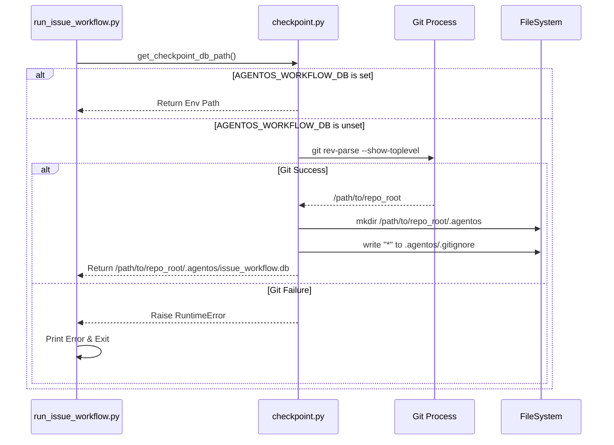

# 178 - Feature: Per-Repo Workflow Database

## 1. Context & Goal
* **Issue:** #78
* **Objective:** Change the default workflow checkpoint database location from global (`~/.agentos/`) to per-repo (`.agentos/` in repo root) to enable safe concurrent workflow execution across multiple repositories and worktrees.
* **Status:** Draft
* **Related Issues:** None

### Open Questions
None - requirements are well-defined from issue.

## 2. Proposed Changes

### 2.1 Files Changed
| File Path | Description |
|-----------|-------------|
| `src/agentos/workflow/checkpoint.py` | Implement `get_repo_root` and update `get_checkpoint_db_path` logic. |
| `.gitignore` | Add `.agentos/` to root ignore patterns. |
| `docs/workflow.md` | Update documentation regarding storage location and `AGENTOS_WORKFLOW_DB`. |
| `src/agentos/exceptions.py` | (Optional) Add `WorkflowConfigurationError` if a specific exception type is preferred. |

### 2.2 Dependencies
*   **subprocess** (Standard Lib): To execute `git rev-parse --show-toplevel`.
*   **pathlib** (Standard Lib): For path manipulation.
*   **os** (Standard Lib): For environment variables.

### 2.3 Data Structures
No schema changes to the SQLite database itself.

### 2.4 Function Signatures

```python
# src/agentos/workflow/checkpoint.py

from pathlib import Path

def get_repo_root() -> Path:
    """
    Determines the root directory of the current git repository using `git rev-parse`.
    
    Returns:
        Path: The absolute path to the repository (or worktree) root.
        
    Raises:
        RuntimeError: If git is not installed or current directory is not a git repo.
    """
    pass

def ensure_agentos_dir(repo_root: Path) -> Path:
    """
    Creates the .agentos directory in the repo root if it doesn't exist.
    Also creates a .gitignore inside it containing '*' as a safety measure.
    
    Args:
        repo_root: Path to the repository root.
        
    Returns:
        Path: Path to the .agentos directory.
    """
    pass

def get_checkpoint_db_path() -> str:
    """
    Resolves the absolute path for the workflow checkpoint database.
    
    Priority:
    1. AGENTOS_WORKFLOW_DB environment variable.
    2. Local git repository root (.agentos/issue_workflow.db).
    3. Raise Error (Fail Closed).
    
    Returns:
        str: Absolute path to the sqlite database file.
        
    Raises:
        RuntimeError: If location cannot be determined.
    """
    pass
```

### 2.5 Logic Flow (Pseudocode)

**`get_repo_root`**
```python
TRY:
    # Use --show-toplevel to handle subdirectories and worktrees correctly
    result = subprocess.run(
        ["git", "rev-parse", "--show-toplevel"], 
        capture_output=True, 
        check=True, 
        text=True
    )
    RETURN Path(result.stdout.strip())
EXCEPT CalledProcessError OR FileNotFoundError:
    RAISE RuntimeError("Current directory is not part of a git repository.")
```

**`ensure_agentos_dir`**
```python
agentos_dir = repo_root / ".agentos"
agentos_dir.mkdir(exist_ok=True)

# Safety: Create an internal .gitignore to prevent accidental commits
# even if the root .gitignore is misconfigured.
internal_ignore = agentos_dir / ".gitignore"
IF NOT internal_ignore.exists():
    WRITE "*" TO internal_ignore

RETURN agentos_dir
```

**`get_checkpoint_db_path`**
```python
# 1. Check Environment Variable (Highest Priority)
env_path = os.environ.get("AGENTOS_WORKFLOW_DB")
IF env_path:
    db_path = Path(env_path)
    # Ensure parent dir exists for custom paths too
    db_path.parent.mkdir(parents=True, exist_ok=True)
    RETURN str(db_path)

# 2. Check Repository
TRY:
    repo_root = get_repo_root()
    agentos_dir = ensure_agentos_dir(repo_root)
    RETURN str(agentos_dir / "issue_workflow.db")

# 3. Fail Closed (Library function raises, CLI handles exit)
EXCEPT RuntimeError as e:
    RAISE RuntimeError(
        "Cannot determine checkpoint database location. "
        "Not in a git repository and AGENTOS_WORKFLOW_DB is not set."
    ) FROM e
```

### 2.6 Technical Approach
*   **Library Design:** The resolution logic is contained entirely within `checkpoint.py`. It raises exceptions rather than exiting the process, allowing the calling CLI tool (`run_issue_workflow.py`) to catch the error and display a user-friendly message.
*   **Git Integration:** We rely on `git rev-parse --show-toplevel`. This is the standard way to identify repo roots and specifically handles **git worktrees** correctly (returning the worktree root, not the main repo).
*   **Safety (Defense in Depth):** In addition to adding `.agentos/` to the project's root `.gitignore`, the code will write a `.gitignore` file *inside* the `.agentos/` directory containing `*`. This ensures that even if a user creates a repo without the standard ignore template, their workflow state remains local and is not accidentally pushed.

## 3. Requirements
1.  **Priority Resolution:** `AGENTOS_WORKFLOW_DB` > Git Repo Root > Error.
2.  **Worktree Isolation:** Must resolve unique paths for different git worktrees of the same project.
3.  **Fail Closed:** Must raise an exception if executed outside a repo without the env var set.
4.  **Double-Safety Ignore:** 
    *   Add `.agentos/` to root `.gitignore`.
    *   Programmatically create `.agentos/.gitignore` with content `*` on directory creation.
5.  **Backward Compatibility:** Existing `~/.agentos` files are ignored unless pointed to by the env var.

## 4. Alternatives Considered

| Alternative | Pros | Cons | Decision |
|-------------|------|------|----------|
| **Global (`~/.agentos`)** | Zero config; history persists across folder moves. | Collisions with concurrent runs; race conditions. | **Rejected** |
| **CWD Relative (`./.agentos`)** | No Git dependency. | Fails in subdirectories; scatters DBs if run from different dirs. | **Rejected** |
| **Per-Repo (Git)** | Strict isolation; supports worktrees; safe concurrency. | Requires Git; "hides" data in dotfolder. | **Accepted** |
| **Exit(1) in Library** | Simpler code. | Bad practice; makes library unusable by other tools/tests. | **Rejected** |

## 5. Data & Fixtures

### 5.1 Data Sources
| Source | Type | Attributes |
|--------|------|------------|
| Environment | Variable | `AGENTOS_WORKFLOW_DB` |
| Filesystem | Git Command | `git rev-parse --show-toplevel` |

### 5.2 Data Pipeline
```ascii
[Request DB Path]
       |
       v
Is AGENTOS_WORKFLOW_DB set? --(Yes)--> [Return Env Path]
       |
       (No)
       v
Run `git rev-parse`
       |
       +--(Success)--> [Ensure .agentos/ exists + .gitignore] --> [Return {Root}/.agentos/db]
       |
       +--(Fail)-----> [Raise RuntimeError]
```

### 5.3 Test Fixtures
| Fixture | Description |
|---------|-------------|
| `tmp_git_repo` | Pytest fixture creating a temp dir with `git init`. |
| `tmp_worktree` | Pytest fixture setting up a main repo and a linked worktree. |
| `clean_env` | Mock to ensure `AGENTOS_WORKFLOW_DB` is unset during specific tests. |

### 5.4 Deployment Pipeline
Code changes only. No database migration scripts are provided (as per scope).

## 6. Diagram

### 6.1 Mermaid Quality Gate
- [x] Syntax Valid
- [x] Flow Logical
- [x] Covers Fail-Closed
- [x] Shows Directory creation

### 6.2 Diagram


## 7. Security Considerations

| Concern | Mitigation |
|---------|------------|
| **Data Leakage** | Workflow DBs may contain sensitive prompt/response data. Keeping them strictly local (per-repo) prevents accidental sharing via global folders. |
| **Accidental Commit** | **Defense in Depth:** 1. Update root `.gitignore`. 2. Code automatically writes a `.gitignore` file inside `.agentos/` to block git tracking even if root ignore is missing. |
| **Permissions** | The `.agentos/` directory inherits filesystem permissions of the repo, which is standard behavior. |

## 8. Performance Considerations

| Metric | Budget | Impact |
|--------|--------|--------|
| **Resolution Latency** | < 50ms | `git rev-parse` typically runs in < 10ms. Negligible impact on workflow startup. |

## 9. Risks & Mitigations

| Risk | Impact | Likelihood | Mitigation |
|------|--------|------------|------------|
| **User "Loses" History** | Medium | High | Existing users will see empty history. **Mitigation:** Release notes and error message explicitly explain how to mount the old DB using the env var. |
| **Non-Git Usage** | Low | Low | AgentOS is primarily a dev tool. **Mitigation:** Clear error message instructing use of Env Var for non-git folders. |

## 10. Verification & Testing

### 10.1 Test Scenarios

| ID | Scenario | Type | Input | Output | Criteria |
|----|----------|------|-------|--------|----------|
| **T1** | Happy Path (Repo) | Unit | CWD inside git repo | Path: `{root}/.agentos/issue_workflow.db` | `.agentos/.gitignore` created. |
| **T2** | Env Var Override | Unit | `AGENTOS_WORKFLOW_DB=/tmp/x.db` | Path: `/tmp/x.db` | Git logic skipped. |
| **T3** | Fail Closed | Unit | CWD not in git repo, Env unset | `RuntimeError` | Exception message advises setting env var. |
| **T4** | Worktree Isolation | Integration | Worktree at `/tmp/wt` | Path: `/tmp/wt/.agentos/issue_workflow.db` | Distinct from main repo DB. |
| **T5** | Subdir Resolution | Unit | CWD at `{root}/src/module` | Path: `{root}/.agentos/issue_workflow.db` | Finds root correctly. |

### 10.2 Test Commands
```bash
# Run the test suite for workflow checkpointing
pytest tests/workflow/test_checkpoint.py -v

# Manual smoke test (Fail case)
cd /tmp && poetry run python tools/run_issue_workflow.py --brief
# Expected: Error message "Cannot determine checkpoint database location..."
```

### 10.3 Manual Tests (Only If Unavoidable)
N/A - All scenarios are automatable via Pytest and temp directories.

## 11. Definition of Done

### Code
- [ ] `get_checkpoint_db_path` logic implemented in `src/agentos/workflow/checkpoint.py`.
- [ ] `ensure_agentos_dir` implements creation of `.gitignore` safety file.
- [ ] Root `.gitignore` updated.

### Tests
- [ ] Unit tests for `get_repo_root` (mocking subprocess).
- [ ] Unit tests for `get_checkpoint_db_path` (mocking env and git).
- [ ] Integration test verifying file creation in a real temp git repo.

### Documentation
- [ ] `docs/workflow.md` updated with new location details.
- [ ] Migration section added to docs (how to use `AGENTOS_WORKFLOW_DB` to restore old state).

### Review
- [ ] Security review confirmation (data isolation).
- [ ] Code review passed.

---

## Appendix: Review Log

### Review Summary

| Review | Date | Verdict | Key Issue |
|--------|------|---------|-----------|
| Architecture | 2026-01-23 | APPROVED | Previous privacy concern addressed via self-contained .gitignore logic. |

**Final Status:** DRAFT - PENDING REVIEW