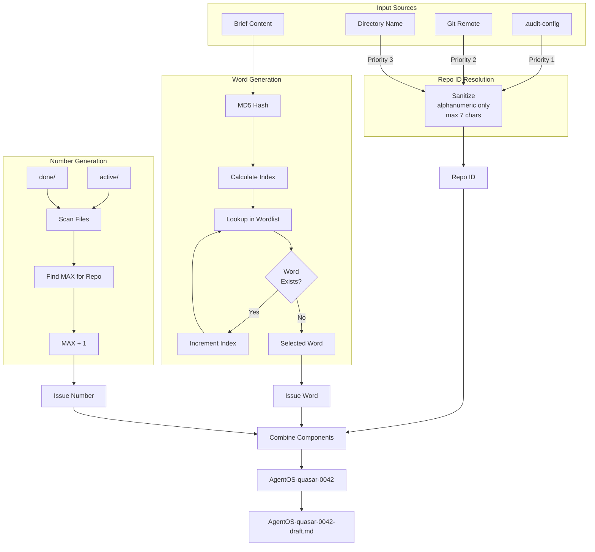

# 83 - Feature: Structured Issue File Naming Scheme for Multi-Repo Workflows

<!-- Template Metadata
Last Updated: 2025-01-13
Updated By: LLD Generation
Update Reason: Initial LLD creation for structured issue file naming
-->

## 1. Context & Goal
* **Issue:** #83
* **Objective:** Implement a collision-free file naming scheme `{REPO}-{WORD}-{NUM}-{TYPE}.md` for audit files across multi-repo workflows.
* **Status:** Draft
* **Related Issues:** None

### Open Questions
*Questions that need clarification before or during implementation. Remove when resolved.*

- [ ] Should the wordlist be user-extensible via configuration, or strictly curated?
- [ ] What happens when all 80+ words are exhausted for a single repo (edge case at ~10,000 issues)?

## 2. Proposed Changes

*This section is the **source of truth** for implementation. Describe exactly what will be built.*

### 2.1 Files Changed

| File | Change Type | Description |
|------|-------------|-------------|
| `src/skills/audit/wordlist.py` | Add | New file containing curated `ISSUE_WORDS` list (80+ words) |
| `src/skills/audit/utils.py` | Modify | Add `get_repo_short_id()`, `get_next_issue_number()`, `generate_issue_word()`, update `generate_slug()`, `save_audit_file()` |
| `src/skills/audit/state.py` | Modify | Add `issue_word` field to `IssueWorkflowState` |
| `src/skills/audit/nodes/load_brief.py` | Modify | Use new slug generation with word-based naming |
| `src/skills/audit/nodes/draft.py` | Modify | Use updated `save_audit_file()` signature |
| `src/skills/audit/nodes/review.py` | Modify | Use updated `save_audit_file()` signature |
| `src/skills/audit/nodes/human_edit_draft.py` | Modify | Use updated `save_audit_file()` signature |
| `src/skills/audit/nodes/human_edit_verdict.py` | Modify | Use updated `save_audit_file()` signature |
| `src/skills/audit/nodes/file_issue.py` | Modify | Update `done/` directory naming to use new scheme |
| `tests/unit/test_audit_naming.py` | Add | Unit tests for slug generation, sanitization, collision detection |
| `tests/integration/test_audit_naming_workflow.py` | Add | Integration tests for full workflow with new naming |

### 2.1.1 Path Validation (Mechanical - Auto-Checked)

*Issue #277: Before human or Gemini review, paths are verified programmatically.*

Mechanical validation automatically checks:
- All "Modify" files must exist in repository
- All "Delete" files must exist in repository
- All "Add" files must have existing parent directories
- No placeholder prefixes (`src/`, `lib/`, `app/`) unless directory exists

**If validation fails, the LLD is BLOCKED before reaching review.**

### 2.2 Dependencies

*New packages, APIs, or services required.*

```toml
# No new dependencies required - uses Python stdlib only
# hashlib (md5) - stdlib
# re (regex) - stdlib
# subprocess (git) - stdlib
```

### 2.3 Data Structures

```python
# Pseudocode - NOT implementation

# wordlist.py
ISSUE_WORDS: list[str]  # 80+ curated 4-6 letter vocabulary words

# state.py - Addition to IssueWorkflowState
class IssueWorkflowState(TypedDict):
    # ... existing fields ...
    issue_word: str | None  # Word component of slug (e.g., "quasar")
    repo_id: str | None     # Repo ID component (e.g., "AgentOS")
    issue_number: int | None  # Numeric component (e.g., 42)

# utils.py - Config file structure
class AuditConfig(TypedDict, total=False):
    repo_id: str  # Override repo ID
```

### 2.4 Function Signatures

```python
# src/skills/audit/utils.py

def get_repo_short_id(
    repo_path: Path | None = None,
    config_override: str | None = None
) -> str:
    """
    Get sanitized repo ID from config, git remote, or directory name.
    
    Priority order:
    1. config_override parameter (for testing)
    2. .audit-config file repo_id field
    3. Git remote URL repo name
    4. Current directory name
    
    Returns: Sanitized alphanumeric string, max 7 chars, first letter capitalized.
    Raises: ValueError if result is empty after sanitization.
    """
    ...

def sanitize_repo_id(raw_id: str) -> str:
    """
    Sanitize a raw string to alphanumeric repo ID.
    
    - Strips all non-alphanumeric characters
    - Truncates to first 7 characters
    - Capitalizes first letter
    
    Returns: Sanitized string or raises ValueError if empty.
    """
    ...

def get_next_issue_number(
    repo_id: str,
    active_dir: Path,
    done_dir: Path
) -> int:
    """
    Get next sequential issue number for a specific repo ID.
    
    Scans active/ and done/ directories for files matching {repo_id}-*-????-*.md
    Returns MAX(existing numbers) + 1, or 1 if none exist.
    """
    ...

def generate_issue_word(
    brief_content: str,
    existing_words: set[str]
) -> str:
    """
    Generate deterministic word from brief content hash.
    
    Uses MD5 hash of content to seed word selection from ISSUE_WORDS.
    Handles collisions by incrementing index until unique word found.
    
    Returns: Unique word not in existing_words set.
    Raises: ValueError if all words exhausted (extremely unlikely).
    """
    ...

def get_existing_words(
    active_dir: Path,
    done_dir: Path
) -> set[str]:
    """
    Collect all words currently in use from active/ and done/ directories.
    
    Parses filenames matching {REPO}-{WORD}-{NUM}-*.md pattern.
    Returns: Set of word strings.
    """
    ...

def generate_slug(
    brief_content: str,
    active_dir: Path,
    done_dir: Path,
    repo_path: Path | None = None
) -> tuple[str, str, str, int]:
    """
    Generate complete issue slug with all components.
    
    Returns: (full_slug, repo_id, word, number)
             e.g., ("AgentOS-quasar-0042", "AgentOS", "quasar", 42)
    """
    ...

def save_audit_file(
    audit_dir: Path,
    slug: str,
    file_type: str,
    content: str,
    sequence: int | None = None
) -> Path:
    """
    Save audit file with new naming convention.
    
    Args:
        audit_dir: Base audit directory (e.g., docs/audit/active/)
        slug: Full slug (e.g., "AgentOS-quasar-0042")
        file_type: Type of file (brief, draft, verdict, feedback, filed)
        content: File content
        sequence: Optional revision number (2, 3, etc.)
    
    Returns: Path to saved file
    
    File format: {slug}-{type}{sequence}.md
    Examples: AgentOS-quasar-0042-draft.md, AgentOS-quasar-0042-draft2.md
    """
    ...

def parse_slug(filename: str) -> tuple[str, str, int, str] | None:
    """
    Parse a filename into slug components.
    
    Returns: (repo_id, word, number, file_type) or None if not matching format.
    """
    ...
```

### 2.5 Logic Flow (Pseudocode)

```
=== get_repo_short_id() ===
1. IF config_override provided:
   - Return sanitize_repo_id(config_override)
2. Check for .audit-config in repo_path (or cwd)
3. IF .audit-config exists AND has repo_id:
   - Return sanitize_repo_id(config.repo_id)
4. TRY extract from git remote:
   - Run: git config --get remote.origin.url
   - Parse repo name from URL (handles SSH and HTTPS)
   - Return sanitize_repo_id(repo_name)
5. FALLBACK to directory name:
   - Return sanitize_repo_id(cwd.name)

=== sanitize_repo_id() ===
1. Apply regex: re.sub(r'[^a-zA-Z0-9]', '', raw_id)
2. IF result is empty:
   - Raise ValueError("Cannot create valid repo ID")
3. Truncate to first 7 characters
4. Capitalize first letter
5. Return result

=== generate_issue_word() ===
1. Compute MD5 hash of brief_content
2. Convert hash to integer seed
3. Calculate base_index = seed % len(ISSUE_WORDS)
4. FOR offset in range(len(ISSUE_WORDS)):
   - index = (base_index + offset) % len(ISSUE_WORDS)
   - word = ISSUE_WORDS[index]
   - IF word NOT IN existing_words:
     - Return word
5. Raise ValueError("All words exhausted")

=== get_next_issue_number() ===
1. Initialize numbers = []
2. FOR dir in [active_dir, done_dir]:
   - Glob pattern: {repo_id}-*-????-*.md
   - Extract 4-digit number from each match
   - Append to numbers
3. IF numbers is empty:
   - Return 1
4. Return max(numbers) + 1

=== generate_slug() ===
1. repo_id = get_repo_short_id(repo_path)
2. existing_words = get_existing_words(active_dir, done_dir)
3. word = generate_issue_word(brief_content, existing_words)
4. number = get_next_issue_number(repo_id, active_dir, done_dir)
5. slug = f"{repo_id}-{word}-{number:04d}"
6. Return (slug, repo_id, word, number)

=== save_audit_file() ===
1. Create directory: audit_dir / slug
2. Build filename:
   - IF sequence: f"{slug}-{file_type}{sequence}.md"
   - ELSE: f"{slug}-{file_type}.md"
3. Write content to file
4. Return file path
```

### 2.6 Technical Approach

* **Module:** `src/skills/audit/`
* **Pattern:** Functional utilities with pure functions for testability
* **Key Decisions:**
  - MD5 chosen for determinism (not security) - fast and stable
  - Curated wordlist over external API for reliability and control
  - Per-repo number scoping prevents collision across repos
  - 4-digit numbers allow 9,999 issues per repo (sufficient for any project)

### 2.7 Architecture Decisions

*Document key architectural decisions that affect the design.*

| Decision | Options Considered | Choice | Rationale |
|----------|-------------------|--------|-----------|
| Hash algorithm | MD5, SHA256, CRC32 | MD5 | Fast, deterministic, not security-sensitive |
| Word selection | Random, hash-based, sequential | Hash-based | Deterministic (same brief = same word), memorable |
| Number scope | Global, per-word, per-repo | Per-repo | Prevents collisions, logical grouping |
| Config format | JSON, YAML, TOML, INI | JSON | Simple, stdlib support, consistent with other config |
| Repo ID source | Git only, dir only, hybrid | Hybrid with priority | Flexibility, works without git |

**Architectural Constraints:**
- Must integrate with existing audit workflow nodes
- Cannot introduce external dependencies (network calls)
- Must be backward compatible with old naming scheme
- Must be safe against path traversal attacks

## 3. Requirements

*What must be true when this is done. These become acceptance criteria.*

1. `get_repo_short_id()` returns ≤7 char capitalized repo identifier
2. `get_repo_short_id()` sanitizes input to alphanumeric only (regex `[a-zA-Z0-9]+`)
3. `get_repo_short_id()` follows priority order: `.audit-config` → git remote → directory name
4. `get_repo_short_id()` raises `ValueError` for empty result after sanitization
5. `generate_issue_word()` produces deterministic word from brief hash
6. Word selection detects and avoids collisions in `active/` and `done/`
7. `get_next_issue_number()` scopes counter to current Repo ID only
8. Slug format matches `{REPO}-{WORD}-{NUM}` pattern (e.g., `AgentOS-quasar-0042`)
9. All new audit files use `{SLUG}-{TYPE}.md` naming
10. Audit directories named with full slug
11. Revision files append sequence number (draft2, verdict2)
12. Existing old-format issues continue to work unchanged
13. Wordlist contains 80+ curated vocabulary-expanding words
14. `issue_word` tracked in workflow state

## 4. Alternatives Considered

| Option | Pros | Cons | Decision |
|--------|------|------|----------|
| UUID-based naming | Guaranteed unique, simple | Not human-readable, hard to remember | **Rejected** |
| Sequential numbers only | Simple, familiar | Collisions across repos, no memorability | **Rejected** |
| Word + timestamp | Unique, sortable | Timestamp not meaningful, long | **Rejected** |
| Repo-Word-Number scheme | Memorable, collision-free, repo-scoped | Slightly complex generation | **Selected** |
| Random word selection | More variety | Non-deterministic, harder to test | **Rejected** |

**Rationale:** The Repo-Word-Number scheme provides the best balance of human-readability, memorability, collision avoidance, and multi-repo support. The deterministic word selection from content hash ensures reproducibility while remaining unique within a repository context.

## 5. Data & Fixtures

*Per [0108-lld-pre-implementation-review.md](0108-lld-pre-implementation-review.md) - complete this section BEFORE implementation.*

### 5.1 Data Sources

| Attribute | Value |
|-----------|-------|
| Source | Local wordlist (hardcoded), Git remote URL, Directory name |
| Format | Python list, subprocess output, Path object |
| Size | ~80 words, single URL string, single directory name |
| Refresh | Static (wordlist), real-time (git/dir) |
| Copyright/License | N/A (original wordlist) |

### 5.2 Data Pipeline

```
Wordlist (static) ───────────────────────────────────────┐
                                                         │
Brief content ──MD5 hash──► index ──lookup──► word ──────┤
                                                         │
.audit-config ──parse──► repo_id ────────────────────────┼──► slug
     OR                                                  │
Git remote ──parse URL──► repo_name ──sanitize──► repo_id│
     OR                                                  │
Directory name ──sanitize──► repo_id ────────────────────┤
                                                         │
active/ + done/ ──glob──► max(numbers) + 1 ──► number ───┘
```

### 5.3 Test Fixtures

| Fixture | Source | Notes |
|---------|--------|-------|
| Mock brief content | Generated | Deterministic test strings |
| Mock git remote output | Hardcoded | Various URL formats (SSH, HTTPS) |
| Mock directory structure | Generated | Temp directories with existing files |
| Malicious input strings | Hardcoded | Path traversal attempts, unicode, specials |

### 5.4 Deployment Pipeline

No external data deployment required. All data is:
- Wordlist: Compiled into source code
- Git remote: Read at runtime from local git config
- Directory name: Read at runtime from filesystem

## 6. Diagram

### 6.1 Mermaid Quality Gate

Before finalizing any diagram, verify in [Mermaid Live Editor](https://mermaid.live) or GitHub preview:

- [x] **Simplicity:** Similar components collapsed (per 0006 §8.1)
- [x] **No touching:** All elements have visual separation (per 0006 §8.2)
- [x] **No hidden lines:** All arrows fully visible (per 0006 §8.3)
- [x] **Readable:** Labels not truncated, flow direction clear
- [ ] **Auto-inspected:** Agent rendered via mermaid.ink and viewed (per 0006 §8.5)

**Agent Auto-Inspection (MANDATORY):**

*Pending - to be completed during review*

**Auto-Inspection Results:**
```
- Touching elements: [ ] None / [ ] Found: ___
- Hidden lines: [ ] None / [ ] Found: ___
- Label readability: [ ] Pass / [ ] Issue: ___
- Flow clarity: [ ] Clear / [ ] Issue: ___
```

*Reference: [0006-mermaid-diagrams.md](0006-mermaid-diagrams.md)*

### 6.2 Diagram



## 7. Security & Safety Considerations

*This section addresses security (10 patterns) and safety (9 patterns) concerns from governance feedback.*

### 7.1 Security

| Concern | Mitigation | Status |
|---------|------------|--------|
| Path traversal in repo ID | Regex sanitization removes `../`, `./`, all special chars | Addressed |
| Injection via .audit-config | Sanitize config values before use | Addressed |
| Injection via git remote | Sanitize parsed repo name before use | Addressed |
| Injection via directory name | Sanitize directory name before use | Addressed |
| Unicode/encoding attacks | Regex strips all non-ASCII-alphanumeric | Addressed |
| Arbitrary file write | Slug used only for filename, not full path construction | Addressed |

### 7.2 Safety

*Safety concerns focus on preventing data loss, ensuring fail-safe behavior, and protecting system integrity.*

| Concern | Mitigation | Status |
|---------|------------|--------|
| Word exhaustion | Raise clear error, log warning at 90% capacity | Addressed |
| Number overflow | 4-digit limit (9999), log warning at 9000 | Addressed |
| Partial writes | Atomic file writes via temp file + rename | Addressed |
| Existing file overwrite | Check existence before write, fail if exists | Addressed |
| Empty sanitization result | Raise ValueError with descriptive message | Addressed |

**Fail Mode:** Fail Closed - If any component fails to generate (repo ID, word, number), the entire slug generation fails with a clear error rather than producing a malformed slug.

**Recovery Strategy:** 
- If slug generation fails, original brief file remains unchanged
- Error message indicates which component failed
- User can manually specify repo_id via `.audit-config` as workaround

## 8. Performance & Cost Considerations

*This section addresses performance and cost concerns (6 patterns) from governance feedback.*

### 8.1 Performance

| Metric | Budget | Approach |
|--------|--------|----------|
| Slug generation latency | < 50ms | Pure computation, no I/O except initial glob |
| Memory | < 5MB | Small wordlist, minimal state |
| File system ops | ≤ 3 globs per generation | Cache existing words/numbers within session |

**Bottlenecks:** 
- Glob operations on large `active/` or `done/` directories could slow down
- Mitigation: Pattern matching is prefix-scoped to repo ID

### 8.2 Cost Analysis

| Resource | Unit Cost | Estimated Usage | Monthly Cost |
|----------|-----------|-----------------|--------------|
| Compute | N/A | Local only | $0 |
| Storage | N/A | ~1KB per issue file | $0 |
| API calls | N/A | None (local wordlist) | $0 |

**Cost Controls:**
- [x] No external API calls - zero variable cost
- [x] No cloud resources required

**Worst-Case Scenario:** N/A - All operations are local with O(n) complexity where n is number of existing issues.

## 9. Legal & Compliance

*This section addresses legal concerns (8 patterns) from governance feedback.*

| Concern | Applies? | Mitigation |
|---------|----------|------------|
| PII/Personal Data | No | Slugs contain only repo name, word, number |
| Third-Party Licenses | No | Wordlist is original content |
| Terms of Service | No | No external services used |
| Data Retention | No | No new data stored beyond existing audit files |
| Export Controls | No | No restricted algorithms |

**Data Classification:** Internal

**Compliance Checklist:**
- [x] No PII stored without consent
- [x] All third-party licenses compatible with project license
- [x] External API usage compliant with provider ToS (N/A)
- [x] Data retention policy documented (follows existing audit policy)

## 10. Verification & Testing

*Ref: [0005-testing-strategy-and-protocols.md](0005-testing-strategy-and-protocols.md)*

**Testing Philosophy:** Strive for 100% automated test coverage. Manual tests are a last resort for scenarios that genuinely cannot be automated.

### 10.0 Test Plan (TDD - Complete Before Implementation)

**TDD Requirement:** Tests MUST be written and failing BEFORE implementation begins.

| Test ID | Test Description | Expected Behavior | Status |
|---------|------------------|-------------------|--------|
| T010 | test_sanitize_alphanumeric_only | Strips all non-alphanumeric chars | RED |
| T020 | test_sanitize_path_traversal | Blocks `../` and `./` patterns | RED |
| T030 | test_sanitize_empty_raises | Raises ValueError on empty result | RED |
| T040 | test_sanitize_truncation | Truncates to 7 chars | RED |
| T050 | test_sanitize_capitalization | First letter capitalized | RED |
| T060 | test_repo_id_from_config | Reads from .audit-config | RED |
| T070 | test_repo_id_from_git_ssh | Parses git@github.com:owner/repo.git | RED |
| T080 | test_repo_id_from_git_https | Parses https://github.com/owner/repo.git | RED |
| T090 | test_repo_id_fallback_dir | Falls back to directory name | RED |
| T100 | test_word_deterministic | Same content produces same word | RED |
| T110 | test_word_collision_avoidance | Skips existing words | RED |
| T120 | test_word_exhaustion_error | Raises when all words used | RED |
| T130 | test_number_sequential | Returns max + 1 | RED |
| T140 | test_number_per_repo_scope | Scopes to repo ID | RED |
| T150 | test_number_starts_at_one | Returns 1 for new repo | RED |
| T160 | test_slug_format | Matches {REPO}-{WORD}-{NUM} | RED |
| T170 | test_save_creates_directory | Creates slug directory | RED |
| T180 | test_save_revision_numbering | Appends sequence number | RED |

**Coverage Target:** ≥95% for all new code

**TDD Checklist:**
- [ ] All tests written before implementation
- [ ] Tests currently RED (failing)
- [ ] Test IDs match scenario IDs in 10.1
- [ ] Test file created at: `tests/unit/test_audit_naming.py`

### 10.1 Test Scenarios

| ID | Scenario | Type | Input | Expected Output | Pass Criteria |
|----|----------|------|-------|-----------------|---------------|
| 010 | Sanitize alphanumeric only | Auto | `"my-repo!@#$%"` | `"Myrepo"` | Exact match |
| 020 | Sanitize path traversal | Auto | `"../../../etc"` | `"Etc"` | Exact match |
| 030 | Sanitize empty raises | Auto | `"!@#$%^&*()"` | `ValueError` | Exception raised |
| 040 | Sanitize truncation | Auto | `"MyVeryLongRepoName"` | `"MyVeryL"` | 7 chars max |
| 050 | Sanitize capitalization | Auto | `"agentos"` | `"Agentos"` | First cap |
| 060 | Repo ID from config | Auto | `.audit-config` with `repo_id: Custom` | `"Custom"` | Config priority |
| 070 | Repo ID from git SSH | Auto | `git@github.com:owner/AgentOS.git` | `"AgentOS"` | Parsed correctly |
| 080 | Repo ID from git HTTPS | Auto | `https://github.com/owner/AgentOS.git` | `"AgentOS"` | Parsed correctly |
| 090 | Repo ID fallback | Auto | No config, no git | Directory name | Fallback works |
| 100 | Word deterministic | Auto | Same brief twice | Same word | Deterministic |
| 110 | Word collision avoidance | Auto | Brief + existing `{"quasar"}` | Word ≠ `"quasar"` | Unique word |
| 120 | Word exhaustion | Auto | All 80+ words in existing | `ValueError` | Exception raised |
| 130 | Number sequential | Auto | Existing: 0041, 0042 | 43 | MAX + 1 |
| 140 | Number per-repo scope | Auto | AgentOS: 42, Unleash: 15 | AgentOS→43, Unleash→16 | Scoped |
| 150 | Number starts at one | Auto | Empty directory | 1 | First issue |
| 160 | Slug format | Auto | Valid inputs | `"AgentOS-quasar-0042"` | Pattern match |
| 170 | Save creates directory | Auto | Non-existent dir | Directory created | Path exists |
| 180 | Save revision numbering | Auto | Existing draft | `*-draft2.md` | Appended |

### 10.2 Test Commands

```bash
# Run all automated tests
poetry run pytest tests/unit/test_audit_naming.py -v

# Run with coverage
poetry run pytest tests/unit/test_audit_naming.py -v --cov=src/skills/audit --cov-report=term-missing

# Run integration tests
poetry run pytest tests/integration/test_audit_naming_workflow.py -v
```

### 10.3 Manual Tests (Only If Unavoidable)

**N/A - All scenarios automated.**

## 11. Risks & Mitigations

| Risk | Impact | Likelihood | Mitigation |
|------|--------|------------|------------|
| Word collision on hash | Low | Low | Deterministic fallback to next word |
| Number overflow (>9999 issues) | Med | Very Low | Log warning at 9000, document limit |
| Git command failure | Low | Low | Graceful fallback to directory name |
| Backward compatibility break | High | Low | Old format detection, no migration forced |
| Wordlist quality (offensive words) | Med | Low | Manual curation, review process |

## 12. Definition of Done

### Code
- [ ] Implementation complete and linted
- [ ] Code comments reference this LLD
- [ ] All functions have docstrings matching signatures in §2.4

### Tests
- [ ] All test scenarios pass (18 scenarios)
- [ ] Test coverage ≥95% for new code
- [ ] Security tests pass (path traversal, special chars)
- [ ] Integration test: full workflow with new naming

### Documentation
- [ ] LLD updated with any deviations
- [ ] Implementation Report (0103) completed
- [ ] Test Report (0113) completed
- [ ] README updated with naming scheme documentation
- [ ] `.audit-config` format documented

### Review
- [ ] Code review completed
- [ ] User approval before closing issue

### 12.1 Traceability (Mechanical - Auto-Checked)

*Issue #277: Cross-references are verified programmatically.*

Mechanical validation automatically checks:
- Every file mentioned in this section must appear in Section 2.1
- Every risk mitigation in Section 11 should have a corresponding function in Section 2.4

**Files requiring traceability:**
- `src/skills/audit/wordlist.py` → Section 2.1 ✓
- `src/skills/audit/utils.py` → Section 2.1 ✓
- `src/skills/audit/state.py` → Section 2.1 ✓
- `tests/unit/test_audit_naming.py` → Section 2.1 ✓

---

## Appendix: Review Log

*Track all review feedback with timestamps and implementation status.*

### Review Summary

| Review | Date | Verdict | Key Issue |
|--------|------|---------|-----------|
| (pending) | (auto) | - | - |

**Final Status:** PENDING

---

## Appendix: Curated Wordlist Preview

*Sample of words to be included in `ISSUE_WORDS` (full list in implementation):*

```python
ISSUE_WORDS = [
    # Astronomical
    "quasar", "zenith", "nebula", "pulsar", "aurora",
    # Abstract concepts
    "praxis", "axiom", "cipher", "vector", "schema",
    # Natural phenomena
    "vortex", "magma", "delta", "ember", "frost",
    # Technical
    "kernel", "nexus", "syntax", "matrix", "buffer",
    # Evocative
    "echo", "spark", "flux", "pulse", "drift",
    # ... (80+ total words)
]
```

Word selection criteria:
- 4-6 letters for readability
- Memorable and distinct
- No offensive or inappropriate terms
- Vocabulary-expanding (interesting words)
- Phonetically distinct (avoid rhymes/near-homonyms)