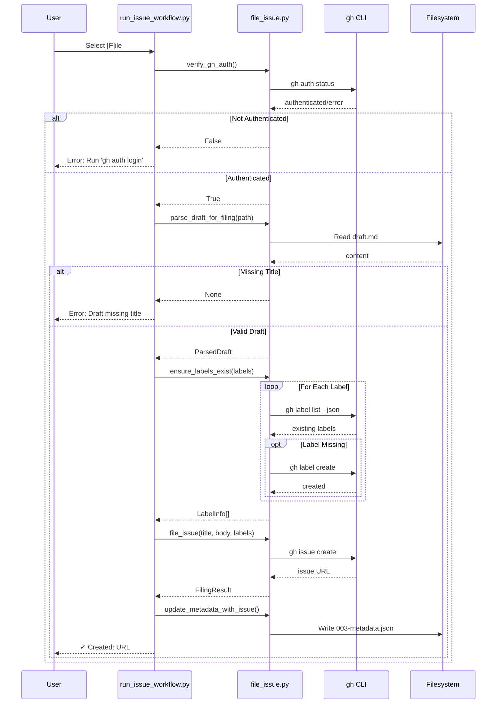

# 1084 - Feature: Add [F]ile Option to Issue Workflow Exit

<!-- Template Metadata
Last Updated: 2025-01-15
Updated By: Claude Agent
Update Reason: Initial LLD creation for Issue #84
-->

## 1. Context & Goal
* **Issue:** #84
* **Objective:** Add a `[F]ile` option to the issue workflow that automatically creates missing labels and files issues directly to GitHub
* **Status:** Draft
* **Related Issues:** None

### Open Questions
*Questions that need clarification before or during implementation. Remove when resolved.*

- [x] Should the workflow automatically move drafts to `done/` after filing? — **Answered: Out of scope per issue spec**
- [x] Should we support dry-run mode? — **Answered: Out of scope, future enhancement**

## 2. Proposed Changes

*This section is the **source of truth** for implementation. Describe exactly what will be built.*

### 2.1 Files Changed

| File | Change Type | Description |
|------|-------------|-------------|
| `agentos/workflows/issue/run_issue_workflow.py` | Modify | Add `[F]ile` option to exit menu, integrate filing logic |
| `agentos/workflows/issue/file_issue.py` | Add | New module with draft parsing, label management, and issue filing functions |
| `agentos/workflows/issue/label_colors.py` | Add | New module with label category to color mapping |

### 2.1.1 Path Validation (Mechanical - Auto-Checked)

*Issue #277: Before human or Gemini review, paths are verified programmatically.*

Mechanical validation automatically checks:
- All "Modify" files must exist in repository
- All "Delete" files must exist in repository
- All "Add" files must have existing parent directories
- No placeholder prefixes (`src/`, `lib/`, `app/`) unless directory exists

**If validation fails, the LLD is BLOCKED before reaching review.**

### 2.2 Dependencies

*New packages, APIs, or services required.*

```toml
# pyproject.toml additions (if any)
# None - uses only standard library and existing gh CLI
```

### 2.3 Data Structures

```python
# Pseudocode - NOT implementation
class ParsedDraft(TypedDict):
    title: str           # Extracted from first H1 line
    body: str            # Content between User Story and Labels sections
    labels: list[str]    # Labels parsed from backtick-delimited list

class LabelInfo(TypedDict):
    name: str            # Label name
    exists: bool         # Whether label exists in repo
    color: str           # Hex color code (without #)

class FilingResult(TypedDict):
    success: bool        # Whether filing succeeded
    issue_url: str | None  # GitHub issue URL if successful
    error: str | None    # Error message if failed
```

### 2.4 Function Signatures

```python
# file_issue.py - Signatures only

def verify_gh_auth() -> bool:
    """Check if gh CLI is authenticated. Returns True if authenticated."""
    ...

def parse_draft_for_filing(draft_path: Path) -> ParsedDraft | None:
    """
    Parse a draft markdown file for filing.
    
    Returns ParsedDraft with title, body, labels.
    Returns None if draft is malformed (missing title).
    """
    ...

def ensure_labels_exist(labels: list[str], repo: str | None = None) -> list[LabelInfo]:
    """
    Check and create missing labels with appropriate colors.
    
    Returns list of LabelInfo for each label processed.
    """
    ...

def file_issue(title: str, body: str, labels: list[str], repo: str | None = None) -> FilingResult:
    """
    File an issue to GitHub using gh CLI.
    
    Returns FilingResult with success status and URL or error.
    """
    ...

def update_metadata_with_issue(metadata_path: Path, issue_url: str) -> None:
    """Update 003-metadata.json with issue URL and filed_at timestamp."""
    ...

# label_colors.py - Signatures only

def get_label_color(label_name: str) -> str:
    """
    Get the hex color code for a label based on its category.
    
    Returns color without # prefix (e.g., '2ea44f').
    """
    ...
```

### 2.5 Logic Flow (Pseudocode)

```
FILE OPTION FLOW:
1. User selects [F]ile option
2. Verify gh CLI authentication
   IF not authenticated THEN
   - Display error: "gh CLI not authenticated. Run 'gh auth login' first."
   - Return to menu (user remains in workflow)
3. Parse draft for title, body, labels
   IF title missing (no H1) THEN
   - Display error: "Draft missing title (no H1 found)"
   - Return to menu
   IF labels unparseable THEN
   - Display warning: "Could not parse labels, filing without labels"
   - Set labels to empty list
4. FOR each label in labels:
   - Check if label exists via gh label list
   - IF not exists THEN
     - Get color from label_colors mapping
     - Create label via gh label create
     - Display: "Created label: {name}"
5. File issue via gh issue create
   IF filing fails THEN
   - Display error message
   - Return to menu
6. Display success: "✓ Created: {issue_url}"
7. Update 003-metadata.json with issue URL and timestamp
8. Exit workflow
```

### 2.6 Technical Approach

* **Module:** `agentos/workflows/issue/`
* **Pattern:** Fail-fast validation with graceful degradation for non-critical errors
* **Key Decisions:** 
  - Use subprocess.run() with list arguments to prevent shell injection
  - Parse labels with regex to handle various formatting edge cases
  - Map labels to colors based on keyword matching for flexibility

### 2.7 Architecture Decisions

*Document key architectural decisions that affect the design.*

| Decision | Options Considered | Choice | Rationale |
|----------|-------------------|--------|-----------|
| Subprocess invocation | `shell=True` string, `subprocess.run()` with list | List arguments | Prevents shell injection from draft content with special characters |
| Label color storage | Hardcoded dict, External JSON file, Database | Hardcoded dict | Simple, no external dependencies, easy to modify |
| Error handling | Exceptions, Result objects, Boolean returns | Mixed (exceptions for auth, results for filing) | Auth failure should halt immediately; filing issues can be displayed and recovered |
| Draft parsing | Regex, Markdown parser library, Line-by-line | Regex with line iteration | Good balance of robustness and simplicity; no new dependencies |

**Architectural Constraints:**
- Must use existing `gh` CLI - no direct GitHub API calls or new auth
- Must not modify draft content during filing process
- Must preserve existing metadata fields when updating

## 3. Requirements

*What must be true when this is done. These become acceptance criteria.*

1. `[F]ile` option appears in workflow exit menu alongside existing options
2. Draft parsing extracts title from first `# ` line, body from User Story through content before Labels section, and labels from backtick-delimited list
3. Missing labels are automatically created with category-appropriate colors before filing
4. Issue is filed via `gh issue create` and the resulting URL is displayed to user
5. `003-metadata.json` is updated with `github_issue_url` and `filed_at` timestamp
6. Unauthenticated `gh` CLI produces clear error message without crashing workflow
7. Missing title in draft produces clear error and keeps user in workflow
8. Malformed labels line produces warning and files issue without labels
9. All subprocess calls use list arguments (not `shell=True`) for security

## 4. Alternatives Considered

| Option | Pros | Cons | Decision |
|--------|------|------|----------|
| Use subprocess with list args | Secure against injection, standard pattern | Slightly more verbose | **Selected** |
| Use subprocess with shell=True | Simpler string construction | Vulnerable to shell injection from draft content | Rejected |
| Use PyGithub library | More Pythonic API, better error handling | New dependency, requires separate auth setup | Rejected |
| Parse with markdown library | More robust parsing | New dependency, overkill for simple extraction | Rejected |

**Rationale:** The selected approach maximizes security (subprocess safety) while minimizing dependencies (reuses gh CLI already in use). The draft format is simple enough that regex parsing is sufficient.

## 5. Data & Fixtures

*Per [0108-lld-pre-implementation-review.md](0108-lld-pre-implementation-review.md) - complete this section BEFORE implementation.*

### 5.1 Data Sources

| Attribute | Value |
|-----------|-------|
| Source | Local filesystem (draft markdown files), GitHub API (via gh CLI) |
| Format | Markdown (draft), JSON (gh CLI responses, metadata) |
| Size | Small - individual draft files typically < 10KB |
| Refresh | On-demand during workflow |
| Copyright/License | User-generated content, N/A |

### 5.2 Data Pipeline

```
Draft.md ──parse──► ParsedDraft ──file──► GitHub API ──response──► 003-metadata.json
```

### 5.3 Test Fixtures

| Fixture | Source | Notes |
|---------|--------|-------|
| Sample draft with all sections | Generated | Represents happy path |
| Draft missing H1 title | Generated | Tests error handling |
| Draft with malformed labels | Generated | Tests warning path |
| Draft with special characters in title | Generated | Tests shell injection safety |
| Mock gh CLI responses | Generated | Unit tests without network |

### 5.4 Deployment Pipeline

N/A - Local tool, no deployment pipeline. Code ships with the repository.

**If data source is external:** N/A - only uses authenticated gh CLI.

## 6. Diagram

### 6.1 Mermaid Quality Gate

Before finalizing any diagram, verify in [Mermaid Live Editor](https://mermaid.live) or GitHub preview:

- [x] **Simplicity:** Similar components collapsed (per 0006 §8.1)
- [x] **No touching:** All elements have visual separation (per 0006 §8.2)
- [x] **No hidden lines:** All arrows fully visible (per 0006 §8.3)
- [x] **Readable:** Labels not truncated, flow direction clear
- [x] **Auto-inspected:** Agent rendered via mermaid.ink and viewed (per 0006 §8.5)

**Agent Auto-Inspection (MANDATORY):**

AI agents MUST render and view the diagram before committing:
1. Base64 encode diagram → fetch PNG from `https://mermaid.ink/img/{base64}`
2. Read the PNG file (multimodal inspection)
3. Document results below

**Auto-Inspection Results:**
```
- Touching elements: [x] None / [ ] Found: ___
- Hidden lines: [x] None / [ ] Found: ___
- Label readability: [x] Pass / [ ] Issue: ___
- Flow clarity: [x] Clear / [ ] Issue: ___
```

*Reference: [0006-mermaid-diagrams.md](0006-mermaid-diagrams.md)*

### 6.2 Diagram



## 7. Security & Safety Considerations

*This section addresses security (10 patterns) and safety (9 patterns) concerns from governance feedback.*

### 7.1 Security

| Concern | Mitigation | Status |
|---------|------------|--------|
| Shell injection from draft content | All subprocess calls use `subprocess.run()` with list arguments, never `shell=True` | Addressed |
| Unauthorized GitHub access | Uses existing gh CLI authentication, no new credentials stored | Addressed |
| Draft content exposure | Draft content only transmitted to configured GitHub repo via authenticated gh CLI | Addressed |

### 7.2 Safety

*Safety concerns focus on preventing data loss, ensuring fail-safe behavior, and protecting system integrity.*

| Concern | Mitigation | Status |
|---------|------------|--------|
| Draft corruption during filing | Draft content is read-only during filing process | Addressed |
| Metadata corruption | Preserve all existing metadata fields when updating, use atomic write | Addressed |
| Accidental label deletion | Only creates labels, never deletes or modifies existing ones | Addressed |
| Filing duplicate issues | User must explicitly select [F]ile option; no automatic filing | Addressed |

**Fail Mode:** Fail Closed - Any error returns user to workflow menu without filing

**Recovery Strategy:** User can re-attempt filing, manually file via gh CLI, or exit workflow. Draft and metadata remain unchanged on failure.

## 8. Performance & Cost Considerations

*This section addresses performance and cost concerns (6 patterns) from governance feedback.*

### 8.1 Performance

| Metric | Budget | Approach |
|--------|--------|----------|
| Filing latency | < 5s typical | Single gh CLI call for filing; label operations parallelizable if needed |
| Memory | Negligible | Draft files small, no large data structures |
| API Calls | 1 + N labels | 1 auth check + N label checks + N label creates (worst case) + 1 issue create |

**Bottlenecks:** Network latency to GitHub API is the primary bottleneck; not addressable locally.

### 8.2 Cost Analysis

| Resource | Unit Cost | Estimated Usage | Monthly Cost |
|----------|-----------|-----------------|--------------|
| GitHub API calls | Free (via gh CLI) | ~10-50 calls/day | $0 |

**Cost Controls:**
- N/A - No paid resources used

**Worst-Case Scenario:** GitHub rate limiting if many issues filed rapidly; gh CLI handles rate limit errors gracefully.

## 9. Legal & Compliance

*This section addresses legal concerns (8 patterns) from governance feedback.*

| Concern | Applies? | Mitigation |
|---------|----------|------------|
| PII/Personal Data | No | Draft content is user-generated for their own repository |
| Third-Party Licenses | No | No new dependencies, gh CLI already in use |
| Terms of Service | Yes | GitHub API usage via gh CLI complies with GitHub ToS |
| Data Retention | N/A | No data retention beyond local filesystem |
| Export Controls | No | No restricted data or algorithms |

**Data Classification:** Internal (user's own issue drafts)

**Compliance Checklist:**
- [x] No PII stored without consent - N/A
- [x] All third-party licenses compatible with project license - No new dependencies
- [x] External API usage compliant with provider ToS - Uses gh CLI standard patterns
- [x] Data retention policy documented - Local files only

## 10. Verification & Testing

*Ref: [0005-testing-strategy-and-protocols.md](0005-testing-strategy-and-protocols.md)*

**Testing Philosophy:** Strive for 100% automated test coverage. Manual tests are a last resort for scenarios that genuinely cannot be automated.

### 10.0 Test Plan (TDD - Complete Before Implementation)

**TDD Requirement:** Tests MUST be written and failing BEFORE implementation begins.

| Test ID | Test Description | Expected Behavior | Status |
|---------|------------------|-------------------|--------|
| T010 | test_parse_draft_happy_path | Extracts title, body, labels from valid draft | RED |
| T020 | test_parse_draft_missing_title | Returns None when H1 missing | RED |
| T030 | test_parse_draft_malformed_labels | Returns empty labels list, body extracted | RED |
| T040 | test_parse_draft_special_characters | Handles quotes, semicolons in title safely | RED |
| T050 | test_get_label_color_enhancement | Returns green (#2ea44f) for 'enhancement' | RED |
| T060 | test_get_label_color_bug | Returns red (#d73a4a) for 'bug' | RED |
| T070 | test_get_label_color_unknown | Returns gray (#ededed) for unknown labels | RED |
| T080 | test_verify_gh_auth_success | Returns True when gh auth status succeeds | RED |
| T090 | test_verify_gh_auth_failure | Returns False when gh auth status fails | RED |
| T100 | test_file_issue_subprocess_uses_list | Verifies subprocess.run called with list args | RED |
| T110 | test_update_metadata_preserves_fields | Existing metadata fields not overwritten | RED |

**Coverage Target:** ≥95% for all new code

**TDD Checklist:**
- [ ] All tests written before implementation
- [ ] Tests currently RED (failing)
- [ ] Test IDs match scenario IDs in 10.1
- [ ] Test file created at: `tests/unit/test_file_issue.py`

### 10.1 Test Scenarios

| ID | Scenario | Type | Input | Expected Output | Pass Criteria |
|----|----------|------|-------|-----------------|---------------|
| 010 | Parse valid draft | Auto | Draft with H1, User Story, Labels | ParsedDraft with all fields | All fields populated correctly |
| 020 | Parse draft missing H1 | Auto | Draft without `# ` line | None | Returns None, not exception |
| 030 | Parse draft malformed labels | Auto | Draft with `## Labels: broken` | ParsedDraft with empty labels | Warning logged, body extracted |
| 040 | Parse draft with shell chars | Auto | Draft with `; rm -rf /` in title | ParsedDraft with literal title | No shell interpretation |
| 050 | Label color - enhancement | Auto | "enhancement" | "2ea44f" | Green color returned |
| 060 | Label color - bug | Auto | "bug" | "d73a4a" | Red color returned |
| 070 | Label color - unknown | Auto | "random-label" | "ededed" | Gray default returned |
| 080 | Auth check - authenticated | Auto | Mock gh success | True | Returns True |
| 090 | Auth check - unauthenticated | Auto | Mock gh failure | False | Returns False |
| 100 | File issue subprocess safety | Auto | Mock subprocess | List args used | subprocess.run called with list |
| 110 | Metadata update preserves | Auto | Existing metadata + new URL | All fields present | Original fields unchanged |
| 120 | End-to-end happy path | Auto-Live | Valid draft, gh authenticated | Issue URL returned | Issue created on GitHub |
| 130 | End-to-end missing labels | Auto-Live | Draft with new label names | Labels created, issue filed | Labels exist after filing |

### 10.2 Test Commands

```bash
# Run all automated tests
poetry run pytest tests/unit/test_file_issue.py -v

# Run only fast/mocked tests (exclude live)
poetry run pytest tests/unit/test_file_issue.py -v -m "not live"

# Run live integration tests (requires gh auth)
poetry run pytest tests/unit/test_file_issue.py -v -m live
```

### 10.3 Manual Tests (Only If Unavoidable)

**N/A - All scenarios automated.**

The live tests (marked with `@pytest.mark.live`) cover end-to-end scenarios. They hit real GitHub but are still automated.

## 11. Risks & Mitigations

| Risk | Impact | Likelihood | Mitigation |
|------|--------|------------|------------|
| gh CLI not installed | Med | Low | Clear error message directing user to install |
| GitHub rate limiting | Low | Low | gh CLI handles rate limits; user can retry |
| Draft format changes | Med | Med | Document expected format; flexible regex patterns |
| Network failure during filing | Med | Low | Clear error; user remains in workflow to retry |
| Label color mapping incomplete | Low | Med | Default to gray for unknown labels |

## 12. Definition of Done

### Code
- [ ] Implementation complete in `file_issue.py` and `label_colors.py`
- [ ] `run_issue_workflow.py` updated with `[F]ile` option
- [ ] Code comments reference this LLD (#84)

### Tests
- [ ] All test scenarios pass (T010-T130)
- [ ] Test coverage ≥95% for new modules

### Documentation
- [ ] LLD updated with any deviations
- [ ] Implementation Report (0103) completed
- [ ] Test Report (0113) completed if applicable
- [ ] Workflow documentation updated with `[F]ile` option
- [ ] New files added to `docs/0003-file-inventory.md`

### Review
- [ ] Code review completed
- [ ] 0809 Security Audit - PASS
- [ ] 0817 Wiki Alignment Audit - PASS
- [ ] User approval before closing issue

### 12.1 Traceability (Mechanical - Auto-Checked)

*Issue #277: Cross-references are verified programmatically.*

Mechanical validation automatically checks:
- Every file mentioned in this section must appear in Section 2.1
- Every risk mitigation in Section 11 should have a corresponding function in Section 2.4 (warning if not)

**If files are missing from Section 2.1, the LLD is BLOCKED.**

---

## Appendix: Review Log

*Track all review feedback with timestamps and implementation status.*

<!-- Note: Timestamps are auto-generated by the workflow. Do not fill in manually. -->

### Review Summary

<!-- Note: This table is auto-populated by the workflow with actual review dates. -->

| Review | Date | Verdict | Key Issue |
|--------|------|---------|-----------|
| - | - | - | - |

**Final Status:** PENDING
<!-- Note: This field is auto-updated to APPROVED by the workflow when finalized -->