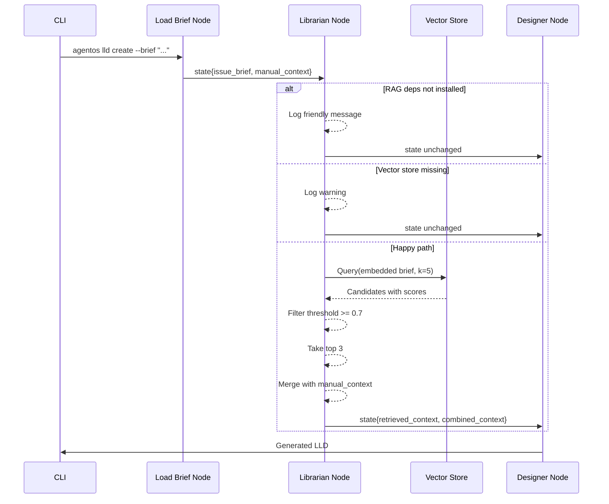
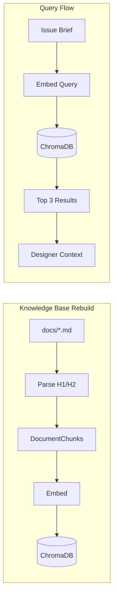

# 188 - Feature: RAG Injection: Automated Context Retrieval ("The Librarian")

<!-- Template Metadata
Last Updated: 2026-02-02
Updated By: Issue #117 fix
Update Reason: Moved Verification & Testing to Section 10 (was Section 11) to match 0702c review prompt and testing workflow expectations
Previous: Added sections based on 80 blocking issues from 164 governance verdicts (2026-02-01)
-->

## 1. Context & Goal
* **Issue:** #88
* **Objective:** Implement an automated RAG node that queries a local vector store with the issue brief and injects the top-3 most relevant governance documents into the Designer's context.
* **Status:** Draft
* **Related Issues:** None - standalone enhancement

### Open Questions
*Questions that need clarification before or during implementation. Remove when resolved.*

- [ ] Should the 0.7 similarity threshold be configurable via environment variable or CLI flag?
- [ ] Should we log retrieved documents to a file for audit purposes, or only to console at INFO level?
- [ ] What is the acceptable cold-boot latency budget (500ms mentioned but only for warm queries)?

## 2. Proposed Changes

*This section is the **source of truth** for implementation. Describe exactly what will be built.*

### 2.1 Files Changed

| File | Change Type | Description |
|------|-------------|-------------|
| `tools/rebuild_knowledge_base.py` | Add | CLI tool to ingest docs into vector store |
| `agentos/nodes/librarian.py` | Add | RAG retrieval node with conditional imports |
| `agentos/workflows/lld/graph.py` | Modify | Wire Librarian node between Load Brief and Designer |
| `agentos/workflows/lld/state.py` | Modify | Add `retrieved_context` field to State schema |
| `pyproject.toml` | Modify | Add optional `[rag]` dependencies |
| `.gitignore` | Modify | Add `.agentos/vector_store/` |
| `docs/adrs/0301-rag-librarian.md` | Add | Document architectural decision including license compliance |
| `tests/unit/test_librarian.py` | Add | Unit tests for Librarian node |
| `tests/integration/test_librarian_workflow.py` | Add | Integration tests for RAG in LLD workflow |

### 2.1.1 Path Validation (Mechanical - Auto-Checked)

*Issue #277: Before human or Gemini review, paths are verified programmatically.*

Mechanical validation automatically checks:
- All "Modify" files must exist in repository
- All "Delete" files must exist in repository
- All "Add" files must have existing parent directories
- No placeholder prefixes (`src/`, `lib/`, `app/`) unless directory exists

**If validation fails, the LLD is BLOCKED before reaching review.**

### 2.2 Dependencies

*New packages, APIs, or services required.*

```toml
# pyproject.toml additions - OPTIONAL dependencies under [rag] extra
[project.optional-dependencies]
rag = [
    "chromadb>=0.4.0,<0.6.0",
    "sentence-transformers>=2.2.0,<3.0.0",
]
```

**License Compliance:**
| Package | License | Compatible |
|---------|---------|------------|
| chromadb | Apache 2.0 | ✅ Yes |
| sentence-transformers | Apache 2.0 | ✅ Yes |
| torch (transitive) | BSD-3-Clause | ✅ Yes |
| huggingface-hub (transitive) | Apache 2.0 | ✅ Yes |
| all-MiniLM-L6-v2 model | Apache 2.0 | ✅ Yes |

### 2.3 Data Structures

```python
# Pseudocode - NOT implementation
class RetrievedDocument(TypedDict):
    file_path: str       # e.g., "docs/adrs/0204-single-identity.md"
    section: str         # e.g., "## Decision"
    content_snippet: str # First 500 chars of section
    score: float         # Similarity score 0.0-1.0

class LLDState(TypedDict):
    # Existing fields...
    issue_brief: str
    manual_context: list[str]
    # New field
    retrieved_context: list[RetrievedDocument]
    combined_context: str  # Merged context for Designer
```

```python
# Vector store document schema
class DocumentChunk(TypedDict):
    id: str              # Hash of file_path + section
    content: str         # Section content
    metadata: dict       # {file_path, section_title, last_modified}
```

### 2.4 Function Signatures

```python
# agentos/nodes/librarian.py

def check_rag_available() -> tuple[bool, str]:
    """Check if RAG dependencies are installed.
    
    Returns:
        Tuple of (available: bool, message: str)
    """
    ...

def load_embedding_model() -> "SentenceTransformer":
    """Load the embedding model with CLI spinner on cold boot.
    
    Returns:
        Loaded SentenceTransformer model
    
    Raises:
        ImportError: If sentence-transformers not installed
    """
    ...

def get_vector_store(path: str = ".agentos/vector_store/") -> "chromadb.Collection":
    """Get or create the ChromaDB collection.
    
    Args:
        path: Path to vector store directory
        
    Returns:
        ChromaDB collection instance
        
    Raises:
        FileNotFoundError: If vector store not initialized
    """
    ...

def query_knowledge_base(
    query: str,
    k: int = 5,
    threshold: float = 0.7,
    top_n: int = 3
) -> list[RetrievedDocument]:
    """Query the vector store for relevant documents.
    
    Args:
        query: The issue brief or search query
        k: Number of candidates to retrieve
        threshold: Minimum similarity score
        top_n: Maximum results to return after filtering
        
    Returns:
        List of RetrievedDocument sorted by score descending
    """
    ...

def merge_context(
    manual_context: list[str],
    rag_context: list[RetrievedDocument]
) -> str:
    """Merge manual and RAG context, manual takes precedence.
    
    Args:
        manual_context: User-provided context file paths
        rag_context: RAG-retrieved documents
        
    Returns:
        Combined context string for Designer
    """
    ...

def librarian_node(state: LLDState) -> dict:
    """LangGraph node that performs RAG retrieval.
    
    Args:
        state: Current workflow state with issue_brief
        
    Returns:
        State update with retrieved_context and combined_context
    """
    ...
```

```python
# tools/rebuild_knowledge_base.py

def parse_markdown_sections(file_path: Path) -> list[DocumentChunk]:
    """Split markdown file by H1/H2 headers.
    
    Args:
        file_path: Path to markdown file
        
    Returns:
        List of DocumentChunk for each section
    """
    ...

def get_files_to_index(docs_dirs: list[Path]) -> list[Path]:
    """Get all markdown files from documentation directories.
    
    Args:
        docs_dirs: List of directories to scan
        
    Returns:
        List of markdown file paths
    """
    ...

def index_documents(
    files: list[Path],
    collection: "chromadb.Collection",
    model: "SentenceTransformer",
    incremental: bool = False
) -> dict:
    """Index documents into vector store.
    
    Args:
        files: Files to index
        collection: ChromaDB collection
        model: Embedding model
        incremental: If True, only reindex changed files
        
    Returns:
        Summary dict with files_indexed, chunks_created, time_elapsed
    """
    ...

def main(mode: str = "full") -> None:
    """CLI entrypoint for knowledge base rebuilding.
    
    Args:
        mode: "full" or "incremental"
    """
    ...
```

### 2.5 Logic Flow (Pseudocode)

**Librarian Node Execution:**
```
1. Receive state with issue_brief
2. Check RAG dependencies available
   IF not available THEN
     - Log friendly message about pip install agentos[rag]
     - Return state unchanged (graceful degradation)
3. Check vector store exists at .agentos/vector_store/
   IF not exists THEN
     - Log warning about running rebuild_knowledge_base.py
     - Return state unchanged (graceful degradation)
4. Load embedding model (show spinner if > 500ms)
5. Embed issue_brief query
6. Query vector store for k=5 candidates
7. Filter results by threshold >= 0.7
8. Take top 3 results
9. Log retrieved documents at INFO level
10. Merge with manual_context (manual wins on duplicates)
11. Return state update with retrieved_context and combined_context
```

**Knowledge Base Rebuilding:**
```
1. Parse CLI arguments (--full or --incremental)
2. Check RAG dependencies available
   IF not available THEN
     - Print error and exit
3. Scan docs/adrs/, docs/standards/, docs/LLDs/done/
4. FOR each markdown file:
   a. Split by H1/H2 headers
   b. Create DocumentChunk for each section
   c. IF incremental AND file unchanged THEN skip
5. Initialize/get ChromaDB collection
6. Load embedding model
7. Embed all chunks
8. Upsert into vector store
9. Print summary: files indexed, chunks created, time elapsed
```

### 2.6 Technical Approach

* **Module:** `agentos/nodes/librarian.py`
* **Pattern:** Graceful Degradation with Optional Dependencies
* **Key Decisions:**
  - ChromaDB chosen for zero-config local persistence (file-based SQLite)
  - `all-MiniLM-L6-v2` chosen for balance of quality vs. size (~80MB, 384 dims)
  - Conditional imports prevent core package bloat
  - H1/H2 splitting provides granular retrieval without over-fragmentation

### 2.7 Architecture Decisions

*Document key architectural decisions that affect the design.*

| Decision | Options Considered | Choice | Rationale |
|----------|-------------------|--------|-----------|
| Vector Store | ChromaDB, FAISS+pickle, Qdrant | ChromaDB | Zero-config persistence, built-in HNSW, Python-native |
| Embedding Model | all-MiniLM-L6-v2, OpenAI ada-002, all-mpnet-base-v2 | all-MiniLM-L6-v2 | Best size/quality tradeoff, fully local, Apache 2.0 |
| Document Chunking | Fixed-size, sentence-based, header-based | Header-based (H1/H2) | Preserves semantic sections, metadata-friendly |
| Dependency Strategy | Required, Optional, Plugin | Optional (`[rag]` extra) | Core stays lightweight, users opt-in |
| Similarity Threshold | 0.5, 0.6, 0.7, 0.8 | 0.7 | Empirically balanced precision/recall for governance docs |

**Architectural Constraints:**
- Must not add ML dependencies to core installation
- Must gracefully degrade when dependencies or vector store missing
- Must complete queries in < 500ms after warm-up
- Must not send data externally in default mode

## 3. Requirements

*What must be true when this is done. These become acceptance criteria.*

1. Core `pip install agentos` remains lightweight (no torch/chromadb)
2. `pip install agentos[rag]` installs all RAG dependencies cleanly
3. Vector store persists in `.agentos/vector_store/` between sessions
4. `tools/rebuild_knowledge_base.py` indexes ~100 files in < 10 seconds
5. Query "How do I log errors?" retrieves logging-related documents
6. Librarian node completes in < 500ms after model warm-up
7. Workflow continues without error when vector store missing
8. Workflow continues without error when RAG deps not installed
9. Manual `--context` takes precedence over RAG results
10. Retrieved documents logged at INFO level for transparency
11. CLI spinner displays during cold-boot model loading

## 4. Alternatives Considered

| Option | Pros | Cons | Decision |
|--------|------|------|----------|
| ChromaDB | Zero-config, persistent, HNSW built-in | Heavier than pickle | **Selected** |
| FAISS + pickle | Lighter weight, fast | Manual persistence, no metadata filtering | Rejected |
| Required dependencies | Simpler code paths | Bloats core install | Rejected |
| External embedding API | Higher quality | Data leaves machine, costs money | Rejected for default |
| Fixed-size chunking | Simple implementation | Loses section semantics | Rejected |

**Rationale:** ChromaDB provides the best balance of simplicity, persistence, and features without requiring external services. Optional dependencies via `[rag]` extra keep the core package lightweight for users who don't need RAG.

## 5. Data & Fixtures

*Per [0108-lld-pre-implementation-review.md](0108-lld-pre-implementation-review.md) - complete this section BEFORE implementation.*

### 5.1 Data Sources

| Attribute | Value |
|-----------|-------|
| Source | Local filesystem: `docs/adrs/`, `docs/standards/`, `docs/LLDs/done/` |
| Format | Markdown files (.md) |
| Size | ~100 files, ~500KB total |
| Refresh | Manual via `tools/rebuild_knowledge_base.py` |
| Copyright/License | Internal documentation, no external licensing concerns |

### 5.2 Data Pipeline

```
docs/*.md ──parse_sections──► DocumentChunks ──embed──► Vectors ──upsert──► ChromaDB
```

### 5.3 Test Fixtures

| Fixture | Source | Notes |
|---------|--------|-------|
| `tests/fixtures/sample_adr.md` | Generated | Sample ADR with known content for retrieval testing |
| `tests/fixtures/sample_standard.md` | Generated | Sample standard doc |
| `tests/fixtures/mock_vector_store/` | Generated | Pre-built ChromaDB with test data |

### 5.4 Deployment Pipeline

- **Dev:** Developers run `tools/rebuild_knowledge_base.py` locally
- **Test:** CI rebuilds knowledge base as part of integration tests
- **Production:** N/A - this is a local development tool

**If data source is external:** N/A - all data is local documentation.

## 6. Diagram

### 6.1 Mermaid Quality Gate

Before finalizing any diagram, verify in [Mermaid Live Editor](https://mermaid.live) or GitHub preview:

- [x] **Simplicity:** Similar components collapsed (per 0006 §8.1)
- [x] **No touching:** All elements have visual separation (per 0006 §8.2)
- [x] **No hidden lines:** All arrows fully visible (per 0006 §8.3)
- [x] **Readable:** Labels not truncated, flow direction clear
- [ ] **Auto-inspected:** Agent rendered via mermaid.ink and viewed (per 0006 §8.5)

**Agent Auto-Inspection (MANDATORY):**

AI agents MUST render and view the diagram before committing:
1. Base64 encode diagram → fetch PNG from `https://mermaid.ink/img/{base64}`
2. Read the PNG file (multimodal inspection)
3. Document results below

**Auto-Inspection Results:**
```
- Touching elements: [ ] None / [ ] Found: ___
- Hidden lines: [ ] None / [ ] Found: ___
- Label readability: [ ] Pass / [ ] Issue: ___
- Flow clarity: [ ] Clear / [ ] Issue: ___
```

*Reference: [0006-mermaid-diagrams.md](0006-mermaid-diagrams.md)*

### 6.2 Diagram





## 7. Security & Safety Considerations

*This section addresses security (10 patterns) and safety (9 patterns) concerns from governance feedback.*

### 7.1 Security

| Concern | Mitigation | Status |
|---------|------------|--------|
| Data exfiltration via embeddings | Default mode uses local model - no external calls | Addressed |
| External API data exposure | Document that OpenAI/Gemini mode sends text externally; require explicit opt-in | Addressed |
| Vector store tampering | Store in .agentos/ which is user-controlled; gitignored | Addressed |
| Query injection | Queries are embedded, not executed; no code execution risk | Addressed |

### 7.2 Safety

| Concern | Mitigation | Status |
|---------|------------|--------|
| Missing RAG deps crashes workflow | Conditional imports with graceful degradation | Addressed |
| Missing vector store crashes workflow | Check existence, log warning, continue | Addressed |
| Corrupt vector store | ChromaDB handles integrity; rebuild tool available | Addressed |
| Model loading timeout | CLI spinner provides feedback; no hard timeout | Addressed |

**Fail Mode:** Fail Open - workflow continues without RAG augmentation if any component unavailable.

**Recovery Strategy:** Run `tools/rebuild_knowledge_base.py --full` to rebuild from scratch.

## 8. Performance & Cost Considerations

*This section addresses performance and cost concerns (6 patterns) from governance feedback.*

### 8.1 Performance

| Metric | Budget | Approach |
|--------|--------|----------|
| Query latency (warm) | < 500ms | HNSW index, small embedding model |
| Model cold boot | < 5s typical | One-time load, show spinner |
| Full reindex time | < 10s for 100 files | Batch embedding, parallel I/O |
| Memory (model loaded) | ~200MB | all-MiniLM-L6-v2 is compact |

**Bottlenecks:** 
- Cold boot model loading is unavoidable first-time cost
- Large document sets may exceed 10s reindex target

### 8.2 Cost Analysis

| Resource | Unit Cost | Estimated Usage | Monthly Cost |
|----------|-----------|-----------------|--------------|
| Local compute | $0 | All local | $0 |
| Storage (.agentos/) | ~10MB | Vector store | $0 |
| External API (optional) | $0.0001/1K tokens | 0 by default | $0 |

**Cost Controls:**
- [x] Default mode is completely free (local only)
- [x] External API requires explicit opt-in via env vars
- [x] No background processes or continuous costs

**Worst-Case Scenario:** User with 10,000 docs would need ~100MB storage and ~60s reindex time. Acceptable for local tool.

## 9. Legal & Compliance

*This section addresses legal concerns (8 patterns) from governance feedback.*

| Concern | Applies? | Mitigation |
|---------|----------|------------|
| PII/Personal Data | No | Only indexes internal documentation |
| Third-Party Licenses | Yes | All deps are Apache 2.0/BSD-3 compatible |
| Terms of Service | N/A | No external services in default mode |
| Data Retention | N/A | Local cache only, user-controlled |
| Export Controls | No | Standard ML model, no restrictions |

**Data Classification:** Internal - only processes project documentation

**Compliance Checklist:**
- [x] No PII stored without consent (no PII in scope)
- [x] All third-party licenses compatible with project license
- [x] External API usage compliant with provider ToS (N/A by default)
- [x] Data retention policy documented (local cache, user-deletable)

## 10. Verification & Testing

*Ref: [0005-testing-strategy-and-protocols.md](0005-testing-strategy-and-protocols.md)*

**Testing Philosophy:** Strive for 100% automated test coverage. Manual tests are a last resort for scenarios that genuinely cannot be automated.

### 10.0 Test Plan (TDD - Complete Before Implementation)

**TDD Requirement:** Tests MUST be written and failing BEFORE implementation begins.

| Test ID | Test Description | Expected Behavior | Status |
|---------|------------------|-------------------|--------|
| T010 | test_check_rag_available_with_deps | Returns (True, "") when deps installed | RED |
| T020 | test_check_rag_available_without_deps | Returns (False, helpful message) | RED |
| T030 | test_query_empty_results | Returns empty list when no matches | RED |
| T040 | test_query_threshold_filtering | Filters results below 0.7 | RED |
| T050 | test_query_top_n_limiting | Returns max 3 results | RED |
| T060 | test_merge_context_manual_precedence | Manual context listed first | RED |
| T070 | test_merge_context_deduplication | Removes duplicate paths | RED |
| T080 | test_librarian_node_graceful_no_deps | Returns unchanged state | RED |
| T090 | test_librarian_node_graceful_no_store | Returns unchanged state | RED |
| T100 | test_rebuild_full_mode | Indexes all files | RED |
| T110 | test_rebuild_incremental_skip_unchanged | Skips unmodified files | RED |
| T120 | test_parse_markdown_sections | Splits on H1/H2 correctly | RED |

**Coverage Target:** ≥95% for all new code

**TDD Checklist:**
- [ ] All tests written before implementation
- [ ] Tests currently RED (failing)
- [ ] Test IDs match scenario IDs in 10.1
- [ ] Test file created at: `tests/unit/test_librarian.py`

### 10.1 Test Scenarios

| ID | Scenario | Type | Input | Expected Output | Pass Criteria |
|----|----------|------|-------|-----------------|---------------|
| 010 | Happy path query | Auto | Brief: "error logging" | 3 logging-related docs | Score >= 0.7 for all |
| 020 | No matches above threshold | Auto | Brief: "Klingon localization" | Empty list | Log message present |
| 030 | Threshold filtering | Auto | Brief with mixed scores | Only docs >= 0.7 | Filtered correctly |
| 040 | Manual context merge | Auto | Manual + RAG results | Manual first, no dupes | Order verified |
| 050 | Graceful - no deps | Auto | Mock missing imports | Warning logged, continues | No exception |
| 060 | Graceful - no store | Auto | Missing .agentos/vector_store | Warning logged, continues | No exception |
| 070 | Full reindex | Auto-Live | 100 test files | All indexed < 10s | Time measured |
| 080 | Incremental reindex | Auto | 1 changed, 99 unchanged | Only 1 reindexed | Chunk count correct |
| 090 | CLI spinner display | Auto | Cold boot scenario | Spinner shown | Output captured |
| 100 | Core install lightweight | Auto | Fresh venv, core only | No torch/chromadb | pip list verified |
| 110 | RAG extra installs | Auto-Live | Fresh venv, [rag] extra | Imports succeed | No errors |
| 120 | Section parsing | Auto | Sample markdown | Correct chunk count | Sections match |

### 10.2 Test Commands

```bash
# Run all automated tests
poetry run pytest tests/unit/test_librarian.py -v

# Run only fast/mocked tests (exclude live)
poetry run pytest tests/unit/test_librarian.py -v -m "not live"

# Run live integration tests (requires [rag] extra)
poetry run pytest tests/integration/test_librarian_workflow.py -v -m live

# Test core install isolation
python -m venv /tmp/test_core && \
  /tmp/test_core/bin/pip install -e . && \
  /tmp/test_core/bin/pip list | grep -E "(torch|chromadb)" && \
  echo "FAIL" || echo "PASS: Core is lightweight"
```

### 10.3 Manual Tests (Only If Unavoidable)

**N/A - All scenarios automated.**

## 11. Risks & Mitigations

| Risk | Impact | Likelihood | Mitigation |
|------|--------|------------|------------|
| ChromaDB/pydantic version conflicts | Med | Med | Pin versions, document conflicts in README |
| Model download fails (air-gapped) | Med | Low | Document pre-download option |
| Reindex time exceeds 10s budget | Low | Low | Optimize batch size, parallelize I/O |
| RAG retrieves irrelevant docs | Med | Med | Threshold filtering, user can verify logs |
| Cold boot latency frustrates users | Low | Med | CLI spinner provides feedback |

## 12. Definition of Done

### Code
- [ ] Implementation complete and linted
- [ ] Code comments reference this LLD
- [ ] Conditional imports implemented correctly

### Tests
- [ ] All test scenarios pass
- [ ] Test coverage ≥ 95% for new code
- [ ] CI passes on Linux/Mac/Windows

### Documentation
- [ ] LLD updated with any deviations
- [ ] Implementation Report (0103) completed
- [ ] ADR `docs/adrs/0301-rag-librarian.md` created with license findings
- [ ] README updated with RAG setup instructions
- [ ] Files added to `docs/0003-file-inventory.md`

### Review
- [ ] Code review completed
- [ ] User approval before closing issue
- [ ] 0809 Security Audit - PASS
- [ ] 0817 Wiki Alignment Audit - PASS

### Reports
- [ ] `docs/reports/88/implementation-report.md` created
- [ ] `docs/reports/88/test-report.md` created

### 12.1 Traceability (Mechanical - Auto-Checked)

*Issue #277: Cross-references are verified programmatically.*

Mechanical validation automatically checks:
- Every file mentioned in this section must appear in Section 2.1
- Every risk mitigation in Section 11 should have a corresponding function in Section 2.4 (warning if not)

**If files are missing from Section 2.1, the LLD is BLOCKED.**

---

## Appendix: Review Log

*Track all review feedback with timestamps and implementation status.*

<!-- Note: Timestamps are auto-generated by the workflow. Do not fill in manually. -->

### Review Summary

| Review | Date | Verdict | Key Issue |
|--------|------|---------|-----------|
| - | - | - | - |

**Final Status:** PENDING
<!-- Note: This field is auto-updated to APPROVED by the workflow when finalized -->