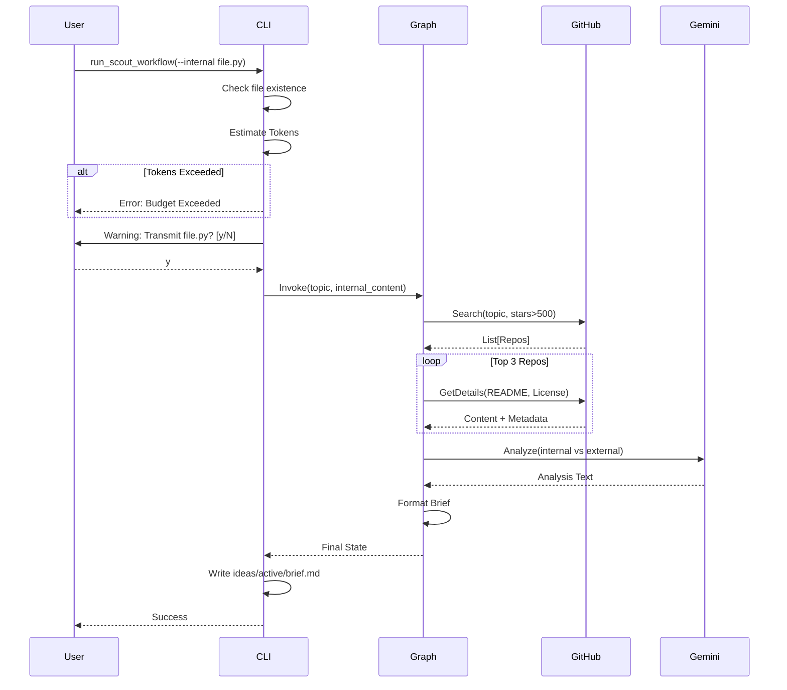

# 193 - Feature: The Scout: External Intelligence Gathering Workflow

## 1. Context & Goal
* **Issue:** #93
* **Objective:** Create a proactive research workflow that searches GitHub/Web for solutions to a given problem, compares them against internal code, and produces an "Innovation Brief" with recommendations.
* **Status:** Draft
* **Related Issues:** None.

### Open Questions
None - requirements are well-defined from issue.

## 2. Proposed Changes

### 2.1 Files Changed
| File Path | Description |
|-----------|-------------|
| `agentos/workflows/scout/__init__.py` | Package initialization. |
| `agentos/workflows/scout/graph.py` | LangGraph state machine definition connecting the 4 nodes. |
| `agentos/workflows/scout/nodes.py` | Implementation of Explorer, Extractor, Gap Analyst, and Scribe nodes. |
| `agentos/workflows/scout/prompts.py` | LLM system prompts for Gap Analysis and Content Extraction. |
| `agentos/workflows/scout/templates.py` | Markdown templates for the Innovation Brief. |
| `agentos/workflows/scout/token_estimator.py` | Logic to count tokens using `tiktoken` and enforce budgets. |
| `tools/run_scout_workflow.py` | CLI entry point handling args, privacy warnings, and output. |
| `tests/workflows/scout/test_graph.py` | Integration tests for the graph execution. |
| `tests/workflows/scout/test_nodes.py` | Unit tests for individual node logic (mocking APIs). |
| `tests/workflows/scout/test_token_estimator.py` | Tests for accurate token counting and budget exceptions. |
| `tests/fixtures/golden-brief-summary.md` | Golden file for validating output structure/content. |
| `agentos/workflows/__init__.py` | Export Scout workflow. |
| `docs/0003-file-inventory.md` | Update inventory with new files. |

### 2.2 Dependencies
* **`PyGithub`**: For interacting with GitHub Search and Repository APIs.
* **`tiktoken`**: For estimating token usage before LLM calls.
* **`rich`**: For interactive CLI warnings and formatted output.
* **`tenacity`**: For retry logic/backoff on network requests.

### 2.3 Data Structures

```python
from typing import TypedDict, List, Optional, Literal

class RepositoryMetadata(TypedDict):
    name: str
    url: str
    stars: int
    description: str
    license: str
    readme_content: str
    architecture_content: Optional[str]

class ScoutState(TypedDict):
    # Input
    topic: str
    internal_file_path: Optional[str]
    internal_file_content: Optional[str]
    min_stars: int
    
    # Processing
    found_repos: List[RepositoryMetadata]
    analysis_result: str  # Raw LLM output comparing internal vs external
    
    # Output
    brief_content: str
    output_path: str
    
    # Errors
    error_message: Optional[str]

class InnovationBrief(TypedDict):
    topic: str
    external_standard: List[dict]
    internal_gap: dict
    recommendations: List[dict]
```

### 2.4 Function Signatures

**`tools/run_scout_workflow.py`**
```python
def main() -> None:
    """CLI Entry point. Parses args, runs pre-flight checks, executes graph."""
    pass

def confirm_transmission(file_path: str, force_yes: bool) -> bool:
    """
    Displays warning about sending internal code to LLM.
    Returns True if user accepts or force_yes is True.
    """
    pass
```

**`agentos/workflows/scout/token_estimator.py`**
```python
def check_token_budget(
    internal_content: str, 
    max_tokens: int, 
    model: str = "gemini-1.5-flash"
) -> None:
    """
    Estimates total prompt size including templates. 
    Raises ValueError if estimate > max_tokens.
    """
    pass
```

**`agentos/workflows/scout/nodes.py`**
```python
def node_explorer(state: ScoutState) -> ScoutState:
    """
    Searches GitHub API for repos > min_stars matching topic.
    Updates 'found_repos' with basic metadata.
    """
    pass

def node_extractor(state: ScoutState) -> ScoutState:
    """
    Fetches README, architecture docs, and license info for found_repos.
    Updates 'found_repos' with full content.
    """
    pass

def node_gap_analyst(state: ScoutState) -> ScoutState:
    """
    Invokes LLM to compare internal_file_content vs external repo patterns.
    Updates 'analysis_result'.
    """
    pass

def node_scribe(state: ScoutState) -> ScoutState:
    """
    Formats the analysis into the Innovation Brief Markdown structure.
    Updates 'brief_content'.
    """
    pass
```

### 2.5 Logic Flow (Pseudocode)

**CLI Runner (`tools/run_scout_workflow.py`)**
```python
def main():
    args = parse_args()
    
    # 1. Load Internal File (if present)
    internal_content = ""
    if args.internal:
        if not os.path.exists(args.internal):
            print_error(f"File {args.internal} not found")
            return
        internal_content = read_file(args.internal)

        # 2. Token Budget Check
        try:
            check_token_budget(internal_content, args.max_tokens)
        except ValueError as e:
            print_error(str(e))
            return

        # 3. Privacy Warning
        if not confirm_transmission(args.internal, args.yes):
            print("Aborted by user.")
            return

    # 4. Initialize Graph State
    initial_state = {
        "topic": args.topic,
        "internal_file_path": args.internal,
        "internal_file_content": internal_content,
        "min_stars": args.min_stars,
        "found_repos": []
    }

    if args.dry_run:
        print_dry_run_info(initial_state)
        return

    # 5. Run Graph
    final_state = scout_graph.invoke(initial_state)

    # 6. Output
    if args.format == "json":
        print(json.dumps(parse_brief_to_json(final_state["brief_content"])))
    else:
        save_file(final_state["output_path"], final_state["brief_content"])
        print(f"Brief saved to {final_state['output_path']}")
```

**Gap Analyst Node Logic**
```python
def node_gap_analyst(state):
    # Prepare context from top 3 repos
    external_context = ""
    for repo in state["found_repos"][:3]:
        external_context += f"Repo: {repo['name']} (License: {repo['license']})\n"
        external_context += f"Content: {repo['readme_content']}\n---\n"

    # Construct Prompt
    if state["internal_file_content"]:
        prompt = PROMPT_GAP_ANALYSIS.format(
            topic=state["topic"],
            internal_code=state["internal_file_content"],
            external_context=external_context
        )
    else:
        prompt = PROMPT_RESEARCH_ONLY.format(
            topic=state["topic"],
            external_context=external_context
        )

    # Call LLM
    response = gemini_client.generate(prompt)
    
    return {"analysis_result": response.text}
```

### 2.6 Technical Approach
*   **Orchestration:** Uses `LangGraph` for clear state transitions. This allows potential future expansion (e.g., adding a loop to refine search terms if no results found).
*   **API Strategy:** `PyGithub` is used for robustness over raw `requests`. We specifically query the `license` object in the GitHub API response to satisfy the metadata requirement without parsing `LICENSE` files manually.
*   **Budgeting:** `tiktoken` (using cl100k_base encoding) provides a close enough estimate for Gemini token usage to prevent massive overruns before the API call is made.
*   **Output:** The Scribe node uses a strict Jinja2-like string template to ensure the Markdown is valid and standardized.

## 3. Requirements
1.  **Search Capabilities:** Must find repositories on GitHub with >500 stars matching the topic.
2.  **License Extraction:** Must capture license type (e.g., MIT, Apache) for every analyzed external repo.
3.  **Privacy Control:** Must prompt user for confirmation before sending `--internal` file content to LLM, unless `--yes` is used.
4.  **Token Safety:** Must abort before network calls if estimated tokens > `--max-tokens`.
5.  **Output formatting:** Must support both Markdown file generation and JSON stdout output.
6.  **Error Handling:** Must handle GitHub rate limits with exponential backoff.

## 4. Alternatives Considered

| Alternative | Pros | Cons | Decision |
|-------------|------|------|----------|
| **Google Search API (SerpAPI)** | Broader context (blogs, docs). | Harder to extract pure code/architecture; often paid API. | **Rejected** - GitHub API provides structured code/license data for free/low cost. |
| **Clone Repositories Locally** | Full codebase access for analysis. | Slow; High disk usage; Security risks of running/storing untrusted code. | **Rejected** - API-based fetching of README/specific files is safer and faster. |
| **Hardcoded Rate Limits** | Simple to implement. | Doesn't account for dynamic API header limits. | **Rejected** - Use `PyGithub` + `tenacity` for adaptive backoff. |

## 5. Data & Fixtures

### 5.1 Data Sources
| Source | Type | Attributes Used |
|--------|------|-----------------|
| **GitHub API** | External | `full_name`, `stargazers_count`, `html_url`, `license.spdx_id`, `description`, `contents` |
| **Local File System** | Internal | Content of the file specified in `--internal` |

### 5.2 Data Pipeline
```ascii
[CLI User] -> [Token Estimator] -> (Check Pass?) -> [Privacy Check] -> (Confirmed?) 
                                                                          |
    +---------------------------------------------------------------------+
    v
[Scout Graph]
    |
    +-> [N0 Explorer] <--> (GitHub Search API)
            |
            v
    +-> [N1 Extractor] <--> (GitHub Content API)
            |
            v
    +-> [N2 Gap Analyst] <--> (Gemini LLM)
            |
            v
    +-> [N3 Scribe]
            |
            v
[Innovation Brief .md]
```

### 5.3 Test Fixtures
| Fixture | Description |
|---------|-------------|
| `mock_github_search_response.json` | Mocked JSON response for repo search results. |
| `mock_github_content_response.json` | Mocked JSON response for README/file fetching. |
| `golden-brief-summary.md` | Expected Markdown output for similarity testing. |

### 5.4 Deployment Pipeline
Development tool only. Requires `GITHUB_TOKEN` in user environment.

## 6. Diagram

### 6.1 Mermaid Quality Gate
- [x] Diagram type: Sequence
- [x] Participants defined: User, CLI, Graph, GitHub, LLM
- [x] Flows clearly shown: Yes

### 6.2 Diagram


## 7. Security Considerations

| Concern | Mitigation |
|---------|------------|
| **Proprietary Code Leakage** | Code is sent to LLM only. Interactive warning implemented. Data is transient in LLM session. |
| **API Key Exposure** | `GITHUB_TOKEN` read from env vars only. Never logged. |
| **External Content Safety** | Scout only reads/parses text. No execution of external code. |
| **Path Traversal** | Output directory restricted to `ideas/active/`. Internal file read restricted to project root. |

## 8. Performance Considerations

| Metric | Budget | Strategy |
|--------|--------|----------|
| **Execution Time** | < 45 seconds | Fetch external data in parallel (asyncio) if possible, or limit to top 3 repos. |
| **Token Usage** | < 30,000 tokens | Estimate before run. Truncate external READMEs if they exceed context window. |
| **API Rate Limits** | 5000/hr (Auth) | Use `tenacity` retry on 403/429 responses. |

## 9. Risks & Mitigations

| Risk | Impact | Likelihood | Mitigation |
|------|--------|------------|------------|
| **LLM Hallucination** | High (User trusts bad info) | Medium | Brief requires direct links to repos/files. Scribe prompt instructs to quote directly. |
| **No Results Found** | Medium (Tool useless) | Low | "Low Confidence" flag in output; Suggest broader search terms. |
| **API Changes** | Medium (Breakage) | Low | Pin `PyGithub` version. |

## 10. Verification & Testing

### 10.1 Test Scenarios
| ID | Scenario | Type | Input | Output | Criteria |
|----|----------|------|-------|--------|----------|
| T1 | Happy Path | Integ | Topic: "Task Queue", File: `scheduler.py` | `innovation-task-queue.md` | Contains "Repo:", "License:", and "Deficiency" sections. |
| T2 | No Internal File | Integ | Topic: "Patterns" | `innovation-patterns.md` | Contains research only, no gap analysis. |
| T3 | Token Exceeded | Unit | Large File, `--max-tokens 100` | Error Message | Exits before graph runs. |
| T4 | Privacy Decline | E2E | Internal File, Input: `n` | "Aborted" message | No network calls made. |
| T5 | JSON Format | E2E | `--format json` | stdout JSON | Valid JSON structure. |

### 10.2 Test Commands
```bash
# Unit Tests
pytest tests/workflows/scout/

# Manual Happy Path
python tools/run_scout_workflow.py --topic "python state persistence" --internal agentos/core/state.py --yes

# Manual Privacy Check
python tools/run_scout_workflow.py --topic "test" --internal agentos/core/state.py
# (Expect prompt)
```

### 10.3 Manual Tests
N/A - All scenarios automated.

## 11. Definition of Done

### Code
- [ ] Nodes (Explorer, Extractor, GapAnalyst, Scribe) implemented in `agentos/workflows/scout/nodes.py`.
- [ ] Graph defined in `agentos/workflows/scout/graph.py`.
- [ ] Token estimator implemented with `tiktoken`.
- [ ] CLI implemented with `argparse`, `rich` (warnings), and env var handling.
- [ ] License extraction logic verifies `license` field from GitHub API.

### Tests
- [ ] Unit tests for token estimator pass.
- [ ] Integration test using Mock GitHub API passes.
- [ ] Golden fixture comparison passes (cosine similarity > 90%).

### Documentation
- [ ] `docs/0003-file-inventory.md` updated.
- [ ] Wiki updated with "The Scout" workflow guide.
- [ ] Privacy implications of `--internal` flag documented in README.

### Review
- [ ] Security audit (API keys, data transmission) passed.
- [ ] PR reviewed by 1 Maintainer.

---

## Appendix: Review Log

### Review Summary

| Review | Date | Verdict | Key Issue |
|--------|------|---------|-----------|
| - | - | - | - |

**Final Status:** DRAFT - PENDING REVIEW