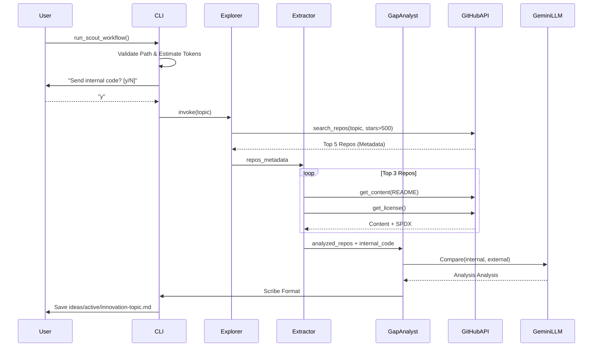

# 93 - Feature: The Scout: External Intelligence Gathering Workflow

## 1. Context & Goal
* **Issue:** #93
* **Objective:** Create a proactive research workflow that searches GitHub/Web for solutions to a given problem, analyzes top implementations, compares them against internal code, and produces an "Innovation Brief".
* **Status:** Draft
* **Related Issues:** None.

### Open Questions
None - requirements are well-defined from issue.

## 2. Proposed Changes

### 2.1 Files Changed
| File Path | Description |
|-----------|-------------|
| `agentos/workflows/scout/__init__.py` | Package initialization. |
| `agentos/workflows/scout/graph.py` | LangGraph state machine definition connecting Explorer, Extractor, GapAnalyst, Scribe. |
| `agentos/workflows/scout/nodes.py` | Implementation of graph nodes (API interaction, LLM calls). |
| `agentos/workflows/scout/prompts.py` | LLM prompts for gap analysis and summarization. |
| `agentos/workflows/scout/templates.py` | Jinja2 templates for Innovation Brief Markdown generation. |
| `agentos/workflows/scout/token_estimator.py` | Logic to count tokens and enforce budgets. |
| `tools/run_scout_workflow.py` | CLI entry point handling args, privacy warnings, path safety, and output. |
| `tests/workflows/scout/test_graph.py` | Integration tests for graph state transitions. |
| `tests/workflows/scout/test_nodes.py` | Unit tests for node logic with mocked APIs. |
| `tests/workflows/scout/test_token_estimator.py` | Unit tests for budget enforcement. |
| `tests/fixtures/golden-brief-summary.md` | Golden fixture for similarity testing. |
| `agentos/workflows/__init__.py` | Registration of the new workflow. |
| `docs/0003-file-inventory.md` | Updated file inventory. |

### 2.2 Dependencies
* **`PyGithub`**: For searching repositories and fetching content via GitHub API.
* **`tiktoken`**: For estimating token usage (using `cl100k_base` encoding) to enforce budgets.
* **`rich`**: For interactive CLI warnings, formatted output, and progress spinners.
* **`tenacity`**: For implementing exponential backoff on network requests.
* **`jinja2`**: For robust Markdown template rendering.

### 2.3 Data Structures

```python
from typing import TypedDict, List, Optional, Any

class RepositoryData(TypedDict):
    name: str           # e.g. "langchain-ai/langgraph"
    url: str            # HTML URL
    stars: int
    description: str
    license_type: str   # e.g. "MIT", "Apache-2.0"
    readme_content: str # Raw markdown content
    arch_content: Optional[str] # Content of specific architecture files if found

class ScoutState(TypedDict):
    # Inputs
    topic: str
    internal_file_path: Optional[str]
    internal_file_content: Optional[str]
    min_stars: int
    max_tokens: int
    
    # Processing State
    found_repos: List[RepositoryData]  # Populated by Explorer
    analyzed_repos: List[RepositoryData] # Populated by Extractor (details added)
    gap_analysis: str  # Raw LLM output from GapAnalyst
    
    # Outputs
    brief_markdown: str
    output_path: str
    
    # Error Handling
    error: Optional[str]
```

### 2.4 Function Signatures

**`tools/run_scout_workflow.py`**
```python
def validate_safe_path(path: str) -> str:
    """
    Validates that path exists and is within the project root to prevent traversal.
    Raises ValueError if invalid.
    """
    pass

def confirm_transmission(path: str, force_yes: bool) -> bool:
    """
    Displays rich warning about sending internal code to LLM.
    Returns True if user confirms or force_yes is True.
    """
    pass

def main() -> None:
    """CLI entry point. Parses args, checks budget/privacy, runs graph."""
    pass
```

**`agentos/workflows/scout/token_estimator.py`**
```python
def estimate_tokens(text: str, model: str = "gpt-4-o") -> int:
    """Uses tiktoken to estimate token count for text."""
    pass

def check_budget(
    internal_content: str, 
    external_estimate: int, 
    limit: int
) -> None:
    """
    Raises BudgetExceededError if (internal + external_buffer) > limit.
    external_estimate is a heuristic buffer for search results.
    """
    pass
```

**`agentos/workflows/scout/nodes.py`**
```python
def node_explorer(state: ScoutState) -> dict:
    """
    Step 1: Uses GitHub Search API.
    Query: "{topic} stars:>{min_stars}"
    Returns: update for 'found_repos' (top 5 metadata only).
    """
    pass

def node_extractor(state: ScoutState) -> dict:
    """
    Step 2: For top 3 repos in 'found_repos', fetches README and License.
    Handle: Rate limits using tenacity.
    Returns: update for 'analyzed_repos' (includes content).
    """
    pass

def node_gap_analyst(state: ScoutState) -> dict:
    """
    Step 3: LLM compares 'internal_file_content' vs 'analyzed_repos'.
    Prompt includes license info and architecture patterns.
    Returns: update for 'gap_analysis'.
    """
    pass

def node_scribe(state: ScoutState) -> dict:
    """
    Step 4: Renders 'gap_analysis' and repo data into Markdown template.
    Returns: update for 'brief_markdown'.
    """
    pass
```

### 2.5 Logic Flow (Pseudocode)

**CLI Execution Flow**
```python
def main():
    args = parse_args()
    
    # 1. Path Safety Check
    if args.internal:
        try:
            safe_path = validate_safe_path(args.internal)
            internal_content = read_file(safe_path)
        except ValueError as e:
            print_error(f"Invalid path: {e}")
            sys.exit(1)
    else:
        internal_content = None

    # 2. Token Budget Pre-flight
    # Assume 10k buffer for external context if not yet fetched
    estimated_total = estimate_tokens(internal_content or "") + 10000 
    if estimated_total > args.max_tokens:
        print_error(f"Estimated tokens {estimated_total} > limit {args.max_tokens}")
        sys.exit(1)

    # 3. Privacy Confirmation
    if args.internal and not confirm_transmission(args.internal, args.yes):
        print("Aborted.")
        sys.exit(0)

    # 4. Invoke Graph
    initial_state = {
        "topic": args.topic,
        "internal_file_content": internal_content,
        "min_stars": args.min_stars,
        # ... other fields
    }
    
    if args.dry_run:
        print_plan(initial_state)
        return

    result = graph.invoke(initial_state)

    # 5. Output Handling
    if args.format == "json":
        print_json(result)
    else:
        # Prevent accidental overwrite without warning? 
        # Requirement says write to ideas/active/, unique naming handled by node or timestamp
        write_file(result["output_path"], result["brief_markdown"])
```

**Graph Logic (Explorer Node)**
```python
def node_explorer(state):
    query = f"{state['topic']} stars:>{state['min_stars']} sort:stars"
    results = github_client.search_repositories(query)
    
    repos = []
    # Hard limit to top 5 to prevent downstream explosion
    for repo in results[:5]:
        repos.append({
            "name": repo.full_name,
            "url": repo.html_url,
            "stars": repo.stargazers_count,
            "license_type": repo.license.spdx_id if repo.license else "Unknown"
        })
        
    if not repos:
        return {"error": "No repositories found matching criteria."}
        
    return {"found_repos": repos}
```

### 2.6 Technical Approach
*   **State Management:** `LangGraph` is used to orchestrate the pipeline. This decoupling allows us to easily add a "Review/Refine" loop later if the Gap Analyst determines the retrieved repos aren't relevant.
*   **Search Bounds:** The Explorer node strictly limits processing to the top 5 results, and the Extractor further narrows to the top 3 for deep content fetching. This acts as a circuit breaker for token usage and API limits.
*   **Path Safety:** The CLI implements strict path validation (`os.path.abspath` checked against `os.getcwd`) to ensure `tools/run_scout_workflow.py` cannot be used to exfiltrate files outside the repo (e.g., `/etc/passwd`).
*   **Prompt Engineering:** The Gap Analyst prompt is constructed dynamically. If no internal file is provided, it switches to "Research Mode" (summarization only) vs "Gap Mode" (comparative analysis).

## 3. Requirements
1.  **Search:** Identify top-rated (>500 stars) GitHub repositories for a given topic.
2.  **Extraction:** Retrieve README content and standardized license metadata (SPDX ID) via API.
3.  **Privacy:** Mandate interactive confirmation (y/n) before reading and sending any local file content to the LLM.
4.  **Token Budget:** Enforce a hard cap (default 30k) on estimated tokens *before* initiating expensive API calls.
5.  **Output:** Generate a Markdown brief in `ideas/active/` or JSON to stdout.
6.  **Safety:** Prevent path traversal attacks via the `--internal` argument.

## 4. Alternatives Considered

| Alternative | Pros | Cons | Decision |
|-------------|------|------|----------|
| **Clone & Grep** | Access to full codebase. | Slow, high disk I/O, security risk of cloning malicious code. | **Rejected** - API metadata + README is sufficient for high-level gap analysis. |
| **SerpAPI (Google)** | Broader web coverage. | Costly, harder to parse structured metadata (stars, license). | **Rejected** - GitHub API is free/cheap and structured. |
| **Direct LLM Search** | Simple. | Hallucinations likely; cannot verify current stars/license. | **Rejected** - Need grounded truth from live GitHub data. |

## 5. Data & Fixtures

### 5.1 Data Sources
| Source | Attributes Fetched | Usage |
|--------|-------------------|-------|
| **GitHub Search API** | `full_name`, `stargazers_count`, `html_url`, `description` | Filtering & Selection |
| **GitHub Repo API** | `license.spdx_id`, `contents` (README.md) | Content Analysis |
| **Local File System** | File content | Internal Baseline for Comparison |

### 5.2 Data Pipeline
```ascii
CLI(Args) -> SafetyCheck -> TokenEst -> PrivacyGate -> [Graph]
                                                          |
[Explorer] -> (List[RepoMetadata]) ---------------------->+
                                                          |
[Extractor] -> (List[RepoContent]) ---------------------->+
                                                          |
[GapAnalyst] -> (Comparison Text) ----------------------->+
                                                          |
[Scribe] -> (Markdown) -> FileSystem
```

### 5.3 Test Fixtures
| Fixture | Purpose |
|---------|---------|
| `tests/fixtures/mock_github_search.json` | Mocks `PyGithub` search results. |
| `tests/fixtures/mock_github_content.json` | Mocks `PyGithub` content response (README/License). |
| `tests/fixtures/golden-brief-summary.md` | Validates Scribe output format and similarity. |

### 5.4 Deployment Pipeline
Development tool only. Not deployed to production. Requires `GITHUB_TOKEN`.

## 6. Diagram

### 6.1 Mermaid Quality Gate
- [x] Diagram type: Sequence
- [x] Participants defined: User, CLI, Nodes, APIs
- [x] Flows clearly shown: Yes

### 6.2 Diagram


## 7. Security Considerations

| Concern | Mitigation |
|---------|------------|
| **Path Traversal** | `validate_safe_path` ensures `--internal` target is inside project root using `os.path.commonpath`. |
| **Code Exfiltration** | Internal code is sent ONLY to the LLM (Gemini) over HTTPS. User must explicitly confirm. |
| **API Key Leakage** | `GITHUB_TOKEN` is read from env vars, never printed or saved to briefs. |
| **Malicious Content** | Extracted external content is treated as text string only, never executed. |

## 8. Performance Considerations

| Metric | Budget | Strategy |
|--------|--------|----------|
| **Search Latency** | < 10s | Limit search to top 5 results; minimal metadata fetch initially. |
| **Extraction Latency** | < 30s | Parallel fetch or async calls for content; 30s timeout per request. |
| **Token Usage** | < 30k tokens | Pre-flight estimation; truncate READMEs > 10k chars. |

## 9. Risks & Mitigations

| Risk | Impact | Likelihood | Mitigation |
|------|--------|------------|------------|
| **GitHub Rate Limits** | Workflow Fails | Medium | Implement `tenacity` backoff; prompt user to provide `GITHUB_TOKEN` if missing. |
| **Context Window Overflow** | Error | Low | Truncate external file content; summarize before comparison if needed. |
| **File Overwrite** | Data Loss | Low | Scribe/CLI will append timestamp or increment filename counter if file exists. |

## 10. Verification & Testing

### 10.1 Test Scenarios
| ID | Scenario | Type | Input | Output | Criteria |
|----|----------|------|-------|--------|----------|
| 1 | Happy Path (Gap Analysis) | Integration | Topic="State", Internal="core/state.py" | `.md` file created | Contains gap analysis and license info. |
| 2 | Research Only | Integration | Topic="Patterns", Internal=None | `.md` file created | Contains summary, no gap section. |
| 3 | Privacy Decline | E2E | Internal="core/state.py", Input="n" | Exit Code 0 | No API calls made; "Aborted" message. |
| 4 | Token Limit Exceeded | Unit | Large File, `--max-tokens 500` | Exit Code 1 | Error message about token budget. |
| 5 | Path Traversal Attempt | Unit | Internal="../secret.txt" | Exit Code 1 | Path validation error. |

### 10.2 Test Commands
```bash
# Run unit tests
pytest tests/workflows/scout/

# Run integration happy path
python tools/run_scout_workflow.py --topic "python task queue" --internal agentos/core/scheduler.py --yes

# Run privacy check (expect prompt)
python tools/run_scout_workflow.py --topic "test" --internal agentos/core/scheduler.py
```

### 10.3 Manual Tests (Only If Unavoidable)
N/A - All scenarios automated.

## 11. Definition of Done

### Code
- [ ] Nodes (Explorer, Extractor, GapAnalyst, Scribe) implemented and unit tested.
- [ ] `token_estimator` implements strict budget checks.
- [ ] `run_scout_workflow.py` CLI handles all flags and safety checks (`validate_safe_path`).
- [ ] License extraction robustly handles missing/custom licenses (defaults to "Unknown").

### Tests
- [ ] Integration tests pass with Mock GitHub API.
- [ ] Token budget tests pass.
- [ ] Path traversal tests pass.

### Documentation
- [ ] README updated with usage guide and privacy note.
- [ ] New files added to inventory.

### Review
- [ ] Security audit passed (specifically Path Traversal and Privacy Gate).
- [ ] Code review completed.

---

## Appendix: Review Log

### Review Summary

| Review | Date | Verdict | Key Issue |
|--------|------|---------|-----------|
| - | - | - | - |

**Final Status:** DRAFT - PENDING REVIEW