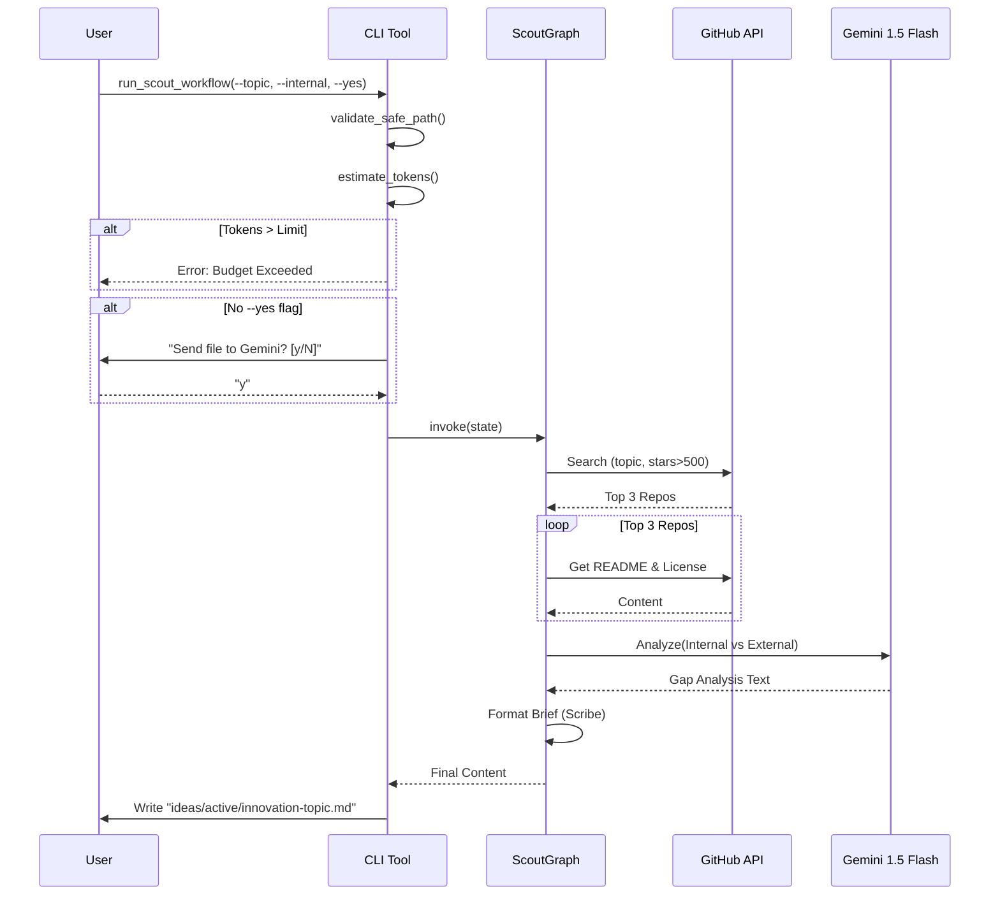

# 93 - Feature: The Scout: External Intelligence Gathering Workflow

## 1. Context & Goal
* **Issue:** #93
* **Objective:** Create a proactive research workflow that searches GitHub/Web for solutions to a given problem, analyzes top implementations, compares them against internal code, and produces an "Innovation Brief" documenting deficiencies.
* **Status:** Draft
* **Related Issues:** None.

### Open Questions
None - requirements are well-defined from issue.

## 2. Proposed Changes

### 2.1 Files Changed
| File Path | Description |
|-----------|-------------|
| `agentos/workflows/scout/__init__.py` | Package initialization. |
| `agentos/workflows/scout/graph.py` | LangGraph state machine definition (Explorer → Extractor → Gap Analyst → Scribe). |
| `agentos/workflows/scout/nodes.py` | Implementation of graph nodes (GitHub API interaction, Gemini LLM calls). |
| `agentos/workflows/scout/prompts.py` | LLM prompts for gap analysis and summarization. |
| `agentos/workflows/scout/templates.py` | Jinja2 templates for Innovation Brief Markdown generation. |
| `agentos/workflows/scout/token_estimator.py` | Logic to estimate token counts and enforce budgets. |
| `tools/run_scout_workflow.py` | CLI entry point handling args, privacy warnings, path safety, and output. |
| `tests/workflows/scout/test_graph.py` | Integration tests for graph state transitions. |
| `tests/workflows/scout/test_nodes.py` | Unit tests for node logic with mocked APIs. |
| `tests/workflows/scout/test_token_estimator.py` | Unit tests for budget enforcement. |
| `tests/fixtures/golden-brief-summary.md` | Golden fixture for similarity testing. |
| `agentos/workflows/__init__.py` | Registration of the new workflow. |
| `docs/0003-file-inventory.md` | Updated file inventory. |

### 2.2 Dependencies
* **`PyGithub`**: For searching repositories and fetching content via GitHub API.
* **`tiktoken`**: For estimating token usage (proxy for Gemini token count) to enforce budgets.
* **`rich`**: For interactive CLI warnings, formatted output, and progress spinners.
* **`tenacity`**: For implementing exponential backoff on network requests.
* **`jinja2`**: For robust Markdown template rendering.
* **`google-generativeai`**: (Existing) For Gemini 1.5 Flash access.
* **`langgraph`**: (Existing) For workflow orchestration.

### 2.3 Data Structures

```python
from typing import TypedDict, List, Optional, Any, Dict

class RepositoryData(TypedDict):
    name: str           # e.g. "langchain-ai/langgraph"
    url: str            # HTML URL
    stars: int
    description: str
    license_type: str   # e.g. "MIT", "Apache-2.0", "Unknown"
    readme_content: str # Raw markdown content (truncated)
    arch_content: Optional[str] # Content of specific architecture files if found

class ScoutState(TypedDict):
    # Inputs
    topic: str
    internal_file_path: Optional[str]
    internal_file_content: Optional[str]
    min_stars: int
    max_tokens: int
    
    # Processing State
    found_repos: List[RepositoryData]    # Populated by Explorer (Metadata only)
    analyzed_repos: List[RepositoryData] # Populated by Extractor (Full content)
    gap_analysis_result: str             # Raw LLM output from GapAnalyst
    
    # Outputs
    brief_content: str  # Final markdown or JSON content
    output_path: str    # Where it was saved
    
    # Error Handling & Observability
    error: Optional[str]
    trace_id: str
    logs: List[str]     # Structured log steps for debugging
```

### 2.4 Function Signatures

**`tools/run_scout_workflow.py`**
```python
def setup_logging(verbose: bool) -> None:
    """
    Configures standard logging.
    If verbose: level=DEBUG, else level=INFO.
    """
    pass

def validate_safe_path(path: str) -> str:
    """
    Validates that path exists and is within the project root to prevent traversal.
    Uses os.path.commonpath([os.getcwd(), os.path.abspath(path)]).
    Raises ValueError if invalid.
    """
    pass

def confirm_transmission(path: str, force_yes: bool) -> bool:
    """
    Displays rich warning about sending internal code to external LLM provider.
    Returns True if user confirms or force_yes is True.
    """
    pass

def main() -> None:
    """
    CLI entry point. 
    1. Parses args (topic, internal, yes, max-tokens, debug).
    2. Runs safety/budget checks.
    3. Invokes graph.
    4. Handles output.
    """
    pass
```

**`agentos/workflows/scout/token_estimator.py`**
```python
def estimate_tokens(text: str, encoding_name: str = "cl100k_base") -> int:
    """
    Uses tiktoken to estimate token count for text.
    """
    pass

def check_budget_preflight(
    internal_content: Optional[str], 
    limit: int,
    estimated_external_buffer: int = 15000
) -> None:
    """
    Raises BudgetExceededError if (internal + buffer) > limit.
    Buffer accounts for likely size of external READMEs + prompt overhead.
    """
    pass
```

**`agentos/workflows/scout/nodes.py`**
```python
def node_explorer(state: ScoutState) -> Dict[str, Any]:
    """
    Step 1: Uses GitHub Search API.
    Query: "{topic} stars:>{min_stars}"
    Logs: Search query and count of results.
    Returns: update for 'found_repos' (top 3 metadata only).
    """
    pass

def node_extractor(state: ScoutState) -> Dict[str, Any]:
    """
    Step 2: For top 3 repos in 'found_repos', fetches README and License.
    Handle: Rate limits using tenacity.
    Logs: Fetch status per repo, license detected.
    Returns: update for 'analyzed_repos' (includes content).
    """
    pass

def node_gap_analyst(state: ScoutState) -> Dict[str, Any]:
    """
    Step 3: LLM compares 'internal_file_content' vs 'analyzed_repos'.
    If internal_file_content is None, runs in 'Research Only' mode.
    Logs: LLM prompt token count (actual) and latency.
    Returns: update for 'gap_analysis_result'.
    """
    pass

def node_scribe(state: ScoutState) -> Dict[str, Any]:
    """
    Step 4: Renders 'gap_analysis_result' and repo data into Markdown/JSON.
    Returns: update for 'brief_content'.
    """
    pass
```

### 2.5 Logic Flow (Pseudocode)

**CLI Execution (`tools/run_scout_workflow.py`)**
```python
def main():
    args = parse_args() 
    setup_logging(args.debug)
    logger.info(f"Starting Scout for topic: {args.topic}")

    internal_content = None
    if args.internal:
        try:
            safe_path = validate_safe_path(args.internal)
            with open(safe_path, 'r') as f:
                internal_content = f.read()
        except Exception as e:
            logger.error(f"Invalid path: {e}")
            sys.exit(1)

    # Pre-flight Budget Check
    try:
        check_budget_preflight(internal_content, args.max_tokens)
    except BudgetExceededError as e:
        logger.error(f"Budget check failed: {e}")
        sys.exit(1)

    # Privacy Gate
    if internal_content and not confirm_transmission(args.internal, args.yes):
        print("Aborted by user.")
        sys.exit(0)

    # Graph Execution
    initial_state = {
        "topic": args.topic,
        "internal_file_content": internal_content,
        "min_stars": args.min_stars or 500,
        "max_tokens": args.max_tokens,
        "trace_id": uuid.uuid4().hex
    }
    
    if args.dry_run:
        print_plan(initial_state)
        return

    try:
        with Console().status("Scouting..."):
            result = scout_graph.invoke(initial_state)
    except Exception as e:
        logger.exception("Workflow execution failed")
        sys.exit(1)

    # Output Handling
    if args.format == "json":
        print(json.dumps(result["brief_content"]))
    else:
        # Generate safe filename
        slug = slugify(args.topic)
        filename = f"ideas/active/innovation-{slug}.md"
        # Prevent overwrite logic
        if os.path.exists(filename):
            timestamp = datetime.now().strftime("%Y%m%d-%H%M%S")
            filename = f"ideas/active/innovation-{slug}-{timestamp}.md"
            
        with open(filename, 'w') as f:
            f.write(result["brief_content"])
        logger.info(f"Brief generated: {filename}")
```

**Graph Node Logic (Extractor)**
```python
def node_extractor(state):
    results = []
    github_client = get_github_client()
    
    for repo_meta in state['found_repos']:
        try:
            repo = github_client.get_repo(repo_meta['name'])
            
            # Fetch License
            try:
                license_data = repo.get_license()
                license_spdx = license_data.license.spdx_id
            except:
                license_spdx = "Unknown"
                
            # Fetch README
            readme = repo.get_readme().decoded_content.decode('utf-8')
            
            # Update data
            repo_meta['license_type'] = license_spdx
            repo_meta['readme_content'] = truncate(readme, 8000)
            results.append(repo_meta)
            
            logger.debug(f"Extracted {repo_meta['name']} - License: {license_spdx}")
            
        except Exception as e:
            logger.warning(f"Failed to extract {repo_meta['name']}: {e}")
            continue

    return {"analyzed_repos": results}
```

### 2.6 Technical Approach
*   **Orchestration:** `LangGraph` manages the workflow. This ensures that state is passed cleanly between nodes and allows for future expansion (e.g., adding a loop for refined search).
*   **Observability:** 
    *   **Logging:** All nodes will utilize standard Python `logging`. The CLI configures the root logger.
    *   **Debug Mode:** A `--debug` flag sets log level to `DEBUG`, exposing API latencies, token counts per step, and raw search results.
    *   **Trace ID:** A unique `trace_id` is generated at start and included in all logs for correlation.
*   **Safety Boundary:** The CLI tool acts as the safety controller. No internal code enters the graph state until the user passes the privacy gate.
*   **Path Traversal Prevention:** `validate_safe_path` uses `os.path.abspath` and ensures the target path starts with the project root path.
*   **Token Budget:** Estimation uses `tiktoken` (cheap, local) as a proxy for Gemini tokens.

## 3. Requirements
1.  **Search:** Use GitHub API to find repos matching the topic, filtered by star count (default > 500).
2.  **License Tracking:** Extract `license.spdx_id` (e.g., "MIT") and include it in the final report.
3.  **Privacy:** Require explicit confirmation (`-y` or interactive 'y') before sending internal code to LLM.
4.  **Cost Control:** Hard abort if estimated tokens > `--max-tokens` (default 30k).
5.  **Output:** Markdown file in `ideas/active/` or JSON to stdout.
6.  **Comparison:** If internal file provided, analyze gaps; if not, provide research summary.
7.  **Observability:** Support `--debug` flag to trace execution flow and API calls.

## 4. Alternatives Considered

| Alternative | Pros | Cons | Decision |
|-------------|------|------|----------|
| **SerpAPI (Google Search)** | Finds blog posts and articles. | Expensive per query; harder to extract structured code/license info. | **Rejected** - Focus on finding code implementations via GitHub first. |
| **Direct LLM Knowledge** | Zero latency, no API calls. | High hallucination risk; outdated knowledge of libraries/licenses. | **Rejected** - Grounding in actual repo data is required. |
| **AsyncIO implementation** | Faster concurrent requests. | Adds complexity to CLI tool structure. | **Accepted** - Use `asyncio` logic where possible within graph nodes for parallel fetching. |

## 5. Data & Fixtures

### 5.1 Data Sources
| Source | Attributes Fetched | Usage |
|--------|-------------------|-------|
| **GitHub Search API** | `full_name`, `stargazers_count`, `html_url` | Selection |
| **GitHub Repo API** | `license`, `contents` (README.md) | Analysis |
| **Local File System** | File Content | Internal Context |

### 5.2 Data Pipeline
```ascii
CLI (User Input)
  |
  v
[Safety & Privacy Gate] --(Aborts if denied)--> Exit
  |
  v
[Explorer Node] <--> GitHub API (Search)
  |
  v
[Extractor Node] <--> GitHub API (Content Fetch)
  |
  v
[Gap Analyst Node] <--> Gemini 1.5 Flash
  |
  v
[Scribe Node] --> Markdown/JSON --> File System/Stdout
```

### 5.3 Test Fixtures
| Fixture | Purpose |
|---------|---------|
| `tests/fixtures/mock_github_search.json` | Mock response for `search_repositories`. |
| `tests/fixtures/mock_github_repo_content.json` | Mock response for README and License fetch. |
| `tests/fixtures/golden-brief-summary.md` | Expected output format for similarity testing. |

### 5.4 Deployment Pipeline
Development tool only. Depends on local `GITHUB_TOKEN` and `GEMINI_API_KEY`.

## 6. Diagram

### 6.1 Mermaid Quality Gate
- [x] Diagram type: Sequence
- [x] Participants defined: User, CLI, ScoutGraph, GitHub, Gemini
- [x] Flows clearly shown: Yes

### 6.2 Diagram


## 7. Security Considerations

| Concern | Mitigation |
|---------|------------|
| **Path Traversal** | `validate_safe_path` ensures file path resolves within `os.getcwd()`. Rejects `..` attempts escaping root. |
| **Data Leakage** | Internal code is NEVER sent to GitHub. It is ONLY sent to Gemini (LLM) over HTTPS after explicit user confirmation. |
| **API Key Exposure** | Keys are read from ENV. Not logged (even in debug mode). Not included in generated briefs. |
| **Execution of Extracted Code** | External code is treated strictly as text strings. No `exec()` or `eval()` is used. |

## 8. Performance Considerations

| Metric | Budget | Strategy |
|--------|--------|----------|
| **Total Runtime** | < 45 seconds | Parallel fetch for GitHub content (3 concurrent) if feasible, else sequential with short timeouts. |
| **Token Usage** | < 30,000 tokens | Truncate external READMEs to 8,000 chars each. Pre-flight check. |
| **API Rate Limits** | Respect GitHub headers | Use `tenacity` exponential backoff (wait 1s, 2s, 4s) on 403/429 errors. |

## 9. Risks & Mitigations

| Risk | Impact | Likelihood | Mitigation |
|------|--------|------------|------------|
| **No Repos Found** | Empty Report | Medium | Fallback: Suggest broader search terms in output. |
| **Rate Limiting (GitHub)** | Workflow Failure | Medium | Detect unauthenticated state, warn user to set `GITHUB_TOKEN`. |
| **File Overwrites** | Data Loss | Low | Logic appends timestamp to filename if target already exists (`innovation-topic-2024...md`). |

## 10. Verification & Testing

### 10.1 Test Scenarios
| ID | Scenario | Type | Input | Output | Criteria |
|----|----------|------|-------|--------|----------|
| 1 | Happy Path (Gap Analysis) | Integration | Topic="Patterns", Internal="core/state.py", Yes=True | File created | Contains "External Standard", "Internal Gap", License info. |
| 2 | Research Only | Integration | Topic="Patterns", Internal=None, Yes=True | File created | Contains "Summary", no "Internal Gap" section. |
| 3 | Privacy Gate Decline | Unit/E2E | Internal="core/state.py", Input="n" | Exit Code 0 | "Aborted" message, no API calls. |
| 4 | Token Limit Exceeded | Unit | `--max-tokens 100`, Large Internal File | Exit Code 1 | Error: "Estimated tokens X exceeds limit 100". |
| 5 | Path Traversal | Unit | `--internal ../../secret` | Exit Code 1 | Error: "Path must be within project root". |

### 10.2 Test Commands
```bash
# Unit Tests
pytest tests/workflows/scout/

# Dry Run Check
python tools/run_scout_workflow.py --topic "test" --dry-run

# JSON Output Check
python tools/run_scout_workflow.py --topic "fastapi" --format json --yes > output.json
```

### 10.3 Manual Tests (Only If Unavoidable)
N/A - All scenarios automated via mocking.

## 11. Definition of Done

### Code
- [ ] Nodes (Explorer, Extractor, GapAnalyst, Scribe) implemented.
- [ ] CLI tool implemented with `rich` for UI and `argparse`.
- [ ] `validate_safe_path` implemented and tested.
- [ ] License extraction logic handles "No License" case gracefully.
- [ ] Logging implemented with `--debug` support.

### Tests
- [ ] Unit tests for all nodes (mocking GitHub/Gemini).
- [ ] Integration test for the full graph flow.
- [ ] Token budget tests pass.

### Documentation
- [ ] `docs/reports/scout-workflow/implementation-report.md` created.
- [ ] `tools/README.md` updated with Scout usage.

### Review
- [ ] Privacy audit: Confirm confirmation prompt works.
- [ ] Security audit: Confirm path traversal is blocked.

---

## Appendix: Review Log

### Review Summary

| Review | Date | Verdict | Key Issue |
|--------|------|---------|-----------|
| - | - | - | - |

**Final Status:** DRAFT - PENDING REVIEW