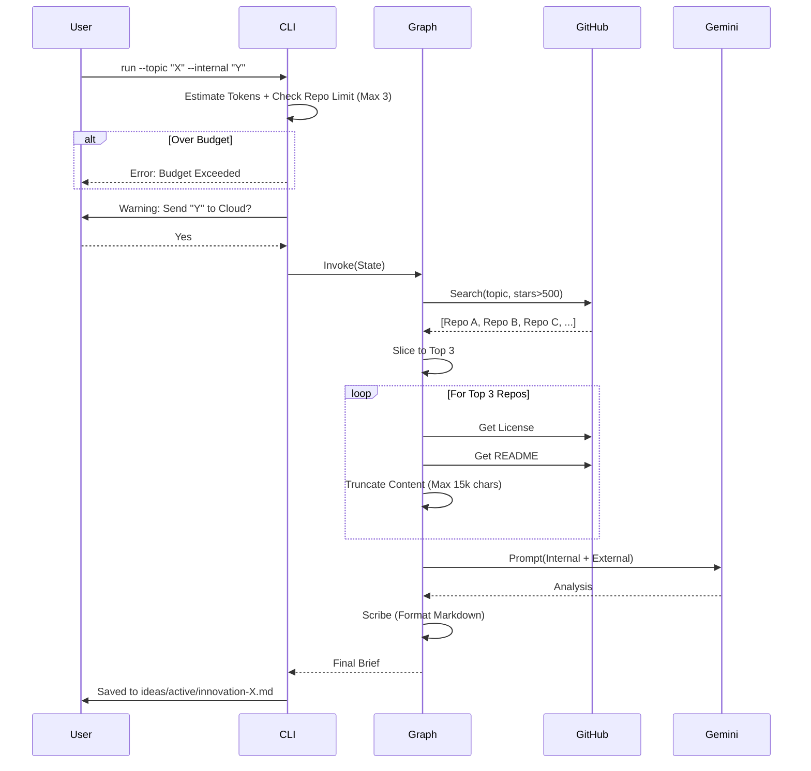

# 93 - Feature: The Scout: External Intelligence Gathering Workflow

## 1. Context & Goal
* **Issue:** #93
* **Objective:** Create a proactive research workflow that searches GitHub for solutions to a given problem, analyzes top implementations, compares them against internal code, and produces an "Innovation Brief" documenting deficiencies.
* **Status:** Draft
* **Related Issues:** None - requirements are well-defined from issue.

### Open Questions
None - requirements are well-defined from issue.

## 2. Proposed Changes

### 2.1 Files Changed
| File Path | Description |
|-----------|-------------|
| `agentos/workflows/scout/__init__.py` | Package initialization. |
| `agentos/workflows/scout/constants.py` | Configuration constants (MAX_REPOS, TOKEN_LIMITS). |
| `agentos/workflows/scout/graph.py` | LangGraph state machine definition (Explorer → Extractor → Gap Analyst → Scribe). |
| `agentos/workflows/scout/nodes.py` | Node implementations with defensive bounds and license extraction. |
| `agentos/workflows/scout/prompts.py` | LLM prompts for gap analysis and summarization. |
| `agentos/workflows/scout/templates.py` | Jinja2 templates for Innovation Brief Markdown generation. |
| `agentos/workflows/scout/token_estimator.py` | Logic to estimate token counts and enforce budgets using tiktoken. |
| `tools/run_scout_workflow.py` | CLI entry point handling args, privacy warnings, path safety, and output. |
| `tests/workflows/scout/test_graph.py` | Integration tests for graph state transitions. |
| `tests/workflows/scout/test_nodes.py` | Unit tests for individual nodes with mocked APIs. |
| `tests/workflows/scout/test_token_estimator.py` | Unit tests for token budget enforcement. |
| `tests/fixtures/golden-brief-summary.md` | Golden fixture for similarity testing. |
| `ideas/active/.gitkeep` | Ensure output directory exists. |
| `agentos/workflows/__init__.py` | Register scout workflow. |
| `docs/0003-file-inventory.md` | Update inventory. |

### 2.2 Dependencies
| Dependency | Purpose |
|------------|---------|
| `PyGithub` | Interaction with GitHub API for search and content retrieval. |
| `tiktoken` | Local token estimation to enforce budgets before LLM calls. |
| `rich` | CLI UI formatting, progress spinners, and interactive prompts. |
| `tenacity` | Exponential backoff for API rate limit handling. |
| `jinja2` | Templating engine for generating consistent Markdown briefs. |
| `langsmith` | (Optional) Tracing and observability for agent runs. |

### 2.3 Data Structures

```python
from typing import TypedDict, List, Optional, Any

class RepositoryData(TypedDict):
    name: str           # "owner/repo"
    url: str            # HTML URL
    stars: int
    description: str
    license_type: str   # SPDX ID (e.g., "MIT") or "Unknown"
    readme_content: str # Truncated content
    arch_content: str   # Truncated content of architecture/design docs if found

class ScoutState(TypedDict):
    # Input
    topic: str
    internal_file_path: Optional[str]
    internal_file_content: Optional[str]
    min_stars: int
    max_tokens: int
    max_repos: int      # Hard limit on external sources to analyze
    
    # Intermediate
    found_repos: List[RepositoryData]    # Metadata from search
    analyzed_repos: List[RepositoryData] # Populated with content
    gap_analysis_result: str             # LLM output
    
    # Output
    brief_content: str
    output_path: str
    error: Optional[str]
```

### 2.4 Function Signatures

**`agentos/workflows/scout/constants.py`**
```python
MAX_REPOS_TO_ANALYZE = 3
MAX_CHARS_PER_FILE = 15000
DEFAULT_TOKEN_BUDGET = 30000
```

**`tools/run_scout_workflow.py`**
```python
def confirm_transmission(file_path: str, force_yes: bool) -> bool:
    """
    Displays a warning using 'rich' about data transmission.
    Returns True if user confirms (y) or force_yes is True.
    """
    pass

def validate_safe_path(path: str) -> str:
    """
    Ensures path is within project root to prevent traversal.
    Raises ValueError if invalid.
    """
    pass

def main():
    """CLI Entry point: Parses args, runs pre-flight checks, invokes graph."""
    pass
```

**`agentos/workflows/scout/token_estimator.py`**
```python
def estimate_tokens(text: str) -> int:
    """Returns token count using cl100k_base encoding."""
    pass

def check_budget_preflight(internal_content: Optional[str], external_estimate: int, limit: int) -> None:
    """
    Estimates total tokens including reserved buffer for external content.
    Raises BudgetExceededError if limit is breached.
    """
    pass
```

**`agentos/workflows/scout/nodes.py`**
```python
def node_explorer(state: ScoutState) -> dict:
    """
    Searches GitHub for repos > min_stars matching topic.
    Slices results to state['max_repos'].
    Returns: {'found_repos': [metadata_list]}
    """
    pass

def node_extractor(state: ScoutState) -> dict:
    """
    Fetches README/License for found repos.
    Applies strict truncation limits (MAX_CHARS_PER_FILE).
    Returns: {'analyzed_repos': [full_data_list]}
    """
    pass

def node_gap_analyst(state: ScoutState) -> dict:
    """
    Invokes LLM to compare internal vs external patterns.
    Returns: {'gap_analysis_result': str}
    """
    pass

def node_scribe(state: ScoutState) -> dict:
    """
    Formats final report using Jinja2 templates.
    Returns: {'brief_content': str}
    """
    pass
```

### 2.5 Logic Flow (Pseudocode)

**Explorer Node (Limit Enforcement)**
```python
from agentos.workflows.scout.constants import MAX_REPOS_TO_ANALYZE

def node_explorer(state: ScoutState):
    query = f"{state['topic']} stars:>{state['min_stars']}"
    github = get_github_client()
    
    # Search
    repos = github.search_repositories(query)
    
    found = []
    # Hard limit enforcement for cost control
    limit = min(state.get("max_repos", MAX_REPOS_TO_ANALYZE), MAX_REPOS_TO_ANALYZE)
    
    for repo in repos[:limit]:
        found.append({
            "name": repo.full_name,
            "url": repo.html_url,
            "stars": repo.stargazers_count,
            "description": repo.description,
            "license_type": "Pending...",
            "readme_content": "",
            "arch_content": ""
        })
        
    if not found:
        return {"error": "No relevant results found"}
        
    return {"found_repos": found}
```

**CLI Main Workflow**
```python
def main():
    args = parse_args()
    
    # 1. Input Validation
    internal_content = None
    if args.internal:
        path = validate_safe_path(args.internal)
        if not os.path.exists(path):
            die(f"File not found: {path}")
        with open(path) as f:
            internal_content = f.read()

    # 2. Privacy Gate
    if internal_content and not confirm_transmission(args.internal, args.yes):
        die("Aborted by user.")

    # 3. Cost Control Pre-flight
    # Estimate 3 external repos * 5k tokens each = 15k buffer
    EXTERNAL_BUFFER = 15000 
    try:
        check_budget_preflight(internal_content, EXTERNAL_BUFFER, args.max_tokens)
    except BudgetExceededError as e:
        die(f"Budget error: {e}")

    # 4. Execution
    state = {
        "topic": args.topic,
        "internal_file_content": internal_content,
        "min_stars": args.min_stars,
        "max_tokens": args.max_tokens,
        "max_repos": 3 # Explicit upper bound
    }
    
    if args.dry_run:
        print_plan(state)
        return

    # Initialize graph with tracing
    app = WorkflowGraph.compile()
    result = app.invoke(state, config={"callbacks": [TracingCallback()]})
    
    # 5. Output
    write_output(result["brief_content"], args.output, args.format)
```

### 2.6 Technical Approach
*   **Module Location:** `agentos/workflows/scout/`
*   **Design Pattern:** Pipeline pattern via `LangGraph` (State Machine).
*   **Key Decision - Defensive Extraction:** The `node_extractor` explicitly truncates content. This addresses the risk of large READMEs blowing up the token budget or causing LLM errors.
*   **Key Decision - Privacy Gate:** Implemented at the CLI layer (entry point) rather than the graph layer to ensure no data even enters the workflow state memory until approved.
*   **Key Decision - Hard Limits:** Enforced `MAX_REPOS_TO_ANALYZE = 3` in `constants.py` and strictly sliced in `node_explorer` to prevent API/Token cost runaway.

## 3. Requirements
1.  **Search Capability:** Must interface with GitHub API to find repositories with configurable star threshold.
2.  **Repo Limit:** Must analyze no more than 3 top repositories per run to control token costs.
3.  **License Identification:** Must explicitly capture and report the license type (e.g., MIT, Apache-2.0) of external code.
4.  **Privacy Protection:** Must require user confirmation before transmitting any internal code to the LLM.
5.  **Budget Enforcement:** Must abort *before* LLM invocation if estimated tokens exceed the limit (default 30k).
6.  **Defensive Processing:** Must truncate external inputs (max 15k chars) to prevent context window overflow.
7.  **Output formatting:** Must produce valid Markdown (default) or JSON.
8.  **Observability:** Must support tracing hooks (e.g., LangSmith) for debugging graph execution.

## 4. Alternatives Considered

| Alternative | Pros | Cons | Decision |
|-------------|------|------|----------|
| **Web Scraping (BeautifulSoup)** | No API limits, access to blogs. | Fragile, requires DOM maintenance, potential TOS issues. | **Rejected** (Use GitHub API for structured, legal access). |
| **Separate "Research" vs "Compare" Tools** | Simpler distinct tools. | fragmented UX; user wants context-aware research. | **Rejected** (Unified workflow is better UX). |
| **Streaming Output** | Faster perceived speed. | Harder to format structured Markdown/JSON files cleanly. | **Rejected** (Wait for completion, then write file). |

## 5. Data & Fixtures

### 5.1 Data Sources
| Source | Attributes |
|--------|------------|
| **GitHub Search API** | `full_name`, `stargazers_count`, `html_url`, `description` |
| **GitHub Contents API** | `content` (base64 encoded), `encoding` |
| **GitHub License API** | `license.spdx_id`, `license.name` |
| **Local File System** | Source code text (UTF-8) |

### 5.2 Data Pipeline
```ascii
[CLI Inputs]
    |
    v
[Privacy/Budget Gate] --(Stop if Fail)--> [Exit]
    |
    v
[LangGraph State]
    |
    +-> [Explorer] <--(HTTPS)--> [GitHub Search API]
    |       |
    |   (List of Top 3 Repos)
    |       v
    +-> [Extractor] <--(HTTPS)--> [GitHub Repo API]
    |       |
    |   (Truncated Content + Licenses)
    |       v
    +-> [Gap Analyst] <--(HTTPS)--> [Gemini LLM]
    |       |
    |   (Analysis Text)
    |       v
    +-> [Scribe]
            |
            v
       [Output File]
```

### 5.3 Test Fixtures
| Fixture | Description |
|---------|-------------|
| `golden-brief-summary.md` | Expected Markdown output for a known input set (similarity comparison). |
| `mock_gh_search.json` | Sample JSON response from GitHub Search API. |
| `mock_gh_readme.json` | Sample JSON response from GitHub Contents API. |
| `mock_gh_license.json` | Sample JSON response from GitHub License API. |

### 5.4 Deployment Pipeline
*   **Development only:** Tool runs locally on developer machines.
*   **Credentials:** Requires `GITHUB_TOKEN` and `GEMINI_API_KEY` in environment.

## 6. Diagram

### 6.1 Mermaid Quality Gate
- [x] Diagram type: Sequence
- [x] Participants defined: User, CLI, Graph, GitHub, Gemini
- [x] Flows clearly shown: Happy path + Gates

### 6.2 Diagram


## 7. Security Considerations

| Concern | Mitigation |
|---------|------------|
| **Internal Code Leakage** | Code sent ONLY to Gemini (HTTPS). User must confirm via interactive prompt or explicit `--yes` flag. |
| **Path Traversal** | CLI validates that `--internal` path resolves within the current working directory (project root). |
| **GitHub API Rate Limits** | Implementation uses `tenacity` retry logic and respects `Retry-After` headers. |
| **Malicious External Content** | External READMEs are treated as plain text strings, never executed. |

## 8. Performance Considerations

| Metric | Budget |
|--------|--------|
| **Initial Search Latency** | < 2 seconds |
| **Content Fetching** | < 10 seconds (Parallel execution where possible, or tight timeouts) |
| **LLM Analysis** | < 15 seconds |
| **Token Usage** | Max 30,000 tokens per run (hard cap) |
| **Repo Analysis Limit** | Max 3 repositories per run (hard cap) |

## 9. Risks & Mitigations

| Risk | Impact | Likelihood | Mitigation |
|------|--------|------------|------------|
| **GitHub API Rate Limit** | Workflow fails | Medium | Backoff logic + Instruction to provide `GITHUB_TOKEN`. |
| **LLM Hallucination** | Incorrect gap analysis | Low | Provide full source text in context; prompt engineering to "quote" sources. |
| **Large Repositories** | Context window overflow | Medium | Strict truncation (15k chars) in Extractor node. |
| **Runaway Costs** | High API bill | Low | Hard limit of 3 repos and pre-flight token estimation. |

## 10. Verification & Testing

### 10.1 Test Scenarios
| ID | Scenario | Type | Input | Output | Criteria |
|----|----------|------|-------|--------|----------|
| 1 | Happy Path | E2E | Topic="State", Internal="file.py", Yes=True | .md File | Contains license info and gap analysis. |
| 2 | Budget Exceeded | Unit | `--max-tokens 100` | Error | Exits with "Budget Exceeded". |
| 3 | Repo Limit Check | Integration | Topic="Popular" (Returns 50 repos) | State | `analyzed_repos` has len == 3. |
| 4 | Privacy Decline | E2E | `--internal file.py` (User inputs 'n') | Message | "Aborted"; No network calls made. |
| 5 | JSON Format | E2E | `--format json` | stdout | Valid JSON structure. |
| 6 | No Results | E2E | Topic="gibberish_xyz_123" | .md File | Brief states "No relevant results found". |

### 10.2 Test Commands
```bash
# Run unit tests
pytest tests/workflows/scout/

# Verify brief similarity against golden master
pytest tests/workflows/scout/test_graph.py::test_brief_similarity

# Manual dry run check
python tools/run_scout_workflow.py --topic "agents" --dry-run
```

### 10.3 Manual Tests (Only If Unavoidable)
N/A - All core logic is automated. Manual verification only for UX "feel" of CLI prompts.

## 11. Definition of Done

### Code
- [ ] `run_scout_workflow.py` implemented with argument parsing and privacy gates.
- [ ] `token_estimator.py` implements tiktoken logic and buffer checks.
- [ ] Graph nodes (`nodes.py`) implemented with defensive truncation and Max-3 repo limit.
- [ ] License extraction logic included in Extractor node.

### Tests
- [ ] >80% coverage on new module `agentos/workflows/scout/`.
- [ ] Integration tests verify the full graph lifecycle.
- [ ] Mocked tests for GitHub API rate limit handling.

### Documentation
- [ ] CLI tool help text (`--help`) is clear and complete.
- [ ] New feature documented in `docs/` and `tools/README.md`.
- [ ] Privacy implications added to security docs.

### Review
- [ ] Security review of path validation logic.
- [ ] UX review of the CLI interactive prompt.

---

## Appendix: Review Log

### Review Summary

| Review | Date | Verdict | Key Issue |
|--------|------|---------|-----------|
| - | - | - | - |

**Final Status:** DRAFT - PENDING REVIEW