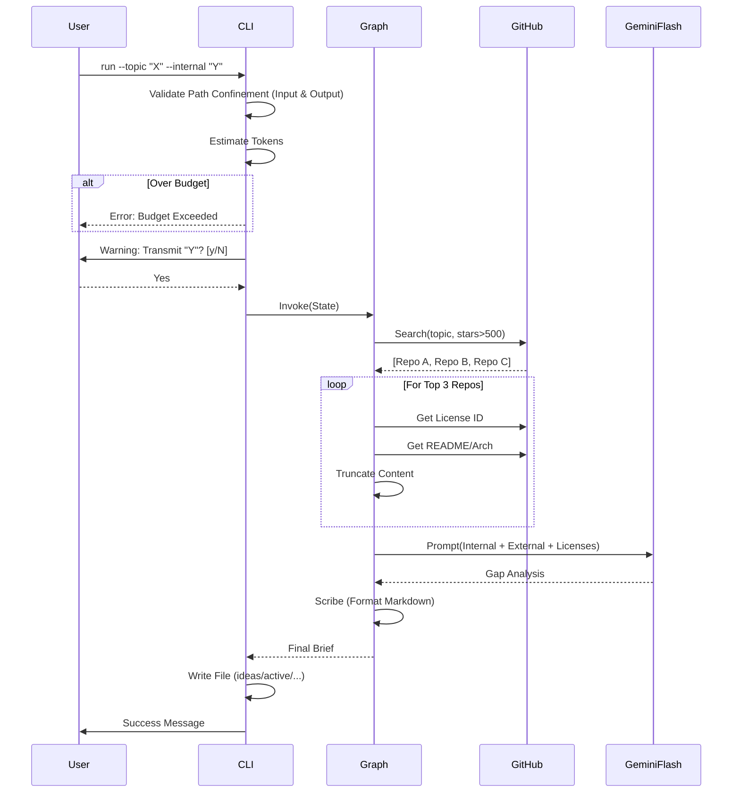

# 93 - Feature: The Scout: External Intelligence Gathering Workflow

## 1. Context & Goal
* **Issue:** #93
* **Objective:** Create a proactive research workflow that searches GitHub/Web for solutions to a given problem, analyzes top implementations, compares them against internal code, and produces an "Innovation Brief" documenting specific deficiencies and recommendations.
* **Status:** Draft
* **Related Issues:** None - requirements are well-defined from issue.

### Open Questions
None - requirements are well-defined from issue.

## 2. Proposed Changes

### 2.1 Files Changed
| File Path | Description |
|-----------|-------------|
| `agentos/workflows/scout/__init__.py` | Package initialization. |
| `agentos/workflows/scout/graph.py` | LangGraph state machine definition (Explorer → Extractor → Gap Analyst → Scribe). |
| `agentos/workflows/scout/nodes.py` | Node implementations (Explorer, Extractor, Gap Analyst, Scribe). |
| `agentos/workflows/scout/prompts.py` | LLM prompts for gap analysis and summarization. |
| `agentos/workflows/scout/templates.py` | Markdown templates for Innovation Brief generation. |
| `agentos/workflows/scout/token_estimator.py` | Token counting and budget enforcement logic. |
| `tools/run_scout_workflow.py` | CLI entry point handling args, privacy warnings, path safety, and output generation. |
| `tests/workflows/scout/test_graph.py` | Integration tests for graph state transitions. |
| `tests/workflows/scout/test_nodes.py` | Unit tests for individual nodes with mocked APIs. |
| `tests/workflows/scout/test_token_estimator.py` | Unit tests for token budget enforcement. |
| `tests/fixtures/golden-brief-summary.md` | Golden fixture for similarity testing. |
| `ideas/active/.gitkeep` | Ensure output directory exists. |
| `agentos/workflows/__init__.py` | Register scout workflow. |
| `docs/0003-file-inventory.md` | Add new files to inventory. |

### 2.2 Dependencies
| Dependency | Purpose |
|------------|---------|
| `PyGithub` | Interaction with GitHub API for search, content retrieval, and license metadata. |
| `tiktoken` | Local token estimation to enforce budgets before LLM calls. |
| `rich` | CLI UI formatting, progress spinners, and interactive prompts. |
| `tenacity` | Exponential backoff for API rate limit handling. |
| `langgraph` | State machine orchestration. |
| `google-generativeai` | Underlying LLM client (via `gemini_client.py`). |

### 2.3 Data Structures

```python
from typing import TypedDict, List, Optional, Any

class RepositoryData(TypedDict):
    name: str           # "owner/repo"
    url: str            # HTML URL
    stars: int
    description: str
    license_type: str   # SPDX ID (e.g., "MIT") or "Unknown"
    readme_content: str # Truncated content
    arch_content: str   # Truncated content of architecture/design docs if found

class ScoutState(TypedDict):
    # Input
    topic: str
    internal_file_path: Optional[str]
    internal_file_content: Optional[str]
    min_stars: int
    max_tokens: int
    max_repos: int      # Hard limit on external sources to analyze (default: 3)
    
    # Intermediate
    found_repos: List[RepositoryData]    # Metadata from search
    analyzed_repos: List[RepositoryData] # Populated with content
    gap_analysis_result: str             # LLM output
    
    # Output
    brief_content: str
    error: Optional[str]
```

### 2.4 Function Signatures

**`tools/run_scout_workflow.py`**
```python
def validate_path_confinement(path: str) -> str:
    """
    Validates that a path (input or output) resolves to a location inside 
    the current project root (worktree).
    Raises ValueError if path points outside (e.g., ../../etc/passwd).
    Returns absolute path.
    """
    pass

def confirm_transmission(file_path: str, force_yes: bool) -> bool:
    """
    Displays a warning using 'rich' about data transmission to Gemini.
    Returns True if user confirms (y) or force_yes is True.
    """
    pass

def main():
    """CLI Entry point: Parses args, runs pre-flight checks, invokes graph."""
    pass
```

**`agentos/workflows/scout/token_estimator.py`**
```python
def estimate_tokens(text: str) -> int:
    """Returns token count using cl100k_base encoding."""
    pass

def check_budget_preflight(internal_content: Optional[str], limit: int) -> None:
    """
    Estimates total tokens = internal_content + ESTIMATED_EXTERNAL_TOKENS.
    Raises BudgetExceededError if total > limit.
    """
    pass
```

**`agentos/workflows/scout/nodes.py`**
```python
def node_explorer(state: ScoutState) -> dict:
    """
    Searches GitHub for repos > min_stars matching topic.
    Slices results to state['max_repos'].
    Returns: {'found_repos': [metadata_list]}
    """
    pass

def node_extractor(state: ScoutState) -> dict:
    """
    Fetches README/License for found repos via PyGithub.
    Applies strict truncation limits (MAX_CHARS_PER_FILE).
    Captures license.spdx_id explicitly.
    Returns: {'analyzed_repos': [full_data_list]}
    """
    pass

def node_gap_analyst(state: ScoutState) -> dict:
    """
    Invokes Gemini 1.5 Flash to compare internal vs external patterns.
    Uses 'prompts.GAP_ANALYSIS_PROMPT'.
    Returns: {'gap_analysis_result': str}
    """
    pass

def node_scribe(state: ScoutState) -> dict:
    """
    Formats final report using templates.
    Returns: {'brief_content': str}
    """
    pass
```

### 2.5 Logic Flow (Pseudocode)

**CLI Main Workflow (`tools/run_scout_workflow.py`)**
```python
def main():
    args = parse_args() 
    
    # 1. Path Safety & Content Loading
    internal_content = None
    if args.internal:
        # Enforce confinement (Reviewer Requirement)
        safe_path = validate_path_confinement(args.internal)
        if not os.path.exists(safe_path):
             exit("Error: Internal target not found")
        internal_content = read_file(safe_path)

    output_path = resolve_output_path(args.topic, args.output) # Also enforces confinement
    if os.path.exists(output_path):
        exit(f"Error: Output file {output_path} already exists")

    # 2. Privacy Gate
    if internal_content and not confirm_transmission(args.internal, args.yes):
        exit("Aborted by user.")

    # 3. Cost Control Pre-flight
    try:
        check_budget_preflight(internal_content, args.max_tokens)
    except BudgetExceededError as e:
        exit(f"Error: {e}")
        
    # 4. Graph Execution
    state = {
        "topic": args.topic,
        "internal_file_content": internal_content,
        "min_stars": args.min_stars,
        "max_tokens": args.max_tokens
    }
    
    if args.dry_run:
        print_plan(state)
        return

    result = app.invoke(state)
    
    # 5. Output
    if args.format == 'json':
        print_json(result)
    else:
        write_file(output_path, result["brief_content"])
        print(f"Brief saved to {output_path}")
```

**Graph Flow**
```python
# agentos/workflows/scout/graph.py

workflow = StateGraph(ScoutState)
workflow.add_node("explorer", node_explorer)
workflow.add_node("extractor", node_extractor)
workflow.add_node("gap_analyst", node_gap_analyst)
workflow.add_node("scribe", node_scribe)

workflow.set_entry_point("explorer")
workflow.add_edge("explorer", "extractor")
workflow.add_edge("extractor", "gap_analyst")
workflow.add_edge("gap_analyst", "scribe")
workflow.add_edge("scribe", END)
```

### 2.6 Technical Approach
*   **Module Location:** `agentos/workflows/scout/`
*   **Design Pattern:** Pipeline via LangGraph.
*   **Safety:** 
    *   **Input Confinement:** `validate_path_confinement` uses `os.path.commonpath` to ensure input files are within the project root, preventing arbitrary system file reads (addressing reviewer feedback).
    *   **Output Confinement:** Same logic applied to output path.
*   **Key Decision:** Use **Gemini 1.5 Flash** for high context window (1M tokens) at low cost, suitable for ingesting READMEs and code files.
*   **License Handling:** Use PyGithub's `get_license()` object to fetch SPDX IDs (e.g., "MIT", "Apache-2.0") reliably rather than scraping text.

## 3. Requirements
1.  **Search:** Interface with GitHub API to find repositories > star threshold (default 500).
2.  **Repo Limit:** Analyze max 3 top repositories per run.
3.  **License Identification:** Explicitly capture `license.spdx_id` for every external source.
4.  **Privacy Protection:** Require confirmation before transmitting internal code.
5.  **Budget Enforcement:** Abort if estimated tokens > limit (default 30k).
6.  **Defensive Processing:** Truncate external inputs (15k chars) to prevent context overflow.
7.  **Path Confinement:** Both input (`--internal`) and output files MUST be within the project directory.
8.  **Output Formatting:** Generate Markdown (default) or JSON.

## 4. Alternatives Considered

| Alternative | Pros | Cons | Decision |
|-------------|------|------|----------|
| **Web Scraping (BeautifulSoup)** | No API limits. | Fragile, maintenance heavy. | **Rejected** - Use GitHub API. |
| **Git Clone Analysis** | Full codebase access. | Slow, disk heavy, security risks. | **Rejected** - Analyze README/Docs via API only. |
| **Gemini 1.5 Pro** | Higher reasoning capability. | Higher cost ($5-10/run). | **Rejected** - Use Flash (~$0.10/run). |
| **Direct File Access** | Simpler code. | Security risk (Path Traversal). | **Rejected** - Enforce project root confinement. |

## 5. Data & Fixtures

### 5.1 Data Sources
| Source | Attributes |
|--------|------------|
| **GitHub Search API** | `full_name`, `stargazers_count`, `html_url` |
| **GitHub Contents API** | `content` (base64), `encoding` |
| **GitHub License API** | `license.spdx_id` |
| **Local File System** | Source code text (UTF-8) |

### 5.2 Data Pipeline
```ascii
[CLI] -> [Path Safety Check] -> [Token Est.] -> [Privacy Gate]
                                     |
                                     v
                            [LangGraph Execution]
                                     |
[GitHub API] <--(Search/Fetch)-- [Nodes] --(Analysis)--> [Gemini]
                                     |
                                     v
                            [Output Generation]
```

### 5.3 Test Fixtures
| Fixture | Description |
|---------|-------------|
| `golden-brief-summary.md` | Expected Markdown output for similarity testing. |
| `tests/fixtures/mock_gh_response.json` | Mocked GitHub API responses (search, content, license). |

### 5.4 Deployment Pipeline
*   **Development only:** Runs locally via CLI.
*   **Secrets:** Requires `GITHUB_TOKEN` and `GEMINI_API_KEY`.

## 6. Diagram

### 6.1 Mermaid Quality Gate
- [x] Diagram type: Sequence
- [x] Participants defined
- [x] Flows clearly shown

### 6.2 Diagram


## 7. Security Considerations

| Concern | Mitigation |
|---------|------------|
| **Data Exfiltration** | Internal code sent ONLY to Gemini (HTTPS). User must confirm via interactive prompt. |
| **Path Traversal (Input)** | `validate_path_confinement` ensures input path is inside project root. Rejects `../` that escapes root. |
| **Path Traversal (Output)** | Output constrained to `ideas/active` (or project root if custom). |
| **Sensitive Data** | GITHUB_TOKEN used only for API calls, never logged. |
| **Code Execution** | Extracted external code is treated as text only; never executed. |

## 8. Performance Considerations

| Metric | Budget |
|--------|--------|
| **Search Latency** | < 2 seconds |
| **Total Runtime** | < 45 seconds (typical) |
| **Token Usage** | Max 30,000 tokens per run (hard cap) |
| **Model** | Gemini 1.5 Flash (Fixed tier) |

## 9. Risks & Mitigations

| Risk | Impact | Likelihood | Mitigation |
|------|--------|------------|------------|
| **API Rate Limit (GitHub)** | Workflow fails | Medium | Exponential backoff (max 3 retries). |
| **LLM Cost Spike** | Unexpected bill | Low | Strict pre-flight token estimation and hard cap. |
| **Privacy Violation** | User error | Low | Default `n` on confirmation prompt. |

## 10. Verification & Testing

### 10.1 Test Scenarios
| ID | Scenario | Type | Input | Output | Criteria |
|----|----------|------|-------|--------|----------|
| 1 | Happy Path | E2E | Topic="State", Internal="valid.py", Yes=True | .md File | Contains license info & gaps. |
| 2 | Budget Exceeded | Unit | `--max-tokens 100` | Error | Exits before API call. |
| 3 | Privacy Decline | E2E | `--internal valid.py` (User inputs 'n') | Message | "Aborted". |
| 4 | Input Path Traversal | Unit | `--internal ../../etc/passwd` | Error | Path security error. |
| 5 | Output Path Traversal | Unit | `--output ../../evil.md` | Error | Path security error. |
| 6 | JSON Format | E2E | `--format json` | stdout | Valid JSON. |

### 10.2 Test Commands
```bash
# Run unit tests
pytest tests/workflows/scout/

# Run specific similarity test
pytest tests/workflows/scout/test_brief_similarity.py -v

# Manual dry run
python tools/run_scout_workflow.py --topic "agents" --dry-run
```

### 10.3 Manual Tests (Only If Unavoidable)
N/A - All scenarios automated.

## 11. Definition of Done

### Code
- [ ] `run_scout_workflow.py` implemented with strict path confinement (input AND output).
- [ ] `token_estimator.py` implements tiktoken logic and pre-flight check.
- [ ] Graph nodes implemented with defensive truncation and license extraction.
- [ ] `validate_path_confinement` logic verified by security review.

### Tests
- [ ] >80% coverage on new module.
- [ ] Integration tests verify graph lifecycle.
- [ ] Golden fixture test passes.

### Documentation
- [ ] CLI tool help text is complete.
- [ ] Privacy implications documented in wiki.

### Review
- [ ] Security review of path validation logic.
- [ ] UX review of CLI prompts.

---

## Appendix: Review Log

### Review Summary

| Review | Date | Verdict | Key Issue |
|--------|------|---------|-----------|
| - | - | - | - |

**Final Status:** DRAFT - PENDING REVIEW