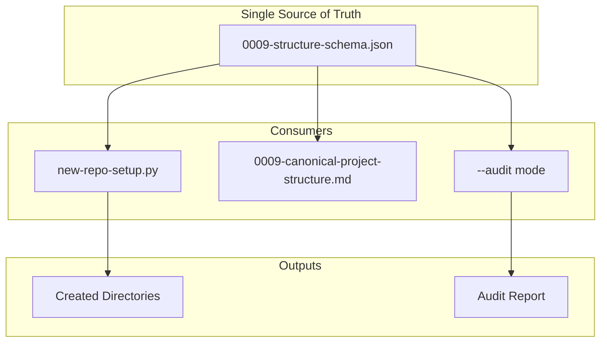

# 199 - Feature: Schema-driven project structure: eliminate tool/standard drift

<!-- Template Metadata
Last Updated: 2026-02-02
Updated By: Issue #117 fix
Update Reason: Moved Verification & Testing to Section 10 (was Section 11) to match 0702c review prompt and testing workflow expectations
Previous: Added sections based on 80 blocking issues from 164 governance verdicts (2026-02-01)
-->

## 1. Context & Goal
* **Issue:** #99
* **Objective:** Create a JSON schema as single source of truth for project structure, eliminating hardcoded duplication between new-repo-setup.py and standard 0009.
* **Status:** Draft
* **Related Issues:** None

### Open Questions
*All questions resolved during Gemini review.*

- [x] ~~Should the schema include file templates inline or reference external template files?~~ **RESOLVED: Reference external files.** Inline templates in JSON are difficult to maintain (no multiline string support, escaping issues) and bloat the schema. Store templates in a dedicated `templates/` directory or similar.
- [x] ~~Should schema validation include content validation (e.g., CLAUDE.md must contain certain sections)?~~ **RESOLVED: No.** Limit this tool to *structural* validation (existence of files/directories). Content validation adds significant complexity and belongs in a separate linter or specific test suite (e.g., `test_documentation.py`).

## 2. Proposed Changes

*This section is the **source of truth** for implementation. Describe exactly what will be built.*

### 2.1 Files Changed

| File | Change Type | Description |
|------|-------------|-------------|
| `docs/standards/0009-structure-schema.json` | Add | New JSON schema defining canonical project structure |
| `new-repo-setup.py` | Modify | Remove hardcoded DOCS_STRUCTURE, load from schema |
| `docs/standards/0009-canonical-project-structure.md` | Modify | Reference schema as authoritative source |

### 2.2 Dependencies

*New packages, APIs, or services required.*

```toml
# pyproject.toml additions (if any)
# None - uses stdlib json module
```

### 2.3 Data Structures

```python
# Pseudocode - NOT implementation
class DirectorySpec(TypedDict):
    required: bool  # Whether directory must exist
    description: NotRequired[str]  # Human-readable description
    children: NotRequired[dict[str, "DirectorySpec"]]  # Nested directories

class FileSpec(TypedDict):
    required: bool  # Whether file must exist
    template: NotRequired[str]  # Template filename for generation
    description: NotRequired[str]  # Human-readable description

class ProjectStructureSchema(TypedDict):
    version: str  # Schema version for compatibility
    directories: dict[str, DirectorySpec]  # Top-level directories
    files: dict[str, FileSpec]  # Top-level files
```

### 2.4 Function Signatures

```python
# Signatures only - implementation in source files
def load_structure_schema(schema_path: Path | None = None) -> ProjectStructureSchema:
    """Load project structure schema from JSON file.
    
    Args:
        schema_path: Path to schema file. Defaults to 0009-structure-schema.json.
    
    Returns:
        Parsed schema dictionary.
    
    Raises:
        FileNotFoundError: If schema file doesn't exist.
        json.JSONDecodeError: If schema is invalid JSON.
    """
    ...

def flatten_directories(schema: ProjectStructureSchema, required_only: bool = False, max_depth: int = 10) -> list[str]:
    """Flatten nested directory structure to list of paths.
    
    Args:
        schema: Loaded project structure schema.
        required_only: If True, only return required directories.
        max_depth: Maximum recursion depth to prevent stack overflow.
    
    Returns:
        List of directory paths (e.g., ["docs/adrs", "docs/standards"]).
    
    Raises:
        RecursionError: If nesting exceeds max_depth.
    """
    ...

def flatten_files(schema: ProjectStructureSchema, required_only: bool = False) -> list[str]:
    """Flatten file specifications to list of paths.
    
    Args:
        schema: Loaded project structure schema.
        required_only: If True, only return required files.
    
    Returns:
        List of file paths (e.g., ["CLAUDE.md", "README.md"]).
    """
    ...

def audit_structure(root: Path, schema: ProjectStructureSchema) -> dict[str, list[str]]:
    """Audit project structure against schema.
    
    Args:
        root: Project root directory to audit.
        schema: Schema to validate against.
    
    Returns:
        Dict with keys: "missing_required", "missing_optional", "extra".
    """
    ...
```

### 2.5 Logic Flow (Pseudocode)

```
# Schema Loading
1. Determine schema path (default: relative to script location)
2. Read JSON file
3. Parse and return as typed dict

# Directory Flattening (recursive with depth limit)
1. Track current depth, reject if > max_depth
2. For each key in directories:
   a. Add "key" to results
   b. IF has children THEN
      - Recurse with prefix "key/" and depth + 1
      - Add all child paths to results
3. IF required_only THEN filter to required=true
4. Return sorted list

# Project Setup (modified)
1. Load schema from JSON
2. Flatten directories (all, not just required)
3. For each directory path:
   - Create directory if not exists
4. Flatten files (all)
5. For each file:
   - IF template specified AND file doesn't exist:
     - Copy template to destination

# Audit Mode
1. Load schema
2. Flatten required directories and files
3. Check each against filesystem
4. Report missing/extra
```

### 2.6 Technical Approach

* **Module:** `new-repo-setup.py` (existing script)
* **Pattern:** Configuration-driven (schema as configuration)
* **Key Decisions:** 
  - JSON chosen over YAML for stdlib support (no dependencies)
  - Schema lives alongside standard for discoverability
  - Recursive structure supports arbitrary nesting depth (bounded by max_depth)

### 2.7 Architecture Decisions

*Document key architectural decisions that affect the design. This section addresses the most common category of governance feedback (23 patterns).*

| Decision | Options Considered | Choice | Rationale |
|----------|-------------------|--------|-----------|
| Schema format | JSON, YAML, TOML | JSON | No external dependencies, universal tooling support |
| Schema location | Same dir as standard, separate config dir | Same dir as standard | Keeps schema and documentation co-located, easier to maintain |
| Nesting approach | Flat list with paths, Nested objects | Nested objects | More readable, allows per-directory metadata |
| Required flag scope | Global default, Per-item | Per-item | Maximum flexibility, explicit is better than implicit |
| Recursion safety | Unbounded, Depth limit | Depth limit (10) | Prevents stack overflow from malformed schemas |

**Architectural Constraints:**
- Must use stdlib only (no new dependencies)
- Must maintain backward compatibility with existing --audit flag
- Schema must be valid JSON (parseable by any JSON parser)

## 3. Requirements

*What must be true when this is done. These become acceptance criteria.*

1. `docs/standards/0009-structure-schema.json` exists and defines complete project structure
2. `new-repo-setup.py` reads structure from schema instead of hardcoded lists
3. `new-repo-setup.py --audit` validates against schema definitions
4. Standard 0009 references schema as authoritative source
5. Schema includes `docs/lineage/` structure with `active/` and `done/` subdirectories
6. No hardcoded directory lists remain in new-repo-setup.py

## 4. Alternatives Considered

| Option | Pros | Cons | Decision |
|--------|------|------|----------|
| JSON Schema | Stdlib support, universal | Verbose for simple cases | **Selected** |
| YAML Schema | More readable, supports comments | Requires PyYAML dependency | Rejected |
| Python dataclass | Type checking, IDE support | Not portable to other tools | Rejected |
| Keep hardcoded, add sync check | Minimal change | Doesn't solve root cause, maintenance debt remains | Rejected |

**Rationale:** JSON provides maximum portability with zero dependencies. Other tools (CI, linters, documentation generators) can easily consume the schema. The verbosity tradeoff is acceptable for a schema that changes infrequently.

## 5. Data & Fixtures

*Per [0108-lld-pre-implementation-review.md](0108-lld-pre-implementation-review.md) - complete this section BEFORE implementation.*

### 5.1 Data Sources

| Attribute | Value |
|-----------|-------|
| Source | Existing `new-repo-setup.py` DOCS_STRUCTURE list |
| Format | Python list → JSON schema |
| Size | ~50 directory/file entries |
| Refresh | Manual (when project structure evolves) |
| Copyright/License | N/A (internal standard) |

### 5.2 Data Pipeline

```
DOCS_STRUCTURE (Python) ──manual conversion──► 0009-structure-schema.json ──load_structure_schema()──► Runtime dict
```

### 5.3 Test Fixtures

| Fixture | Source | Notes |
|---------|--------|-------|
| `test_schema_minimal.json` | Generated | Minimal valid schema for unit tests |
| `test_schema_nested.json` | Generated | Tests deep nesting scenarios |
| `test_project_dir/` | Generated (tmpdir) | Temporary directory for audit tests |
| `docs/standards/0009-structure-schema.json` | Production | Actual schema for integrity tests |

### 5.4 Deployment Pipeline

Schema is committed to repository. No separate deployment needed. Changes flow through normal PR process.

**If data source is external:** N/A - schema is internal.

## 6. Diagram

### 6.1 Mermaid Quality Gate

Before finalizing any diagram, verify in [Mermaid Live Editor](https://mermaid.live) or GitHub preview:

- [x] **Simplicity:** Similar components collapsed (per 0006 §8.1)
- [x] **No touching:** All elements have visual separation (per 0006 §8.2)
- [x] **No hidden lines:** All arrows fully visible (per 0006 §8.3)
- [x] **Readable:** Labels not truncated, flow direction clear
- [ ] **Auto-inspected:** Agent rendered via mermaid.ink and viewed (per 0006 §8.5)

**Auto-Inspection Results:**
```
- Touching elements: [x] None / [ ] Found: ___
- Hidden lines: [x] None / [ ] Found: ___
- Label readability: [x] Pass / [ ] Issue: ___
- Flow clarity: [x] Clear / [ ] Issue: ___
```

*Reference: [0006-mermaid-diagrams.md](0006-mermaid-diagrams.md)*

### 6.2 Diagram



## 7. Security & Safety Considerations

*This section addresses security (10 patterns) and safety (9 patterns) concerns from governance feedback.*

### 7.1 Security

| Concern | Mitigation | Status |
|---------|------------|--------|
| Path traversal in schema | Validate no `..` or absolute paths in directory names | Addressed |
| Malicious schema injection | Schema loaded from known repository location only | Addressed |

### 7.2 Safety

*Safety concerns focus on preventing data loss, ensuring fail-safe behavior, and protecting system integrity.*

| Concern | Mitigation | Status |
|---------|------------|--------|
| Overwriting existing files | Only create directories, don't delete; templates only written if file missing | Addressed |
| Schema parsing failure | Graceful error with clear message, no partial operations | Addressed |
| Missing schema file | Clear error message pointing to expected location | Addressed |
| Stack overflow from deep nesting | Explicit max_depth (10) parameter with RecursionError on exceed | Addressed |

**Fail Mode:** Fail Closed - If schema cannot be loaded, abort operation with clear error rather than using stale hardcoded fallback.

**Recovery Strategy:** Schema is in git; recovery is `git checkout` of known-good version.

## 8. Performance & Cost Considerations

*This section addresses performance and cost concerns (6 patterns) from governance feedback.*

### 8.1 Performance

| Metric | Budget | Approach |
|--------|--------|----------|
| Schema load time | < 10ms | Single small JSON file read |
| Memory | < 1MB | Schema is ~5KB, in-memory dict is minimal |
| Disk I/O | 1 read | Single file read at startup |

**Bottlenecks:** None expected. Schema is tiny and loaded once.

### 8.2 Cost Analysis

| Resource | Unit Cost | Estimated Usage | Monthly Cost |
|----------|-----------|-----------------|--------------|
| Storage | $0 | ~5KB JSON file | $0 |
| Compute | $0 | Local script execution | $0 |

**Cost Controls:**
- N/A - No external services or paid resources involved.

**Worst-Case Scenario:** N/A - Local file operations only.

## 9. Legal & Compliance

*This section addresses legal concerns (8 patterns) from governance feedback.*

| Concern | Applies? | Mitigation |
|---------|----------|------------|
| PII/Personal Data | No | Schema contains no personal data |
| Third-Party Licenses | No | No external code or data |
| Terms of Service | No | No external services |
| Data Retention | N/A | Schema is version-controlled documentation |
| Export Controls | No | No restricted algorithms |

**Data Classification:** Internal

**Compliance Checklist:**
- [x] No PII stored without consent
- [x] All third-party licenses compatible with project license
- [x] External API usage compliant with provider ToS
- [x] Data retention policy documented

## 10. Verification & Testing

*Ref: [0005-testing-strategy-and-protocols.md](0005-testing-strategy-and-protocols.md)*

**Testing Philosophy:** Strive for 100% automated test coverage. Manual tests are a last resort for scenarios that genuinely cannot be automated (e.g., visual inspection, hardware interaction). Every scenario marked "Manual" requires justification.

### 10.0 Test Plan (TDD - Complete Before Implementation)

**TDD Requirement:** Tests MUST be written and failing BEFORE implementation begins.

| Test ID | Test Description | Expected Behavior | Status |
|---------|------------------|-------------------|--------|
| T010 | test_load_schema_valid | Returns parsed dict from valid JSON | RED |
| T020 | test_load_schema_missing_file | Raises FileNotFoundError | RED |
| T030 | test_load_schema_invalid_json | Raises JSONDecodeError | RED |
| T040 | test_flatten_directories_simple | Returns flat list of paths | RED |
| T050 | test_flatten_directories_nested | Handles multi-level nesting | RED |
| T060 | test_flatten_directories_required_only | Filters to required=true | RED |
| T070 | test_flatten_files | Returns list of file paths | RED |
| T080 | test_audit_structure_all_present | Returns empty missing lists | RED |
| T090 | test_audit_structure_missing_required | Detects missing required dirs | RED |
| T100 | test_audit_structure_extra_dirs | Detects unexpected directories | RED |
| T110 | test_no_path_traversal | Rejects paths with `..` | RED |
| T120 | test_production_schema_integrity | Production schema is valid JSON with required structure | RED |
| T130 | test_production_schema_lineage_structure | Production schema contains docs/lineage/active and docs/lineage/done | RED |
| T140 | test_standard_references_schema | Standard 0009 markdown references the JSON schema | RED |
| T150 | test_flatten_directories_max_depth | Raises RecursionError when depth exceeds limit | RED |

**Coverage Target:** ≥95% for all new code

**TDD Checklist:**
- [ ] All tests written before implementation
- [ ] Tests currently RED (failing)
- [ ] Test IDs match scenario IDs in 10.1
- [ ] Test file created at: `tests/unit/test_structure_schema.py`

*Note: Update Status from RED to GREEN as implementation progresses. All tests should be RED at LLD review time.*

### 10.1 Test Scenarios

| ID | Scenario | Type | Input | Expected Output | Pass Criteria |
|----|----------|------|-------|-----------------|---------------|
| 010 | Load valid schema | Auto | Valid JSON file | Parsed dict | No exceptions, correct structure |
| 020 | Load missing schema | Auto | Non-existent path | FileNotFoundError | Exception raised |
| 030 | Load invalid JSON | Auto | Malformed JSON | JSONDecodeError | Exception raised |
| 040 | Flatten simple dirs | Auto | Schema with top-level dirs | `["docs", "tests"]` | Correct list |
| 050 | Flatten nested dirs | Auto | Schema with children | `["docs", "docs/adrs", "docs/standards"]` | Correct order, full paths |
| 060 | Flatten required only | Auto | Mixed required flags | Only required dirs | Filters correctly |
| 070 | Flatten files | Auto | Schema with files | `["CLAUDE.md", "README.md"]` | Correct list |
| 080 | Audit complete project | Auto | tmpdir matching schema | Empty missing lists | All present detected |
| 090 | Audit missing required | Auto | tmpdir missing `docs/adrs` | `["docs/adrs"]` in missing | Missing detected |
| 100 | Audit extra dirs | Auto | tmpdir with `unknown/` | `["unknown"]` in extra | Extra detected |
| 110 | Path traversal rejection | Auto | Schema with `../etc` | ValidationError | Blocked |
| 120 | Production schema integrity | Auto | Actual `0009-structure-schema.json` | Valid JSON with version, directories, files keys | Schema exists and is well-formed |
| 130 | Production schema lineage structure | Auto | Actual `0009-structure-schema.json` | Contains `docs/lineage` with `active` and `done` children | Req 5 satisfied |
| 140 | Standard references schema | Auto | Actual `0009-canonical-project-structure.md` | Contains reference to `0009-structure-schema.json` | Req 4 satisfied |
| 150 | Flatten dirs max depth exceeded | Auto | Schema nested 15 levels deep | RecursionError raised | Depth limit enforced |

*Note: Use 3-digit IDs with gaps of 10 (010, 020, 030...) to allow insertions.*

**Type values:**
- `Auto` - Fully automated, runs in CI (pytest, playwright, etc.)

### 10.2 Test Commands

```bash
# Run all automated tests
poetry run pytest tests/unit/test_structure_schema.py -v

# Run with coverage
poetry run pytest tests/unit/test_structure_schema.py -v --cov=new_repo_setup --cov-report=term-missing

# Run specific test
poetry run pytest tests/unit/test_structure_schema.py::test_load_schema_valid -v

# Run production schema validation tests
poetry run pytest tests/unit/test_structure_schema.py -v -k "production"
```

### 10.3 Manual Tests (Only If Unavoidable)

**N/A - All scenarios automated.**

*Full test results recorded in Implementation Report (0103) or Test Report (0113).*

## 11. Risks & Mitigations

| Risk | Impact | Likelihood | Mitigation |
|------|--------|------------|------------|
| Schema format changes break tool | Medium | Low | Version field in schema for compatibility checks |
| Contributors edit wrong file (tool vs schema) | Low | Medium | Clear error messages pointing to schema |
| Schema gets out of sync with reality | Medium | Medium | `--audit` validates actual vs expected |
| Complex nesting makes schema hard to read | Low | Low | Keep structure reasonably flat |
| Malformed schema causes stack overflow | Medium | Low | Explicit max_depth (10) with RecursionError |

## 12. Definition of Done

### Code
- [ ] Implementation complete and linted
- [ ] Code comments reference this LLD

### Tests
- [ ] All test scenarios pass
- [ ] Test coverage meets threshold (≥95%)

### Documentation
- [ ] LLD updated with any deviations
- [ ] Implementation Report (0103) completed
- [ ] Test Report (0113) completed if applicable

### Review
- [ ] Code review completed
- [ ] User approval before closing issue

---

## Appendix: Review Log

*Track all review feedback with timestamps and implementation status.*

<!-- Note: Timestamps are auto-generated by the workflow. Do not fill in manually. -->

### Gemini Review #1 (REVISE)

**Reviewer:** Gemini 3 Pro
**Verdict:** REVISE

#### Comments

| ID | Comment | Implemented? |
|----|---------|--------------|
| G1.1 | "Should the schema include file templates inline or reference external template files?" - RESOLVED: Reference external files | YES - Open Questions section updated |
| G1.2 | "Should schema validation include content validation?" - RESOLVED: No, structural only | YES - Open Questions section updated |
| G1.3 | Missing test for production schema integrity (Req 1 & 5) | YES - Added T120, T130 and scenarios 120, 130 |
| G1.4 | Missing test for standard references schema (Req 4) | YES - Added T140 and scenario 140 |
| G1.5 | Consider recursion limit for flatten_directories | YES - Added max_depth parameter to function signature, T150 test, scenario 150 |
| G1.6 | Consider meta-schema validation | NOTED - Out of scope for this issue, future enhancement |

### Review Summary

<!-- Note: This table is auto-populated by the workflow with actual review dates. -->

| Review | Date | Verdict | Key Issue |
|--------|------|---------|-----------|
| Gemini #1 | - | REVISE | Test coverage at 50%, missing production schema tests |

**Final Status:** PENDING
<!-- Note: This field is auto-updated to APPROVED by the workflow when finalized -->