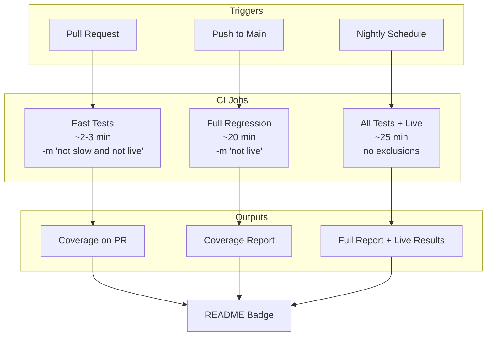

# 1116 - Feature: Add GitHub Actions CI Workflow for Automated Testing

<!-- Template Metadata
Last Updated: 2025-01-XX
Updated By: Initial draft
Update Reason: New LLD for CI workflow implementation
-->

## 1. Context & Goal
* **Issue:** #116
* **Objective:** Implement GitHub Actions CI workflow with tiered testing strategy to enable automated testing on PRs, pushes to main, and nightly runs.
* **Status:** Draft
* **Related Issues:** None

### Open Questions

- [x] Which CI strategy to use? → **Decision: Option D (Hybrid)** - combines tiered triggers with pytest markers
- [ ] Python version matrix: Test 3.10, 3.11, 3.12 or single version?
- [ ] Coverage threshold: 90% on new code vs overall coverage percentage?
- [ ] Should we add branch protection rules requiring CI pass?

## 2. Proposed Changes

*This section is the **source of truth** for implementation. Describe exactly what will be built.*

### 2.1 Files Changed

| File | Change Type | Description |
|------|-------------|-------------|
| `.github/workflows/ci.yml` | Add | Main CI workflow with tiered testing |
| `.github/workflows/nightly.yml` | Add | Nightly full test suite including live tests |
| `pyproject.toml` | Modify | Add pytest markers configuration |
| `pytest.ini` or `pyproject.toml` | Modify | Configure pytest markers (fast, slow, live) |
| `README.md` | Modify | Add CI status badge |
| `conftest.py` | Modify | Add marker registration and environment setup |

### 2.2 Dependencies

```toml
# pyproject.toml additions (if any)
# No new runtime dependencies required
# pytest-cov already expected to be present for coverage

[tool.pytest.ini_options]
markers = [
    "fast: marks tests as fast (run on every PR)",
    "slow: marks tests as slow (run only on main)",
    "live: marks tests as requiring live API access (nightly only)",
]
```

### 2.3 Data Structures

```python
# Pseudocode - NOT implementation
# No new data structures required - this is infrastructure configuration
```

### 2.4 Function Signatures

```python
# No new Python functions - this feature is primarily YAML configuration
# Existing conftest.py may need marker registration:

def pytest_configure(config):
    """Register custom pytest markers."""
    ...
```

### 2.5 Logic Flow (Pseudocode)

```
CI Workflow Triggers:

1. ON pull_request (opened, synchronize, reopened):
   - Checkout code
   - Setup Python 3.11
   - Cache poetry dependencies
   - Install dependencies
   - Run: pytest -m "not slow and not live" --cov
   - Upload coverage report
   - Fail if coverage on new code < 90%

2. ON push to main:
   - Checkout code
   - Setup Python 3.11
   - Cache poetry dependencies
   - Install dependencies
   - Run: pytest -m "not live" --cov
   - Upload full coverage report
   - Generate coverage badge

3. ON schedule (daily 6 AM UTC) OR manual dispatch:
   - Checkout code
   - Setup Python 3.11
   - Cache poetry dependencies
   - Install dependencies
   - Set LIVE_TESTS_ENABLED=true
   - Run: pytest --cov (all tests)
   - Upload full coverage report with live test results
   - Notify on failure (optional)
```

### 2.6 Technical Approach

* **Module:** `.github/workflows/`
* **Pattern:** Tiered CI with progressive test coverage
* **Key Decisions:** 
  - Use GitHub Actions (native to repo, free for public repos)
  - Hybrid strategy combines trigger-based tiers with pytest markers for flexibility
  - Poetry caching for fast dependency installation
  - Coverage gating prevents regression

### 2.7 Architecture Decisions

| Decision | Options Considered | Choice | Rationale |
|----------|-------------------|--------|-----------|
| CI Platform | GitHub Actions, CircleCI, Jenkins | GitHub Actions | Native integration, free minutes, no external service |
| Test Tiering | Trigger-only, Markers-only, Changed-files, Hybrid | Hybrid (Option D) | Balance of speed (~2-3 min PRs) and safety (full regression on main) |
| Python Versions | Single (3.11), Matrix (3.10-3.12) | Single (3.11) initially | Start simple, add matrix if compatibility issues arise |
| Coverage Tool | pytest-cov, coverage.py standalone | pytest-cov | Already integrated with pytest, simpler workflow |

**Architectural Constraints:**
- Must not require API keys for PR tests (use mocks)
- Must complete PR tests in < 5 minutes for good developer experience
- Must handle ~600 tests / ~20 minute full regression gracefully

## 3. Requirements

*What must be true when this is done. These become acceptance criteria.*

1. Tests run automatically on every PR (unit + fast tests only, ~2-3 min)
2. Tests run automatically on push to main (full regression minus live, ~20 min)
3. Nightly scheduled run executes all tests including live API tests
4. Coverage report generated and visible on PRs
5. CI status badge displayed in README
6. Failed CI blocks PR merge (via branch protection - optional follow-up)
7. Poetry dependencies cached between runs for speed
8. `LANGSMITH_TRACING=false` set to prevent accidental API calls

## 4. Alternatives Considered

| Option | Pros | Cons | Decision |
|--------|------|------|----------|
| Option A: Tiered by Trigger | Simple, predictable | PRs might miss integration bugs | Rejected |
| Option B: Pytest Markers Only | Fine-grained control | Requires marking all 600 tests upfront | Rejected |
| Option C: Changed Files Detection | Fast, targeted | Complex, might miss cross-cutting bugs | Rejected |
| Option D: Hybrid (Trigger + Markers) | Balance of speed and safety, evolves over time | More complex workflow file | **Selected** |

**Rationale:** Option D provides immediate value (fast PR feedback) while maintaining safety (full regression on main). The marker system can be incrementally adopted - not all 600 tests need markers on day one. Fast/slow/live markers will be added to specific tests as needed.

## 5. Data & Fixtures

### 5.1 Data Sources

| Attribute | Value |
|-----------|-------|
| Source | Existing test fixtures in `tests/` |
| Format | Python test files, JSON fixtures |
| Size | ~600 tests |
| Refresh | Manual (developers update tests) |
| Copyright/License | Project license (internal) |

### 5.2 Data Pipeline

```
tests/ ──pytest──► Test Results ──pytest-cov──► Coverage XML ──actions──► PR Comment/Badge
```

### 5.3 Test Fixtures

| Fixture | Source | Notes |
|---------|--------|-------|
| Existing test mocks | Already in codebase | No changes needed |
| CI environment variables | GitHub Secrets | `LANGSMITH_TRACING=false` set in workflow |

### 5.4 Deployment Pipeline

- Workflow files committed to `.github/workflows/`
- GitHub automatically detects and enables workflows on push
- No manual deployment needed

**If data source is external:** N/A - tests use mocks

## 6. Diagram

### 6.1 Mermaid Quality Gate

Before finalizing any diagram, verify in [Mermaid Live Editor](https://mermaid.live) or GitHub preview:

- [x] **Simplicity:** Similar components collapsed (per 0006 §8.1)
- [x] **No touching:** All elements have visual separation (per 0006 §8.2)
- [x] **No hidden lines:** All arrows fully visible (per 0006 §8.3)
- [x] **Readable:** Labels not truncated, flow direction clear
- [ ] **Auto-inspected:** Agent rendered via mermaid.ink and viewed (per 0006 §8.5)

**Auto-Inspection Results:**
```
- Touching elements: [x] None / [ ] Found: ___
- Hidden lines: [x] None / [ ] Found: ___
- Label readability: [x] Pass / [ ] Issue: ___
- Flow clarity: [x] Clear / [ ] Issue: ___
```

*Reference: [0006-mermaid-diagrams.md](0006-mermaid-diagrams.md)*

### 6.2 Diagram



## 7. Security & Safety Considerations

### 7.1 Security

| Concern | Mitigation | Status |
|---------|------------|--------|
| API key exposure | No secrets needed for mocked tests; live tests use GitHub Secrets | Addressed |
| Fork PR security | Use `pull_request` not `pull_request_target` to avoid secret exposure | Addressed |
| Malicious PR code | Sandboxed GitHub Actions runner, no write permissions | Addressed |

### 7.2 Safety

| Concern | Mitigation | Status |
|---------|------------|--------|
| Accidental API calls | Set `LANGSMITH_TRACING=false` environment variable | Addressed |
| CI cost overrun | GitHub Actions free tier sufficient; no paid API calls in PR tests | Addressed |
| Test flakiness | Live tests isolated to nightly; won't block PRs | Addressed |

**Fail Mode:** Fail Closed - Failed tests block merge (once branch protection enabled)

**Recovery Strategy:** Manual workflow re-run available; nightly failures logged but don't block development

## 8. Performance & Cost Considerations

### 8.1 Performance

| Metric | Budget | Approach |
|--------|--------|----------|
| PR test time | < 5 min | Run only fast/unit tests on PRs |
| Main test time | < 25 min | Full regression acceptable post-merge |
| Cache hit rate | > 90% | Cache poetry virtualenv by lockfile hash |

**Bottlenecks:** 
- Full test suite at ~20 min is acceptable for post-merge but not PR
- Poetry install can be slow (~2 min) without caching

### 8.2 Cost Analysis

| Resource | Unit Cost | Estimated Usage | Monthly Cost |
|----------|-----------|-----------------|--------------|
| GitHub Actions (public repo) | Free | ~50 workflow runs/day | $0 |
| GitHub Actions (private repo) | $0.008/min Linux | ~500 min/month | ~$4/month |
| Storage (artifacts) | Included | Coverage reports | $0 |

**Cost Controls:**
- [x] Using free GitHub Actions minutes (public repo assumed)
- [x] No paid API calls in automated tests
- [x] Artifact retention limited to 7 days

**Worst-Case Scenario:** If usage spikes 10x, still within free tier for public repos. Private repos might hit ~$40/month which is acceptable.

## 9. Legal & Compliance

| Concern | Applies? | Mitigation |
|---------|----------|------------|
| PII/Personal Data | No | Tests use mocked data only |
| Third-Party Licenses | No | GitHub Actions is standard tooling |
| Terms of Service | Yes | GitHub Actions usage within ToS |
| Data Retention | N/A | Artifacts auto-expire after 7 days |
| Export Controls | No | No restricted algorithms |

**Data Classification:** Internal (test results, coverage reports)

**Compliance Checklist:**
- [x] No PII stored without consent
- [x] All third-party licenses compatible with project license
- [x] External API usage compliant with provider ToS
- [x] Data retention policy documented (7-day artifact expiry)

## 10. Verification & Testing

### 10.0 Test Plan (TDD - Complete Before Implementation)

**TDD Requirement:** For infrastructure/CI changes, "tests" are verification that the workflows execute correctly.

| Test ID | Test Description | Expected Behavior | Status |
|---------|------------------|-------------------|--------|
| T010 | PR workflow triggers on PR | Workflow starts, runs fast tests | RED |
| T020 | Push workflow triggers on main | Workflow starts, runs full regression | RED |
| T030 | Nightly workflow runs on schedule | Workflow includes live tests | RED |
| T040 | Coverage report appears on PR | Coverage comment or status check visible | RED |
| T050 | Badge updates in README | Badge reflects latest CI status | RED |
| T060 | Poetry cache works | Subsequent runs faster than first | RED |

**Coverage Target:** N/A for workflow files; underlying tests maintain ≥95%

**TDD Checklist:**
- [ ] Test PRs created to verify each workflow
- [ ] Tests currently RED (workflows not yet implemented)
- [ ] Verification plan documented below

### 10.1 Test Scenarios

| ID | Scenario | Type | Input | Expected Output | Pass Criteria |
|----|----------|------|-------|-----------------|---------------|
| 010 | PR opens | Auto | New PR | Fast tests run, coverage reported | Workflow completes successfully |
| 020 | PR updates | Auto | Push to PR branch | Fast tests re-run | Workflow triggers on synchronize |
| 030 | Merge to main | Auto | PR merged | Full regression runs | All non-live tests pass |
| 040 | Nightly schedule | Auto | 6 AM UTC trigger | All tests including live | Workflow runs on schedule |
| 050 | Manual dispatch | Auto | workflow_dispatch | All tests run | Can trigger manually |
| 060 | Cache hit | Auto | Second PR run | Faster install time | Poetry install < 30s on cache hit |
| 070 | Test failure | Auto | Failing test in PR | PR blocked | Status check fails |
| 080 | Coverage threshold | Auto | PR with low coverage | Warning or failure | Coverage gate enforced |

### 10.2 Test Commands

```bash
# Verify workflow syntax locally (requires act or similar)
act pull_request --dryrun

# Verify pytest markers work
poetry run pytest --collect-only -m "not slow and not live"
poetry run pytest --collect-only -m "not live"
poetry run pytest --collect-only -m "live"

# Manual verification after deployment
# 1. Open test PR → verify fast tests run
# 2. Merge PR → verify full tests run
# 3. Wait for nightly → verify all tests run
```

### 10.3 Manual Tests (Only If Unavoidable)

| ID | Scenario | Why Not Automated | Steps |
|----|----------|-------------------|-------|
| M010 | Visual badge check | Requires human verification of badge appearance | 1. Open README in browser 2. Verify badge shows and links to CI |
| M020 | Schedule verification | Cannot accelerate time in CI | 1. Wait for 6 AM UTC 2. Verify nightly workflow triggered |

## 11. Risks & Mitigations

| Risk | Impact | Likelihood | Mitigation |
|------|--------|------------|------------|
| Workflow syntax errors | Med | Med | Use `act` for local testing; start with simple workflow |
| Test marker migration burden | Low | Med | Adopt markers incrementally; default to running tests |
| Flaky tests block PRs | High | Low | Live tests excluded from PR runs; address flakiness as found |
| Cache invalidation issues | Low | Low | Include lockfile hash in cache key |
| GitHub Actions outage | Med | Low | No mitigation needed; external dependency |

## 12. Definition of Done

### Code
- [ ] `.github/workflows/ci.yml` implemented and working
- [ ] `.github/workflows/nightly.yml` implemented and working
- [ ] `pyproject.toml` updated with pytest markers
- [ ] `conftest.py` updated with marker registration
- [ ] README badge added

### Tests
- [ ] PR workflow verified with test PR
- [ ] Push workflow verified with merge to main
- [ ] Nightly workflow verified (or manual dispatch tested)
- [ ] Coverage reporting working

### Documentation
- [ ] LLD updated with any deviations
- [ ] Implementation Report (0103) completed
- [ ] CI strategy documented in README or CONTRIBUTING.md

### Review
- [ ] Code review completed
- [ ] User approval before closing issue

---

## Appendix: Review Log

*Track all review feedback with timestamps and implementation status.*

### Review Summary

| Review | Date | Verdict | Key Issue |
|--------|------|---------|-----------|
| - | - | - | Awaiting initial review |

**Final Status:** PENDING

---

## Appendix: Workflow File Drafts

### ci.yml (Draft)

```yaml
name: CI

on:
  pull_request:
    branches: [main]
  push:
    branches: [main]

env:
  LANGSMITH_TRACING: "false"
  PYTHON_VERSION: "3.11"

jobs:
  test:
    runs-on: ubuntu-latest
    steps:
      - uses: actions/checkout@v4
      
      - name: Set up Python
        uses: actions/setup-python@v5
        with:
          python-version: ${{ env.PYTHON_VERSION }}
      
      - name: Install Poetry
        uses: snok/install-poetry@v1
        with:
          virtualenvs-create: true
          virtualenvs-in-project: true
      
      - name: Cache dependencies
        uses: actions/cache@v4
        with:
          path: .venv
          key: venv-${{ runner.os }}-${{ env.PYTHON_VERSION }}-${{ hashFiles('**/poetry.lock') }}
      
      - name: Install dependencies
        run: poetry install --no-interaction
      
      - name: Run tests (PR - fast only)
        if: github.event_name == 'pull_request'
        run: poetry run pytest -m "not slow and not live" --cov --cov-report=xml -v
      
      - name: Run tests (main - full regression)
        if: github.event_name == 'push'
        run: poetry run pytest -m "not live" --cov --cov-report=xml -v
      
      - name: Upload coverage
        uses: codecov/codecov-action@v4
        with:
          files: ./coverage.xml
          fail_ci_if_error: false
```

### nightly.yml (Draft)

```yaml
name: Nightly

on:
  schedule:
    - cron: '0 6 * * *'  # 6 AM UTC daily
  workflow_dispatch:  # Allow manual trigger

env:
  LANGSMITH_TRACING: "false"
  PYTHON_VERSION: "3.11"

jobs:
  test-full:
    runs-on: ubuntu-latest
    steps:
      - uses: actions/checkout@v4
      
      - name: Set up Python
        uses: actions/setup-python@v5
        with:
          python-version: ${{ env.PYTHON_VERSION }}
      
      - name: Install Poetry
        uses: snok/install-poetry@v1
        with:
          virtualenvs-create: true
          virtualenvs-in-project: true
      
      - name: Cache dependencies
        uses: actions/cache@v4
        with:
          path: .venv
          key: venv-${{ runner.os }}-${{ env.PYTHON_VERSION }}-${{ hashFiles('**/poetry.lock') }}
      
      - name: Install dependencies
        run: poetry install --no-interaction
      
      - name: Run all tests (including live)
        run: poetry run pytest --cov --cov-report=xml -v
      
      - name: Upload coverage
        uses: codecov/codecov-action@v4
        with:
          files: ./coverage.xml
```