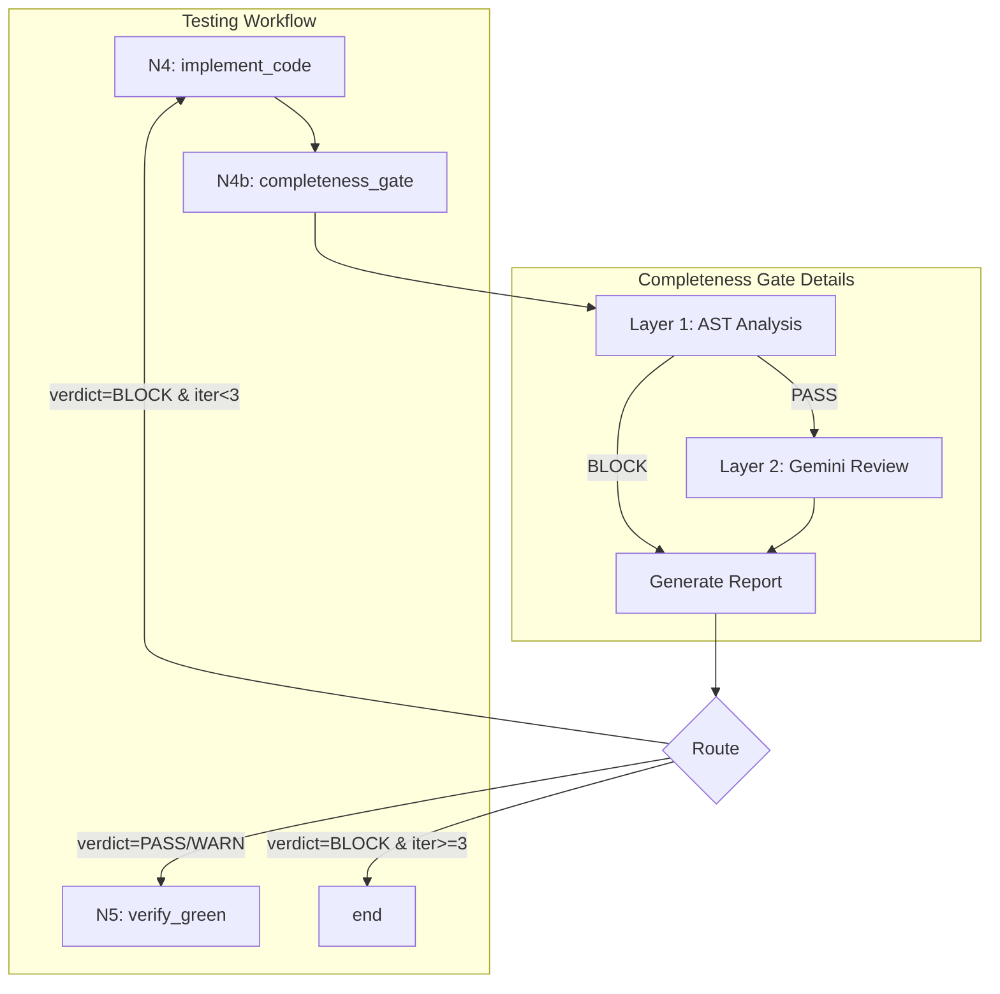

# Implementation Request: assemblyzero/workflows/testing/completeness/report_generator.py

## Task

Write the complete contents of `assemblyzero/workflows/testing/completeness/report_generator.py`.

Change type: Add
Description: Generate implementation verification reports

## LLD Specification

# 147 - Feature: Implementation Completeness Gate (Anti-Stub Detection)

## 1. Context & Goal
* **Issue:** #147
* **Objective:** Add a completeness gate (N4b) between implementation and verification nodes to detect semantically incomplete implementations that pass mechanical tests but fail to fulfill LLD requirements.
* **Status:** Approved (gemini-3-pro-preview, 2026-02-16)
* **Related Issues:** #181 (subsumed - Implementation Report), #335 (N2.5 precedent), #225 (skipped test enforcement), #354 (mutation testing - future), #149-#156 (codebase scan findings - closed)

### Open Questions
*All questions resolved per Gemini review.*

- [x] ~~Should the Gemini semantic review have a configurable timeout for budget control?~~ **RESOLVED: Yes. Implement a default timeout (30s) in the Gemini client configuration to prevent hanging processes and budget drain.**
- [x] ~~What is the maximum number of N4→N4b→N4 iterations before escalating to human review vs hard stop?~~ **RESOLVED: Set a hard limit of 3 iterations. If the loop persists, route to `end` (Fail) to force manual intervention rather than spiraling costs.**

## 2. Proposed Changes

*This section is the **source of truth** for implementation. Describe exactly what will be built.*

### 2.1 Files Changed

| File | Change Type | Description |
|------|-------------|-------------|
| `assemblyzero/workflows/testing/completeness/` | Add (Directory) | Package directory for completeness analysis |
| `assemblyzero/workflows/testing/completeness/__init__.py` | Add | Package init with exports |
| `assemblyzero/workflows/testing/completeness/ast_analyzer.py` | Add | Layer 1 AST-based analysis functions |
| `assemblyzero/workflows/testing/completeness/report_generator.py` | Add | Generate implementation verification reports |
| `assemblyzero/workflows/testing/nodes/completeness_gate.py` | Add | N4b workflow node implementation |
| `tests/unit/test_completeness_gate.py` | Add | Unit and integration tests for completeness gate |
| `assemblyzero/workflows/testing/graph.py` | Modify | Insert N4b node between N4 and N5, add routing |
| `assemblyzero/workflows/testing/state.py` | Modify | Add completeness_verdict and completeness_issues fields |
| `assemblyzero/workflows/testing/nodes/__init__.py` | Modify | Export completeness_gate node |

### 2.1.1 Path Validation (Mechanical - Auto-Checked)

*Issue #277: Before human or Gemini review, paths are verified programmatically.*

Mechanical validation automatically checks:
- All "Modify" files must exist in repository
- All "Delete" files must exist in repository
- All "Add" files must have existing parent directories
- No placeholder prefixes (`src/`, `lib/`, `app/`) unless directory exists

**If validation fails, the LLD is BLOCKED before reaching review.**

### 2.2 Dependencies

*No new packages required. Uses standard library `ast` module.*

```toml
# pyproject.toml additions (if any)
# None - uses stdlib ast module
```

### 2.3 Data Structures

```python
# Pseudocode - NOT implementation
from enum import Enum

class CompletenessCategory(Enum):
    """Categories of completeness issues for type safety."""
    DEAD_CLI_FLAG = "dead_cli_flag"
    EMPTY_BRANCH = "empty_branch"
    DOCSTRING_ONLY = "docstring_only"
    TRIVIAL_ASSERTION = "trivial_assertion"
    UNUSED_IMPORT = "unused_import"

class CompletenessIssue(TypedDict):
    """Single completeness issue detected by analysis."""
    category: CompletenessCategory
    file_path: str
    line_number: int
    description: str
    severity: Literal["ERROR", "WARNING"]

class CompletenessResult(TypedDict):
    """Result of completeness analysis."""
    verdict: Literal["PASS", "WARN", "BLOCK"]
    issues: list[CompletenessIssue]
    ast_analysis_ms: int
    gemini_review_ms: int | None

class RequirementVerification(TypedDict):
    """Single LLD requirement verification status."""
    requirement_id: int
    requirement_text: str
    status: Literal["IMPLEMENTED", "PARTIAL", "MISSING"]
    evidence: str  # File:line or explanation

class ImplementationReport(TypedDict):
    """Full implementation verification report."""
    issue_number: int
    requirements: list[RequirementVerification]
    completeness_result: CompletenessResult
    generated_at: str  # ISO timestamp

class ReviewMaterials(TypedDict):
    """Materials prepared for Gemini semantic review."""
    lld_requirements: list[tuple[int, str]]  # (id, text) pairs
    code_snippets: dict[str, str]  # file_path -> relevant code
    issue_number: int

# State additions
class TestingState(TypedDict):
    # ... existing fields ...
    completeness_verdict: Literal["PASS", "WARN", "BLOCK", ""]
    completeness_issues: list[CompletenessIssue]
    implementation_report_path: str  # From #181
    review_materials: ReviewMaterials | None  # For Gemini Layer 2
```

### 2.4 Function Signatures

```python
# assemblyzero/workflows/testing/completeness/ast_analyzer.py

def analyze_dead_cli_flags(source_code: str, file_path: str) -> list[CompletenessIssue]:
    """Detect argparse add_argument calls with no corresponding usage."""
    ...

def analyze_empty_branches(source_code: str, file_path: str) -> list[CompletenessIssue]:
    """Detect if/elif/else branches with only pass, return None, or trivial bodies."""
    ...

def analyze_docstring_only_functions(source_code: str, file_path: str) -> list[CompletenessIssue]:
    """Detect functions with docstring + pass/return None only."""
    ...

def analyze_trivial_assertions(source_code: str, file_path: str) -> list[CompletenessIssue]:
    """Detect test functions where sole assertion is 'is not None' or similar."""
    ...

def analyze_unused_imports(source_code: str, file_path: str) -> list[CompletenessIssue]:
    """Detect imports with no usage in function bodies."""
    ...

def run_ast_analysis(files: list[Path], max_file_size_bytes: int = 1_000_000) -> CompletenessResult:
    """Run all AST checks on provided files. Skip files exceeding max_file_size_bytes."""
    ...


# assemblyzero/workflows/testing/completeness/report_generator.py

def generate_implementation_report(
    issue_number: int,
    lld_path: Path,
    implementation_files: list[Path],
    completeness_result: CompletenessResult,
) -> Path:
    """Generate implementation report to docs/reports/active/{issue}-implementation-report.md."""
    ...

def extract_lld_requirements(lld_path: Path) -> list[tuple[int, str]]:
    """Parse Section 3 requirements from LLD markdown."""
    ...

def prepare_review_materials(
    issue_number: int,
    lld_path: Path,
    implementation_files: list[Path],
) -> ReviewMaterials:
    """Prepare materials for Gemini semantic review submission by orchestrator."""
    ...


# assemblyzero/workflows/testing/nodes/completeness_gate.py

def completeness_gate(state: TestingState) -> TestingState:
    """N4b: Verify implementation completeness before proceeding to test verification."""
    ...

def route_after_completeness_gate(state: TestingState) -> Literal["N5_verify_green", "N4_implement_code", "end"]:
    """Route based on completeness verdict and iteration count."""
    ...
```

### 2.5 Logic Flow (Pseudocode)

```
N4b_completeness_gate:
1. Receive state from N4_implement_code
2. Collect modified/created files from state.files_changed

3. LAYER 1: AST Analysis
   FOR each file in implementation files:
     - Skip if file exceeds max_file_size_bytes (1MB default)
     - Run analyze_dead_cli_flags()
     - Run analyze_empty_branches()
     - Run analyze_docstring_only_functions()
     - Run analyze_unused_imports()
   FOR each test file:
     - Run analyze_trivial_assertions()
   
   Aggregate issues with severity

4. IF Layer 1 has BLOCK-level issues:
   - Set verdict = "BLOCK"
   - Skip Layer 2
   ELSE:
   
5. LAYER 2: Gemini Semantic Review (orchestrator-controlled)
   - Extract requirements from LLD Section 3
   - Prepare review materials via prepare_review_materials()
   - Set state.review_materials with prepared materials
   - Return state with review_materials for orchestrator
   - Orchestrator submits to Gemini (with 30s timeout)
   - Receive Gemini verdict

6. Generate implementation report
   - Write to docs/reports/active/{issue}-implementation-report.md
   - Set state.implementation_report_path

7. Update state:
   - state.completeness_verdict = verdict
   - state.completeness_issues = all_issues

8. Return state

route_after_completeness_gate:
1. IF verdict == "BLOCK":
   - IF iteration_count >= 3: return "end"  # Hard limit
   - ELSE: return "N4_implement_code"
2. ELSE:
   - return "N5_verify_green"
```

### 2.6 Technical Approach

* **Module:** `assemblyzero/workflows/testing/completeness/`
* **Pattern:** Two-layer validation (fast deterministic → slow semantic)
* **Key Decisions:**
  - AST analysis runs first as a fast, deterministic gate
  - Gemini review only triggers if AST passes (cost control)
  - Orchestrator controls Gemini submission per WORKFLOW.md
  - Report generation is a side effect, not blocking
  - File size limit (1MB) prevents memory spikes on large generated files

### 2.7 Architecture Decisions

| Decision | Options Considered | Choice | Rationale |
|----------|-------------------|--------|-----------|
| Analysis ordering | Parallel layers, Sequential layers | Sequential (AST then Gemini) | AST is fast/free; skip expensive Gemini if AST fails |
| AST implementation | Tree-sitter, Python ast, LibCST | Python ast | Zero dependencies, sufficient for our patterns |
| Report storage | Database, S3, Local markdown | Local markdown | Consistent with existing report patterns |
| Loop limit | Hardcoded, Configurable, Unlimited | Hardcoded at 3 | Prevents cost spiral; simple to understand |
| Issue categories | String literals, Enum | Enum (CompletenessCategory) | Type safety, IDE support, refactoring ease |
| File size limit | None, Configurable, Hardcoded | Configurable with 1MB default | Prevents memory spikes while allowing override |

**Architectural Constraints:**
- Must integrate with existing LangGraph workflow structure
- Gemini calls must go through orchestrator (not direct from node)
- Cannot modify N4 or N5 node logic (only add N4b between them)

## 3. Requirements

*What must be true when this is done. These become acceptance criteria.*

1. N4b node inserted into workflow graph between N4 and N5
2. AST analyzer detects dead CLI flags (add_argument without usage)
3. AST analyzer detects empty conditional branches (if x: pass)
4. AST analyzer detects docstring-only functions
5. AST analyzer detects trivial assertions in test files
6. AST analyzer detects unused imports from implementation
7. BLOCK verdict routes back to N4 for re-implementation
8. PASS/WARN verdict routes forward to N5
9. Implementation report generated at docs/reports/active/{issue}-implementation-report.md
10. Report includes LLD requirement verification table
11. Report includes completeness analysis summary
12. Max iteration limit (3) prevents infinite loops
13. Layer 2 Gemini review materials prepared correctly for orchestrator submission (not direct call)

## 4. Alternatives Considered

| Option | Pros | Cons | Decision |
|--------|------|------|----------|
| AST-only gate (no Gemini) | Fast, deterministic, zero cost | Misses semantic incompleteness | **Rejected** |
| Gemini-only gate (no AST) | Catches semantic issues | Expensive, slow, non-deterministic | **Rejected** |
| Two-layer approach | Best of both, cost-controlled | More complex implementation | **Selected** |
| Integrate into N4 node | Simpler graph | Violates single-responsibility | **Rejected** |
| Post-N5 check | Catches test-passing stubs | Late in pipeline, wastes test runs | **Rejected** |

**Rationale:** Two-layer approach provides deterministic fast-fail for obvious issues while preserving expensive semantic review for subtle completeness problems. Inserting as N4b maintains node separation.

## 5. Data & Fixtures

*Per [0108-lld-pre-implementation-review.md](0108-lld-pre-implementation-review.md) - complete this section BEFORE implementation.*

### 5.1 Data Sources

| Attribute | Value |
|-----------|-------|
| Source | Local filesystem (implementation files, LLD) |
| Format | Python source code, Markdown |
| Size | ~10-50 files per workflow run |
| Refresh | Per-workflow-run |
| Copyright/License | N/A - internal project files |

### 5.2 Data Pipeline

```
Implementation Files ──ast.parse──► AST Trees ──analyze──► CompletenessIssues
LLD Markdown ──parse──► Requirements ──compare──► RequirementVerification
CompletenessIssues + RequirementVerification ──format──► Implementation Report (Markdown)
LLD + Code ──prepare_review_materials──► ReviewMaterials (for Orchestrator)
```

### 5.3 Test Fixtures

| Fixture | Source | Notes |
|---------|--------|-------|
| Dead CLI flag example | Generated | Synthetic argparse code with unused flags |
| Empty branch example | Generated | if/else with pass bodies |
| Docstring-only function | Generated | Functions with docstring + return None |
| Trivial assertion test | Generated | Test with only `assert x is not None` |
| Valid implementation | Generated | Code with no issues (negative test) |
| Patterns from #149-#156 | Extracted | Real issues from codebase scan |
| Sample LLD with requirements | Generated | Markdown with Section 3 requirements |

### 5.4 Deployment Pipeline

Report files are written to local `docs/reports/active/` directory. No external deployment required.

**If data source is external:** N/A - all sources are internal.

## 6. Diagram

### 6.1 Mermaid Quality Gate

Before finalizing any diagram, verify in [Mermaid Live Editor](https://mermaid.live) or GitHub preview:

- [x] **Simplicity:** Similar components collapsed (per 0006 §8.1)
- [x] **No touching:** All elements have visual separation (per 0006 §8.2)
- [x] **No hidden lines:** All arrows fully visible (per 0006 §8.3)
- [x] **Readable:** Labels not truncated, flow direction clear
- [ ] **Auto-inspected:** Agent rendered via mermaid.ink and viewed (per 0006 §8.5)

**Agent Auto-Inspection (MANDATORY):**

AI agents MUST render and view the diagram before committing:
1. Base64 encode diagram → fetch PNG from `https://mermaid.ink/img/{base64}`
2. Read the PNG file (multimodal inspection)
3. Document results below

**Auto-Inspection Results:**
```
- Touching elements: [ ] None / [ ] Found: ___
- Hidden lines: [ ] None / [ ] Found: ___
- Label readability: [ ] Pass / [ ] Issue: ___
- Flow clarity: [ ] Clear / [ ] Issue: ___
```

*Reference: [0006-mermaid-diagrams.md](0006-mermaid-diagrams.md)*

### 6.2 Diagram



## 7. Security & Safety Considerations

### 7.1 Security

| Concern | Mitigation | Status |
|---------|------------|--------|
| Code injection via AST parsing | ast.parse is read-only, no exec | Addressed |
| Path traversal in file collection | Validate files within project root | Addressed |
| Gemini prompt injection | Review materials are code excerpts, not user input | Addressed |

### 7.2 Safety

| Concern | Mitigation | Status |
|---------|------------|--------|
| Infinite loop in N4↔N4b cycle | Hard limit of 3 iterations | Addressed |
| False positive blocks valid code | WARN severity for uncertain detections, only ERROR blocks | Addressed |
| Report overwrite data loss | Reports use unique issue number in filename | Addressed |
| AST parse failure on syntax errors | Catch SyntaxError, report as separate issue | Addressed |
| Memory spike on large files | Skip files exceeding 1MB size limit | Addressed |
| Gemini timeout causing budget drain | 30s timeout configured in Gemini client | Addressed |

**Fail Mode:** Fail Open - If AST analysis fails unexpectedly, proceed to N5 with warning rather than blocking indefinitely.

**Recovery Strategy:** If N4b crashes, state contains completeness_issues=[], verdict="" allowing manual inspection and re-run.

## 8. Performance & Cost Considerations

### 8.1 Performance

| Metric | Budget | Approach |
|--------|--------|----------|
| AST analysis latency | < 500ms for 50 files | Python ast is fast, no I/O; skip files >1MB |
| Gemini review latency | < 30s | Only runs if AST passes; timeout enforced |
| Memory | < 50MB | AST trees are small, process sequentially; skip large files |

**Bottlenecks:** Gemini API call is the slowest component; mitigated by Layer 1 filtering.

### 8.2 Cost Analysis

| Resource | Unit Cost | Estimated Usage | Monthly Cost |
|----------|-----------|-----------------|--------------|
| Gemini API calls | ~$0.01 per review | ~100 reviews/month | ~$1 |
| Local compute | $0 | N/A | $0 |

**Cost Controls:**
- [x] Layer 1 AST analysis gates expensive Gemini calls
- [x] Gemini only called when AST analysis passes
- [x] Hard iteration limit (3) prevents cost spiral
- [x] 30s timeout prevents hanging/runaway Gemini calls

**Worst-Case Scenario:** If Layer 1 has bugs allowing all implementations through, Gemini costs increase proportionally. At $0.01/call, even 10x usage is $10/month. Hard iteration limit caps max calls per issue to 3.

## 9. Legal & Compliance

| Concern | Applies? | Mitigation |
|---------|----------|------------|
| PII/Personal Data | No | Only analyzes code, no user data |
| Third-Party Licenses | No | Uses stdlib ast only |
| Terms of Service | Yes | Gemini usage within existing API agreement |
| Data Retention | No | Reports are project artifacts, not sensitive |
| Export Controls | No | No restricted algorithms |

**Data Classification:** Internal

**Compliance Checklist:**
- [x] No PII stored without consent
- [x] All third-party licenses compatible with project license
- [x] External API usage compliant with provider ToS
- [x] Data retention policy documented (reports persist with project)

## 10. Verification & Testing

*Ref: [0005-testing-strategy-and-protocols.md](0005-testing-strategy-and-protocols.md)*

**Testing Philosophy:** Strive for 100% automated test coverage. Manual tests are a last resort for scenarios that genuinely cannot be automated.

### 10.0 Test Plan (TDD - Complete Before Implementation)

**TDD Requirement:** Tests MUST be written and failing BEFORE implementation begins.

| Test ID | Test Description | Expected Behavior | Status |
|---------|------------------|-------------------|--------|
| T010 | test_detect_dead_cli_flags | Returns issue for unused argparse arg | RED |
| T020 | test_detect_empty_branch_pass | Returns issue for `if x: pass` | RED |
| T030 | test_detect_empty_branch_return_none | Returns issue for `if x: return None` | RED |
| T040 | test_detect_docstring_only_function | Returns issue for func with docstring+pass | RED |
| T050 | test_detect_trivial_assertion | Returns issue for `assert x is not None` only | RED |
| T060 | test_detect_unused_import | Returns issue for import not used in functions | RED |
| T070 | test_valid_code_no_issues | Returns empty issues list for clean code | RED |
| T080 | test_completeness_gate_block_routing | BLOCK verdict routes to N4 | RED |
| T090 | test_completeness_gate_pass_routing | PASS verdict routes to N5 | RED |
| T100 | test_max_iterations_ends | BLOCK at max iterations (3) routes to end | RED |
| T110 | test_report_generation | Report file created with correct structure | RED |
| T120 | test_lld_requirement_extraction | Requirements parsed from Section 3 | RED |
| T130 | test_prepare_review_materials | ReviewMaterials correctly populated with LLD requirements and code snippets | RED |

**Coverage Target:** ≥95% for all new code

**TDD Checklist:**
- [ ] All tests written before implementation
- [ ] Tests currently RED (failing)
- [ ] Test IDs match scenario IDs in 10.1
- [ ] Test file created at: `tests/unit/test_completeness_gate.py`

### 10.1 Test Scenarios

| ID | Scenario | Type | Input | Expected Output | Pass Criteria |
|----|----------|------|-------|-----------------|---------------|
| 010 | Dead CLI flag detection | Auto | Code with `add_argument('--foo')` unused | CompletenessIssue with category=DEAD_CLI_FLAG | Issue returned with correct file/line |
| 020 | Empty branch (pass) detection | Auto | Code with `if x: pass` | CompletenessIssue with category=EMPTY_BRANCH | Issue identifies branch location |
| 030 | Empty branch (return None) detection | Auto | Code with `if mock: return None` | CompletenessIssue with category=EMPTY_BRANCH | Issue identifies branch location |
| 040 | Docstring-only function detection | Auto | `def foo(): """Doc.""" pass` | CompletenessIssue with category=DOCSTRING_ONLY | Issue identifies function |
| 050 | Trivial assertion detection | Auto | Test with only `assert result is not None` | CompletenessIssue with category=TRIVIAL_ASSERTION | Issue warns about assertion quality |
| 060 | Unused import detection | Auto | `import os` with no usage | CompletenessIssue with category=UNUSED_IMPORT | Issue identifies import |
| 070 | Valid implementation (negative) | Auto | Complete implementation code | Empty issues list | No false positives |
| 080 | BLOCK routes to N4 | Auto | State with verdict='BLOCK', iter<3 | Route returns 'N4_implement_code' | Correct routing |
| 090 | PASS routes to N5 | Auto | State with verdict='PASS' | Route returns 'N5_verify_green' | Correct routing |
| 100 | Max iterations ends workflow | Auto | State with verdict='BLOCK', iter>=3 | Route returns 'end' | Prevents infinite loop |
| 110 | Report file generation | Auto | Issue #999, results | File at docs/reports/active/999-implementation-report.md | File exists with correct structure |
| 120 | LLD requirement parsing | Auto | LLD with Section 3 requirements | List of (id, text) tuples | All requirements extracted |
| 130 | Review materials preparation | Auto | LLD path + implementation files | ReviewMaterials with requirements and code snippets | Materials correctly formatted for orchestrator |

### 10.2 Test Commands

```bash
# Run all automated tests
poetry run pytest tests/unit/test_completeness_gate.py -v

# Run only fast/mocked tests (exclude live)
poetry run pytest tests/unit/test_completeness_gate.py -v -m "not live"

# Run with coverage
poetry run pytest tests/unit/test_completeness_gate.py -v --cov=assemblyzero/workflows/testing/completeness --cov-report=term-missing
```

### 10.3 Manual Tests (Only If Unavoidable)

N/A - All scenarios automated.

## 11. Risks & Mitigations

| Risk | Impact | Likelihood | Mitigation |
|------|--------|------------|------------|
| False positives block valid implementations | Med | Med | WARN severity for uncertain patterns; review false positive rate in first sprint |
| AST analysis misses edge cases | Low | Med | Start with high-confidence patterns; add patterns iteratively |
| Gemini semantic review gives inconsistent results | Med | Low | Layer 1 catches most issues; Layer 2 is enhancement |
| Integration breaks existing workflow | High | Low | Comprehensive integration tests; feature flag for rollout |
| Report generation fails silently | Low | Low | Log errors; proceed with verdict regardless of report |
| Memory spike on large files | Med | Low | File size limit (1MB) in run_ast_analysis |

## 12. Definition of Done

### Code
- [ ] Implementation complete and linted
- [ ] Code comments reference this LLD

### Tests
- [ ] All test scenarios pass
- [ ] Test coverage meets threshold (≥95%)

### Documentation
- [ ] LLD updated with any deviations
- [ ] Implementation Report (0103) completed
- [ ] Test Report (0113) completed if applicable

### Review
- [ ] Code review completed
- [ ] User approval before closing issue

### 12.1 Traceability (Mechanical - Auto-Checked)

*Issue #277: Cross-references are verified programmatically.*

Mechanical validation automatically checks:
- Every file mentioned in this section must appear in Section 2.1
- Every risk mitigation in Section 11 should have a corresponding function in Section 2.4 (warning if not)

**If files are missing from Section 2.1, the LLD is BLOCKED.**

---

## Reviewer Suggestions

*Non-blocking recommendations from the reviewer.*

- Ensure the `max_file_size_bytes` check logs a warning when a file is skipped, so the user knows why analysis might be missing for that file.

## Appendix: Review Log

*Track all review feedback with timestamps and implementation status.*

<!-- Note: Timestamps are auto-generated by the workflow. Do not fill in manually. -->

### Gemini Review #1 (REVISE)

**Reviewer:** Gemini 3 Pro
**Verdict:** REVISE

#### Comments

| ID | Comment | Implemented? |
|----|---------|--------------|
| G1.1 | "Coverage is 92.3%. You must add a test case for Requirement 13 (Gemini material preparation) to reach >95%." | YES - Added T130 test scenario for prepare_review_materials |
| G1.2 | "Requirement 13 involves parsing LLDs and formatting code for a prompt. This is error-prone string manipulation that requires a dedicated unit test." | YES - Added prepare_review_materials function signature and T130 test |
| G1.3 | "Consider implementing a size limit on the files sent to ast.parse to prevent memory spikes" | YES - Added max_file_size_bytes parameter to run_ast_analysis (1MB default) |
| G1.4 | "Ensure CompletenessIssue categories are defined as an Enum for better type safety" | YES - Added CompletenessCategory Enum in Section 2.3 |
| G1.5 | "Open question: Gemini timeout" | YES - Resolved: 30s default timeout documented |
| G1.6 | "Open question: Max iterations" | YES - Resolved: Hard limit of 3, routes to end |

### Review Summary

| Review | Date | Verdict | Key Issue |
|--------|------|---------|-----------|
| 2 | 2026-02-16 | APPROVED | `gemini-3-pro-preview` |
| Gemini #1 | 2026-02-16 | REVISE | Test coverage 92.3% - missing REQ-13 test |

**Final Status:** APPROVED

## Tests That Must Pass

```python
# From C:\Users\mcwiz\Projects\AssemblyZero-147\tests\test_issue_147.py
"""Test file for Issue #147.

Generated by AssemblyZero TDD Testing Workflow.
Tests will fail with ImportError until implementation exists (TDD RED phase).
"""

import pytest


# Fixtures for mocking
@pytest.fixture
def mock_external_service():
    """Mock external service for isolation."""
    # TODO: Implement mock
    yield None


# Unit Tests
# -----------

def test_id():
    """
    Test Description | Expected Behavior | Status
    """
    # TDD: Arrange
    # Set up test data

    # TDD: Act
    # Call the function under test

    # TDD: Assert
    # Verify test_id works correctly
    assert False, 'TDD RED: test_id not implemented'


def test_t010():
    """
    test_detect_dead_cli_flags | Returns issue for unused argparse arg |
    RED
    """
    # TDD: Arrange
    # Set up test data

    # TDD: Act
    # Call the function under test

    # TDD: Assert
    # Verify test_t010 works correctly
    assert False, 'TDD RED: test_t010 not implemented'


def test_t020():
    """
    test_detect_empty_branch_pass | Returns issue for `if x: pass` | RED
    """
    # TDD: Arrange
    # Set up test data

    # TDD: Act
    # Call the function under test

    # TDD: Assert
    # Verify test_t020 works correctly
    assert False, 'TDD RED: test_t020 not implemented'


def test_t030():
    """
    test_detect_empty_branch_return_none | Returns issue for `if x:
    return None` | RED
    """
    # TDD: Arrange
    # Set up test data

    # TDD: Act
    # Call the function under test

    # TDD: Assert
    # Verify test_t030 works correctly
    assert False, 'TDD RED: test_t030 not implemented'


def test_t040():
    """
    test_detect_docstring_only_function | Returns issue for func with
    docstring+pass | RED
    """
    # TDD: Arrange
    # Set up test data

    # TDD: Act
    # Call the function under test

    # TDD: Assert
    # Verify test_t040 works correctly
    assert False, 'TDD RED: test_t040 not implemented'


def test_t050():
    """
    test_detect_trivial_assertion | Returns issue for `assert x is not
    None` only | RED
    """
    # TDD: Arrange
    # Set up test data

    # TDD: Act
    # Call the function under test

    # TDD: Assert
    # Verify test_t050 works correctly
    assert False, 'TDD RED: test_t050 not implemented'


def test_t060():
    """
    test_detect_unused_import | Returns issue for import not used in
    functions | RED
    """
    # TDD: Arrange
    # Set up test data

    # TDD: Act
    # Call the function under test

    # TDD: Assert
    # Verify test_t060 works correctly
    assert False, 'TDD RED: test_t060 not implemented'


def test_t070():
    """
    test_valid_code_no_issues | Returns empty issues list for clean code
    | RED
    """
    # TDD: Arrange
    # Set up test data

    # TDD: Act
    # Call the function under test

    # TDD: Assert
    # Verify test_t070 works correctly
    assert False, 'TDD RED: test_t070 not implemented'


def test_t080():
    """
    test_completeness_gate_block_routing | BLOCK verdict routes to N4 |
    RED
    """
    # TDD: Arrange
    # Set up test data

    # TDD: Act
    # Call the function under test

    # TDD: Assert
    # Verify test_t080 works correctly
    assert False, 'TDD RED: test_t080 not implemented'


def test_t090():
    """
    test_completeness_gate_pass_routing | PASS verdict routes to N5 | RED
    """
    # TDD: Arrange
    # Set up test data

    # TDD: Act
    # Call the function under test

    # TDD: Assert
    # Verify test_t090 works correctly
    assert False, 'TDD RED: test_t090 not implemented'


def test_t100():
    """
    test_max_iterations_ends | BLOCK at max iterations (3) routes to end
    | RED
    """
    # TDD: Arrange
    # Set up test data

    # TDD: Act
    # Call the function under test

    # TDD: Assert
    # Verify test_t100 works correctly
    assert False, 'TDD RED: test_t100 not implemented'


def test_t110():
    """
    test_report_generation | Report file created with correct structure |
    RED
    """
    # TDD: Arrange
    # Set up test data

    # TDD: Act
    # Call the function under test

    # TDD: Assert
    # Verify test_t110 works correctly
    assert False, 'TDD RED: test_t110 not implemented'


def test_t120():
    """
    test_lld_requirement_extraction | Requirements parsed from Section 3
    | RED
    """
    # TDD: Arrange
    # Set up test data

    # TDD: Act
    # Call the function under test

    # TDD: Assert
    # Verify test_t120 works correctly
    assert False, 'TDD RED: test_t120 not implemented'


def test_t130():
    """
    test_prepare_review_materials | ReviewMaterials correctly populated
    with LLD requirements and code snippets | RED
    """
    # TDD: Arrange
    # Set up test data

    # TDD: Act
    # Call the function under test

    # TDD: Assert
    # Verify test_t130 works correctly
    assert False, 'TDD RED: test_t130 not implemented'


def test_010():
    """
    Dead CLI flag detection | Auto | Code with `add_argument('--foo')`
    unused | CompletenessIssue with category=DEAD_CLI_FLAG | Issue
    returned with correct file/line
    """
    # TDD: Arrange
    # Set up test data

    # TDD: Act
    # Call the function under test

    # TDD: Assert
    # Verify test_010 works correctly
    assert False, 'TDD RED: test_010 not implemented'


def test_020():
    """
    Empty branch (pass) detection | Auto | Code with `if x: pass` |
    CompletenessIssue with category=EMPTY_BRANCH | Issue identifies branch
    location
    """
    # TDD: Arrange
    # Set up test data

    # TDD: Act
    # Call the function under test

    # TDD: Assert
    # Verify test_020 works correctly
    assert False, 'TDD RED: test_020 not implemented'


def test_030(mock_external_service):
    """
    Empty branch (return None) detection | Auto | Code with `if mock:
    return None` | CompletenessIssue with category=EMPTY_BRANCH | Issue
    identifies branch location
    """
    # TDD: Arrange
    # Set up test data

    # TDD: Act
    # Call the function under test

    # TDD: Assert
    # Verify test_030 works correctly
    assert False, 'TDD RED: test_030 not implemented'


def test_040():
    """
    Docstring-only function detection | Auto | `def foo(): """Doc."""
    pass` | CompletenessIssue with category=DOCSTRING_ONLY | Issue
    identifies function
    """
    # TDD: Arrange
    # Set up test data

    # TDD: Act
    # Call the function under test

    # TDD: Assert
    # Verify test_040 works correctly
    assert False, 'TDD RED: test_040 not implemented'


def test_050():
    """
    Trivial assertion detection | Auto | Test with only `assert result is
    not None` | CompletenessIssue with category=TRIVIAL_ASSERTION | Issue
    warns about assertion quality
    """
    # TDD: Arrange
    # Set up test data

    # TDD: Act
    # Call the function under test

    # TDD: Assert
    # Verify test_050 works correctly
    assert False, 'TDD RED: test_050 not implemented'


def test_060():
    """
    Unused import detection | Auto | `import os` with no usage |
    CompletenessIssue with category=UNUSED_IMPORT | Issue identifies
    import
    """
    # TDD: Arrange
    # Set up test data

    # TDD: Act
    # Call the function under test

    # TDD: Assert
    # Verify test_060 works correctly
    assert False, 'TDD RED: test_060 not implemented'


def test_070():
    """
    Valid implementation (negative) | Auto | Complete implementation code
    | Empty issues list | No false positives
    """
    # TDD: Arrange
    # Set up test data

    # TDD: Act
    # Call the function under test

    # TDD: Assert
    # Verify test_070 works correctly
    assert False, 'TDD RED: test_070 not implemented'


def test_080():
    """
    BLOCK routes to N4 | Auto | State with verdict='BLOCK', iter<3 |
    Route returns 'N4_implement_code' | Correct routing
    """
    # TDD: Arrange
    # Set up test data

    # TDD: Act
    # Call the function under test

    # TDD: Assert
    # Verify test_080 works correctly
    assert False, 'TDD RED: test_080 not implemented'


def test_090():
    """
    PASS routes to N5 | Auto | State with verdict='PASS' | Route returns
    'N5_verify_green' | Correct routing
    """
    # TDD: Arrange
    # Set up test data

    # TDD: Act
    # Call the function under test

    # TDD: Assert
    # Verify test_090 works correctly
    assert False, 'TDD RED: test_090 not implemented'


def test_100():
    """
    Max iterations ends workflow | Auto | State with verdict='BLOCK',
    iter>=3 | Route returns 'end' | Prevents infinite loop
    """
    # TDD: Arrange
    # Set up test data

    # TDD: Act
    # Call the function under test

    # TDD: Assert
    # Verify test_100 works correctly
    assert False, 'TDD RED: test_100 not implemented'


def test_110():
    """
    Report file generation | Auto | Issue #999, results | File at
    docs/reports/active/999-implementation-report.md | File exists with
    correct structure
    """
    # TDD: Arrange
    # Set up test data

    # TDD: Act
    # Call the function under test

    # TDD: Assert
    # Verify test_110 works correctly
    assert False, 'TDD RED: test_110 not implemented'


def test_120():
    """
    LLD requirement parsing | Auto | LLD with Section 3 requirements |
    List of (id, text) tuples | All requirements extracted
    """
    # TDD: Arrange
    # Set up test data

    # TDD: Act
    # Call the function under test

    # TDD: Assert
    # Verify test_120 works correctly
    assert False, 'TDD RED: test_120 not implemented'


def test_130():
    """
    Review materials preparation | Auto | LLD path + implementation files
    | ReviewMaterials with requirements and code snippets | Materials
    correctly formatted for orchestrator
    """
    # TDD: Arrange
    # Set up test data

    # TDD: Act
    # Call the function under test

    # TDD: Assert
    # Verify test_130 works correctly
    assert False, 'TDD RED: test_130 not implemented'


```

## Previously Implemented Files

These files have already been implemented. Use them for imports and references:

### assemblyzero/workflows/testing/completeness/__init__.py (signatures)

```python
"""Completeness analysis for implementation verification.

Issue #147: Implementation Completeness Gate (Anti-Stub Detection)
Related: #181 (Implementation Report), #335 (N2.5 precedent)

This package provides two-layer completeness analysis:
- Layer 1: AST-based deterministic analysis (fast, free)
- Layer 2: Gemini semantic review materials preparation (orchestrator-controlled)

Modules:
- ast_analyzer: Layer 1 AST-based analysis functions
- report_generator: Implementation verification report generation
"""

from assemblyzero.workflows.testing.completeness.ast_analyzer import (
    CompletenessCategory,
    CompletenessIssue,
    CompletenessResult,
    analyze_dead_cli_flags,
    analyze_docstring_only_functions,
    analyze_empty_branches,
    analyze_trivial_assertions,
    analyze_unused_imports,
    run_ast_analysis,
)

from assemblyzero.workflows.testing.completeness.report_generator import (
    ImplementationReport,
    RequirementVerification,
    ReviewMaterials,
    extract_lld_requirements,
    generate_implementation_report,
    prepare_review_materials,
)
```

### assemblyzero/workflows/testing/completeness/ast_analyzer.py (full)

```python
"""Layer 1 AST-based analysis functions for implementation completeness.

Issue #147: Implementation Completeness Gate (Anti-Stub Detection)

Provides deterministic, fast AST-based checks that detect semantically
incomplete implementations:
- Dead CLI flags (argparse add_argument with no usage)
- Empty conditional branches (if/elif/else with only pass/return None)
- Docstring-only functions (functions with docstring + pass/return None)
- Trivial assertions in tests (sole assertion is 'is not None' or similar)
- Unused imports (imports not referenced in function bodies)

These checks form Layer 1 of the two-layer completeness gate. Layer 2
(Gemini semantic review) only runs if Layer 1 passes, for cost control.
"""

from __future__ import annotations

import ast
import logging
import time
from enum import Enum
from pathlib import Path
from typing import Literal, TypedDict

logger = logging.getLogger(__name__)


# =============================================================================
# Data Structures
# =============================================================================


class CompletenessCategory(Enum):
    """Categories of completeness issues for type safety."""

    DEAD_CLI_FLAG = "dead_cli_flag"
    EMPTY_BRANCH = "empty_branch"
    DOCSTRING_ONLY = "docstring_only"
    TRIVIAL_ASSERTION = "trivial_assertion"
    UNUSED_IMPORT = "unused_import"


class CompletenessIssue(TypedDict):
    """Single completeness issue detected by analysis."""

    category: CompletenessCategory
    file_path: str
    line_number: int
    description: str
    severity: Literal["ERROR", "WARNING"]


class CompletenessResult(TypedDict):
    """Result of completeness analysis."""

    verdict: Literal["PASS", "WARN", "BLOCK"]
    issues: list[CompletenessIssue]
    ast_analysis_ms: int
    gemini_review_ms: int | None


# =============================================================================
# Helper Functions
# =============================================================================


def _is_trivial_body(body: list[ast.stmt]) -> bool:
    """Check if a function/branch body is trivial (pass, return None, or ellipsis).

    A body is trivial if it contains only:
    - A docstring (string constant expression)
    - pass statements
    - return None / bare return statements
    - Ellipsis (...)

    Args:
        body: List of AST statement nodes.

    Returns:
        True if the body is trivial.
    """
    for stmt in body:
        # Skip docstrings (string constant expressions)
        if isinstance(stmt, ast.Expr) and isinstance(stmt.value, ast.Constant):
            if isinstance(stmt.value.value, str):
                continue
            # Ellipsis literal
            if stmt.value.value is ...:
                continue

        # pass statement
        if isinstance(stmt, ast.Pass):
            continue

        # return None or bare return
        if isinstance(stmt, ast.Return):
            if stmt.value is None:
                continue
            if isinstance(stmt.value, ast.Constant) and stmt.value.value is None:
                continue

        # If we get here, the statement is non-trivial
        return False

    return True


def _has_docstring(body: list[ast.stmt]) -> bool:
    """Check if a function body starts with a docstring.

    Args:
        body: List of AST statement nodes.

    Returns:
        True if the first statement is a string constant (docstring).
    """
    if not body:
        return False
    first = body[0]
    return (
        isinstance(first, ast.Expr)
        and isinstance(first.value, ast.Constant)
        and isinstance(first.value.value, str)
    )


def _collect_name_references(node: ast.AST) -> set[str]:
    """Collect all Name references within an AST subtree.

    Args:
        node: AST node to walk.

    Returns:
        Set of referenced name strings.
    """
    names: set[str] = set()
    for child in ast.walk(node):
        if isinstance(child, ast.Name):
            names.add(child.id)
        elif isinstance(child, ast.Attribute):
            # Collect the root name of attribute chains (e.g., os.path -> os)
            attr_node = child
            while isinstance(attr_node, ast.Attribute):
                attr_node = attr_node.value
            if isinstance(attr_node, ast.Name):
                names.add(attr_node.id)
    return names


def _extract_argparse_flag_names(call_node: ast.Call) -> list[str]:
    """Extract flag names from an argparse add_argument call.

    Handles patterns like:
    - parser.add_argument('--foo')
    - parser.add_argument('-f', '--foo')
    - parser.add_argument('positional')

    Args:
        call_node: AST Call node for add_argument.

    Returns:
        List of flag/argument names (without -- prefix), or empty if not parseable.
    """
    names = []
    for arg in call_node.args:
        if isinstance(arg, ast.Constant) and isinstance(arg.value, str):
            flag = arg.value.lstrip("-").replace("-", "_")
            if flag:
                names.append(flag)
    # Also check 'dest' keyword
    for kw in call_node.keywords:
        if kw.arg == "dest" and isinstance(kw.value, ast.Constant):
            if isinstance(kw.value.value, str):
                return [kw.value.value]
    return names


# =============================================================================
# Analysis Functions
# =============================================================================


def analyze_dead_cli_flags(
    source_code: str, file_path: str
) -> list[CompletenessIssue]:
    """Detect argparse add_argument calls with no corresponding usage.

    Issue #147, Requirement 2: Detects dead CLI flags where argparse
    arguments are defined but never referenced in the rest of the code.

    Args:
        source_code: Python source code to analyze.
        file_path: Path to the source file (for issue reporting).

    Returns:
        List of CompletenessIssue for each unused argparse argument.
    """
    issues: list[CompletenessIssue] = []

    try:
        tree = ast.parse(source_code)
    except SyntaxError:
        return issues

    # Phase 1: Find all add_argument calls and their flag names
    declared_flags: list[tuple[str, int]] = []  # (flag_name, line_number)

    for node in ast.walk(tree):
        if not isinstance(node, ast.Call):
            continue
        # Match pattern: *.add_argument(...)
        if isinstance(node.func, ast.Attribute) and node.func.attr == "add_argument":
            flag_names = _extract_argparse_flag_names(node)
            for flag_name in flag_names:
                declared_flags.append((flag_name, node.lineno))

    if not declared_flags:
        return issues

    # Phase 2: Collect all name/attribute references in function bodies
    # (excluding the add_argument calls themselves)
    all_references: set[str] = set()

    for node in ast.walk(tree):
        if isinstance(node, (ast.FunctionDef, ast.AsyncFunctionDef)):
            body_refs = _collect_name_references(node)
            all_references.update(body_refs)
        # Also check module-level attribute access (e.g., args.foo)
        if isinstance(node, ast.Attribute):
            if isinstance(node.value, ast.Name):
                all_references.add(node.attr)

    # Also scan raw source for string references to flag names
    # (handles cases like getattr(args, 'flag_name'))
    source_lower = source_code.lower()

    for flag_name, line_no in declared_flags:
        # Check if flag name appears as an attribute access or reference
        # beyond the add_argument declaration itself
        flag_referenced = False

        # Check attribute references (args.flag_name)
        if flag_name in all_references:
            flag_referenced = True

        # Check string references (getattr(args, 'flag_name'))
        if not flag_referenced:
            # Count occurrences - if more than just the declaration, it's used
            occurrences = source_lower.count(flag_name.lower())
            if occurrences > 1:
                flag_referenced = True

        if not flag_referenced:
            issues.append(
                CompletenessIssue(
                    category=CompletenessCategory.DEAD_CLI_FLAG,
                    file_path=file_path,
                    line_number=line_no,
                    description=(
                        f"CLI flag '{flag_name}' is defined via add_argument "
                        f"but never referenced in code"
                    ),
                    severity="ERROR",
                )
            )

    return issues


def analyze_empty_branches(
    source_code: str, file_path: str
) -> list[CompletenessIssue]:
    """Detect if/elif/else branches with only pass, return None, or trivial bodies.

    Issue #147, Requirement 3: Detects conditional branches that contain
    only trivial statements, indicating unfinished implementation.

    Args:
        source_code: Python source code to analyze.
        file_path: Path to the source file (for issue reporting).

    Returns:
        List of CompletenessIssue for each empty branch.
    """
    issues: list[CompletenessIssue] = []

    try:
        tree = ast.parse(source_code)
    except SyntaxError:
        return issues

    for node in ast.walk(tree):
        if not isinstance(node, ast.If):
            continue

        # Check the if body
        if _is_trivial_body(node.body):
            issues.append(
                CompletenessIssue(
                    category=CompletenessCategory.EMPTY_BRANCH,
                    file_path=file_path,
                    line_number=node.lineno,
                    description=(
                        f"Empty 'if' branch at line {node.lineno} — body contains "
                        f"only pass/return None"
                    ),
                    severity="WARNING",
                )
            )

        # Check elif/else branches (stored in node.orelse)
        if node.orelse:
            # If orelse is a single If node, it's an elif — we'll catch it
            # when we walk to that If node. Only check non-If orelse (else blocks).
            if not (len(node.orelse) == 1 and isinstance(node.orelse[0], ast.If)):
                if _is_trivial_body(node.orelse):
                    # else block line number: use the first statement in orelse
                    else_line = node.orelse[0].lineno if node.orelse else node.lineno
                    issues.append(
                        CompletenessIssue(
                            category=CompletenessCategory.EMPTY_BRANCH,
                            file_path=file_path,
                            line_number=else_line,
                            description=(
                                f"Empty 'else' branch at line {else_line} — body "
                                f"contains only pass/return None"
                            ),
                            severity="WARNING",
                        )
                    )

    return issues


def analyze_docstring_only_functions(
    source_code: str, file_path: str
) -> list[CompletenessIssue]:
    """Detect functions with docstring + pass/return None only.

    Issue #147, Requirement 4: Detects functions that have a docstring
    but no real implementation — just pass, return None, or ellipsis.

    Args:
        source_code: Python source code to analyze.
        file_path: Path to the source file (for issue reporting).

    Returns:
        List of CompletenessIssue for each docstring-only function.
    """
    issues: list[CompletenessIssue] = []

    try:
        tree = ast.parse(source_code)
    except SyntaxError:
        return issues

    for node in ast.walk(tree):
        if not isinstance(node, (ast.FunctionDef, ast.AsyncFunctionDef)):
            continue

        # Skip test functions — they're checked by analyze_trivial_assertions
        if node.name.startswith("test_"):
            continue

        # Skip dunder methods that legitimately have trivial bodies
        # (e.g., __init__ with just pass in abstract classes)
        if node.name.startswith("__") and node.name.endswith("__"):
            continue

        # Must have a docstring to qualify as "docstring-only"
        if not _has_docstring(node.body):
            continue

        # Check if body is trivial (docstring + pass/return None)
        if _is_trivial_body(node.body):
            issues.append(
                CompletenessIssue(
                    category=CompletenessCategory.DOCSTRING_ONLY,
                    file_path=file_path,
                    line_number=node.lineno,
                    description=(
                        f"Function '{node.name}' at line {node.lineno} has a "
                        f"docstring but no real implementation (only pass/return None)"
                    ),
                    severity="ERROR",
                )
            )

    return issues


def analyze_trivial_assertions(
    source_code: str, file_path: str
) -> list[CompletenessIssue]:
    """Detect test functions where sole assertion is 'is not None' or similar.

    Issue #147, Requirement 5: Detects test functions that technically
    pass but have assertions so trivial they verify nothing meaningful.

    Trivial assertion patterns:
    - assert x is not None
    - assert result is not None
    - assert True
    - assert 1

    Args:
        source_code: Python source code to analyze.
        file_path: Path to the source file (for issue reporting).

    Returns:
        List of CompletenessIssue for each test with trivial assertions.
    """
    issues: list[CompletenessIssue] = []

    try:
        tree = ast.parse(source_code)
    except SyntaxError:
        return issues

    for node in ast.walk(tree):
        if not isinstance(node, (ast.FunctionDef, ast.AsyncFunctionDef)):
            continue

        # Only check test functions
        if not node.name.startswith("test_"):
            continue

        # Collect all assertions in this function
        assertions: list[ast.Assert] = []
        has_pytest_raises = False

        for child in ast.walk(node):
            if isinstance(child, ast.Assert):
                assertions.append(child)
            # pytest.raises counts as a real assertion
            if isinstance(child, ast.With):
                for item in child.items:
                    if isinstance(item.context_expr, ast.Call):
                        call = item.context_expr
                        if isinstance(call.func, ast.Attribute):
                            if call.func.attr == "raises":
                                has_pytest_raises = True

        if has_pytest_raises:
            continue

        if not assertions:
            continue

        # Check if ALL assertions are trivial
        all_trivial = True
        for assertion in assertions:
            if not _is_trivial_assertion(assertion):
                all_trivial = False
                break

        if all_trivial:
            issues.append(
                CompletenessIssue(
                    category=CompletenessCategory.TRIVIAL_ASSERTION,
                    file_path=file_path,
                    line_number=node.lineno,
                    description=(
                        f"Test '{node.name}' at line {node.lineno} has only "
                        f"trivial assertions (e.g., 'is not None', 'assert True')"
                    ),
                    severity="WARNING",
                )
            )

    return issues


def _is_trivial_assertion(assertion: ast.Assert) -> bool:
    """Check if an assertion is trivial.

    Trivial patterns:
    - assert True
    - assert <constant truthy>
    - assert x is not None
    - assert result is not None

    Args:
        assertion: AST Assert node to check.

    Returns:
        True if the assertion is trivial.
    """
    test = assertion.test

    # assert True / assert 1 / assert "string"
    if isinstance(test, ast.Constant):
        return bool(test.value)  # Only trivial if the constant is truthy

    # assert x is not None  ->  Compare(left=Name, ops=[IsNot], comparators=[Constant(None)])
    if isinstance(test, ast.Compare):
        if len(test.ops) == 1 and len(test.comparators) == 1:
            op = test.ops[0]
            comparator = test.comparators[0]
            if isinstance(op, ast.IsNot) and isinstance(comparator, ast.Constant):
                if comparator.value is None:
                    return True

    # assert not None  ->  UnaryOp(op=Not, operand=Constant(None))
    if isinstance(test, ast.UnaryOp) and isinstance(test.op, ast.Not):
        if isinstance(test.operand, ast.Constant) and test.operand.value is None:
            return True

    return False


def analyze_unused_imports(
    source_code: str, file_path: str
) -> list[CompletenessIssue]:
    """Detect imports with no usage in function bodies.

    Issue #147, Requirement 6: Detects import statements where the
    imported name is never referenced in the module, indicating
    incomplete implementation that imported dependencies but never
    used them.

    Args:
        source_code: Python source code to analyze.
        file_path: Path to the source file (for issue reporting).

    Returns:
        List of CompletenessIssue for each unused import.
    """
    issues: list[CompletenessIssue] = []

    try:
        tree = ast.parse(source_code)
    except SyntaxError:
        return issues

    # Phase 1: Collect all imported names and their line numbers
    imported_names: list[tuple[str, int]] = []  # (name, line_number)

    for node in ast.iter_child_nodes(tree):
        if isinstance(node, ast.Import):
            for alias in node.names:
                name = alias.asname if alias.asname else alias.name
                # For dotted imports (import os.path), use the first component
                name = name.split(".")[0]
                imported_names.append((name, node.lineno))

        elif isinstance(node, ast.ImportFrom):
            # Skip __future__ imports
            if node.module and node.module == "__future__":
                continue
            # Skip wildcard imports
            if node.names and any(alias.name == "*" for alias in node.names):
                continue
            for alias in node.names:
                name = alias.asname if alias.asname else alias.name
                imported_names.append((name, node.lineno))

    if not imported_names:
        return issues

    # Phase 2: Collect all name references in the module (excluding import statements)
    all_references: set[str] = set()

    for node in ast.walk(tree):
        # Skip import nodes themselves
        if isinstance(node, (ast.Import, ast.ImportFrom)):
            continue

        if isinstance(node, ast.Name):
            all_references.add(node.id)
        elif isinstance(node, ast.Attribute):
            # Collect root name of attribute chains
            attr_node = node
            while isinstance(attr_node, ast.Attribute):
                attr_node = attr_node.value
            if isinstance(attr_node, ast.Name):
                all_references.add(attr_node.id)

    # Also check decorators and type annotations as string references
    # (handles TYPE_CHECKING imports used only in annotations)
    for node in ast.walk(tree):
        if isinstance(node, ast.Constant) and isinstance(node.value, str):
            # String annotations may reference imported names
            for imp_name, _ in imported_names:
                if imp_name in node.value:
                    all_references.add(imp_name)

    # Phase 3: Find unused imports
    for imp_name, line_no in imported_names:
        if imp_name not in all_references:
            issues.append(
                CompletenessIssue(
                    category=CompletenessCategory.UNUSED_IMPORT,
                    file_path=file_path,
                    line_number=line_no,
                    description=(
                        f"Import '{imp_name}' at line {line_no} is never used "
                        f"in the module"
                    ),
                    severity="WARNING",
                )
            )

    return issues


# =============================================================================
# Aggregate Analysis
# =============================================================================


def run_ast_analysis(
    files: list[Path],
    max_file_size_bytes: int = 1_000_000,
) -> CompletenessResult:
    """Run all AST checks on provided files.

    Issue #147: Orchestrates all Layer 1 AST-based checks across a set
    of implementation files. Skips files exceeding max_file_size_bytes
    to prevent memory spikes on large generated files.

    Files whose names start with 'test_' are analyzed for trivial
    assertions. All other files are analyzed for dead CLI flags, empty
    branches, docstring-only functions, and unused imports.

    Args:
        files: List of Python file paths to analyze.
        max_file_size_bytes: Skip files larger than this (default 1MB).

    Returns:
        CompletenessResult with verdict, issues, and timing.
    """
    start_ms = time.monotonic_ns() // 1_000_000
    all_issues: list[CompletenessIssue] = []

    for file_path in files:
        # Skip non-Python files
        if file_path.suffix != ".py":
            continue

        # Skip files exceeding size limit
        try:
            file_size = file_path.stat().st_size
        except OSError as e:
            logger.warning("Cannot stat file %s: %s", file_path, e)
            continue

        if file_size > max_file_size_bytes:
            logger.warning(
                "Skipping file %s (%d bytes) — exceeds max_file_size_bytes (%d)",
                file_path,
                file_size,
                max_file_size_bytes,
            )
            continue

        # Read source code
        try:
            source_code = file_path.read_text(encoding="utf-8")
        except (OSError, UnicodeDecodeError) as e:
            logger.warning("Cannot read file %s: %s", file_path, e)
            continue

        # Skip empty files
        if not source_code.strip():
            continue

        # Verify it parses before running checks
        try:
            ast.parse(source_code)
        except SyntaxError as e:
            logger.warning("Syntax error in %s: %s — skipping AST analysis", file_path, e)
            continue

        file_str = str(file_path)
        is_test_file = file_path.name.startswith("test_")

        if is_test_file:
            # Test files: check for trivial assertions
            all_issues.extend(analyze_trivial_assertions(source_code, file_str))
        else:
            # Implementation files: check for all other patterns
            all_issues.extend(analyze_dead_cli_flags(source_code, file_str))
            all_issues.extend(analyze_empty_branches(source_code, file_str))
            all_issues.extend(analyze_docstring_only_functions(source_code, file_str))
            all_issues.extend(analyze_unused_imports(source_code, file_str))

    end_ms = time.monotonic_ns() // 1_000_000
    elapsed_ms = end_ms - start_ms

    # Determine verdict based on issues
    verdict = _determine_verdict(all_issues)

    return CompletenessResult(
        verdict=verdict,
        issues=all_issues,
        ast_analysis_ms=elapsed_ms,
        gemini_review_ms=None,
    )


def _determine_verdict(
    issues: list[CompletenessIssue],
) -> Literal["PASS", "WARN", "BLOCK"]:
    """Determine the overall verdict from a list of issues.

    - BLOCK: Any ERROR-severity issue exists
    - WARN: Only WARNING-severity issues exist
    - PASS: No issues at all

    Args:
        issues: List of completeness issues.

    Returns:
        Verdict string.
    """
    if not issues:
        return "PASS"

    has_error = any(issue["severity"] == "ERROR" for issue in issues)
    if has_error:
        return "BLOCK"

    return "WARN"
```

## Previous Attempt Failed

The previous implementation had this error:

```
============================= test session starts =============================
platform win32 -- Python 3.14.0, pytest-9.0.2, pluggy-1.6.0 -- C:\Users\mcwiz\AppData\Local\pypoetry\Cache\virtualenvs\unleashed-Zukdy2xA-py3.14\Scripts\python.exe
cachedir: .pytest_cache
benchmark: 5.2.3 (defaults: timer=time.perf_counter disable_gc=False min_rounds=5 min_time=0.000005 max_time=1.0 calibration_precision=10 warmup=False warmup_iterations=100000)
rootdir: C:\Users\mcwiz\Projects\AssemblyZero-147
configfile: pyproject.toml
plugins: anyio-4.12.1, langsmith-0.6.9, benchmark-5.2.3, cov-7.0.0
collecting ... collected 0 items / 1 error

=================================== ERRORS ====================================
__________________ ERROR collecting tests/test_issue_147.py ___________________
..\..\AppData\Local\pypoetry\Cache\virtualenvs\unleashed-Zukdy2xA-py3.14\Lib\site-packages\_pytest\python.py:507: in importtestmodule
    mod = import_path(
..\..\AppData\Local\pypoetry\Cache\virtualenvs\unleashed-Zukdy2xA-py3.14\Lib\site-packages\_pytest\pathlib.py:587: in import_path
    importlib.import_module(module_name)
..\..\AppData\Local\Programs\Python\Python314\Lib\importlib\__init__.py:88: in import_module
    return _bootstrap._gcd_import(name[level:], package, level)
           ^^^^^^^^^^^^^^^^^^^^^^^^^^^^^^^^^^^^^^^^^^^^^^^^^^^^
<frozen importlib._bootstrap>:1398: in _gcd_import
    ???
<frozen importlib._bootstrap>:1371: in _find_and_load
    ???
<frozen importlib._bootstrap>:1342: in _find_and_load_unlocked
    ???
<frozen importlib._bootstrap>:938: in _load_unlocked
    ???
..\..\AppData\Local\pypoetry\Cache\virtualenvs\unleashed-Zukdy2xA-py3.14\Lib\site-packages\_pytest\assertion\rewrite.py:188: in exec_module
    source_stat, co = _rewrite_test(fn, self.config)
                      ^^^^^^^^^^^^^^^^^^^^^^^^^^^^^^
..\..\AppData\Local\pypoetry\Cache\virtualenvs\unleashed-Zukdy2xA-py3.14\Lib\site-packages\_pytest\assertion\rewrite.py:357: in _rewrite_test
    tree = ast.parse(source, filename=strfn)
           ^^^^^^^^^^^^^^^^^^^^^^^^^^^^^^^^^
..\..\AppData\Local\Programs\Python\Python314\Lib\ast.py:46: in parse
    return compile(source, filename, mode, flags,
E     File "C:\Users\mcwiz\Projects\AssemblyZero-147\tests\test_issue_147.py", line 295
E       Docstring-only function detection | Auto | `def foo(): """Doc."""
E                                                                 ^^^
E   SyntaxError: invalid syntax
=========================== short test summary info ===========================
ERROR tests/test_issue_147.py
!!!!!!!!!!!!!!!!!!! Interrupted: 1 error during collection !!!!!!!!!!!!!!!!!!!!
============================== 1 error in 0.24s ===============================


```

Fix the issue in your implementation.

## Output Format

Output ONLY the file contents. No explanations, no markdown headers, just the code.

```python
# Your implementation here
```

IMPORTANT:
- Output the COMPLETE file contents
- Do NOT output a summary or description
- Do NOT say "I've implemented..."
- Just output the code in a single code block
