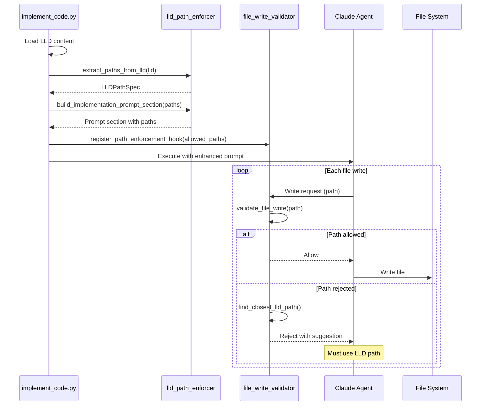

# 188 - Feature: Implementation Workflow Should Enforce File Paths from LLD

<!-- Template Metadata
Last Updated: 2025-01-10
Updated By: Initial LLD creation
Update Reason: New issue addressing file path enforcement in implementation workflow
-->

## 1. Context & Goal
* **Issue:** #188
* **Objective:** Enforce LLD-specified file paths during implementation to prevent Claude from placing files in arbitrary locations
* **Status:** Draft
* **Related Issues:** #177 (evidence of the problem)

### Open Questions

- [x] Should path validation be hard (reject/fail) or soft (warn but allow)? → Hard rejection per issue specification
- [ ] How to handle legitimate cases where LLD paths need modification mid-implementation?

## 2. Proposed Changes

*This section is the **source of truth** for implementation. Describe exactly what will be built.*

### 2.1 Files Changed

| File | Change Type | Description |
|------|-------------|-------------|
| `agentos/workflows/implement_code.py` | Modify | Add LLD path extraction and injection into prompt |
| `agentos/utils/lld_path_enforcer.py` | Add | New module for extracting and validating file paths from LLD |
| `agentos/hooks/file_write_validator.py` | Add | Pre-write hook to reject non-LLD paths |
| `tests/unit/test_lld_path_enforcer.py` | Add | Unit tests for path enforcement |
| `tests/unit/test_file_write_validator.py` | Add | Unit tests for file write validation |

### 2.2 Dependencies

*No new packages required. Uses existing standard library modules.*

```toml
# pyproject.toml additions (if any)
# None - uses pathlib, re from stdlib
```

### 2.3 Data Structures

```python
# Pseudocode - NOT implementation
class LLDPathSpec(TypedDict):
    implementation_files: list[str]  # Paths for main implementation
    test_files: list[str]            # Paths for test files
    config_files: list[str]          # Paths for config/data files
    all_allowed_paths: set[str]      # Combined set for validation

class PathValidationResult(TypedDict):
    allowed: bool                    # Whether the path is permitted
    requested_path: str              # The path that was requested
    closest_match: str | None        # Suggested LLD path if rejected
    reason: str                      # Explanation for allow/reject
```

### 2.4 Function Signatures

```python
# agentos/utils/lld_path_enforcer.py

def extract_paths_from_lld(lld_content: str) -> LLDPathSpec:
    """Extract all file paths specified in LLD Section 2.1."""
    ...

def parse_files_changed_table(markdown_table: str) -> list[tuple[str, str, str]]:
    """Parse the Files Changed markdown table into (path, change_type, description) tuples."""
    ...

def build_implementation_prompt_section(path_spec: LLDPathSpec) -> str:
    """Generate the file path enforcement section for the implementation prompt."""
    ...


# agentos/hooks/file_write_validator.py

def validate_file_write(
    requested_path: str,
    allowed_paths: set[str],
    strict: bool = True
) -> PathValidationResult:
    """Validate a file write request against LLD-specified paths."""
    ...

def find_closest_lld_path(requested_path: str, allowed_paths: set[str]) -> str | None:
    """Find the most similar allowed path for helpful error messages."""
    ...

def register_path_enforcement_hook(allowed_paths: set[str]) -> None:
    """Register the file write validator as a pre-write hook."""
    ...
```

### 2.5 Logic Flow (Pseudocode)

```
IMPLEMENTATION WORKFLOW WITH PATH ENFORCEMENT:

1. Load LLD content for the issue
2. Extract file paths from Section 2.1 (Files Changed table)
   - Parse markdown table
   - Categorize by change type (Add/Modify)
   - Build allowed paths set
3. Generate path enforcement prompt section:
   """
   REQUIRED FILE PATHS (from LLD - do not deviate):
   - path/to/file.py  # Description
   - tests/test_xxx.py  # Tests
   
   Any files written to other paths will be rejected.
   """
4. Inject prompt section into implementation prompt
5. Register file write validator hook with allowed paths
6. Execute implementation

FILE WRITE VALIDATION (on each file write):
1. Receive requested write path
2. Normalize path (resolve relative, remove ./)
3. Check if path in allowed_paths set
4. IF allowed:
   - Return success, permit write
5. ELSE:
   - Find closest matching LLD path
   - Return rejection with helpful message
   - Log rejected write attempt
   - Block the write operation
```

### 2.6 Technical Approach

* **Module:** `agentos/utils/lld_path_enforcer.py`, `agentos/hooks/file_write_validator.py`
* **Pattern:** Pre-write hook pattern with path whitelist
* **Key Decisions:** 
  - Hard rejection (not soft warning) to force compliance
  - Path normalization to handle relative path variations
  - Helpful error messages with closest LLD path suggestion

### 2.7 Architecture Decisions

| Decision | Options Considered | Choice | Rationale |
|----------|-------------------|--------|-----------|
| Validation mode | Soft warning vs Hard rejection | Hard rejection | Issue explicitly requires rejection; warnings were proven ineffective in #177 |
| Path matching | Exact match vs Pattern/glob | Exact match with normalization | LLD specifies exact paths; glob adds complexity without benefit |
| Hook placement | Pre-write hook vs Post-write cleanup | Pre-write hook | Prevent bad writes rather than clean up after; saves iterations |
| Path extraction | Regex vs Markdown parser | Markdown table parser | More robust; handles edge cases in table formatting |

**Architectural Constraints:**
- Must integrate with existing `implement_code.py` workflow
- Must not break existing file write mechanisms for allowed paths
- Must preserve test file scaffolding protection (tests are pre-created, not modified)

## 3. Requirements

*What must be true when this is done. These become acceptance criteria.*

1. Implementation prompt includes explicit file paths extracted from LLD Section 2.1
2. File write validator rejects any writes to paths not in LLD
3. Rejected writes include helpful error message with closest LLD path
4. Iteration count decreases for typical implementations (measurable via #177-style tracking)
5. Test files marked as "DO NOT MODIFY" in prompt when already scaffolded

## 4. Alternatives Considered

| Option | Pros | Cons | Decision |
|--------|------|------|----------|
| Hard rejection of non-LLD paths | Forces compliance, prevents orphaned files | May block legitimate edge cases | **Selected** |
| Soft warning with logging | Less disruptive, allows flexibility | Proven ineffective (#177 evidence) | Rejected |
| Post-write cleanup | Simpler implementation | Wastes iterations, doesn't prevent bad writes | Rejected |
| Pattern-based matching (globs) | More flexible | Adds complexity, unclear specification | Rejected |

**Rationale:** The issue explicitly cites wasted iterations and orphaned files from #177. Only hard rejection addresses the root cause. Soft warnings were implicitly tried (Claude was "told" to use certain paths) and failed across 10 iterations.

## 5. Data & Fixtures

### 5.1 Data Sources

| Attribute | Value |
|-----------|-------|
| Source | LLD markdown files in `.claudeos/lld/` |
| Format | Markdown with structured tables |
| Size | Typically 5-50KB per LLD |
| Refresh | Per-issue, static during implementation |
| Copyright/License | N/A - internal project files |

### 5.2 Data Pipeline

```
LLD File ──parse──► LLDPathSpec ──inject──► Implementation Prompt
                         │
                         └──register──► File Write Hook
```

### 5.3 Test Fixtures

| Fixture | Source | Notes |
|---------|--------|-------|
| Sample LLD with Files Changed table | Generated | Covers standard format |
| LLD with malformed table | Generated | Tests error handling |
| LLD with no Files Changed section | Generated | Tests graceful degradation |

### 5.4 Deployment Pipeline

No external data deployment. All data is local LLD files processed at runtime.

## 6. Diagram

### 6.1 Mermaid Quality Gate

- [x] **Simplicity:** Components minimal and focused
- [x] **No touching:** Visual separation maintained
- [x] **No hidden lines:** All arrows visible
- [x] **Readable:** Labels clear and complete
- [ ] **Auto-inspected:** Pending agent rendering

**Auto-Inspection Results:**
```
- Touching elements: [ ] None / [ ] Found: ___
- Hidden lines: [ ] None / [ ] Found: ___
- Label readability: [ ] Pass / [ ] Issue: ___
- Flow clarity: [ ] Clear / [ ] Issue: ___
```

### 6.2 Diagram



## 7. Security & Safety Considerations

### 7.1 Security

| Concern | Mitigation | Status |
|---------|------------|--------|
| Path traversal in LLD | Normalize and validate all paths; reject `../` patterns | Addressed |
| LLD tampering | LLD files are under version control with PR review | Addressed |

### 7.2 Safety

| Concern | Mitigation | Status |
|---------|------------|--------|
| Blocking legitimate writes | Provide escape hatch via LLD amendment process | Addressed |
| Orphaned partial implementation | Hard rejection prevents partial file scatter | Addressed |
| Test file corruption | Test files marked as protected; writes blocked | Addressed |

**Fail Mode:** Fail Closed - If path validation fails to initialize, block all writes rather than allowing unvalidated writes.

**Recovery Strategy:** If implementation is blocked unexpectedly, update LLD Section 2.1 with required paths and restart.

## 8. Performance & Cost Considerations

### 8.1 Performance

| Metric | Budget | Approach |
|--------|--------|----------|
| Path validation latency | < 1ms per check | Set lookup O(1) |
| LLD parsing | < 100ms | Single pass regex + table parse |
| Memory | < 1MB | Paths stored as string set |

**Bottlenecks:** None expected. Path set is typically < 20 entries.

### 8.2 Cost Analysis

| Resource | Unit Cost | Estimated Usage | Monthly Cost |
|----------|-----------|-----------------|--------------|
| LLM iterations saved | ~$0.10 per iteration | 2-5 iterations per impl | ~$0.50 saved per issue |

**Cost Controls:**
- N/A - This feature reduces costs by preventing wasted iterations

**Worst-Case Scenario:** No cost impact - pure local validation.

## 9. Legal & Compliance

| Concern | Applies? | Mitigation |
|---------|----------|------------|
| PII/Personal Data | No | No personal data processed |
| Third-Party Licenses | No | Uses only stdlib |
| Terms of Service | No | Internal tooling only |
| Data Retention | N/A | No data retained |
| Export Controls | No | No restricted algorithms |

**Data Classification:** Internal

**Compliance Checklist:**
- [x] No PII stored
- [x] All code original or properly licensed
- [x] No external service dependencies

## 10. Verification & Testing

### 10.0 Test Plan (TDD - Complete Before Implementation)

**TDD Requirement:** Tests MUST be written and failing BEFORE implementation begins.

| Test ID | Test Description | Expected Behavior | Status |
|---------|------------------|-------------------|--------|
| T010 | Extract paths from valid LLD | Returns LLDPathSpec with all paths | RED |
| T020 | Extract paths from LLD with no table | Returns empty LLDPathSpec gracefully | RED |
| T030 | Validate allowed path | Returns allowed=True | RED |
| T040 | Reject non-LLD path | Returns allowed=False with closest match | RED |
| T050 | Path normalization | `./foo/bar.py` matches `foo/bar.py` | RED |
| T060 | Build prompt section | Generates correct markdown block | RED |
| T070 | Closest path finder | Suggests `utils/lld.py` for `core/lld.py` | RED |

**Coverage Target:** ≥95% for all new code

**TDD Checklist:**
- [ ] All tests written before implementation
- [ ] Tests currently RED (failing)
- [ ] Test IDs match scenario IDs in 10.1
- [ ] Test file created at: `tests/unit/test_lld_path_enforcer.py`, `tests/unit/test_file_write_validator.py`

### 10.1 Test Scenarios

| ID | Scenario | Type | Input | Expected Output | Pass Criteria |
|----|----------|------|-------|-----------------|---------------|
| 010 | Extract paths from valid LLD | Auto | LLD with Files Changed table | LLDPathSpec with 3 paths | All paths extracted correctly |
| 020 | Handle missing Files Changed section | Auto | LLD without table | Empty LLDPathSpec | No crash, empty result |
| 030 | Validate path in allowed set | Auto | `utils/lld.py`, `{utils/lld.py}` | allowed=True | Path permitted |
| 040 | Reject path not in LLD | Auto | `core/lld.py`, `{utils/lld.py}` | allowed=False, closest=`utils/lld.py` | Path rejected with suggestion |
| 050 | Normalize relative paths | Auto | `./utils/lld.py` | Matches `utils/lld.py` | Normalization works |
| 060 | Generate prompt section | Auto | LLDPathSpec with 2 paths | Markdown with path list | Correct format |
| 070 | Find closest path (edit distance) | Auto | `core/lld.py`, `{utils/lld.py, cli/main.py}` | `utils/lld.py` | Best match found |
| 080 | Handle path traversal attempt | Auto | `../../../etc/passwd` | allowed=False, rejected | Security check works |
| 090 | Integration: prompt injection | Auto | Full LLD → implement_code | Prompt contains paths section | End-to-end works |

### 10.2 Test Commands

```bash
# Run all path enforcer tests
poetry run pytest tests/unit/test_lld_path_enforcer.py -v

# Run all file write validator tests
poetry run pytest tests/unit/test_file_write_validator.py -v

# Run with coverage
poetry run pytest tests/unit/test_lld_path_enforcer.py tests/unit/test_file_write_validator.py -v --cov=agentos/utils --cov=agentos/hooks
```

### 10.3 Manual Tests (Only If Unavoidable)

**N/A - All scenarios automated.**

## 11. Risks & Mitigations

| Risk | Impact | Likelihood | Mitigation |
|------|--------|------------|------------|
| LLD paths outdated mid-implementation | Med | Low | Document LLD amendment process |
| Edge cases in markdown table parsing | Low | Med | Comprehensive test fixtures for table variations |
| Blocks legitimate utility file creation | Med | Low | Explicit guidance to add all files to LLD upfront |
| False positives from path normalization | Med | Low | Extensive normalization tests |

## 12. Definition of Done

### Code
- [ ] Implementation complete and linted
- [ ] Code comments reference this LLD (#188)

### Tests
- [ ] All test scenarios pass
- [ ] Test coverage ≥95%

### Documentation
- [ ] LLD updated with any deviations
- [ ] Implementation Report (0103) completed

### Review
- [ ] Code review completed
- [ ] Iteration count compared to #177 baseline
- [ ] User approval before closing issue

---

## Appendix: Review Log

*Track all review feedback with timestamps and implementation status.*

### Review Summary

| Review | Date | Verdict | Key Issue |
|--------|------|---------|-----------|
| - | - | - | Awaiting initial review |

**Final Status:** PENDING