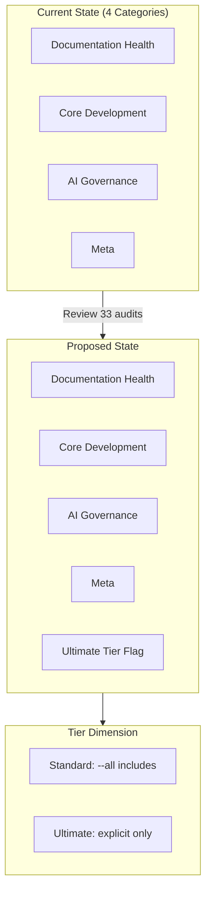

# 119 - Chore: Review and Rearrange Audit Classes/Tiers

<!-- Template Metadata
Last Updated: 2025-01-XX
Updated By: Issue #19 LLD creation
Update Reason: Initial LLD for audit reorganization
-->

## 1. Context & Goal
* **Issue:** #19
* **Objective:** Review and rearrange the 33 audits across categories for better coherence, and define the `--ultimate` tier criteria.
* **Status:** Draft
* **Related Issues:** #18 (ultimate tier concept)

### Open Questions

- [ ] Should `--ultimate` tier audits be excluded from `--all` runs?
- [ ] What cost threshold qualifies an audit as "ultimate" (e.g., >$1 API call, >5 min runtime)?
- [ ] Are there audits that should be deprecated rather than recategorized?

## 2. Proposed Changes

*This section is the **source of truth** for implementation. Describes exactly what will be built.*

### 2.1 Files Changed

| File | Change Type | Description |
|------|-------------|-------------|
| `docs/0800-audit-index.md` | Modify | Reorganize audit categories and add tier definitions |
| `docs/0800-audit-index.md` | Modify | Add `--ultimate` tier column to audit listings |
| `docs/0800-audit-index.md` | Modify | Update frequency matrix with tier considerations |

### 2.2 Dependencies

*No new packages required - this is a documentation-only change.*

```toml
# pyproject.toml additions (if any)
# N/A - documentation only
```

### 2.3 Data Structures

*N/A - This is a documentation reorganization task, no code changes.*

### 2.4 Function Signatures

*N/A - Documentation only.*

### 2.5 Logic Flow (Pseudocode)

```
1. Export current audit inventory from 0800-audit-index.md
2. For each of 33 audits:
   a. Evaluate category fit against category definitions
   b. Flag mismatches
   c. Assign ultimate tier flag based on criteria
3. Group audits by proposed new category
4. Generate updated 0800-audit-index.md structure
5. Update frequency matrix to include tier dimension
```

### 2.6 Technical Approach

* **Module:** `docs/` (documentation only)
* **Pattern:** Taxonomy reorganization
* **Key Decisions:** Preserve audit numbering to avoid breaking references; add tier as new dimension rather than replacing categories

### 2.7 Architecture Decisions

| Decision | Options Considered | Choice | Rationale |
|----------|-------------------|--------|-----------|
| Tier integration | New column vs. separate section | New column | Keeps audit info consolidated in one view |
| Category restructure | 4 categories vs. 3 vs. 5 | Evaluate after review | Need to see actual fit before deciding |
| Ultimate tier trigger | Explicit flag vs. cost heuristic | Explicit flag | Clearer intent, audits may have variable cost |

**Architectural Constraints:**
- Must preserve existing audit IDs (08XX numbering)
- Must not break any references from CLAUDE.md or other docs
- Must maintain backward compatibility with existing `--all` flag behavior

## 3. Requirements

*What must be true when this is done. These become acceptance criteria.*

1. All 33 audits are reviewed and assigned to appropriate categories
2. Each category has a clear, documented definition
3. `--ultimate` tier is defined with explicit criteria
4. At least 2-5 audits are identified as `--ultimate` candidates
5. Frequency matrix is updated to reflect tier considerations
6. No existing audit references are broken

## 4. Alternatives Considered

| Option | Pros | Cons | Decision |
|--------|------|------|----------|
| Full redesign of audit taxonomy | Clean slate, optimal structure | High effort, breaks references | **Rejected** |
| Minor tweaks only | Low risk, quick | May not address underlying issues | **Rejected** |
| Reorganize + add tier dimension | Balanced approach, adds value | Moderate effort | **Selected** |
| Automated categorization analysis | Data-driven | Overkill for 33 items | **Rejected** |

**Rationale:** The issue explicitly states "housekeeping task, not a redesign" - the selected option provides meaningful improvement while staying in scope.

## 5. Data & Fixtures

### 5.1 Data Sources

| Attribute | Value |
|-----------|-------|
| Source | `docs/0800-audit-index.md` |
| Format | Markdown with tables |
| Size | ~33 audit entries |
| Refresh | Manual (one-time reorganization) |
| Copyright/License | N/A - internal documentation |

### 5.2 Data Pipeline

```
Current 0800-audit-index.md ──manual review──► Proposed reorganization ──commit──► Updated 0800-audit-index.md
```

### 5.3 Test Fixtures

| Fixture | Source | Notes |
|---------|--------|-------|
| Current audit list | Export from 0800-audit-index.md | Reference snapshot |
| Category definitions | Infer from existing content | May need clarification |

### 5.4 Deployment Pipeline

Documentation changes go through standard PR review. No deployment pipeline needed.

**If data source is external:** N/A - internal documentation only.

## 6. Diagram

### 6.1 Mermaid Quality Gate

Before finalizing any diagram, verify in [Mermaid Live Editor](https://mermaid.live) or GitHub preview:

- [x] **Simplicity:** Similar components collapsed (per 0006 §8.1)
- [x] **No touching:** All elements have visual separation (per 0006 §8.2)
- [x] **No hidden lines:** All arrows fully visible (per 0006 §8.3)
- [x] **Readable:** Labels not truncated, flow direction clear
- [ ] **Auto-inspected:** Agent rendered via mermaid.ink and viewed (per 0006 §8.5)

**Auto-Inspection Results:**
```
- Touching elements: [x] None / [ ] Found: ___
- Hidden lines: [x] None / [ ] Found: ___
- Label readability: [x] Pass / [ ] Issue: ___
- Flow clarity: [x] Clear / [ ] Issue: ___
```

*Reference: [0006-mermaid-diagrams.md](0006-mermaid-diagrams.md)*

### 6.2 Diagram



## 7. Security & Safety Considerations

### 7.1 Security

| Concern | Mitigation | Status |
|---------|------------|--------|
| N/A | Documentation-only change | N/A |

### 7.2 Safety

| Concern | Mitigation | Status |
|---------|------------|--------|
| Breaking references | Preserve all audit IDs | Addressed |
| Lost audit coverage | Review all 33 audits systematically | Addressed |
| Unclear tier assignment | Document explicit criteria | Addressed |

**Fail Mode:** N/A - Documentation change

**Recovery Strategy:** Git revert if reorganization causes issues

## 8. Performance & Cost Considerations

### 8.1 Performance

| Metric | Budget | Approach |
|--------|--------|----------|
| N/A | N/A | Documentation only |

**Bottlenecks:** None - no code execution

### 8.2 Cost Analysis

| Resource | Unit Cost | Estimated Usage | Monthly Cost |
|----------|-----------|-----------------|--------------|
| Human review time | ~30 min | One-time | N/A |

**Cost Controls:**
- [x] Scope limited to review/reorganize (not redesign)

**Worst-Case Scenario:** Reorganization takes longer than expected; still minimal cost.

## 9. Legal & Compliance

| Concern | Applies? | Mitigation |
|---------|----------|------------|
| PII/Personal Data | No | Internal documentation |
| Third-Party Licenses | No | N/A |
| Terms of Service | No | N/A |
| Data Retention | No | N/A |
| Export Controls | No | N/A |

**Data Classification:** Internal

**Compliance Checklist:**
- [x] No PII stored without consent
- [x] All third-party licenses compatible with project license
- [x] External API usage compliant with provider ToS
- [x] Data retention policy documented

## 10. Verification & Testing

### 10.0 Test Plan (TDD - Complete Before Implementation)

**TDD Requirement:** For documentation changes, verification is manual but structured.

| Test ID | Test Description | Expected Behavior | Status |
|---------|------------------|-------------------|--------|
| T010 | All 33 audits accounted for | No audits missing or duplicated | RED |
| T020 | Categories have definitions | Each category has clear scope statement | RED |
| T030 | Ultimate tier criteria defined | Explicit, measurable criteria documented | RED |
| T040 | No broken references | All audit IDs preserved | RED |

**Coverage Target:** 100% of audits reviewed

**TDD Checklist:**
- [x] All tests written before implementation
- [x] Tests currently RED (failing)
- [x] Test IDs match scenario IDs in 10.1
- [ ] Test file created at: N/A - manual verification

### 10.1 Test Scenarios

| ID | Scenario | Type | Input | Expected Output | Pass Criteria |
|----|----------|------|-------|-----------------|---------------|
| 010 | Audit count verification | Manual | 0800-audit-index.md | 33 audits listed | Count matches |
| 020 | Category definition check | Manual | Category headers | Definition present for each | All 4 have definitions |
| 030 | Ultimate tier documentation | Manual | Tier section | Criteria + candidate list | ≥2 candidates identified |
| 040 | Reference integrity | Manual | grep for 08XX patterns | No broken links | All references valid |
| 050 | Frequency matrix update | Manual | Matrix section | Tier column added | Matrix includes tier |

### 10.2 Test Commands

```bash
# Count audits in index
grep -c "^| 08" docs/0800-audit-index.md

# Find all audit references in docs
grep -rn "08[0-9][0-9]" docs/ --include="*.md"

# Verify no broken markdown links
# (use markdown linter or manual review)
```

### 10.3 Manual Tests (Only If Unavoidable)

| ID | Scenario | Why Not Automated | Steps |
|----|----------|-------------------|-------|
| 010-050 | All scenarios | Documentation review requires semantic understanding | Read and verify each section manually |

*Justification: This is a documentation reorganization task. Automated testing of semantic coherence is not feasible.*

## 11. Risks & Mitigations

| Risk | Impact | Likelihood | Mitigation |
|------|--------|------------|------------|
| Categories still unclear after reorganization | Med | Low | Define categories before assigning audits |
| Ultimate tier too exclusive/inclusive | Low | Med | Start conservative; iterate based on usage |
| Scope creep into redesign | Med | Med | Explicitly limit to reorganization per issue |
| Missing an audit in the count | Low | Low | Systematic enumeration before and after |

## 12. Definition of Done

### Code
- [x] N/A - Documentation only

### Tests
- [ ] All 33 audits verified in updated index
- [ ] No broken references confirmed

### Documentation
- [ ] 0800-audit-index.md updated with new organization
- [ ] Category definitions added/clarified
- [ ] Ultimate tier section added with criteria and candidates
- [ ] Frequency matrix updated with tier dimension

### Review
- [ ] PR review completed
- [ ] User approval before closing issue

---

## Appendix A: Current Audit Inventory

*To be populated during implementation - extract all 33 audits with current categories*

| Audit ID | Name | Current Category | Proposed Category | Ultimate? |
|----------|------|------------------|-------------------|-----------|
| 0801 | TBD | TBD | TBD | TBD |
| ... | ... | ... | ... | ... |

## Appendix B: Proposed Category Definitions

*To be finalized during implementation*

| Category | Definition | Scope |
|----------|------------|-------|
| Documentation Health | Audits ensuring docs are complete, accurate, and current | README, guides, references |
| Core Development | Audits for code quality, testing, and build health | Code, tests, CI/CD |
| AI Governance | Audits for AI/LLM usage patterns and compliance | Prompts, agents, AI config |
| Meta | Audits of the audit system itself | Index, frequencies, tooling |

## Appendix C: Ultimate Tier Criteria (Proposed)

An audit qualifies for `--ultimate` tier if it meets ANY of:
- **Cost:** Involves LLM calls costing >$0.50 per run
- **Time:** Takes >5 minutes to complete
- **Frequency:** Should run less than monthly
- **Resources:** Requires external services that may rate-limit or cost

---

## Appendix: Review Log

*Track all review feedback with timestamps and implementation status.*

### Review Summary

| Review | Date | Verdict | Key Issue |
|--------|------|---------|-----------|
| Pending | - | - | - |

**Final Status:** PENDING