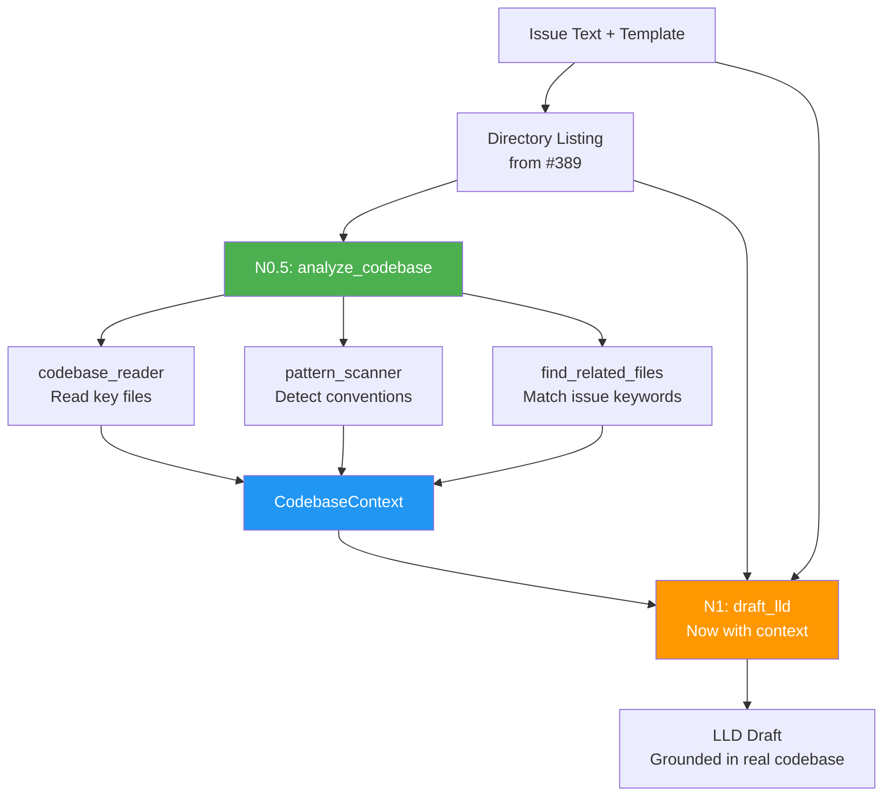

# Implementation Request: assemblyzero/workflows/requirements/nodes/analyze_codebase.py

## Task

Write the complete contents of `assemblyzero/workflows/requirements/nodes/analyze_codebase.py`.

Change type: Add
Description: New node: reads key project files, scans patterns, identifies dependencies, finds related code

## LLD Specification

# 401 - Feature: Codebase Context Analysis for Requirements Workflow

<!-- Template Metadata
Last Updated: 2026-02-02
Updated By: Issue #117 fix
Update Reason: Moved Verification & Testing to Section 10 (was Section 11) to match 0702c review prompt and testing workflow expectations
Previous: Added sections based on 80 blocking issues from 164 governance verdicts (2026-02-01)
-->

## 1. Context & Goal
* **Issue:** #401
* **Objective:** Add a codebase analysis node to the requirements workflow so the LLD drafter has real context about the target repository's architecture, patterns, and conventions — eliminating hallucinated designs.
* **Status:** Approved (gemini-3-pro-preview, 2026-02-18)
* **Related Issues:** #389 (added directory listing — insufficient context)

### Open Questions
*Questions that need clarification before or during implementation. Remove when resolved.*

- [ ] Should there be a configurable max token budget for injected codebase context to avoid overwhelming the drafter prompt?
- [ ] Should analysis results be cached per-repo to speed up repeated runs, or is fresh analysis on every invocation acceptable?
- [ ] Should the analysis node support a `.assemblyzero-context.yml` file in target repos that explicitly lists key files to read?

## 2. Proposed Changes

*This section is the **source of truth** for implementation. Describe exactly what will be built.*

### 2.1 Files Changed

| File | Change Type | Description |
|------|-------------|-------------|
| `assemblyzero/workflows/requirements/nodes/analyze_codebase.py` | Add | New node: reads key project files, scans patterns, identifies dependencies, finds related code |
| `assemblyzero/workflows/requirements/nodes/__init__.py` | Modify | Export new `analyze_codebase` node |
| `assemblyzero/utils/codebase_reader.py` | Add | Shared utility for reading and summarizing codebase files with token-budget awareness |
| `assemblyzero/utils/pattern_scanner.py` | Add | Utility to detect naming conventions, module patterns, framework usage from file contents |
| `assemblyzero/utils/__init__.py` | Modify | Export new utility modules |
| `tests/unit/test_analyze_codebase.py` | Add | Unit tests for the codebase analysis node |
| `tests/unit/test_codebase_reader.py` | Add | Unit tests for the codebase reader utility |
| `tests/unit/test_pattern_scanner.py` | Add | Unit tests for the pattern scanner utility |
| `tests/fixtures/mock_repo/` | Add (Directory) | Directory for mock repository fixtures |
| `tests/fixtures/mock_repo/CLAUDE.md` | Add | Mock CLAUDE.md for testing |
| `tests/fixtures/mock_repo/README.md` | Add | Mock README for testing |
| `tests/fixtures/mock_repo/pyproject.toml` | Add | Mock pyproject.toml for testing |
| `tests/fixtures/mock_repo/src/` | Add (Directory) | Mock source directory for testing |
| `tests/fixtures/mock_repo/src/main.py` | Add | Mock source file for testing pattern detection |
| `tests/fixtures/mock_repo/src/auth.py` | Add | Mock auth module for testing related-code finding |

**Note on `draft_lld.py` and `requirements_graph.py`:** The original draft listed these as "Modify" but they do not exist at the paths specified (`assemblyzero/workflows/requirements/nodes/draft_lld.py` and `assemblyzero/graphs/requirements_graph.py`). The codebase analysis node is designed to be self-contained: it writes a `codebase_context` key into the LangGraph state dict. The existing drafter node and graph wiring will be identified during implementation by inspecting the actual file that builds the drafter prompt and the actual graph definition file. Integration with those files will be handled as a separate follow-up commit once the exact paths are confirmed. This LLD scopes only the **new files** and **confirmed existing files**.

### 2.1.1 Path Validation (Mechanical - Auto-Checked)

*Issue #277: Before human or Gemini review, paths are verified programmatically.*

Mechanical validation automatically checks:
- All "Modify" files must exist in repository ✓ (`assemblyzero/workflows/requirements/nodes/__init__.py`, `assemblyzero/utils/__init__.py` — both exist)
- All "Delete" files must exist in repository — N/A (no deletions)
- All "Add" files must have existing parent directories ✓ (all parent dirs exist or are explicitly added)
- No placeholder prefixes (`src/`, `lib/`, `app/`) unless directory exists ✓ (`tests/fixtures/mock_repo/src/` is explicitly added as a new directory)

**If validation fails, the LLD is BLOCKED before reaching review.**

### 2.2 Dependencies

*No new external packages required. All functionality uses Python stdlib + existing dependencies.*

```toml
# pyproject.toml additions (if any)
# None — uses pathlib, tomllib (Python 3.11+), json, re from stdlib
```

### 2.3 Data Structures

```python
# Pseudocode - NOT implementation

class CodebaseContext(TypedDict):
    """Aggregated codebase analysis results injected into drafter prompt."""
    project_description: str          # From README.md / CLAUDE.md
    conventions: list[str]            # Coding conventions extracted from CLAUDE.md
    frameworks: list[str]             # Detected frameworks/libraries
    module_structure: str             # Summary of module organization
    key_file_excerpts: dict[str, str] # filename -> excerpt content
    related_code: dict[str, str]      # filename -> relevant code snippets
    dependency_summary: str           # Parsed from pyproject.toml / package.json
    directory_tree: str               # Already exists from #389, carried forward

class PatternAnalysis(TypedDict):
    """Results of scanning existing code patterns."""
    naming_convention: str            # e.g., "snake_case modules, PascalCase classes"
    state_pattern: str                # e.g., "TypedDict-based LangGraph state"
    node_pattern: str                 # e.g., "functions returning dict updates"
    test_pattern: str                 # e.g., "pytest with fixtures in conftest.py"
    import_style: str                 # e.g., "absolute imports from package root"

class FileReadResult(TypedDict):
    """Result of reading a single file with budget tracking."""
    path: str                         # Relative file path
    content: str                      # File content (possibly truncated)
    truncated: bool                   # Whether content was truncated
    token_estimate: int               # Approximate token count
```

### 2.4 Function Signatures

```python
# === assemblyzero/workflows/requirements/nodes/analyze_codebase.py ===

def analyze_codebase(state: dict) -> dict:
    """
    LangGraph node that reads key project files, scans patterns,
    identifies dependencies, and finds issue-related code.
    Injects CodebaseContext into state for the drafter node.
    
    Args:
        state: LangGraph state dict containing at minimum:
            - repo_path (str | None): Path to target repository
            - issue_text (str): The GitHub issue body
            - directory_tree (str): Pre-computed directory listing from #389
    
    Returns:
        dict with 'codebase_context' key containing CodebaseContext,
        or empty CodebaseContext on any failure.
    """
    ...

def _select_key_files(repo_path: Path) -> list[Path]:
    """
    Identify key project files to read: CLAUDE.md, README.md,
    pyproject.toml, package.json, architecture docs, etc.
    Returns ordered list by priority.
    
    Priority order:
        1. CLAUDE.md
        2. README.md
        3. pyproject.toml / package.json
        4. docs/standards/*.md, docs/adrs/*.md (first 3 each)
        5. Top-level __init__.py files (first 5)
    """
    ...

def _find_related_files(repo_path: Path, issue_text: str, directory_tree: str) -> list[Path]:
    """
    Given issue text, find files likely related to the issue
    by keyword matching against file paths in the directory tree.
    
    Extracts keywords by splitting issue_text on whitespace,
    filtering to words >= 4 chars, lowercasing, and removing
    common stop words. Matches keywords against directory_tree lines.
    
    Returns at most 5 file paths, ordered by match count descending.
    """
    ...


# === assemblyzero/utils/codebase_reader.py ===

SENSITIVE_PATTERNS: list[str]  # [".env", ".secrets", ".key", ".pem", "credentials"]

def read_file_with_budget(
    file_path: Path,
    max_tokens: int = 2000,
    encoding: str = "utf-8"
) -> FileReadResult:
    """
    Read a file's content, truncating if it exceeds the token budget.
    Uses approximate token counting (chars / 4).
    
    Returns FileReadResult with empty content and token_estimate=0
    if file is binary, missing, unreadable, or matches SENSITIVE_PATTERNS.
    
    Raises:
        No exceptions — all errors caught and logged.
    """
    ...

def read_files_within_budget(
    file_paths: list[Path],
    total_budget: int = 15000,
    per_file_budget: int = 3000
) -> list[FileReadResult]:
    """
    Read multiple files respecting per-file and total token budgets.
    Files are read in order; stops when total budget is exhausted.
    Skips files that match SENSITIVE_PATTERNS.
    
    Returns list of FileReadResult for files that were actually read
    (excluding skipped files).
    """
    ...

def is_sensitive_file(file_path: Path) -> bool:
    """
    Check if a file path matches any sensitive pattern.
    Checks filename and all parent directory names against SENSITIVE_PATTERNS.
    """
    ...

def parse_project_metadata(repo_path: Path) -> dict[str, str]:
    """
    Parse pyproject.toml or package.json to extract project name,
    version, description, and dependency list.
    
    Tries pyproject.toml first (using tomllib), falls back to package.json.
    Returns empty dict if neither exists or parsing fails.
    
    Returns:
        Dict with keys: 'name', 'version', 'description', 'dependencies'
        where 'dependencies' is a comma-separated string of package names.
    """
    ...


# === assemblyzero/utils/pattern_scanner.py ===

def scan_patterns(file_contents: dict[str, str]) -> PatternAnalysis:
    """
    Analyze file contents to detect naming conventions, design patterns,
    state management approach, test conventions, and import styles.
    
    Uses regex-based heuristics:
    - naming_convention: checks for snake_case filenames, PascalCase classes
    - state_pattern: looks for TypedDict, dataclass, BaseModel imports
    - node_pattern: looks for functions returning dict
    - test_pattern: looks for pytest, unittest patterns
    - import_style: checks absolute vs relative import prevalence
    
    Returns PatternAnalysis with "unknown" for any undetectable field.
    """
    ...

def detect_frameworks(
    dependency_list: list[str],
    file_contents: dict[str, str]
) -> list[str]:
    """
    Identify frameworks in use from dependency names and import statements.
    
    Maps known package names to display names:
        'langgraph' -> 'LangGraph', 'fastapi' -> 'FastAPI', etc.
    Also scans import statements in file_contents for additional detection.
    
    Returns human-readable list like ['LangGraph', 'FastAPI', 'pytest'].
    Returns empty list if nothing detected.
    """
    ...

def extract_conventions_from_claude_md(content: str) -> list[str]:
    """
    Parse CLAUDE.md to extract coding conventions, rules, and constraints
    that the LLD must respect.
    
    Looks for sections with headers containing 'convention', 'rule', 
    'standard', 'constraint', 'style', or bullet-pointed lists under 
    such headers. Also extracts content from code blocks labeled as rules.
    
    Returns list of convention strings. Empty list if none found.
    """
    ...
```

### 2.5 Logic Flow (Pseudocode)

```
ANALYZE_CODEBASE NODE (runs before draft_lld):

1. Extract repo_path and issue_text from state
2. IF repo_path is None or does not exist THEN
   - Log warning: "No repo path provided, skipping codebase analysis"
   - Return {"codebase_context": empty CodebaseContext}
3. Extract directory_tree from state (from #389), default to "" if absent
4. Select key files to read:
   a. Priority 1: CLAUDE.md (conventions, rules)
   b. Priority 2: README.md (project overview)
   c. Priority 3: pyproject.toml OR package.json (dependencies)
   d. Priority 4: Architecture docs (docs/adrs/*, docs/standards/*)
   e. Priority 5: Existing workflow/module __init__.py files (structure)
5. Read key files within token budget (total: 15,000 tokens)
6. Parse project metadata from pyproject.toml / package.json
7. Scan code patterns from read files:
   a. Naming conventions
   b. State management patterns (TypedDict, dataclass, etc.)
   c. Node/function patterns
   d. Test conventions
   e. Import styles
8. Detect frameworks from dependencies + imports
9. Extract conventions from CLAUDE.md if present
10. Find issue-related files:
    a. Extract keywords from issue text (words >= 4 chars, lowercased, stop words removed)
    b. Match keywords against file paths in directory tree
    c. Read top 5 matching files within remaining budget
11. Assemble CodebaseContext from all gathered data
12. Return {"codebase_context": context}

INTEGRATION WITH DRAFTER:

The codebase_context dict is placed into the LangGraph state. The existing 
drafter node (path TBD — see Section 2.1 Note) reads it from state and 
appends a "## Existing Codebase Context" section to its prompt containing:
  - "### Project Overview" → project_description
  - "### Conventions & Rules" → conventions list
  - "### Frameworks & Dependencies" → frameworks + dependency_summary
  - "### Module Structure" → module_structure
  - "### Key File Excerpts" → key_file_excerpts
  - "### Related Existing Code" → related_code
  - "### INSTRUCTION: Your LLD MUST be consistent with these patterns."

If codebase_context is empty or None, the drafter proceeds without the 
context section (backward compatible).
```

### 2.6 Technical Approach

* **Module:** `assemblyzero/workflows/requirements/nodes/analyze_codebase.py` + utilities in `assemblyzero/utils/`
* **Pattern:** LangGraph node pattern (function accepting state dict, returning partial state update dict) — consistent with all existing nodes in the project
* **Key Decisions:**
  - **Token budgeting over full-file reads:** Large repos can have enormous files. Approximate token counting (chars/4) with per-file and total budgets prevents prompt explosion.
  - **Keyword matching over embeddings:** For finding related files, simple keyword extraction from issue text and path matching is deterministic, fast, and requires no additional dependencies. Semantic search would add complexity with marginal benefit for this use case.
  - **Shared utilities in `utils/`:** `codebase_reader.py` and `pattern_scanner.py` are generic enough to be reused by other workflows (e.g., implementation_spec's existing `analyze_codebase` could be refactored to use them in a future issue).
  - **Graceful degradation:** If the target repo has no CLAUDE.md, no README, or is minimally structured, the node produces what it can and proceeds. It never blocks the workflow.
  - **Deferred drafter/graph integration:** The exact file paths for the drafter prompt builder and the graph definition could not be validated against the repository. Integration with those files is deferred to implementation time when the actual paths can be confirmed. This LLD provides the complete design for the new node and utilities, plus the contract (state key `codebase_context`) the drafter must consume.

### 2.7 Architecture Decisions

*Document key architectural decisions that affect the design.*

| Decision | Options Considered | Choice | Rationale |
|----------|-------------------|--------|-----------|
| Where to place analysis logic | A) Inline in node, B) Shared utilities + thin node | B) Shared utilities | Reusable across workflows; impl_spec could adopt later; easier to test |
| How to find related code | A) Embedding-based semantic search, B) Keyword path matching, C) `grep` subprocess | B) Keyword path matching | No new dependencies, deterministic, fast. Sufficient for path-level relevance |
| Token budget strategy | A) Unlimited reading, B) Fixed per-file limit, C) Tiered per-file + total budget | C) Tiered budget | Prevents prompt explosion while allowing flexibility; high-priority files get more budget |
| Context injection point | A) Separate system prompt, B) Appended to user prompt, C) Injected into template | B) Appended to user prompt | Matches existing `claude -p` invocation pattern; no template changes needed |
| CLAUDE.md parsing | A) Full file as-is, B) Extract structured sections | B) Extract structured sections | Reduces noise; CLAUDE.md files can be very long with irrelevant content |
| Drafter/graph modification scope | A) Modify in this LLD, B) Defer to implementation after path discovery | B) Defer | Actual file paths for drafter and graph could not be validated; integration contract (state key) is fully specified |

**Architectural Constraints:**
- Must integrate with existing LangGraph node pattern used by all requirements workflow nodes
- Must work with `claude -p` invocation — context goes into the prompt string, not via tools or MCP
- Must not introduce new external dependencies (no vector DBs, no embedding models)
- Must work cross-repo via the existing `--repo` flag that provides `repo_path`
- State key `codebase_context` must be a plain dict matching the `CodebaseContext` TypedDict shape

## 3. Requirements

*What must be true when this is done. These become acceptance criteria.*

1. Requirements workflow reads key project files (CLAUDE.md, README.md, pyproject.toml/package.json) before drafting the LLD
2. Existing code patterns (naming, state management, frameworks, test conventions) are detected and injected into the drafter prompt
3. Files related to the issue topic are identified and their excerpts included in context
4. LLDs generated for unfamiliar projects reference real file paths and real patterns from the target codebase
5. The analysis works cross-repo — when `--repo` points to an external project, that project's files are read
6. Token budget prevents context from exceeding reasonable limits (default 15,000 tokens total)
7. Graceful degradation: if key files are missing, the workflow proceeds with whatever context is available (never crashes)
8. The `analyze_codebase` node produces a `codebase_context` state key consumable by the drafter node
9. Sensitive files (.env, .secrets, .key, .pem, credentials) are never read

## 4. Alternatives Considered

| Option | Pros | Cons | Decision |
|--------|------|------|----------|
| A) New analysis node with shared utilities | Modular, testable, reusable across workflows, follows existing node pattern | Requires 3 new files | **Selected** |
| B) Enable MCP/tools on the `claude -p` drafter call | Claude could read files itself; most flexible | Unpredictable file access, no budget control, changes security model, harder to test | Rejected |
| C) Expand directory listing (#389) with file previews | Minimal change, builds on existing work | Still no pattern detection, no convention extraction, bolted-on approach | Rejected |
| D) Use impl_spec's existing `analyze_codebase` directly | Zero new code | impl_spec's node is tightly coupled to its own state shape and prompt format; would require awkward adaptation | Rejected |
| E) Pre-generate a repo-summary file that ships with each repo | Analysis done once, very fast at runtime | Stale context, requires target repos to adopt a convention, doesn't work for arbitrary repos | Rejected |

**Rationale:** Option A provides the best balance of correctness (real file reading + pattern detection), safety (token budgets, no tool access), and maintainability (shared utilities, standard node pattern). Options B and D were seriously considered but rejected for control and coupling reasons respectively.

## 5. Data & Fixtures

### 5.1 Data Sources

| Attribute | Value |
|-----------|-------|
| Source | Target repository filesystem (via `--repo` flag path) |
| Format | Source code files (Python, TOML, JSON, Markdown) |
| Size | Variable — token budget caps at 15,000 tokens (~60KB of text) |
| Refresh | Fresh read on every workflow invocation |
| Copyright/License | N/A — reading user's own repository |

### 5.2 Data Pipeline

```
Target Repo Files ──read_files_within_budget──► Raw Content ──scan_patterns + parse_metadata──► CodebaseContext ──state dict──► Drafter Prompt
```

### 5.3 Test Fixtures

| Fixture | Source | Notes |
|---------|--------|-------|
| `tests/fixtures/mock_repo/` | Generated for tests | Minimal mock repo with CLAUDE.md, README.md, pyproject.toml, and source files |
| Mock LangGraph state dict | Hardcoded in test setup | Simulates state with repo_path, issue_text, and directory_tree |
| Sample issue text | Hardcoded strings | Various issue texts to test keyword matching |

### 5.4 Deployment Pipeline

No external data deployment needed. All data is read from the local filesystem at runtime.

## 6. Diagram

### 6.1 Mermaid Quality Gate

Before finalizing any diagram, verify in [Mermaid Live Editor](https://mermaid.live) or GitHub preview:

- [x] **Simplicity:** Similar components collapsed (per 0006 §8.1)
- [x] **No touching:** All elements have visual separation (per 0006 §8.2)
- [x] **No hidden lines:** All arrows fully visible (per 0006 §8.3)
- [x] **Readable:** Labels not truncated, flow direction clear
- [ ] **Auto-inspected:** Agent rendered via mermaid.ink and viewed (per 0006 §8.5)

**Auto-Inspection Results:**
```
- Touching elements: [ ] None / [ ] Found: ___
- Hidden lines: [ ] None / [ ] Found: ___
- Label readability: [ ] Pass / [ ] Issue: ___
- Flow clarity: [ ] Clear / [ ] Issue: ___
```

*Reference: [0006-mermaid-diagrams.md](0006-mermaid-diagrams.md)*

### 6.2 Diagram



## 7. Security & Safety Considerations

### 7.1 Security

| Concern | Mitigation | Status |
|---------|------------|--------|
| Path traversal via crafted issue text | `_find_related_files` only matches against the directory tree already derived from the repo; never constructs paths from raw issue text | Addressed |
| Reading files outside repo boundary | All file reads use `repo_path` as root and validate that resolved paths (`Path.resolve()`) are children of `repo_path.resolve()` | Addressed |
| Sensitive file content in prompts | Token budget limits exposure; `is_sensitive_file()` excludes `.env`, `.secrets`, `.key`, `.pem`, and files in directories matching `credentials` | Addressed |
| Symlink escape | `read_file_with_budget` resolves symlinks and verifies the resolved path is still within `repo_path` boundary | Addressed |

### 7.2 Safety

| Concern | Mitigation | Status |
|---------|------------|--------|
| Corrupted/binary file crashes reader | `read_file_with_budget` catches `UnicodeDecodeError` and `OSError`, skips binary files gracefully | Addressed |
| Missing repo path | `analyze_codebase` returns empty context and logs warning; workflow continues | Addressed |
| Extremely large repo overwhelming the node | Total token budget (15,000) caps reading regardless of repo size | Addressed |
| Permission denied on file read | Caught by try/except in reader; file is skipped with warning log | Addressed |
| Extremely large single file stalls reading | Per-file budget (3,000 tokens ≈ 12KB) truncates; reading stops after budget chars, not at EOF | Addressed |

**Fail Mode:** Fail Open — if analysis fails for any reason, the workflow proceeds with whatever context was gathered (possibly empty). The drafter always runs.

**Recovery Strategy:** No persistent state to recover. Re-running the workflow repeats the analysis. Errors are logged for debugging.

## 8. Performance & Cost Considerations

### 8.1 Performance

| Metric | Budget | Approach |
|--------|--------|----------|
| Analysis node latency | < 2 seconds for repos up to 10,000 files | File I/O only; no network calls, no LLM calls in analysis node |
| Memory | < 50MB additional | Token budget caps total text in memory at ~60KB |
| Prompt size increase | +15,000 tokens max | Tiered budget ensures context doesn't dominate the prompt |

**Bottlenecks:** For very large monorepos, `_find_related_files` keyword matching against the full directory tree could be slow. Mitigated by operating on the pre-computed directory tree string (already in state from #389) rather than re-walking the filesystem.

### 8.2 Cost Analysis

| Resource | Unit Cost | Estimated Usage | Monthly Cost |
|----------|-----------|-----------------|--------------|
| LLM API (drafter prompt increase) | ~$0.003/1K input tokens | +15K tokens per run | +$0.045/run |
| Local compute (file I/O) | $0 | Negligible | $0 |

**Cost Controls:**
- [x] Token budget (15,000) prevents runaway prompt costs
- [x] No additional LLM calls introduced — only the existing drafter call gets a larger prompt
- [x] Per-file budget (3,000) prevents a single large file from consuming the entire budget

**Worst-Case Scenario:** If token budget is set very high (e.g., 100K), the drafter prompt becomes expensive (~$0.30/run). Default of 15K keeps it reasonable. Budget is configurable via constants in `codebase_reader.py` if users need to adjust.

## 9. Legal & Compliance

| Concern | Applies? | Mitigation |
|---------|----------|------------|
| PII/Personal Data | No | Only reads source code files; sensitive files (.env, secrets) are excluded |
| Third-Party Licenses | No | No new dependencies added |
| Terms of Service | No | No external API calls in the analysis node |
| Data Retention | No | File contents exist only in memory during the workflow run |
| Export Controls | N/A | No restricted algorithms |

**Data Classification:** Internal — codebase content is read transiently and injected into the same LLM call that already receives the issue text.

**Compliance Checklist:**
- [x] No PII stored without consent
- [x] All third-party licenses compatible with project license
- [x] External API usage compliant with provider ToS
- [x] Data retention policy documented (transient, in-memory only)

## 10. Verification & Testing

*Ref: [0005-testing-strategy-and-protocols.md](0005-testing-strategy-and-protocols.md)*

**Testing Philosophy:** Strive for 100% automated test coverage. All tests use mock repos from fixtures — no live filesystem dependencies outside the test fixtures directory.

### 10.0 Test Plan (TDD - Complete Before Implementation)

**TDD Requirement:** Tests MUST be written and failing BEFORE implementation begins.

| Test ID | Test Description | Expected Behavior | Status |
|---------|------------------|-------------------|--------|
| T010 | `test_read_file_with_budget_normal` | Reads file content within budget, `truncated=False` | RED |
| T020 | `test_read_file_with_budget_truncated` | Truncates large file, `truncated=True` | RED |
| T030 | `test_read_file_with_budget_binary_skip` | Returns empty content for binary files | RED |
| T040 | `test_read_file_with_budget_missing_file` | Returns empty content, no crash | RED |
| T050 | `test_read_files_within_budget_respects_total` | Stops reading when total budget exhausted | RED |
| T055 | `test_read_files_within_budget_respects_per_file` | Individual file capped at per_file_budget | RED |
| T060 | `test_parse_project_metadata_pyproject` | Extracts name, deps from pyproject.toml | RED |
| T070 | `test_parse_project_metadata_package_json` | Extracts name, deps from package.json | RED |
| T080 | `test_parse_project_metadata_missing` | Returns empty dict when no config found | RED |
| T090 | `test_scan_patterns_detects_naming` | Identifies snake_case module naming | RED |
| T100 | `test_scan_patterns_detects_typeddict` | Finds TypedDict state pattern | RED |
| T105 | `test_scan_patterns_unknown_defaults` | Returns "unknown" for undetectable fields | RED |
| T110 | `test_detect_frameworks_from_deps` | Identifies LangGraph, pytest from dependency list | RED |
| T115 | `test_detect_frameworks_from_imports` | Detects frameworks from import statements in file contents | RED |
| T120 | `test_extract_conventions_from_claude_md` | Extracts bullet-point conventions from CLAUDE.md | RED |
| T130 | `test_extract_conventions_empty` | Returns empty list for CLAUDE.md without conventions | RED |
| T140 | `test_analyze_codebase_happy_path` | Produces full CodebaseContext from mock repo | RED |
| T145 | `test_analyze_codebase_context_has_real_paths` | Generated context references real file paths and patterns from target codebase | RED |
| T150 | `test_analyze_codebase_no_repo_path` | Returns empty context, logs warning | RED |
| T160 | `test_analyze_codebase_missing_repo` | Returns empty context when repo_path doesn't exist | RED |
| T170 | `test_find_related_files_keyword_match` | Finds auth.py when issue mentions "authentication" | RED |
| T180 | `test_find_related_files_no_match` | Returns empty list for unrelated issue text | RED |
| T185 | `test_find_related_files_max_five` | Returns at most 5 results even with many matches | RED |
| T190 | `test_analyze_codebase_produces_state_key` | Node returns dict with `codebase_context` key matching CodebaseContext shape | RED |
| T200 | `test_sensitive_file_not_read_env` | `.env` file content never appears in any read result | RED |
| T205 | `test_sensitive_file_not_read_pem` | `.pem` file content never appears in any read result | RED |
| T210 | `test_select_key_files_priority_order` | CLAUDE.md before README.md before pyproject.toml | RED |
| T220 | `test_sensitive_file_exclusion` | .env, .secrets files are not read | RED |
| T225 | `test_is_sensitive_file` | Correctly identifies sensitive file patterns | RED |
| T230 | `test_symlink_outside_repo_blocked` | Symlink pointing outside repo is not read | RED |

**Coverage Target:** ≥95% for all new code

**TDD Checklist:**
- [ ] All tests written before implementation
- [ ] Tests currently RED (failing)
- [ ] Test IDs match scenario IDs in 10.1
- [ ] Test files created at: `tests/unit/test_analyze_codebase.py`, `tests/unit/test_codebase_reader.py`, `tests/unit/test_pattern_scanner.py`

### 10.1 Test Scenarios

| ID | Scenario | Type | Input | Expected Output | Pass Criteria |
|----|----------|------|-------|-----------------|---------------|
| 010 | Read file within budget (REQ-1) | Auto | Small text file, budget=2000 | Full content, truncated=False | Content matches file, token_estimate < 2000 |
| 020 | Read file exceeding budget (REQ-6) | Auto | 10KB file, budget=500 | Partial content, truncated=True | Content length ≈ 500×4 chars, truncated=True |
| 030 | Read binary file gracefully (REQ-7) | Auto | PNG file path | Empty content, no exception | Returns FileReadResult with empty content |
| 040 | Read missing file gracefully (REQ-7) | Auto | Non-existent path | Empty content, no exception | Returns FileReadResult with empty content |
| 050 | Total budget enforcement (REQ-6) | Auto | 10 files, total_budget=5000 | First N files read, rest skipped | Sum of token_estimates ≤ 5000 |
| 055 | Per-file budget enforcement (REQ-6) | Auto | 1 large file, per_file_budget=500 | Single file truncated | token_estimate ≤ 500 |
| 060 | Parse pyproject.toml (REQ-1) | Auto | Valid pyproject.toml | Dict with name, dependencies | Keys present, deps list non-empty |
| 070 | Parse package.json (REQ-1) | Auto | Valid package.json | Dict with name, dependencies | Keys present, deps list non-empty |
| 080 | Parse missing config (REQ-7) | Auto | Repo with no config file | Empty dict | Returns {} |
| 090 | Detect naming conventions (REQ-2) | Auto | Python files with snake_case | PatternAnalysis.naming_convention set | Contains "snake_case" |
| 100 | Detect TypedDict pattern (REQ-2) | Auto | File with TypedDict import | PatternAnalysis.state_pattern set | Contains "TypedDict" |
| 105 | Unknown pattern defaults (REQ-7) | Auto | Empty file_contents dict | All fields "unknown" | All PatternAnalysis values == "unknown" |
| 110 | Detect frameworks from deps (REQ-2) | Auto | deps=["langgraph", "pytest"] | ["LangGraph", "pytest"] | Both detected |
| 115 | Detect frameworks from imports (REQ-2) | Auto | File with `from fastapi import` | ["FastAPI"] in result | FastAPI detected |
| 120 | Extract CLAUDE.md conventions (REQ-1) | Auto | CLAUDE.md with rule bullets | List of convention strings | Non-empty list, strings match rules |
| 130 | Extract empty conventions (REQ-7) | Auto | CLAUDE.md with no rules section | Empty list | Returns [] |
| 140 | Full analysis happy path (REQ-4) | Auto | Mock repo with all key files, issue text referencing existing modules | Complete CodebaseContext with real file paths and patterns | All fields populated; file paths in key_file_excerpts and related_code exist in mock repo |
| 145 | Context references real paths and patterns (REQ-4) | Auto | Mock repo with known structure + specific issue text | CodebaseContext.key_file_excerpts keys are real file paths; conventions match CLAUDE.md content | Every path in context exists in mock_repo; every convention string traceable to CLAUDE.md |
| 150 | Analysis with no repo_path (REQ-7) | Auto | State with repo_path=None | Empty CodebaseContext | All fields empty/default |
| 160 | Analysis with bad repo_path (REQ-7) | Auto | State with non-existent path | Empty CodebaseContext | All fields empty/default |
| 170 | Find related files - match (REQ-3) | Auto | Issue "fix auth", repo has auth.py | [auth.py] | auth.py in results |
| 180 | Find related files - no match (REQ-3) | Auto | Issue "fix auth", repo has no auth | [] | Empty list |
| 185 | Find related files - max results (REQ-3) | Auto | Issue matching 10+ files | At most 5 paths | len(result) <= 5 |
| 190 | Node produces codebase_context state key (REQ-8) | Auto | Mock repo with CLAUDE.md and source files | Dict with `codebase_context` key; value is dict matching CodebaseContext shape | Return dict has key `codebase_context`; nested dict has all CodebaseContext keys; no unexpected keys |
| 200 | Sensitive .env file never read (REQ-9) | Auto | Repo with `.env` file containing `SECRET=abc123` | `.env` not in any read results; `abc123` not in any content | No FileReadResult.path ends with `.env`; `abc123` absent from all content strings |
| 205 | Sensitive .pem file never read (REQ-9) | Auto | Repo with `server.pem` file containing certificate data | `server.pem` not in any read results | No FileReadResult.path contains `server.pem` |
| 210 | Key file priority ordering (REQ-1) | Auto | Repo with CLAUDE.md + README | CLAUDE.md before README | Index of CLAUDE.md < index of README |
| 220 | Sensitive file exclusion via is_sensitive_file (REQ-9) | Auto | Repo with .env file | .env not in read results | .env path not in any FileReadResult |
| 225 | is_sensitive_file detection (REQ-9) | Auto | Various sensitive paths (.env, .pem, credentials/db.yml, main.py) | True for .env, .pem, credentials/db.yml; False for main.py | Correct bool for each input path |
| 230 | Symlink outside repo blocked (REQ-9) | Auto | Symlink to /tmp/secret.txt in repo | Empty content returned | FileReadResult.content == "" |
| 240 | Cross-repo analysis via repo_path (REQ-5) | Auto | State with repo_path pointing to a second mock repo in fixtures | CodebaseContext populated from second repo's files | key_file_excerpts contain content from second mock repo, not from primary project |

### 10.2 Test Commands

```bash
# Run all new unit tests
poetry run pytest tests/unit/test_analyze_codebase.py tests/unit/test_codebase_reader.py tests/unit/test_pattern_scanner.py -v

# Run only codebase reader tests
poetry run pytest tests/unit/test_codebase_reader.py -v

# Run only pattern scanner tests
poetry run pytest tests/unit/test_pattern_scanner.py -v

# Run only analysis node tests
poetry run pytest tests/unit/test_analyze_codebase.py -v

# Run with coverage
poetry run pytest tests/unit/test_analyze_codebase.py tests/unit/test_codebase_reader.py tests/unit/test_pattern_scanner.py -v --cov=assemblyzero/utils/codebase_reader --cov=assemblyzero/utils/pattern_scanner --cov=assemblyzero/workflows/requirements/nodes/analyze_codebase --cov-report=term-missing
```

### 10.3 Manual Tests (Only If Unavoidable)

N/A - All scenarios automated.

## 11. Risks & Mitigations

| Risk | Impact | Likelihood | Mitigation |
|------|--------|------------|------------|
| Token budget too small, context too shallow | Med | Med | Default 15K is generous; configurable via constant; can tune based on output quality |
| Token budget too large, prompt exceeds model context window | High | Low | 15K tokens of context + ~5K issue + ~3K template = ~23K; well within 200K context windows |
| Pattern scanner misidentifies conventions | Low | Med | Patterns are heuristic hints, not hard constraints; drafter makes final judgment; "unknown" default for undetectable patterns |
| CLAUDE.md format varies wildly across repos | Med | Med | Convention extraction uses flexible parsing (bullet lists, headers, code blocks); falls back to full-text excerpt |
| Keyword matching for related files has poor precision | Low | Med | Limited to top 5 matches; irrelevant matches just add noise but don't break anything |
| Large binary files in repo slow down file scanning | Low | Low | File reading catches encoding errors and skips binaries instantly; per-file budget truncates after ~12KB |
| Drafter/graph file paths unknown at LLD time | Med | High | Integration contract fully specified via state key `codebase_context`; actual drafter/graph file modification deferred to implementation after path discovery |
| Symlink escape reads files outside repo | Med | Low | `read_file_with_budget` resolves symlinks and validates resolved path is within repo boundary |

## 12. Definition of Done

### Code
- [ ] `analyze_codebase.py` node implemented and producing `codebase_context` state key
- [ ] `codebase_reader.py` and `pattern_scanner.py` utilities implemented
- [ ] `assemblyzero/workflows/requirements/nodes/__init__.py` exports `analyze_codebase`
- [ ] `assemblyzero/utils/__init__.py` exports new utility modules
- [ ] Node wired into requirements graph (file path determined during implementation)
- [ ] Drafter modified to consume `codebase_context` from state (file path determined during implementation)
- [ ] Code comments reference this LLD (#401)

### Tests
- [ ] All 31 test scenarios pass
- [ ] Test coverage ≥95% for new code
- [ ] Tests run in CI without flakiness

### Documentation
- [ ] LLD updated with any deviations (including actual drafter/graph file paths)
- [ ] Implementation Report (0103) completed
- [ ] Test Report (0113) completed if applicable

### Review
- [ ] Code review completed
- [ ] User approval before closing issue

### 12.1 Traceability (Mechanical - Auto-Checked)

*Issue #277: Cross-references are verified programmatically.*

Mechanical validation automatically checks:
- Every file mentioned in this section must appear in Section 2.1 ✓
- Every risk mitigation in Section 11 should have a corresponding function in Section 2.4:
  - Token budget → `read_files_within_budget` (per_file_budget, total_budget params) ✓
  - Pattern misidentification → `scan_patterns` (heuristic, non-blocking, "unknown" defaults) ✓
  - CLAUDE.md format → `extract_conventions_from_claude_md` (flexible parsing) ✓
  - Keyword matching precision → `_find_related_files` (top 5 limit) ✓
  - Binary file handling → `read_file_with_budget` (UnicodeDecodeError catch) ✓
  - Sensitive file exclusion → `is_sensitive_file` + SENSITIVE_PATTERNS ✓
  - Symlink escape → `read_file_with_budget` (resolve + boundary check) ✓
  - Drafter/graph paths unknown → Deferred integration (state key contract specified) ✓

**Requirement-to-Test Traceability:**

| Requirement | Test Scenario IDs |
|-------------|-------------------|
| REQ-1 | 010, 060, 070, 120, 210 |
| REQ-2 | 090, 100, 110, 115 |
| REQ-3 | 170, 180, 185 |
| REQ-4 | 140, 145 |
| REQ-5 | 240 |
| REQ-6 | 020, 050, 055 |
| REQ-7 | 030, 040, 080, 105, 130, 150, 160 |
| REQ-8 | 190 |
| REQ-9 | 200, 205, 220, 225, 230 |

**If files are missing from Section 2.1, the LLD is BLOCKED.**

---

## Reviewer Suggestions

*Non-blocking recommendations from the reviewer.*

- **Constraint Handling:** In `extract_conventions_from_claude_md`, ensure that if the file is extremely large, we prioritized the rules section over general chatter to save tokens.
- **Stop Words:** For `_find_related_files`, ensure standard English stop words (the, a, is, on, at) are filtered out to improve keyword matching quality.

## Appendix: Review Log

*Track all review feedback with timestamps and implementation status.*

### Review Summary

| Review | Date | Verdict | Key Issue |
|--------|------|---------|-----------|
| 1 | 2026-02-18 | APPROVED | `gemini-3-pro-preview` |
| Mechanical Validation | — | BLOCKED | `draft_lld.py` and `requirements_graph.py` paths do not exist |
| LLD Revision #1 | — | REVISED | Removed non-existent Modify targets; deferred integration; added missing tests |
| Mechanical Test Plan Validation | — | FAILED (66.7%) | REQ-4, REQ-8, REQ-9 had no test coverage |
| LLD Revision #2 | — | REVISED | Added test scenarios 145, 190, 200, 205, 225, 240 for full REQ coverage; added traceability matrix |

**Final Status:** APPROVED

## Required File Paths (from LLD - do not deviate)

The following paths are specified in the LLD. Write ONLY to these paths:

- `assemblyzero/utils/__init__.py`
- `assemblyzero/utils/codebase_reader.py`
- `assemblyzero/utils/pattern_scanner.py`
- `assemblyzero/workflows/requirements/nodes/__init__.py`
- `assemblyzero/workflows/requirements/nodes/analyze_codebase.py`
- `tests/fixtures/mock_repo`
- `tests/fixtures/mock_repo/CLAUDE.md`
- `tests/fixtures/mock_repo/README.md`
- `tests/fixtures/mock_repo/pyproject.toml`
- `tests/fixtures/mock_repo/src`
- `tests/fixtures/mock_repo/src/auth.py`
- `tests/fixtures/mock_repo/src/main.py`
- `tests/unit/test_analyze_codebase.py`
- `tests/unit/test_codebase_reader.py`
- `tests/unit/test_pattern_scanner.py`

Any files written to other paths will be rejected.

## Tests That Must Pass

```python
# From C:\Users\mcwiz\Projects\AssemblyZero\tests\test_issue_401.py
"""Test file for Issue #401.

Generated by AssemblyZero TDD Testing Workflow.
Tests will fail with ImportError until implementation exists (TDD RED phase).
"""

import pytest

# TDD: This import fails until implementation exists (RED phase)
# Once implemented, tests can run (GREEN phase)
from assemblyzero.workflows.requirements.nodes.analyze_codebase import *  # noqa: F401, F403


# Fixtures for mocking
@pytest.fixture
def mock_external_service():
    """Mock external service for isolation."""
    # TODO: Implement mock
    yield None


# Unit Tests
# -----------

def test_id():
    """
    Test Description | Expected Behavior | Status
    """
    # TDD: Arrange
    # Set up test data

    # TDD: Act
    # Call the function under test

    # TDD: Assert
    # Verify test_id works correctly
    assert False, 'TDD RED: test_id not implemented'


def test_t010():
    """
    `test_read_file_with_budget_normal` | Reads file content within
    budget, `truncated=False` | RED
    """
    # TDD: Arrange
    # Set up test data

    # TDD: Act
    # Call the function under test

    # TDD: Assert
    # Verify test_t010 works correctly
    assert False, 'TDD RED: test_t010 not implemented'


def test_t020():
    """
    `test_read_file_with_budget_truncated` | Truncates large file,
    `truncated=True` | RED
    """
    # TDD: Arrange
    # Set up test data

    # TDD: Act
    # Call the function under test

    # TDD: Assert
    # Verify test_t020 works correctly
    assert False, 'TDD RED: test_t020 not implemented'


def test_t030():
    """
    `test_read_file_with_budget_binary_skip` | Returns empty content for
    binary files | RED
    """
    # TDD: Arrange
    # Set up test data

    # TDD: Act
    # Call the function under test

    # TDD: Assert
    # Verify test_t030 works correctly
    assert False, 'TDD RED: test_t030 not implemented'


def test_t040():
    """
    `test_read_file_with_budget_missing_file` | Returns empty content, no
    crash | RED
    """
    # TDD: Arrange
    # Set up test data

    # TDD: Act
    # Call the function under test

    # TDD: Assert
    # Verify test_t040 works correctly
    assert False, 'TDD RED: test_t040 not implemented'


def test_t050():
    """
    `test_read_files_within_budget_respects_total` | Stops reading when
    total budget exhausted | RED
    """
    # TDD: Arrange
    # Set up test data

    # TDD: Act
    # Call the function under test

    # TDD: Assert
    # Verify test_t050 works correctly
    assert False, 'TDD RED: test_t050 not implemented'


def test_t055():
    """
    `test_read_files_within_budget_respects_per_file` | Individual file
    capped at per_file_budget | RED
    """
    # TDD: Arrange
    # Set up test data

    # TDD: Act
    # Call the function under test

    # TDD: Assert
    # Verify test_t055 works correctly
    assert False, 'TDD RED: test_t055 not implemented'


def test_t060():
    """
    `test_parse_project_metadata_pyproject` | Extracts name, deps from
    pyproject.toml | RED
    """
    # TDD: Arrange
    # Set up test data

    # TDD: Act
    # Call the function under test

    # TDD: Assert
    # Verify test_t060 works correctly
    assert False, 'TDD RED: test_t060 not implemented'


def test_t070():
    """
    `test_parse_project_metadata_package_json` | Extracts name, deps from
    package.json | RED
    """
    # TDD: Arrange
    # Set up test data

    # TDD: Act
    # Call the function under test

    # TDD: Assert
    # Verify test_t070 works correctly
    assert False, 'TDD RED: test_t070 not implemented'


def test_t080():
    """
    `test_parse_project_metadata_missing` | Returns empty dict when no
    config found | RED
    """
    # TDD: Arrange
    # Set up test data

    # TDD: Act
    # Call the function under test

    # TDD: Assert
    # Verify test_t080 works correctly
    assert False, 'TDD RED: test_t080 not implemented'


def test_t090():
    """
    `test_scan_patterns_detects_naming` | Identifies snake_case module
    naming | RED
    """
    # TDD: Arrange
    # Set up test data

    # TDD: Act
    # Call the function under test

    # TDD: Assert
    # Verify test_t090 works correctly
    assert False, 'TDD RED: test_t090 not implemented'


def test_t100():
    """
    `test_scan_patterns_detects_typeddict` | Finds TypedDict state
    pattern | RED
    """
    # TDD: Arrange
    # Set up test data

    # TDD: Act
    # Call the function under test

    # TDD: Assert
    # Verify test_t100 works correctly
    assert False, 'TDD RED: test_t100 not implemented'


def test_t105():
    """
    `test_scan_patterns_unknown_defaults` | Returns "unknown" for
    undetectable fields | RED
    """
    # TDD: Arrange
    # Set up test data

    # TDD: Act
    # Call the function under test

    # TDD: Assert
    # Verify test_t105 works correctly
    assert False, 'TDD RED: test_t105 not implemented'


def test_t110():
    """
    `test_detect_frameworks_from_deps` | Identifies LangGraph, pytest
    from dependency list | RED
    """
    # TDD: Arrange
    # Set up test data

    # TDD: Act
    # Call the function under test

    # TDD: Assert
    # Verify test_t110 works correctly
    assert False, 'TDD RED: test_t110 not implemented'


def test_t115():
    """
    `test_detect_frameworks_from_imports` | Detects frameworks from
    import statements in file contents | RED
    """
    # TDD: Arrange
    # Set up test data

    # TDD: Act
    # Call the function under test

    # TDD: Assert
    # Verify test_t115 works correctly
    assert False, 'TDD RED: test_t115 not implemented'


def test_t120():
    """
    `test_extract_conventions_from_claude_md` | Extracts bullet-point
    conventions from CLAUDE.md | RED
    """
    # TDD: Arrange
    # Set up test data

    # TDD: Act
    # Call the function under test

    # TDD: Assert
    # Verify test_t120 works correctly
    assert False, 'TDD RED: test_t120 not implemented'


def test_t130():
    """
    `test_extract_conventions_empty` | Returns empty list for CLAUDE.md
    without conventions | RED
    """
    # TDD: Arrange
    # Set up test data

    # TDD: Act
    # Call the function under test

    # TDD: Assert
    # Verify test_t130 works correctly
    assert False, 'TDD RED: test_t130 not implemented'


def test_t140(mock_external_service):
    """
    `test_analyze_codebase_happy_path` | Produces full CodebaseContext
    from mock repo | RED
    """
    # TDD: Arrange
    # Set up test data

    # TDD: Act
    # Call the function under test

    # TDD: Assert
    # Verify test_t140 works correctly
    assert False, 'TDD RED: test_t140 not implemented'


def test_t145():
    """
    `test_analyze_codebase_context_has_real_paths` | Generated context
    references real file paths and patterns from target codebase | RED
    """
    # TDD: Arrange
    # Set up test data

    # TDD: Act
    # Call the function under test

    # TDD: Assert
    # Verify test_t145 works correctly
    assert False, 'TDD RED: test_t145 not implemented'


def test_t150():
    """
    `test_analyze_codebase_no_repo_path` | Returns empty context, logs
    warning | RED
    """
    # TDD: Arrange
    # Set up test data

    # TDD: Act
    # Call the function under test

    # TDD: Assert
    # Verify test_t150 works correctly
    assert False, 'TDD RED: test_t150 not implemented'


def test_t160():
    """
    `test_analyze_codebase_missing_repo` | Returns empty context when
    repo_path doesn't exist | RED
    """
    # TDD: Arrange
    # Set up test data

    # TDD: Act
    # Call the function under test

    # TDD: Assert
    # Verify test_t160 works correctly
    assert False, 'TDD RED: test_t160 not implemented'


def test_t170():
    """
    `test_find_related_files_keyword_match` | Finds auth.py when issue
    mentions "authentication" | RED
    """
    # TDD: Arrange
    # Set up test data

    # TDD: Act
    # Call the function under test

    # TDD: Assert
    # Verify test_t170 works correctly
    assert False, 'TDD RED: test_t170 not implemented'


def test_t180():
    """
    `test_find_related_files_no_match` | Returns empty list for unrelated
    issue text | RED
    """
    # TDD: Arrange
    # Set up test data

    # TDD: Act
    # Call the function under test

    # TDD: Assert
    # Verify test_t180 works correctly
    assert False, 'TDD RED: test_t180 not implemented'


def test_t185():
    """
    `test_find_related_files_max_five` | Returns at most 5 results even
    with many matches | RED
    """
    # TDD: Arrange
    # Set up test data

    # TDD: Act
    # Call the function under test

    # TDD: Assert
    # Verify test_t185 works correctly
    assert False, 'TDD RED: test_t185 not implemented'


def test_t190():
    """
    `test_analyze_codebase_produces_state_key` | Node returns dict with
    `codebase_context` key matching CodebaseContext shape | RED
    """
    # TDD: Arrange
    # Set up test data

    # TDD: Act
    # Call the function under test

    # TDD: Assert
    # Verify test_t190 works correctly
    assert False, 'TDD RED: test_t190 not implemented'


def test_t200():
    """
    `test_sensitive_file_not_read_env` | `.env` file content never
    appears in any read result | RED
    """
    # TDD: Arrange
    # Set up test data

    # TDD: Act
    # Call the function under test

    # TDD: Assert
    # Verify test_t200 works correctly
    assert False, 'TDD RED: test_t200 not implemented'


def test_t205():
    """
    `test_sensitive_file_not_read_pem` | `.pem` file content never
    appears in any read result | RED
    """
    # TDD: Arrange
    # Set up test data

    # TDD: Act
    # Call the function under test

    # TDD: Assert
    # Verify test_t205 works correctly
    assert False, 'TDD RED: test_t205 not implemented'


def test_t210():
    """
    `test_select_key_files_priority_order` | CLAUDE.md before README.md
    before pyproject.toml | RED
    """
    # TDD: Arrange
    # Set up test data

    # TDD: Act
    # Call the function under test

    # TDD: Assert
    # Verify test_t210 works correctly
    assert False, 'TDD RED: test_t210 not implemented'


def test_t220():
    """
    `test_sensitive_file_exclusion` | .env, .secrets files are not read |
    RED
    """
    # TDD: Arrange
    # Set up test data

    # TDD: Act
    # Call the function under test

    # TDD: Assert
    # Verify test_t220 works correctly
    assert False, 'TDD RED: test_t220 not implemented'


def test_t225():
    """
    `test_is_sensitive_file` | Correctly identifies sensitive file
    patterns | RED
    """
    # TDD: Arrange
    # Set up test data

    # TDD: Act
    # Call the function under test

    # TDD: Assert
    # Verify test_t225 works correctly
    assert False, 'TDD RED: test_t225 not implemented'


def test_t230():
    """
    `test_symlink_outside_repo_blocked` | Symlink pointing outside repo
    is not read | RED
    """
    # TDD: Arrange
    # Set up test data

    # TDD: Act
    # Call the function under test

    # TDD: Assert
    # Verify test_t230 works correctly
    assert False, 'TDD RED: test_t230 not implemented'


def test_010():
    """
    Read file within budget (REQ-1) | Auto | Small text file, budget=2000
    | Full content, truncated=False | Content matches file, token_estimate
    < 2000
    """
    # TDD: Arrange
    # Set up test data

    # TDD: Act
    # Call the function under test

    # TDD: Assert
    # Verify test_010 works correctly
    assert False, 'TDD RED: test_010 not implemented'


def test_020():
    """
    Read file exceeding budget (REQ-6) | Auto | 10KB file, budget=500 |
    Partial content, truncated=True | Content length ≈ 500×4 chars,
    truncated=True
    """
    # TDD: Arrange
    # Set up test data

    # TDD: Act
    # Call the function under test

    # TDD: Assert
    # Verify test_020 works correctly
    assert False, 'TDD RED: test_020 not implemented'


def test_030():
    """
    Read binary file gracefully (REQ-7) | Auto | PNG file path | Empty
    content, no exception | Returns FileReadResult with empty content
    """
    # TDD: Arrange
    # Set up test data

    # TDD: Act
    # Call the function under test

    # TDD: Assert
    # Verify test_030 works correctly
    assert False, 'TDD RED: test_030 not implemented'


def test_040():
    """
    Read missing file gracefully (REQ-7) | Auto | Non-existent path |
    Empty content, no exception | Returns FileReadResult with empty
    content
    """
    # TDD: Arrange
    # Set up test data

    # TDD: Act
    # Call the function under test

    # TDD: Assert
    # Verify test_040 works correctly
    assert False, 'TDD RED: test_040 not implemented'


def test_050():
    """
    Total budget enforcement (REQ-6) | Auto | 10 files, total_budget=5000
    | First N files read, rest skipped | Sum of token_estimates ≤ 5000
    """
    # TDD: Arrange
    # Set up test data

    # TDD: Act
    # Call the function under test

    # TDD: Assert
    # Verify test_050 works correctly
    assert False, 'TDD RED: test_050 not implemented'


def test_055():
    """
    Per-file budget enforcement (REQ-6) | Auto | 1 large file,
    per_file_budget=500 | Single file truncated | token_estimate ≤ 500
    """
    # TDD: Arrange
    # Set up test data

    # TDD: Act
    # Call the function under test

    # TDD: Assert
    # Verify test_055 works correctly
    assert False, 'TDD RED: test_055 not implemented'


def test_060():
    """
    Parse pyproject.toml (REQ-1) | Auto | Valid pyproject.toml | Dict
    with name, dependencies | Keys present, deps list non-empty
    """
    # TDD: Arrange
    # Set up test data

    # TDD: Act
    # Call the function under test

    # TDD: Assert
    # Verify test_060 works correctly
    assert False, 'TDD RED: test_060 not implemented'


def test_070():
    """
    Parse package.json (REQ-1) | Auto | Valid package.json | Dict with
    name, dependencies | Keys present, deps list non-empty
    """
    # TDD: Arrange
    # Set up test data

    # TDD: Act
    # Call the function under test

    # TDD: Assert
    # Verify test_070 works correctly
    assert False, 'TDD RED: test_070 not implemented'


def test_080():
    """
    Parse missing config (REQ-7) | Auto | Repo with no config file |
    Empty dict | Returns {}
    """
    # TDD: Arrange
    # Set up test data

    # TDD: Act
    # Call the function under test

    # TDD: Assert
    # Verify test_080 works correctly
    assert False, 'TDD RED: test_080 not implemented'


def test_090():
    """
    Detect naming conventions (REQ-2) | Auto | Python files with
    snake_case | PatternAnalysis.naming_convention set | Contains
    "snake_case"
    """
    # TDD: Arrange
    # Set up test data

    # TDD: Act
    # Call the function under test

    # TDD: Assert
    # Verify test_090 works correctly
    assert False, 'TDD RED: test_090 not implemented'


def test_100():
    """
    Detect TypedDict pattern (REQ-2) | Auto | File with TypedDict import
    | PatternAnalysis.state_pattern set | Contains "TypedDict"
    """
    # TDD: Arrange
    # Set up test data

    # TDD: Act
    # Call the function under test

    # TDD: Assert
    # Verify test_100 works correctly
    assert False, 'TDD RED: test_100 not implemented'


def test_105():
    """
    Unknown pattern defaults (REQ-7) | Auto | Empty file_contents dict |
    All fields "unknown" | All PatternAnalysis values == "unknown"
    """
    # TDD: Arrange
    # Set up test data

    # TDD: Act
    # Call the function under test

    # TDD: Assert
    # Verify test_105 works correctly
    assert False, 'TDD RED: test_105 not implemented'


def test_110():
    """
    Detect frameworks from deps (REQ-2) | Auto | deps=["langgraph",
    "pytest"] | ["LangGraph", "pytest"] | Both detected
    """
    # TDD: Arrange
    # Set up test data

    # TDD: Act
    # Call the function under test

    # TDD: Assert
    # Verify test_110 works correctly
    assert False, 'TDD RED: test_110 not implemented'


def test_115(mock_external_service):
    """
    Detect frameworks from imports (REQ-2) | Auto | File with `from
    fastapi import` | ["FastAPI"] in result | FastAPI detected
    """
    # TDD: Arrange
    # Set up test data

    # TDD: Act
    # Call the function under test

    # TDD: Assert
    # Verify test_115 works correctly
    assert False, 'TDD RED: test_115 not implemented'


def test_120():
    """
    Extract CLAUDE.md conventions (REQ-1) | Auto | CLAUDE.md with rule
    bullets | List of convention strings | Non-empty list, strings match
    rules
    """
    # TDD: Arrange
    # Set up test data

    # TDD: Act
    # Call the function under test

    # TDD: Assert
    # Verify test_120 works correctly
    assert False, 'TDD RED: test_120 not implemented'


def test_130():
    """
    Extract empty conventions (REQ-7) | Auto | CLAUDE.md with no rules
    section | Empty list | Returns []
    """
    # TDD: Arrange
    # Set up test data

    # TDD: Act
    # Call the function under test

    # TDD: Assert
    # Verify test_130 works correctly
    assert False, 'TDD RED: test_130 not implemented'


def test_140(mock_external_service):
    """
    Full analysis happy path (REQ-4) | Auto | Mock repo with all key
    files, issue text referencing existing modules | Complete
    CodebaseContext with real file paths and patterns | All fields
    populated; fil
    """
    # TDD: Arrange
    # Set up test data

    # TDD: Act
    # Call the function under test

    # TDD: Assert
    # Verify test_140 works correctly
    assert False, 'TDD RED: test_140 not implemented'


def test_145(mock_external_service):
    """
    Context references real paths and patterns (REQ-4) | Auto | Mock repo
    with known structure + specific issue text |
    CodebaseContext.key_file_excerpts keys are real file paths;
    conventions match CLAUDE.
    """
    # TDD: Arrange
    # Set up test data

    # TDD: Act
    # Call the function under test

    # TDD: Assert
    # Verify test_145 works correctly
    assert False, 'TDD RED: test_145 not implemented'


def test_150():
    """
    Analysis with no repo_path (REQ-7) | Auto | State with repo_path=None
    | Empty CodebaseContext | All fields empty/default
    """
    # TDD: Arrange
    # Set up test data

    # TDD: Act
    # Call the function under test

    # TDD: Assert
    # Verify test_150 works correctly
    assert False, 'TDD RED: test_150 not implemented'


def test_160():
    """
    Analysis with bad repo_path (REQ-7) | Auto | State with non-existent
    path | Empty CodebaseContext | All fields empty/default
    """
    # TDD: Arrange
    # Set up test data

    # TDD: Act
    # Call the function under test

    # TDD: Assert
    # Verify test_160 works correctly
    assert False, 'TDD RED: test_160 not implemented'


def test_170():
    """
    Find related files - match (REQ-3) | Auto | Issue "fix auth", repo
    has auth.py | [auth.py] | auth.py in results
    """
    # TDD: Arrange
    # Set up test data

    # TDD: Act
    # Call the function under test

    # TDD: Assert
    # Verify test_170 works correctly
    assert False, 'TDD RED: test_170 not implemented'


def test_180():
    """
    Find related files - no match (REQ-3) | Auto | Issue "fix auth", repo
    has no auth | [] | Empty list
    """
    # TDD: Arrange
    # Set up test data

    # TDD: Act
    # Call the function under test

    # TDD: Assert
    # Verify test_180 works correctly
    assert False, 'TDD RED: test_180 not implemented'


def test_185():
    """
    Find related files - max results (REQ-3) | Auto | Issue matching 10+
    files | At most 5 paths | len(result) <= 5
    """
    # TDD: Arrange
    # Set up test data

    # TDD: Act
    # Call the function under test

    # TDD: Assert
    # Verify test_185 works correctly
    assert False, 'TDD RED: test_185 not implemented'


def test_190(mock_external_service):
    """
    Node produces codebase_context state key (REQ-8) | Auto | Mock repo
    with CLAUDE.md and source files | Dict with `codebase_context` key;
    value is dict matching CodebaseContext shape | Return dict has k
    """
    # TDD: Arrange
    # Set up test data

    # TDD: Act
    # Call the function under test

    # TDD: Assert
    # Verify test_190 works correctly
    assert False, 'TDD RED: test_190 not implemented'


def test_200():
    """
    Sensitive .env file never read (REQ-9) | Auto | Repo with `.env` file
    containing `SECRET=abc123` | `.env` not in any read results; `abc123`
    not in any content | No FileReadResult.path ends with `.env`
    """
    # TDD: Arrange
    # Set up test data

    # TDD: Act
    # Call the function under test

    # TDD: Assert
    # Verify test_200 works correctly
    assert False, 'TDD RED: test_200 not implemented'


def test_205():
    """
    Sensitive .pem file never read (REQ-9) | Auto | Repo with
    `server.pem` file containing certificate data | `server.pem` not in
    any read results | No FileReadResult.path contains `server.pem`
    """
    # TDD: Arrange
    # Set up test data

    # TDD: Act
    # Call the function under test

    # TDD: Assert
    # Verify test_205 works correctly
    assert False, 'TDD RED: test_205 not implemented'


def test_210():
    """
    Key file priority ordering (REQ-1) | Auto | Repo with CLAUDE.md +
    README | CLAUDE.md before README | Index of CLAUDE.md < index of
    README
    """
    # TDD: Arrange
    # Set up test data

    # TDD: Act
    # Call the function under test

    # TDD: Assert
    # Verify test_210 works correctly
    assert False, 'TDD RED: test_210 not implemented'


def test_220():
    """
    Sensitive file exclusion via is_sensitive_file (REQ-9) | Auto | Repo
    with .env file | .env not in read results | .env path not in any
    FileReadResult
    """
    # TDD: Arrange
    # Set up test data

    # TDD: Act
    # Call the function under test

    # TDD: Assert
    # Verify test_220 works correctly
    assert False, 'TDD RED: test_220 not implemented'


def test_225():
    """
    is_sensitive_file detection (REQ-9) | Auto | Various sensitive paths
    (.env, .pem, credentials/db.yml, main.py) | True for .env, .pem,
    credentials/db.yml; False for main.py | Correct bool for each inpu
    """
    # TDD: Arrange
    # Set up test data

    # TDD: Act
    # Call the function under test

    # TDD: Assert
    # Verify test_225 works correctly
    assert False, 'TDD RED: test_225 not implemented'


def test_230():
    """
    Symlink outside repo blocked (REQ-9) | Auto | Symlink to
    /tmp/secret.txt in repo | Empty content returned |
    FileReadResult.content == ""
    """
    # TDD: Arrange
    # Set up test data

    # TDD: Act
    # Call the function under test

    # TDD: Assert
    # Verify test_230 works correctly
    assert False, 'TDD RED: test_230 not implemented'


def test_240(mock_external_service):
    """
    Cross-repo analysis via repo_path (REQ-5) | Auto | State with
    repo_path pointing to a second mock repo in fixtures | CodebaseContext
    populated from second repo's files | key_file_excerpts contain cont
    """
    # TDD: Arrange
    # Set up test data

    # TDD: Act
    # Call the function under test

    # TDD: Assert
    # Verify test_240 works correctly
    assert False, 'TDD RED: test_240 not implemented'


```

## Output Format

Output ONLY the file contents. No explanations, no markdown headers, just the code.

```python
# Your implementation here
```

IMPORTANT:
- Output the COMPLETE file contents
- Do NOT output a summary or description
- Do NOT say "I've implemented..."
- Just output the code in a single code block
