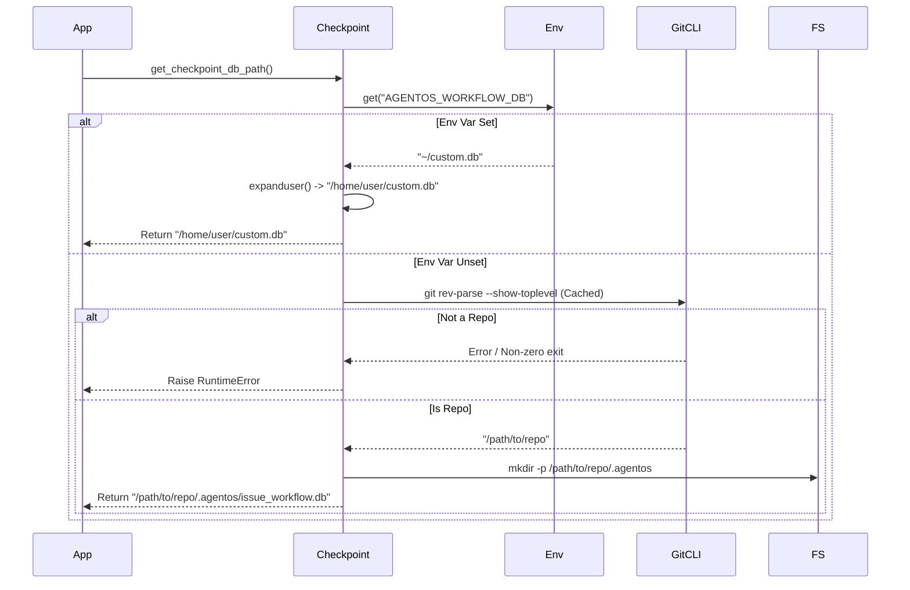

# 78 - Feature: Per-Repo Workflow Database

## 1. Context & Goal
* **Issue:** #78
* **Objective:** Change the default workflow checkpoint database location from global (`~/.agentos/issue_workflow.db`) to per-repo (`{repo_root}/.agentos/issue_workflow.db`) to enable safe concurrent workflow execution.
* **Status:** Approved (Gemini Review, 2026-01-31)
* **Related Issues:** None.

### Open Questions
None - requirements are well-defined from issue.

## 2. Proposed Changes

### 2.1 Files Changed
| File | Action | Description |
| :--- | :--- | :--- |
| `src/agentos/workflow/checkpoint.py` | Modify | Rewrite `get_checkpoint_db_path` logic to prioritize Env Var > Repo Root > Error. Add `_get_git_repo_root` with caching. |
| `.gitignore` | Modify | Add `.agentos/` to ignore patterns. |
| `docs/workflow.md` | Modify | Update configuration documentation to reflect per-repo default and override mechanism. |

### 2.2 Dependencies
* **System:** `git` (Must be available in PATH).
* **Python:** `subprocess`, `pathlib`, `os`, `functools`.

### 2.3 Data Structures
No new data structures.

### 2.4 Function Signatures
**File:** `src/agentos/workflow/checkpoint.py`

```python
import os
import subprocess
import logging
from functools import lru_cache
from pathlib import Path
from typing import Optional

logger = logging.getLogger(__name__)

@lru_cache(maxsize=1)
def _get_git_repo_root() -> Path:
    """
    Identifies the root of the current git repository or worktree via git CLI.
    
    This function is cached to prevent repeated subprocess calls. 
    NOTE: Tests altering the CWD or Repo context must call 
    _get_git_repo_root.cache_clear() to ensure validity.

    Returns:
        Path: Absolute path to the repository root.

    Raises:
        RuntimeError: If current directory is not a git repo or git is missing.
    """
    pass

def get_checkpoint_db_path() -> Path:
    """
    Determines the path for the SQLite workflow checkpoint database.

    Logic:
    1. Check AGENTOS_WORKFLOW_DB environment variable.
       - If present, expand user paths (~) and resolve absolute path.
    2. Check if running inside a Git Repository.
       - If yes, use {repo_root}/.agentos/issue_workflow.db
       - Create .agentos directory if missing.
    3. If neither, Raise RuntimeError (Fail Closed).

    Returns:
        Path: Resolved absolute path to the database file.

    Raises:
        RuntimeError: If location cannot be determined.
    """
    pass
```

### 2.5 Logic Flow (Pseudocode)

**_get_git_repo_root**
```python
FUNCTION _get_git_repo_root():
    TRY:
        # Use --show-toplevel to support worktrees and subdirectories correctly
        result = subprocess.run(
            ["git", "rev-parse", "--show-toplevel"],
            capture_output=True,
            text=True,
            check=True
        )
        # git outputs path with \n, strip it
        return Path(result.stdout.strip())
    CATCH FileNotFoundError:
        RAISE RuntimeError("Git command not found. Is git installed?")
    CATCH subprocess.CalledProcessError:
        RAISE RuntimeError("Current directory is not a git repository.")
```

**get_checkpoint_db_path**
```python
FUNCTION get_checkpoint_db_path():
    # 1. Environment Variable Check
    env_db_path = os.getenv("AGENTOS_WORKFLOW_DB")
    IF env_db_path IS NOT NONE AND env_db_path IS NOT EMPTY:
        # Handle user expansion (e.g. ~/.agentos/db) and absolute pathing
        final_path = Path(env_db_path).expanduser().resolve()
        logger.info(f"Using database from AGENTOS_WORKFLOW_DB: {final_path}")
        RETURN final_path

    # 2. Repo Detection
    TRY:
        repo_root = _get_git_repo_root()
        
        # 3. Path Construction
        agentos_dir = repo_root / ".agentos"
        db_path = agentos_dir / "issue_workflow.db"
        
        # 4. Directory Creation
        IF NOT agentos_dir.exists():
            agentos_dir.mkdir(parents=True, exist_ok=True)
            
        logger.info(f"Using per-repo database: {db_path}")
        RETURN db_path

    CATCH RuntimeError as e:
        # 5. Fail Closed
        msg = (
            "Cannot determine workflow database location. "
            "You are not in a git repository, and AGENTOS_WORKFLOW_DB is not set."
        )
        logger.error(msg)
        RAISE RuntimeError(msg) FROM e
```

### 2.6 Technical Approach
*   **Git Detection:** Using `git rev-parse --show-toplevel` is the standard, most robust way to handle normal repos, submodules, and `git worktree` setups simultaneously.
*   **Caching Strategy:** Since the repository root is static for the lifespan of the process, we use `@lru_cache(maxsize=1)`.
    *   *Critical for Testing:* Unit tests that simulate changing directories or repos must call `_get_git_repo_root.cache_clear()` in their setup/teardown.
*   **Environment Variable Handling:** We must explicitly call `.expanduser()` on the environment variable path to support values like `~/custom.db`.
*   **Fail Closed:** Security/Integrity decision. If we default to a temp dir or global dir silently, we risk splitting state unpredictably. Crashing with a clear error forces the user to choose (fix repo context or set env var).

## 3. Requirements
1.  **Priority:** `AGENTOS_WORKFLOW_DB` overrides all git logic.
2.  **Path Expansion:** Environment variable paths must support `~` expansion.
3.  **Git Isolation:** Worktrees must resolve to their specific worktree root, not the shared `.git` dir of the main repo.
4.  **Creation:** The system must create the `.agentos/` folder if valid repo found.
5.  **Fail Safe:** Must exit with error if not in a repo and no env var set.
6.  **Performance:** Git calls must be cached.
7.  **Ignore:** `.agentos/` must be added to `.gitignore`.

## 4. Alternatives Considered
| Option | Pros | Cons | Decision |
| :--- | :--- | :--- | :--- |
| **Keep Global (~/.agentos)** | Simple, existing behavior. | Prevents concurrent workflows; dangerous for multi-tasking. | **Rejected** |
| **CWD Relative (`./.agentos`)** | Fast, no git dependency. | Fragile. Running script from `src/` creates `src/.agentos`. | **Rejected** |
| **Python Git Libs (GitPython)** | Python native. | Adds heavy dependency for a simple path check. | **Rejected** |
| **Git CLI + Cache** | Robust, supports worktrees natively, zero extra deps. | Requires `git` installed (standard for devs). | **Selected** |

## 5. Data & Fixtures

### 5.1 Data Sources
*   **Env Var:** `AGENTOS_WORKFLOW_DB`
*   **System:** Output of `git rev-parse --show-toplevel`

### 5.2 Data Pipeline
```ascii
[Start]
   |
   +--- Check Env Var (AGENTOS_WORKFLOW_DB)
   |       |
   |       +-- [Set] --> Expand User (~) --> Resolve Path --> [RETURN]
   |
   +--- [Unset] --> Check Git Root (Calls `git rev-parse`)
           |
           +-- [Error/Not Repo] --> Raise RuntimeError --> [EXIT]
           |
           +-- [Success] --> Cache Root
                   |
                   +--> Construct Path: {Root}/.agentos/issue_workflow.db
                           |
                           +--> Mkdir .agentos/ --> [RETURN]
```

### 5.3 Test Fixtures
| Fixture | Scope | Description |
| :--- | :--- | :--- |
| `git_repo` | Function | Temporary directory initialized as git repo. **Must clear cache.** |
| `git_worktree` | Function | Git repo with a separate worktree attached. **Must clear cache.** |
| `clean_env` | Function | Mocks `os.environ` to ensure `AGENTOS_WORKFLOW_DB` is unset. |

### 5.4 Deployment Pipeline
Development tool update only.

## 6. Diagram

### 6.1 Mermaid Quality Gate
- [x] All nodes defined
- [x] Logic flow direction is clear
- [x] Cache and Env Var logic visible

### 6.2 Diagram


## 7. Security Considerations
| Concern | Mitigation |
| :--- | :--- |
| **State Leakage** | `.gitignore` prevents committing local workflow state. |
| **Worktree Collision** | Git worktree isolation ensures parallel branches don't corrupt each other's state. |

## 8. Performance Considerations
| Metric | Budget | Estimate |
| :--- | :--- | :--- |
| **DB Path Resolution** | < 20ms | ~5-10ms (subprocess call) |
| **Subsequent Calls** | < 0.1ms | ~0.001ms (cache hit) |

## 9. Risks & Mitigations
| Risk | Impact | Likelihood | Mitigation |
| :--- | :--- | :--- | :--- |
| **Cache Staleness in Tests** | Tests failing due to using previous test's repo path. | High | Explicitly call `_get_git_repo_root.cache_clear()` in test fixtures. |
| **Git Not Installed** | Runtime crash. | Low | Checkpoint code specifically catches `FileNotFoundError` for the git executable. |

## 10. Verification & Testing

### 10.1 Test Scenarios
| ID | Scenario | Type | Input | Output | Criteria |
| :--- | :--- | :--- | :--- | :--- | :--- |
| **TS1** | Happy Path (Repo Root) | Unit | CWD=`/tmp/repo` (Git init) | Path=`/tmp/repo/.agentos/issue_workflow.db` | Folder created, path correct. |
| **TS2** | Subdirectory Exec | Unit | CWD=`/tmp/repo/src` | Path=`/tmp/repo/.agentos/issue_workflow.db` | correctly finds root up tree. |
| **TS3** | Worktree Isolation | Integration | CWD=`/tmp/worktree` | Path=`/tmp/worktree/.agentos/issue_workflow.db` | Distinct from main repo DB. |
| **TS4** | Fail Closed | Unit | CWD=`/tmp/empty` (No git) | `RuntimeError` | Error contains "not in a git repository". |
| **TS5** | Env Var Override | Unit | Env=`/tmp/env.db` | Path=`/tmp/env.db` | Ignores git context completely. |
| **TS6** | Env Var Expansion | Unit | Env=`~/env.db` | Path=`/home/user/env.db` | `~` is expanded correctly. |

### 10.2 Test Commands
```bash
# Unit Tests
poetry run pytest tests/workflow/test_checkpoint.py

# Manual Worktree Verification
mkdir /tmp/wt_test_main && cd /tmp/wt_test_main
git init && git commit --allow-empty -m "init"
git worktree add ../wt_test_feat
cd ../wt_test_feat
poetry run python tools/run_issue_workflow.py --brief test.md
# Verify: ls -la .agentos/issue_workflow.db exists locally in wt_test_feat
```

### 10.3 Manual Tests (Only If Unavoidable)
N/A - Automated scenarios cover all cases.

## 11. Definition of Done

### Code
- [ ] `src/agentos/workflow/checkpoint.py` implemented with:
    - [ ] `_get_git_repo_root` with `@lru_cache`.
    - [ ] `get_checkpoint_db_path` with Env Var -> Repo -> Error logic.
    - [ ] `Path.expanduser()` usage.
- [ ] `.gitignore` contains `.agentos/`.

### Tests
- [ ] `tests/workflow/test_checkpoint.py` created.
- [ ] Fixtures implement `cache_clear()`.
- [ ] All 6 Test Scenarios passing.

### Documentation
- [ ] `docs/workflow.md` updated explaining `AGENTOS_WORKFLOW_DB` and per-repo behavior.

### Review
- [ ] Code review passes.
- [ ] Manually verified in a real worktree scenario.

---

## Appendix: Review Log

### Review Summary

| Review | Date | Verdict | Key Issue |
|--------|------|---------|-----------|
| - | - | - | - |

**Final Status:** APPROVED - PENDING REVIEW