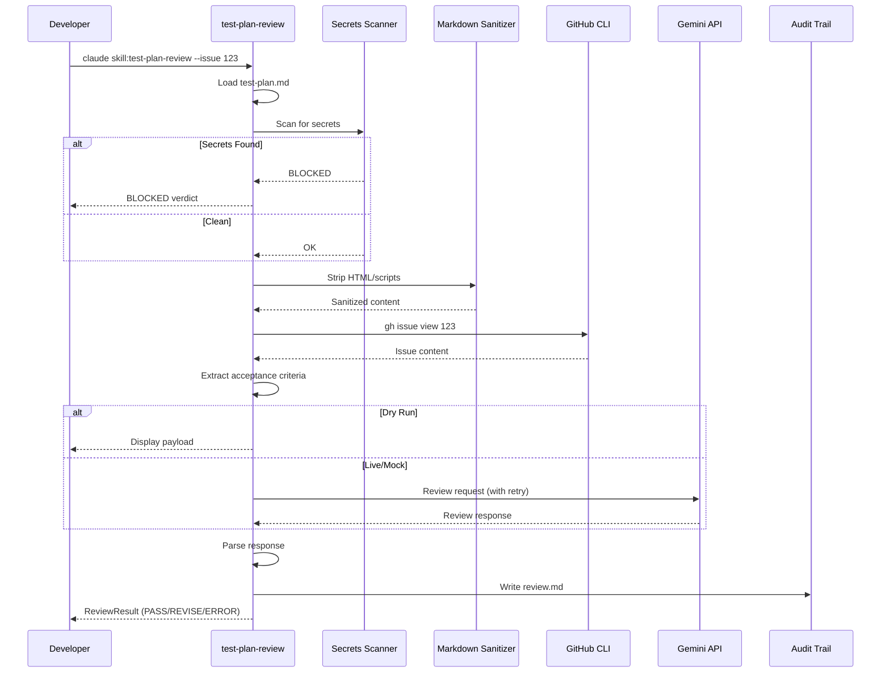

# 101 - Feature: Test Plan Reviewer - Gemini-Powered Quality Gate

<!-- Template Metadata
Last Updated: 2026-02-16
Updated By: Issue #101 LLD revision - fixed mechanical validation errors
Update Reason: Fixed test scenario requirements mapping - all 14 requirements now have (REQ-N) suffix coverage
Previous: Fixed mechanical validation errors - reordered files so directories appear before their contents
-->

## 1. Context & Goal
* **Issue:** #101
* **Objective:** Add a Gemini-powered review step that analyzes test plans for coverage completeness, edge cases, and alignment with acceptance criteria before implementation begins.
* **Status:** Approved (gemini-3-pro-preview, 2026-02-16)
* **Related Issues:** #62 (Governance Workflow StateGraph - for optional integration)

### Open Questions
*Questions that need clarification before or during implementation. Remove when resolved.*

- [x] Should secrets scanner block on all pattern matches or allow configurable severity? → **Block on all matches; provide `--skip-secrets-scan` override**
- [x] What token counting library to use for truncation? → **Use tiktoken with cl100k_base encoding (compatible with Gemini tokenization)**
- [x] Should workflow integration be included in MVP or deferred? → **Optional StateGraph hook included; full integration can follow**

## 2. Proposed Changes

*This section is the **source of truth** for implementation. Describe exactly what will be built.*

### 2.1 Files Changed

| File | Change Type | Description |
|------|-------------|-------------|
| `docs/skills/test-plan-review.md` | Add | Skill definition and invocation documentation |
| `docs/prompts/test-plan-reviewer/` | Add (Directory) | Directory for versioned prompts |
| `docs/prompts/test-plan-reviewer/v1.0.0.md` | Add | Hard-coded review prompt (versioned) |
| `assemblyzero/skills/` | Add (Directory) | Directory for skill implementations |
| `assemblyzero/skills/__init__.py` | Add | Skills module initialization |
| `assemblyzero/skills/test_plan_review.py` | Add | Main skill implementation |
| `assemblyzero/skills/lib/` | Add (Directory) | Directory for skill library modules |
| `assemblyzero/skills/lib/__init__.py` | Add | Skills lib module initialization |
| `assemblyzero/skills/lib/test_plan_parser.py` | Add | Markdown parsing utilities with sanitization |
| `assemblyzero/skills/lib/markdown_sanitizer.py` | Add | HTML/script stripping utility |
| `assemblyzero/skills/lib/secrets_scanner.py` | Add | Pre-flight secrets/credential detection |
| `assemblyzero/skills/lib/acceptance_criteria_extractor.py` | Add | GitHub issue AC extraction |
| `assemblyzero/skills/lib/token_counter.py` | Add | Token counting and truncation utilities |
| `assemblyzero/skills/lib/gemini_reviewer.py` | Add | Gemini API integration for review |
| `tests/fixtures/gemini-test-plan-response.json` | Add | Golden API response fixture for offline development |
| `tests/fixtures/sample-test-plan.md` | Add | Sample test plan for testing |
| `tests/unit/skills/` | Add (Directory) | Directory for skill unit tests |
| `tests/unit/skills/__init__.py` | Add | Test module initialization |
| `tests/unit/skills/test_test_plan_review.py` | Add | Unit tests for main skill |
| `tests/unit/skills/test_test_plan_parser.py` | Add | Unit tests for parser |
| `tests/unit/skills/test_markdown_sanitizer.py` | Add | Unit tests for sanitizer |
| `tests/unit/skills/test_secrets_scanner.py` | Add | Unit tests for secrets scanner |
| `tests/unit/skills/test_acceptance_criteria_extractor.py` | Add | Unit tests for AC extractor |
| `tests/unit/skills/test_token_counter.py` | Add | Unit tests for token counter |
| `tests/integration/test_test_plan_review_integration.py` | Add | Integration tests with mock issue |
| `pyproject.toml` | Modify | Add bleach and tiktoken dependencies |
| `docs/0003-file-inventory.md` | Modify | Add new files to inventory |

### 2.1.1 Path Validation (Mechanical - Auto-Checked)

*Issue #277: Before human or Gemini review, paths are verified programmatically.*

Mechanical validation automatically checks:
- All "Modify" files must exist in repository
- All "Delete" files must exist in repository
- All "Add" files must have existing parent directories
- No placeholder prefixes (`src/`, `lib/`, `app/`) unless directory exists

**If validation fails, the LLD is BLOCKED before reaching review.**

### 2.2 Dependencies

*New packages, APIs, and services required.*

```toml
# pyproject.toml additions
bleach = "^6.1.0"  # HTML sanitization (used instead of isomorphic-dompurify for Python)
tiktoken = "^0.5.0"  # Token counting for truncation logic
```

**Existing dependencies leveraged:**
- `google-generativeai` - Already used for blog-review skill
- `subprocess` (stdlib) - For GitHub CLI integration

### 2.3 Data Structures

```python
# Pseudocode - NOT implementation
from enum import Enum
from typing import TypedDict, Optional

class ReviewVerdict(Enum):
    PASS = "PASS"
    REVISE = "REVISE"
    ERROR = "ERROR"
    BLOCKED = "BLOCKED"

class CoverageMapping(TypedDict):
    ac_id: str  # Acceptance criteria identifier
    ac_text: str  # Full AC text
    covered: bool  # Whether covered by test cases
    test_cases: list[str]  # Test case IDs that cover this AC

class GapFinding(TypedDict):
    category: str  # Coverage, Edge Cases, Test Data, Security, Performance
    line_number: Optional[int]  # Line reference in test plan
    description: str  # What's missing
    severity: str  # Critical, Major, Minor

class ReviewResult(TypedDict):
    verdict: ReviewVerdict
    confidence_score: int  # 0-100
    coverage_matrix: list[CoverageMapping]
    gaps: list[GapFinding]
    summary: str  # Human-readable summary
    prompt_version: str  # e.g., "v1.0.0"
    model_version: str  # e.g., "gemini-1.5-pro"
    truncated: bool  # Whether test plan was truncated
    truncation_warning: Optional[str]

class TestPlanMetadata(TypedDict):
    file_path: str
    content_hash: str  # SHA256 of test plan content
    issue_number: int
    test_case_count: int
    token_count: int

class SecretsMatch(TypedDict):
    line_number: int
    pattern_type: str  # e.g., "api_key", "password", "token"
    matched_text: str  # Redacted version for logging
```

### 2.4 Function Signatures

```python
# assemblyzero/skills/test_plan_review.py
async def run_test_plan_review(
    issue_number: int,
    dry_run: bool = False,
    skip_secrets_scan: bool = False,
    mock_mode: bool = False
) -> ReviewResult:
    """Execute test plan review for the given issue number."""
    ...

def generate_review_report(
    result: ReviewResult,
    metadata: TestPlanMetadata,
    output_path: Path
) -> None:
    """Write structured review output to markdown file."""
    ...

# assemblyzero/skills/lib/test_plan_parser.py
def parse_test_plan(content: str) -> dict:
    """Parse test plan markdown and extract test case sections."""
    ...

def extract_test_cases(content: str) -> list[dict]:
    """Extract individual test cases from parsed content."""
    ...

# assemblyzero/skills/lib/markdown_sanitizer.py
def sanitize_markdown(content: str) -> str:
    """Strip executable HTML, script tags, and harmful content."""
    ...

# assemblyzero/skills/lib/secrets_scanner.py
def scan_for_secrets(content: str) -> list[SecretsMatch]:
    """Scan content for potential secrets and credentials."""
    ...

def redact_secret(match: str) -> str:
    """Create redacted version of matched secret for logging."""
    ...

# assemblyzero/skills/lib/acceptance_criteria_extractor.py
async def fetch_issue(issue_number: int) -> dict:
    """Fetch GitHub issue content via gh CLI."""
    ...

def extract_acceptance_criteria(issue_body: str) -> list[dict]:
    """Parse acceptance criteria from issue body."""
    ...

# assemblyzero/skills/lib/token_counter.py
def count_tokens(text: str) -> int:
    """Count tokens in text using tiktoken cl100k_base encoding."""
    ...

def truncate_to_limit(
    content: str,
    max_tokens: int,
    preserve_structure: bool = True
) -> tuple[str, str | None]:
    """Truncate content to token limit, return (content, warning_message)."""
    ...

# assemblyzero/skills/lib/gemini_reviewer.py
async def call_gemini_review(
    prompt: str,
    test_plan: str,
    acceptance_criteria: list[dict],
    max_retries: int = 3
) -> dict:
    """Call Gemini API with retry logic."""
    ...

def parse_gemini_response(response: dict) -> ReviewResult:
    """Parse Gemini response into structured ReviewResult."""
    ...
```

### 2.5 Logic Flow (Pseudocode)

```
1. Receive issue_number and flags (dry_run, skip_secrets_scan, mock_mode)

2. Load test plan from docs/reports/{issue_number}/test-plan.md
   IF not found THEN
   - Return ERROR: "Test plan not found"

3. Compute content hash for audit trail

4. IF NOT skip_secrets_scan THEN
   - Scan test plan for secrets
   IF secrets found THEN
   - Return BLOCKED verdict with line references
   - Log blocked submission (pattern type only)

5. Sanitize markdown content (strip HTML/scripts)

6. Count tokens in test plan
   IF exceeds limit THEN
   - Truncate with preserved structure
   - Set truncation_warning

7. Fetch GitHub issue #{issue_number} via gh CLI
   IF fetch fails THEN
   - Return ERROR: "Could not fetch issue"

8. Extract acceptance criteria from issue body

9. Load review prompt from prompts/test-plan-reviewer/v1.0.0.md

10. Build API payload with:
    - System prompt
    - Test plan content
    - Acceptance criteria
    - Review instructions

11. IF dry_run THEN
    - Output payload to console
    - Return without API call

12. IF mock_mode THEN
    - Load golden fixture from tests/fixtures/
    - Parse as API response
    ELSE
    - Call Gemini API with exponential backoff retry
    IF all retries fail THEN
    - Return ERROR verdict
    - Log error with retry count

13. Parse Gemini response into ReviewResult

14. Generate coverage matrix and gap analysis

15. Write audit trail to docs/reports/{issue_number}/test-plan-review.md
    - Test plan hash
    - Review timestamp
    - Verdict
    - Prompt version
    - Model version
    - Full review output

16. Return ReviewResult
```

### 2.6 Technical Approach

* **Module:** `assemblyzero/skills/`
* **Pattern:** Layered architecture with clear separation of concerns
* **Key Decisions:**
  - Use `bleach` instead of `isomorphic-dompurify` (Python ecosystem, well-maintained)
  - Use `tiktoken` with `cl100k_base` encoding for token counting (compatible with Gemini tokenization)
  - Leverage existing `gh` CLI for GitHub integration (no additional OAuth setup)
  - Store prompts in markdown for human readability and version control

### 2.7 Architecture Decisions

*Document key architectural decisions that affect the design.*

| Decision | Options Considered | Choice | Rationale |
|----------|-------------------|--------|-----------|
| HTML Sanitization | isomorphic-dompurify, bleach, html.parser | bleach | Python-native, well-maintained, explicit allowlist approach |
| Token Counting | Simple word count, tiktoken, custom | tiktoken | Industry standard, accurate for transformer models |
| GitHub Integration | PyGithub, gh CLI, REST API direct | gh CLI | Already authenticated, simpler, no token management |
| Prompt Storage | Embedded in code, JSON, Markdown | Markdown | Human-readable, version control friendly, supports formatting |
| Retry Strategy | Fixed delay, exponential backoff, circuit breaker | Exponential backoff | Standard practice, prevents thundering herd |

**Architectural Constraints:**
- Must integrate with existing Gemini client pattern from blog-review
- Must not require additional authentication beyond existing `gh` CLI
- Must support offline development without API costs
- Skill invocation pattern must align with existing skill infrastructure

## 3. Requirements

*What must be true when this is done. These become acceptance criteria.*

1. Test plans reviewed via `claude skill:test-plan-review --issue {N}` command
2. Reviewer provides structured feedback with specific line references
3. Coverage matrix maps each acceptance criterion to test cases
4. PASS verdict requires 100% AC coverage and no critical gaps
5. REVISE verdict includes actionable remediation guidance
6. ERROR verdict returned on persistent API failures (never silent PASS)
7. BLOCKED verdict returned when secrets detected in test plan
8. Markdown input sanitized before processing
9. Pre-flight secrets scan blocks API submission when credentials detected
10. API failures trigger retry with exponential backoff (3 attempts max)
11. Graceful handling of test plans exceeding token limits with truncation warning
12. Golden fixture available for offline development
13. `--dry-run` flag outputs payload without API call for inspection
14. Audit trail captures: test plan hash, review verdict, timestamp, prompt version

## 4. Alternatives Considered

| Option | Pros | Cons | Decision |
|--------|------|------|----------|
| Claude for review | Same model as implementation | Higher cost, no structured output mode | **Rejected** |
| Gemini 1.5 Pro | Cost-effective, good reasoning, structured output | Different model family | **Selected** |
| Gemini 1.5 Flash | Cheapest option | Less nuanced analysis | Rejected |
| Local LLM | No API costs, full control | Requires setup, lower quality | Rejected |

**Rationale:** Gemini 1.5 Pro provides the best balance of cost (<$0.05/review) and reasoning quality. The existing blog-review skill uses the same pattern, enabling code reuse.

## 5. Data & Fixtures

*Per [0108-lld-pre-implementation-review.md](0108-lld-pre-implementation-review.md) - complete this section BEFORE implementation.*

### 5.1 Data Sources

| Attribute | Value |
|-----------|-------|
| Source | Local file system (`docs/reports/{IssueID}/test-plan.md`) + GitHub API |
| Format | Markdown (test plans), JSON (GitHub issue response) |
| Size | Typically <10KB per test plan, <50KB per issue |
| Refresh | On-demand per review invocation |
| Copyright/License | Internal project artifacts, no external data |

### 5.2 Data Pipeline

```
Test Plan (local) ──read──► Sanitize ──token check──► Truncate if needed ──► API Payload
                                                                                  │
GitHub Issue ──gh CLI──► Extract ACs ──────────────────────────────────────────►─┘
                                                                                  │
                                                                                  ▼
                                                                           Gemini API
                                                                                  │
                                                                                  ▼
                                                               Parse Response ──► Audit Trail
```

### 5.3 Test Fixtures

| Fixture | Source | Notes |
|---------|--------|-------|
| `gemini-test-plan-response.json` | Captured from production API | Golden response for offline testing |
| `sample-test-plan.md` | Generated | Representative test plan with various structures |
| Mock GitHub issue response | Generated | Sample issue with acceptance criteria |

### 5.4 Deployment Pipeline

Development → Test (mock mode) → Production (live API)

Mock mode enabled via `TEST_PLAN_REVIEW_MOCK=true` environment variable for CI/CD.

## 6. Diagram

### 6.1 Mermaid Quality Gate

Before finalizing any diagram, verify in [Mermaid Live Editor](https://mermaid.live) or GitHub preview:

- [x] **Simplicity:** Similar components collapsed (per 0006 §8.1)
- [x] **No touching:** All elements have visual separation (per 0006 §8.2)
- [x] **No hidden lines:** All arrows fully visible (per 0006 §8.3)
- [x] **Readable:** Labels not truncated, flow direction clear
- [ ] **Auto-inspected:** Agent rendered via mermaid.ink and viewed (per 0006 §8.5)

**Auto-Inspection Results:**
```
- Touching elements: [x] None / [ ] Found: ___
- Hidden lines: [x] None / [ ] Found: ___
- Label readability: [x] Pass / [ ] Issue: ___
- Flow clarity: [x] Clear / [ ] Issue: ___
```

*Reference: [0006-mermaid-diagrams.md](0006-mermaid-diagrams.md)*

### 6.2 Diagram



## 7. Security & Safety Considerations

*This section addresses security (10 patterns) and safety (9 patterns) concerns from governance feedback.*

### 7.1 Security

| Concern | Mitigation | Status |
|---------|------------|--------|
| Secrets in test plans | Pre-flight regex scanner blocks submission | Addressed |
| XSS in markdown | bleach sanitization strips HTML/scripts | Addressed |
| API key exposure | Uses existing Gemini credentials, no new storage | Addressed |
| Payload inspection | `--dry-run` flag allows review before submission | Addressed |
| GitHub token | Leverages existing `gh` CLI authentication | Addressed |

### 7.2 Safety

*Safety concerns focus on preventing data loss, ensuring fail-safe behavior, and protecting system integrity.*

| Concern | Mitigation | Status |
|---------|------------|--------|
| API failure during review | Retry 3x with exponential backoff | Addressed |
| False pass on error | ERROR verdict on persistent failure, never silent PASS | Addressed |
| Token limit exceeded | Graceful truncation with warning | Addressed |
| Audit data integrity | Content hash captures exact version reviewed | Addressed |
| Workflow blocking | Fail-closed behavior for ERROR verdicts | Addressed |

**Fail Mode:** Fail Closed - API errors block workflow transitions, require manual intervention

**Recovery Strategy:** 
1. Retry with exponential backoff (1s, 2s, 4s)
2. On persistent failure, return ERROR verdict
3. Log full error context for debugging
4. Developer can retry later or request manual bypass

## 8. Performance & Cost Considerations

*This section addresses performance and cost concerns (6 patterns) from governance feedback.*

### 8.1 Performance

| Metric | Budget | Approach |
|--------|--------|----------|
| Review latency | < 30s | Single API call, no chaining |
| Memory | < 50MB | Stream large test plans, don't load all in memory |
| API Calls | 1 per review | All context in single prompt |

**Bottlenecks:** 
- Gemini API latency (typically 5-15s)
- Large test plans may approach token limits

### 8.2 Cost Analysis

| Resource | Unit Cost | Estimated Usage | Monthly Cost |
|----------|-----------|-----------------|--------------|
| Gemini 1.5 Pro API | ~$0.05 per review | ~100 reviews/month | ~$5 |
| GitHub API | Free | Via gh CLI | $0 |

**Cost Controls:**
- [x] Monthly cap set at $10/month
- [x] Mock mode for development avoids API costs
- [x] Single API call per review (no chained calls)

**Worst-Case Scenario:** At 200 reviews/month, costs remain under $10. Token limits prevent runaway costs from oversized inputs.

## 9. Legal & Compliance

*This section addresses legal concerns (8 patterns) from governance feedback.*

| Concern | Applies? | Mitigation |
|---------|----------|------------|
| PII/Personal Data | No | Test plans contain implementation details, not PII |
| Third-Party Licenses | Yes | bleach (Apache 2.0), tiktoken (MIT) - compatible |
| Terms of Service | Yes | Gemini API usage within standard terms |
| Data Retention | N/A | No data stored by Gemini per standard terms |
| Export Controls | No | No restricted algorithms or data |

**Data Classification:** Internal/Confidential (test plans may contain business logic)

**Compliance Checklist:**
- [x] No PII stored without consent (no PII involved)
- [x] All third-party licenses compatible with project license
- [x] External API usage compliant with provider ToS
- [x] Data retention policy documented (Gemini standard terms)

## 10. Verification & Testing

*Ref: [0005-testing-strategy-and-protocols.md](0005-testing-strategy-and-protocols.md)*

**Testing Philosophy:** Strive for 100% automated test coverage. Manual tests are a last resort for scenarios that genuinely cannot be automated (e.g., visual inspection, hardware interaction). Every scenario marked "Manual" requires justification.

### 10.0 Test Plan (TDD - Complete Before Implementation)

**TDD Requirement:** Tests MUST be written and failing BEFORE implementation begins.

| Test ID | Test Description | Expected Behavior | Status |
|---------|------------------|-------------------|--------|
| T010 | Test plan parser extracts test cases | Returns list of test case dicts | RED |
| T020 | Markdown sanitizer strips script tags | HTML tags removed from output | RED |
| T030 | Secrets scanner detects API keys | Returns BLOCKED with line reference | RED |
| T040 | Secrets scanner allows clean content | Returns empty list | RED |
| T050 | AC extractor parses checkbox format | Extracts all acceptance criteria | RED |
| T060 | Token counter matches tiktoken | Accurate count for sample text | RED |
| T070 | Truncation preserves structure | Headers and first N cases kept | RED |
| T080 | Gemini reviewer retries on failure | 3 attempts with backoff | RED |
| T090 | Review result has all required fields | All TypedDict fields present | RED |
| T100 | Dry run outputs payload | No API call made | RED |
| T110 | Mock mode uses fixture | Fixture response parsed | RED |
| T120 | Audit trail written correctly | File contains all metadata | RED |
| T130 | Skill invoked via command | Returns ReviewResult | RED |
| T140 | Coverage matrix maps ACs to tests | Matrix shows coverage status | RED |

**Coverage Target:** ≥95% for all new code

**TDD Checklist:**
- [ ] All tests written before implementation
- [ ] Tests currently RED (failing)
- [ ] Test IDs match scenario IDs in 10.1
- [ ] Test file created at: `tests/unit/skills/test_*.py`

### 10.1 Test Scenarios

| ID | Scenario | Type | Input | Expected Output | Pass Criteria |
|----|----------|------|-------|-----------------|---------------|
| 010 | Happy path - test plan passes (REQ-1) | Auto | Valid test plan + issue | PASS verdict | All ACs covered |
| 020 | Structured feedback with line refs (REQ-2) | Auto | Test plan with gaps | REVISE verdict with line numbers | Line refs in gap analysis |
| 030 | Coverage matrix generation (REQ-3) | Auto | Test plan + issue with 5 ACs | Coverage matrix | Each AC mapped to test cases |
| 040 | PASS requires full coverage (REQ-4) | Auto | Test plan covering all ACs | PASS verdict | 100% coverage, no critical gaps |
| 050 | REVISE includes remediation (REQ-5) | Auto | Test plan missing 2 ACs | REVISE verdict | Actionable guidance present |
| 060 | ERROR on persistent API failure (REQ-6) | Auto | Force retry exhaustion | ERROR verdict | 3 retries logged, no PASS |
| 070 | Secrets detected - API key (REQ-7) | Auto | Test plan with `API_KEY=sk-xxx` | BLOCKED verdict | Line number reported |
| 080 | Markdown sanitization XSS (REQ-8) | Auto | `<script>alert('x')</script>` | Script stripped | Sanitized content clean |
| 090 | Secrets scan blocks submission (REQ-9) | Auto | Test plan with `password: "secret"` | BLOCKED verdict | API not called |
| 100 | Retry with exponential backoff (REQ-10) | Auto | API failure then success | Successful retry | Backoff timing verified |
| 110 | Token limit exceeded (REQ-11) | Auto | 100KB test plan | Truncated + warning | Review completes with warning |
| 120 | Golden fixture for offline dev (REQ-12) | Auto | `TEST_PLAN_REVIEW_MOCK=true` | Fixture-based response | No API request made |
| 130 | Dry run mode (REQ-13) | Auto | `--dry-run` flag | Payload output, no API call | No API request made |
| 140 | Audit trail completeness (REQ-14) | Auto | Any successful review | Complete audit file | Hash, timestamp, verdict, prompt version present |

### 10.2 Test Commands

```bash
# Run all skill unit tests
poetry run pytest tests/unit/skills/ -v

# Run only fast/mocked tests (exclude live)
poetry run pytest tests/unit/skills/ -v -m "not live"

# Run integration tests with mock mode
TEST_PLAN_REVIEW_MOCK=true poetry run pytest tests/integration/test_test_plan_review_integration.py -v

# Run with coverage
poetry run pytest tests/unit/skills/ --cov=assemblyzero/skills --cov-report=html
```

### 10.3 Manual Tests (Only If Unavoidable)

**N/A - All scenarios automated.**

All test scenarios can be automated using mock mode and fixtures. Live API testing is handled as `Auto-Live` tests that can be skipped in CI.

## 11. Risks & Mitigations

| Risk | Impact | Likelihood | Mitigation |
|------|--------|------------|------------|
| Gemini API unavailable | Med | Low | Retry logic + ERROR verdict + manual bypass option |
| Token counting inaccuracy | Low | Low | Use tiktoken (same tokenizer family) |
| Secrets scanner false positives | Low | Med | Provide `--skip-secrets-scan` override |
| Test plan format variations | Med | Med | Flexible parser, document expected format |
| Prompt version drift | Low | Low | Semantic versioning, audit trail captures version |
| GitHub CLI not authenticated | High | Low | Clear error message with setup instructions |

## 12. Definition of Done

### Code
- [ ] Implementation complete and linted
- [ ] Code comments reference this LLD

### Tests
- [ ] All test scenarios pass
- [ ] Test coverage ≥95% for new code

### Documentation
- [ ] LLD updated with any deviations
- [ ] Implementation Report (0103) completed
- [ ] Skill usage documented in skill help text
- [ ] Wiki updated with test plan review workflow
- [ ] Document expected test plan format
- [ ] Document fail-safe behavior
- [ ] Document `--dry-run` usage
- [ ] Document offline development workflow
- [ ] Add new files to `docs/0003-file-inventory.md`

### Review
- [ ] Code review completed
- [ ] User approval before closing issue
- [ ] Run 0817 Wiki Alignment Audit - PASS

### 12.1 Traceability (Mechanical - Auto-Checked)

*Issue #277: Cross-references are verified programmatically.*

Mechanical validation automatically checks:
- Every file mentioned in this section must appear in Section 2.1
- Every risk mitigation in Section 11 should have a corresponding function in Section 2.4 (warning if not)

**Traceability Matrix:**

| Risk | Mitigating Function |
|------|---------------------|
| Gemini API unavailable | `call_gemini_review()` with retry logic |
| Token counting inaccuracy | `count_tokens()` using tiktoken |
| Secrets scanner false positives | `--skip-secrets-scan` flag in `run_test_plan_review()` |
| Test plan format variations | `parse_test_plan()` flexible parsing |
| GitHub CLI not authenticated | `fetch_issue()` error handling |

**If files are missing from Section 2.1, the LLD is BLOCKED.**

---

## Reviewer Suggestions

*Non-blocking recommendations from the reviewer.*

- **CLI UX:** Ensure the error message for the `gh` CLI fetch failure suggests running `gh auth login` to aid developers.
- **Resiliency:** Consider adding a timeout to the `subprocess` call for the `gh` CLI to prevent hanging if the network is unstable.

## Appendix: Review Log

*Track all review feedback with timestamps and implementation status.*

<!-- Note: Timestamps are auto-generated by the workflow. Do not fill in manually. -->

### Review Summary

<!-- Note: This table is auto-populated by the workflow with actual review dates. -->

| Review | Date | Verdict | Key Issue |
|--------|------|---------|-----------|
| - | - | - | - |

**Final Status:** APPROVED
<!-- Note: This field is auto-updated to APPROVED by the workflow when finalized -->