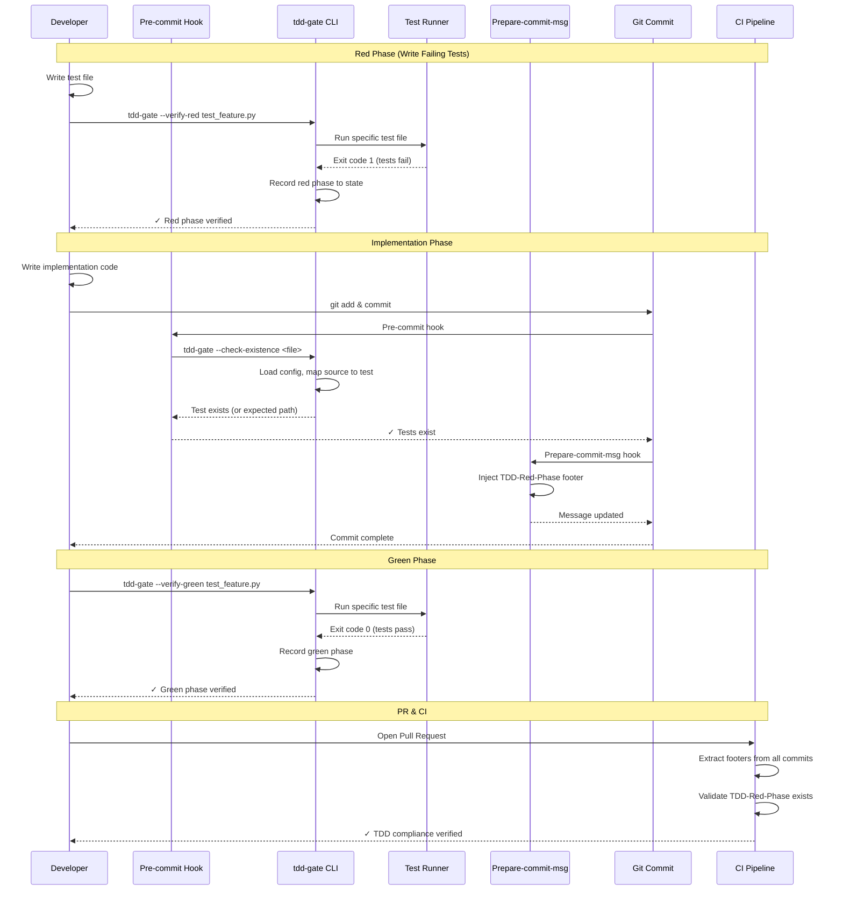
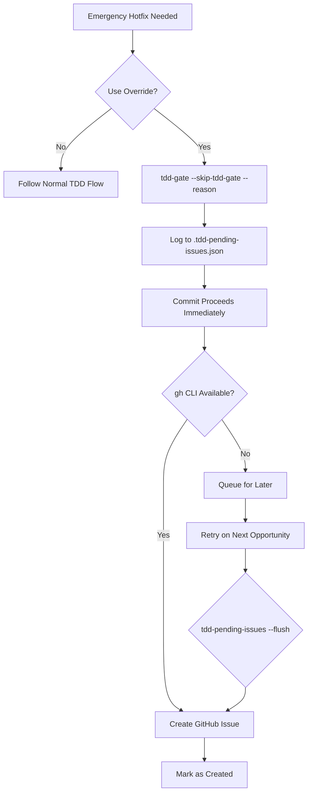

# 102 - Feature: TDD Test Initialization Gate

<!-- Template Metadata
Last Updated: 2025-01-XX
Updated By: Gemini Review #2 revisions
Update Reason: Address Safety violation - move pending issues storage to worktree
-->

## 1. Context & Goal
* **Issue:** #102
* **Objective:** Enforce TDD discipline by gating implementation work behind verified failing tests, ensuring the red-green-refactor cycle is followed for every feature.
* **Status:** Approved (gemini-3-pro-preview, 2026-02-04)
* **Related Issues:** #62 (Governance Workflow StateGraph)

### Open Questions
*All questions resolved during Gemini Review #1.*

- [x] ~~Does the team use "Squash and Merge" for Pull Requests?~~ **RESOLVED: Yes.** The design handles this correctly by scanning the entire commit range (`origin/main..HEAD`) in the CI pipeline.
- [x] ~~Does the team prefer strict blocking (CI failure) or soft blocking (warning/audit log) for the MVP?~~ **RESOLVED: Strict blocking.**
- [x] ~~Should the "Hotfix Override" require manager approval (via CODEOWNERS), or is developer self-attestation sufficient?~~ **RESOLVED: Developer self-attestation.**

## 2. Proposed Changes

*This section is the **source of truth** for implementation. Describe exactly what will be built.*

### 2.1 Files Changed

| File | Change Type | Description |
|------|-------------|-------------|
| `hooks/pre-commit-tdd-gate.sh` | Add | Pre-commit hook for test existence check (excludes docs/config files) |
| `hooks/prepare-commit-msg-tdd.sh` | Add | Prepare-commit-msg hook to append TDD footer to commit messages |
| `tools/tdd-gate.py` | Add | Main TDD enforcement CLI tool |
| `tools/tdd-audit.py` | Add | Audit trail generation and reporting |
| `tools/tdd-pending-issues.py` | Add | Async pending issue creation processor |
| `.tdd-config.json` | Add | Project-specific TDD configuration |
| `.husky/pre-commit` | Add | Husky hook configuration |
| `.husky/prepare-commit-msg` | Add | Husky hook configuration |
| `package.json` | Modify | Add `prepare` script for automatic husky installation |
| `.gitignore` | Modify | Add `.tdd-state.json` and `.tdd-pending-issues.json` to ignored files |
| `docs/standards/0065-tdd-enforcement.md` | Add | Standard documenting TDD gate rules |
| `CLAUDE.md` | Modify | Add TDD workflow section |

### 2.2 Dependencies

*New packages, APIs, or services required.*

```toml
# pyproject.toml additions
click = "^8.1.0"  # CLI framework for tools
```

```json
// package.json additions
{
  "devDependencies": {
    "husky": "^9.0.0"
  },
  "scripts": {
    "prepare": "husky"
  }
}
```

**External Dependencies:**
- GitHub CLI (`gh`) - Required for issue auto-creation feature
- pytest (Python) / Jest (JavaScript) - Test runners

### 2.3 Data Structures

```python
# Pseudocode - NOT implementation

class TDDState(TypedDict):
    """Local developer state (git-ignored)"""
    issue_id: str                    # Issue being worked on
    red_phase_completed: bool        # Has red phase been verified
    red_phase_sha: str              # Commit SHA of red phase verification
    red_phase_timestamp: str        # ISO timestamp
    test_file: str                  # Path to test file
    exit_code: int                  # Exit code from test run

class TDDConfig(TypedDict):
    """Project configuration (.tdd-config.json)"""
    test_patterns: Dict[str, List[str]]  # Language -> patterns (e.g., {"python": ["test_*.py"]})
    excluded_extensions: List[str]        # Files excluded from TDD gate
    min_test_count: int                   # Minimum tests required (default: 1)
    test_commands: Dict[str, str]         # Language -> test command
    source_to_test_mapping: Dict[str, str]  # Source pattern -> test pattern (e.g., "src/{name}.py" -> "tests/test_{name}.py")

class PendingIssue(TypedDict):
    """Pending issue for async creation"""
    reason: str                      # Override justification
    commit_sha: str                  # Commit that triggered override
    timestamp: str                   # ISO timestamp
    repo: str                        # Repository name
    created: bool                    # Has issue been created

class AuditEntry(TypedDict):
    """Entry in TDD audit trail"""
    phase: Literal["red", "green", "refactor"]
    timestamp: str                   # ISO timestamp
    commit_sha: str                  # Commit SHA
    test_file: str                   # Test file path
    exit_code: int                   # Test runner exit code
    test_output: Optional[str]       # Captured test output (failures only)
```

### 2.4 Function Signatures

```python
# tools/tdd-gate.py

@click.command()
@click.option('--verify-red', type=click.Path(exists=True), help='Verify red phase for test file')
@click.option('--verify-green', type=click.Path(exists=True), help='Verify green phase for test file')
@click.option('--check-existence', type=click.Path(), help='Check if test file exists for source file')
@click.option('--skip-tdd-gate', is_flag=True, help='Override TDD gate (requires --reason)')
@click.option('--reason', type=str, help='Justification for skipping TDD gate')
@click.option('--issue', type=str, help='Issue ID being worked on')
def main(verify_red: str, verify_green: str, check_existence: str, skip_tdd_gate: bool, reason: str, issue: str) -> None:
    """Main TDD gate CLI entry point."""
    ...

def load_config(config_path: str = ".tdd-config.json") -> TDDConfig:
    """Load TDD configuration from project config file."""
    ...

def map_source_to_test(source_file: str, config: TDDConfig) -> str:
    """Map source file path to expected test file path using config patterns."""
    ...

def check_test_exists(source_file: str, config: TDDConfig) -> Tuple[bool, str]:
    """Check if corresponding test file exists for source file, return (exists, expected_path)."""
    ...

def run_tests_scoped(test_file: str, config: TDDConfig) -> Tuple[int, str]:
    """Run tests for specific file only, return (exit_code, output)."""
    ...

def validate_exit_code(exit_code: int, phase: str) -> Tuple[bool, str]:
    """Validate exit code for given phase, return (valid, message)."""
    ...

def record_phase(phase: str, test_file: str, exit_code: int, output: str) -> None:
    """Record phase to local state and audit trail."""
    ...

def generate_commit_footer(sha: str, timestamp: str) -> str:
    """Generate TDD-Red-Phase footer for commit message."""
    ...

def get_pending_issues_path() -> str:
    """Get path to pending issues file within worktree (.tdd-pending-issues.json in repo root)."""
    ...

def log_override(reason: str, commit_sha: str) -> None:
    """Log override to .tdd-pending-issues.json in worktree root."""
    ...
```

```python
# tools/tdd-audit.py

def append_audit_entry(issue_id: str, entry: AuditEntry) -> None:
    """Append entry to audit trail (strictly additive)."""
    ...

def generate_compliance_report(issue_id: str) -> str:
    """Generate TDD compliance report for issue."""
    ...

def extract_footers_from_branch(base_ref: str, head_ref: str) -> List[str]:
    """Extract TDD-Red-Phase footers from all commits in branch."""
    ...
```

```python
# tools/tdd-pending-issues.py

def get_pending_issues_path() -> str:
    """Get path to pending issues file (.tdd-pending-issues.json in worktree root)."""
    ...

def load_pending_issues() -> List[PendingIssue]:
    """Load pending issues from .tdd-pending-issues.json in worktree."""
    ...

def create_issue_async(issue: PendingIssue) -> bool:
    """Attempt to create GitHub issue, return success."""
    ...

@click.command()
@click.option('--flush', is_flag=True, help='Force upload all pending issues')
@click.option('--process', is_flag=True, help='Process pending issues if possible')
def main(flush: bool, process: bool) -> None:
    """Process pending TDD override issues."""
    ...
```

### 2.5 Logic Flow (Pseudocode)

#### Pre-commit Hook Flow
```
1. Get list of staged files
2. Load configuration from .tdd-config.json
3. FOR each staged file:
   a. IF extension in excluded_extensions (md, json, yaml, etc.)
      - SKIP this file
   b. IF file is source code (py, js, ts, etc.)
      - CALL tdd-gate.py --check-existence <file>
      - Tool uses config to determine expected test file pattern
      - CHECK if corresponding test file exists
      - IF no test file exists
        - PRINT expected test file path to console
        - BLOCK commit with error message
4. IF all files pass
   - Allow commit to proceed
```

#### Check Existence Flow (NEW - addresses architecture gap)
```
1. Receive source file path
2. Load TDD configuration
3. Determine language from file extension
4. Apply source_to_test_mapping pattern from config
5. Construct expected test file path
6. CHECK if test file exists on disk
7. RETURN (exists: bool, expected_path: str)
8. IF not exists:
   - Print helpful message: "Expected test file: {path}"
```

#### Red Phase Verification Flow
```
1. Receive test file path
2. Validate test file exists and matches naming convention
3. Detect test framework from file extension
4. Run test command SCOPED to specific file only
5. Capture exit code and output
6. VALIDATE exit code:
   - IF exit_code == 1: Valid red phase (tests failed)
   - IF exit_code == 0: Invalid (tests passed)
   - IF exit_code == 2: Invalid (collection error)
   - IF exit_code == 5: Invalid (no tests found)
7. IF valid:
   - Record to local state
   - Record to audit trail
   - Output success message
8. ELSE:
   - Output specific error based on exit code
   - Do NOT record phase
```

#### Prepare-commit-msg Hook Flow
```
1. Check if local TDD state has completed red phase
2. IF red phase completed:
   - Read current commit message
   - Append footer: "TDD-Red-Phase: <sha>:<timestamp>"
   - Write updated message
3. ELSE:
   - Leave message unchanged (pre-commit should have blocked)
```

#### Override Flow
```
1. Validate --reason is provided
2. Log override to .tdd-pending-issues.json (in worktree root):
   - reason, commit_sha, timestamp, repo
3. Allow commit to proceed (non-blocking)
4. Attempt async issue creation:
   - IF gh available and authenticated
     - Create issue via gh issue create
     - Mark pending entry as created
   - ELSE
     - Leave in queue for later processing
```

#### CI Footer Extraction Flow
```
1. Get all commits in PR branch (origin/main..HEAD)
2. FOR each commit:
   - Extract commit message
   - Search for "TDD-Red-Phase:" footer
3. IF any commit has valid footer:
   - Extract SHA and timestamp
   - Validate SHA exists in repo
   - PASS CI check
4. IF no footer found:
   - Check if coverage requirements met (fallback)
   - IF coverage OK: PASS with warning
   - ELSE: FAIL CI check
```

### 2.6 Technical Approach

* **Module:** `tools/tdd-gate.py`, `tools/tdd-audit.py`, `tools/tdd-pending-issues.py`
* **Pattern:** Command pattern for CLI, append-only audit log
* **Key Decisions:** 
  - Commit message footers for state transport (not committed JSON files)
  - File-scoped test execution (not full suite)
  - Non-blocking override with async issue creation
  - Shell hooks delegate all config/mapping logic to Python CLI via `--check-existence`
  - **UPDATED:** Pending issues stored in worktree (`.tdd-pending-issues.json`) not user home

### 2.7 Architecture Decisions

| Decision | Options Considered | Choice | Rationale |
|----------|-------------------|--------|-----------|
| State transport mechanism | Committed JSON file, Branch metadata, Commit footers | Commit footers | Survives rebases, no merge conflicts, CI can extract from any commit |
| Test execution scope | Full suite, File-scoped | File-scoped | Performance - prevents 10+ minute waits for single file verification |
| Override blocking | Blocking (require issue creation), Non-blocking (async) | Non-blocking | Emergency hotfixes must not be blocked by network/API issues |
| Hook type for footer | post-commit, prepare-commit-msg | prepare-commit-msg | Runs before GPG signing, doesn't invalidate signatures |
| Audit storage | Database, JSON file, Markdown | Markdown | Human-readable, version controlled, append-only pattern |
| Source-to-test mapping logic | In shell script, In Python CLI | Python CLI | Centralizes config parsing, avoids duplication, enables testing |
| Pending issues storage | User home (~/.tdd-pending-issues.json), Worktree root (.tdd-pending-issues.json), .git directory | Worktree root | Avoids cross-project contamination, stays within worktree scope, cleaned up when repo deleted |

**Architectural Constraints:**
- Must work offline (override flow)
- Must not break GPG-signed commits
- Must support squash/rebase PR workflows
- Must be language-agnostic (pytest + Jest initially)
- Shell hooks must delegate config-dependent logic to Python CLI
- **All file operations must be scoped to the worktree (safety constraint)**

## 3. Requirements

*What must be true when this is done. These become acceptance criteria.*

1. Pre-commit hook blocks commits to source files without corresponding test files
2. Documentation and configuration files are excluded from TDD gate
3. Red phase verification runs only the specific test file, not full suite
4. Red phase requires exit code 1 (test failures); codes 0, 2, 5 are rejected with specific messages
5. Green phase requires exit code 0 (tests pass)
6. Commit message footer `TDD-Red-Phase: <sha>:<timestamp>` is injected via prepare-commit-msg hook
7. CI extracts footers from all commits in PR branch (supports squash workflows)
8. Override flag `--skip-tdd-gate --reason "<text>"` allows emergency bypass
9. Override is non-blocking; issue creation is async with local queue
10. Audit trail in `docs/reports/{IssueID}/tdd-audit.md` is strictly append-only
11. Husky automatically installs hooks on `npm install`
12. Configuration via `.tdd-config.json` for patterns and exclusions

## 4. Alternatives Considered

| Option | Pros | Cons | Decision |
|--------|------|------|----------|
| Committed `.tdd-state.json` | Simple state management | Merge conflicts, clutters repo | **Rejected** |
| Commit message footers | No conflicts, survives rebase, CI-extractable | Slightly complex parsing | **Selected** |
| Full suite on red phase | Catches integration issues | 10+ minute waits, blocks developer flow | **Rejected** |
| File-scoped test execution | Fast feedback (seconds), good DX | May miss integration issues | **Selected** |
| Blocking override (require issue) | Ensures follow-up | Blocks P0 hotfixes if offline | **Rejected** |
| Non-blocking override (async issue) | Never blocks emergencies | Requires queue management | **Selected** |
| Source-to-test mapping in shell | Simpler hook | Duplicates config logic, harder to test | **Rejected** |
| Source-to-test mapping in Python CLI | Testable, centralized | Extra CLI call | **Selected** |
| Pending issues in user home (~/) | Persists across repos | Cross-project contamination, violates worktree scope | **Rejected** |
| Pending issues in worktree root | Project-isolated, cleaned with repo | Lost if worktree deleted before flush | **Selected** |

**Rationale:** Developer experience and emergency response are prioritized. State travels with commits to handle complex git workflows. File-scoped execution provides fast feedback. Config logic centralized in Python for testability. Pending issues stored in worktree to maintain project isolation and safety.

## 5. Data & Fixtures

### 5.1 Data Sources

| Attribute | Value |
|-----------|-------|
| Source | Git repository (commit history, staged files) |
| Format | Git objects, file paths, exit codes |
| Size | Per-commit metadata (~100 bytes footer) |
| Refresh | Real-time on git operations |
| Copyright/License | N/A (internal tooling) |

### 5.2 Data Pipeline

```
Staged Files ──pre-commit──► tdd-gate --check-existence ──pass/fail──► Commit Allowed/Blocked

Test File ──tdd-gate──► Test Runner ──exit code──► Phase Validation ──append──► Audit Trail

Commit ──prepare-commit-msg──► Footer Injection ──write──► Final Commit Message
```

### 5.3 Test Fixtures

| Fixture | Source | Notes |
|---------|--------|-------|
| Passing test file | Generated | `def test_pass(): assert True` |
| Failing test file | Generated | `def test_fail(): assert False` |
| Empty test file | Generated | `# no tests` |
| Syntax error test | Generated | `def test_broken(: pass` |
| Mock git repo | Generated | Temporary git init for integration tests |
| Sample .tdd-config.json | Generated | Various config scenarios for testing |

### 5.4 Deployment Pipeline

**Local Development:**
1. `npm install` triggers husky prepare script
2. Hooks installed to `.husky/` directory
3. First commit triggers hook execution

**CI:**
1. Workflow extracts footers from commit range
2. Validates red phase proof exists
3. Blocks PR merge if missing (unless coverage fallback met)

## 6. Diagram

### 6.1 Mermaid Quality Gate

Before finalizing any diagram, verify in [Mermaid Live Editor](https://mermaid.live) or GitHub preview:

- [x] **Simplicity:** Similar components collapsed (per 0006 §8.1)
- [x] **No touching:** All elements have visual separation (per 0006 §8.2)
- [x] **No hidden lines:** All arrows fully visible (per 0006 §8.3)
- [x] **Readable:** Labels not truncated, flow direction clear
- [ ] **Auto-inspected:** Agent rendered via mermaid.ink and viewed (per 0006 §8.5)

**Auto-Inspection Results:**
```
- Touching elements: [ ] None / [ ] Found: ___
- Hidden lines: [ ] None / [ ] Found: ___
- Label readability: [ ] Pass / [ ] Issue: ___
- Flow clarity: [ ] Clear / [ ] Issue: ___
```

*Reference: [0006-mermaid-diagrams.md](0006-mermaid-diagrams.md)*

### 6.2 TDD Gate Workflow Diagram



### 6.3 Override Flow Diagram



## 7. Security & Safety Considerations

### 7.1 Security

| Concern | Mitigation | Status |
|---------|------------|--------|
| Command injection via --reason | Use subprocess with list args (never shell=True) | Addressed |
| Token exposure in logs | Never log GITHUB_TOKEN, use gh auth session | Addressed |
| Malicious test file execution | Tests run in isolated subprocess, no shell expansion | Addressed |
| Unauthorized override usage | Override logged and visible in PR, audit trail | Addressed |

### 7.2 Safety

| Concern | Mitigation | Status |
|---------|------------|--------|
| Blocked emergency hotfix | Non-blocking override with async issue creation | Addressed |
| Network failure during issue creation | Local queue with retry mechanism | Addressed |
| Corrupted audit trail | Append-only writes, no modifications | Addressed |
| Hook breaks all commits | Graceful degradation with clear error messages | Addressed |
| GPG signature invalidation | Use prepare-commit-msg (before signing) not post-commit | Addressed |
| Cross-project contamination | Pending issues stored in worktree root, not user home | Addressed |
| State files outside worktree | All state files (.tdd-state.json, .tdd-pending-issues.json) in worktree root | Addressed |

**Fail Mode:** Fail Open for overrides - Emergency commits always proceed, issue creation is async.

**Recovery Strategy:** 
- If hooks fail: Clear error message with manual bypass instructions
- If issue creation fails: Queued locally in worktree, retried automatically or via `--flush`
- If audit file corrupted: Create new audit file, log discontinuity

## 8. Performance & Cost Considerations

### 8.1 Performance

| Metric | Budget | Approach |
|--------|--------|----------|
| Red phase verification | < 10s | File-scoped test execution |
| Pre-commit hook | < 2s | Simple file existence check via CLI |
| Prepare-commit-msg | < 100ms | Read/write state file |
| CI footer extraction | < 5s | Git log parsing |
| tdd-gate.py startup | < 200ms | Minimal imports, lazy loading |

**Bottlenecks:** 
- Slow test files will impact red/green verification (user-controlled)
- Large repos with many commits may slow CI extraction (mitigated by commit range)
- Multiple staged files each invoke `--check-existence` - consider `--batch` mode for future optimization

### 8.2 Cost Analysis

| Resource | Unit Cost | Estimated Usage | Monthly Cost |
|----------|-----------|-----------------|--------------|
| GitHub API (issue creation) | Free | ~10 issues/month (overrides) | $0 |
| CI compute time | Included | ~5s per PR | $0 |
| Storage (audit files) | Negligible | ~1KB per issue | $0 |

**Cost Controls:**
- [x] No external paid services required
- [x] Uses existing GitHub Actions allocation
- [x] No per-call API costs

**Worst-Case Scenario:** 100 overrides/day would create 100 issues - still within GitHub rate limits and free tier.

## 9. Legal & Compliance

| Concern | Applies? | Mitigation |
|---------|----------|------------|
| PII/Personal Data | No | Only stores commit SHAs, timestamps, file paths |
| Third-Party Licenses | Yes | Click (BSD), Husky (MIT) - compatible |
| Terms of Service | Yes | GitHub CLI usage compliant |
| Data Retention | No | Audit trail is version-controlled project documentation |
| Export Controls | No | No restricted algorithms or data |

**Data Classification:** Internal (project tooling metadata)

**Compliance Checklist:**
- [x] No PII stored
- [x] All third-party licenses compatible with project license
- [x] External API usage compliant with provider ToS
- [x] Data retention is indefinite (version controlled)

## 10. Verification & Testing

### 10.0 Test Plan (TDD - Complete Before Implementation)

**TDD Requirement:** Tests MUST be written and failing BEFORE implementation begins.

| Test ID | Test Description | Expected Behavior | Status |
|---------|------------------|-------------------|--------|
| T010 | test_verify_red_exit_code_1_valid | Exit code 1 is accepted as valid red phase | RED |
| T020 | test_verify_red_exit_code_0_invalid | Exit code 0 rejected with "tests passed" message | RED |
| T030 | test_verify_red_exit_code_2_invalid | Exit code 2 rejected with "collection error" message | RED |
| T040 | test_verify_red_exit_code_5_invalid | Exit code 5 rejected with "no tests found" message | RED |
| T050 | test_verify_green_exit_code_0_valid | Exit code 0 is accepted as valid green phase | RED |
| T060 | test_file_scoped_execution | Only specified test file runs, not full suite | RED |
| T070 | test_commit_footer_injection | Footer correctly appended to commit message | RED |
| T080 | test_override_logs_pending_issue | Override creates entry in pending issues file | RED |
| T090 | test_override_reason_sanitized | Reason with special chars is safely escaped | RED |
| T100 | test_excluded_extensions_bypass | Markdown files bypass TDD gate | RED |
| T110 | test_audit_trail_append_only | Audit entries are appended, never modified | RED |
| T120 | test_ci_footer_extraction | Footers extracted from all branch commits | RED |
| T130 | test_source_to_test_mapping | Source file correctly maps to test file path | RED |
| T140 | test_check_existence_missing_test | Returns False and expected path when test missing | RED |
| T150 | test_check_existence_test_exists | Returns True when corresponding test exists | RED |
| T160 | test_config_loading | Config loaded and respected from .tdd-config.json | RED |
| T170 | test_config_custom_patterns | Custom test patterns from config are applied | RED |
| T180 | test_husky_auto_install | Husky hooks installed via npm install | RED |
| T190 | test_pending_issue_flush | Pending issues created and queue cleared on flush | RED |
| T200 | test_pending_issues_worktree_scoped | Pending issues file created in worktree root, not user home | RED |

**Coverage Target:** ≥95% for all new code

**TDD Checklist:**
- [ ] All tests written before implementation
- [ ] Tests currently RED (failing)
- [ ] Test IDs match scenario IDs in 10.1
- [ ] Test file created at: `tests/unit/test_tdd_gate.py`

### 10.1 Test Scenarios

| ID | Scenario | Type | Input | Expected Output | Pass Criteria |
|----|----------|------|-------|-----------------|---------------|
| 010 | Valid red phase (exit 1) | Auto | Test file with failing test | "Red phase verified" | Exit code 1 accepted |
| 020 | Invalid red (tests pass) | Auto | Test file with passing test | "Invalid: tests passed (exit 0)" | Clear error, blocked |
| 030 | Invalid red (collection error) | Auto | Test file with syntax error | "Invalid: collection error (exit 2)" | Clear error, blocked |
| 040 | Invalid red (no tests) | Auto | Empty test file | "Invalid: no tests found (exit 5)" | Error + naming hint |
| 050 | Valid green phase | Auto | Passing test file | "Green phase verified" | Exit code 0 accepted |
| 060 | File-scoped execution | Auto | Single test file in large suite | Only that file runs | Execution < 10s |
| 070 | Footer injection | Auto | Completed red phase | Footer in commit msg | Footer matches format |
| 080 | Override with reason | Auto | --skip-tdd-gate --reason "P0" | Logged to pending file | Entry created |
| 090 | Injection prevention | Auto | --reason '"; rm -rf /' | Reason stored literally | No shell execution |
| 100 | Excluded extensions | Auto | README.md change | Commit allowed | No test required |
| 110 | Append-only audit | Auto | Multiple phase entries | All entries preserved | File only grows |
| 120 | CI footer extraction | Auto | PR with multiple commits | Footer found | Extracted from any commit |
| 130 | Source-to-test mapping | Auto | src/utils.py | tests/test_utils.py | Correct path returned |
| 140 | Check existence - missing | Auto | Source file, no test | (False, expected_path) | Path printed to console |
| 150 | Check existence - present | Auto | Source file with test | (True, path) | Commit proceeds |
| 160 | Config loading | Auto | .tdd-config.json exists | Config values applied | min_test_count respected |
| 170 | Custom patterns | Auto | Config with custom pattern | Custom pattern used | Mapping follows config |
| 180 | Husky auto-install | Auto | Fresh npm install | Hooks installed | .husky/ populated |
| 190 | Pending issue flush | Auto | Queued issue + --flush | Issue created | Queue cleared |
| 200 | GPG signing compat | Auto | Signed commit | Signature valid | Footer present, sig valid |
| 210 | Pending issues worktree scope | Auto | Override triggered | File at .tdd-pending-issues.json | Not in user home |

### 10.2 Test Commands

```bash
# Run all automated tests
poetry run pytest tests/unit/test_tdd_gate.py tests/unit/test_tdd_audit.py -v

# Run only fast/mocked tests (exclude live)
poetry run pytest tests/unit/test_tdd_gate.py -v -m "not live"

# Run integration tests (requires git repo setup)
poetry run pytest tests/integration/test_tdd_integration.py -v

# Run live tests (hits actual gh CLI)
poetry run pytest tests/integration/test_tdd_integration.py -v -m live
```

### 10.3 Manual Tests (Only If Unavoidable)

| ID | Scenario | Why Not Automated | Steps |
|----|----------|-------------------|-------|
| M010 | GPG signing end-to-end | Requires GPG key configured | 1. Enable signing 2. Complete TDD cycle 3. Verify signature |
| M020 | Offline override flow | Network isolation difficult to automate | 1. Disconnect network 2. Use override 3. Verify local queue |

## 11. Risks & Mitigations

| Risk | Impact | Likelihood | Mitigation |
|------|--------|------------|------------|
| Developers find workarounds | Med | Med | Audit trail makes bypass visible; CI enforcement |
| Hook performance blocks workflow | High | Low | File-scoped execution; performance budget |
| Squash merge loses footers | High | Med | CI extracts from all branch commits |
| gh CLI not installed | Med | Med | Graceful degradation; clear install instructions |
| Test runner not detected | Med | Low | Configurable test commands; default patterns |
| Pending issues lost on worktree delete | Low | Low | Flush reminder in override output; CI also creates issues |

## 12. Definition of Done

### Code
- [ ] `tools/tdd-gate.py` implemented and linted
- [ ] `tools/tdd-audit.py` implemented and linted
- [ ] `tools/tdd-pending-issues.py` implemented and linted
- [ ] `hooks/pre-commit-tdd-gate.sh` implemented
- [ ] `hooks/prepare-commit-msg-tdd.sh` implemented
- [ ] Husky configuration complete
- [ ] Code comments reference this LLD

### Tests
- [ ] All test scenarios pass
- [ ] Test coverage ≥95% for new code
- [ ] Integration tests pass with mock git repo

### Documentation
- [ ] `docs/standards/0065-tdd-enforcement.md` created
- [ ] `CLAUDE.md` updated with TDD workflow section
- [ ] README updated with setup instructions
- [ ] LLD updated with any deviations
- [ ] Implementation Report (0103) completed
- [ ] Test Report (0113) completed

### Review
- [ ] Run 0809 Security Audit - PASS
- [ ] Run 0817 Wiki Alignment Audit - PASS
- [ ] Code review completed
- [ ] User approval before closing issue

---

## Reviewer Suggestions

*Non-blocking recommendations from the reviewer.*

- **Shell Script Integration Test:** While T080/T190 test the Python tool logic for overrides, ensure a manual smoke test verifies the actual shell hook returns exit code 0 when `--skip-tdd-gate` is used.
- **GitIgnore:** Verify that `.tdd-state.json` (local developer state) is also added to `.gitignore` to prevent accidental commit of local red/green status.

## Appendix: Review Log

*Track all review feedback with timestamps and implementation status.*

### Gemini Review #1 (REVISE)

**Reviewer:** Gemini 3 Pro
**Verdict:** REVISE

#### Comments

| ID | Comment | Implemented? |
|----|---------|--------------|
| G1.1 | "Req 1 (Source-to-Test Mapping): Need test verifying logic that maps source file to expected test file" | YES - Added T130, T140, T150 in Section 10.0/10.1 |
| G1.2 | "Req 12 (Configuration): Need test verifying config loading from .tdd-config.json" | YES - Added T160, T170 in Section 10.0/10.1 |
| G1.3 | "Interface Correctness: Add CLI command for check-existence so shell hook can delegate" | YES - Added `--check-existence` to Section 2.4 function signatures |
| G1.4 | "T040 Ambiguity: Distinguish pre-commit (file exists) from verification (running pytest)" | YES - T040 remains for verification; T140/T150 added for existence check |
| G1.5 | "Performance: Consider --batch mode for multiple files" | YES - Noted in Section 8.1 as future optimization |
| G1.6 | "DX: Print expected test file path when blocked" | YES - Added to Check Existence Flow in Section 2.5 |

### Gemini Review #2 (REVISE)

**Reviewer:** Gemini 3 Pro
**Verdict:** REVISE

#### Comments

| ID | Comment | Implemented? |
|----|---------|--------------|
| G2.1 | "Worktree Scope Violation: Pending issues stored in ~/.tdd-pending-issues.json violates safety protocol" | YES - Changed to .tdd-pending-issues.json in worktree root |
| G2.2 | "Recommendation: Store in .git/tdd-pending-issues.json or .tdd-pending-issues.json in root" | YES - Using .tdd-pending-issues.json in repo root, added to .gitignore |

### Review Summary

| Review | Date | Verdict | Key Issue |
|--------|------|---------|-----------|
| 3 | 2026-02-04 | APPROVED | `gemini-3-pro-preview` |
| Gemini #1 | - | REVISE | Requirement coverage 83% < 95%, missing source-to-test mapping tests |
| Gemini #2 | - | REVISE | Worktree scope violation - pending issues stored in user home |

**Final Status:** APPROVED