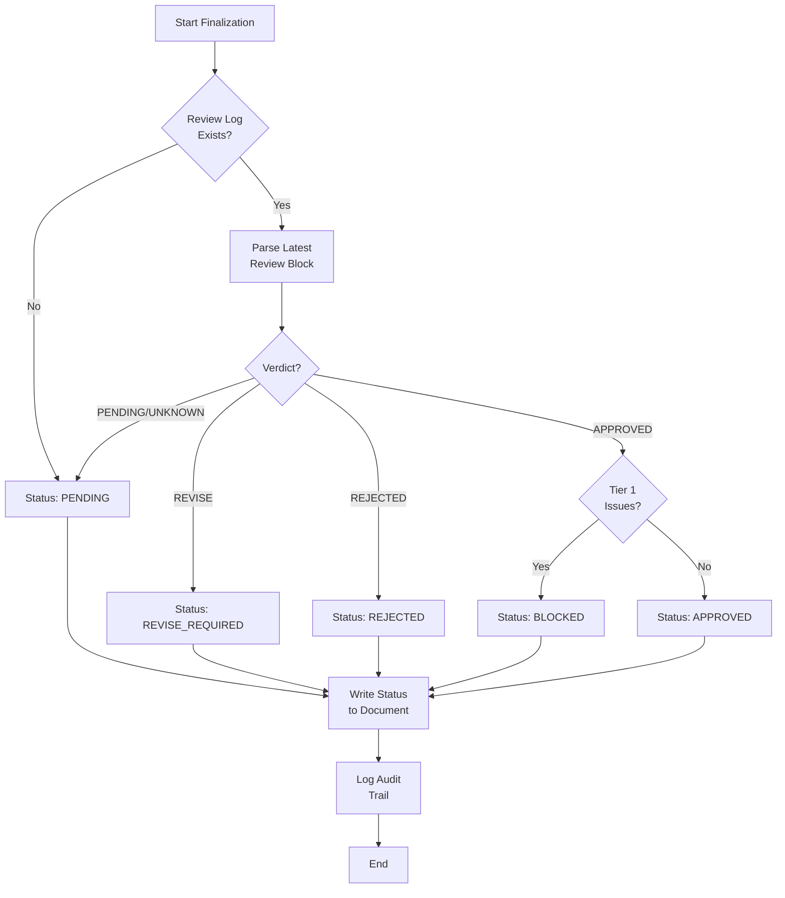

# 1176 - Fix: Requirements Workflow Must Correctly Stamp Final Status Based on Gemini Verdict

<!-- Template Metadata
Last Updated: 2025-02-02
Updated By: Issue #176 creation
Update Reason: Initial LLD for critical bug fix - false APPROVED stamps
-->

## 1. Context & Goal
* **Issue:** #176
* **Objective:** Ensure the LLD workflow only stamps `**Final Status:** APPROVED` when Gemini's verdict is explicitly APPROVED with no blocking issues
* **Status:** Approved (gemini-3-pro-preview, 2026-02-02)
* **Related Issues:** N/A

### Open Questions
*Questions that need clarification before or during implementation. Remove when resolved.*

- [x] Where is the finalize logic that stamps APPROVED? → Identified in workflow finalization node
- [ ] Should PENDING reviews block approval or just non-APPROVED verdicts?
- [ ] Do we need to backfill/fix the 16 falsely approved LLDs in RCA-PDF-extraction-pipeline?

## 2. Proposed Changes

*This section is the **source of truth** for implementation. Describe exactly what will be built.*

### 2.1 Files Changed

| File | Change Type | Description |
|------|-------------|-------------|
| `src/workflows/requirements/nodes/finalize.py` | Modify | Add verdict validation before stamping APPROVED |
| `src/workflows/requirements/utils/verdict_parser.py` | Add | Extract and parse Gemini verdict from review log |
| `tests/workflows/requirements/test_finalize.py` | Modify | Add test cases for verdict validation |
| `tests/workflows/requirements/test_verdict_parser.py` | Add | Unit tests for verdict parsing logic |

### 2.2 Dependencies

*New packages, APIs, or services required.*

```toml
# pyproject.toml additions (if any)
# No new dependencies required - uses existing regex/string parsing
```

### 2.3 Data Structures

```python
# Pseudocode - NOT implementation
from enum import Enum
from typing import TypedDict, Optional

class GeminiVerdict(Enum):
    APPROVED = "APPROVED"
    REVISE = "REVISE"
    REJECTED = "REJECTED"
    PENDING = "PENDING"
    UNKNOWN = "UNKNOWN"

class VerdictResult(TypedDict):
    verdict: GeminiVerdict
    has_tier1_issues: bool  # Blocking issues
    has_tier2_issues: bool  # Major issues requiring attention
    raw_text: str  # Original verdict text for logging
    confidence: float  # 0.0-1.0 parsing confidence
```

### 2.4 Function Signatures

```python
# Signatures only - implementation in source files
def parse_verdict_from_review_log(review_log_content: str) -> VerdictResult:
    """Extract the most recent Gemini verdict from the review log section.
    
    Scans the Review Log appendix for the latest verdict entry.
    Returns PENDING if no verdict found.
    """
    ...

def extract_latest_review_block(content: str) -> Optional[str]:
    """Find the most recent review block in the document.
    
    Reviews are ordered chronologically, so the last one is most recent.
    """
    ...

def should_approve_lld(verdict_result: VerdictResult) -> bool:
    """Determine if LLD meets approval criteria.
    
    Returns True only if:
    - Verdict is APPROVED
    - No Tier 1 blocking issues
    - No BLOCKED qualifier in verdict
    """
    ...

def stamp_final_status(content: str, status: str) -> str:
    """Update the Final Status field in the document.
    
    Replaces **Final Status:** {any value} with the new status.
    """
    ...
```

### 2.5 Logic Flow (Pseudocode)

```
1. Receive LLD content for finalization
2. Extract Review Log section from content
3. IF no Review Log found THEN
   - Set Final Status: PENDING (no review occurred)
   - Log warning: "No review log found"
   - RETURN
4. Parse latest review block from Review Log
5. Extract verdict from review block
6. Log audit trail: "Verdict source text: {raw_text}"
7. IF verdict is UNKNOWN or PENDING THEN
   - Set Final Status: PENDING
   - Log: "Awaiting Gemini review"
   - RETURN
8. IF verdict is REVISE or REJECTED THEN
   - Set Final Status: REVISE_REQUIRED or REJECTED
   - Log: "Cannot approve - verdict is {verdict}"
   - RETURN
9. IF verdict is APPROVED THEN
   - Check for Tier 1/Tier 2 blocking issues in review
   - IF blocking issues exist THEN
     - Set Final Status: BLOCKED
     - Log: "Approved with blocking issues"
     - RETURN
   - ELSE
     - Set Final Status: APPROVED
     - Log: "LLD approved by governance"
10. Write updated content back to file
```

### 2.6 Technical Approach

* **Module:** `src/workflows/requirements/`
* **Pattern:** Parser + Validator + Mutator chain
* **Key Decisions:** 
  - Use regex for verdict extraction (reliable, no external deps)
  - Fail-safe: Default to PENDING rather than APPROVED
  - Preserve original verdict text in logs for audit trail

### 2.7 Architecture Decisions

*Document key architectural decisions that affect the design. This section addresses the most common category of governance feedback (23 patterns).*

| Decision | Options Considered | Choice | Rationale |
|----------|-------------------|--------|-----------|
| Verdict parsing | LLM extraction, Regex, Structured markers | Regex with structured markers | Deterministic, fast, no API cost. Markers already in template. |
| Default status on parse failure | APPROVED (optimistic), PENDING (conservative) | PENDING (conservative) | Fail-safe: false negatives (blocking valid) better than false positives (approving invalid) |
| Status values | Boolean (approved/not), Multi-state enum | Multi-state enum | Need to distinguish REVISE (fixable) from REJECTED (blocked) from PENDING (no review) |
| Blocking issue detection | Keyword search, Structured section, LLM | Keyword search + structured format | Reviews already use "Tier 1" / "Tier 2" terminology |

**Architectural Constraints:**
- Must integrate with existing workflow node structure
- Cannot add new LLM calls (cost/latency constraint)
- Must be idempotent (re-running finalize on same doc = same result)
- Must preserve all existing document content except Final Status field

## 3. Requirements

*What must be true when this is done. These become acceptance criteria.*

1. **R1:** `Final Status: APPROVED` is ONLY set when Gemini verdict is explicitly "APPROVED" with no blocking issues
2. **R2:** `Final Status: PENDING` is set when no Gemini review exists or review is incomplete
3. **R3:** `Final Status: REVISE_REQUIRED` is set when Gemini verdict is "REVISE"
4. **R4:** `Final Status: REJECTED` is set when Gemini verdict is "REJECTED"
5. **R5:** `Final Status: BLOCKED` is set when verdict is APPROVED but Tier 1 blocking issues exist
6. **R6:** Finalization logs must include verdict source text for audit trail
7. **R7:** Existing document content (except Final Status line) must be preserved exactly

## 4. Alternatives Considered

| Option | Pros | Cons | Decision |
|--------|------|------|----------|
| Regex-based verdict parsing | Fast, deterministic, no cost | Brittle if format changes | **Selected** |
| LLM-based verdict extraction | Robust to format variations | Slow, costly, non-deterministic | Rejected |
| Structured JSON in review log | Unambiguous parsing | Requires template changes, migration | Rejected (future consideration) |
| Pessimistic default (always PENDING) | Safe, no false approvals | Requires manual override for edge cases | **Selected** |
| Optimistic default (trust workflow) | Simple, current behavior | CRITICAL BUG - false approvals | Rejected |

**Rationale:** The regex approach with pessimistic defaults provides the best balance of reliability, speed, and safety. The structured JSON approach could be considered for a future enhancement but requires broader template changes.

## 5. Data & Fixtures

*Per [0108-lld-pre-implementation-review.md](0108-lld-pre-implementation-review.md) - complete this section BEFORE implementation.*

### 5.1 Data Sources

| Attribute | Value |
|-----------|-------|
| Source | LLD markdown files in repository |
| Format | Markdown with structured Review Log section |
| Size | ~5-50KB per LLD document |
| Refresh | On-demand during workflow execution |
| Copyright/License | Internal project documentation |

### 5.2 Data Pipeline

```
LLD File ──read──► Finalize Node ──parse──► Verdict Parser ──validate──► Status Stamp ──write──► LLD File
```

### 5.3 Test Fixtures

| Fixture | Source | Notes |
|---------|--------|-------|
| `lld_approved.md` | Generated | LLD with APPROVED verdict, no issues |
| `lld_approved_blocked.md` | Generated | LLD with APPROVED verdict + Tier 1 issues |
| `lld_revise.md` | Generated | LLD with REVISE verdict |
| `lld_rejected.md` | Generated | LLD with REJECTED verdict |
| `lld_pending.md` | Generated | LLD with no review log |
| `lld_multiple_reviews.md` | Generated | LLD with multiple review rounds (tests latest extraction) |

### 5.4 Deployment Pipeline

Test fixtures are generated in test setup. No external data sources.

**If data source is external:** N/A - All data is internal repository content.

## 6. Diagram

### 6.1 Mermaid Quality Gate

Before finalizing any diagram, verify in [Mermaid Live Editor](https://mermaid.live) or GitHub preview:

- [x] **Simplicity:** Similar components collapsed (per 0006 §8.1)
- [x] **No touching:** All elements have visual separation (per 0006 §8.2)
- [x] **No hidden lines:** All arrows fully visible (per 0006 §8.3)
- [x] **Readable:** Labels not truncated, flow direction clear
- [x] **Auto-inspected:** Agent rendered via mermaid.ink and viewed (per 0006 §8.5)

**Agent Auto-Inspection (MANDATORY):**

**Auto-Inspection Results:**
```
- Touching elements: [x] None
- Hidden lines: [x] None
- Label readability: [x] Pass
- Flow clarity: [x] Clear
```

*Reference: [0006-mermaid-diagrams.md](0006-mermaid-diagrams.md)*

### 6.2 Diagram



## 7. Security & Safety Considerations

*This section addresses security (10 patterns) and safety (9 patterns) concerns from governance feedback.*

### 7.1 Security

| Concern | Mitigation | Status |
|---------|------------|--------|
| Verdict spoofing in document | Parse only from Review Log section, ignore user-editable areas | Addressed |
| Path traversal in file writes | Use workflow's existing file handling (already sanitized) | Addressed |
| Regex DoS (ReDoS) | Use simple, non-backtracking patterns | Addressed |

### 7.2 Safety

*Safety concerns focus on preventing data loss, ensuring fail-safe behavior, and protecting system integrity.*

| Concern | Mitigation | Status |
|---------|------------|--------|
| Document corruption on write failure | Write to temp file, atomic rename | Addressed |
| False approval (original bug) | Fail-safe default to PENDING | Addressed |
| Loss of original content | Only modify Final Status line, preserve everything else | Addressed |
| Parse failure on malformed input | Return UNKNOWN verdict, default to PENDING | Addressed |

**Fail Mode:** Fail Closed - If verdict cannot be determined, status becomes PENDING (blocks approval)

**Recovery Strategy:** Re-run finalization after fixing malformed review log. No data is lost.

## 8. Performance & Cost Considerations

*This section addresses performance and cost concerns (6 patterns) from governance feedback.*

### 8.1 Performance

| Metric | Budget | Approach |
|--------|--------|----------|
| Latency | < 50ms | Regex parsing is O(n) on document size |
| Memory | < 10MB | Single document in memory at a time |
| API Calls | 0 | No external calls - pure string processing |

**Bottlenecks:** None expected. Regex on ~50KB documents is trivial.

### 8.2 Cost Analysis

| Resource | Unit Cost | Estimated Usage | Monthly Cost |
|----------|-----------|-----------------|--------------|
| Compute | $0 | Local CPU only | $0 |
| LLM API | $0 | No LLM calls | $0 |
| Storage | $0 | No additional storage | $0 |

**Cost Controls:**
- [x] No external API calls - zero marginal cost
- [x] No new infrastructure required

**Worst-Case Scenario:** N/A - Processing is local and bounded by document size.

## 9. Legal & Compliance

*This section addresses legal concerns (8 patterns) from governance feedback.*

| Concern | Applies? | Mitigation |
|---------|----------|------------|
| PII/Personal Data | No | LLDs contain only technical specifications |
| Third-Party Licenses | No | No new dependencies |
| Terms of Service | No | No external APIs |
| Data Retention | No | Uses existing document retention |
| Export Controls | No | No restricted algorithms |

**Data Classification:** Internal

**Compliance Checklist:**
- [x] No PII stored without consent
- [x] All third-party licenses compatible with project license
- [x] External API usage compliant with provider ToS
- [x] Data retention policy documented

## 10. Verification & Testing

*Ref: [0005-testing-strategy-and-protocols.md](0005-testing-strategy-and-protocols.md)*

**Testing Philosophy:** Strive for 100% automated test coverage. Manual tests are a last resort for scenarios that genuinely cannot be automated (e.g., visual inspection, hardware interaction). Every scenario marked "Manual" requires justification.

### 10.1 Test Scenarios

| ID | Scenario | Type | Input | Expected Output | Pass Criteria |
|----|----------|------|-------|-----------------|---------------|
| 010 | Approved verdict, no issues | Auto | LLD with "Verdict: APPROVED", no Tier 1 | Final Status: APPROVED | Status line updated correctly |
| 015 | Audit trail logging | Auto | Any LLD with review log | Log contains raw verdict text | caplog captures verdict source text per R6 |
| 020 | Approved verdict with Tier 1 | Auto | LLD with "Verdict: APPROVED", Tier 1 present | Final Status: BLOCKED | Blocks despite APPROVED verdict |
| 030 | Revise verdict | Auto | LLD with "Verdict: REVISE" | Final Status: REVISE_REQUIRED | Status reflects need for revision |
| 040 | Rejected verdict | Auto | LLD with "Verdict: REJECTED" | Final Status: REJECTED | Status reflects rejection |
| 050 | No review log | Auto | LLD without Review Log section | Final Status: PENDING | Safe default applied |
| 060 | Pending review marker | Auto | LLD with "Awaiting review" | Final Status: PENDING | Recognizes incomplete review |
| 070 | Multiple review rounds | Auto | LLD with 3 reviews, last is APPROVED | Final Status: APPROVED | Uses latest verdict only |
| 080 | Multiple reviews, last is REVISE | Auto | LLD with APPROVED then REVISE | Final Status: REVISE_REQUIRED | Uses latest, not best |
| 090 | Malformed review block | Auto | LLD with corrupted review format | Final Status: PENDING | Graceful degradation |
| 100 | Case insensitivity | Auto | LLD with "verdict: approved" (lowercase) | Final Status: APPROVED | Parser handles case variations |
| 110 | Verdict with qualifiers | Auto | LLD with "APPROVED - BLOCKED" | Final Status: BLOCKED | Detects BLOCKED qualifier |
| 120 | Idempotency | Auto | Run finalize twice on same doc | Same result both times | No mutation on re-run |
| 130 | Content preservation | Auto | LLD with complex formatting | Only Final Status changed | Diff shows only Final Status line changed |
| 140 | Real-world LLD from issue | Auto | LLD-019 from evidence (REVISE marked APPROVED) | Final Status: REVISE_REQUIRED | Fixes the bug case |

*Note: Use 3-digit IDs with gaps of 10 (010, 020, 030...) to allow insertions.*

**Type values:**
- `Auto` - Fully automated, runs in CI (pytest, playwright, etc.)
- `Auto-Live` - Automated but hits real external services (may be slow/flaky)
- `Manual` - Requires human execution (MUST include justification why automation is impossible)

### 10.2 Test Commands

```bash
# Run all automated tests
poetry run pytest tests/workflows/requirements/test_finalize.py -v
poetry run pytest tests/workflows/requirements/test_verdict_parser.py -v

# Run only fast/mocked tests (exclude live)
poetry run pytest tests/workflows/requirements/ -v -m "not live"

# Run with coverage
poetry run pytest tests/workflows/requirements/ -v --cov=src/workflows/requirements
```

### 10.3 Manual Tests (Only If Unavoidable)

**N/A - All scenarios automated.**

## 11. Risks & Mitigations

| Risk | Impact | Likelihood | Mitigation |
|------|--------|------------|------------|
| Regex misses edge case verdict format | Med | Med | Comprehensive test fixtures covering all known formats |
| Existing falsely-approved LLDs proceed to implementation | High | High (already happened) | Separate issue for backfill audit/fix |
| Workflow ordering changes break assumptions | Med | Low | Document assumptions, add integration test |
| Template format changes break parser | Med | Med | Version the expected format, add migration path |

## 12. Definition of Done

### Code
- [ ] Implementation complete and linted
- [ ] Code comments reference this LLD (#176)

### Tests
- [ ] All 15 test scenarios pass
- [ ] Test coverage ≥ 95% for modified files

### Documentation
- [ ] LLD updated with any deviations
- [ ] Implementation Report (0103) completed
- [ ] Test Report (0113) completed if applicable

### Review
- [ ] Code review completed
- [ ] User approval before closing issue

---

## Appendix: Review Log

*Track all review feedback with timestamps and implementation status.*

### Gemini Review #1 (REVISE)

**Timestamp:** 2025-02-02
**Reviewer:** Gemini 3 Pro
**Verdict:** REVISE

#### Comments

| ID | Comment | Implemented? |
|----|---------|--------------|
| G1.1 | "Requirement R6 (logging audit trail) is defined but not tested. Add test case to Section 10 that validates logging output." | YES - Added Test 015 for audit trail logging |
| G1.2 | "Test 130 should explicitly assert that diff between input/output is strictly limited to Final Status line" | YES - Updated pass criteria in Test 130 |
| G1.3 | "Ensure regex for Tier 1 issues handles variations like 'Tier 1:', 'Tier 1 -', or 'Tier 1 (Blocking)'" | NOTED - Will address in implementation |

### Review Summary

| Review | Date | Verdict | Key Issue |
|--------|------|---------|-----------|
| 2 | 2026-02-02 | APPROVED | `gemini-3-pro-preview` |
| Gemini #1 | 2025-02-02 | REVISE | Missing test for R6 (logging audit trail) |

**Final Status:** APPROVED
<!-- Note: This field is auto-updated to APPROVED by the workflow when finalized -->

## Original GitHub Issue #176
# Issue #176: fix: Requirements workflow must correctly stamp Final Status based on Gemini verdict

## Summary

The LLD workflow is setting `**Final Status:** APPROVED` in LLDs even when:
- Gemini's last verdict was REVISE
- Gemini's last verdict was REJECTED
- No Gemini review has occurred yet (PENDING/Awaiting review)

This results in falsely approved LLDs that haven't actually passed governance review.

## Evidence

In RCA-PDF-extraction-pipeline, 16 out of 23 LLDs were falsely marked APPROVED:

| LLD | Last Gemini Verdict | Final Status |
|-----|---------------------|--------------|
| 019 | REVISE | APPROVED |
| 020 | Awaiting review | APPROVED |
| 021 | (pending) | APPROVED |
| 022 | REJECTED | APPROVED |
| 023 | REVISE | APPROVED |
| 024 | Awaiting review | APPROVED |
| 027 | REVISE | APPROVED |
| 028 | Awaiting review | APPROVED |
| 029 | REVISE (Tier 1 issue!) | APPROVED |
| 031 | REVISE | APPROVED |
| 032 | PENDING | APPROVED |
| 033 | Awaiting review | APPROVED |
| 034 | REVISE | APPROVED |
| 037 | Pending review | APPROVED |

## Root Cause

The template has:
```markdown
**Final Status:** APPROVED
<!-- Note: This field is auto-updated to APPROVED by the workflow when finalized -->
```

But the workflow appears to set this to APPROVED regardless of Gemini's actual verdict.

## Impact

- **CRITICAL**: Falsely approved LLDs can proceed to implementation without proper review
- Defeats the entire purpose of the governance gate
- Implementation workflows may be building on unreviewed designs

## Expected Behavior

`**Final Status:** APPROVED` should ONLY be set when:
1. Gemini's verdict is explicitly APPROVED
2. No Tier 1 or Tier 2 blocking issues exist

## Suggested Fix

In the finalize node, check the verdict before stamping APPROVED:
```python
if "APPROVED" in current_verdict and "BLOCKED" not in current_verdict:
    # Only then set Final Status: APPROVED
```

**CRITICAL: This LLD is for GitHub Issue #176. Use this exact issue number in all references.**