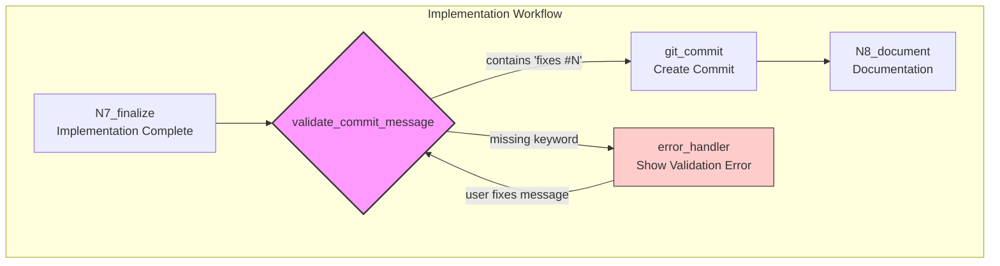

# 0190 - Feature: Add Commit Message Validation Node to Enforce 'fixes #N' Format

<!-- Template Metadata
Last Updated: 2025-01-XX
Updated By: Issue #190 creation
Update Reason: Initial LLD creation for commit message validation node
-->

## 1. Context & Goal
* **Issue:** #190
* **Objective:** Add a LangGraph node that validates commit messages contain issue-closing keywords (`fixes #N`, `closes #N`, or `resolves #N`) before allowing commits, preventing orphan issues.
* **Status:** Approved (gemini-3-pro-preview, 2026-02-02)
* **Related Issues:** #177, #187 (orphaned due to PR #186 missing keywords), #186

### Open Questions
*Questions that need clarification before or during implementation. Remove when resolved.*

- [ ] Should the validation be case-insensitive for the keyword (e.g., `Fixes #N` vs `fixes #N`)?
- [ ] Should we support multiple issue references (e.g., `fixes #177, fixes #187`)?
- [ ] What should happen if `state["issue_number"]` is not set (no associated issue)?

## 2. Proposed Changes

*This section is the **source of truth** for implementation. Describe exactly what will be built.*

### 2.1 Files Changed

| File | Change Type | Description |
|------|-------------|-------------|
| `src/nodes/validate_commit_message.py` | Add | New validation node for commit messages |
| `src/workflows/implementation_workflow.py` | Modify | Insert validation node before git commit |
| `src/state/workflow_state.py` | Modify | Ensure `commit_message` and `issue_number` fields exist |
| `tests/nodes/test_validate_commit_message.py` | Add | Unit tests for validation logic |
| `tests/workflows/test_implementation_workflow.py` | Modify | Integration tests for workflow with validation |

### 2.2 Dependencies

*No new packages required. Uses existing LangGraph infrastructure.*

```toml
# pyproject.toml additions (if any)
# None - using existing dependencies
```

### 2.3 Data Structures

```python
# Pseudocode - NOT implementation
class TestingWorkflowState(TypedDict):
    issue_number: Optional[int]  # GitHub issue number being addressed
    commit_message: str  # Proposed commit message to validate
    error_message: Optional[str]  # Error message if validation fails
    next_node: str  # Next node to route to
```

### 2.4 Function Signatures

```python
# Signatures only - implementation in source files
def validate_commit_message(state: TestingWorkflowState) -> dict:
    """
    Validate commit message contains issue-closing keyword.
    
    Blocks commit if message doesn't contain 'fixes #N', 'closes #N', 
    or 'resolves #N' where N matches state['issue_number'].
    
    Returns dict with either next_node='commit' or error routing.
    """
    ...

def build_issue_pattern(issue_number: int) -> list[str]:
    """
    Build list of valid issue-closing patterns for given issue number.
    
    Returns lowercase patterns like ['fixes #190', 'closes #190', 'resolves #190'].
    """
    ...

def extract_issue_references(message: str) -> list[tuple[str, int]]:
    """
    Extract all issue-closing references from a commit message.
    
    Returns list of (keyword, issue_number) tuples found.
    """
    ...
```

### 2.5 Logic Flow (Pseudocode)

```
1. Receive state with commit_message and issue_number
2. IF issue_number is None or 0 THEN
   - Log warning but allow commit (no issue to close)
   - Return {next_node: "commit"}
3. Build valid patterns: fixes #N, closes #N, resolves #N
4. Convert commit_message to lowercase for comparison
5. IF any pattern found in message THEN
   - Return {next_node: "commit"}
6. ELSE
   - Build helpful error message with correct format
   - Return {error_message: "...", next_node: "error"}
```

### 2.6 Technical Approach

* **Module:** `src/nodes/validate_commit_message.py`
* **Pattern:** LangGraph conditional node with binary routing
* **Key Decisions:** 
  - Case-insensitive matching for flexibility
  - Clear error messages that show exact format needed
  - Skip validation if no issue number (graceful degradation)

### 2.7 Architecture Decisions

*Document key architectural decisions that affect the design.*

| Decision | Options Considered | Choice | Rationale |
|----------|-------------------|--------|-----------|
| Node placement | Before commit vs. after commit check | Before commit | Fail-fast prevents wasted git operations |
| Validation strictness | Warn-only vs. block | Block | Orphan issues are the problem we're solving |
| Pattern matching | Exact match vs. regex | Simple string contains | Simpler, less error-prone, covers all cases |
| Case sensitivity | Case-sensitive vs. insensitive | Case-insensitive | GitHub accepts any case for keywords |

**Architectural Constraints:**
- Must integrate with existing LangGraph workflow structure
- Cannot modify git commit behavior itself, only pre-commit validation
- Must work with existing state schema or extend it minimally

## 3. Requirements

*What must be true when this is done. These become acceptance criteria.*

1. Validation node blocks commits missing `fixes #N`, `closes #N`, or `resolves #N`
2. Error message clearly indicates what format is required
3. Issue number in error message matches the current workflow's issue
4. Valid commits proceed to git commit node without modification
5. Issues auto-close when PRs with valid commits are merged

## 4. Alternatives Considered

| Option | Pros | Cons | Decision |
|--------|------|------|----------|
| Pre-commit git hook | Standard tooling, works outside workflow | Doesn't have access to issue number, harder to provide context | Rejected |
| Post-commit check with amend | Allows fixing after the fact | More complex, still might miss PR merge | Rejected |
| LangGraph validation node | Access to full state, clear error routing, fail-fast | Specific to this workflow system | **Selected** |
| PR title/body validation only | Less intrusive | Doesn't trigger GitHub auto-close | Rejected |

**Rationale:** The LangGraph node approach has full context (issue number, commit message) and can provide specific, actionable error messages. It prevents the issue before it happens rather than detecting it afterward.

## 5. Data & Fixtures

*Per [0108-lld-pre-implementation-review.md](0108-lld-pre-implementation-review.md) - complete this section BEFORE implementation.*

### 5.1 Data Sources

| Attribute | Value |
|-----------|-------|
| Source | Workflow state (in-memory) |
| Format | Python TypedDict |
| Size | Single commit message string (~100-500 chars) |
| Refresh | Per-commit validation |
| Copyright/License | N/A |

### 5.2 Data Pipeline

```
WorkflowState ──read──► validate_commit_message ──route──► commit OR error node
```

### 5.3 Test Fixtures

| Fixture | Source | Notes |
|---------|--------|-------|
| Valid commit messages | Generated | Various valid formats with keywords |
| Invalid commit messages | Generated | Missing keywords, wrong issue numbers |
| Edge case messages | Generated | Empty, very long, special characters |

### 5.4 Deployment Pipeline

No external data deployment needed. Validation logic is pure Python.

**If data source is external:** N/A - all data comes from workflow state.

## 6. Diagram

### 6.1 Mermaid Quality Gate

Before finalizing any diagram, verify in [Mermaid Live Editor](https://mermaid.live) or GitHub preview:

- [x] **Simplicity:** Similar components collapsed (per 0006 §8.1)
- [x] **No touching:** All elements have visual separation (per 0006 §8.2)
- [x] **No hidden lines:** All arrows fully visible (per 0006 §8.3)
- [x] **Readable:** Labels not truncated, flow direction clear
- [ ] **Auto-inspected:** Agent rendered via mermaid.ink and viewed (per 0006 §8.5)

**Auto-Inspection Results:**
```
- Touching elements: [ ] None / [ ] Found: ___
- Hidden lines: [ ] None / [ ] Found: ___
- Label readability: [ ] Pass / [ ] Issue: ___
- Flow clarity: [ ] Clear / [ ] Issue: ___
```

*Reference: [0006-mermaid-diagrams.md](0006-mermaid-diagrams.md)*

### 6.2 Diagram



## 7. Security & Safety Considerations

### 7.1 Security

| Concern | Mitigation | Status |
|---------|------------|--------|
| Regex injection | Using simple string matching, not regex | Addressed |
| Malformed input | Validate issue_number is integer | Addressed |

### 7.2 Safety

| Concern | Mitigation | Status |
|---------|------------|--------|
| False blocking | Clear error message with exact fix needed | Addressed |
| Workflow deadlock | Error node allows retry with fixed message | Addressed |
| Missing issue_number | Graceful skip with warning log | Addressed |

**Fail Mode:** Fail Closed - If validation cannot determine validity, block the commit and request clarification. This prevents the orphan issue problem we're solving.

**Recovery Strategy:** User receives clear error message showing exact format needed. They update the commit message and re-trigger validation.

## 8. Performance & Cost Considerations

### 8.1 Performance

| Metric | Budget | Approach |
|--------|--------|----------|
| Latency | < 1ms | Simple string matching, no I/O |
| Memory | < 1KB | Only string operations |
| API Calls | 0 | Pure local validation |

**Bottlenecks:** None - this is a trivial string operation.

### 8.2 Cost Analysis

| Resource | Unit Cost | Estimated Usage | Monthly Cost |
|----------|-----------|-----------------|--------------|
| Compute | $0 | Negligible CPU | $0 |

**Cost Controls:**
- [x] No external API calls
- [x] No additional resource usage

**Worst-Case Scenario:** Even with 10,000x usage, cost remains $0 (pure computation).

## 9. Legal & Compliance

| Concern | Applies? | Mitigation |
|---------|----------|------------|
| PII/Personal Data | No | Only processes commit messages |
| Third-Party Licenses | No | No new dependencies |
| Terms of Service | No | No external services |
| Data Retention | No | No data stored |
| Export Controls | No | Basic string processing |

**Data Classification:** Internal (commit messages may contain internal context)

**Compliance Checklist:**
- [x] No PII stored without consent
- [x] All third-party licenses compatible with project license
- [x] External API usage compliant with provider ToS
- [x] Data retention policy documented

## 10. Verification & Testing

*Ref: [0005-testing-strategy-and-protocols.md](0005-testing-strategy-and-protocols.md)*

**Testing Philosophy:** 100% automated test coverage. No manual tests required for pure logic validation.

### 10.1 Test Scenarios

| ID | Scenario | Type | Input | Expected Output | Pass Criteria |
|----|----------|------|-------|-----------------|---------------|
| 010 | Valid lowercase fixes | Auto | `{"commit_message": "Add validation node fixes #190", "issue_number": 190}` | `{"next_node": "commit"}` | next_node == "commit" |
| 020 | Valid uppercase Fixes | Auto | `{"commit_message": "Add validation Fixes #190", "issue_number": 190}` | `{"next_node": "commit"}` | next_node == "commit" |
| 030 | Valid closes keyword | Auto | `{"commit_message": "Closes #190 - add validation", "issue_number": 190}` | `{"next_node": "commit"}` | next_node == "commit" |
| 040 | Valid resolves keyword | Auto | `{"commit_message": "Resolves #190", "issue_number": 190}` | `{"next_node": "commit"}` | next_node == "commit" |
| 050 | Missing keyword | Auto | `{"commit_message": "Add validation node", "issue_number": 190}` | `{"next_node": "error", "error_message": "...fixes #190..."}` | next_node == "error" and "#190" in error_message |
| 060 | Wrong issue number | Auto | `{"commit_message": "fixes #999", "issue_number": 190}` | `{"next_node": "error"}` | next_node == "error" |
| 070 | No issue number in state | Auto | `{"commit_message": "Add feature", "issue_number": None}` | `{"next_node": "commit"}` | next_node == "commit" (skip validation) |
| 080 | Empty commit message | Auto | `{"commit_message": "", "issue_number": 190}` | `{"next_node": "error"}` | next_node == "error" |
| 090 | Keyword at start of message | Auto | `{"commit_message": "fixes #190: add validation", "issue_number": 190}` | `{"next_node": "commit"}` | next_node == "commit" |
| 100 | Keyword in commit body | Auto | `{"commit_message": "Add validation\n\nfixes #190", "issue_number": 190}` | `{"next_node": "commit"}` | next_node == "commit" |

### 10.2 Test Commands

```bash
# Run all automated tests for this module
poetry run pytest tests/nodes/test_validate_commit_message.py -v

# Run only fast/mocked tests (exclude live)
poetry run pytest tests/nodes/test_validate_commit_message.py -v -m "not live"

# Run with coverage
poetry run pytest tests/nodes/test_validate_commit_message.py -v --cov=src/nodes/validate_commit_message
```

### 10.3 Manual Tests (Only If Unavoidable)

N/A - All scenarios automated.

## 11. Risks & Mitigations

| Risk | Impact | Likelihood | Mitigation |
|------|--------|------------|------------|
| User frustration from blocked commits | Med | Med | Clear error message with exact fix needed |
| Edge case keywords missed | Low | Low | Document and test all GitHub-supported keywords |
| Workflow integration breaks existing flows | High | Low | Insert node cleanly, comprehensive integration tests |
| Issue number not available in state | Med | Low | Graceful degradation with warning log |

## 12. Definition of Done

### Code
- [ ] Implementation complete and linted
- [ ] Code comments reference this LLD (#190)

### Tests
- [ ] All test scenarios pass
- [ ] Test coverage ≥ 95% for new code

### Documentation
- [ ] LLD updated with any deviations
- [ ] Implementation Report (0103) completed
- [ ] Test Report (0113) completed if applicable

### Review
- [ ] Code review completed
- [ ] User approval before closing issue

---

## Appendix: Review Log

*Track all review feedback with timestamps and implementation status.*

### Review Summary

| Review | Date | Verdict | Key Issue |
|--------|------|---------|-----------|
| 1 | 2026-02-02 | APPROVED | `gemini-3-pro-preview` |
| - | - | - | Awaiting initial review |

**Final Status:** APPROVED
<!-- Note: This field is auto-updated to APPROVED by the workflow when finalized -->