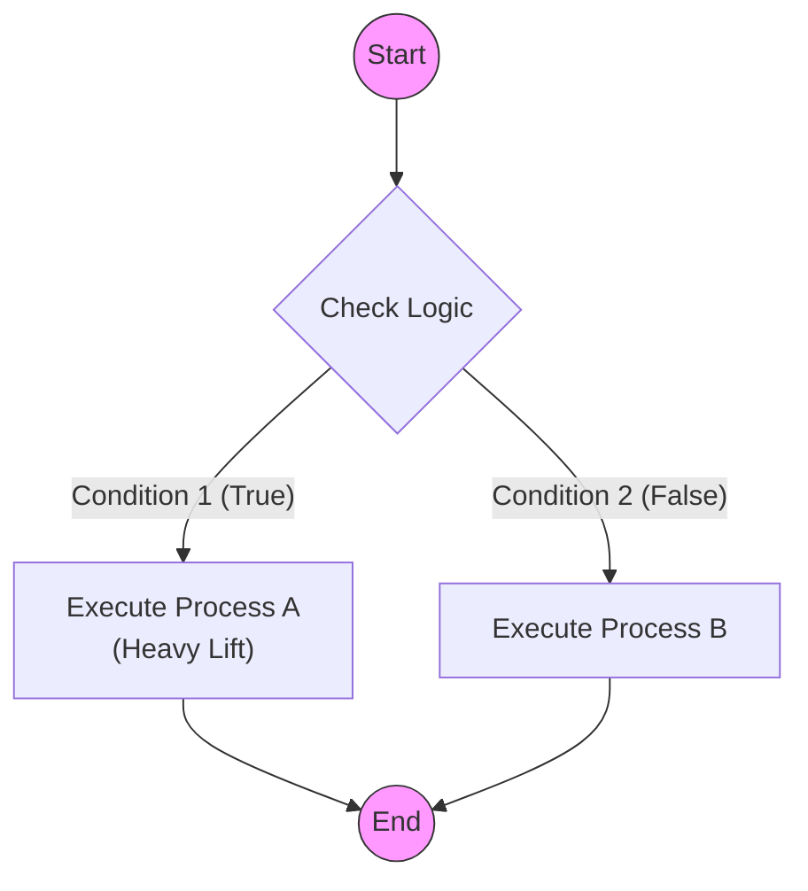
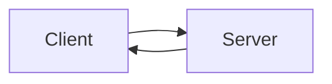
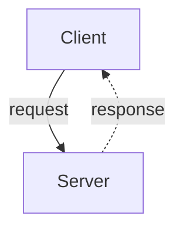
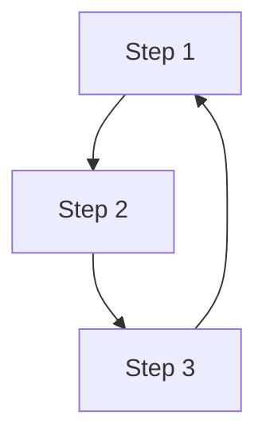
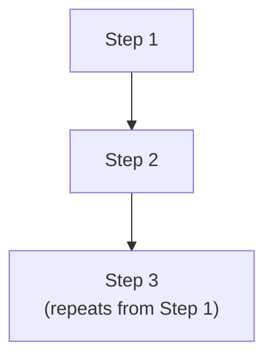
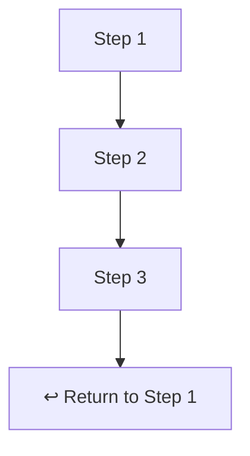
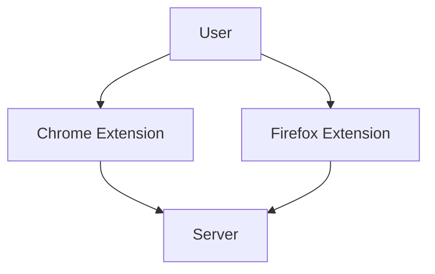
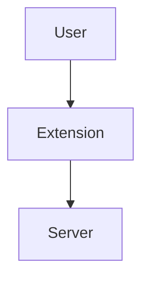

# 0006 - Mermaid Diagram Standards

## 1. Philosophy
Visual documentation is code. It must be maintained, versioned, and readable. We use **Mermaid.js** because it renders natively in GitHub and requires no binary assets.

## 2. Standard Diagram Types

### 2.1 Flowcharts (Logic & Process)
* **Type:** `flowchart TD` (Top-Down).
* **Use Case:** User flows, decision logic, system sequences.
* **Constraint:** Do not use `stateDiagram-v2` for complex logic; it lacks layout control and often results in "routing spaghetti."

### 2.2 Sequence Diagrams (Interaction)
* **Type:** `sequenceDiagram`.
* **Use Case:** API calls, message passing between agents.

## 3. The "Router Pattern"
To keep flowcharts clean, avoid connecting every node to every other node directly. Use a central "Router" decision diamond.

**Bad (Spaghetti):**
* Node A -> Node B
* Node A -> Node C
* Node B -> Node A
* Node C -> Node A

**Good (Router):**
* Start -> Router{?}
* Router -->|Condition 1| A[Process A]
* Router -->|Condition 2| B[Process B]
* A --> Router
* B --> Router

## 4. Style & Syntax Guidelines
1.  **Orientation:** Always use `TD` (Top-Down) for vertical scrolling readability.
2.  **Shapes:**
    * `[Rect]`: Standard Process
    * `{Diamond}`: Decision/Router
    * `((Circle))`: Start/Stop
    * `[[Subroutine]]`: Sub-process
3.  **Styling:** Use standard CSS classes if possible, or simple `style` definitions at the bottom of the graph to keep the logic clean.

## 5. Syntax Safety & Parser Compatibility (CRITICAL)
Mermaid parsers (GitHub, Live Editor) are fragile. Follow these escaping rules to prevent rendering errors.

### 5.1 The "Quote Everything" Rule
**ALWAYS** enclose label text in double quotes if it contains spaces, parentheses, or special characters.
* **Bad:** `A -->|No (Block)| B` (Parser interprets `()` as shape definition)
* **Good:** `A -->|"No (Block)"| B`
* **Bad:** `id[User Input]` (Space can confuse parser)
* **Good:** `id["User Input"]`

### 5.2 Line Breaks
Do not use raw newlines or malformed HTML. Use `<br/>` inside quoted strings.
* **Bad:** `Node[Line 1 /br Line 2]` (Invalid tag)
* **Bad:** `Node[Line 1 <br> Line 2]` (Unquoted HTML can break strict parsers)
* **Good:** `Node["Line 1<br/>Line 2"]`

### 5.3 Special Characters
Avoid using `#`, `;`, or `{}` inside text labels unless quoted.
* **Bad:** `Node[Issue #80]`
* **Good:** `Node["Issue #80"]`

## 6. Example Template



## 7. Bidirectional Flow Diagrams

### 7.0 Understanding Dagre (The Layout Engine)

Mermaid does not let you place nodes manually. All node positioning is handled by **dagre** — a JavaScript graph layout algorithm that reads your nodes and edges, then calculates where everything goes.

Dagre works by assigning each node a **rank** (vertical position in TD layouts, horizontal in LR). Edges flow from lower rank to higher rank. When you write `A --> B`, dagre places A at rank 0 and B at rank 1.

**Why this matters:** You cannot control where dagre places nodes or how it routes edges. You can only influence layout by changing the graph structure — adding/removing edges, reordering node definitions, or using invisible nodes. When a diagram renders with lines behind boxes or overlapping elements, the fix is structural (change the graph), not cosmetic (add CSS).

**Key dagre behaviors:**
- Nodes at the same rank are placed side by side
- Edges that go "backward" (high rank → low rank) force dagre to create long, potentially crossing routes
- Subgraph boundaries constrain layout but can interfere with edge routing
- More edges = more layout constraints = less predictable results

### 7.1 The LR Layout Problem

When a diagram has bidirectional connections (A → B and B → A), using `graph LR` creates visual chaos. Mermaid's dagre layout engine positions nodes in columns based on edge direction. Contradicting edge directions cause the algorithm to produce crossing lines and poor layout.

**Example Problem:**

This renders poorly because dagre tries to place Server both "after" Client (for the forward edge) and "before" Client (for the backward edge).

### 7.2 Solution: Use TB + Dashed Response Arrows

For request/response patterns (client-server, API calls, bidirectional communication):

1. **Use `graph TB`** (top-to-bottom) - requests flow down, responses flow up
2. **Use dashed arrows (`-.->`)** for response/return flow to visually differentiate
3. **Place clients at top, servers at bottom** - follows natural reading order

**Good Pattern:**


### 7.3 When LR is Acceptable

Use `graph LR` only for strictly **unidirectional** flows:
- Data pipelines (source → transform → sink)
- State machines (state A → state B → state C)
- Process flows without feedback loops

**Rule of thumb:** If any arrow points "backward" (right-to-left in an LR diagram), switch to TB.

### 7.4 Cyclic and Feedback Flows

Diagrams with cycles (A → B → C → A) are the hardest for dagre to lay out. A backward edge forces dagre to route an arrow from a lower position back to a higher one, which almost always crosses through intermediate nodes.

**The Problem:**



The `C --> A` edge must travel upward past B. Dagre may route it behind B's box — violating §8.3.

**Solutions (in order of preference):**

1. **Eliminate the cycle.** Most cycles in architecture diagrams are conceptual, not literal. If `C --> A` means "the process repeats," remove the arrow and add a note or label instead.



2. **Use a separate "return" node.** Create an explicit return/restart node at the bottom that visually communicates the cycle without a backward edge.



3. **Use dashed arrows for the backward edge.** If the cycle must be shown, use a dashed arrow (`-.->`) to visually distinguish the feedback path. Place the target node at a position where the backward route avoids crossing other nodes.

4. **Split into two diagrams.** If a cycle creates unavoidable layout problems, show the forward flow in one diagram and the feedback mechanism in a second diagram or in prose.

**Never:** Leave a backward edge that routes behind boxes. If visual inspection (§8.4) shows lines behind nodes, restructure the graph using one of the solutions above.

## 8. Visual Quality Rules

These rules prevent common rendering issues that make diagrams confusing.

### 8.1 Simplicity Principle

**Rule:** When multiple components do the same thing with only naming differences, collapse them into a single node.

**Bad:**


**Good:**


**Exception:** Show variants separately only when their interactions differ (different endpoints, different data flows, etc.).

### 8.2 No Touching Elements

**Rule:** All diagram elements must have visual separation. Overlapping or touching boxes indicate a layout problem.

**Causes:**
- Too many nodes at the same level
- Long labels creating wide boxes
- Subgraphs with insufficient padding

**Fixes:**
- Break into multiple diagrams
- Use shorter labels with details in a legend or table
- Add blank lines between node definitions to hint spacing

### 8.3 No Lines Behind Boxes

**Rule:** Edges (arrows) must never render behind or through node boxes. All connection lines must be fully visible.

**Causes:**
- Complex bidirectional flows (see §7)
- Nodes at same rank competing for space
- Subgraph boundaries interfering with edge routing

**Fixes:**
- Switch from `graph LR` to `graph TB`
- Reduce node count (see §8.1)
- Use invisible intermediate nodes to guide routing

### 8.4 Visual Inspection Required

**Rule:** Every Mermaid diagram MUST be visually inspected in GitHub preview before committing.

**Checklist:**
- [ ] All labels readable (not truncated)
- [ ] No overlapping elements
- [ ] All arrows visible (not behind boxes)
- [ ] Flow direction is clear
- [ ] Subgraph boundaries don't cut through elements
- [ ] Edge labels legible in dark mode (see §8.6)
- [ ] Custom fill colors visible in both light and dark mode (see §8.6)

**Tool:** Use [Mermaid Live Editor](https://mermaid.live) for rapid iteration before committing.

### 8.5 Agent Auto-Inspection Procedure

**For AI agents (Claude Code):** You MUST render and visually inspect every diagram before committing.

**Procedure:**

```bash
# 1. Base64 encode the Mermaid diagram
DIAGRAM=$(cat <<'EOF' | base64 -w 0
graph TB
    User((User)) --> Ext[Extension]
    Ext --> Lambda[Lambda Service]
EOF
)

# 2. Download rendered PNG from mermaid.ink
curl -s -o /path/to/scratchpad/diagram.png "https://mermaid.ink/img/$DIAGRAM"

# 3. Use Read tool to view the image (you are multimodal)
# Read the PNG file and visually verify all checks pass
```

**Why this works:** Claude Code is a multimodal LLM and can view images via the Read tool. The mermaid.ink service renders diagrams to PNG via URL.

**Inspection Report Format:**

After viewing the rendered diagram, document your findings:

```
**Mermaid Auto-Inspection:**
- Touching elements: ✅ None / ❌ [describe]
- Hidden lines: ✅ None / ❌ [describe]
- Label readability: ✅ Pass / ❌ [describe]
- Flow clarity: ✅ Clear / ❌ [describe]
```

**If ANY check fails:** Fix the Mermaid code and re-render until all checks pass.

### 8.6 Dark Mode Compatibility

GitHub renders Mermaid diagrams differently in light and dark mode. The diagram background, default node fills, and edge label colors all change. Custom `style` directives that look good in light mode may be invisible or illegible in dark mode.

**Rules:**

1. **Test in both modes.** Every diagram with custom `style` fills MUST be verified in both light and dark mode on GitHub.

2. **Avoid low-contrast fills.** Colors that work in light mode may fail in dark mode:

| Fill Color | Light Mode | Dark Mode | Verdict |
|-----------|------------|-----------|---------|
| `#f9d71c` (yellow) | ✅ Good | ⚠️ Check contrast with dark text | Test |
| `#4ade80` (green) | ✅ Good | ✅ Usually OK | OK |
| `#8b5cf6` (purple) | ✅ Good with white text | ✅ Usually OK | OK |
| `#60a5fa` (blue) | ✅ Good | ✅ Usually OK | OK |
| `#334155` (dark gray) | ✅ Good | ❌ Invisible on dark background | Avoid |
| `#f8fafc` (near-white) | ❌ Invisible on white | ✅ Good on dark | Avoid |

3. **Edge labels are vulnerable.** GitHub's dark mode renders edge label text in a gray that can be nearly invisible against the dark diagram background. Diagrams with important edge labels (conditional flows, data descriptions) should be visually checked for label legibility.

4. **Prefer no custom fills.** The safest approach is to use Mermaid's default styling and let GitHub handle theming. Only add custom `style` directives when color conveys semantic meaning (e.g., green for success, red for failure, yellow for warning).

5. **When custom fills are required,** use colors with high contrast against both white and dark backgrounds. Saturated mid-tones (not too light, not too dark) work best in both modes.

### 8.7 Playwright-Based Visual Inspection

GitHub renders Mermaid diagrams inside `<iframe>` elements. Playwright accessibility snapshots cannot penetrate iframes — **screenshots are the only way to verify rendered diagrams on GitHub.**

**When to use Playwright inspection:**
- Auditing existing diagrams across repos
- Verifying diagrams after wiki or README updates
- Checking dark mode compatibility

**Procedure:**

1. **Navigate to the page** containing the Mermaid diagram (wiki page, README, markdown file on GitHub).

2. **Take a screenshot** in the current theme mode:
```
Use Playwright: browser_take_screenshot (captures viewport)
```

3. **Switch theme** (GitHub Settings → Appearance → Dark/Light) and take a second screenshot.

4. **Inspect both screenshots** against the §8.4 checklist, plus:
   - Edge labels legible in both modes
   - Custom fill colors visible in both modes
   - No elements lost against the background

**Limitation:** GitHub-rendered Mermaid is inside iframes. The `browser_snapshot` accessibility tool returns `[iframe]` placeholders — it cannot read diagram content. Always use `browser_take_screenshot` for visual inspection.

**Complementary approach:** The mermaid.ink rendering service (§8.5) renders diagrams independently of GitHub's theme. Use it for rapid iteration during authoring. Use Playwright for final verification of how GitHub actually renders the diagram.
