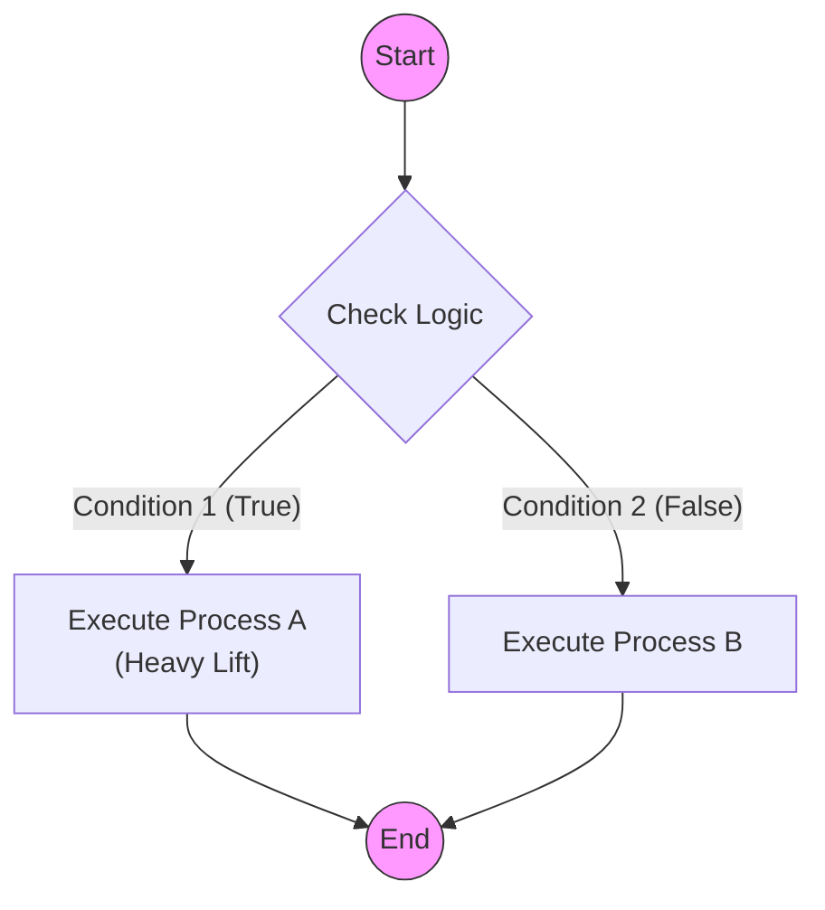
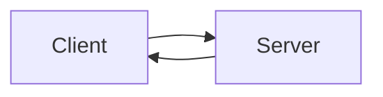
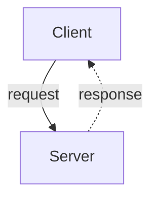
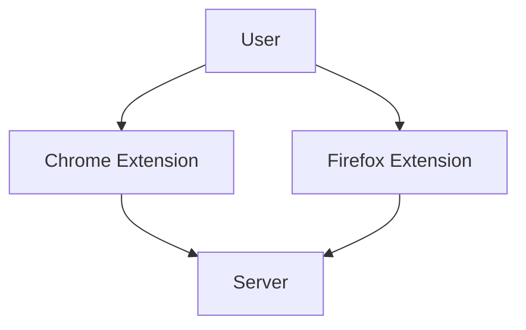
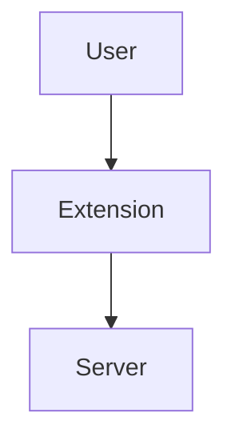

# 0006 - Mermaid Diagram Standards

## 1. Philosophy
Visual documentation is code. It must be maintained, versioned, and readable. We use **Mermaid.js** because it renders natively in GitHub and requires no binary assets.

## 2. Standard Diagram Types

### 2.1 Flowcharts (Logic & Process)
* **Type:** `flowchart TD` (Top-Down).
* **Use Case:** User flows, decision logic, system sequences.
* **Constraint:** Do not use `stateDiagram-v2` for complex logic; it lacks layout control and often results in "routing spaghetti."

### 2.2 Sequence Diagrams (Interaction)
* **Type:** `sequenceDiagram`.
* **Use Case:** API calls, message passing between agents.

## 3. The "Router Pattern"
To keep flowcharts clean, avoid connecting every node to every other node directly. Use a central "Router" decision diamond.

**Bad (Spaghetti):**
* Node A -> Node B
* Node A -> Node C
* Node B -> Node A
* Node C -> Node A

**Good (Router):**
* Start -> Router{?}
* Router -->|Condition 1| A[Process A]
* Router -->|Condition 2| B[Process B]
* A --> Router
* B --> Router

## 4. Style & Syntax Guidelines
1.  **Orientation:** Always use `TD` (Top-Down) for vertical scrolling readability.
2.  **Shapes:**
    * `[Rect]`: Standard Process
    * `{Diamond}`: Decision/Router
    * `((Circle))`: Start/Stop
    * `[[Subroutine]]`: Sub-process
3.  **Styling:** Use standard CSS classes if possible, or simple `style` definitions at the bottom of the graph to keep the logic clean.

## 5. Syntax Safety & Parser Compatibility (CRITICAL)
Mermaid parsers (GitHub, Live Editor) are fragile. Follow these escaping rules to prevent rendering errors.

### 5.1 The "Quote Everything" Rule
**ALWAYS** enclose label text in double quotes if it contains spaces, parentheses, or special characters.
* **Bad:** `A -->|No (Block)| B` (Parser interprets `()` as shape definition)
* **Good:** `A -->|"No (Block)"| B`
* **Bad:** `id[User Input]` (Space can confuse parser)
* **Good:** `id["User Input"]`

### 5.2 Line Breaks
Do not use raw newlines or malformed HTML. Use `<br/>` inside quoted strings.
* **Bad:** `Node[Line 1 /br Line 2]` (Invalid tag)
* **Bad:** `Node[Line 1 <br> Line 2]` (Unquoted HTML can break strict parsers)
* **Good:** `Node["Line 1<br/>Line 2"]`

### 5.3 Special Characters
Avoid using `#`, `;`, or `{}` inside text labels unless quoted.
* **Bad:** `Node[Issue #80]`
* **Good:** `Node["Issue #80"]`

## 6. Example Template



## 7. Bidirectional Flow Diagrams

### 7.1 The LR Layout Problem

When a diagram has bidirectional connections (A → B and B → A), using `graph LR` creates visual chaos. Mermaid's dagre layout engine positions nodes in columns based on edge direction. Contradicting edge directions cause the algorithm to produce crossing lines and poor layout.

**Example Problem:**

This renders poorly because dagre tries to place Server both "after" Client (for the forward edge) and "before" Client (for the backward edge).

### 7.2 Solution: Use TB + Dashed Response Arrows

For request/response patterns (client-server, API calls, bidirectional communication):

1. **Use `graph TB`** (top-to-bottom) - requests flow down, responses flow up
2. **Use dashed arrows (`-.->`)** for response/return flow to visually differentiate
3. **Place clients at top, servers at bottom** - follows natural reading order

**Good Pattern:**


### 7.3 When LR is Acceptable

Use `graph LR` only for strictly **unidirectional** flows:
- Data pipelines (source → transform → sink)
- State machines (state A → state B → state C)
- Process flows without feedback loops

**Rule of thumb:** If any arrow points "backward" (right-to-left in an LR diagram), switch to TB.

## 8. Visual Quality Rules

These rules prevent common rendering issues that make diagrams confusing.

### 8.1 Simplicity Principle

**Rule:** When multiple components do the same thing with only naming differences, collapse them into a single node.

**Bad:**


**Good:**


**Exception:** Show variants separately only when their interactions differ (different endpoints, different data flows, etc.).

### 8.2 No Touching Elements

**Rule:** All diagram elements must have visual separation. Overlapping or touching boxes indicate a layout problem.

**Causes:**
- Too many nodes at the same level
- Long labels creating wide boxes
- Subgraphs with insufficient padding

**Fixes:**
- Break into multiple diagrams
- Use shorter labels with details in a legend or table
- Add blank lines between node definitions to hint spacing

### 8.3 No Lines Behind Boxes

**Rule:** Edges (arrows) must never render behind or through node boxes. All connection lines must be fully visible.

**Causes:**
- Complex bidirectional flows (see §7)
- Nodes at same rank competing for space
- Subgraph boundaries interfering with edge routing

**Fixes:**
- Switch from `graph LR` to `graph TB`
- Reduce node count (see §8.1)
- Use invisible intermediate nodes to guide routing

### 8.4 Visual Inspection Required

**Rule:** Every Mermaid diagram MUST be visually inspected in GitHub preview before committing.

**Checklist:**
- [ ] All labels readable (not truncated)
- [ ] No overlapping elements
- [ ] All arrows visible (not behind boxes)
- [ ] Flow direction is clear
- [ ] Subgraph boundaries don't cut through elements

**Tool:** Use [Mermaid Live Editor](https://mermaid.live) for rapid iteration before committing.

### 8.5 Agent Auto-Inspection Procedure

**For AI agents (Claude Code):** You MUST render and visually inspect every diagram before committing.

**Procedure:**

```bash
# 1. Base64 encode the Mermaid diagram
DIAGRAM=$(cat <<'EOF' | base64 -w 0
graph TB
    User((User)) --> Ext[Extension]
    Ext --> Lambda[Lambda Service]
EOF
)

# 2. Download rendered PNG from mermaid.ink
curl -s -o /path/to/scratchpad/diagram.png "https://mermaid.ink/img/$DIAGRAM"

# 3. Use Read tool to view the image (you are multimodal)
# Read the PNG file and visually verify all checks pass
```

**Why this works:** Claude Code is a multimodal LLM and can view images via the Read tool. The mermaid.ink service renders diagrams to PNG via URL.

**Inspection Report Format:**

After viewing the rendered diagram, document your findings:

```
**Mermaid Auto-Inspection:**
- Touching elements: ✅ None / ❌ [describe]
- Hidden lines: ✅ None / ❌ [describe]
- Label readability: ✅ Pass / ❌ [describe]
- Flow clarity: ✅ Clear / ❌ [describe]
```

**If ANY check fails:** Fix the Mermaid code and re-render until all checks pass.
