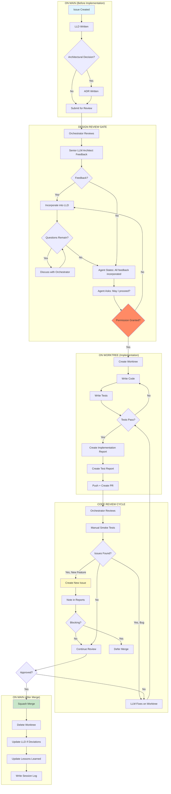

# 0004 - Orchestration Protocol

## 1. The "Single-User Orchestrator" Model
To eliminate the friction of managing multiple GitHub accounts and the cost of Organization seats, this project operates under a **Single-User Orchestration** model.

* **The Human (Orchestrator):** You (`martymcenroe`) are the sole authenticated user. You execute all commands and authorize all code.
* **The AI (Mentor):** The AI functions as a "Bespoke Accelerated Mentor," generating CLI instructions for the Orchestrator to execute.
* **Attribution:** All commits are authored by `martymcenroe`. We do not use separate "bot" accounts for AI-generated code.

## 2. Tooling Constraints
* **CLI Exclusive:** All interactions must occur via the command line (`bash` or `zsh`).
* **GitHub CLI (`gh`):** Used for Issue tracking (`gh issue`) and Pull Requests (`gh pr`).
* **Git (`git`):** Used for version control.
* **No GUIs:** Do not rely on the GitHub web interface or IDE buttons for core workflow tasks.

## 3. The "Flip Turn" Workflow (12 Steps)
Every feature or fix must strictly follow this 12-step execution loop to ensure hygiene and recoverability.

| Step | Action | Command Pattern |
| :--- | :--- | :--- |
| **1. Issue** | Discovery & Claim | `gh issue create` or `gh issue list` |
| **2. Docs** | Write LLD (on main) | Create/edit `docs/lld/active/{ID}-feature.md` |
| **3. Review** | Auto-invoke Gemini 3 Pro | `tools/gemini-model-check.sh` with `lld-review.txt` |
| **4. Iterate** | Incorporate feedback | Address [BLOCKING] and [HIGH] issues in LLD |
| **5. Gate** | Request permission | State: "LLD review complete. May I proceed?" |
| **6. Worktree** | Isolation (after approval) | `git worktree add ../Aletheia-ID -b ID-desc` |
| **7. Code** | Implementation | Edit source files |
| **8. Commit** | Save | `git commit -m "type: desc (ref #ID)"` |
| **9. Push** | Team Visibility (REQUIRED) | `git push -u origin HEAD` |
| **10. PR** | Review | `gh pr create --fill` |
| **11. Reports** | Document (MANDATORY) | Create `docs/reports/{ID}/` with both reports |
| **12. Cleanup** | Remove worktree + branches | After merge: Execute POST-MERGE GATE (see below) |

### Step 12 Cleanup Checklist (MANDATORY)

After `gh pr merge` succeeds, execute this sequence **immediately**. Do not start new work until cleanup is verified complete.

| # | Action | Command | Verify |
|---|--------|---------|--------|
| 1 | Verify merge | `gh pr view {PR} --json state` | Shows "MERGED" |
| 2 | Remove worktree | `git worktree remove ../Aletheia-{ID}` | No error (use `--force` if needed) |
| 3 | Delete local branch | `git branch -D {branch-name}` | Branch deleted |
| 4 | Verify worktrees | `git worktree list` | Shows ONLY main |
| 5 | Verify branches | `git branch --list` | Shows ONLY `* main` |

**Why `-D` instead of `-d`?** GitHub squash-merges create a new commit SHA. Git sees the branch commits as "not merged" because the SHAs differ. Use `-D` (force) for squash-merged branches.

**Incident 2026-01-09:** Branch `126-hard-soft-blocking` was orphaned because cleanup stopped after worktree removal. The local branch persisted for hours until `/cleanup` flagged it.

**Step 2 Rationale:** LLDs are written on main before any worktree exists. This ensures the plan is reviewed before implementation begins.

**Step 5 Rationale (CRITICAL):** The agent must explicitly ask permission to code. This gate prevents wasted implementation effort on flawed designs.

**Step 6 Rationale:** Worktrees provide complete isolation without affecting main. Never use `git checkout -b` in the main folder. Only create worktree AFTER Step 5 approval.

**Step 9 Rationale:** Remote branches provide backup, enable collaboration between agents, and give the orchestrator visibility into active work. Local-only branches violate team collaboration principles.

**Step 11 Rationale (CRITICAL):** Reports capture institutional knowledge. Without them, the "why" behind implementation decisions is lost forever. See §8.6 for requirements.

**Step 12 Rationale:** Zombie worktrees and remote branches clutter the system. ALWAYS clean up completely after merge.

### 3.1 Gemini Dual-Review Integration

**Step 3 (Review) is now automated using Gemini 3 Pro.** This section documents the dual-AI review system where Claude Code and Gemini CLI collaborate.

#### Overview

Gemini 3 Pro (via `gemini CLI`) acts as a senior architect providing automated reviews at two critical gates:
1. **LLD Review (Step 3)** - Design review before implementation
2. **Implementation Review (Step 11)** - Code review before merge

Both reviews use model downgrade detection to ensure Gemini 3 Pro is used (not downgraded to Flash due to quota exhaustion).

#### LLD Review Automation (Step 3)

**Trigger:** After LLD saved to `docs/lld/active/{ID}-feature.md`

**Process:**
1. Load LLD content
2. Load prompt from `gemini-prompts/lld-review.txt`
3. Invoke `tools/gemini-model-check.sh` with populated prompt
4. Parse feedback using three-tier priority system:
   - **[BLOCKING]** - Must fix (security, correctness, fail-safe gates)
   - **[HIGH]** - Should fix (testing, mocking, data pipeline)
   - **[SUGGESTION]** - Nice to have (performance, maintainability)
5. Update LLD with [BLOCKING] and [HIGH] feedback
6. Proceed to Step 4 (Iterate) if needed, or Step 5 (Gate) if complete

**Exit Codes:**
- `0` - Success (review received, correct model used)
- `1` - Gemini CLI failed (retry once, then abort)
- `2` - Quota exhausted (abort, notify user, log event)
- `3` - Model downgrade detected (abort, notify user)

#### Implementation Review Automation (Step 11)

**Trigger:** After reports created in `docs/reports/{ID}/`

**Process:**
1. Load implementation report + test report
2. Collect file diffs from worktree
3. Load prompt from `gemini-prompts/implementation-review.txt`
4. Invoke `tools/gemini-model-check.sh`
5. Parse decision: **[APPROVE]** or **[BLOCK]**
6. **Dual Approval Gate:** Require BOTH Gemini + User approval
   - If [BLOCK]: Address concerns, re-submit for review
   - If [APPROVE]: Ask user for final approval
   - Only commit/push/merge after dual approval

**Workflow State Tracking:**
File `.claude/workflow-state.json` tracks:
```json
{
  "active_issue": 222,
  "lld_reviewed": true,
  "gemini_approved": true,
  "user_approved": false
}
```

#### Error Handling

| Error | Detection | Response |
|-------|-----------|----------|
| Model downgrade | JSON shows unexpected model | ABORT + notify + log to tmp/gemini-quota-events.jsonl |
| Quota exhausted | 429 error or "Resource exhausted" | ABORT + display reset time + log event |
| Network timeout | Exit code 1 | Retry once, then ABORT |

#### Prompt Library

All prompts versioned in `gemini-prompts/`:
- `lld-review.txt` - LLD design review
- `implementation-review.txt` - Implementation code review
- `issue-review.txt` - Issue completeness check (future use)
- `session-log.txt` - Session summary (future use)

See `CLAUDE.md` § "Gemini Dual-Review Integration" and `docs/0602-skill-gemini-dual-review.md` for complete specifications.

## 4. Emergency Recovery
If the session context is lost or the environment destabilizes, strict **Emergency Recovery Mode** is active.

1.  **Stop:** Do not execute further changes.
2.  **Single-Instruction Constraint:** The AI must downgrade to **One Command Per Turn**. Do not batch commands. Wait for explicit user confirmation after every action.
3.  **Ground Truth:** Run `git status` to establish the state of the workspace before proceeding.
4.  **Sync:** Pull from `main` to ensure local state matches upstream.
5.  **Forbidden Commands:** NEVER use destructive commands in emergency recovery: `git reset`, `git push --force`, `git clean -fd`. See `docs/0002-coding-standards.md` Section 2 for complete list and safe alternatives.

## 5. Session Logging

At the end of each working session, AI agents MUST append a summary to `docs/session-logs/YYYY-MM-DD.md`:

1. **Timestamp & Model:** `## YYYY-MM-DD HH:MM CT | Model Name`
2. **Summary:** 1-2 sentence overview
3. **Files Modified:** List of changed files
4. **Issues Closed/Created:** Issue numbers
5. **Open Questions:** Unresolved items for next session
6. **State on Exit:** Branch, open PRs, last commit SHA

**Day boundary:** 3:00 AM CT to following day 2:59 AM CT (work at 2am goes in previous day's log).

Session logs are **tracked in git** and provide continuity across sessions and agents. See `docs/0100-TEMPLATE-GUIDE.md` for the full entry template.

## 6. Mini-Sprint Protocol

A **Mini-Sprint** is a bounded unit of work containing 1-3 related issues that should be completed atomically by a single AI agent.

### 6.1 Rules
1. **Single Owner:** Only ONE AI agent works on a mini-sprint at a time.
2. **Declared Scope:** The mini-sprint scope is declared at start (issue numbers, branches).
3. **No Handoff Mid-Sprint:** If the owning AI exhausts its session, the human should:
   - Work on UNRELATED tasks with another AI, OR
   - Wait for the original AI to resume
4. **Completion Criteria:** All issues closed, all branches merged, documentation updated.

### 6.2 Tracking
- **GitHub Projects (Kanban):** Create a "Sprint" column. Move issues there when sprint starts.
- **Session Log:** Note active mini-sprint at session start/end.
- **Issue Labels:** Consider `sprint:active` label to visually mark in-flight work.

### 6.3 Declaration Format
At mini-sprint start, the AI declares:

> **MINI-SPRINT DECLARED**
> - Owner: Claude Opus 4.5
> - Issues: #73, #74
> - Branches: `73-whitelist-toggle`, `74-action-feedback`
> - Target: Whitelist UX + Action Feedback
> - Status: Planning

### 6.4 Handoff (Emergency Only)
If handoff is unavoidable:
1. Update session log with full context
2. Commit all work-in-progress (even if incomplete)
3. Add comment to each issue: "WIP: [state description]"
4. New AI must read session log + issue comments before proceeding

## 7. The Multi-Model Verification Protocol
To ensure robustness and security, we utilize a "Red Team / Blue Team" workflow between different AI models.

### 7.1 Roles
* **The Builder (e.g., Claude/Gemini A):** Generates code, UI, and creative assets.
* **The Checker (e.g., Gemini/Claude B):** Reviews inputs against Security, Privacy, and Standards constraints.
* **The Orchestrator (User):** Manages the handoff and makes final decisions.

### 7.2 The 3-Pass Review Cycle
For critical features (security-related, privacy-impacting, external API changes, or >500 LOC), we execute three distinct review passes:
1.  **Pass 1 (Requirements):** The Checker reviews the GitHub Issues/Objectives for architectural viability and privacy risks *before* code is written.
2.  **Pass 2 (Design):** The Checker reviews the Low-Level Design (LLD) or Specs generated by the Builder.
3.  **Pass 3 (Final Artifact):** The Checker reviews the final code/documentation/assets before the Merge to Main.

### 7.3 Handoff Format
When passing context between models, the Orchestrator shall provide:
* The raw content (Code/Text).
* The specific "Lens" for review (e.g., "Review for Privacy," "Review for Coding Standards").
* The Issue numbers being reviewed.
* Any prior review feedback to incorporate (if Pass 2 or 3).

## 8. Feature Development Lifecycle

Every feature produces three document types that work together:

| Document | Purpose | Analogy |
|----------|---------|---------|
| **LLD (1xxx)** | The Plan | Architectural blueprints |
| **Implementation Report** | The Narrative | Construction journal |
| **Test Report** | The Evidence | Building inspection certificate |

### 8.1 Document Lifecycle Diagram



**Note:** The orange diamond (Permission Granted?) is the critical gate. No code is written until the agent explicitly asks and receives permission.

### 8.2 Document Locations

All documents live on `main` after merge:

```
docs/
├── 1{IssueID}-{feature-name}.md     # LLD (plan)
├── reports/
│   └── {IssueID}/
│       ├── implementation-report.md  # Narrative
│       ├── test-report.md            # Evidence
│       └── test-output.log           # Raw pytest output (optional)
```

### 8.3 When to Update LLD on Main

Update the LLD on main **immediately** during implementation if:
- Deviation from plan (changed interfaces, different algorithms, added/removed components)
- New requirements emerge
- Architectural change needed

This protects against context loss if session terminates unexpectedly. The Implementation Report then documents what changed and why.

### 8.4 Willison Protocol Integration

*"Your job is to deliver code you have proven to work."* — Simon Willison

Every feature must comply with the Willison Protocol (see `0005` Section 5):

1. **Manual Testing:** See it work, capture proof
2. **Automated Testing:** Write tests that fail on revert
3. **Proof in Test Report:** Include terminal output, screenshots, or logs

### 8.5 Orchestrator Review Notes

Orchestrator feedback is captured in both reports via LLM updates:

**In Implementation Report:**
- In-Scope Observations (about this feature)
- New-Scope Observations (warrant new issues)
- Meta Observations (process improvements)

**In Test Report:**
- Manual Verification results
- Issues discovered during testing

### 8.6 Issue Closure Requirements (MANDATORY)

Before an issue can be marked closed (via PR merge or manual close), the following MUST exist:

| Requirement | Location | Exception |
|-------------|----------|-----------|
| **Implementation Report** | `docs/reports/{IssueID}/implementation-report.md` | None |
| **Test Report** | `docs/reports/{IssueID}/test-report.md` | None |
| **Inventory Updated** | `docs/0003-file-inventory.md` | No new files created |

**Process:**
1. Before merging PR that closes an issue, verify reports exist
2. If reports missing, create them BEFORE merge
3. Run `0802-reports-completeness-audit.md` periodically to catch gaps

**Why This Matters:**
Issue #121 was closed via PR merge without reports. This gap was discovered days later. Reports capture institutional knowledge that would otherwise be lost.
