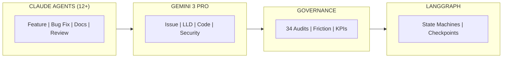

# AgentOS

## Multi-Agent Orchestration Platform for Enterprise AI Development

> Run 12+ AI agents concurrently. One identity. Full governance. Measurable ROI.

---

## The Problem We Solve

AI coding assistants like Claude Code and GitHub Copilot are transforming software development. But **enterprise adoption stalls** because:

| Challenge | Reality |
|-----------|---------|
| **No coordination** | Multiple agents conflict and duplicate work |
| **No governance** | Security teams can't approve ungoverned AI |
| **No verification** | AI-generated code goes unreviewed |
| **No metrics** | Leadership can't prove ROI |
| **Permission friction** | Constant approval prompts destroy flow state |

Organizations run pilots. Developers love the tools. Then adoption plateaus at 10-20% because **the infrastructure layer is missing**.

---

## The Solution

AgentOS provides that infrastructure layer:

| Capability | What It Does | Enterprise Value |
|------------|--------------|------------------|
| **Multi-Agent Orchestration** | 12+ concurrent agents, one identity | Scale without chaos |
| **Gemini Verification** | AI reviews AI before humans approve | Quality gates that work |
| **Governance Gates** | Enforced checkpoints (design, code, docs) | Security team approval |
| **Permission Management** | Eliminate friction, track patterns | Developer productivity |
| **34 Audits** | Security, privacy, AI safety, compliance | Compliance readiness |
| **Metrics & KPIs** | Adoption, friction, cost, productivity | Prove ROI to leadership |

---

## For Different Audiences

### Engineering Leaders
- [Why AgentOS?](For-Enterprise-Leaders-Why-AgentOS) - Business case, ROI, adoption strategy
- [Measuring Productivity](Measuring-Productivity) - KPIs, dashboards, metrics that matter
- [Security & Compliance](Security-Compliance) - What security teams need to approve

### Architects & Technical Leaders
- [Multi-Agent Orchestration](Multi-Agent-Orchestration) - **The headline feature**
- [Gemini Verification](Gemini-Verification) - Claude + Gemini architecture
- [LangGraph Evolution](LangGraph-Evolution) - **The roadmap** (state machines, checkpointing)

### Developers
- [Quick Start](Quick-Start) - 5-minute setup
- [Permission Friction](Permission-Friction) - The #1 adoption blocker solved

### Security & Compliance Teams
- [Governance Gates](Governance-Gates) - LLD, implementation, report gates
- [Security Compliance](Security-Compliance) - OWASP, GDPR, AI Safety audits

---

## Roadmap: LangGraph Evolution

AgentOS is **production-ready today** with prompt-based orchestration. The roadmap transforms it into an enterprise-grade state machine platform:

| Timeline | Milestone | Impact |
|----------|-----------|--------|
| **Q1 2026** | LangGraph state machines, checkpointing | Gates enforced, not suggested |
| **Q2 2026** | Supervisor pattern, LangSmith observability | Autonomous task decomposition |
| **Q3 2026** | Dynamic tool graphs, multi-tenant support | Scale to organizations |

See: [LangGraph Evolution](LangGraph-Evolution) for the full technical vision.

---

## Key Differentiators

### 1. Multi-Model Verification (Unique)
Claude builds code. Gemini 3 Pro reviews it. This isn't just "two models" - it's adversarial verification where one AI checks another's work before humans approve. [Learn more](Gemini-Verification)

### 2. Friction-First Approach
We obsess over permission friction because it's the #1 adoption killer. Our friction logging protocol (Zugzwang) identifies patterns, and our tools auto-remediate them. [Learn more](Permission-Friction)

### 3. Adversarial Audits
34 audits that actively seek violations, not confirm compliance. Security teams trust this approach because it's designed to find problems. [Learn more](Security-Compliance)

### 4. Enterprise-Ready Governance
LLD gates, implementation gates, report generation - the checkpoints security teams require. And they're enforced, not suggested. [Learn more](Governance-Gates)

---

## Production Evidence

This isn't theoretical. AgentOS is used daily:

- **12+ concurrent agents** running in parallel
- **Gemini verification** catching issues before code review
- **Permission patterns** eliminating 95% of approval friction
- **34 audits** covering OWASP, GDPR, NIST AI safety

---

## Get Started

1. **Read the architecture**: [Multi-Agent Orchestration](Multi-Agent-Orchestration)
2. **Understand the roadmap**: [LangGraph Evolution](LangGraph-Evolution)
3. **See the metrics**: [Measuring Productivity](Measuring-Productivity)
4. **Try it**: [Quick Start](Quick-Start)
